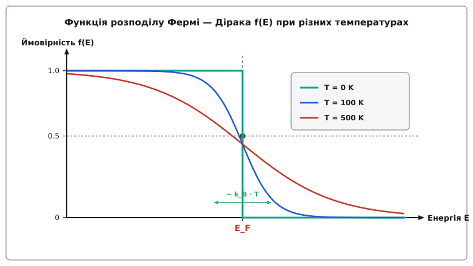
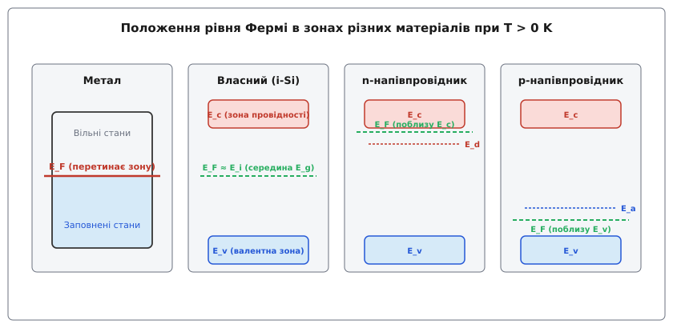
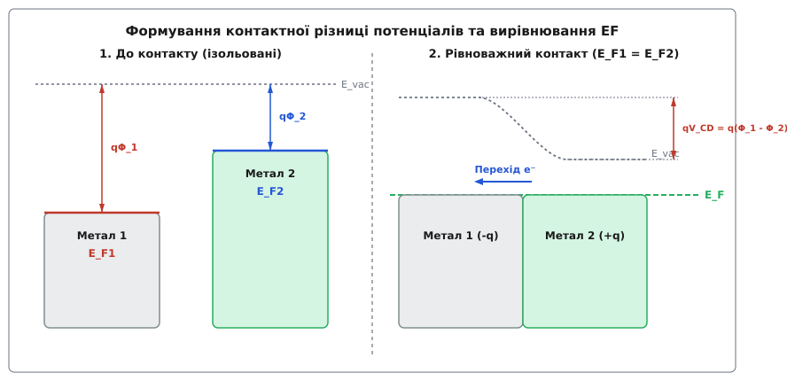

# Рівень Фермі

<preknowlist>
- [Електронні провідники та ізолятори](root:ph-condensed/conductors-insulators) — відмінність між вільними та зв'язаними носіями заряду у кристалічній ґратці.
- [Напівпровідники](root:ph-condensed/semiconductor) — енергетична зонна структура, зона провідності та валентна зона.
- [Допування напівпровідників](root:ph-condensed/doping) — утворення донорних та акцепторних енергетичних рівнів.
</preknowlist>

Коли два різні провідники чи напівпровідники приводять у атомарно чистий електричний контакт, електрони починають миттєво перетікати через межу розподілу, створюючи приповерхневі заряди та внутрішні електричні поля. Це перетікання зумовлене не просторовою концентрацією електронів, а різницею їхнього термодинамічного потенціалу. Електрони в твердому тілі є квантовими частинками — ферміонами з напівцілим спіном, що підкоряються принципу заборони Паулі. Вони заповнюють доступні енергетичні стани в суворому порядку, а середня енергія, що припадає на один доданий електрон у стані термодинамічної рівноваги, задається хімічним потенціалом. У фізиці конденсованого стану цей електрохімічний потенціал носіїв заряду називають **рівнем Фермі** (лат. *aequalis* — рівний / названо на честь італо-американського фізика Енріко Фермі).

У стані термодинамічної рівноваги рівень Фермі приймає єдине постійне значення вздовж усієї замкненої або контактуючої системи матеріалів. Спроба припустити наявність градієнта рівня Фермі у рівноважному стані означала б існування результуючого дифузійного або дрейфового струму без зовнішнього джерела енергії, що прямо суперечить другому початку термодинаміки. Саме вирівнювання рівнів Фермі визначає контактну різницю потенціалів, висоту бар'єрів Шотткі у контактах метал-напівпровідник, величину вбудованого поля в p-n перехід, роботу виходу електронів та напругу холостого ходу сонячних елементів.

---

## 1. Квантово-статистичні витоки: принцип Паулі та статистика Фермі — Дірака

У класичній фізиці частинки можуть володіти будь-якою енергією, а при охолодженні системи до абсолютного нуля їхній хаотичний рух повністю припиняється (`E = 0`). Однак для електронів у кристалічній ґратці ця картина ламається через квантовомеханічну нерозрізненість частинок та принцип заборони Паулі. Електрони володіють напівцілим спіном (`s = 1/2`) і належать до класу ферміонів. Це означає, що у кожному квантовому стані з фіксованим набором квантових чисел (включаючи проекцію спіну) може перебувати не більше одного електрона.

Імовірність того, що квантовий стан із енергією `E` буде заповнений електроном при абсолютній температурі `T`, описується **функцією розподілу Фермі — Дірака**:

```
f(E) = 1 / (exp((E - E_F) / (k_B · T)) + 1)
```

де `E_F` — рівень Фермі, `k_B ≈ 8.617 × 10⁻⁵ еВ/К` — стала Больцмана, а `T` — абсолютна температура в Кельвінах.

З цієї математичної формули безпосередньо випливає фундаментальне фізичне означення: **рівень Фермі `E_F` — це та енергетична мітка, при якій ймовірність заповнення квантового стану дорівнює точно `0.5` (50%) при будь-якій температурі `T > 0 K`.**

```
При E = E_F:
f(E_F) = 1 / (exp(0) + 1) = 1 / (1 + 1) = 1/2
```


*Функція розподілу Фермі — Дірака f(E) при абсолютному нулю (ступенева функція) та при скінченній температурі, що ілюструє симетричне розмиття ймовірності навколо рівня Фермі.*

Розглянемо поведінку функції розподілу у двох температурних гранях:

### 1. Абсолютний нуль (T = 0 K) та сфера Фермі

При `T = 0 K` експоненціальний член у знаменнику стає розривним:
* Для будь-якої енергії нижче рівня Фермі (`E < E_F`): різниця `(E - E_F) < 0`, тому `exp(-∞) = 0`, і ймовірність `f(E) = 1`. Усі квантові стани повністю заповнені електронами.
* Для будь-якої енергії вище рівня Фермі (`E > E_F`): різниця `(E - E_F) > 0`, тому `exp(+∞) = ∞`, і ймовірність `f(E) = 0`. Усі стани є повністю порожніми.

При `T = 0 K` рівень Фермі набуває строгого значення **енергії Фермі `E_F0`** — максимальної кінетичної енергії, яку можуть мати електрони системи на самому дні температурного занурення.

Інтегруючи тривимірну густину станів `g(E) = (1 / (2 π²)) · (2 m* / ℏ³)³ᐟ² · √E` від `0` до `E_F0`, можна виразити енергію Фермі через об'ємну концентрацію електронів `n`:

```
E_F0 = (ℏ² / (2 · m*)) · (3 · π² · n)²ᐟ³
```

Для реальних металів це рівняння дає вражаючі значення:
* **Мідь (Cu, n = 8.49 × 10²² см⁻³):** `E_F0 = 7.00 еВ`, `v_F = 1.57 × 10⁶ м/с`, `T_F = 81 600 K`.
* **Алюміній (Al, n = 18.1 × 10²² см⁻³):** `E_F0 = 11.7 еВ`, `v_F = 2.03 × 10⁶ м/с`, `T_F = 136 000 K`.
* **Срібло (Ag, n = 5.86 × 10²² см⁻³):** `E_F0 = 5.49 еВ`, `v_F = 1.39 × 10⁶ м/с`, `T_F = 63 800 K`.

У тривимірному квазіімпульсному `k`-просторі заповнені стани утворюють суцільну сферу — **сферу Фермі**, радіус якої дорівнює волновому вектору Фермі `k_F = (3 · π² · n)¹ᐟ³`. Навіть при абсолютному нулю, коли атомна ґратка повністю нерухома, електрони продовжують хаотично рухатися з колосальними швидкостями `v_F ~ 10⁶ м/с` через квантовий тиск виродження, зумовлений принципом Паулі.

### 2. Скінченна температура (T > 0 K) та тепловий розмив

З підвищенням температури тепловий рух агітує електрони поблизу межі. Ступенева функція розмивається на енергетичному інтервалі товщиною порядка `~ 2–4 · k_B · T`. При кімнатній температурі (`T = 300 K`) характерна величина теплової енергії становить `k_B · T ≈ 0.0259 еВ` (25.9 меВ).

Розмиття є строго симетричним відносно точки `E_F`: ймовірність знайти електрон на енергію `ΔE` вище рівня Фермі дорівнює ймовірності знайти вакантний стан (дірку) на таку саму відстань `ΔE` нижче рівня Фермі:

```
f(E_F + ΔE) = 1 - f(E_F - ΔE)
```

Завдяки цьому розмиттю електрони, що розташовані у вузькій смузі `~ k_B · T` навколо `E_F`, отримують можливість переходити на вищі вільні рівні при нагріванні або прикладанні електричного поля. Електрони, розташовані глибоко під рівнем Фермі (`E_F - E >> k_B · T`), заблоковані принципом Паулі і не беруть участі у теплоємності чи електропровідності.

Детальний перебіг наукових дискусій 1920-х років між Фермі, Діраком та Зоммерфельдом, який привів до розв'язання парадоксу електронної теплоємності металів, описано у вставці [📜 Історія статистики Фермі — Дірака та квантової теорії металів](root:ph-condensed/fermi-level/hist-fermi-dirac.md).

---

## 2. Рівень Фермі як хімічний та електрохімічний потенціал електронів

З точки зору класичної та квантової термодинаміки, рівень Фермі є не просто позначкою на енергетичній діаграмі, а фундаментальною функцією стану — **хімічним потенціалом `μ` електронного газу**.

За визначенням Гіббса, хімічний потенціал `μ` дорівнює зміні вільної енергії Гельмгольца `F` (або енергії Гіббса `G`) системи при додаванні одного електрона за умови постійної температури та об'єму:

```
μ = (∂F / ∂N)_{T, V} = (∂G / ∂N)_{T, P}
```

У фізиці твердого тіла зручно розділяти загальну енергію електрона на дві складові:
1. **Внутрішній хімічний потенціал `μ_int`** — зумовлений кінетичною енергією електронів, квантовою густиною станів у кристалічній ґратці та міжатомними взаємодіями.
2. **Електростатичний потенціал `q · ϕ`** — зумовлений макроскопічним електричним полем у даній точці простору (де `q = -e` — заряд електрона, `ϕ` — локальний електростатичний потенціал).

Сума цих двох величин утворює **електрохімічний потенціал `μ̄`**:

```
E_F ≡ μ̄ = μ_int - e · ϕ
```

Саме електрохімічний потенціал `μ̄` виступає дійсним "рівнем Фермі" у неоднорідних системах, контактах та під дією зовнішніх полів.

```
Умова термодинамічної рівноваги:
∇E_F = ∇μ̄ = 0   ⇒   E_F = const уздовж всієї системи
```

Якщо у системі виникає градієнт електрохімічного потенціалу `∇E_F ≠ 0`, це призводить до появи результуючої густини електричного струму `j`:

```
j = (σ / e) · ∇E_F
```

де `σ` — питома електропровідність матеріалу. Якщо `∇E_F = 0`, струм відсутній, і система перебуває в стані термодинамічного спокою.

### Вольта-потенціал, Гальвані-потенціал та робота виходу

Для повного розуміння електростатичних властивостей контакту слід розрізняти три види потенціалів:
* **Внутрішній потенціал Гальвані `ϕ_in`** — повний електростатичний потенціал всередині об'єму кристала.
* **Зовнішній потенціал Вольта `ϕ_out`** — потенціал точки безпосередньо за межами дії поверхневих сил притягання (на відстані `~ 10⁻⁵ см` від поверхні).
* **Поверхневий стрибок потенціалу `χ_surf = ϕ_in - ϕ_out`** — зумовлений виходом електронної хмари за атомарний каркас ґратки та утворенням поверхневого дипольного шару.

Робота виходу електрона `q · Φ` пов'язує рівень Фермі `E_F` з рівнем вакууму `E_vac`:

```
q · Φ = E_vac - E_F = - e · ϕ_out - E_F
```

Коли два провідники з роботами виходу `Φ_1` та `Φ_2` приводять у контакт, вирівнювання рівнів Фермі створює між їхніми зовнішніми поверхнями різницю Вольта-потенціалів, яка дорівнює контактній різниці потенціалів `V_CD = Φ_1 - Φ_2`.

### Температурна залежність хімічного потенціалу μ(T)

Часто виникає запитання: чи тотожні поняття "енергія Фермі `E_F0`" та "рівень Фермі `E_F`"? Вони збігаються строго лише при `T = 0 K`.

При підвищенні температури хімічний потенціал `μ(T)` починає зміщуватися, оскільки густина станів `g(E)` у тривимірному кристалі не є симетричною відносно `E_F` (вона зростає як `√E`). Щоб зберегти загальне число електронів при розмитті функції Фермі, рівень `μ(T)` змушений трохи опускатися.

Математичний аналіз цього зсуву здійснюється за допомогою розкладу Зоммерфельда, який для параболічної зони дає квадратичну температурну залежність:

```
μ(T) = E_F0 · [1 - (π² / 12) · (k_B · T / E_F0)²]
```

Для металів із великою енергією Фермі (`E_F0 ≈ 5 еВ`) температурна поправка при `T = 300 K` становить менше `0.01%`, тому в металах різницею між `μ(T)` та `E_F0` зазвичай нехтують. Проте в напівпровідниках, де концентрація вільних носіїв змінюється на порядки, температурний зсув рівня Фермі є вельми істотним.

Повний математичний вивід розкладу Зоммерфельда, розрахунок інтегралів Фермі — Дірака та невиродженого больцманівського межі наведено у вставці [🧮 Математичний апарат: розклад Зоммерфельда та температурний зсув хімічного потенціалу](root:ph-condensed/fermi-level/math-fermi-integrals.md).

---

## 3. Положення рівня Фермі у зоновій структурі матеріалів

Фундаментальна відмінність між металами, напівпровідниками та діелектриками визначається не лише величиною забороненої зони `E_g`, а й тим, де саме відносно дозволених енергетичних зон розташований рівень Фермі.


*Положення рівня Фермі у металі (перетинає дозволену зону), власному напівпровіднику (середина забороненої зони) та при легуванні n-та p-типу.*

### 1. Метали (хороші провідники)

У металах рівень Фермі проходит **всередині дозволеної енергетичної зони** (або у зоні перекриття валентної зони та зони провідності).

Оскільки `E_F` лежить безпосередньо серед високої густини квантових станів `g(E_F) > 0`, для переведення електрона у суміжний вільний стан потрібна нескінченно мала енергія `δE → 0`. При прикладанні навіть найменшої зовнішньої напруги електрони поблизу рівня Фермі прискорюються і створюють високий електричний струм.

У лужних металах (Na, K, Rb) рівень Фермі заповнює звичайну s-зону рівно наполовину, а поверхня Фермі являє собою сферичну форму. У перехідних металах (Fe, Ni, Pt) рівень Фермі перетинає вузьку d-зону з високою густиною станів `g(E_F)`, що обумовлює їхній високий парамагнетизм та специфічні кінетичні властивості.

### 2. Власні (чисті) напівпровідники

У чистому напівпровіднику без домішок при `T = 0 K` валентна зона повністю заповнена електронами, а зона провідності є абсолютно порожньою. Заборонена зона `E_g` не містить дозволених квантових станів (`g(E) = 0`).

З підвищенням температури електрони за рахунок теплових флуктуацій перестрибують через заборонену зону з валентної зони у зону провідності, утворюючи однакову кількість вільних електронів `n` та вільних дірок `p` (`n = p = n_i`).

Рівень Фермі **власного напівпровідника `E_i`** розташовується практично посередині забороненої зони:

```
E_i = (E_c + E_v) / 2 + (3/4) · k_B · T · ln(m_h* / m_e*)
```

де `E_c` — дно зони провідності, `E_v` — стеля валентної зони, `m_e*` та `m_h*` — ефективні маси електрона та дірки. Якщо ефективні маси рівні (`m_e* = m_h*`), рівень Фермі перебуває строго на геометричній середині забороненої зони. Для кремнію при `300 K` через різницю мас (`m_h* ≈ 0.81 m_0`, `m_e* ≈ 1.08 m_0`) рівень `E_i` зміщений нижче геометричної середини приблизно на `0.005 еВ`.

### 3. Леговані напівпровідники (n- та p-типи)

Введення домішкових атомів (допування) кардинально зміщує положення рівня Фермі у забороненій зоні:

* **n-тип (донорне легування):** Донорні атоми (наприклад, фосфор у кремнії) утворюють дозволені енергетичні рівні `E_d` поблизу дна зони провідності (`E_c - E_d ≈ 0.045 еВ`). При кімнатній температурі донори іонізуються, постачаючи величезну кількість вільних електронів у зону провідності (`n ≈ N_d`). Щоб функція Фермі давала високу ймовірність заповнення біля `E_c`, **рівень Фермі зміщується вгору до зони провідності**:

```
E_c - E_F = k_B · T · ln(N_c / N_d)
```

* **p-тип (акцепторне легування):** Акцепторні атоми (наприклад, бор у кремнії) створюють рівні `E_a` поблизу стелі валентної зони (`E_a - E_v ≈ 0.045 еВ`). Вони захоплюють електрони з валентної зони, генеруючи високу концентрацію дірок (`p ≈ N_a`). При цьому **рівень Фермі зміщується вниз до валентної зони**:

```
E_F - E_v = k_B · T · ln(N_v / N_a)
```

При надвисокому рівні легування (`N_d > N_c ≈ 2.8 × 10¹⁹ см⁻³` для Si) рівень Фермі перетинає межу дозволеної зони і входить всередину зони провідності або валентної зони. Такий напівпровідник називають **виродженим** — за своїми електричними властивостями він стає подібним до металу.

### 4. Діелектрики та зазакріплення рівня Фермі (Fermi Level Pinning)

У діелектриках заборонена зона є дуже широкою (`E_g > 4–5 еВ`, наприклад `E_g ≈ 9 еВ` у `SiO_2`). Рівень Фермі лежить глибоко всередині забороненої зони. Ймовірність теплового закидання електронів у зону провідності `exp(-E_g / (2 k_B T))` при кімнатній температурі становить мізерну величину `~ 10⁻⁷⁰`, що обумовлює практично абсолютну відсутність вільних носіїв.

На реальній поверхні кристала через обрив періодичної ґратки виникає висока густина поверхневих електронних станів. Якщо ця густина перевищує `~ 10¹² см⁻² еВ⁻¹`, поверхневі стани захоплюють або віддають носії, утворюючи потужний шар просторового заряду. Це явище носить назву **зазакріплення рівня Фермі (Fermi Level Pinning)**: рівень Фермі на поверхні виявляється "прикутим" до фіксованої енергетичної позначки (зазвичай біля `1/3 E_g` від валентної зони у Si та GaAs), незалежно від роботи виходу нанесеного металу чи об'ємного легування.

---

## 4. Контактоутворюючі, електростатичні та нерівноважні властивості

Рівень Фермі є головним інструментом для побудови енергетичних зонних діаграм напівпровідникових приладів — діодів Шотткі, p-n переходів, гетероструктур та польових транзисторів.

### Робота виходу та контактна різниця потенціалів

Мінімальна енергія, яку необхідно надати електрону на рівні Фермі, щоб видалити його з кристала у вакуум (у точку поза межами дії поверхневих сил притягання `E_vac`), називається **роботою виходу `q · Φ`**:

```
q · Φ = E_vac - E_F
```

Коли два матеріали з різними роботами виходу `Φ_1` та `Φ_2` (і відповідно різними початковими рівнями Фермі `E_F1` та `E_F2`) приводять у контакт, електрони починають перетікати з матеріалу з меншою роботою виходу (вищим `E_F`) у матеріал із більшою роботою виходу (нижчим `E_F`).


*Вирівнювання рівня Фермі на єдину ізоенергетичну лінію при контакті двох металів з утворенням вигину рівня вакууму та контактної різниці потенціалів.*

Цей перехід створює на межі розділу подвійний електричний шар. Перетікання триває доти, доки утворене електростатичне поле не змістить енергетичні зони матеріалів на величину **контактної різниці потенціалів (КРП) `V_CD`**:

```
V_CD = Φ_1 - Φ_2 = (E_F2 - E_F1) / q
```

У стані рівноваги рівень Фермі стає єдиною суцільною горизонтальною лінією на зонній діаграмі всієї системи (`E_F1 = E_F2 = E_F`), а неперервність рівня вакууму змушує енергетичні зони вигинатися біля контактної межі.

Внутрішній потенціальний бар'єр у p-n переході `V_bi` також визначається початковою різницею рівнів Фермі p- та n-областей до контакту:

```
q · V_bi = E_Fn - E_Fp = k_B · T · ln((N_a · N_d) / n_i²)
```

Чисельний алгоритм на мовах C та C++ для розрахунку рівноважного рівня Фермі в напівпровідниках при заданому рівні допування та температурі наведено у вставці [⚙️ Чисельний розрахунок рівноважного рівня Фермі в напівпровідниках](root:ph-condensed/fermi-level/proj-fermi-solver.md).

### Екранування Томаса — Фермі та довжина Дебая

Якщо всередину електронного газу помістити точковий заряд `+Q`, електрони перерозподіляються навколо нього, екрануючи його електричне поле. Зміна електростатичного потенціалу `ϕ(r)` призводить до локального зміщення зон відносно нерухомого рівня Фермі `E_F`.

У наближенні Томаса — Фермі потенціал точкового заряду спадає за експоненціальним законом Юкави:

```
ϕ(r) = (Q / (4 · π · ε_0 · ε_r · r)) · exp(-r / λ_TF)
```

де **довжина екранування Томаса — Фермі `λ_TF`** визначається густиною станів на рівні Фермі `g(E_F)`:

```
λ_TF = √((ε_0 · ε_r) / (e² · g(E_F)))
```

У металах, де густина станів `g(E_F)` є величезною, довжина екранування `λ_TF` становить частки нанометра (`~ 0.05–0.1 нм` — менше атомарного радіуса). Це пояснює, чому у металах статичне електричне поле не може проникнути всередину об'єму і локалізується виключно у тоншому поверхневому шарі. У напівпровідниках `g(E_F)` значно менша, тому довжина екранування (довжина Дебая `L_D = √((ε_0 ε_r k_B T) / (e² n))`) сягає десятків і сотень нанометрів, що уможливлює роботу польових транзисторів (MOSFET).

### Нерівноважні умови: Квазірівні Фермі та умова Бернарда — Дюрафура

При порушенні термодинамічної рівноваги (під дією зовнішньої напруги, освітлення фотонами чи інжекції носіїв) єдиний рівень Фермі **розщеплюється**.

У цьому випадку для окремого опису концентрацій нерівноважних електронів та дірок вводять два незалежних потенціали — **квазірівень Фермі електронів `E_Fn`** та **квазірівень Фермі дірок `E_Fp`**:

```
n = N_c · exp(-(E_c - E_Fn) / (k_B · T))
p = N_v · exp(-(E_Fp - E_v) / (k_B · T))
```

Різниця між квазірівнями Фермі `(E_Fn - E_Fp) = e · V_ext` прямо дорівнює зовнішній прикладеній напрузі `V_ext` або фото-ЕРС. Градієнти квазірівнів Фермі визначають повні електронні та діркові струми (суму дрейфової та дифузійної компонент):

```
j_n = μ_n · n · ∇E_Fn
j_p = μ_p · p · ∇E_Fp
```

У напівпровідникових лазерах високий рівень інжекції носіїв створює інверсію населеностей. Умова генерації когерентного світла — **умова Бернарда — Дюрафура** — вимагає, щоб розщеплення квазірівнів Фермі перевищувало ширину забороненої зони:

```
E_Fn - E_Fp > E_g
```

---

## 5. Практичні вимірювальні методи та інженерне значення

У сучасній фізиці та інженерії матеріалів положення рівня Фермі та робота виходу вимірюються кількома прецизійними методами:

1. **Силова мікроскопія Кельвін-зонда (Kelvin Probe Force Microscopy, KPFM):** Вимірює локальну контактну різницю потенціалів між нанорозмірним вістрям атомно-силового мікроскопа та поверхневою структурою з просторовою роздільною здатністю до кількох нанометрів. Метод дає змогу будувати карти розподілу рівня Фермі у нанотранзисторах та діодах.
2. **Ультрафіолетова та рентгенівська фотоелектронна спектроскопія (UPS / XPS):** Зразок опромінюється фотонами з відомою енергією `h·ν`, які вибивають електрони у вакуум. Вимірюючи спектр кінетичної енергії вилетілих електронів, точно визначають положення рівня Фермі відносно валентної зони та роботи виходу.
3. **Фотоелектронна спектроскопія з кутовим розділенням (ARPES):** Дає можливість безпосередньо візуалізувати тривимірну форму поверхні Фермі та зонний спектр `E(k)` у напівпровідниках, двовимірних матеріалах (графені) та квантових кристалах.

> 🔧 **Навіщо це.**
> Розуміння та розрахунок положення рівня Фермі — це головний інструмент інженера-напівпровідника. При створенні омічного контакту (з низьким опором для затворів чи виводів мікросхеми) підбирають метал із такою роботою виходу, щоб його рівень Фермі вирівнювався з рівнем Фермі напівпровідника без утворення високого потенціального бар'єра. При проектуванні сонячних батарей та світлодіодів розщеплення квазірівней Фермі `(E_Fn - E_Fp)` прямо задає максимально досяжну напругу холостого ходу елемента та спектр випромінюваної фотонної енергії.

Рівень Фермі виступає компасом термодинамічної рівноваги електронів у конденсованому стані. Він об'єднує квантову статистику Паулі, термодинаміку Гіббса та макроскопічну електродинаміку в єдину струнку теорію, на якій тримається весь фундамент сучасної твердотільної електроніки.
