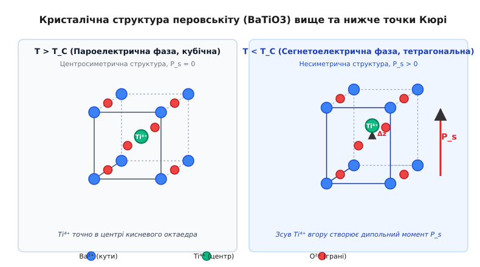
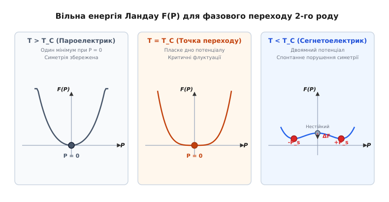
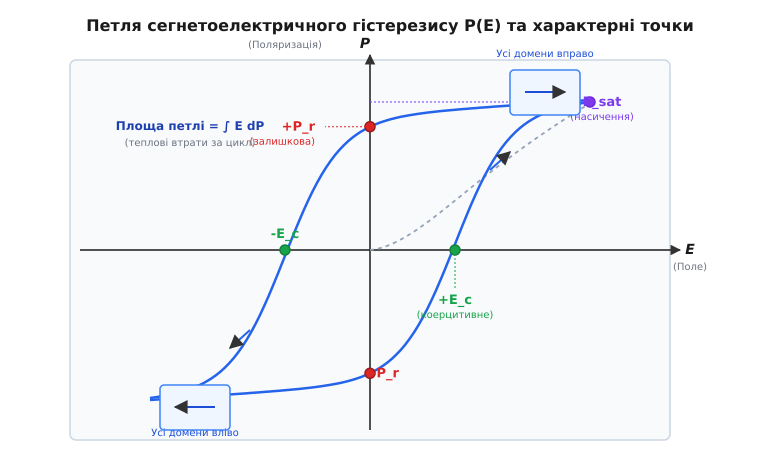
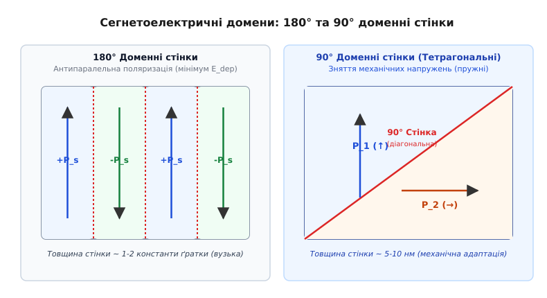

# Сегнетоелектрика та сегнетоелектричні домени

<preknowlist>
- [Температура Кюрі](root:ph-condensed/curie-temperature) — фазовий перехід між упорядкованим і нераціонально-тепловим станами.
- [Закон Кюрі — Вейсса](root:ph-condensed/curie-weiss-law) — розбіжність сприйнятливості поблизу фазового переходу.
- [П'єзоефект](root:ph-condensed/piezoelectric-effect-quartz-resonance) — лінійний зв'язок між механічною деформацією та електричним зарядом.
- [Магнітні домени](root:ph-condensed/magnetic-domains) — області однорідного спонтанного упорядкування для зменшення енергії полів розсіювання.
</preknowlist>

Якщо взяти звичайний багатошаровий керамічний конденсатор (MLCC) на основі титанату барію (`BaTiO3`) і виміряти його ємність при нагріванні, схема зафіксує приголомшливий стрибок: поблизу температури 120 °C діелектрична проникність матеріалу зростає у тисячі разів, досягаючи значень `ε > 10000`, після чого стрімко спадає. Якщо ж вимкнути зовнішнє електричне поле, кристал не повертається до електрично нейтрального стану, а зберігає всередині потужний макроскопічний дипольний момент. Ця властивість — **сегнетоелектрика** *(від назви «сегнетова сіль», лат. Rochelle salt, англ. ferroelectricity — за аналогією з феромагнетизмом)*: здатність кристала володіти спонтанною електричною поляризацією, напрям якої можна перемикати зовнішнім електричним полем.

---

### 1. Загадка спонтанної поляризації та ієрархія діелектриків

У більшості звичайних діелектриків (як-от парафін, кварц чи скло) електрична поляризація `P` виникає виключно під дією зовнішнього поля `E`. Поле зміщує електронні хмари чи іони, вибудовуючи молекулярні диполі, а після зняття напруги хаотичний тепловий рух миттєво руйнує впорядкованість, повертаючи вектор поляризації до нуля.

Вектор макроскопічної поляризації визначається як дипольний момент одиниці об'єму речовини:

```
P = lim_{ΔV → 0} (1 / ΔV) · ∑ p_i   [Кл/м²]
```

Проте існує особливий клас нецентросиметричних кристалів, у яких спонтанна поляризація **`P_s`** *(spontaneous polarization)* існує за відсутності будь-якого зовнішнього електричного поля. Зміщення іонів усередині елементарної комірки кристалічної ґратки створює незкомпенсований електричний дипольний момент. Щоб зрозуміти місце сегнетоелектриків у фізиці твердого тіла, розпишемо строгу термодинамічну та кристалографічну ієрархію кристалічних класів симетрії:

```
Усі кристалічні класи (32 точкові групи симетрії)
 ├── Центросиметричні кристали (11 груп): P_s = 0, п'єзоефект відсутній
 └── Нецентросиметричні кристали (21 група)
      ├── Неп'єзоелектрична група (1 група: 432 — випадкова симетрія)
      └── П'єзоелектрики (20 груп): деформація ↔ електричний заряд
           ├── Неполярні п'єзоелектрики (10 груп): P_s = 0 за відсутності деформації
           └── Піроелектрики (10 полярних груп): спонтанна поляризація P_s = f(T)
                └── Сегнетоелектрики (підгрупа піроелектриків): P_s перемикається полем E
```

1. **П'єзоелектрики**: кристали без центра симетрії (20 груп із 32). Стиск чи розтяг розводить додатні й від'ємні заряди, викликаючи поляризацію, але за відсутності деформації та зовнішнього поля спонтанний дипольний момент дорівнює нулю.
2. **Піроелектрики**: кристали, що мають особлену полярну вісь симетрії (10 груп). Вони володіють спонтанною поляризацією `P_s`, значення якої змінюється при зміні температури (`dP_s / dT ≠ 0`).
3. **Сегнетоелектрики**: підклас піроелектриків, у яких спонтанна поляризація має не один, а два або більше енергетично еквівалентних кристалографічних напрямків у ґратці, між якими її можна **перемикати** зовнішнім електричним полем.

Саме здатність до переорієнтації вектора `P_s` під дією поля визначає фундаментальну відмінність сегнетоелектрика від звичайного піроелектрика (як-от турмаліну). Якщо у звичайному піроелектрику вектор поляризації жорстко «вморожений» у кристалічну структуру і його руйнування можливе лише при плавленні кристала, то в сегнетоелектрику поле, що перевищує коерцитивне значення `E_c`, здатне перевернути диполі на 180° або 90°, залишаючи кристал у новому стійкому стані після вимкнення напруги.

Детальніше про те, як було виявлено це явище та як воно пройшло шлях від аптечного проносного XVII століття до кремнієвих нанотранзисторів, читайте в розгортці [історію відкриття сегнетоелектрики](root:ph-condensed/ferroelectricity/hist-rochelle-salt.md).

---

### 2. Мікроскопічні механізми: перовськіти та оксид гафнію

Чому одні кристали стають сегнетоелектриками, а інші ні? Відповідь криється у мікроскопічній будові елементарної комірки та специфіці хімічного зв'язку між атомами. Класичним еталоном сегнетоелектрики є матеріали зі **структурою перовськіту** загальної формули `ABO3`, де найвідомішим представником є титанат барію (`BaTiO3`).


*Кристалічна структура перовськіту BaTiO3 вище та нижче температури Кюрі. Ліворуч — кубічна пароелектрична фаза (T > Tc), де іон Ti⁴⁺ лежить точно в центрі симетричного кисневого октаедра (P_s = 0). Праворуч — тетрагональна сегнетоелектрична фаза (T < Tc), де іон Ti⁴⁺ зсувається вгору уздовж осі c на Δz, створюючи спонтанний дипольний момент P_s.*

У високотемпературній **кубічній фазі** (`T > 120 °C`) `BaTiO3` має високу симетрію (просторова група `Pm3̄m`, стала ґратки `a = 3.996 Å`). Великі катіони барію `Ba²⁺` розташовані у кутах куба, малі катіони титану `Ti⁴⁺` — у центрі, а аніони кисню `O²⁻` — у центрах шести граней, утворюючи навколо титану правильний октаедр `TiO6`. У цьому стані центри вагових розподілів додатних та від'ємних зарядів точно збігаються: спонтанний дипольний момент дорівнює нулю, а кристал є пароелектриком.

При охолодженні нижче критичної температури Кюрі (`T_C ≈ 120 °C`) кубічна ґратка стає нестійкою. Відбувається фазовий перехід у **тетрагональну фазу** (просторова група `P4mm`):
- Елементарна комірка злегка витягується вздовж однієї з ребер (вісь `c`), так що `a = b = 3.992 Å`, `c = 4.036 Å` (відношення осей `c/a ≈ 1.011`).
- Кисневий октаедр деформується, а центральний катіон `Ti⁴⁺` зсувається відносно центру октаедра уздовж осі `c` на величину `Δz ≈ 0.1 Å` (близько 0.01 нанометра).
- Аніони кисню `O²⁻` одночасно зсуваються у протилежному напрямку.

Цей крихітний зсув іона `Ti⁴⁺` масою в частки нанометра породжує макроскопічний дипольний момент. Оскільки в об'ємі 1 см³ міститься близько `15 · 10²¹` таких комірок, їх узгоджене додавання створює спонтанну поляризацію `P_s ≈ 26 мкКл/см²`.

Послідовність фазових переходів у титанаті барію при охолодженні розгортається наступним чином:

```
Кубічна фаза (Pm3̄m)  ──(120 °C)──>  Тетрагональна (P4mm)  ──(5 °C)──>  Орторомбічна (Amm2)  ──(-90 °C)──>  Ромбоедрична (R3m)
P_s = 0                              P_s ∥ <100>                        P_s ∥ <110>                         P_s ∥ <111>
```

З квантово-хімічного погляду нестійкість кубічної фази пояснюється **ефектом Яна — Теллера другого роду** *(Second-Order Jahn-Teller effect, SOJT)*. Між незаповненими `3d`-орбіталями катіона `Ti⁴⁺` та заповненими `2p`-орбіталями аніонів кисню `O²⁻` виникає гібридизація (ковалентне перекриття). При асиметричному зсуві іона титану гібридизація знижує електронну енергію системи, переважаючи зростання короткодійного пружного відштовхування іонних остовів.

#### Морфотропна фазова межа у кераміці PZT

Якщо в оксидній ґратці перовськіту замістити атоми барію свинцем, а атоми титану частково замінити цирконієм, утворюється твердий розчин цирконату-титанату свинцю — **PZT** (`Pb[Zr_x Ti_{1-x}]O3`). При співвідношенні титану та цирконію поблизу `x ≈ 0.52` у матеріалі виникає так звана **морфотропна фазова межа** *(Morphotropic Phase Boundary, MPB)*.

На цій межі енергії тетрагональної (`P4mm`) та ромбоедричної (`R3m`) сегнетоелектричних фаз стають практично однаковими. Вектор спонтанної поляризації отримує можливість вільно обертатися між 14 різними кристалографічними напрямками (`6 × <100>` та `8 × <111>`). Це робить повертання доменів під дією зовнішнього поля надзвичайно легким, забезпечуючи гігантські значення діелектричної проникності (`ε > 5000`) та п'єзоелектричних модулів (`d33 > 500 пКл/Н`).

#### Безперовськітна сегнетоелектрика: флюоритний оксид гафнію (HfO₂)

Тривалий час вважалося, що сегнетоелектрика притаманна лише складним перовськітам та вимагає плівок товщиною не менше десятків нанометрів. Проте відкриття 2011 року довело можливість сегнетоелектричного стану в допованому оксиді гафнію **`HfO2`** (і його аналогу `ZrO2`), який має простішу кристалічну структуру типу **флюориту** (`CaF2`).

У тонких плівках (товщиною всього **1–5 нм**), осаджених атомарно-шаровим методом (ALD) та затиснутих між електродами, `HfO2` кристалізується у метастабільну нецентросиметричну орторомбічну фазу (просторова група `Pca2_1`). У цій структурі атоми кисню зсуваються відносно важкої ґратки гафнію, створюючи поляризацію `P_s ≈ 15–20 мкКл/см²`.

Оскільки `HfO2` не містить отруйних елементів (свинцю чи барію) і вже є базовим підзатворним діелектриком у сучасних кремнієвих нанотранзисторах, це відкриття дозволило інтегрувати сегнетоелектрику безпосередньо у найпередовіші мікросхеми процесорів та пам'яті.

---

### 3. Фазові переходи, точка Кюрі та термодинаміка Ландау

При нагріванні сегнетоелектрика інтенсивність теплових коливань атомів зростає. При досягненні критичної **температури Кюрі `T_C`** тепловий рух здолає енергетичний бар'єр, що утримує іони в асиметричному положенні: кристал переходить із сегнетоелектричного стану у пароелектричний.

```
       Пароелектрична фаза (T > T_C)            Сегнетоелектрична фаза (T < T_C)
       Кубічна симетрія, P_s = 0                Тетрагональна симетрія, P_s > 0
       Діелектрична проникність ε ~ 10⁴         Спонтанна поляризація P_s, гістерезис
```

У пароелектричній фазі (`T > T_C`) діелектрична проникність описується [законом Кюрі — Вейсса](root:ph-condensed/curie-weiss-law):

```
ε(T) = ε₀ + C / (T - T₀)
```

Тут `C` — стала Кюрі (для перовськітів `C ~ 10⁵ K`), а `T₀` — температура Кюрі — Вейсса.

#### М'які фононні моди (Soft Phonon Modes)

З динамічної точки зору фазовий перехід зміщення описується концепцією **м'яких фононних мод**. Згідно з співвідношенням Ліддана — Сакса — Теллера *(Lyddane-Sachs-Teller relation)*, статична діелектрична проникність пов'язана з частотами оптичних фононів ґратки:

```
ε₀ / ε_∞ = ω_LO² / ω_TO²
```

Де `ω_LO` та `ω_TO` — частоти поздовжніх та поперечних оптичних коливань ґратки. При наближенні температури до точки Кюрі зверху (`T → T_C⁺`) частота поперечної оптичної моди `ω_TO` стрімко прямує до нуля:

```
ω_TO²(T) ∝ (T - T_C) → 0
```

Ця фононна мода називається **м'якою модою** *(soft mode)*. Коли її частота обнуляється, межі відновлювальної сили для міжперехідних коливань іонів зникають: кристалічна ґратка втрачає стійкість відносно конкретного зміщення іонів, і кристал «заморожує» це зміщення, переходячи у тетрагональну сегнетоелектричну фазу.

#### Переходи типу «порядок-безпорядок» та типу «зміщення»

Фізика конденсованого стану розрізняє два граничні типи сегнетоелектричних фазових переходів:
1. **Переходи типу «зміщення»** *(displacive transitions)*: у пароелектричній фазі кожна елементарна комірка є центросиметричною з одним мінімумом потенціалу при `P = 0`. Нижче `T_C` потенціальна яма розщеплюється на два мінімуми, і іони зсуваються в один із них (`BaTiO3`, `LiNbO3`). Стала Кюрі велика (`C ~ 10⁵ K`).
2. **Переходи типу «порядок-безпорядок»** *(order-disorder transitions)*: у кожній комірці вже вище `T_C` існує подвійна потенціальна яма і локальний диполь, але через теплові флуктуації диполі хаотично стрибають між станами, так що середня поляризація `P = 0`. Нижче `T_C` флуктуації заморожуються і виникає дальній порядок (сегнетова сіль, `NaNO2`, `KDP`). Стала Кюрі менша (`C ~ 10³ K`).

#### Термодинаміка Ландау — Девоншира

Математичний опис фазового переходу дає феноменологічна теорія Ландау — Девоншира, яка розкладає густину вільної енергії Гіббса `F` у ряд за параметром порядку — поляризацією `P`:

```
F(P, T) = F₀ + (1/2)·α₀·(T - T₀)·P² + (1/4)·β·P⁴ + (1/6)·γ·P⁶ - E·P
```


*Вільна енергія Ландау F(P) при різних температурах. Ліворуч — пароелектричний стан (T > Tc) з єдиним мінімумом при P = 0. У центрі — точка переходу (T = Tc) з пласким дном потенціалу. Праворуч — сегнетоелектричний стан (T < Tc) з двома симетричними мінімумами при P = ±Ps, розділеними енергетичним бар'єром ΔF.*

Залежно від знака коефіцієнта `β` розрізняють два типи переходів:
1. **Перехід 2-го роду (`β > 0`)**: спонтанна поляризація виникає плавно від нуля за законом `P_s ∝ (T_C - T)^(1/2)`. Приховане тепло відсутнє, спостерігається стрибок теплоємності `ΔC_p = α₀² · T_C / (2·β)`.
2. **Перехід 1-го роду (`β < 0`, `γ > 0`)**: спонтанна поляризація виникає скачком `P_s(T_C) > 0`, спостерігається температурний гістерезис та виділення прихованої теплоти фазового переходу.

Строгий алгебраїчний вивід усіх рівнянь термодинамічного потенціалу, доведення закону двійки для діелектричної сприйнятливості та аналіз кривих `F(P)` наведено у математичній вставці [математичний вивід Ландау — Девоншира](root:ph-condensed/ferroelectricity/math-landau-devonshire.md).

---

### 4. Петля гістерезису P(E) та кінетика перемикання

Найбільш наочним підтвердженням сегнетоелектричного стану є наявність нелінійної **петлі гістерезису** на графіку залежності поляризації `P` від напруженості зовнішнього електричного поля `E`.


*Петля сегнетоелектричного гістерезису P(E). Сині стрілки показують напрям обходу під дією змінного поля. Позначено залишкову поляризацію +Pr та -Pr (при E = 0), коерцитивне поле +Ec та -Ec (при P = 0) та поляризацію насичення Psat. Внутрішня площа петлі дорівнює густині енергетичних втрат на перемикання доменів за один цикл.*

Розглянемо послідовні етапи перемикання сегнетоелектрика у змінному полі:
1. **Початковий стан (неполяризований)**: за відсутності поля кристал розбитий на безліч хаотично орієнтованих доменів, тож сумарна поляризація макроскопічного зразка дорівнює нулю (`P = 0`).
2. **Первинна крива поляризації** *(dashed gray line)*: при прикладанні поля `E` домени починають розвертатися уздовж поля. При великих `E` усі домени орієнтуються паралельно, і поляризація досягає значення **насичення `P_sat`**.
3. **Зняття поля (`E = 0`)**: при зменшенні напруги до нуля поляризація не повертається до нуля, а зберігає значення **залишкової поляризації `P_r`** *(remanent polarization)*.
4. **Зміна знака поля**: щоб повністю розполяризувати кристал (`P = 0`), необхідно прикласти протилежне електричне поле, яке називається **коерцитивним полем `E_c`** *(coercive field)*.
5. **Повний цикл**: подальше збільшення протилежного поля перемикає поляризацію до `-P_sat`, а при зворотному ході утворюється симетрична замкнена петля.

Густина енергетичних втрат `W` (перетворення електричної енергії на тепло) за один повний цикл перемикання дорівнює площі петлі гістерезису:

```
W = ∮ E dP  [Дж/м³]
```

#### Мікроскопічна кінетика: модель KAI та NLS

Перемикання поляризації макроскопічного кристала відбувається не миттєвим одночасним розворотом усіх диполів (що вимагало б гігантського енергетичного бар'єра), а через **кінетику зародочування та росту доменів**.

У монокристалах цей процес описується **моделлю Колмогорова — Аврамі — Ішібаші (KAI)**:
1. **Зародочування (Nucleation)**: під дією протилежного поля `E > E_c` на межах розподілу електрод/сегнетоелектрик виникають крихітні зародки протилежно орієнтованої фази.
2. **Голчастий ріст (Forward growth)**: зародки стрімко проростають у формі тонких голок уздовж поля до протилежного електрода зі швидкістю, близькою до швидкості звуку.
3. **Бічне розширення (Lateral growth)**: після проростання голок доменні стінки починають повільно зсуватися вбік, поглинаючи стару фазу, поки весь об'єм не переключиться.

Частотна часова залежність переключеної частки об'єму `f(t)` в KAI-моделі підпорядковується закону:

```
f(t) = 1 - exp[ - (t / t₀)^n ]
```

Де `t₀` — характерний час перемикання, а `n` — геометричний показник росту (зазвичай `n = 2...3`). У полікристалічних тонких плівках застосовують розширену модель **NLS (Nucleation-Limited Switching)**, яка враховує розподіл часів зародочування в окремих зернах нашої кераміки.

---

### 5. Сегнетоелектрична доменна структура та доменні стінки

Чому сегнетоелектрик після охолодження нижче точки Кюрі самочинно розбивається на **домени** — мікроскопічні області з різними напрямками спонтанної поляризації?

Причиною є прагнення системи мінімізувати свою повну вільну енергію. Якби монолітний кристал був монодоменним, на його протилежних гранях накопичилися б величезні зв'язані поверхневі заряди `σ_b = P_s`. Ці заряди створили б усередині кристала потужне **деполяризуюче електричне поле**:

```
E_dep = - P_s / (ε · ε₀)
```

Енергія цього деполяризуючого поля `U_dep = (1/2) · ∫ ε · ε₀ · E_dep² dV` є вкрай високою. Щоб замкнути електричний потік і зменшити `E_dep`, кристал розбивається на черговані домени з протилежно спрямованими векторами поляризації.


*Типи доменних стінок у тетрагональному сегнетоелектрику. Ліворуч — 180° доменні стінки з антипаралельною орієнтацією поляризації (+Ps та -Ps), які знімають деполяризуюче поле. Праворуч — 90° доменні стінки, у яких вектори поляризації повернуті на 90°, що забезпечує зняття механічних напружень у тетрагональній ґратці.*

#### 180° та 90° доменні стінки

Залежно від кута між векторами поляризації сусідніх доменів розрізняють два основні типи стінок:

1. **180° доменні стінки**: вектори поляризації суміжних доменів спрямовані антипаралельно (`↑` та `↓`). На таких стінках вектор поляризації паралельний границі, тому нормальна складова розриву відсутня (`div P = 0`), і стінка є електрично нейтральною. Товщина 180° стінок у сегнетоелектриках є надзвичайно малою — всього **1–2 константи ґратки** (близько 0.5–1 нм), що робить їх набагато вужчими за магнітні доменні стінки Блоха чи Блейштейна у феромагнетиках.

2. **90° доменні стінки (сегнетопружні)**: у тетрагональних перовськітах (як `BaTiO3`) напрям поляризації зв'язаний із тетрагональним подовженням осі `c`. При переході через 90° стінку вектор поляризації повертається на 90° (`↑` та `→`). Ці стінки є не лише сегнетоелектричними, а й **сегнетопружними** *(ferroelastic)*: вони виникають для компенсації механічних напружень, що виникають під час зрізання ґратки при фазовому переході. Товщина 90° стінок становить **5–10 нанометрів**.

#### Закріплення стінок (Pinning) та деградація

У реальних кристалах доменні стінки рухаються не вільно: вони взаємодіють із дефектами ґратки — точковими вакансіями, точковими іонами домішок та границями зерен.

Особливо потужними центрами закріплення є **кисневі вакансії** (`V_O¨`), які володіють позитивним зарядом `+2e`. Під дією тривалих полів вакансії мігрують до доменних стінок і утворюють локальні комплекси дефектів. Це викликає два головні ефекти деградації пристроїв:
- **Втома поляризації** *(fatigue)*: зменшення залишкової поляризації після `> 10¹⁰` циклів перемикання через заблокованість доменних стінок.
- **Вдруковування** *(imprint)*: внутрішнє зсунення петлі гістерезису уздовж осі полів, через що кристал «забуває» здатність перемикатися в один зі станів.

#### Доменне інжиніринг та квантова оптика

Контрольоване створення доменних структур відкрило нові галузі застосування. Метод **періодичної поляризації** кристалів ніобату літію (`LiNbO3`) дає змогу створювати так звані **PPLN-структури** *(Periodically Poled Lithium Niobate)*.

Створення регулярної ґратки 180° доменів із періодом у кілька мікрон дозволяє реалізувати режим **квазісинхронізму** *(Quasi-Phase Matching, QPM)* у нелінійній оптиці. Це забезпечує рекордну ефективність перетворення частоти лазерного випромінювання (наприклад, подвоєння частоти інфрачервоного лазера у зелене світло) без вимоги природного подвійного променезаломлення.

---

### 6. Практичні застосування та новітня наноелектроніка

Завдяки унікальному поєднанню високої діелектричної проникності, п'єзоефекту та нелеткого збереження поляризації, сегнетоелектрики посідають чільне місце в сучасній техніці:

1. **Багатошарові керамічні конденсатори (MLCC)**: масові деталі сучасної електроніки. Використання нанокераміки `BaTiO3` із товщиною шару менше 500 нм дозволяє створювати конденсатори ємністю десятки мікрофарад у корпусах розміром 0.4×0.2 мм (01005).
2. **П'єзоелектричні випромінювачі та приводи**: ультразвукові давачі сонарів, медичні УЗД-сканери, високоточні п'єзоактюатори скануючих тунельних мікроскопів (STM) та позиціонери фотолітографічних степерів на основі кераміки PZT.
3. **Електрооптичні модулятори Поккельса**: використання кристалів `LiNbO3` для електрооптичної модуляції світлового потоку в оптоволоконних лініях зв'язку на частотах понад 100 ГГц.
4. **Сегнетоелектрична оперативна пам'ять (FeRAM, FeFET, FTJ)**: енергонезалежні мікросхеми пам'яті, що поєднують швидкість DRAM та нелеткість Flash. Детально будову комірок, цикли руйнівного й безруйнівного зчитування та приклад моделювання розглянуто в розгортці [будову сегнетоелектричної пам'яті FeRAM та FeFET](root:ph-condensed/ferroelectricity/comp-feram-cell.md).

```
Галузь застосування     Матеріал             Ключовий фізичний параметр
MLCC конденсатори       BaTiO₃ (модифікований) Висока діелектрична проникність ε > 10000
П'єзоактюатори, УЗД     PZT (Pb[Zr,Ti]O₃)    Гігантський п'єзомодуль d₃₃ > 500 пКл/Н
Пам'ять FeRAM / FeFET   HfO₂:Zr, HfO₂:Si     Стабільна поляризація P_s у плівках 2-5 нм
Нелінійна оптика (PPLN)  LiNbO₃ (періодичний) Нелінійна сприйнятливість χ⁽²⁾ та квазісинхронізм
Електрокалорика        Pb(Mg₁/₃Nb₂/₃)O₃      Гігантське охолодження ΔT_ECE ~ 12 K
```

#### Негативна ємність (Negative Capacitance FE-FET)

Одним із найновіших напрямів наноелектроніки є використання сегнетоелектриків для подолання так званого **«больцманівського тирана»** *(Boltzmann Tyrant)* — фундаментальної фізичної межі підпорогового нахилу класичного МОН-транзистора (`SS ≥ 60 мВ/декаду` при 300 K).

Під час перемикання поляризації у термодинамічному потенціалі Ландау кривизна вільної енергії в області між ямами є від'ємною (`∂²F/∂P² < 0`). Це означає, що сегнетоелектричний шар на короткий час проявляє **негативну диференціальну ємність** (`C_fe < 0`).

Якщо послідовно з'єднати сегнетоелектричний конденсатор із звичайним діелектриком затвора, негативна ємність діє як внутрішній підсилювач напруги затвора (`A_v = C_fe / (C_fe + C_mos) > 1`). Це дозволяє створювати транзистори з підпороговим нахилом `SS < 60 мВ/декаду`, що відкриває шлях до створення наднизьковольтних мікропроцесорів із робочою напругою живлення менше 0.3 Вольта.

> 🔧 **Навіщо це.** Сегнетоелектрика — це фундамент не лише керамічних конденсаторів у вашому смартфоні. Вона поєднує сенсори тиску та вібрації (п'єзоефект), ультразвукову медицину, ультрашвидку енергонезалежну пам'ять космічних супутників (FeRAM) та новітні крихітні транзистори суб-нанометрових процесорів (HfO₂ NC-FET). Зрозумівши фізику спонтанної поляризації та руху доменних стінок, ви зможете проектувати як високочастотні акустичні перетворювачі, так і оцінювати надійність новітніх типів напівпровідникової пам'яті.
