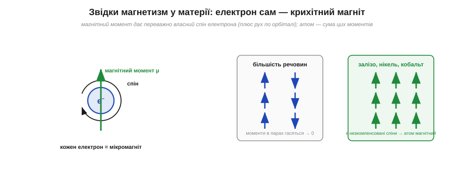
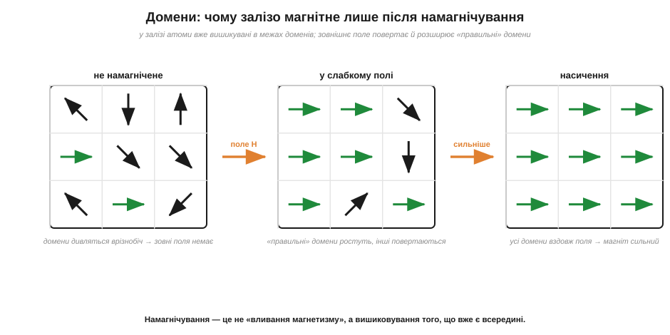
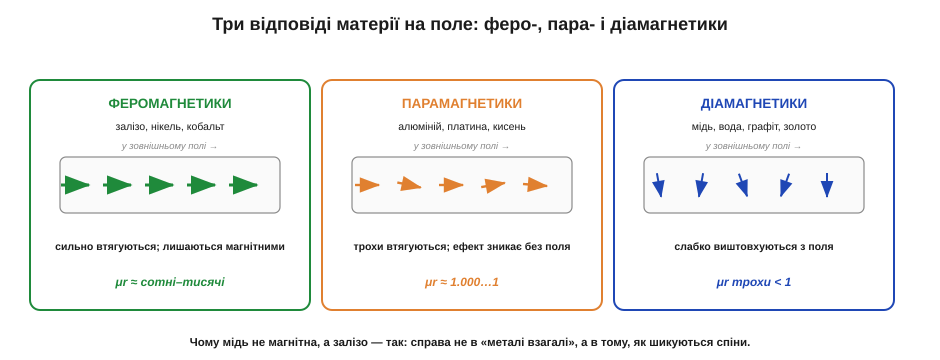

# Магнетизм матерії: домени й феромагнетики

Магнетизм приходить у речовину диполями, бо народжується з рухомих зарядів усередині атомів. Але тоді чому **залізо** легко стає магнітом і прилипає до інших магнітів, а зовні дуже схожа на нього **мідь** — ні, скільки її не три об магніт? Адже атоми є і там, і там, електрони рухаються в обох. Відповідь ховається в тому, **як саме** ці мікроскопічні магнітики розташовані один щодо одного, — і вона напрочуд красива.

### Кожен електрон — крихітний магніт

Почнімо з найдрібнішого. Електрон в атомі має дві властивості, що роблять його мікроскопічним магнітом. По-перше, він рухається навколо ядра — а [рух заряду по контуру](root:ph-electromagnetism/oersted-experiment) створює магнітне поле. По-друге, і це головне, електрон має власну квантову властивість — **спін** (англ. *spin* — обертання), через яку він сам поводиться як крихітний постійний магнітик із власним **магнітним моментом** (*magnetic moment*, μ). Можна образно (не зовсім строго) уявляти спін як обертання електрона довкола власної осі; важливо лише, що кожен електрон — це готовий мікродиполь зі своїм напрямом N–S.


*Зліва: електрон завдяки спіну має власний магнітний момент μ — він сам крихітний магнітик. Справа: у більшості речовин електрони ходять парами з протилежними спінами (↑↓), і їхні моменти гасять один одного; у заліза, нікелю й кобальту лишаються нескомпенсовані спіни — і атом має сумарний магнітний момент.*

Отут і перша розвилка між залізом і міддю. У більшості атомів електрони заповнюють рівні **парами** з протилежними спінами: один «вгору», один «вниз». Їхні магнітні моменти спрямовані назустріч і **гасять** один одного, тож атом як ціле виходить майже немагнітним. Це наслідок квантового **принципу Паулі**: на одному рівні можуть сидіти лише два електрони, і саме з протилежними спінами. Доки рівні заповнюються повністю, спіни йдуть строго парами «↑↓» і їхній магнетизм взаємно знищується. А от у кількох елементів — насамперед у **заліза** (Fe), **нікелю** (Ni) та **кобальту** (Co) — будова електронних оболонок особлива: у них є частково заповнена внутрішня оболонка (так звана 3d), де кільком електронам енергетично вигідніше сидіти з **однаково** напрямленими спінами, ніж паруватися. Через це частина спінів лишається **нескомпенсованою**, і кожен такий атом має помітний власний магнітний момент — він справжній маленький магніт. Мідь же належить до «парних»: її оболонки заповнені так, що атомні моменти гасяться, і окремий атом міді магнітного моменту майже не має. Звідси видно тонку, але вирішальну деталь: магнітність — не питання «метал чи ні», а питання **тонкої будови електронних оболонок**, де навіть сусідні в таблиці елементи поводяться зовсім по-різному.

### Чому самих атомних магнітиків замало

Здавалося б, цього вже досить: у заліза атоми магнітні — отже, шматок заліза магнітний. Але тут чекає друга загадка. Звичайний цвях чи болт магнітного поля **не створює** — він не притягує інших цвяхів, не повертає компаса. Хоча кожен його атом — мікромагніт. Куди ж дівається їхній магнетизм?

Відповідь: окремих атомних магнітиків справді замало. Якби вони дивилися хто куди — врізнобіч, — їхні поля в сумі гасилися б до нуля, і зовні шматок заліза був би немагнітним, попри мільярди мікромагнітів усередині. Саме так і буває в **парамагнетиках** — речовинах, де атомні магнітики є, але дивляться врізнобіч. Щоб речовина стала магнітом, мікромоменти повинні **вишикуватися** в одному напрямі. І природа заліза дає для цього особливий механізм.

### Домени: армія мікромагнітів

У залізі, нікелі й кобальті між сусідніми атомами діє особлива квантова взаємодія (її звуть **обмінною**), яка змушує сусідні спіни **вишиковуватися паралельно** — дивитися в один бік. Через це матеріал самочинно розбивається на безліч дрібних областей, усередині кожної з яких **усі** атомні моменти вже зорієнтовані однаково. Такі області називають **доменами** (*magnetic domains*); типовий домен — мікроскопічний (часто частки міліметра), але містить трильйони атомів, що дивляться в один бік. Речовини, здатні на таке самочинне вишиковування, звуть **феромагнетиками** (*ferromagnets*) — від латинського *ferrum*, залізо.

Чому ж тоді не намагнічений цвях зовні «мовчить»? Бо самі **домени** в ньому дивляться врізнобіч. Усередині кожного домену лад ідеальний, але напрями різних доменів випадкові, тож їхні поля в сумі гасяться. Магнетизм є — він просто **захований** у хаосі орієнтацій.


*Намагнічування феромагнетика. Ліворуч (не намагнічене): домени дивляться врізнобіч, їхні поля гасяться, зовні поля немає. У центрі (слабке зовнішнє поле H): «правильно» зорієнтовані домени розростаються коштом сусідів, а ті повертаються вздовж поля. Праворуч (насичення): усі домени вишикувані вздовж поля — матеріал намагнічений максимально.*

Межі між доменами називають **доменними стінками** (*domain walls*) — це тонкі перехідні шари, у яких напрям спінів плавно повертається від орієнтації одного домену до орієнтації сусіднього. Саме рух цих стінок і дає намагнічування: коли «правильний» домен розростається коштом сусіда, його стінка просто зсувається, відвойовуючи територію. На цьому образі тримається вся подальша картина — і насичення (стінкам більше нікуди рухатися, бо «неправильних» доменів не лишилось), і [гістерезис](root:ph-condensed/saturation-hysteresis) (стінки чіпляються за дефекти кристала й не повертаються точно туди, звідки прийшли).

Тепер ясно, що таке **намагнічування** (*magnetization*). Піднесімо до заліза зовнішнє магнітне поле (його зручно позначати **H** — і воно відрізняється від поля **B** усередині матеріалу, бо те вже враховує внесок вишикуваних доменів). Поле починає впорядковувати домени двома шляхами: домени, що вже дивляться «правильно», **розростаються** коштом сусідів (стінки зсуваються), а решта **повертається** вздовж поля. Що сильніше зовнішнє поле, то більше доменів вишикувано — і тим сильніший власний магнетизм заліза. Коли вишикуються геть усі, настає [**насичення**](root:ph-condensed/saturation-hysteresis) (*saturation*): сильніше намагнітити вже нікуди.

Ключова думка, яку варто винести: намагнічування — це **не вливання магнетизму ззовні**, а **вишиковування** того, що в залізі вже було. Магнітики-атоми нікуди не зникали й не з'являлися — їх лише розвернули в лад. Ця думка пояснює і зворотний бік: коли зовнішнє поле прибрати, теплове тремтіння й внутрішні напруги частково повертають домени в хаос, і намагніченість слабшає. Наскільки слабшає — залежить від матеріалу: «м'яке» залізо майже повністю розмагнічується, «тверде» (з якого роблять [постійні магніти](root:ph-condensed/permanent-magnets)) тримає лад.

> 🔧 **Навіщо це.** Цей механізм — пряма причина, чому залізна викрутка з часом сама собою намагнічується (земне поле й постійне сусідство з інструментами поволі впорядковують її домени) і чому намагнічене жало зручне — притримує гвинтик. Той самий механізм пояснює, чому стрічка чи жорсткий диск **зберігають** записане: голівка локально вишиковує домени крихітних ділянок, і вони лишаються в цьому стані, кодуючи нулі та одиниці. Магнітний запис — це впорядкування доменів за командою.

### Три відповіді речовини на поле

Феромагнетики — яскравий, але не єдиний випадок. За тим, **як** речовина відгукується на зовнішнє магнітне поле, усі матеріали ділять на три класи. Це пояснює і нашу початкову загадку про мідь.


*Три класи. **Феромагнетики** (залізо, нікель, кобальт) сильно втягуються в поле й лишаються намагніченими — у них працюють домени. **Парамагнетики** (алюміній, платина, кисень) мають нескомпенсовані атомні моменти, але без обмінної взаємодії: поле трохи їх упорядковує, проте без поля все знову розсипається. **Діамагнетики** (мідь, вода, графіт, золото) власних моментів не мають і слабко **виштовхуються** з поля.*

- **Феромагнетики** — залізо, нікель, кобальт і їхні сплави. Сильна обмінна взаємодія → домени → сильне втягування в поле й **залишковий** магнетизм. Відносна [магнітна проникність](root:ph-condensed/saturation-hysteresis) (μr) — сотні й тисячі (число, що показує, у скільки разів матеріал підсилює поле).
- **Парамагнетики** (гр. *pará* — поряд, уздовж) — алюміній, платина, кисень. Атоми мають моменти, але домен не утворюється; поле трохи їх вишиковує вздовж себе, проте ефект кволий і зникає, щойно поле прибрати. μr ледь більша за одиницю.
- **Діамагнетики** (гр. *diá* — впоперек, наскрізь) — мідь, вода, графіт, золото, більшість «немагнітних» речовин. Власних моментів немає; зовнішнє поле наводить у них слабенький **зустрічний** момент, тож вони ледь-ледь **виштовхуються** з поля. μr трохи менша за одиницю.

Ось і розгадка про мідь: **мідь — діамагнетик**. Її атоми магнітного моменту практично не мають, домени не утворюються, тож хоч скільки три мідь об магніт — вона не намагнітиться. А залізо — феромагнетик, у нього є домени, і їх можна вишикувати. Справа, отже, **не в «металі взагалі»**, а в тонкій будові електронних оболонок і взаємодії спінів. (Цікавий нюанс: мідь усе ж бурхливо реагує на магніт, але інакше — через наведені струми, коли поле **змінюється**; це вже [електромагнітна індукція](root:ph-electromagnetism/electromagnetic-induction), зовсім інший механізм.)

### Чому магнетизм не вічний: суперник на ім'я тепло

Вишикуваність доменів тримається на обмінній взаємодії, але в неї є постійний суперник — **тепловий рух** атомів. За будь-якої температури вищої за абсолютний нуль атоми дрижать, і це тремтіння весь час намагається збити спіни з ладу. Доки взаємодія дужча за тремтіння — феромагнітний порядок тримається; та чим гарячіше, тим тремтіння сильніше, і тим легше зруйнувати лад. Звідси два наслідки, важливі для практики. По-перше, намагніченість феромагнетика **слабшає** з нагрівом ще задовго до повної втрати. По-друге, існує критична [температура Кюрі](root:ph-condensed/permanent-magnets), за якої тремтіння остаточно перемагає й феромагнетизм зникає геть. Поки що досить запам'ятати: магнетизм матерії — це завжди боротьба впорядкування проти теплового хаосу, і хто переможе, залежить від температури.

Це пояснює й те, чому намагнічене залізо при кімнатній температурі все ж стабільне: за звичайних умов обмінна взаємодія в залізі набагато сильніша за теплове тремтіння, тож домени тримаються впевнено. А от парамагнетик програє цю боротьбу вже за кімнатної температури — у нього немає сильної обмінної взаємодії, і теплове тремтіння миттєво розкидає кволо впорядковані моменти, щойно зникне зовнішнє поле. Ось чому парамагнітний алюміній не стає постійним магнітом, а феромагнітне залізо — стає: різниця знову в силі взаємодії між сусідніми спінами.

**Приклад (чому магнітний тримач для викруток робить зі сталі, а не з міді).** Розсудимо якісно, спираючись на класи матеріалів.

```
сталь (сплав заліза) — феромагнетик: μr ~ кілька тисяч
   → у полі магніту сильно намагнічується, прилипає, ще й сама притримує дрібні залізні деталі

мідь — діамагнетик: μr трохи менша за 1
   → у полі магніту майже не реагує (слабке виштовхування), деталей не тримає
```

Тому магнітні тримачі, тарілочки для гвинтиків і жало викрутки роблять із феромагнітної сталі — лише вона дає потрібний ефект. Якби корпус інструмента був мідний чи алюмінієвий, магнітна функція просто не працювала б. Це прямий практичний наслідок поділу матеріалів на три класи.

> 🔧 **Навіщо це.** Поділ на феро-, пара- й діамагнетики підказує, з чого роблять різні деталі. Осердя електромагнітів, трансформаторів і реле — лише з феромагнетиків (залізо, спеціальні сплави): тільки вони помітно підсилюють поле. А там, де магнітне поле **заважає** — корпус біля магнітометра, кронштейн давача, немагнітний кріпеж, — навмисно беруть діа- чи парамагнітні матеріали: алюміній, латунь, нержавійку аустенітного класу. «Немагнітний гвинт» — це інженерне рішення, що спирається саме на цей поділ.

---
