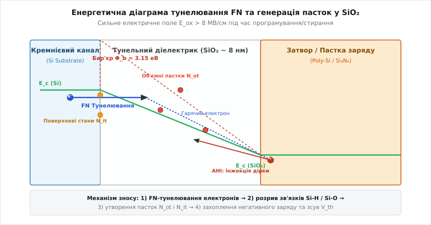
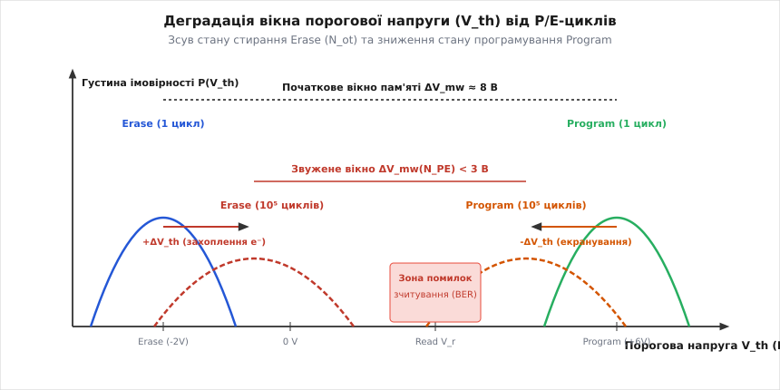
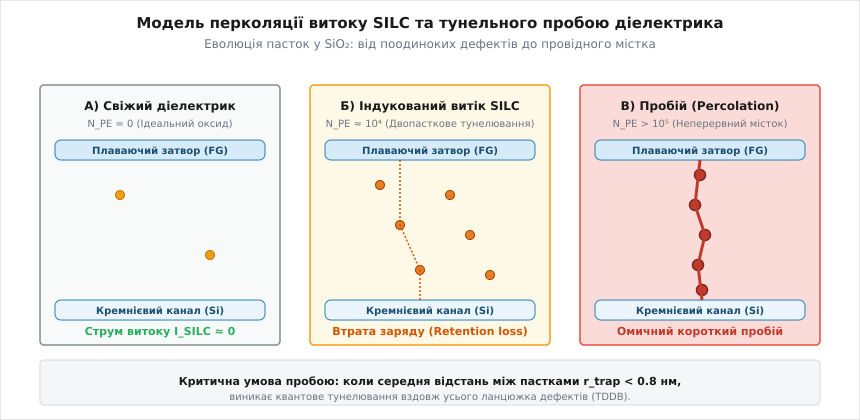
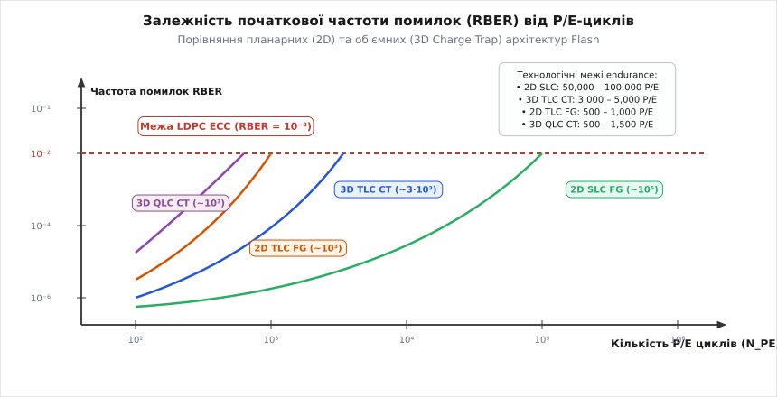

# Знос Flash: charge trapping і ресурс запису

<preknowlist>
- [Charge trap Flash (SONOS/CTF)](topic:ph-condensed/charge-trap-flash) — архітектура пам'яті з локалізованим накопиченням заряду у шарнірній силікатній чи нітридній плівці Si3N4.
- [3D NAND архітектура](topic:ph-condensed/3d-nand-architecture) — принцип створення вертикальних каналів пам'яті та просторового масштабування оксидних шарів.
- [Термоелектронна та автоелектронна емісія (Річардсон — Фаулер — Нордгейм)](topic:ph-condensed/thermal-field-emission) — тунелювання електронів крізь потенціальний бар'єр під дією сильних електричних полів.
- [Фізика MLC та TLC комірок](topic:ph-condensed/mlc-tlc-cell-physics) — багаторівневе розділення порогових напруг V_th для зберігання кількох біт в одній комірці.
</preknowlist>

Кожен акт запису та стирання інформації у напівпровідниковій Flash-пам'яті супроводжується проходженням потужного тунельного струму електронів крізь аморфний шар діоксиду кремнію (SiO₂) товщиною всього 7–8 нм. Під дією екстремальних електричних полів, що перевищують 8–10 МВ/см, високоенергетичні електрони розривають міжатомні зв'язки в кристалічній ґратці діелектрика, генеруючи незворотні структурні дефекти — пастки заряду (charge traps). Поступове захоплення електронів цими пастками створює паразитно закріплений об'ємний заряд, який спотворює електростатичне поле затвора, зміщує порогову напругу транзистора `V_th` і звужує робоче вікно пам'яті. З вичерпанням ресурсу P/E-циклів (Program/Erase) утворюється суцільний перколяційний місток витоку, що призводить до незворотного квантового пробою діелектрика та остаточної втрати здатності зберігати інформацію.

## Механіка тунельного напруження та деградація тонкого діелектрика SiO₂

Унікальні ізоляційні властивості діоксиду кремнію (SiO₂) — висока ширина забороненої зони (близько 8.9 еВ) та високий потенціальний бар'єр для електронів на межі з кремнієвим каналом (`Φ_b = 3.15 еВ`) — роблять його ідеальним кандидатом на роль тунельного діелектрика. У рівноважному стані при напругах зчитування (полем `E_ox < 2 МВ/см`) ймовірність проходження електрона крізь такий бар'єр є практично нульовою, що забезпечує теоретичний термін зберігання заряду на плаваючому затворі понад 10 років.

Проте для зміни логічного стану комірки — заведення чи видалення електронів з плаваючого затвора (Floating Gate) або нітридного шару (Charge Trap) — на управляючий затвор подають високі напруги програмування (15–20 В). У результаті поперек тунельного оксиду створюється поле напруженістю `E_ox = 8–10 МВ/см`. При таких полях прямокутний потенціальний бар'єр SiO₂ деформується у вузький трикутник, і електрони каналу отримують можливість квантово-механічно тунелювати безпосередньо у зону провідності діелектрика за механізмом Фаулера — Нордгейма (Fowler–Nordheim, FN tunneling).


*Діаграма енергетичних зон тунельного діелектрика SiO₂ при високому напруженні поля: інжекція електронів за механізмом Фаулера — Нордгейма, вибивання дірок (AHI) та генерація поверхневих N_it й об'ємних N_ot пасток заряду.*

Під час проходження крізь зону провідності діелектрика електрон прискорюється електричним полем і набуває високої кінетичної енергії — стає «гарячим» електроном (*hot electron*). Влітаючи в анод (від грецького *anodos* — шлях вгору; провідний плаваючий затвор або кремнієвий канал), гарячий електрон релаксує за рахунок неупругого розсіювання, передаючи свою кінетичну енергію (понад 3 еВ) атомам ґратки та валентним електронам анода.

Фізична деградація (від латинського *degradatio* — зниження ступеня, занепад) діелектрика запускається двома основними мікроскопічними процесами:

1. **Анодна інжекція дірок (Anode Hole Injection, AHI):** Передана гарячим електроном енергія вибиває у валентній зоні анода високоенергетичну дірку (`h⁺`). Під дією сильного електричного поля ця дірка прискорюється у зворотному напрямку — з анода в об'єм SiO₂. Маючи високу ефективну масу та низьку рухливість, дірка захоплюється атомами кисню або кремнію, створюючи позитивно заряджений точковий дефект.
2. **Розрив пасивованих зв'язків:** Взаємодія гарячих електронів та інжектованих дірок із кристалічною ґраткою викликає розрив слабких зв'язків кремній-водень (`Si-H`) на межі розділу кремнію з оксидом та зв'язків кремній-кисень (`Si-O`) в об'ємі діелектрика.

Вільний атомарний водень дифундує крізь оксид, залишаючи після себе ненасичений ненаправлений зв'язок кремнію — ненасичену валентність (*dangling bond*), яка стає електронною пасткою.

Історичний шлях дослідження деградації SiO₂ — від виявлення аномальних витоків струму в перших EEPROM у 1970-х роках до створення концепції локалізованого збереження заряду — розкрито у вставці [Історія дослідження деградації тунельних діелектриків SiO₂](topic:ph-condensed/flash-wear-model/hist-oxide-wearout.md).

## Мікроскопічна кінетика утворення дефектів і пасток заряду

З точки зору фізики твердого тіла (від грецького *physikos* — природний), дефекти, створені під час FN-тунелювання, поділяються на два просторово і функціонально відмінні класи:

### 1. Поверхневі стани (Interface Traps, N_it)
Поверхневі стани локалізовані безпосередньо на атомарній межі розділу монокристалічного кремнієвого каналу `Si` та аморфного діелектрика `SiO₂`. Головним мікроскопічним типом цих дефектів є `P_b`-центри — атоми кремнію на інтерфейсі `(100) Si`, що зв'язані з трьома сусідніми атомами кремнію ґратки, але мають один ненасичений електронний орбіталь `≡Si·`.

Енергетично `N_it` утворюють неперервний спектр амфотерних станів усередині забороненої зони кремнію (`E_g = 1.12 еВ`). Ці стани здатні динамічно перезаряджатися — захоплювати електрони з каналу при зростанні потенціалу затвора і віддавати їх при зниженні. Накопичення `N_it` розмиває підпорогову характеристику транзистора, збільшуючи підпороговий нахил перемикання (subthreshold swing `S`).

### 2. Об'ємні пастки оксиду (Bulk Oxide Traps, N_ot)
Об'ємні пастки (від англійського *trap* — пастка) розподілені по всьому просторовому шару `SiO₂` товщиною `t_ox`. Основним типом об'ємної пастки є `E'`-центр — вакансія кисню у сітці діоксиду кремнію з неспареним електроном на одному з двох сусідніх атомів кремнію (`≡Si·  ⁺Si≡`).

На відміну від поверхневих станів, об'ємні пастки `N_ot` розташовані глибоко всередині забороненої зони `SiO₂` (на 1.5–3.0 еВ нижче дна зони провідності діелектрика). Захоплений такою пасткою електрон виявляється локалізованим у глибокій потенціальній ямі. Завдяки високій енергії зв'язку електрон не може повернутися в канал за нормальних температур і створює стаціонарно закріплений негативний просторовий заряд усередині оксиду.

Кінетика утворення пасток під дією тунельного інжекційного струму підкоряється емпіричному степеневому закону залежності від кількості P/E-циклів (`N_PE`) або сумарного пропущеного заряду (флюенсу `Q_inj` [Кл/см²]):

```
ΔN_ot(N_PE) = A_ot · N_PE^α
ΔN_it(N_PE) = A_it · N_PE^β
```

де `A_ot = 1.2 · 10¹⁵ см⁻³` та `A_it = 8.0 · 10⁹ см⁻²` — технологічні константи, що залежать від температури вирощування оксиду та вмісту водню, а показники степеня становлять `α ≈ 0.4–0.5` та `β ≈ 0.3–0.4`.

Степенева залежність пояснюється тим, що генерація нових пасток гальмується власною дифузією водню та екрануванням поля вже захопленим зарядом. На початкових етапах (до 1000 P/E-циклів) швидкість утворення дефектів є максимальною, після чого спостерігається поступове насичення.

Експериментальне вимірювання густини `N_it` та `N_ot` здійснюється метрологічними методами напівпровідникової фізики: методами помпування заряду (Charge Pumping Technique) та релаксаційної спектроскопії глибоких рівнів (Deep-Level Transient Spectroscopy, DLTS). При вимірюванні методом Charge Pumping на затвор подають прямокутні імпульси напруги високої частоти (100 кГц – 1 МГц), що змушує підкладковий струм рекомбінувати на поверхневих станах. Амплітуда рекомбінаційного струму підкладки `I_cp` прямо пропорційна густині `N_it`:

```
I_cp = f · A_gate · q · N_it
```

де `f` — частота імпульсів, а `A_gate` — площа затвора транзистора. Цей метод дозволяє контролювати процес накопичення дефектів без руйнування комірки.

## Захоплення заряду та електростатика зсуву порогової напруги V_th

Вирішальним параметром, що визначає здатність комірки Flash зчитувати записану інформацію, є порогова напруга транзистора `V_th` — напруга на управляючому затворі, за якої у каналі під діелектриком утворюється інверсійний шар і транзистор відкривається.

У свіжій комірці стан стирання (Erase, логічна «1») відповідає відсутності електронів на плаваючому затворі або у нітридному шарі, що забезпечує низьку порогову напругу (наприклад, `V_th^ERS = -2.5 В`). Стан програмування (Program, логічний «0») досягається впорскуванням (інжекцією, від латинського *injectio* — впорскування) негативного заряду `Q_fg`, що зсуває порогову напругу у позитивну область (`V_th^PGM = +6.0 В`). Відстань між цими станами називається робочим вікном пам'яті (*memory window*):

```
ΔV_mw = V_th^PGM - V_th^ERS
```

При накопиченні пасток заряду `N_ot` під час P/E-циклів частина тунелюючих електронів захоплюється об'ємними дефектами оксиду. Цей захоплений негативний заряд `Q_ot = - q · N_ot` створює власний внутрішній електростатичний потенціал, який протидіє зовнішньому полю затвора.

Зсув порогової напруги `ΔV_th`, викликаний захопленим об'ємним зарядом, розраховується з рівняння Пуассона шляхом інтегрування розподілу густини пасток `ρ_ot(x)` вздовж товщини оксиду від каналу (`x = 0`) до затвора (`x = t_ox`):

```
ΔV_th = - (1 / C_ox) · ∫₀ᵗᵒˣ (x / t_ox) · ρ_ot(x) dx
```

де `C_ox = (ε_ox · ε₀) / t_ox` — питома ємність тунельного діелектрика.

Якщо захоплений заряд розподілений рівномірно по об'єму оксиду (`ρ_ot(x) = - q · N_ot`), інтегрування дає прямо пропорційну залежність від сумарної кількості пасток та квадрата товщини оксиду:

```
ΔV_th = (q · N_ot · t_ox²) / (2 · ε_ox · ε₀)
```

Цей результат пояснює виражений ефект зсуву характеристик комірки при вичерпанні ресурсу:


*Еволюція розподілу порогових напруг комірки Flash залежно від кількості P/E-циклів: зсув рівня Erase через накопичення негативного заряду в оксиді та звуження робочого вікна пам'яті ΔV_mw.*

Деградація порогової напруги виявляється у трьох пов'язаних ефектах:

1. **Паразитний зсув рівня Erase вгору (`+ΔV_th^ERS`):** Захоплені в оксиді електрони не видаляються під час імпульсу стирання. Вони частково екранують позитивну напругу затвора, і для інверсії каналу потрібна вища напруга. Рівень `V_th^ERS` зсувається з -2.5 В до 0 В і вище.
2. **Зниження ефективності програмування (`-ΔV_th^PGM`):** Негативний заряд в оксиді знижує напрямлене електричне поле у каналі під час тунелювання, зменшуючи кількість електронів, що потрапляють у затвор за один імпульс ISPP (Incremental Step Pulse Programming).
3. **Звуження робочого вікна `ΔV_mw`:** Зближення рівнів Erase та Program зменшує проміжок для зчитування. Коли `ΔV_mw` стає меншим за 2.5–3.0 В, статистичні хвости розподілу порогових напруг суміжних станів (особливо у багаторівневих комірках TLC та QLC) починають перекриватися, що викликає вибухоподібне зростання кількості помилок зчитування.

Особливо гостро деградація вікна виявляється у багатбітових комірках TLC (3 біти/комірка, 8 станів `V_th`) та QLC (4 біти/комірка, 16 станів `V_th`). У таких комірках відстань між сусідніми рівнями порогової напруги становить всього 0.3–0.4 В. Зсув рівня Erase навіть на 0.15 В перекриває пороги сусідніх станів $P_1$ та $P_2$, роблячи неможливим коректне розпізнавання записаного коду без застосування складної математичної корекції.

Додатково поверхневі стани `N_it` погіршують підпороговий нахил транзистора `S`:

```
S = ln(10) · (k_B · T / q) · (1 + (C_dep + q² · N_it) / C_ox)
```

Збільшення `S` означає, що для переключення транзистора з закритого стану у відкритий потрібна більша зміна напруги затвора, що призводить до зростання струмів витоку в закритому стані та зниження швидкості зчитування.

## Струми витоку SILC та теорія перколяційного пробою

Накопичення пасток у тунельному оксиді викликає не лише зсув статичних порогових напруг, але й створює нові квантово-механічні шляхи для витоку збереженого заряду при низьких полях.

### Індукований напруженням струм витоку (SILC)
У свіжому діелектрику при напрузі зчитування (`E_ox < 4 МВ/см`) ймовірність одностадійного тунелювання електрона крізь повну товщину бар'єру (7–8 нм) є нехтовно малою. Проте при виникненні об'ємних пасток `N_ot` електрони отримують можливість тунелювати ступінчасто — через проміжні квантові стани дефектів. Цей ефект називається тунелюванням за участю пасток (Trap-Assisted Tunneling, TAT).

Аномальний струм витоку при низьких полях отримав назву SILC (Stress-Induced Leakage Current). При наявності двох або трьох просторово зближених пасток електрон здійснює послідовні квантові стрибки: канал → пастка 1 → пастка 2 → плаваючий затвор.

Струм SILC пропорційний квадрату густини пасток (`J_SILC ∝ N_ot²`). Головним наслідком SILC є погіршення утримання заряду (Data Retention Loss): записана в комірку інформація розряджається за рахунок самовільного витоку електронів з плаваючого затвора у канал протягом місяців або тижнів замість розрахункових років. Підвищення температури прискорює витік за рахунок термоелектронного збудження носіїв з пасток (транспорт Френкеля — Пуля).

### Модель перколяційного пробою (Percolation Breakdown Model)
При тривалій експлуатації та подальшому зростанні кількості P/E-циклів густина пасток `N_ot` досягає критичної межі. Розподіл утворення дефектів у тривимірному об'ємі діелектрика `t_ox × A` (де `A` — площа комірки) є статистично випадковим.

Згідно з перколяційною моделлю (від латинського *percolare* — проціджувати, протікати), розробленою науковцями IMEC, кожна пастка має мікроскопічний радіус захоплення `r_capt ≈ 0.4–0.45 нм`. Коли середня відстань між сусідніми пастками в об'ємі оксиду зменшується до `r_trap ≤ 2 · r_capt ≈ 0.8–0.9 нм`, їхні хвильові функції перекриваються.


*Схематичне зображення трьох стадій деградації оксиду: від свіжого діелектрика до двопасткового тунельного витоку SILC та утворення суцільного перколяційного містка пробою.*

Процес деградації діелектрика проходить три чіткі фізичні стадії:

1. **Стадія А (Свіжий діелектрик, N_PE = 0):** Поодинокі ізольовані пастки. Струм витоку практично дорівнює нулю (`I_leak < 10⁻¹⁵ А`).
2. **Стадія Б (Індукований витік SILC, N_PE ≈ 10⁴):** Утворення двопасткових ланцюжків TAT. Виникає повільний струм витоку SILC, що викликає втрату утримання заряду за підвищених температур.
3. **Стадія В (Перколяційний пробій, N_PE > 10⁵):** Випадкове зближення пасток формує **неперервний провідний місток** (*percolation path*), що простягається крізь усю товщину тунельного оксиду від каналу до затвора.

Виникнення суцільного перколяційного містка призводить до катастрофічного (від грецького *katastrophe* — переворот, руйнування) тунельного пробою діелектрика, що залежить від часу (Time-Dependent Dielectric Breakdown, TDDB). Через омичний або високопровідний місток заряд затвора миттєво стікає в підкладку, і комірка повністю втрачає здатність утримувати потенціал — стає непрацездатним блоком (*bad block*).

Статистично час пробою підкоряється розподілу Вейбула з параметром форми `β = α · (t_ox / a_cell)`. Зменшення товщини оксиду знижує показник `β`, збільшуючи дисперсію часу пробою та підвищуючи ризик виникнення ранніх пробоїв окремих комірок у великих масивах пам'яті.

Детальний математичний вивід формул ймовірності тунелювання TAT, перколяційного порогу та статистики Вейбула для часового пробою наведено у вставці [Математична модель перколяції SILC та статистика Вейбула](topic:ph-condensed/flash-wear-model/math-percolation-model.md).

## Вплив архітектури комірки (2D FG vs 3D CTF) на межу P/E-циклів

Фізичний механізм перколяційного пробою пояснює, чому фундаментальний ресурс запису (ендюранс, від англійського *endurance* — витривалість, стійкість) кардинально відрізняється для різних технологічних архітектур Flash-пам'яті.

### 1. Планарна пам'ять з плаваючим затвором (2D Floating Gate)
У класичній 2D Flash-пам'яті плаваючий затвор виготовляють із високолегованого полікристалічного кремнію (Poly-Si). Полікремній є провідником, тобто суцільним еквіпотенціальним об'ємом електронів. 

Якщо в тунельному діелектрику `SiO₂` утворюється **бодай один** перколяційний місток пробою на всій площі затвора, **увесь** накопичений негативний заряд із провідного плаваючого затвора миттєво стікає крізь цей єдиний дефектний канал.

Зі зменшенням товщини оксиду при планарному масштабуванні (нижче 15 нм) ймовірність утворення перколяційного містка зросла катастрофічно. Це встановило жорстку технологічну межу ресурсу 2D Flash:
- 2D SLC (Single-Level Cell, 1 біт/комірка): 50,000 – 100,000 P/E-циклів;
- 2D MLC (Multi-Level Cell, 2 біти/комірка): 3,000 – 5,000 P/E-циклів;
- 2D TLC (Triple-Level Cell, 3 біти/комірка): всього 500 – 1,000 P/E-циклів.

### 2. Об'ємна пам'ять з пасткою заряду (3D Charge Trap Flash, CTF)
Для подолання фізичного глухого кута 2D пам'яті була розроблена технологія Charge Trap Flash (CTF), впроваджена у тривимірній архітектурі 3D NAND (Samsung V-NAND, Kioxia/Western Digital BiCS, Micron 3D NAND).

У 3D CTF провідний плаваючий затвор замінено на діелектричний шар шарнірного нітриду кремнію (`Si₃N₄`), який оточений оксидними бар'єрами (структура ONO: Blocking Oxide - Silicon Nitride - Tunnel Oxide). 

Нітрид кремнію є широконосійним діелектриком із високою густиною внутрішніх просторових пасток. Інжектовані електрони захоплюються цими внутрішніми пастками і залишаються жорстко локалізованими в точці інжекції. Нітрид не є провідником.

Якщо в тунельному оксиді `SiO₂` 3D CTF-комірки виникає перколяційний місток витоку SILC, крізь нього витікають лише ті електрони, що знаходяться в безпосередньому радіусі квантового тунелювання (~ 1 нм³) від містка. Пере переважна більшість заряду, розподіленого по об'єму нітридного кільця, залишається нерухомою.


*Криві зростання частоти первинних помилок (RBER) з вичерпанням ресурсу P/E та порівняння границь endurance для планарних 2D FG та об'ємних 3D Charge Trap архітектур.*

Локалізація заряду в 3D CTF дозволила збільшити товщину тунельного оксиду до 7.5–8.0 нм та забезпечити високу стійкість до перколяції:
- 3D TLC CTF: 3,000 – 5,000 P/E-циклів (у 5-10 разів вище за 2D TLC);
- 3D QLC (Quad-Level Cell, 4 біти/комірка): 1,000 – 1,500 P/E-циклів.

Окрім підвищення стійкості до перколяції, об'ємне компонування 3D NAND суттєво зменшило паразитний ємнісний зв'язок (Crosstalk) між сусідніми затворами. У планарних структурах при розмірі елемента `d < 15 нм` ємність між сусідніми плаваючими затворами досягала 30–40% від затворної ємності, що викликало зсув `V_th` комірки при програмуванні її сусідки (Program Disturb). Перехід до вертикального циліндричного каналу зі збільшеним радіусом та товстішим оксидом знизив ємнісний взаємозв'язок у кілька разів, додатково розширивши робоче вікно `ΔV_mw`.

Чисельний алгоритм моделювання накопичення пасток, зсуву порогових напруг та зростання RBER мовами C та C++ наведено у вставці [Симуляція деградації порогової напруги та витоків SILC](topic:ph-condensed/flash-wear-model/proj-flash-wear-sim.md).

> 🔧 **Навіщо це.** Фізична модель зносу Flash є основою для розробки мікропрограмного забезпечення (firmware) SSD-контролерів та керування надійністю зберігання даних у дата-центрах та автомобільній електроніці (Automotive Grade Storage). Оскільки фізика деградації `SiO₂` визначає зростання первинної частоти помилок RBER (Raw Bit Error Rate), контролер накопичувача застосовує цілий комплекс адаптивних інженерних заходів:
> 
> 1. **Wear Leveling (Вирівнювання зносу):** Динамічне та статичне перерозподілення блоків запису для забезпечення рівномірного накопичення пасток `N_ot` по всіх фізичних кристалах Flash.
> 2. **Dynamic Read Calibration (Read Retry / Read Reclaim):** По мірі зсуву рівнів `V_th^ERS` вгору контролер математично підлаштовує опорні напруги зчитування `V_r`, відстежуючи центр розширеного вікна порогових напруг.
> 3. **Адаптивна корекція помилок LDPC:** Застосування низькощільносних кодів перевірки парності (Low-Density Parity-Check), здатних відновлювати дані при RBER до `10⁻²`, розширює практичний ресурс 3D NAND накопичувачів у десятки разів понад фізичний поріг перколяції.

Фізична деградація тунельного діелектрика `SiO₂` у Flash-пам'яті є фундаментальним прикладом того, як квантово-механічні ефекти на атомарному рівні — тунелювання Фаулера — Нордгейма, утворення точкових вакансій та перколяція заряду — визначають граничні експлуатаційні характеристики сучасних цифрових систем збереження інформації.

---

### Література та джерела

1. Degraeve, R., Groeseneken, G., Bellens, R., Ogier, J. L., Depas, M., & Maes, H. E. (1998). *New insights in the relation between electron trap generation and breakdown in thin SiO₂ layers*. IEEE Transactions on Electron Devices, 45(4), 904-911.
2. Olivo, P., Ricco, B., & Sangiorgi, E. (1988). *High-field electron conduction and breakdown in thin SiO₂ films*. Applied Physics Letters, 48(17), 1138-1140.
3. Compagnoni, C. M., Spinelli, A. S., & Monzio Compagnoni, R. (2017). *Review and outlook of Flash memory reliability physics*. IEEE Transactions on Electron Devices, 64(9), 3535-3544.
4. Sze, S. M., & Ng, K. K. (2006). *Physics of Semiconductor Devices* (3rd ed.). John Wiley & Sons.
