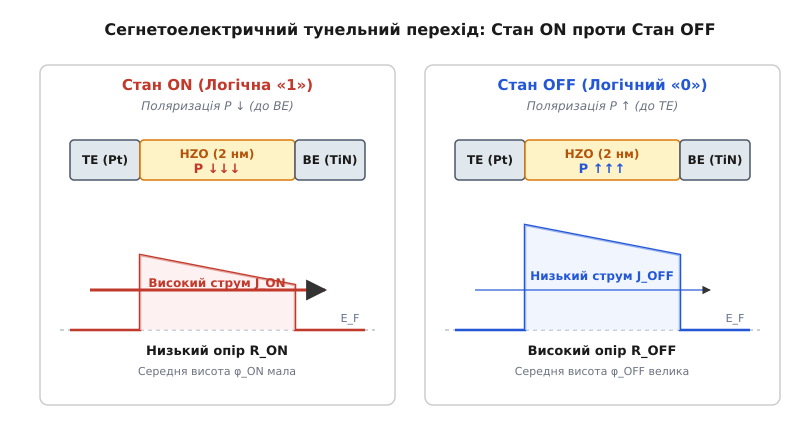
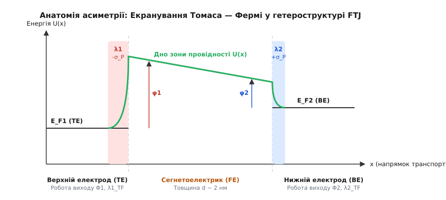
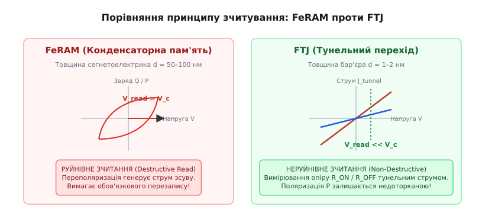

# Сегнетоелектричний тунельний перехід (FTJ)

<preknowlist>
- [Сегнетоелектрики](root:ph-condensed/ferroelectricity) — спонтанна електрична поляризація діелектрика, її перемикання зовнішнім полем та доменна структура.
- [Квантове тунелювання](root:ph-quantum/quantum-tunnelling) — проходження мікрочастинки крізь потенціальний бар'єр та наближення Вентцеля — Крамерса — Бріллюена (ВКБ).
- [Зонна теорія твердого тіла](root:ph-condensed/band-theory) — формування потенціальних бар'єрів у напівпровідниках і діелектриках, робота виходу та зсув ребер зон.
- [Бар'єр Шотткі](root:ph-condensed/schottky-barrier) — контакт метал–діелектрик та довжина екранування Томаса — Фермі у провідниках.
</preknowlist>

Коли товщину класичного ізолятора зменшують до кількох нанометрів, квантова механіка відкриває прохід електронам: вони починають просочуватися крізь квантово-механічний бар'єр за допомогою тунелювання. Якщо ж цим ультратонким бар'єром стає полярний кристал зі спонтанною поляризацією, напрямок цієї поляризації починає керувати ймовірністю квантового транспорту. Виникає фізична система, у якій вектором електричної поляризації можна змінювати електричний опір переходу в сотні й тисячі разів.

Цей механізм покладено в основу сегнетоелектричного тунельного переходу (*Ferroelectric Tunnel Junction*, FTJ) — нанорозмірного елемента енергонезалежної пам'яті та апаратної нейроморфної обчислювальної техніки.

## Тунелювання крізь полярний діелектрик

Сучасна мікроелектроніка стикається з фізичною межею масштабування класичних елементів пам'яті. У динамічній оперативній пам'яті (DRAM) та плаваючому затворі флеш-пам'яті (NAND) інформація зберігається у вигляді електричного заряду `Q = C · V`, накопиченого на конденсаторі або ізольованому провідному затворі. Зменшення геометричних розмірів осередку призводить до неминучого падіння ємності `C` та зростання струмів витоку через тунелювання. Для утримання заряду доводиться будувати складні тривимірні конденсаторні циліндри або вертикальні канальні стеки.

Традиційна сегнетоелектрична пам'ять з довільним доступом (FeRAM, від англ. *Ferroelectric Random-Access Memory*) зберігає інформацію не у вигляді вільного заряду, а у формі спонтанної електричної поляризації `P` сегнетоелектричного кристала. У FeRAM сегнетоелектричний шар виконує роль товстого діелектрика у звичайному конденсаторі (товщиною від 50 до 100 нанометрів). Збережений біт інформації відповідає напрямку векторів спонтанної поляризації в кристалічній ґратці. 

Щоб зчитати цей стан, на осередок FeRAM подають електричний імпульс напруги, амплітуда якого перевищує коерцитивну напругу кристала `V_c`. Якщо орієнтація поляризації збігається з напрямком поля, кристал лише трохи дополяризовується, і в зовнішньому колі протікає малий струм зсуву. Якщо ж поляризація орієнтована протилежно, імпульс примусово розвертає вектори `P` на 180°. Суттєва зміна полярного заряду `ΔQ = 2 · P · A` генерує потужний струмовий імпульс переполяризації, який реєструється підсилювачем зчитування.

Зчитування у FeRAM за своєю фізичною природою є **руйнівним** (*destructive readout*): сам факт вимірювання стану стирає записану інформацію при розвороті доменів. Після кожного циклу читання систему необхідно негайно перезаписувати в початковий стан. Це обмежує кількість циклів зчитування, збільшує енергоспоживання, сповільнює роботу пам'яті та викликає прискорений знос діелектрика через постійне циклування.

Сегнетоелектричний тунельний перехід розв'язує цю фундаментальну проблему принципово іншим шляхом. В FTJ товщину сегнетоелектрика зменшують до квантової межі — від 1 до 5 нанометрів (що відповідає всього кільком елементарним коміркам кристалічної ґратки). У такому ультратонкому шарі провідність визначається не діелектричним струмом зсуву й не термоелектронною емісією, а прямим квантово-механічним тунелюванням электронів крізь потенціальний бар'єр.


*Принцип роботи сегнетоелектричного тунельного переходу (FTJ) та модуляція потенціального бар'єра при зміні напрямку векторів спонтанної поляризації.*

У тришаровій гетероструктурі Метал — Сегнетоелектрик — Метал (M/FE/M) або Метал — Сегнетоелектрик — Напівпровідник (M/FE/S) вектор спонтанної поляризації `P` орієнтований перпендикулярно до плоскої межі розділу. Хвильова функція тунелюючого електрона `Ψ(x)` зазнає експоненційного згасання всередині бар'єра:

```
Ψ(x) = Ψ(0) · exp( - ∫₀ˣ k(x') dx' )
```

де хвильове число `k(x) = √(2·m*·(U(x) - E)) / ħ` визначається профілем дна зони провідності сегнетоелектрика `U(x)`.

Оскільки спонтанна поляризація пов'язана з нецентрично симетричним зсувом іонів у кристалічній ґратці (наприклад, зсувом катіона титану `Ti⁴⁺` або цирконію `Zr⁴⁺` відносно кисневих октаедрів `TiO6` або `ZrO6`), на гранях плівки виникає зв'язаний поверхневий заряд з густиною `σ_P = P · n` (де `n` — нормаль до поверхні). Орієнтація вектора `P` визначає знак заряду на кожній із межових поверхонь: один край плівки заряджається позитивно, а протилежний — негативно.

Зміна напрямку поляризації під дією зовнішньої напруги перемикає знаки поверхневих зарядів. Це призводить до принципової перебудови електростатичного потенціалу всередині діелектрика: його середня висота та ефективна ширина для тунелюючих електронів змінюються. Оскільки ймовірність квантового тунелювання експоненційно чутлива до параметрів бар'єра, тунельний опір всієї структури стрибкоподібно змінюється при розвороті вектора `P`.

Детальний розвиток наукових уявлень про тунелювання крізь полярні бар'єри та експериментальне відкриття цього явища висвітлено у вставці [📜 Історія відкриття FTJ та TER-ефекту](root:ph-condensed/ftj-cell-physics/hist-tsymbal-ftj-discovery.md).

## Електроопірний ефект (TER)

Явище зміни тунельного опору переходу при зміні напрямку вектора спонтанної поляризації сегнетоелектричного бар'єра називають **ефектом тунельного електроопору** (англ. *Tunnel Electroresistance*, TER).

Коли вектор поляризації `P` спрямований в один бік (наприклад, від нижнього електрода до верхнього), потенціальний бар'єр деформується так, що його середня висота стає мінімальною. Тунельний струм `J_ON`, який протікає крізь перехід при малій вимірювальній напрузі, є високим, а опір структури `R_ON` — низьким. Цей стан відповідає логічній одиниці («1»).

Якщо прикласти короткий імпульс напруги протилежної полярності, амплітуда якого перевищує коерцитивне поле сегнетоелектрика, вектор `P` розвертається на 180°. Профіль потенціального бар'єра перебудовується, його середня висота зростає, і тунельний струм `J_OFF` стрімко падає. Опір осередку зростає до значення `R_OFF`, що відповідає логічному нулю («0»).

Величина ефекту характеризується відносним контрастом опорів, який називають коефіцієнтом TER:

```
TER = (R_OFF - R_ON) / R_ON = ΔR / R_ON
```

Або у формі відношення опорів:

```
r_TER = R_OFF / R_ON
```

У перших експериментальних зразках на основі перовськітів (наприклад, титанату барію `BaTiO3`) коефіціент `TER` становив від 100% до 500% (відношення `R_OFF / R_ON` від 2 до 6). Проте подальший розвиток інженерії межі розділу та використання асиметричних напівпровідникових електродів дозволив досягти відношення `R_OFF / R_ON` понад 10⁴ (10 000%) і навіть 10⁶ при кімнатній температурі.

Ключова перевага TER порівняно з іншими ефектами зміни опору полягає у чисто електронному та квантовому характері перемикання. На відміну від оксидно-відновних процесів у мемристорах (ReRAM), де опір змінюється через фізичну дифузію іонів кисню та утворення металевих філаментів, в FTJ атомні ядра в ґратці зсуваються лише на частки ангстрема (пікометрові зсуви катіонів `Ti⁴⁺` або `Zr⁴⁺`). Це забезпечує виняткову швидкодію перемикання (наносекундні й пікосекундні часи), низьку енергію перемикання (менше 1 фемтоджоуля на біт) та високу циклічну стійкість.

## Фізичний механізм асиметрії потенціального бар'єра

Виникає фундаментальне питання: чому розворот вектора поляризації взагалі полягає в зміні тунельного опору? Якби обидва електроди (верхній і нижній) були ідентичними, а межі розділу — абсолютно симетричними, то розворот поляризації на 180° просто створив би дзеркальне відображення профілю бар'єра вздовж осі транспорту електронів.

Оскільки ймовірність тунелювання частинки в наближенні Вентцеля — Крамерса — Бріллюена (ВКБ) визначається інтегралом від модуля квазіімпульсу вздовж усього шляху `d`:

```
D ≈ exp( - 2/ħ · ∫₀ᵈ [2m*(U(x) - E)]^(1/2) dx )
```

дзеркальне відображення симетричної функції `U(x)` відносно центра бар'єра `x = d/2` не змінює значення цього інтеграла. У такій ідеальній симетричній системі тунельний опір `R_ON` дорівнював би `R_OFF`, а ефект TER був би нульовим!

Ефект TER виникає **тільки завдяки асиметрії** потенціального бар'єра. Фізична асиметрія в FTJ забезпечується чотирма основними механізмами.


*Енергетична зонна діаграма структури Метал 1 — Сегнетоелектрик — Метал 2 із висвітленням робіт виходу електронів та розбіжності довжин екранування Томаса — Фермі.*

### 1. Асиметрія робіт виходу електродів

Якщо верхній електрод (TE) виготовлений із металу з роботою виходу `Φ_1`, а нижній електрод (BE) — із металу з роботою виходу `Φ_2` (де `Φ_1 ≠ Φ_2`), у гетероструктурі виникає внутрішнє контактне поле з потенційною різницею `ΔV_bi = (Φ_1 - Φ_2) / e`.

Цей контактний потенціал викривляє дно зони провідності сегнетоелектрика, перетворюючи прямокутний бар'єр на трапецієподібний з висотами на межах `φ_1` та `φ_2`. Коли спонтанна поляризація `P` спрямована в бік електрода з більшою роботою виходу, створений нею електростатичний потенціал додається до контактного поля, збільшуючи похил бар'єра. При розвороті `P` електростатичний потенціал віднімається від контактного поля, що змінює середнє значення висоти бар'єра для тунелюючих електронів.

### 2. Розбіжність довжин екранування Томаса — Фермі

Навіть якщо обидва електроди виготовлені з одного й того ж металу, середовища по обидва боки сегнетоелектричної плівки відрізняються структурно або за ступенем окиснення. 

Зв'язаний поверхневий заряд поляризації `±P` повинен компенсаційно екрануватися вільними носіями в електродах. У реальному металі вільні електрони не можуть сформувати нескінченно тонкий дельта-подібний шар заряду безпосередньо на атомній межі. Заряд екранування розподіляється у приповерхневому шарі металу на глибині порядку **довжини екранування Томаса — Фермі** (лат. *spatium screening Thomas-Fermi*, `λ_TF` ≈ 0.5–1.0 Å).

Через це центри важкості компенсаційного заряду в металевих електродах відсунуті від фізичної межі розділу на відстань `λ_TF`. Виникає падіння електростатичного потенціалу в незахищеному приконтактному шарі. Зміна потенціалу `δV` на межі електрода описується співвідношенням:

```
δV = (P · λ_TF) / (ε_0 · ε_metal)
```

Оскільки верхній та нижній електроди мають різні матеріалознавчі параметри (різну ефективну масу електронів, густину станів на рівні Фермі та довжину екранування `λ_1 ≠ λ_2`), вектор `P`, спрямований до першого електрода, створює падіння потенціалу `δV_1`, а при розвороті до другого електрода — `δV_2`. 

Різниця потенціалів зміщує дно зони провідності сегнетоелектрика на величину `Δφ_electrostatic`. Ефективна середня висота тунельного бар'єра змінюється від `φ_ON` до `φ_OFF`:

```
φ_OFF - φ_ON = Δφ ≈ (e · P / (ε_0 · d)) · ( λ_1 / ε_1 - λ_2 / ε_2 )
```

де `ε_1` та `ε_2` — діелектричні проникності приповерхневих шарів відповідних електродів.

### 3. П'єзоелектрична деформація (зворотний п'єзоефект)

Усі сегнетоелектрики обов'язково володіють п'єзоелектричними та електрострикційними властивостями. При переполяризації зміна внутрішнього електричного поля в тунельному бар'єрі через зворотний п'єзоелектричний ефект викликає механічну деформацію кристалічної ґратки вздовж поляризаційної осі.

Товщина плівки `d` змінюється на величину `Δd = d_33 · V` (де `d_33` — п'єзоелектричний модуль вздовж полярної осі). Додатково електрострикційна деформація `S_33 = Q_3333 · P²` змінює параметр ґратки. Оскільки тунельна провідність завищується або пригнічується за експоненційним законом `exp(-A · d)`, навіть зміна товщини бар'єра на кілька пікометрів (`Δd` ≈ 0.01–0.05 нм) дає значний внесок у коефіцієнт TER.

### 4. Пастки на межі розділу та пінінг рівня Фермі

Додатковим чинником асиметрії є утворення поверхневих пасток та вакансій кисню під час вирощування плівки. Захоплений на межі розділу заряд створює фіксований дипольний шар, який закріплює рівень Фермі (англ. *Fermi level pinning*) і модифікує профіль потенціального бар'єра залежно від напрямку `P`.

Математичний апарат моделювання транспорту електронів крізь асиметричні тунельні бар'єри та аналітичне виведення ефекту TER детально викладено у вставці [🧮 Модель Брінкмана — Дайна — Роуелла та виведення TER](root:ph-condensed/ftj-cell-physics/math-bdr-model.md).

## Критична товщина та деполяризаційне поле

Довгий час створення FTJ вважалося фізично неможливим через так зване **деполяризаційне поле** (англ. *depolarizing field*, `E_dep`).

Коли товщину сегнетоелектричної плівки зменшують, неповне екранування поверхневих зв'язаних зарядів `±P` вільними носіями електродів створює внутрішнє електричне поле, спрямоване строго проти вектора поляризації `P`. Напруженість деполяризаційного поля в плівці товщиною `d` описується рівнянням:

```
E_dep = - P / (ε_0 · ε_r) · [ (λ_1 / ε_1 + λ_2 / ε_2) / (d + (ε_r / ε_1)·λ_1 + (ε_r / ε_2)·λ_2) ]
```

де `ε_r` — відносна діелектрична проникність сегнетоелектрика вздовж осі поляризації.

Зміна товщини плівки `d` в бік зменшення призводить до того, що деполяризаційне поле `E_dep` стрімко зростає. Згідно з теорією Ландау — Гінзбурга — Девоншира, вільна енергія сегнетоелектрика `F` розкладається за ступенями поляризації:

```
F = α·P² + β·P⁴ + γ·P⁶ - E_ext·P + (1/2)·ε_0·E_dep²
```

Коли внутрішнє деполяризаційне поле `|E_dep|` перевищує критичну величину коерцитивного поля кристала `E_c`, енергетичний мінімум полярного стану зникає. Спонтанна поляризація монодоменного стану стає енергетично невигідною: кристал розпадається на дрібні зустрічні домени або взагалі втрачає сегнетоелектричний порядок, переходчи в параелектричний стан.

Товщина плівки, нижче якої сегнетоелектричний стан повністю руйнується деполяризаційним полем, називається **критичною товщиною** (`d_crit`).

У класичних перовськітах, таких як титанат барію (`BaTiO3`) чи титанат-цирконат свинцю (`Pb(Zr,Ti)O3`, PZT), критична товщина становить близько 1.5–3.0 нм. Створення стабільних плівок такої товщини вимагає прецизійного атомарного епітаксійного вирощування на узгоджених за параметрами ґратки підкладках (наприклад, `SrTiO3`), що унеможливлювало їхнє прямо масштабування у кремнієвому виробництві.

Матеріалознавчий прорив стався у 2011 році з відкриттям сегнетоелектричних властивостей в ультратонких плівках оксиду гафнію (`HfO2`), легованого цирконієм (`Hf_0.5 Zr_0.5 O2`, HZO). На відміну від класичних перовськітів, сегнетоелектрика в HZO зумовлена утворенням метастабільної полярної орторомбічної фази (просторова група симетрії `Pca2_1`). 

Чистий `HfO2` при кімнатній температурі зазвичай перебуває в моноклінній неполярній фазі (`P2_1/c`). Проте при атомарно-шаровому осадженні (ALD) із застосуванням напружених покривальних шарів (наприклад, `TiN`), малих розмірів зерен та легування цирконієм, термодинамічна рівновага зміщується на користь полярної орторомбічної фази `Pca2_1`.

Плівки HZO зберігають спонтанну поляризацію при товщинах всього 1.0–2.0 нм навіть на кремнієвих та металевих електродах `TiN`. Це відкрило шлях до створення промислових осередків FTJ, повністю сумісних із CMOS-технологічним процесом.

## Неруйнівне зчитування та порівняння з іншими типами пам'яті

Найважливішою функціональною перевагою FTJ перед традиційними концепціями сегнетоелектричної та накопичувальної пам'яті є можливість реалізації **неруйнівного зчитування** (англ. *non-destructive readout*).


*Принцип зчитування: руйнівне струмове зчитування FeRAM проти неруйнівного тунельного зчитування FTJ.*

Під час процедури читання на осередок FTJ подається мала напруга зчитування `V_read`, амплітуда якої гарантовано нижча за порогову напругу перемикання доменів (`V_read << V_coercive`). Струм тунелювання, що протікає крізь бар'єр під дією цієї малої напруги, дозволяє однозначно визначити опір елемента (`R_ON` чи `R_OFF`). При цьому вектор поляризації `P` залишається незмінним, а стан осередку не руйнується.

Діагностика фізичних характеристик FTJ у порівнянні з іншими провідними технологіями енергонезалежної пам'яті показує унікальний баланс властивостей:

1. **FeRAM (Ferroelectric RAM)**:
   - *Механізм зчитування*: Руйнівний (переполяризація ємності).
   - *Провідність*: Діелектричний струм зсуву.
   - *Масштабованість*: Обмежена необхідністю збереження достатнього ємнісного заряду (`Q_sw > 10 фКл`).

2. **FTJ (Ferroelectric Tunnel Junction)**:
   - *Механізм зчитування*: Неруйнівний (тунельний опір при `V_read < V_c`).
   - *Провідність*: Квантове тунелювання носіїв.
   - *Масштабованість*: Висока (товщина бар'єра 1–2 нм, площа осередку `< 100 нм²`).

3. **ReRAM / RRAM (Resistive RAM)**:
   - *Механізм зчитування*: Неруйнівний (вимірювання опору).
   - *Провідність*: Іонно-істотне філаментне проходження.
   - *Знос (Endurance)*: Обмежений деградацією оксидної матриці (10⁶–10⁸ циклів) через втомне утворення вад.

4. **MRAM / STT-MRAM (Spin-Transfer Torque RAM)**:
   - *Механізм зчитування*: Неруйнівний (тунельний магнітоопір, TMR).
   - *Провідність*: Спін-поляризоване тунелювання.
   - *Контраст опорів*: Відносно низький (`TMR ≈ 100–200%`). FTJ дає контраст `TER > 1000–10000%`, що спрощує побудову периферійних підсилювачів зчитування (*sense amplifiers*).

Чисельне моделювання вольт-амперних характеристик та розрахунок контрасту TER для різних фізичних параметрів бар'єра наведено у вставці [⚙️ Чисельне моделювання тунельного струму та TER-ефекту](root:ph-condensed/ftj-cell-physics/proj-ftj-ter-sim.md).

## Аналоговий FTJ та нейроморфні обчислення

Крім бінарного режиму зберігання даних (0 та 1), сегнетоелектричний тунельний перехід здатен працювати як **аналоговий електронний синапс**.

Якщо на осередок FTJ подавати серію коротких імпульсів напруги, амплітуда або тривалість яких є недостатньою для повного розвороту поляризації всієї площі переходу, у полікристалічній або багатодоменній плівці сегнетоелектрика відбувається **часткове перемикання доменів** (*Partial Domain Switching*).

Зародження та ріст сегнетоелектричних доменів під дією напруги описується кінетичною моделлю Кольмогорова — Аврамі — Ішибаші (KAI) або моделлю обмеженого зародкоутворення (NLS, від англ. *Nucleation-Limited Switching*). Частина доменів у тонкій плівці орієнтується вектором `P` вгору, а частина — вниз. 

Ефективний тунельний струм крізь такий перехід визначається паралельним проходженням електронів крізь ділянки з різною висотою бар'єра:

```
G_total = A_ON · G_ON + A_OFF · G_OFF
```

де `A_ON` та `A_OFF` — відносні площі доменних фракцій відповідно (`A_ON + A_OFF = 1`).

Змінюючи співвідношення доменних фракцій за допомогою амплітудної або імпульсно-широтної модуляції керуючих сигналів, опір FTJ можна плавно налаштовувати між значеннями `R_ON` та `R_OFF`. Осередок отримує можливість зберігати сотні проміжних станів провідності (багатозначний осередок, MLC).

У нейроморфних обчислювальних архітектурах ця провідність виконує роль **синаптичної ваги** (`W`). Подача імпульсів напруги імітує біологічні процеси довготривалої потенціації (LTP, збільшення провідності) та довготривалого пригнічення (LTD, зменшення провідності). 

Використання FTJ у перехресних матрицях (crossbar arrays) дозволяє виконувати операцію помноження матриці на вектор за один такт завдяки законам Ома та Кірхгофа:

```
I_out_i = ∑_j G_ij · V_in_j
```

Це реалізує концепцію обчислень безпосередньо у пам'яті (*In-Memory Computing* / *Computing-in-Memory*, CiM), знімає проблема «вузького місця фон Неймана» та підвищує енергоефективність штучних нейронних мереж на кілька порядків.

## Практичні обмеження та фізичні виклики

Попри високий потенціал, впровадження FTJ у масове виробництво стикається з низкою критичних фізичних викликів:

1. **Пасткове тунелювання (Trap-Assisted Tunneling, TAT)**:
   При зменшенні товщини сегнетоелектрика до 1–2 нм у плівці утворюються вакансії кисню та точкові дефекти. Електрони можуть тунелювати не напряму крізь зональний бар'єр, а через проміжні дефектні стани в забороненій зоні. Це створює додаткові струми витоку, що маскують сегнетоелектричний TER-ефект і знижують контраст `R_OFF / R_ON`. При високих полях також виникає емісія Френкеля — Пуля.

2. **Атомарні флуктуації товщини**:
   Оскільки тунельний струм залежить експоненційно від товщини плівки `d`, флуктуація товщини бар'єра всього на один атомарний шар (близько 0.25 нм) у полікристалічній плівці викликає зміну провідності локальної ділянки у кілька разів. Це вимагає атомарної гладкості меж розділу.

3. **Спад поляризації та втому (Fatigue)**:
   При багаторазовому переполяризуванні (понад 10¹⁰–10¹² циклів) загарбання носіїв на пастках біля меж розділу підсилює деполяризаційне поле, що призводить до поступової втрати перемиканої поляризації та звуження вікна TER.

4. **Ефект імпринтингу (Imprint)**:
   При тривалому зберіганні осередку в одному стані внутрішнє локальне поле закріплює переважний напрямок `P`, що ускладнює подальше перемикання в протилежний стан.

> 🔧 **Навіщо це.**
> Сегнетоелектричний тунельний перехід поєднує в собі квантову фізику ультратонких бар'єрів та фероічну фізику полярних кристалів. Розуміння механізмів асиметрії потенціального бар'єра, деполяризаційних полів та екранування Томаса — Фермі є основою для проектування енергонезалежних осередків пам'яті з квантовим неруйнівним зчитуванням, а також апаратних прискорювачів штучного інтелекту на основі асиметричних HZO-гетероструктур.
