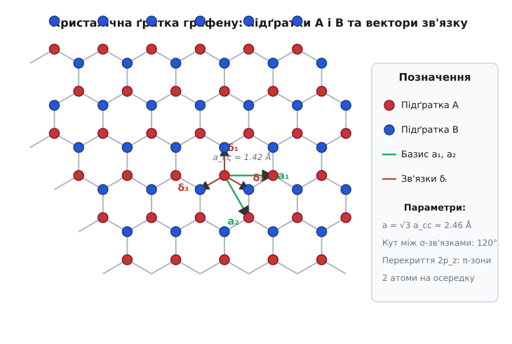
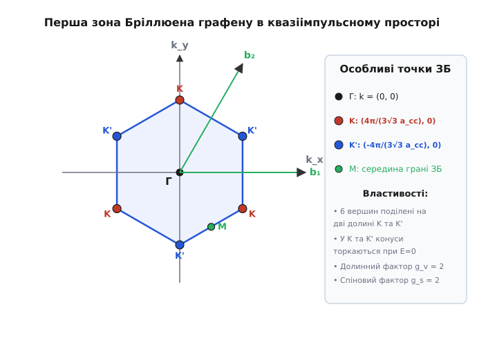
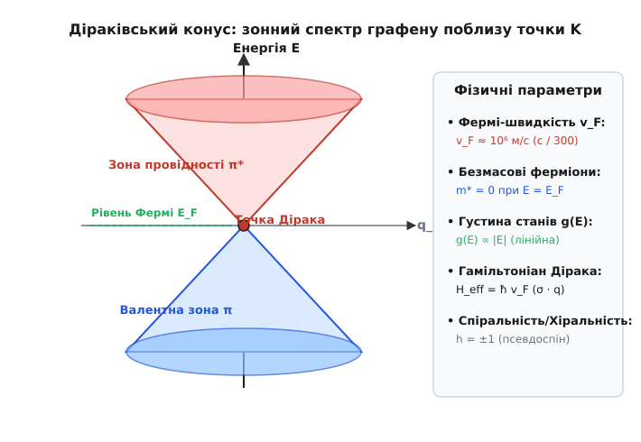

# Зонна структура графену та діраківські ферміони

<preknowlist>
- [Зонна теорія твердого тіла](root:ph-condensed/band-theory) — утворення енергетичних зон із дискретних атомних орбіталей у періодичному потенціалі.
- [Рівень Фермі](root:ph-condensed/fermi-level) — енергетична межа заповнення електронних станів при температурі абсолютного нуля.
- [Одновимірне стаціонарне рівняння Шредінгера](root:ph-quantum/stationary-schrodinger-equation) — базова квантова динаміка частинки в потенціалі.
</preknowlist>

Графен (від англ. *graphene*, від грецького *γρᾰ́φειν* — писати) являє собою один атомарний шар вуглецю, упакований у двовимірну гексагональну кристалічну ґратку типу «бджолиних стільників». Завдяки унікальній двопідґратковій симетрії цієї ґратки квазічастинкові збудження у графені підпорядковуються не звичайному рівнянню Шредінгера з квадратичним спектром та ефективною масою, а двовимірному безмасовому рівнянню Дірака. Електрони у графені рухаються зі швидкістю, що лише в триста разів менша за швидкість світла у вакуумі, демонструючи релятивістські ефекти безпосередньо у твердотілій системі при кімнатній температурі.

## Двовимірний кристал із вуглецю та хімічні зв'язки

Нейтральний ізольований атом вуглецю володіє шістьма електронами з електронною конфігурацією основного стану `1s² 2s² 2p²`. Два електрони знаходяться на глибокій заповненій внутрішній оболонці `1s`, а чотири валентні електрони розподіляються по сферично симетричній `2s`-орбіталі та трьох орієнтованих `2p`-орбіталях (`2p_x`, `2p_y`, `2p_z`).

У кристалічному графені відбувається енергетично вигідний процес `sp²`-гібридизації валентних орбіталей. Одна `2s`-орбітальна хвильова функція змішується з двома планарними орбіталями `2p_x` та `2p_y`, утворюючи три гібридні `sp²`-орбіталі, розташовані в одній площині під кутами `120°` одна до одної:

```
|sp²₁⟩ = (1 / √3) |2s⟩ + (√(2/3)) |2p_x⟩
|sp²₂⟩ = (1 / √3) |2s⟩ - (1 / √6) |2p_x⟩ + (1 / √2) |2p_y⟩
|sp²₃⟩ = (1 / √3) |2s⟩ - (1 / √6) |2p_x⟩ - (1 / √2) |2p_y⟩
```

Ці плоскі гібридні орбіталі перекриваються з відповідними орбіталями трьох сусідніх атомів вуглецю, утворюючи надзвичайно міцні ковалентні σ-зв'язки. Відстань між найближчими атомами вуглецю у площині графену дорівнює `a_cc = 1.4208 Å`, а енергія зв'язку сягає `4.7 еВ` на один ковалентний зв'язок. Перекриття σ-орбіталей формує глибоку заповнену валентну σ-зону та високорозташовану вільну σ*-зону провідності, які розділені широким енергетичним зазором понад `12 еВ`. Саме плоскі σ-зв'язки забезпечують рекордну механічну жорсткість та міцність графену: модуль Юнга становить `1.0 ТПа`, а границя міцності на розрив досягає `130 ГПа`.

Четвертий валентний електрон кожного атома вуглецю залишається на негібридизованій `2p_z`-орбіталі, хвильова функція якої орієнтована перпендикулярно до атомарної площини графену. Перекриття `2p_z`-орбіталей сусідніх атомів формує делокалізовану π-електронну систему, яка розпростерта над і під площиною кристала. Саме ці π-електрони знаходяться в околі рівня Фермі й повністю відповідають за унікальні електричні, оптичні, магнітні та кінетичні властивості графену при помірних енергіях.

З геометричної точки зору гексагональна ґратка «бджолиних стільників» не є простою ґраткою Браве, оскільки її атомарні вузли не є трансляційно еквівалентними. Якщо зміститися з одного атома на його найближчого сусіда, орієнтація сусідніх зв'язків повертається на `180°`. Тому ґратка графену описується як двовимірна трикутна ґратка Браве з двоатомним базисом, що складається з двох фізично нееквівалентних підґраток, позначуваних як `A` та `B`. Кожен атом підґратки `A` оточений трьома найближчими сусідами з підґратки `B`, і навпаки.


*Кристалічна ґратка графену складається з двох еквівалентних трикутних підґраток A та B з відстанню між найближчими атомами a_cc = 1.42 Å.*

Базисні вектори примітивної трансляції `a₁` та `a₂`, які пов'язують еквівалентні вузли однієї і тієї ж підґратки, задаються у декартових координатах:

```
a₁ = (a_cc · √3 / 2,  a_cc · 3 / 2)
a₂ = (a_cc · √3 / 2, -a_cc · 3 / 2)
```

Постійна ґратки (довжина базисного вектора трансляції) становить `a = |a₁| = |a₂| = a_cc · √3 ≈ 2.46 Å`. Три вектори `δ₁`, `δ₂`, `δ₃`, які з'єднують обраний атом підґратки `A` з його трьома найближчими сусідами на підґратці `B`, задаються координатами:

```
δ₁ = (a_cc · √3 / 2,  a_cc / 2)
δ₂ = (-a_cc · √3 / 2, a_cc / 2)
δ₃ = (0, -a_cc)
```

## Термодинаміка двовимірного кристала та тривимірні вигини

Довгий час існування вільного атомарно тонкого графену вважалося термодинамічно неможливим. Згідно з класичними теоріями Ландау — Паєрлса та теоремою Мерміна — Вагнера, у суворо двовимірних системах теплові флуктуації атомарних зміщень при будь-якій температурах `T > 0 K` повинні логарифмічно зростати зі збільшенням розмірів кристала. Довгохвильові акустичні фонони руйнують дальній позиційний порядок, призводячи до скручування або розпаду двовимірної плівки.

Зокрема, флуктуаційна дисперсія атомарного зміщення `⟨u²⟩` у двовимірній плівці описується логарифмічним інтегралом:

```
⟨u²⟩ ∝ (k_B · T / (2π · κ)) · ∫ (dq / q) ∝ (k_B · T / (2π · κ)) · ln(L / a)
```

де `κ` — вигинна жорсткість плівки, `L` — макроскопічний розмір кристала, `a` — постійна ґратки. При збільшенні розміру кристала `L → ∞` теплові зміщення `⟨u²⟩` перевищують квадрат міжатомної відстані `a²`, що свідчит про руйнування трансляційної впорядкованості кристалічної ґратки.

Проте в реальності вільний графен стабілізується завдяки виходу в третій вимір: атомарна плівка покривається мікроскопічними деформаціями вигину (зморшками, rippling) з амплітудою близько `1 нм` і періодом `10–25 нм`. Ці тривимірні вигини зв'язують поздовжні й поперечні фононні моди. Завдяки ангармонічному зв'язку поздовжніх і вигинних фононів ефективна вигинна жорсткість графену `κ(q)` зростає при малих імпульсах за степеневим законом `κ(q) ∝ q^(-η)` з показником `η ≈ 0.85`. Це робить флуктуаційний інтеграл скінченним і забезпечує термодинамічну стійкість кристала в 3D-просторі.

Детальніше про історії того, як цей атомарно тонкий матеріал перейшов із категорії теоретичних моделей у реальність, викладено в [історії ізоляції графену](root:ph-condensed/graphene-band-structure/hist-graphene-isolation.md).

## Обернений простір та особливі точки зони Бріллюена

Для аналізу квазіімпульсного спектра побудуємо обернену ґратку графену. Вектори оберненої ґратки `b₁` та `b₂` визначаються зі стандартної умови ортонормованості `a[i] · b[j] = 2π δ[ij]`:

```
b₁ = (2π / (a_cc · √3),  2π / (3 a_cc))
b₂ = (2π / (a_cc · √3), -2π / (3 a_cc))
```

Обернена ґратка графену також є двовимірною гексагональною трикутною ґраткою, повернутою на `30°` відносно осей прямої кристалічної ґратки.

Перша зона Бріллюена являє собою правильний шестикутник у двовимірному квазіімпульсному просторі `(k_x, k_y)` із відстанню від центру до вершин `K = 4π / (3 √3 a_cc)`.


*Перша зона Бріллюена графену має гексагональну форму з шістьма вершинами, що розпадаються на дві нееквівалентні долині K та K'.*

Серед усіх точок квазіімпульсного простору ключову роль у фізиці електронних явищ відіграють точки високої симетрії:
- Точка `Γ = (0, 0)` в самому центрі зони Бріллюена;
- Три нееквівалентні точки `M` на серединах граней шестикутника;
- Шість кутових вершин шестикутника зони Бріллюена.

Шість кутових вершин зони Бріллюена розпадаються на два триелементні набори нееквівалентних точок, які позначаються як `K` та `K'`. Будь-які дві вершини з одного набору пов'язані між собою вектором оберненої ґратки і є квантово-механічно тотожними, тоді як вершини з різних наборів (`K` та `K'`) не зв'язані векторами оберненої ґратки.

Обидва набори точок називаються долинами (valleys). Вони задають додатковий дискретний ступінь вільноти електрона — долинний індекс `τ = ±1`. Операція інверсії простору `P` зв'язує точки `K` та `K'`, а операція інваріантності відносно звернення часу `T` переводить точку `K` в `K'`. У декартових координатах точки Дірака `K` та `K'` мають координати:

```
K  = (4π / (3 · √3 · a_cc), 0)
K' = (-4π / (3 · √3 · a_cc), 0)
```

Якщо інверсійну симетрію підґраток `A` та `B` порушено (наприклад, при розміщенні графену на підкладці гексагонального нітриду бору `h-BN`, де атоми бор і азот мають різну електронегативність), підґратки отримають різні атомарні потенціали `ε_A ≠ ε_B`. Це приведе до відкриття забороненої зони `Δ = |ε_A - ε_B|` у точках `K` та `K'`.

## Модель сильного зв'язку та безщілинний напівметал

Для розрахунку зонного спектра π-електронів у графені застосовується наближення сильного зв'язку (метод ЛКАО — лінійна комбінація атомарних орбіталей). Оскільки на кожен елементарний осередок припадає два атоми (`A` та `B`), хвильова функція електрона шукається у вигляді суперпозиції двох блохівських функцій підґраток:

```
|Ψ(k)⟩ = c_A(k) |Ψ_A(k)⟩ + c_B(k) |Ψ_B(k)⟩
```

У наближенні найближчих сусідів діагональні елементи матриці гамільтоніана вибираються рівними нулю (`H_AA = H_BB = 0`), а недіагональний елемент `H_AB(k)` визначається квантово-механічними перескоками електронів між сусідніми атомами з інтегралом перескоку `t ≈ 2.8 еВ`:

```
H_AB(k) = -t · f(k)
```

Комплексна функція `f(k)` є геометричним структурним фактором ґратки, який дорівнює сумі фазових множників по трьох найближчих сусідах: `f(k) = e^(i k · δ₁) + e^(i k · δ₂) + e^(i k · δ₃)`. Повний математичний вивід секулярного рівняння детально показано в [математичному виводі зонного спектра](root:ph-condensed/graphene-band-structure/math-tight-binding-graphene.md).

Характеристичне детермінантне рівняння `det(H(k) - E I) = 0` зводиться до `E² - t² |f(k)|² = 0`. Звідси випливає точний аналітичний вираз для енергетичних зон графену:

```
E(k_x, k_y) = ± t · √(1 + 4 · cos(k_x · a_cc · √3 / 2) · cos(k_y · a_cc · 3 / 2) + 4 · cos²(k_x · a_cc · √3 / 2))
```

Знак «+» відповідає зоні провідності (π*), а знак «−» — валентній зоні (π).

У точках високої симетрії `K` та `K'` значення структурного фактора тотожно дорівнює нулю (`|f(K)| = 0`). Це означає, що у точках `K` та `K'` валентна зона та зона провідності торкаються одна одної в одній точці при енергії `E = 0`:

```
E(K) = E(K') = 0
```

Оскільки кожний атом вуглецю віддає в π-систему рівно один електрон, а кожен квантовий стан може містити два електрони з протилежними спінами, валентна зона π виявляється повністю заповненою, а зона провідності π* — порожньою при температурі `T = 0 K`. Рівень Фермі `E_F` проходить точно через точки торкання зон `E = 0`. Графен є безщілинним напівметалом (або напівпровідником із нульовою забороненою зоною).

При врахуванні перескоків другого порядку між атомами однієї і тієї ж підґратки з інтегралом перескоку `t' ≈ 0.1 t ≈ 0.25 еВ` спектр набувает виразної асиметрії між електронами та дірками:

```
E_±(k) = -t' · C(k) ± t · |f(k)|
```

де функція `C(k) = 2 cos(k · a₁) + 2 cos(k · a₂) + 2 cos(k · (a₁ - a₂))`. Хоча точки Дірака при цьому зсуваються за енергією на величину `+3 t'`, самі точки торкання зон залишаються безщілинними, гарантуючи збереження топологічних властивостей діраківського спектра.

## Діраківські конуси та релятивістська аналогія

Найцікавіші фізичні властивості графену проявляються при низьких енергіях поблизу точок дотику `K` та `K'`. Розкладемо квазіімпульс у ряд Тейлора поблизу точки `K`: `k = K + q`, де `|q| · a_cc << 1` є малим імпульсом збудження.

При такому розкладанні структурний фактор стає лінійно пропорційним імпульсу: `f(K + q) ≈ -(3/2) a_cc (q_x - i q_y)`.


*Діраківський конус показує лінійне торкання валентної зони та зони провідності в точці Дірака з постійним нахилом, що визначається Фермі-швидкістю v_F.*

Енергетичний спектр поблизу точок Дірака набуває суворо лінійного вигляду:

```
E(q) = ± ħ · v_F · |q| = ± ħ · v_F · √(q_x² + q_y²)
```

де `v_F` — швидкість Фермі, яка визначається фундаментальними параметрами ґратки:

```
v_F = (3 · a_cc · t) / (2 · ħ) ≈ 10⁶ м/с
```

Швидкість Фермі `v_F` у графені є константою, яка не залежить від енергії чи імпульсу електрона. Вона приблизно в `300` разів менша за швидкість світла у вакуумі (`c ≈ 3 × 10⁸ м/с`).

Ефективний низькоенергетичний гамільтоніан `H_eff(q)` у базисі двох підґраток `(Ψ_A, Ψ_B)^T` записується через 2D-матриці Паулі `σ_x` та `σ_y`:

```
H_eff(q) = ħ · v_F · (σ_x · q_x + σ_y · q_y) = ħ · v_F · (σ · q)
```

Це рівняння за формою збігається з двовимірним релятивістським рівнянням Дірака — Вайля для безмасових частинок зі спіном 1/2. При цьому роль швидкості світла виконує Фермі-швидкість `v_F`, а матриці Паулі `σ` діють не у просторі реального фізичного спіну електрона, а у просторі підґраткового псевдоспіну.

Для другої долини `K'` гамільтоніан має вигляд `H_eff'(q) = ħ v_F (σ_x q_x - σ_y q_y)`, що відрізняється транспонованою комплексною хіральністю. Повний гамільтоніан графену враховує чотирикратне виродження станів (два спінові стани `g_s = 2` та два долинні стани `g_v = 2`).

## Псевдоспін, хіральність та парадокс Клейна

Псевдоспін — це двокомпонентний квантовий ступінь вільноти, який визначає амплітуду ймовірності знаходження електрона на підґратці `A` чи `B`. Якщо електрон повністю знаходиться на підґратці `A`, вектор псевдоспіну спрямований «вгору», якщо на підґратці `B` — «вниз». У діраківських конусах псевдоспін жорстко зафіксований відносно напрямку імпульсу `q`.

Квантово-механічний оператор хіральності (або спіральності) визначається як проекція псевдоспіну на напрямок руху частинки:

```
h = (σ · q) / |q|
```

Власні значення оператора хіральності дорівнюють `h = +1` для електронів у зоні провідності та `h = -1` для дірок у валентній зоні. Хіральність є збережуваним квантовим числом під час пружного розсіяння на гладких електростатичних потенціалах, які змінюються повільно на масштабі постійної ґратки і не розрізняють окремі атоми підґраток `A` та `B`.

Збереження хіральності приводить до фундаментального фізичного ефекту — пригнічення розсіяння назад (backscattering suppression). Для того, щоб електрон розсіявся на кут `180°` (`q → -q`), його імпульс повинен змінити знак. Але при зміні напрямку імпульсу напрямок псевдоспіну для збереження хіральності `h = +1` також повинен повернутися на `180°`. Оскільки стани з протилежними псевдоспінами є ортогональними `⟨χ(q)| χ(-q)⟩ = 0`, матричний елемент розсіяння назад строго дорівнює нулю.

Це явище лежить в основі релятивістського парадоксу Клейна: безмасові діраківські ферміони проходять крізь високі й широкі електростатичні потенціальні бар'єри зі 100% прозорістю при нормальному падінні. Електрон під бар'єром не відбивається, а безперешкодно перетворюється на дірку у валентній зоні всередині бар'єра, переносячи заряд без лобового відбиття. При похилому падінні виникає кутова залежність тунелювання, описана ефектом Клейна — Тюннеля.

## Фізика крайніх станів: нанострічки графену

Коли нескінченний шар графену обмежується у вигляді вузької нанострічки (graphene nanoribbons, GNR), межові умови на краях кристала кардинально змінюють зонний спектр залежно від орієнтації краю.

Розрізняють два основних типи країв нанострічок:
1. **Край типу «Armchair» (крісло-подібний край).** Межа паралельна вектору `a_cc √3`. Електрони на Armchair-краях зазнають міждолинного розсіяння, що змішує стани `K` та `K'`. Зонний спектр Armchair-нанострічок залежить від кількості атомних ліній `N`: при `N = 3p + 2` (де `p` — ціле число) нанострічка є напівметалевою, а при `N = 3p` та `N = 3p + 1` утворюється заборонена зона, зворотна ширині нанострічки `E_g ∝ 1 / W`.
2. **Край типу «Zigzag» (зигзагоподібний край).** Межа паралельна міжатомному зв'язку. На Zigzag-краях виникають локалізовані крайні стани (edge states) із плоскими зонами при енергії `E = 0`. Ці стани зосереджені переважно на одній підґратці на краю кристала і приводять до появи локалізованого ферромагнетизму на межі нанострічки.

## Динаміка фононів та електрон-фононне розсіяння

Кристалічна ґратка графену володіє двома атомами на осередку в двовимірному просторі, що приводить до існування шести фононних гілок збудження: трьох акустичних (LA, TA, ZA) та трьох оптичних (LO, TO, ZO).

Найбільш незвичайною фононною модою у графені є вигинна акустична мода ZA (out-of-plane flexural phonons). На відміну від звичайних поздовжніх LA та поперечних TA акустичних мод із лінійним законом дисперсії `ω ∝ q`, вигинна мода ZA володіє квадратичною дисперсією при малих імпульсах:

```
ω_ZA(q) = √(κ / ρ_2D) · q²
```

де `κ ≈ 1.1 еВ` — вигинна жорсткість графену, а `ρ_2D ≈ 7.6 × 10^(-7) кг/м²` — 2D-масова плотність. Саме квадратична дисперсія вигинних фононів визначає високу теплопровідність графену при кімнатній температурі (`5000 Вт/(м·К)`) та приводить до від'ємного коефіцієнта теплового розширення при низьких температурах.

Електрон-фононна взаємодія у графені визначається двома основними механізмами: акустичним деформаційним потенціалом `D_D ≈ 18 еВ` та оптичним розсіянням на високоенергетичних `E_2g` фононах (`ħ ω_LO ≈ 196 меВ`). Через високу енергію оптичних фононів внутрішнє розсіяння носіїв при кімнатній температурі є надзвичайно слабким, що забезпечує довжину вільного пробігу електронів `λ_mfp > 1 мкм` і балістичний режим переносу заряду у мікроскопічних приладах.

## Електрон-електронна взаємодія та ренормгрупова перебудова Швидкості Фермі

Незважаючи на те, що діраківські ферміони є безмасовими, довгосяжна кулонівська взаємодія між електронами виграє важливу роль при малих концентраціях носіїв.

Безрозмірний параметр кулонівської взаємодії (ефективна стала тонкої структури у графені) визначається відношенням потенціальної кулонівської енергії до кінетичної енергії частинок:

```
α_g = e² / (4π · ε · ε₀ · ħ · v_F) ≈ 2.2 / ε
```

де `ε` — ефективна діелектрична проникність навколишнього середовища. У вільно підвішеному графені у вакуумі (`ε = 1`) параметр взаємодії дорівнює `α_g ≈ 2.2`, що свідчить про помірно сильний зв'язок.

Завдяки електрон-електронній взаємодії швидкість Фермі `v_F` зазнає логарифмічної ренормалізації при наближенні до точки Дірака (`E → 0` або `k → 0`):

```
v_F(k) = v_F0 · (1 + (α_g / 4) · ln(k_0 / k))
```

де `v_F0` — гола швидкість Фермі, а `k_0` — імпульсний cutoff порядку постійної ґратки. Ця логарифмічна ренормалізація виявляється в угнутості діраківського конуса в самому околі точки нейтральності, що спостерігається експериментально за допомогою фотоелектронної спектроскопії з кутовим розділенням (ARPES).

## Багатошаровий графен: відмінності між AB та ABC упакуванням

При переході від моношару до двох і трьох шарів графену зонна структура залежить від геометрії міжшарового накладення.

У двох шарах графену з Берналівським упакуванням (AB-stacking) атоми підґратки `A₂` другого шару знаходяться точно над атомами підґратки `B₁` першого шару. Це міжшарове перекриття `γ₁ ≈ 0.4 еВ` трансформує лінійні конуси Дірака у параболічне торкання зон з квадратичним законом дисперсії:

```
E(k) = ± (ħ² · k²) / (2 · m*)
```

з ефективною масою `m* ≈ 0.033 m_e`. При цьому псевдоспінова фаза Беррі стає `2π`, а парадокс Клейна замінюється на квантове відбиття (ефект Клейна — парадокс відсутній).

У тришаровому графені з ромбоедричним упакуванням (ABC-stacking) дисперсія в точці дотику стає кубічною `E(k) ∝ k³`, виникає фаза Беррі `3π` та формуються надзвичайно пласкі зони з високою густиною станів при енергії Фермі.

## Плазмоніка та поверхневі плазмон-поляритони

Двовимірний електронний газ у графені підтримує існування специфічних плазмонних збуджень — плазмонів Дірака (Dirac plasmons).

На відміну від тривимірних металів, де плазмонна частота становить кілька електронвольт, у графені дисперсія 2D-плазмонів описується виразом:

```
ω_plasmon(q) = √((2 e² E_F / (ε ħ²)) · q) ∝ q^(1/2)
```

Частота плазмонів графену лежить у терагерцовому та інфрачервоному діапазонах, а довжина хвилі плазмона є в 40-100 разів коротшою за довжину хвилі світла тієї ж частоти у вакуумі. Це забезпечує гігантську локалізацію світла на наномасштабах.

## Нелінійна терагерцова фотоніка та газові сенсори

Безмасовий лінійний спектр надає графену унікальних нелінійних оптичних властивостей при опроміненні терагерцовим (THz) та інфрачервоним випромінюванням.

Через відсутність ефективної маси швидкість носіїв у графені є константою `v_F`, тому під дією змінного електричного поля `E(t) = E_0 cos(ω t)` струм носіїв стає ступенчатим прямокутним сигналом. Це приводить до ефективної генерації вищих оптичних гармонік (High-Harmonic Generation, HHG) на кімнатній температурі при помірних інтенсивностях світла.

Крім того, оскільки густина станів у точці Дірака дорівнює нулю `g(E=0) = 0`, провідність графену виявляється надзвичайно чутливою до адсорбції окремих газуватих молекул (`NO₂`, `NH₃`, `CO`). Перенос заряду від молекули до графену зсуває рівень Фермі `E_F`, що дозволяє створювати газові сенсори гра граничної чутливості аж до виявлення поодиноких молекул.

## Квантові мембрани та непроникність для газів

Ідеальна бездефектна кристалічна ґратка графену являє собою абсолютний бар'єр для проникнення будь-яких атомів і молекул при кімнатній температурі.

Густина електронів у σ-зв'язках створює високий потенціальний бар'єр (понад `4.5 еВ` для атома гелію `He`), який запобігає просочуванню вільних атомів крізь шестиатомні вуглецеві кільця. Вільний графен є найбільш тонкою непроникною мембраною у природі.

Проте за наявності локальних вакансій чи під дією термічних флуктуацій спостерігається селективний квантовий перенос протонів (ідей `H⁺`) та дейтеронів через плівку, що відкриває нові можливості для розділення ізотопів та створення нових мембран паливних елементів.

## Спінтроніка та магноніка у 2D-кристалах

Завдяки малому зарядовому числу атома вуглецю `Z = 6` внутрішня спін-орбітальна взаємодія у графені є надзвичайно слабкою (`Δ_SO ≈ 24 мкеВ`), а ядра природного вуглецю `¹²C` не мають ядерного спіну (`I = 0`).

Це забезпечує гігантську довжину релаксації спінового струму (`λ_spin > 10 мкм`) при кімнатній температурі. Електрони можуть зберігати спінову орієнтацію на мікроскопічних відстанях, що робить графен ідеальним матеріалом для спінтроніки (спінові транзистори, спінові клапани, магніторезистивні елементи пам'яті).

## Двовимірні напівпровідникові аналоги: силіцен, германен, станен

Відкриття зонної структури графену стимулювало пошук подібних двовимірних матеріалів серед елементів IV групи періодичної таблиці Менделєєва: силіцену (`Si`), германена (`Ge`) та станена (`Sn`).

На відміну від ідеально плаского графену, у силіцені, германені та станені атоми зміщені відносно площини у бакльовану (гофровану, buckled) структуру із висотою гофрування `Δ_z ≈ 0.4 - 0.8 Å`. Бакльована структура виникає через те, що важчі елементи IV групи надають перевагу змішаній `sp²-sp³` гібридизації замість чистої `sp²`-гібридизації.

Завдяки наявності вертикального зміщення `Δ_z` при накладанні перпендикулярного електричного поля `E_z` у силіцені відкривається регульована заборонена зона `Δ_g = 2 e E_z Δ_z`. Крім того, спін-орбітальна взаємодія у силіцені (`1.55 меВ`), германені (`24 меВ`) та станені (`100 меВ`) значно перевищує спін-орбітальну щілину графену (`24 мкеВ`), що робить ці матеріали природними 2D-топологічними ізоляторами з можливістю спостереження квантового спінового ефекту Холла при помірних температурах.

## Скручений двошаровий графен та магічний кут

Коли два шари графену накладаються один на одного під невеликим кутом взаємного повороту `θ` (twisted bilayer graphene, TBG), виникає великомасштабна надґратка Муара з періодом `L_M = a / (2 sin(θ/2))`.

При зменшенні кута повороту до так званого «магічного кута» `θ_magic ≈ 1.08°` міжшарова кулонівська взаємодія та перескоки між шарами повністю компенсують кінетичну енергію електронів. Енергетичний спектр Дірака у першій зоні Бріллюена надґратки Муара перетворюється на плоскі зони (flat bands) із шириною менше `10 меВ`.

У цих плоских зонах кінетична енергія електронів пригнічується, а кулонівське відштовхування стає домінуючим фактором. Це приводить до виникнення сильних електронних кореляцій: скручений графен при магічному куті стає моттівським диелектриком, а при невеликому легуванні затвором переходить у стан нетрадиційної надпровідності з критичною температурою `T_c ≈ 1.7 K`.

## Оптичні властивості та універсальне поглинання

Завдяки лінійному спектру міжзонні оптичні переходи у графені демонструють фундаментальну універсальність. Коефіцієнт поглинання світла моношаровим графеном у широкому спектральному діапазоні (від інфрачервоного до ультрафіолетового) визначається комбінацією фундаментальних фізичних констант:

```
A = π · α = π · (e² / (4π · ε₀ · ħ · c)) ≈ 2.293%
```

де `α ≈ 1/137` — стала тонкої структури квантової електродинаміки. Таким чином, поодинокий атомарний шар вуглецю товщиною `0.335 нм` затримує понад `2.3%` світла в оптичному діапазоні, що є рекордним показником оптичного взаємодії для матеріалу такої товщини.

Крім того, плазмонні збудження у графені (двовимірні плазмони) володіють високим ступенем локалізації електромагнітного поля та високою рухливістю, а їхню резонансну частоту можна ефективно переналаштовувати за допомогою напруги на затворі у терагерцовому та інфрачервоному діапазонах.

## Густина станів, ефективна маса та квантовий ефект Холла

Лінійний характер діраківського спектра радикально змінює термодинамічні та транспортні властивості графену порівняно зі звичайними 2D-системами.

Інтегральна густина станів `g(E)` на одиницю площі з урахуванням чотирикратного виродження (`g_s = 2`, `g_v = 2`) визначається виразом:

```
g(E) = (2 · |E|) / (π · ħ² · v_F²)
```

У графені густина станів залежить від енергії суворо лінійно `g(E) ∝ |E|` і звертається в нуль у точці Дірака `E = 0`. У звичайних двовимірних напівпровідникових гетероструктурах із квадратичним спектром густина станів є постійною величиною `g(E) = m* / (π ħ²) = const`.

У точках `M` (середина граней зони Бріллюена при енергії `E = ± t ≈ ± 2.8 еВ`) градієнт енергії дорівнює нулю `∇[k] E(k) = 0`. Цим сідловим точкам відповідають сінгулярності Ван Хова — логарифмічні піки у густині станів `g(E) ∝ -ln|E - t|`.

Ефективна маса частинок визначається через другу похідну дисперсії `m* = ħ² / (d²E/dk²)`. Для лінійного спектра `d²E/dk² → ∞`, що означає, що ефективна маса спокою носіїв у точці Дірака строго дорівнює нулю `m* = 0`. При відхиленні від рівня Фермі циклотронна маса носіїв залежить від концентрації `n` як `m_c = E_F / v_F² = (ħ / v_F) √(π n)`. Відсутність маси спокою та пригнічення розсіяння назад забезпечують гігантську рухливість електронів у графені (понад `200 000 см²/(В·с)` у вільно підвішених зразках при кімнатній температурі).

У сильному перпендикулярному магнітному полі `B` лінійний спектр Дірака квантується у специфічні рівні Ландау:

```
E[N] = sgn(N) · v_F · √(2 · e · ħ · B · |N|)
```

де `N = 0, ±1, ±2, ...` — ціле число. Зверніть увагу, що при `N = 0` існує нерухомий рівень Ландау точно при `E = 0`, енергія якого не залежить від величини магнітного поля. Цей нульовий рівень Ландау ділиться порівну між електронами та дірками.

Наявність ротаційної фази Беррі `γ = π` та нульового рівня Ландау приводить до незвичайного напівцілочисельного квантового ефекту Холла. Холлівська провідність плато квантується за формулою:

```
σ_xy = ± 4 · (n + 1/2) · (e² / h)
```

де `n` — ціле число, а множник `4` враховує двократне спінове та двократне долинне виродження. Цей ефект чітко спостерігається у графені навіть при кімнатній температурі (`T = 300 K`).

Ознайомитися з програмою чисельного розрахунку спектра, зони Бріллюена та густини станів можна у [чисельному моделюванні зонної структури](root:ph-condensed/graphene-band-structure/proj-graphene-dispersion.md).

> 🔧 **Навіщо це.**
> Зонна структура графену та безмасовий характер діраківських ферміонів відкривають унікальні технологічні застосування. Рекордна рухливість носіїв заряду дозволяє створювати надвисокочастотні польові транзистори (радіочастотні змішувачі та підсилювачі з робочими частотами в сотні гігагерц). Завдяки прозорості (поглинання всього 2.3% світла) та високій провідності графен є ідеальним кандидатом для гнучких прозорих електродів дисплеїв і сонячних батарей. У квантовій метрології напівцілочисельний квантовий ефект Холла в графені при кімнатній температурі використовується як новий первинний etalon квантового опору (стала Клітцинга `R_K = h / e² ≈ 25812.8 Ом`). Крім того, псевдоспін та долинний ступінь вільноти утворюють основу нової квантової елементної бази — долинотроніки (valleytronics).
