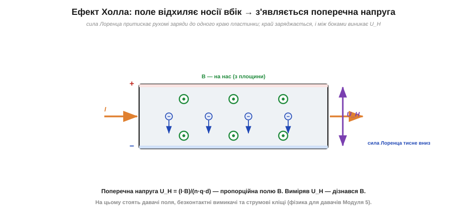
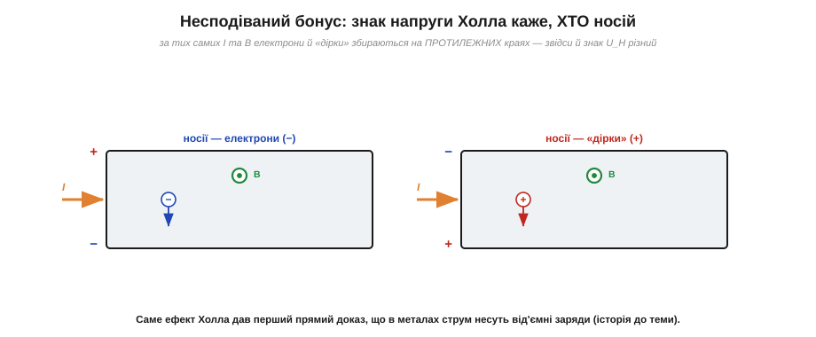

# Ефект Холла: поле відхиляє носії в провіднику

[Сила Ампера](root:ph-electromagnetism/ampere-force) описує провідник **ззовні**: поле штовхає дріт як ціле. А що відбувається **всередині**, з кожним окремим рухомим зарядом? Виявляється, поле діє не на «дріт узагалі», а на кожен носій заряду персонально, відхиляючи його вбік. Це призводить до тонкого, але надзвичайно корисного явища — **ефекту Холла**. На ньому стоять цілі класи давачів: безконтактні вимикачі, давачі положення й кута, вимірювачі струму. Тож розберімо його уважно — це фізична основа того, як електроніка «відчуває» магнітне поле.

### Сила Лоренца: поле відхиляє рухомий заряд

Спершу — глибша причина сили Ампера. Магнітне поле діє з силою на **будь-який рухомий заряд**: це **сила Лоренца** (*Lorentz force*). Її дві ключові риси такі самі, як у сили Ампера (бо це по суті те саме, лише на рівні одного заряду): сила перпендикулярна і до швидкості заряду, і до поля, а величина пропорційна заряду q, швидкості v та полю B:

```
F = q · v · B        (коли швидкість перпендикулярна полю)
```

Нерухомий заряд (v = 0) поле не відчуває зовсім — магнетизм діє **лише на рух**. А оскільки [струм у дроті — це і є рух зарядів](root:ph-electromagnetism/electric-current), то сила Ампера на весь дріт є просто сумою сил Лоренца на всі його рухомі заряди. Сила Ампера й сила Лоренца — одне явище у двох масштабах.

Варто наголосити на двох рисах сили Лоренца, бо саме вони породжують ефект Холла. Перша: сила перпендикулярна швидкості — а отже, вона **не прискорює** заряд уздовж руху й не виконує над ним роботи, лише **скривлює** його траєкторію вбік. Магнітне поле не може ні розігнати, ні загальмувати вільний заряд — воно тільки повертає його. Друга: напрям повороту залежить від **знаку** заряду — додатні й від'ємні носії за тих самих v і B відхиляються в **протилежні** боки. Обидві риси прямо породжують ефект Холла.

### Як виникає напруга Холла

Тепер простежмо, що ця сила робить усередині провідника. Пустимо струм уздовж плоскої пластинки й накладемо поле B перпендикулярно до неї (на нас із площини). Носії заряду дрейфують уздовж пластинки зі швидкістю v (це [дрейфова швидкість](root:ph-condensed/electron-drift)) — а поле, за силою Лоренца, відхиляє їх **убік**, до одного краю. Носії починають **накопичуватись** біля цього краю, заряджаючи його; протилежний край лишається з нестачею носіїв і заряджається протилежно. Між боками пластинки виникає **поперечна напруга** — її й називають **напругою Холла** (*Hall voltage*, U_H).

Зверніть увагу на витончену рівновагу, що тут установлюється, — вона того ж роду, що й рівновага в багатьох фізичних системах. Спершу сила Лоренца жене носії вбік нічим не стримувано. Але щойно на краю зібрався заряд, він створює **поперечне електричне поле**, спрямоване проти подальшого накопичення — і це поле тисне на наступні носії [електричною силою](root:ph-electromagnetism/electric-field). Накопичення триває рівно доти, доки електрична сила не **зрівноважить** магнітну. У точці рівноваги нові носії вже не зносить убік — вони течуть прямо вздовж пластинки, а на краях стоїть стала напруга. Це самовстановлювана рівновага: система сама знаходить той заряд на краях, за якого дві сили точно гасяться. Саме тому напруга Холла стабільна й відтворювана — на ній можна будувати точний давач.


*Струм I тече вздовж пластинки, поле B спрямоване на нас. Сила Лоренца притискає рухомі носії до одного краю — той заряджається, протилежний заряджається навпаки, і впоперек пластинки виникає напруга U_H = (I·B)/(n·q·d). Накопичення триває, поки електричне відштовхування не зрівноважить силу Лоренца, — і тоді U_H стабільна.*

Накопичення не безмежне: щойно на краях зібралося досить заряду, його власне електричне поле починає **відштовхувати** наступні носії назад. Коли це відштовхування точно врівноважує силу Лоренца, накопичення припиняється, і напруга Холла встановлюється на сталому значенні. Її величина:

```
U_H = (I · B) / (n · q · d)
```

де **n** — концентрація носіїв, **q** — заряд носія, **d** — товщина пластинки. Найважливіше в цій формулі: за сталих I, n, d напруга Холла **прямо пропорційна полю B**. Тобто, вимірявши U_H, ми міряємо магнітне поле. Це й робить ефект Холла основою давачів поля.

> 📜 **Історична вставка:** [Едвін Холл — ефект, відкритий за 18 років до електрона](root:ph-condensed/hall-effect/hist-hall.md) — як молодий аспірант 1879 року виявив поперечну напругу, ще не знаючи, що ж саме в металі рухається.

### Несподіваний бонус: знак напруги викриває носіїв

Ефект Холла подарував фізиці дещо більше за давач поля — він дав перший **прямий доказ**, які заряди несуть струм у провіднику. Адже куди саме накопичаться носії (а отже, який край стане плюсом, а який мінусом), залежить від **знаку** носіїв. Один і той самий струм можна уявити двояко: або від'ємні носії течуть в один бік, або (умовно) додатні — у протилежний. Сила Лоренца F = q·v·B залежить і від знаку заряду q, і від напряму швидкості v; а в цих двох випадках **обидва** множники протилежні. Здавалося б, два мінуси скасуються й носії підуть в один бік — але річ у тім, що до **одного** краю притискаються самі носії, а полюсом стає той край залежно від їхнього знаку. У підсумку плюс і мінус на краях пластинки міняються місцями: знак напруги Холла виходить **різним** для від'ємних і додатних носіїв.


*Знак U_H викриває тип носіїв. За тих самих напрямів I та B від'ємні носії (електрони) і додатні («дірки») накопичуються на **протилежних** краях пластинки — тож знак поперечної напруги в них різний. Саме так ефект Холла дав перший прямий доказ, що в металах струм несуть від'ємні заряди.*

Це був разючий результат: ще до відкриття електрона ефект Холла показав, що в звичайних металах носії **від'ємні** — підтвердивши, що [реальний носій струму в металі протилежний умовному напрямку струму](root:ph-electromagnetism/current-direction). А ще пізніше, у напівпровідниках, він виявив, що там струм можуть нести й ефективно **додатні** носії — «дірки». Так скромна поперечна напруга стала інструментом, що зазирає в саму природу провідності.

### Чому давачі роблять із напівпровідників

Формула U_H = (I·B)/(n·q·d) ховає важливий інженерний урок. Напруга Холла обернено пропорційна **концентрації носіїв** n. У металах носіїв надзвичайно багато ([кожен атом віддає електрон-два у «море»](root:ph-condensed/electron-drift)), тож n величезне, і поперечна напруга виходить мікроскопічною — мікровольти, які важко вловити. А в **напівпровідниках** носіїв на багато порядків менше, тому за того самого струму й поля U_H виходить у тисячі разів більшою — міллівольти, які легко підсилити. Ось чому, хоча Холл відкрив ефект на металах (і ледь-ледь його зловив), практичним давачем явище стало лише з приходом напівпровідників. Сучасний давач Холла — це тонка напівпровідникова пластинка (часто з арсеніду галію чи кремнію) разом із вбудованим підсилювачем просто на кристалі.

Друга тонкість — чутливість залежить і від **рухливості** носіїв (як швидко вони набирають дрейфову швидкість у полі). Що рухливіші носії, то сильніше їх відхиляє за того самого струму, і то більша U_H. Тому для найчутливіших давачів обирають матеріали з високою рухливістю. Ефект Холла тісно сплітає «чисту» [фізику провідності](root:ph-condensed/conductivity) з прикладними давачами: ті самі величини n і рухливість, що задають [опір матеріалу](root:ph-condensed/resistance), тепер визначають, наскільки добре він «бачить» магнітне поле.

### Два режими: лінійний і пороговий

Давачі Холла працюють у двох типових режимах, і обидва корисно розрізняти. У **лінійному** давачі вихідна напруга прямо пропорційна полю — такий потрібен, щоб виміряти *скільки* поля (наприклад, який струм тече в дроті чи де саме стоїть магніт). У **пороговому** (ключовому) давачі на кристалі стоїть компаратор, що видає просто «є поле / немає поля»: магніт наблизився — на виході логічна одиниця, віддалився — нуль. Такий давач замінює механічний вимикач, але без жодних контактів, що іскрять і зношуються. На ньому стоять безконтактні кінцеві вимикачі, лічильники обертів, визначення «кришка відкрита/закрита» — усюди, де треба надійно й безконтактно відчути наближення магніту.

> 🔧 **Навіщо це.** Ефект Холла — це очі електроніки в магнітному світі. Давач Холла, піднесений до магніта, дає напругу, пропорційну полю, — і на цьому стоять: безконтактні вимикачі (магніт наблизився — схема спрацювала, без жодних контактів, що зношуються); давачі положення й кута (де магніт на валу, туди й «дивиться» давач); безщіткові мотори (контролер за полем ротора знає, коли перемикати обмотки); струмові кліщі й давачі струму ([поле навколо дроту пропорційне струму](root:ph-electromagnetism/oersted-experiment), а Холл його міряє). Будь-який давач, що «бачить» магнітне поле, спирається саме на цю фізику.

**Приклад (яка напруга Холла на типовому давачі).** Тонка напівпровідникова пластинка давача: товщина d = 0.1 мм, концентрація носіїв n = 2 × 10²¹ м⁻³, струм I = 5 мА, поле B = 0.1 Тл. Оцінимо U_H.

```
U_H = (I · B) / (n · q · d)
U_H = (5×10⁻³ А · 0.1 Тл) / (2×10²¹ м⁻³ · 1.6×10⁻¹⁹ Кл · 1×10⁻⁴ м)
U_H = (5×10⁻⁴) / (3.2×10⁻²)
U_H ≈ 0.0156 В ≈ 15.6 мВ
```

Близько 16 мілівольтів — невелика, але цілком вимірна напруга, яку легко підсилити. Зверніть увагу: у **металах** концентрація носіїв n у тисячі разів більша, тож напруга Холла там була б мікроскопічна (тому давачі роблять із **напівпровідників** — у них носіїв менше, а отже, U_H помітніша). Це пояснює, чому ефект Холла, відкритий на металах ледь-ледь, став практичним давачем лише з напівпровідниками.

**Приклад (як давач Холла міряє струм у дроті).** Навколо [дроту зі струмом](root:ph-electromagnetism/oersted-experiment) є поле B = μ₀·I/(2π·r). Поставмо давач Холла на відстані r = 5 мм від проводу, у якому тече I = 20 А. Яке поле «побачить» давач?

```
B = μ₀ · I / (2π · r)
B = (1.257×10⁻⁶ · 20) / (2π · 5×10⁻³)
B = (2.51×10⁻⁵) / (3.14×10⁻²)
B ≈ 8.0 × 10⁻⁴ Тл = 0.8 мТл
```

Давач Холла перетворить ці 0.8 мТл на пропорційну напругу, а схема перерахує її назад у струм 20 А — і все це **без розриву кола** й без жодного контакту з проводом. Саме так працюють [струмові кліщі](root:hw-sensing/clamp-meter) та безконтактні давачі струму: вони міряють [магнітне поле навколо проводу](root:ph-electromagnetism/oersted-experiment) ефектом Холла й за ним судять про струм. Часто провід ще й охоплюють розімкненим феритовим кільцем, щоб зібрати поле й підсилити сигнал. Це красивий приклад, як два явища — «струм творить поле» і «поле відхиляє носії» — разом дають практичний прилад.

---
