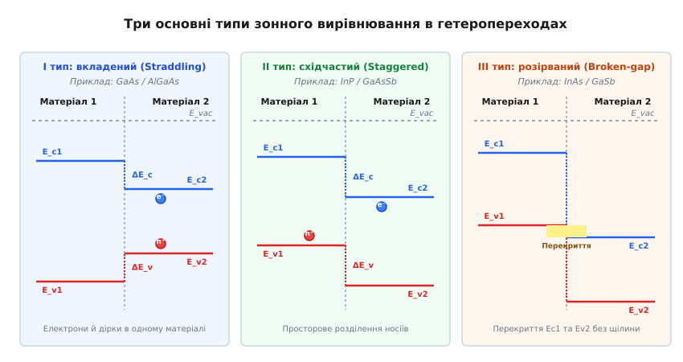
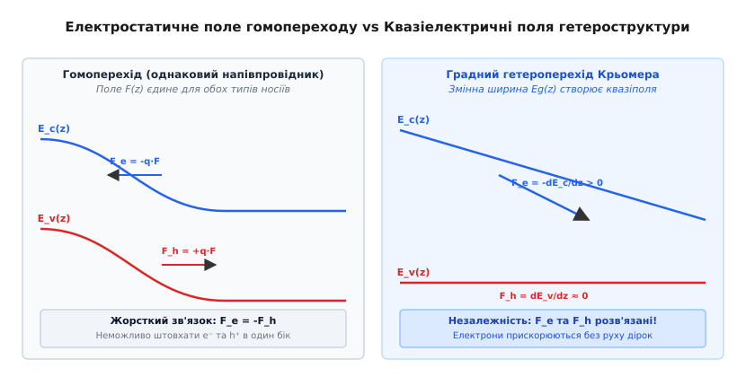
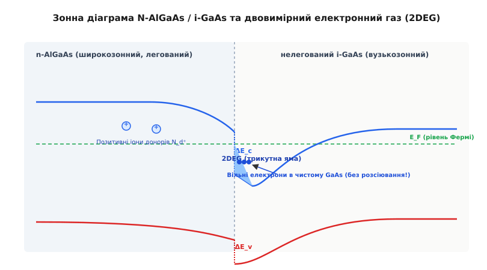
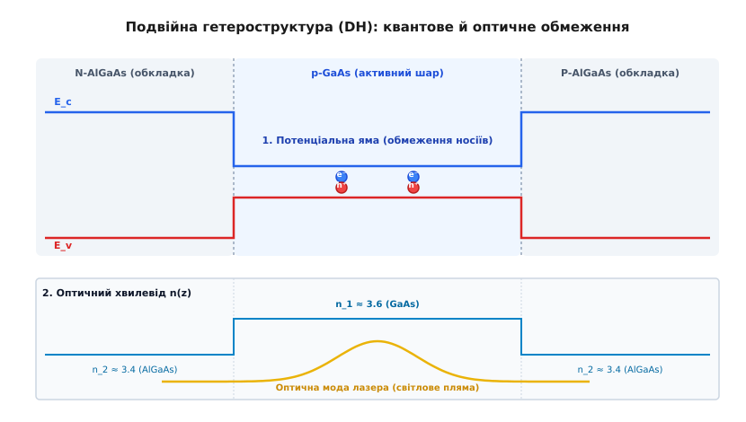

# Напівпровідникові гетеропереходи та співвідношення Крьомера

<preknowlist>
- [PN-перехід: бар'єр і збіднена область](root:ph-condensed/pn-junction) — гомоперехід, збіднена область, вбудований потенціал та дифузія носіїв.
- [Зонна теорія твердих тіл](root:ph-condensed/conductors-insulators) — валентна зона, зона провідності, ширина забороненої зони та ефективна маса.
- [Легування напівпровідників](root:ph-condensed/doping) — донори, акцептори, електронна та діркова провідність, рівень Фермі.
</preknowlist>

Коли два монокристалічні фрагменти кремнію або арсеніду галію з різним типом домішкового легування з'єднуються в єдину кристалічну ґратку, утворюється класичний p-n гомоперехід. Збіднена область без вільних носіїв та вбудоване електростатичне поле регулюють потік носіїв заряду, перетворюючи кристал на однобічний клапан для електричного струму. Однак гомоперехід приховує фундаментальну фізичну обмеженість: висота потенціального бар'єра для електронів і дірок у ньому завжди однакова. Кулонівське електростатичне поле штовхає електрон і дірку з однаковою за модулем силою у протилежні боки, через що інжекційна здатність емітера виявляється жорстко зв'язаною з відношенням концентрацій легуючих домішок.

Щоб змусити перехід інжектувати майже виключно електрони у базу транзистора, емітер доводиться легувати в сотні й тисячі разів сильніше за базу. Це спричиняє звуження забороненої зони через домішкові ефекти, створює дефекти кристалічної ґратки, підсилює безвипромінювальну рекомбінацію та різко зростає опір бази. Фізика класичного гомопереходу впирається у глухий кут, коли вимагається одночасно отримати високу швидкодію, низький опір контакту та ефективне оптичне випромінювання за кімнатної температури.

Виходом із цього фізичного глухого кута стало створення **гетеропереходів** — бездефектних безшовних меж розділу між двома **хімічно різними** напівпровідниковими матеріалами з різними ширинами забороненої зони та різними електронними спорідненостями.

---

### Межа двох різних речовин: фізична природа гетеропереходу

Гетероперехід (*heterojunction*, від грец. *ἕτερος* — інший, різний + перехід) — це контакт двох різних напівпровідникових матеріалів у межах одного суцільного монокристала. На відміну від гомопереходу, де змінюється лише тип і концентрація легуючої домішки (наприклад, донори фосфору замінюються акцепторами бору у кремнії), у гетеропереході на межі розділу стрибком змінюються фундаментальні електрофізичні та квантові параметри напівпровідника:
1. Ширина забороненої зони `E_g` (еВ);
2. Електронна спорідненість `χ` (еВ);
3. Відносна діелектрична проникність `ε_r`;
4. Ефективні маси електронів `m_n*` та дірок `m_p*`;
5. Показник заломлення світла `n`.

У гомопереході потенціальний рельєф формується виключно вигином електростатичного потенціалу `ϕ(z)`, порожнього від просторового заряду іонізованих донорів та акцепторів у збідненій області. У гетеропереході до електростатичного вигину додається квантово-механічний стрибок енергетичних зон, викликаний відмінністю атомних потенціалів двох кристалічних ґраток.

За залежністю від типу провідності контактуючих матеріалів гетеропереходи поділяють на **ізотипні** (n-n або p-p), у яких матеріали мають одинаковий тип провідності носіїв, та **анізотипні** (n-P або p-N, де велика літера позначає широкозонний матеріал), у яких типи провідності протилежні.

Головна фізична відмінність гетеропереходу полягає у тому, що перехід між двома різними зонами провідності та валентними зонами створює **енергетичні розриви** (*band offsets*) на межі розділу: `ΔE_c` для зони провідності та `ΔE_v` для валентної зони. Наявність цих розривів дозволяє формувати потенціальні бар'єри та ями атомарного товщини, якими можна керувати незалежно від рівня легування.

---

### Правило Андерсона та три типи зонного вирівнювання

Найпростішою фізичною моделлю, що описує вирівнювання енергетичних зон на гетеромежі, є модель спорідненості до електрона, запропонована Річардом Андерсоном (*Richard Anderson*) у 1962 році.

Спорідненість до електрона `χ` (лат. *affinitas* — близькість, зв'язок) визначається як квантова енергія, необхідна для вилучення електрона з дна зони провідності `E_c` на вакуумний рівень `E_vac` поза кристалом:

```
χ = E_vac - E_c                      [означення електронної спорідненості]
```

За правилом Андерсона, при з'єднанні двох матеріалів вакуумний рівень `E_vac(z)` залишається неперервним (без стрибків). У результаті різниця спорідненостей двох матеріалів визначає стрибок дна зони провідності `ΔE_c`:

```
ΔE_c = χ₁ - χ₂                        [розрив зони провідності за Андерсоном]
```

Оскільки повна різниця ширин забороненої зони становить `ΔE_g = E_g2 - E_g1`, розрив верху валентної зони `ΔE_v` знаходять із прямого закону збереження енергії:

```
ΔE_c + ΔE_v = ΔE_g                    [баланс повного зонного розриву]
```

```
ΔE_v = ΔE_g - ΔE_c                    [розрив валентної зони]
```

Залежно від відносного розташування заборонених зон двох матеріалів виділяють **три основні типи зонного вирівнювання** (*band lineup*):


*Три типи зонного вирівнювання на межі двох напівпровідників: I тип (вкладений) утримує обидва типи носіїв у вузькозонному матеріалі; II тип (східчастий) просторово розділяє електрони й дірки; III тип (розірваний) створює перекриття зон без енергетичної щілини.*

#### 1. Перший тип (I тип: вкладений / Straddling)
Заборонена зона вузькозонного напівпровідника 2 повністю лежить усередині забороненої зони широкозонного напівпровідника 1 (`E_c1 > E_c2` та `E_v1 < E_v2`).
- **Приклад:** `GaAs / Al_x Ga_{1-x} As`, `InP / In_{0.53} Ga_{0.47} As`.
- **Фізичний наслідок:** Обидва розриви `ΔE_c` та `ΔE_v` спрямовані всередину вузькозонного матеріалу. Це створює потенціальну яму **одночасно і для електронів, і для дірок**, забезпечуючи їхнє ефективне просторове локалізування у тій самій області кристала. Саме на I типі будуються напівпровідникові лазери, світлодіоди та квантові ями.

#### 2. Другий тип (II тип: східчастий / Staggered)
Зсув зон такий, що дно зони провідності та верх валентної зони одного матеріалу розташовані вище за відповідні рівні другого матеріалу (`E_c1 > E_c2` та `E_v1 > E_v2`).
- **Приклад:** `InP / GaAs_{0.5} Sb_{0.5}`, `AlSb / InAs`.
- **Фізичний наслідок:** Електрони накопичуються в матеріалі 2, тоді як дірки збираються в матеріалі 1. Відбувається **просторове розділення носіїв заряду**. Випромінювальна рекомбінація відбувається через межу розділу, що дає змогу випромінювати фотони з енергією, меншою за ширину забороненої зони кожного з окремих напівпровідників. Це використовується в інфрачервоних фотодетекторах та сонячних елементах із розділеними зарядами.

#### 3. Третій тип (III тип: розірваний / Broken-gap)
Зонний розрив настільки великий, що дно зони провідності матеріалу 1 лежить **нижче** за верх валентної зони матеріалу 2 (`E_c1 < E_v2`).
- **Приклад:** `InAs / GaSb`.
- **Фізичний наслідок:** Утворюється безпосередній зв'язок між зоною провідності одного матеріалу та валентною зоною другого. Електрони можуть безперешкодно протікати з валентної зони `GaSb` у зону провідності `InAs` без подолання потенціального бар'єра, що створює металоподібну провідність на межі розділу та надшвидкі тунельні переходи.

Варто чесно зауважити межі моделі Андерсона. У реальних кристалах на атомно-гострій межі гетеропереходу відбувається перерозподіл електронної густини та утворюються мікроскопічні міжфазні дипольні шари (*interface dipoles*). Крім того, деформації кристалічної ґратки викликають п'єзоелектричні поля. Тому правило Андерсона слугує якісним орієнтиром, а точні значення `ΔE_c` та `ΔE_v` вимірюють експериментально або обчислюють із перших принципів (DFT).

---

### Квазіелектричні поля Крьомера: незалежне керування носіями

Фундаментальний теоретичний прорив у фізиці гетероструктур зробив Герберт Крьомер (*Herbert Kroemer*) у 1957 році. Він поставленням простого запитання зламав десятилітню догму напівпровідникової фізики: *чи зобов'язані електрони й дірки завжди відчувати однакову силу у напівпровідниковому приладі?*

У класичному гомопереході діє суто електростатичне поле `F_es(z) = -dϕ/dz`. Воно тисне на електрон із силою `F_e = -q · F_es`, а на дірку — із силою `F_h = +q · F_es`. Ці сили **симетричні за модулем і жорстко протилежні за напрямком**. Ви не можете прискорити електрон праворуч, не прискоривши дірку ліворуч.

У гетероструктурі зі змінним хімічним складом (градному гетеропереході), де ширина забороненої зони `E_g(z)` та спорідненість `χ(z)` є функціями координати, енергетичні профілі зон `E_c(z)` та `E_v(z)` набувають вигляду:

```
E_c(z) = -q · ϕ(z) - χ(z)             [потенціальна енергія електрона]
E_v(z) = -q · ϕ(z) - χ(z) - E_g(z)    [потенціальна енергія дірки]
```

Ефективна сила, що діє на електрон у зоні провідності:

```
F_e(z) = -dE_c / dz = q · (dϕ / dz) + (dχ / dz)
```

Ефективна сила, що діє на дірку у валентній зоні:

```
F_h(z) = +dE_v / dz = -q · (dϕ / dz) - d(χ + E_g) / dz
```

Додатки `F_e^{quasi} = (1/q) · (dχ/dz)` та `F_h^{quasi} = -(1/q) · d(χ + E_g)/dz` є **квазіелектричними полями Крьомера** (*quasi-electric fields*, від лат. *quasi* — як би, ніби).


*Порівняння сил у гомопереході та градній гетероструктурі: у гомопереході сили F_e та F_h строго антипаралельні; у гетероструктурі Крьомера градієнт ширини зони створює квазіполе, яке прискорює електрони, залишаючи дірки нерухомими.*

Квазіелектричні поля діють на електрони й дірки **незалежно**. Змінюючи склад матеріалу `x(z)`, можна побудувати таку гетероструктуру, у якій дно зони провідності `E_c(z)` нахилене під великим кутом (електрони відчувають сильну прискорювальну силу), тоді як верх валентної зони `E_v(z)` залишається абсолютно пласким (`F_h = 0`).

Це дає змогу розганяти електрони до екстремальних швидкостей без виникнення протитоку дірок, що є ключем до створення надшвидкодіючих біполярних транзисторів та фотодетекторів. Докладний математичний вивід виразів для квазіполів та аналіз балансу сил наведено у вставці 🧮 [Математика зонних розривів та інтегральне співвідношення Крьомера](root:ph-condensed/heterojunction/math-kroemer-band-offset.md).

---

### Співвідношення Крьомера для визначення зонних розривів

На реальних гетеромежах експериментальне визначення значення `ΔE_c` ускладнене тим, що накопичений заряд носіїв вигинає енергетичні зони по обидва боки межі. У 1980 році Герберт Крьомер вивів точне інтегральне співвідношення, яке дозволяє обчислити `ΔE_c` безпосередньо з експериментальних вольт-фарадних ($C-V$) характеристик анізотипного гетеропереходу.

Інтегруючи одновимірне рівняння Пуассона вздовж всієї області гетеропереходу від `z = 0` до `z = W`, Крьомер довів, що величина розриву зони провідності виражається як:

```
ΔE_c = q · (V_bi - V_D1 - V_D2) + (q² / ε̄) · ∫₀^W (z - z_i) · [ N_d(z) - n(z) ] dz
```

де:
- `V_bi` — повний вбудований потенціал гетеропереходу, визначений з нахилу відрізка на графіку `1/C²(V)`;
- `V_D1`, `V_D2` — об'ємні потенційні зсуви в нейтральних областях обабіч переходу;
- `z_i` — точна координата металургійної межі гетеропереходу;
- `N_d(z)` — профіль легування донорами;
- `n(z)` — реальний виміряний профіль електронної густини.

Інтегральний додаток у формулі Крьомера враховує електродипольний момент, породжений перетіканням вільних носіїв через гетеромежу. Це співвідношення стало світовим стандартом метрології гетероструктур та аналізу якісних характеристик епітаксійних меж.

---

### Двовимірний електронний газ (2DEG) у потенціальній ямі

Одне з найважливіших застосувань гетеропереходів першого типу — створення **двовимірного електронного газу** (*Two-Dimensional Electron Gas*, 2DEG).

Розгляньмо ізотипний гетероперехід між високолегованим широкозонним напівпровідником `n-AlGaAs` та нелегованим вузькозонним `i-GaAs` (де `i` означає *intrinsic* — чистий, нелегований).

Оскільки дно зони провідності арсеніду галію `E_c2` розташоване значно нижче за `E_c1` в алюміній-арсеніді галію, вільним електронам із донорних атомів `n-AlGaAs` енергетично вигідно перетекти через межу в `i-GaAs`.


*Формування 2DEG на межі N-AlGaAs / i-GaAs: електрони з донорів у широкозонному AlGaAs перетікають у чистий GaAs, провалюючись у вузьку трикутну потенціальну яму нижче рівня Фермі E_F.*

Перетікаючи в `i-GaAs`, електрони опиняються біля самої межі розділу. Тонкий шар вигнутого дна зони провідності `E_c(z)` провалюється **нижче рівня Фермі `E_F`**, утворюючи вузьку **трикутну потенціальну яму** шириною всього `2...5 нм`.

У цій вузькій ямі рух електронів уздовж осі `z` (перпендикулярно до межі) квантується на дискретні енергетичні рівні. Проте в площині межі (`x, y`) електрони продовжують рухатися абсолютно вільно. Виникає квантовий об'єкт — **двовимірний електронний газ (2DEG)**.

Фізичний триумф цієї конструкції полягає у **просторовому розділенні носіїв заряду та їхніх батьківських донорних іонів**:
- Позитивні іони донорів `N_d^+` залишаються намертво замкненими у широкозонному шарі `AlGaAs`;
- Вільні електрони живуть у нелегованому чистому шарі `GaAs`.

У звичайному легованому напівпровіднику електрони невпинно розсіюються на позитивних іонах домішок, що різко обмежує їхню рухливість. У гетероструктурі `n-AlGaAs / i-GaAs` електрони рухаються у чистому кристалі, повністю позбавленому іонізованих домішок!

Внаслідок цього рухливість електронів `μ_n` у 2DEG зростає до колосальних величин:
- При кімнатній температурі (300 К): `μ_n ≈ 8500...9000 см²/(В·с)` (проти `4500 см²/(В·с)` у звичайному легованому GaAs);
- При кріогенній температурі (4.2 К): `μ_n > 10^7 см²/(В·с)` (електрони летять на мікрони без жодного зіткнення, в режимі чистого балістичного транспорту).

Саме на цьому явищі базується **транзистор із високою рухливістю електронів** (*High Electron Mobility Transistor*, HEMT), який є основою всіх малошумних підсилювачів супутникового зв'язку, радарів та вхідних каскадів станцій 5G. Чисельне моделювання профілю потенціалу та густини носіїв у 2DEG реалізовано у вставці ⚙️ [Чисельне розв'язання рівняння Пуассона для гетеропереходу](root:ph-condensed/heterojunction/proj-heterojunction-solver.md).

---

### Однобічна інжекція та подвійна гетероструктура (DH)

Розгляньмо анізотипний гетероперехід `N-p`, де широкозонний емітер N-типу контактує з вузькозонною базою p-типу.

При прямому зміщенні потенціальний бар'єр для електронів, що рухаються з емітера в базу, зменшується до `V_e = V_bi - ΔE_c`. Водночас потенціальний бар'єр для дірок, що намагаються вирватися з бази в емітер, дорівнює `V_h = V_bi + ΔE_v`.

Оскільки `ΔE_v >> k_B · T`, потік дірок із бази в емітер стає експоненційно пригніченим чинником `exp(-ΔE_v / (k_B · T))`. **Коефіцієнт інжекції електронів `γ` прямує до одиниці (`γ ≈ 0.9999`) незалежно від рівня легування бази!**

Це відкриває можливість легувати базу гетеробіполярного транзистора (HBT) до екстремальних рівнів (`N_a > 10^20 см^-3`). Опір бази `R_b` падає в десятки разів, що піднімає граничну частоту роботи транзистора `f_max` до терагерцового діапазону (`f_max > 1 ТГц`).


*Подвійна гетероструктура N-AlGaAs / p-GaAs / P-AlGaAs: верхня діаграма показує потенціальну яму, що утримує електрони й дірки; нижня — профіль показника заломлення n(z), який формує оптичний хвилевід для світла.*

Шедевром фізики гетеропереходів стала **подвійна гетероструктура** (*Double Heterostructure*, DH), у якій шар вузькозонного напівпровідника (`p-GaAs`) товщиною всього `0.1...0.3 мкм` затиснутий між двома широкозонними обкладками (`N-AlGaAs` та `P-AlGaAs`).

Подвійна гетероструктура забезпечує **два незалежних типи обмеження**:
1. **Електронне обмеження (потенціальна яма):** Інжектовані з емітерів електрони й дірки провалюються у вузькозонний центральний шар. Барані розриви `ΔE_c` та `ΔE_v` з двох боків не дають носіям вийти геть. Концентрація носіїв в активному шарі досягає високих значень за дуже малих струмів накачки.
2. **Оптичне обмеження (діелектричний хвилевід):** Вузькозонний арсенід галію має вищий показатель заломлення світла (`n_1 ≈ 3.6`), ніж широкозонний `AlGaAs` (`n_2 ≈ 3.4`). Потрійний шар утворює природний плоский діелектричний хвилевід, який утримує згенеровані фотони саме у зоні рекомбінації.

Поєднання потенціальної ями для носіїв та хвилеводу для світла дозволило знизити пороговий струм лазерної генерації більш ніж у 100 разів і створити напівпровідникові лазери, здатні працювати у безперервному режимі за кімнатної температури. Драматичний шлях розробки цієї технології описано у вставці 📜 [Історія гетероструктур: від підсумків Шокли до Нобелівської премії Крьомера й Алфьорова](root:ph-condensed/heterojunction/hist-kroemer-alferov.md).

---

### Кристалічна узгодженість, напружені шари та сучасні прилади

Головною практичною перешкодою у створенні гетеропереходів є необхідність узгодження періодів кристалічної ґратки обох матеріалів.

Якщо сталі ґратки `a_1` та `a_2` відрізняються більш ніж на **0.1%**, на межі розділу виникають **дислокації невідповідності** (*misfit dislocations*). Розірвані валентні зв'язки створюють високу густину поверхневих станів у середині забороненої зони, які діють як потужні центри безвипромінювальної рекомбінації та пастки носіїв.

Для обходу цього обмеження в сучасній мікроелектроніці використовують дві інженерні техніки:

#### 1. Псевдоморфні гетероструктури (pHEMT)
Якщо товщина епітаксійного шару `d` є меншою за так звану **критичну товщину Франка — ван дер Мерве** `h_c` (типово `5...15 нм`), тонкий шар пружно деформується (стискається або розтягується), підлаштовуючи свій період ґратки під підкладку **без утворення дислокацій**. Прикладом є гетеропереходи `In_x Ga_{1-x} As / GaAs` з вмістом індію до 20%, які використовуються у псевдоморфних pHEMT транзисторах.

#### 2. Метаморфні гетероструктури (mHEMT)
Для з'єднання матеріалів із сильно відмінними ґратками (наприклад, `InP` на підкладці `GaAs` із відносним розходженням ґраток `~3.8%`) вирощують спеціальний градний буферний шар (*graded buffer layer*). У цьому шарі склад змінюється повільно протягом кількох мікронів, завдяки чому сітка дислокацій зв'язується всередині буфера і не виходить на робочу гетеромежу.

Технічні параметри, розрахункові формули та зведені специфікації сучасних промислових гетероприладів подано у довідниковій вставці 📋 [Специфікації та інженерні параметри гетероструктурних приладів HEMT та HBT](root:ph-condensed/heterojunction/api-hemt-hbt-params.md).

> 🔧 **Навіщо це.** Без фізики гетеропереходів та співвідношень Крьомера не існував би сучасний цифровий світ. Напівпровідникові гетеролазери забезпечують передачу терабітного трафіка через волоконно-оптичні магістралі Інтернету. Транзистори HEMT на основі `AlGaN / GaN` забезпечують роботу підсилювачів базових станцій 5G та високоефективних компактних зарядних пристроїв силової електроніки. А гетеробіполярні транзистори HBT у радіочастотних модулях смартфонів відповідають за чистоту передачі сигналу мобільного зв'язку.

Напівпровідникові гетеропереходи перетворили зонну інженерію з теоретичної концепції на потужний інструмент створення матеріалів із наперед заданими квантовими властивостями, де межа між речовинами стала головним робочим елементом приладу.
