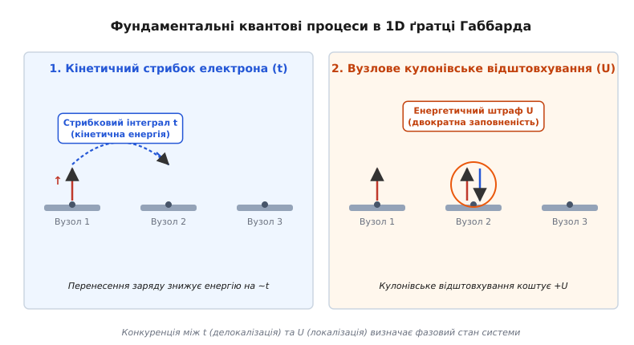
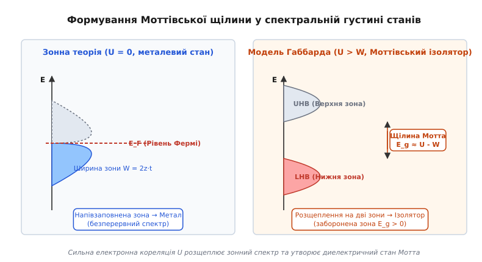
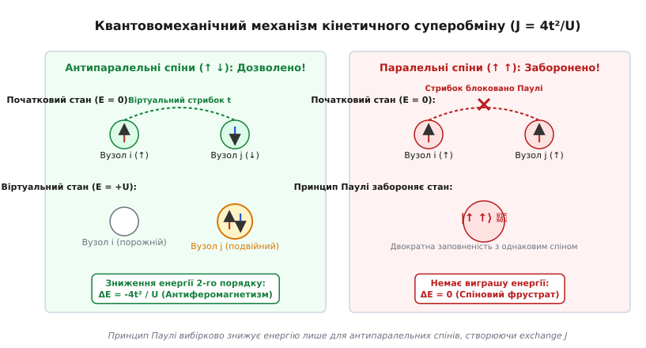
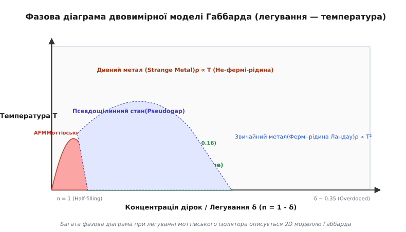

# Модель Габбарда

<preknowlist>
- [Зонна теорія твердого тіла](root:ph-condensed/band-theory) — формування дозволених та заборонених енергетичних зон у періодичному потенціалі кристала.
- [Вторинне квантування](root:ph-quantum/second-quantization) — опис багаточастинкових квантових систем мовою операторів народження та знищення.
- [Антиферомагнетизм](root:ph-condensed/antiferromagnetism) — спонтанне антипаралельне впорядкування спінових підґраток у кристалічній ґратці.
</preknowlist>

Якщо виміряти електричний опір монокристалів монооксиду нікелю (`NiO`), оксиду кобальту (`CoO`) або оксиду марганцю (`MnO`), вимірювальний прилад фіксує значення, притаманні якісним діелектрикам: питомий опір перевищує `10¹² Ом·см`, а спектроскопія оптичного поглинання показує наявність широкої забороненої зони порядку 2.5–4.5 еВ. Проте якщо розрахувати електронний спектр цих сполук у межах класичної одноелектронної зонної теорії Блоха — Вільсона, розрахунок покаже результат, що перебуває у принциповому протиріччі з експериментом: через непарну кількість d-електронів на елементарну комірку зонна теорія категорично стверджує, що ці кристали мають бути металевими провідниками з високою провідністю.

Цей квантовий парадокс виникає через те, що класична зонна теорія розглядає кожен електрон як незалежну хвилю Блоха, яка рухається у середовищі нерухомих іонів та середнього самоузгодженого поля інших електронів. У матеріалах із частково заповненими вузькими d- або f-орбіталями це одноелектронне наближення повністю руйнується: локальне кулонівське відштовхування між двома електронами, які опиняються у компактній об'ємній області того самого атомного вузла, виявляється порівнянним або значно більшим за кінетичну енергію їхнього руху по кристалу. Електрони втрачають можливість вільно тунелювати з атома на атом і стають локалізованими у просторі, а речовина перетворюється на моттівський діелектрик.

Фундаментальною математичною та фізичною моделлю, яка розв'язує задачу опису електронної локалізації та фазових переходів метал-ізолятор у сильнокорельованих системах, є **модель Габбарда** (*Hubbard model*). Запропонована у 1963 році британським теоретиком Джоном Габбардом, вона є мінімальною квантовомеханічною моделлю, що описує конкуренцію між делокалізацією носіїв (кінетичним стрибковим інтегралом `t`) та локальним міжмиттєвим кулонівським відштовхуванням `U`.

---

### 1. Недостатність одноелектронного наближення: парадокс моттіського ізолятора

У стандартному формалізмі теорії твердого тіла періодичний потенціал кристалічної ґратки розмиває точкові атомні рівні у безперервні енергетичні зони. Якщо на елементарну комірку кристала припадає непарна кількість електронів, найвища заповнена зона виявляється заповненою лише частково. В одноелектронній картині це означає наявність чітко сформованої поверхні Фермі та безперервного спектра збуджень із нульовою енергетичною щілиною, що гарантує металеву провідність аж до температури абсолютного нуля (`T = 0 K`).

Однак у широкому класі кристалів — монооксидах 3d-перехідних металів (`NiO`, `CoO`, `FeO`, `MnO`), ванадатах (`V₂O₃`, `LaVO₃`), титанатах (`YTiO₃`) та материнських фазах купратних надпровідників (`La₂CuO₄`) — 3d-оболонки катіонів металу заповнені лише частково (наприклад, конфігурація `Ni²⁺` має `3d⁸` із 8 електронами на 10 орбітальних станах, а `V³⁺` у `V₂O₃` має `3d²`). Оскільки елементарна комірка містить непарну кількість електронів, зонна теорія пророкує високу металеву провідність. Натомість експериментальні дослідження фіксують стан ізолятора з великою забороненою зоною.

Першим фізичне обґрунтування цього парадоксу запропонував Сер Невілл Мотт. Він підкреслив, що для переносу електричного заряду крізь кристал принаймні один електрон мусить перескочити зі свого атома на сусідній. Цей перескок змінює атомні конфігурації двох сусідніх вузлів, створюючи один двократно заповнений вузол (де опиняються два електрони) та один порожній вузол (дірку):

```
[ Катіон A: 3dⁿ ] + [ Катіон B: 3dⁿ ]  →  [ Катіон A: 3dⁿ⁻¹ ] + [ Катіон B: 3dⁿ⁺¹ ]
```

Якщо два електрони опиняються у вузькій 3d-оболонці того самого атома, їхнє кулонівське відштовхування вимагає величезних енергетичних витрат `U`. Якщо ця енергія `U` перевищує виграш у кінетичній енергії `W`, який електрон міг би отримати за рахунок квантового тунелювання між вузлами, рух носіїв заряду повністю блокується. Кожен електрон виявляється локалізованим на власному атомному вузлі. Речовина перетворюється на **моттівський ізолятор** (*Mott insulator*) — діелектрик, провідність якого пригнічена не структурою кристалічної ґратки чи хімічними зв'язками, а міжмиттєвою кулонівською кореляцією.

#### Класифікація Заанена — Саватоцького — Аллена (ZSA)
Для реальних оксидів перехідних металів фізична природа забороненої зони додатково залежить від 2p-орбіталей аніона кисню `O²⁻`. Згідно з класифікацією ZSA:
- **Строгі мотт-габбардівські ізолятори (`U < Δ_CT`):** Найнижчим за енергією є перенесення електрона між d-орбіталями катіонів металу. Заборонена щілина визначається кулонівським відштовхуванням `E_g ≈ U - W` (наприклад, у `V₂O₃` та `Ti₂O₃`).
- **Ізолятори з перенесенням заряду (Charge-Transfer insulators, `Δ_CT < U`):** Кулонівське відштовхування d-електронів є настільки гігантським (`U ~ 7–9 еВ`), що найменших енергетичних витрат вимагає перенесення електрона з заповненої 2p-оболонки кисню на d-оболонку металу. Заборонена щілина визначається енергією перенесення заряду `E_g ≈ Δ_CT - W/2` (наприклад, у `NiO`, `CoO` та `La₂CuO₄`).

Докладно про те, як гіпотеза Мотта подолала скепсис творців зонної теорії, про внесок Мартіна Ґуцвіллера та Джунджиро Канаморі, а також про сучасні експерименти у світлових ґратках читайте у вставці [📜 Історія моделі Габбарда: від парадоксу Мотта до квантових симуляторів](root:ph-condensed/hubbard-model/hist-hubbard-model.md).

---

### 2. Математична анатомія Гамільтоніана Габбарда: конкуренція t та U

Щоб звести багаточастинкову проблему квантової взаємодії величезної кількості електронів до прозорої математичної задачі, Джон Габбард сформулював модель у мові вторинного квантування на дискретній ґратці атомних вузлів.

У канонічному однозонному формулюванні модель Габбарда розглядає одну просторову орбіталь на кожен вузол ґратки. Оскільки на одній орбіталі згідно з принципом Паулі можуть перебувати не більше двох електронів із протилежними напрямками спінів (`↑` та `↓`), стан кожного вузла `i` описується ферміївськими операторами народження `c_iσ⁺` та знищення `c_iσ` електрона зі спіном `σ ∈ {↑, ↓}`.

**Гамільтоніан Габбарда** складається з трьох фундаментальних доданків:

```
H = -t ∑_⟨i,j⟩,σ (c_iσ⁺ c_jσ + c_jσ⁺ c_iσ) + U ∑_i n_i↑ n_i↓ - μ ∑_i (n_i↑ + n_i↓)
```

де `n_iσ = c_iσ⁺ c_iσ` — оператор кількості електронів зі спіном `σ` на вузлі `i`.


*Схематичне зображення процесів стрибка електронів t та кулонівського відштовхування U у моделі Габбарда*

Кожен доданок у Гамільтоніані відповідає за чітко визначений фізичний процес:

1. **Стрибковий інтеграл `t` (Hopping integral):**
   Перша сума описує квантове тунелювання (стрибок) електрона зі збереженням напрямку спіна між найближчими сусідніми вузлами ґратки `⟨i, j⟩`. Величина `t > 0` має розмірність енергії й виражається через просторовий інтеграл перекриття функцій Ванньє сусідніх атомів. Стрибковий інтеграл відповідає за **кінетичну енергію** електронів і прагне делокалізувати носії по всьому кристалу, формуючи енергетичну зону шириною `W = 2 z t` (де `z` — координаційне число ґратки, наприклад `z = 4` для 2D квадратної ґратки та `z = 6` для 3D кубічної).

2. **Одновузлове кулонівське відштовхування `U` (On-site Coulomb repulsion):**
   Друга сума описує потенціальну енергію міжмиттєвого кулонівського відштовхування двох електронів. Член `n_i↑ n_i↓` набуває значення `1` лише тоді, коли вузол `i` є **двократно заповненим** (містить одночасно електрон зі спіном `↑` і електрон зі спіном `↓`). Усі інші стани (порожній вузол `|0⟩` або вузол з одним електроном `|↑⟩`, `|↓⟩`) мають `n_i↑ n_i↓ = 0`. Отже, `U > 0` є енергетичним «штрафом», який система сплачує за розміщення двох електронів на тому самому атомі.

3. **Хімічний потенціал `μ` (Chemical potential):**
   Третій доданок регулює загальну кількість електронів у системі та задає середня кількість електронів на вузол `n = ⟨n_i↑ + n_i↓⟩`.

#### Обґрунтуваннях спрощень базової моделі
У реальних кристалах кулонівська взаємодія є дальнодіючою (`1/r`). Проте у металах та напівпровідниках з високою густиною станів інші електрони кристала ефективно екранують кулонівське поле. В результаті міжвузлові кулонівські інтеграли `V_ij n_i n_j` (відштовхування між сусідніми вузлами) зменшуються в десятки разів порівняно з одновузловим штрафом `U`. Тому модель Габбарда залишає лише локальний доданок `U`, що робить її найпростішою нетривіальною моделлю сильнокорельованого стану.

Строгий алгебраїчний розклад вихідного кулонівського потенціалу у базисі функцій Ванньє та виведення матричних елементів наведено у вставці [🧮 Математичне виведення Гамільтоніана Габбарда та канонічний розклад t/U](root:ph-condensed/hubbard-model/math-mott-transition.md).

---

### 3. Граничні фізичні режими: від вільних електронів до атомної локалізації

Фізична поведінка моделі Габбарда визначається безрозмірним співвідношенням між двома фундаментальними масштабами: кулонівським відштовхуванням `U` та шириною зони `W = 2 z t` (або відношенням `U/t`).

#### Границя невзаємодіючих електронів (U/t → 0)
Коли кулонівським відштовхуванням можна знехтувати (`U ≪ t`), Гамільтоніан спрощується до звичайної одночастинкової моделі сильного зв'язку (*tight-binding model*). Шляхом переходу до k-простору за допомогою фур'є-перетворення операторів:

```
c_kσ = (1 / √N) ∑_i exp(-i k · R_i) c_iσ
```

Гамільтоніан точно діагоналізується у безперервний спектр:

```
H = ∑_{k,σ} ε(k) c_kσ⁺ c_kσ
```

де для простої квадратної 2D ґратки закон дисперсії квазічастинок має вигляд:

```
ε(k) = -2t ( cos(k_x a) + cos(k_y a) )
```

У цьому режимі електрони поводяться як звичайний невзаємодіючий газ Фермі. Вони утворюють єдину безперервну зону шириною `W = 8t`. При половинному заповненні (`n = 1`) зона заповнена рівно наполовину, поверхня Фермі має чітку форму квадрата (ідеальний нестінг), а система демонструє металеві властивості нормальної Фермі-рідини Ландау.

#### Атомна границя (U/t → ∞)
У протилежній границі, коли тунелювання електронів повністю пригнічене (`t = 0`), кінетична енергія дорівнює нулю. Гамільтоніан містить лише одновузлові доданки `H_0 = U ∑_i n_i↑ n_i↓`.

У цьому випадку кожен вузол існує абсолютно незалежно від сусідів і має чотири власні квантові стани:
- Порожній стан `|0⟩` з енергією `E = 0`;
- Два однократно заповнені стани `|↑⟩` та `|↓⟩` з енергією `E = -μ`;
- Двократно заповнений стан `|↑↓⟩` (дублон) з енергією `E = U - 2μ`.

При половинному заповненні (`n = 1`) хімічний потенціал із міркувань електрон-діркової симетрії становить `μ = U/2`. У результаті однократно заповнені стани `|↑⟩` та `|↓⟩` мають мінімальну енергію `E = -U/2`, а порожній та двократно заповнений стани мають енергію `E = 0`.

Усі електрони застрягають на власних вузлах. Щоб перенести один електрон і створити струм, потрібно перетворити два однократно заповнені вузли на один порожній і один двократно заповнений:

```
ΔE = E(|0⟩) + E(|↑↓⟩) - 2·E(|↑⟩) = 0 + 0 - 2·(-U/2) = U
```

Електронний спектр розщеплюється на два гострі δ-піки, розділені енергетичною щілиною **`Δ = U`**. Макроскопічний рух заряду стає повністю замороженим, і система стає ідеальним ізолятором.

---

### 4. Моттівський ізолятор та квантовий фазовий перехід Мотта — Габбарда

При скінченному значеннях `U` та `t`, коли `U > W`, кінетичний рух електронів розмиває дискретні атомні рівні у безперервні енергетичні зони. Проте потужний кулонівський штраф `U` зберігає розщеплення електронного спектра.

Замість єдиної зонної теорії у спектральній густині станів утворюються дві окремі підзони:
1. **Нижня зона Габбарда (Lower Hubbard Band, LHB):** відповідає станам, пов'язаним із додаванням електрона на порожній вузол. При половинному заповненні (`n = 1`) ця зона є повністю заповненою.
2. **Верхня зона Габбарда (Upper Hubbard Band, UHB):** відповідає станам, пов'язаним із додаванням другого електрона на вже заповнений вузол (утворенням дублона). При `n = 1` ця зона є абсолютно порожньою.


*Формування нижньої та верхньої зон Габбарда та моттівської щілини у спектральній густині станів*

Між верхнім краєм нижньої зони Габбарда та нижнім краєм верхньої зони Габбарда виникає енергетична **щілина Мотта — Габбарда** (*Mott-Hubbard gap*):

```
E_g ≈ U - W = U - 2 z t
```

Якщо кулонівське відштовхування перевищує критичний поріг `U > U_c ≈ W`, щілина `E_g` стає строго більшою за нуль. Система скачкоподібно втрачає металеві властивості й зазнає **квантового фазового переходу Мотта — Габбарда** (*Mott-Hubbard metal-insulator transition*).

#### Теорія Брінкмана — Райса та ефективна маса квазічастинок
У 1970 році Вільям Брінкман (*William F. Brinkman*) та Т. М. Райс (*T. Maurice Rice*), застосувавши варіаційний метод Ґуцвіллера, показали, що при наближенні до критичної точки мотт-переходу `U → U_c` з металевого боку відбувається екстремальне важчання носіїв заряду.

Коефіцієнт ефективної маси квазічастинок `m*` виражається формулою:

```
m* / m_0 = 1 / [ 1 - (U / U_c)² ]
```

При `U → U_c` ефективна маса `m*` прямує до нескінченності, а спектральна вага квазічастинкового піку Фермі-рідини зникає. Електрони стискаються у локалізовані стани, а коефіцієнт стискання та спектральна густина на рівні Фермі зануляються.

#### Залежність від легування (Doping a Mott insulator)
Якщо відхилитися від половинного заповнення (`n = 1 - δ`, де `δ` — концентрація введених дірок), фізична картина принципово змінюється. Введення дірок створює порожні вузли, на які сусідні електрони можуть вільно перескокувати без сплати кулонівського штрафу `U`.

При легуванні `δ > 0` мотт-габбардівська щілина колапсує, а всередині забороненої зони виникає нова спектральна вага — **когерентний пік Фермі-рідини**. Система знову стає провідником, але носії у ній поводяться як «важкі» електрони із суттєво зменшеною рухливістю та аномальними термодинамічними властивостями.

---

### 5. Кінетичний суперобмін та виникнення антиферомагнетизму

Хоча при половинному заповненні (`n = 1`) у мотт-ізоляторному стані (`U ≫ t`) перенесення заряду на великі відстані заборонено, електрони зберігають спіновий ступінь вільності. Виникає фундаментальне питання: як орієнтуються спіни сусідніх електронів у мотт-ізоляторі?

Відповідь дає квантова теорія збурень другого порядку. Розглянемо два сусідні вузли `i` та `j`, на кожному з яких знаходиться по одному електрону.


*Механізм кінетичного суперобміну у моттівському ізоляторі при великих U*

Розглянемо дві можливі спінові конфігурації:

1. **Паралельні спіни (`↑ ↑` або `↓ ↓`):**
   Якщо спіни двох електронів спрямовані паралельно, електрон із вузла `i` не може навіть тимчасово перескочити на вузол `j`, оскільки там уже перебуває електрон із таким самим спіном. Згідно з **принципом заборони Паулі**, стан `|↑, ↑⟩` на одному вузлі строго заборонений. Стрибок повністю блокується, і зміна енергії дорівнює нулю (`ΔE = 0`).

2. **Антипаралельні спіни (`↑ ↓` або `↓ ↑`):**
   Якщо спіни спрямовані антипаралельно, принцип Паулі дозволяє електрону зі спіном `↑` віртуально перескочити на вузол `j`, утворивши на короткий час `Δτ ~ ℏ/U` двократно заповнений стан (дублон) `|(↑↓)_j⟩` з енергією `+U`. Після цього електрон повертається назад.

Згідно з другим порядком квантової теорії збурень, такий віртуальний квантовий процес знижує енергію синглетного стану антипаралельних спінів на величину:

```
ΔE = - 2 · (t² / U) - 2 · (t² / U) = - 4 t² / U
```

Множник 2 виникає через те, що стрибок може ініціювати як перший, так і другий електрон.

Отже, система знижує свою повну енергію лише тоді, коли спіни сусідніх атомів орієнтовані **антипаралельно**. Цей процес зветься **кінетичним суперобміном** (*kinetic superexchange*).

Канонічне перетворення Шріффера — Вульфа доводить, що при `U ≫ t` та `n = 1` модель Габбарда математично еквівалентна ефективній **антиферомагнітній моделі Гейзенберга**:

```
H_eff = J ∑_⟨i,j⟩ S_i · S_j
```

де константа обмінного інтеграла становить:

```
J = 4 t² / U
```

Оскільки `J > 0`, обмінна взаємодія є строго антиферомагнітною. Саме тому материнські мотт-ізоляторні стани кристалів завжди виявляють антиферомагнітне впорядкування спінових підґраток нижче температури Нееля. Зв'язок із суперобміном детально розглянуто в статті [Антиферомагнетизм](root:ph-condensed/antiferromagnetism).

---

### 6. Сильнокорельовані системи та роль моделі Габбарда у високотемпературній надпровідності

Найбільший сплеск інтересу до моделі Габбарда стався після відкриття у 1986 році високотемпературної надпровідності (ВТНП) у купратах. Базова кристалічна структура всіх купратних надпровідників (`La₂-xSr_xCuO₄`, `YBa₂Cu₃O₇-δ`, `Bi₂Sr₂CaCu₂O₈`) складається з двовимірних шарів `CuO₂`.

У нелегованому стані (`x = 0`) атоми міді `Cu²⁺` мають один електрон на 3d-орбіталі, що відповідає половинному заповненню (`n = 1`). Кулонівське відштовхування між 3d-електронами міді сягає `U ≈ 3.2 еВ`, що значно перевищує стрибковий інтеграл `t ≈ 0.4 еВ` (`U/t ≈ 8`). Як наслідок, материнські купрати є мотт-ізоляторами з високою температурою Нееля (`T_N ≈ 300 K`) та обмінним інтегралом `J = 4t²/U ≈ 0.13 еВ` (близько 1500 K).


*Фазова діаграма двовимірної моделі Габбарда у координатах легування — температура*

При внесенні дірок (легуванні `δ > 0` шляхом заміни `La³⁺` на `Sr²⁺` або додаванні кисню) 2D модель Габбарда демонструє унікальне розмаїття фазових станів:

1. **Антиферомагнітний мотт-ізолятор (`0 < δ < 0.03`):** Рух носіїв заблокований, спіни вишикувані антипаралельно.
2. **Псевдощілинна фаза (Pseudogap, `0.05 < δ < 0.15`):** При частковому руйнуванні антиферомагнітного порядку на поверхні Фермі виникає анізотропна часткова щілина, а електронна система поводиться як не-фермі-рідина.
3. **d-хвильовий надпровідний купол (Superconducting dome, `0.05 < δ < 0.27`):** При оптимальному легуванні `δ ≈ 0.16` кулонівське відштовхування та спінові флуктуації створюють ефективне притягання між дірками, зв'язуючи їх у куперівські пари з d-симетрією хвильової функції (`Δ(k) = Δ_0 (cos k_x - cos k_y)`). Температура переходу сягає критичних рекордів `T_c > 90–135 K`.
4. **Дивний метал (Strange metal, `T > T_c`):** Електричний опір демонструє аномальну лінійну залежність від температури `ρ ∝ T`, що порушує класичний закон Фермі-рідини Ландау (`ρ ∝ T²`).

#### t-J модель та гіпотеза RVB Андерсона
Для опису слабколегованого мотт-ізолятора Філіп Андерсон пропонував проеціювати Гамільтоніан Габбарда на підпростір без подвійної заповненості. Отриманий **t-J Гамільтоніан**:

```
H_tJ = -t ∑_⟨i,j⟩,σ P_1 (c_iσ⁺ c_jσ + h.c.) P_1 + J ∑_⟨i,j⟩ (S_i · S_j - n_i n_j / 4)
```

демонструє розділення спіна та заряду (*spin-charge separation*): елементарні збудження розпадаються на беззарядні квазічастинки зі спіном 1/2 (**спінони**, *spinons*) та безспінові заряди з зарядом `+e` (**холони**, *holons*). Андерсон припустив, що основним станом легованого мотт-ізолятора є стан **резонуючих валентних зв'язків** (Resonating Valence Bond, RVB) — синглетний рідинний стан спінів, який при формуванні холонів трансформується у d-хвильовий надпровідник.

---

### 7. Методи чисельного розв'язку та квантові симулятори

Оскільки модель Габбарда не має точного аналітичного розв'язку у вимірностях `D ≥ 2` (за винятком одновимірного ланцюжка, розв'язаного Елліотом Лібом та Фа-Яном Ву у 1968 році через анзац Бете), для її аналізу застосовують потужні чисельні методи:

1. **Теорія динамічного середнього поля (Dynamical Mean-Field Theory, DMFT):**
   Запропонована Антуаном Жоржем (*Antoine Georges*) та Габріелем Котляром (*Gabriel Kotliar*), DMFT зводить решіткову модель Габбарда до ефективного одноатомного квантового примісного елемента у середовищі. DMFT є точним методологічним наближенням при нескінченній вимірності `D → ∞` і дає змогу розраховувати спектральні функції та фазові переходи Мотта.

2. **Точна діагоналізація (Exact Diagonalization, ED):**
   Будує матрицю Гамільтона у двійковому базисі для малорозмірних кластерів (від 2 до 16 вузлів) і точно знаходить енергію основного стану. Алгоритмічні деталі реалізації ED розібрано у вставці [⚙️ Чисельне моделювання кластера Габбарда методом точної діагоналізації](root:ph-condensed/hubbard-model/proj-exact-diagonalization.md).

3. **Квантовий метод Монте-Карло (QMC) та група ренормалізації матриць щільності (DMRG):**
   Дозволяють моделювати масштабні 1D та 2D решітки, хоча у 2D QMC стикається з фундаментальним обмеженням — **ферміївською проблемою знака**.

Числові значення параметрів `t`, `U`, `W`, `J` та критичні межі для реальних оксидів, купратів та органічних провідників зведено у вставці [📋 Довідник параметрів t, U та матеріалознавчих характеристик корельованих систем](root:ph-condensed/hubbard-model/api-hubbard-parameters.md).

#### Квантові симулятори на основі ультрахолодних атомів
Остаточним експериментальним підтвердженням передбачень моделі Габбарда стало створення квантових симуляторів. Охолоджуючи ферміонні атоми калію `⁴⁰K` або літію `⁶Li` до нанокельвінових температур у безповітряній вакуумній камері, фізики захоплюють їх у лазерну оптичну ґратку. У такій штучній «кристалічній ґратці зі світла» атоми відіграють роль електронів, тунелювання між світловими ямами задає параметр `t`, а s-хвильове зіткнення атомів регулює кулонівський штраф `U`. За допомогою квантових газових мікроскопів учені отримують прямі фотографії мотт-ізоляторних доменів та спінових флуктуацій на рівні окремих атомів.

> 🔧 **Навіщо це.**
> Розуміння моделі Габбарда є ключем до проектування матеріалів нової квантової електроніки (**моттроніки**, *mottronics*). Пристрої на основі мотт-переходу дозволяють створювати надшвидкі концептуальні транзистори, де перемикання зі стану ізолятора у стан провідника відбувається за фемтосекунди під дією короткого світлового імпульсу або малого електричного поля. Крім того, модель Габбарда дає фундаментальний інструментарій для розробки високотемпературних надпровідників, квантових спінових рідин та обчислювальних квантових симуляторів складних матеріалів майбутнього.
