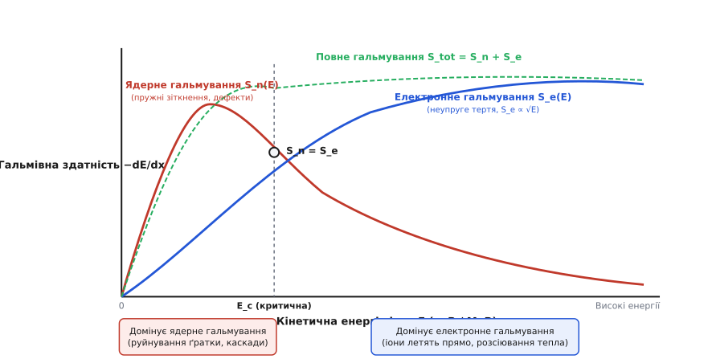
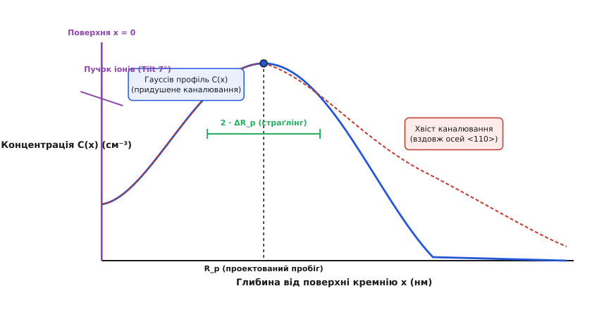
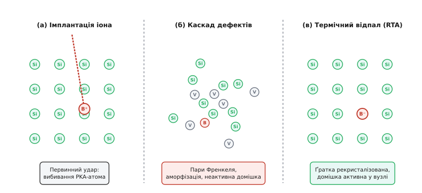
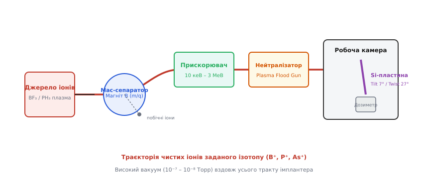

# Іонна імплантація

<preknowlist>
- [Легування: n- і p-тип](root:ph-condensed/doping) — донори, акцептори, основні та неосновні носії заряду в напівпровіднику.
- [Кристалічна ґратка та дефекти](root:ph-condensed/crystal-defects) — дефекти за Френкелем, вакансії та міжвузля в твердому тілі.
- [Електричне та магнітне поле в вакуумі](root:ph-electromagnetism/lorentz-force) — сила Лоренца, мас-спектрометрія та прискорення заряджених частинок.
</preknowlist>

Спроба сформувати транзисторні структури із товщиною залягання переходів менше кількох десятків нанометрів за допомогою класичного нагріву кремнію у парах домішок впирається у фундаментальні фізичні обмеження матеріалознавства. При температурах `900–1100 °C` атоми домішки дифундують у всі боки однаково, виповзаючи під край маскувального покриття, розмиваючи чіткі геометричні межі каналів та створюючи колосальні паразитичні ємності. Щоб подолати цей ізотропний бар'єр, фізика напівпровідників перейшла від повільного теплового масопереносу до силового балістичного бомбардування — **іонної імплантації** (*ion implantation*).

Цей метод полягає у тому, що атоми потрібної домішки (бор, фосфор, миш'як) іонізують у вакуумній камері, прискорюють електричним полем до кінетичних енергій від сотен електронвольт до кількох мегаелектронвольт і спрямовано встрілюють у кремнієву пластину. Іонна імплантація перетворила легування з примхливого хіміко-термічного процесу на строгу балістичну дисципліну, де глибина проникнення домішки задається прискорювальною напругою, а її підсумкова кількість — інтегралом електричного струму пучка.

---

### Межі термічної дифузії та балістичний підхід допування

Класичний дифузійний спосіб введення домішки спирається на масоперенос Фіка, підпорядкований градієнту концентрації при високих температурах. Хоча цей метод є дешевим і простим для виготовлення дискретних приладів минулого століття, він має три фундаментальні фізичні обмеження, які роблять його абсолютно непридатним для сучасної мікроелектроніки:

1. **Ізотропність та бокове підшивання під маску**: теплова дифузія поширюється у масиві кремнію хаотично в усіх напрямках. Дифузійний зсув атома вбік під край захисного оксиду кремнію або полікремнієвого затвора становить приблизно `75–80%` від глибини його проникнення углиб. Для транзистора з довжиною каналу `20 нм` бокова дифузія витоку й стоку на `15 нм` призводить до їхнього прямого замкнення під затвором, знищуючи прилад.
2. **Обмеження граничною розчинністю**: максимальна концентрація домішки при дифузії досягається строго на поверхні й обмежується термодинамічною граничною розчинністю даного елемента у кремнії (`C_sol`). Дифузія принципово не здатна створити «прихований» шар, у якому максимум концентрації домішки розташований на глибині `100 нм`, а біля самої поверхні концентрація залишається мінімальною.
3. **Високий температурний бюджет**: тривале витримування пластини при `1000 °C` призводить до того, що раніше сформовані вузькі p-n переходи на інших ділянках кристала продовжують розмиватися, руйнуючи цілісність усієї інтегральної схеми.

Іонна імплантація повністю знімає ці обмеження. Оскільки іони рухаються у вакуумі з величезною швидкістю вздовж напрямку прискорювального поля, їхнє впровадження є строго анізотропним. Вони пробивають кристал строго вертикально, не підтікаючи під маску. Крім того, бомбардування відбуваються за кімнатної температури, а підсумковий профіль залягання домішки може мати максимум на будь-якій заданій глибині всередині напівпровідника.

---

### Фізика гальмування іона у кристалічній ґратці

Коли швидкий іон із масою `M₁`, зарядом `Z₁·e` та початковою кінетичною енергією `E₀` влітає у монокристал кремнію (маса атомів `M₂ = 28.08 а.о.м.`, заряд ядра `Z₂ = 14`), він починає втрачати енергію на зіткнення з атомами та електронами мишені. Загальна гальмівна здатність середовища `S(E)` визначається як середня втрата енергії на одиницю довжини шляху `x`:

```
S(E) = -dE/dx
```

Увесь процес гальмування розділяється на два фізично різних механізми: **ядерне гальмування** `S_n(E)` та **електронне гальмування** `S_e(E)`.

```
S(E) = S_n(E) + S_e(E)
```


*Криві ядерного S_n(E) та електронного S_e(E) гальмування іона у кремнії. При енергіях E > E_c переважає електронне тертя без руйнування ґратки; при низьких енергіях E < E_c домінує ядерне розсіювання, що генерує каскади дефектів.*

#### 1. Ядерне гальмування S_n(E) (Nuclear Stopping)
Ядерне гальмування є результатом пружних кулонівських зіткнень ядра іона з ядрами атомів кремнію, екранованими їхніми електронними хмарами. Оскільки маси іона та атома мишені є величинами одного порядку, при лобових або близьких зіткненнях іон передає атому ґратки значну частку своєї кінетичної енергії `T`.

Ядерне зіткнення супроводжується передачею великого імпульсу, внаслідок чого іон сильно змінює напрямок свого руху (зазнає розсіювання на великі кути). Якщо передана атому кремнію енергія `T` перевищує порогову енергію зміщення `E_d ≈ 15 еВ`, атом Si вибивається зі свого вузла кристалічної ґратки. Цей вибитий атом перетворюється на первинний вторинний снаряд (PKA — *Primary Knock-on Atom*), який рушає далі й вибиває інші атоми, породжуючи каскад радіаційних дефектів.

Зі зростанням енергії іона диференціальний переріз ядерного зіткнення спадає, оскільки швидка частинка не встигає ефективно взаємодіяти з ядрами. При малих енергіях ядерне гальмування зростає як `S_n(E) ∝ √E`, досягає максимуму при безрозмірній енергії `ε ≈ 0.35`, а при високих енергіях спадає за Резерфордівським законом `S_n(E) ∝ 1/E`.

#### 2. Електронне гальмування S_e(E) (Electronic Stopping)
Електронне гальмування виникає внаслідок неупругих зіткнень іона з електронною хмарою кристала — вільними електронами та електронами внутрішніх оболонок атомів кремнію. Оскільки маса електрона у тисячі разів менша за масу іона, у кожному окремому акті електронного розсіювання іон втрачає мізерну частку енергії і практично **не змінює напрямку свого руху**.

Електронне гальмування поводиться як класичне в'язке тертя частинки у середовищі. При швидкостях іона, які є меншими за швидкість електронного газу Фермі, електронна гальмівна здатність строго пропорційна швидкості частинки, а отже — квадратному кореню з її кінетичної енергії:

```
S_e(E) = k_e · √E
```

Електронне гальмування не викликає вибивання атомів зі своїх вузлів і не руйнує кристалічну ґратку безпосередньо: вся втрачена енергія перетворюється на тепло та збудження електронної підсистеми кристала.

#### Критична енергія перетину E_c (Crossover)
Точка перетину кривих `S_n(E_c) = S_e(E_c)` визначає критичну енергію `E_c`. При енергіях `E > E_c` переважає електронне гальмування: іон летить практично по прямій лінії, майже не створюючи дефектів. Наприкінці свого шляху, коли кінетична енергія спадає нижче `E_c`, домінантним стає ядерне гальмування — іон починає хаотично виляти, створюючи щільне скупчення радіаційних дефектів перед остаточною зупинкою.

Для легких елементів (Бор) критична енергія у кремнії є низькою (`E_c ≈ 17 кеВ`), тому Бор втрачає енергію переважно на електронне тертя. Для важких елементів (Миш'як, Сурма) критична енергія становить сотні й тисячі кілоелектронвольт (`E_c ≈ 800 кеВ` для As), тож їхнє гальмування супроводжується суцільним ядерним руйнуванням ґратки. Детальний математичний вивід потенціалів Зіглера, функцій екранування Томаса–Фермі та формул LSS наведено у вставці [Математична фізика гальмування LSS](root:ph-condensed/ion-implantation/math-lss-stopping.md).

---

### Профіль розподілу домішки та явище каналювання

Через випадковий характер прицільних параметрів при ядерних зіткненнях кожен іон зупиняється на своїй власній глибині. Загальний просторовий профіль концентрації імплантованих іонів `C(x)` описується статистичними розподілами.


*Глибинний профіль концентрації домішки C(x). При придушеному каналюванні профіль близький до гауссового з максимумом на проектованому пробігу R_p та напівшириною ΔR_p. При вирівнюванні пучка вздовж кристалографічної осі виникає «хвіст» каналювання з глибоким проникненням іонів.*

#### Проектований пробіг R_p та страґлінг ΔR_p
Середня глибина проникнення іонів від поверхні пластини вглиб по нормалі називається **проектованим пробігом** `R_p` (*projected range*). Статистичне квадратичне відхилення глибини зупинки від середнього значення `R_p` називається **поздовжнім страґлінгом** `ΔR_p` (*projected straggle*). Бокове розширювання пучка вбік описується **латеральним страґлінгом** `ΔR_⊥`.

У найпростішому наближенні аморфного середовища профіль `C(x)` описується симетричною функцією Гаусса:

```
C(x) = (Ф / (√(2 · π) · ΔR_p)) · exp(- (x - R_p)² / (2 · ΔR_p²))
```

де `Ф` — сумарна доза імплантації (флюенс, число іонів на `см²`). Максимум концентрації `C_max` спостерігається строго на глибині `x = R_p`.

#### Ефект каналювання (Channeling Effect) та критичний кут Ліндгарда
У реальному монокристалі атоми кремнію розташовані не хаотично, а утворюють впорядковану періодичну ґратку типу алмазу. Якщо напрямок падіння іонного пучка збігається з низькоіндексними кристалографічними осями (наприклад, напрямками `<110>`, `<100>` або `<111>`), іони опиняються у відкритих міжатомних каналікулах («коридорах»).

Усередині такого каналу іон зазнає лише серії послідовних ковзних зіткнень зі стінками коридору під малими кутами. Лобові ядерні зіткнення повністю відсутні, і іон гальмується виключно слабким електронним тертям. В результаті іони каналюють на величезну глибину, утворюючи на профілі `C(x)` довгий некерований «хвіст» каналювання, який розмиває p-n перехід.

Критичний кут захоплення в режим каналювання описується формулою Ліндгарда `ψ₁`:

```
ψ₁ = √((2 · Z₁ · Z₂ · e²) / (E · d))
```

де `d` — міжвимірний атомний крок вздовж осі каналу. Якщо кут падіння іона відносно осі кристала менший за `ψ₁`, іон захоплюється в канал; якщо більший — він відбивається стінкою каналу й зазнає звичайного ядерного розсіювання (деканалювання, *dechanneling*).

#### Методи боротьби з каналюванням
Щоб зрізати ефект каналювання й повернути профіль до розрахункового Гауссового вигляду, застосовують три інженерні прийоми:

1. **Растровий нахил пластини (Tilt & Twist)**: пластину деорієнтують відносно перпендикулярного пучка, нахиляючи її на кут Tilt `7°` та повертаючи навколо осі на кут Twist `27°`. Пучок бачить не відкритий канал, а щільну упаковку атомів, що імітує аморфне середовище.
2. **Попереднє аморфізування (Pre-Amorphization Implant, PAI)**: перед введенням основної домішки поверхневий шар кремнію бомбардують важкими неактивними іонами Германію (`⁷⁴Ge⁺`) або Кремнію (`²⁸Si⁺`). Вони вщент руйнують кристалічну ґратку на глибині майбутнього залегання, перетворюючи монокристал на аморфний шар. Потім у цей аморфний шар встрілюють основну домішку (Бор), для якої каналювання стає фізично неможливим.
3. **Імплантація через оксидний екран (Screen Oxide)**: на поверхні кремнію вирощують тонкий аморфний шар `SiO₂` товщиною `10–20 нм`. Проходячи крізь аморфний оксид, іони зазнають первинного випадкового розсіювання і входять у монокристал під хаотичними кутами, що виключає їхнє потрапляння в канали.

---

### Радіаційне руйнування ґратки та аморфізація

Втрата кінетичної енергії іона через ядерне гальмування супроводжується зміщенням атомів кремнію зі своїх рівноважних вузлів. Кожен вибитий атом залишає порожнє місце у ґратці — **вакансію** (V), і зупиняється у міжвузлі, утворюючи **міжвузловий атом** (I). Ця фундаментальна дефектна пара у фізиці твердого тіла називається **парою Френкеля**.


*Еволюція кристалічної ґратки при іонній імплантації та відпалі: (а) ідеальний кристал кремнію; (б) каскад ядерних зіткнень створює пари Френкеля та область аморфізації; (в) термічний відпал рекристалізує ґратку та активує домішкові атоми у замісникових вузлах.*

При низьких дозах імплантації (`Ф < 10¹² см⁻²`) каскади дефектів від окремих іонів розташовані далеко один від одного і виглядають як ізольовані точкові плями деформацій. Проте із зростанням дози імплантації треки іонів починають перекриватися.

Коли концентрація утворених дефектів досягає приблизно `10%` від атомної щільності кремнію, впорядкована кристалічна ґратка термодинамічно втрачає стабільність і колапсує. Виникає суцільний **аморфний шар кремнію** (*amorphous silicon layer*).

Критична доза аморфізації `Ф_crit` залежить від маси іона та температури пластини:
- Для важкого Миш'яку (`⁷⁵As⁺`) або Германію (`⁷⁴Ge⁺`) критична доза є низькою: `Ф_crit ≈ 10¹⁴ см⁻²`.
- Для легкого Бору (`¹¹B⁺`) ядерне гальмування слабке, і аморфізація за кімнатної температури взагалі не досягається (потрібні дози понад `10¹6 см⁻²` або охолодження пластини до кріогенних температур).

Парадоксально, але утворення суцільного аморфного шару буває технологічно вигідним. При наступному термічному відпалі аморфний шар рекристалізується за механізмом **твердофазної епітаксії** (SPER — *Solid-Phase Epitaxial Regrowth*), відновлюючи монокристал від неушкодженої підкладки вгору й одночасно вбудовуючи майже 100% атомів домішки у замісникові вузли. Швидкість рекристалізації SPER суттєво залежить від кристалографічного напрямку: найшвидше рекристалізуються напрямки `<100>` (до `100 Å/с` при `600 °C`), тоді як напрямки `<111>` ростуть приблизно у 25 разів повільніше через складну атомарну упаковку.

---

### Термічний відпал та активація домішок

Одразу після завершення процесу імплантації легований шар є абсолютно непридатним для використання в електроніці. Більшість імплантованих атомів домішки знаходяться у хаотичних міжвузлях або всередині аморфної фази. Вони не утворюють ковалентних зв'язків із сусідніми атомами кремнію і не віддають свої валентні електрони (або дірки) у вільний стан — домішка є **електрично неактивною**. Питомий опір матеріалу залишається надзвичайно високим, а час життя носіїв заряду прямує до нуля через величезну концентрацію пасток.

Щоб перетворити внесений матеріал на функціональний напівпровідник, пластина піддається **термічному відпалу** (*annealing*). Відпал виконує дві головні фізичні задачі:

1. **Відновлення кристалічної ґратки**: рекристалізація аморфних зон та анігіляція точкових дефектів (рекомбінація вакансій та міжвузлових атомів).
2. **Електрична активація домішки**: дифузійний перехід атомів домішки з міжвузлів у замісникові вузли кристалічної ґратки, де вони утворюють повноцінні ковалентні зв'язки.

```
Домішка у міжвузлі (неактивна) + Вакансія  ──(Тепло T > 900 °C)──>  Домішка у вузлі (активна) + Носій заряду
```

#### Проблема транзієнтного підсилення дифузії (TED)
Головною фізичною складнощами при відпалі є явище **транзієнтного підсилення дифузії** (TED — *Transient Enhanced Diffusion*). Під час нагрівання надлишкові міжвузлові атоми кремнію, вибиті при імплантації, об'єднуються у дефектні скупчення (метастабільні утворення типу `{311}` та дислокаційні петлі).

При температурах `600–800 °C` ці скупчення починають інтенсивно розпадатися, викидаючи у ґратку колосальний надлишок вільних міжвузлових атомів кремнію. Ці міжвузля захоплюють атоми домішки (особливо Бору) й переносять їх на великі відстані зі швидкістю, яка у сотні й тисячі разів перевищує рівноважну швидкість дифузії. Ефективний коефіцієнт дифузії з урахуванням TED описується двокомпонентною моделлю:

```
D_eff = D_i* · (1 + f_I · (C_I / C_I*)) + D_v* · (1 + f_V · (C_V / C_V*))
```

де `C_I / C_I*` — відносне перенасичення міжвузловими атомами кремнію, яке на початковому етапі нагріву може досягати `10³ – 10⁴`. В результаті ультрамілководний профіль розмивається за лічені секунди.

#### Сучасні технології швидкісного відпалу
Для приглушення ефекту TED та збереження крутих профілів домішки класичний тривалий пічний відпал замінили новітніми швидкісними методами:

- **Швидкісний термічний відпал (Rapid Thermal Annealing, RTA)**: пластина розігрівається потужними галогенними лампами до температури `1000–1050 °C` зі швидкістю `100–250 °C/с` і витримується при цій температурі всього `1–5 секунд`.
- **Спалаховий відпал (Spike Annealing)**: витримка при максимальній температурі зведена до нуля («пік» на графіку): досягнувши `1050 °C`, пластина негайно охолоджується.
- **Лазерний / мілісекундний відпал (Flash / Laser Annealing)**: поверхню пластини сканують випромінюванням потужного лазера, який розігріває лише тонкий поверхневий шар до `1200–1300 °C` за час порядку `1–10 мілісекунд`. За такий короткий проміжок часу атоми домішки встигають перескочити у замісникові вузли ґратки, але макроскопічний дифузійний зміст профілю є абсолютно нульовим (`< 1 нм`).

---

### Історичний злам та патент Шокли

Ідея застосування прискорювачів частинок для допування напівпровідників належить Нобелівському лауреату Вільяму Шокли (*William Shockley*), який у 1954 році подав фундаментальний патент US 2,787,564. Проте протягом майже п'ятнадцяти років індустрія вважала іонне бомбардування руйнівним дефектом через відсутність технологій швидкісного відпалу. 

Перелом стався наприкінці 1960-х років при переході на самопоєднані полікремнієві затвори у MOS-транзисторах, де вимагалося строго вертикальне введення витоку й стоку без бокового підточування під затвор. Детальний аналіз історичної боротьби концепцій та еволюції обладнання наведено у вставці [Патент Вільяма Шокли та народження іонної імплантації](root:ph-condensed/ion-implantation/hist-shockley-patent.md).

---

### Комп'ютерне моделювання процесів імплантації

Оскільки експериментальне вимірювання профілів залегання домішок за допомогою методів SIMS є коштовним і руйнівним, основними інструментами розробки технологічних процесів у сучасних системах TCAD (*Technology Computer-Aided Design*) є обчислювальне моделювання методом Монте-Карло в наближенні парних зіткнень (BCA).

Цифрові симулятори TRIM та SRIM відстежують траєкторії сотень тисяч окремих іонів у тривимірному масиві ґратки, вираховуючи електронне тертя, кути розсіювання за потенціалами Зіглера (ZBL) та будуючи просторові картограми первинних вакансій та міжвузлових атомів. Практичну алгоритмічну реалізацію такого симулятора мовами C та C++ подано у вставці [Моделювання траєкторій іонів та каскадів дефектів методом Монте-Карло](root:ph-condensed/ion-implantation/proj-stopping-range-sim.md).

---

### Архітектура імплантера та промисловий контроль

Промисловий іонний імплантер являє собою складний автоматизований вакуумно-фізичний комплекс вартістю у мільйони доларів.


*Функціональна схема іонного імплантера: іонне джерело → сепаруючий мас-аналізатор → прискорювальна колона → система сканування та нейтралізації заряду → камера з кремнієвою пластиною.*

Тракт імплантера включає плазмове іонне джерело (типу Бернаса), витягувальні електроди, поворотно-сепаруючий магніт для відбору строго потрібного ізотопу за відношенням маси до заряду `m/q`, прискорювальні діафрагми, систему плазмової нейтралізації заряду (Plasma Flood Gun) для захисту підзатворного оксиду від електричного пробою та процесну вакуумну камеру з електростатичним охолоджуваним тримачем пластин. Повний технічний довідник режимів роботи, дозиметрії та контролю контамінації наведено у вставці [Промислові іонні імплантери: специфікація, режими та контроль](root:ph-condensed/ion-implantation/api-implanter-params.md).

---

### Застосування в CMOS-технологіях та мікроелектроніці

У сучасних процесах виготовлення мікросхем іонна імплантація використовується на 15–30 окремих технологічних операціях. Вона забезпечує формування ключових елементів транзисторної архітектури:

```
[ N-Well / P-Well ] ──> [ V_th Adjust ] ──> [ Halo / Pocket ] ──> [ LDD ] ──> [ Source / Drain ]
```

1. **Самопоєднані затвори (Self-Aligned Gates)**: використання полікремнієвого затвора як маски при імплантації витоку й стоку гарантує ідеальне суміщення меж без бокового перекриття, що знижує паразитну ємність `C_gd` до фізичного мінімуму.
2. **Слаболеговані стоки (Lightly Doped Drain, LDD)**: імплантація малої дози домішки біля самого краю каналу створює плавній шар із помірною концентрацією. Це знижує максимальну напруженість електричного поля біля стоку й пригнічує ефект деструктивної інжекції «гарячих електронів» у підзатворний оксид.
3. **Хало / покетні імплантації (Halo / Pocket Implants)**: нахилена під кутом `15°–45°` імплантація домішки **протилежного** типу легування під край затвора (наприклад, Бор під край n-каналу). Це створює локальне підвищення концентрації субстрату біля меж витоку й стоку, що стискає збіднені області й повністю відсікає ефект пробою короткого каналу (*punch-through*).
4. **Зворотноградаційні колодязі (Retrograde Wells)**: високоенергетична імплантація формує максимум концентрації колодязя глибоко під поверхнею (`0.5–1 мкм`), залишаючи поверхню каналу помірно легованою. Це забезпечує високу рухливість носіїв у каналі й одночасно кардинально знижує опір субстрату, гарантуючи повний захист мікросхем від защіпки (*latch-up*).
5. **Ультрамілководні p-n переходи (Ultra-Shallow Junctions, USJ)**: поєднання низькоенергетичної імплантації `BF₂⁺` або кластерного Бору (`0.2–0.5 кеВ`) з лазерним мілісекундним відпалом дозволяє формувати витоки й стоки товщиною менше `10 нм` для суб-7 нм техпроцесів.
6. **Технологія Smart Cut та поділ пластин для SOI**: імплантація високої дози іонів Водню (`¹H⁺`, `2 × 10¹6 см⁻²`) на задану глибину створення мікропорожнеч (водневих мікробульбашок). При послідуючому низькотемпературному нагріві кремнієва пластина термомеханічно відколюється строго по лінії імплантованого водневого шару, залишаючи ідеально гладкий тонкий шар монокремнію на ізоляторі (кремній на ізоляторі, SOI — *Silicon-on-Insulator*).

---

### Підсумок і порівняльний баланс технологій

Іонна імплантація повністю революціонізувала технологію напівпровідникового виробництва, перетворивши легування на прецизійний цифровий процес.

| Характеристика | Термічна дифузія | Іонна імплантація |
| :--- | :--- | :--- |
| **Температура процесу** | Висока (`900–1100 °C`) | Кімнатна (`20–25 °C`) |
| **Профіль домішки** | Завжди максимум на поверхні (erfc / Gauss) | Довільний (максимум на глибині R_p) |
| **Анізотропність** | Ізотропний (боковий зсув `75%`) | Строго спрямований (боковий зсув `< 10%`) |
| **Точність дозування** | Посередня (`± 5–10%`) | Абсолютна прецизійна (`< 0.5%`) |
| **Незалежність елементів**| Неможлива (термодинаміка) | Повна (магнітне мас-сепарування) |
| **Стан ґратки після введення**| Бездефектний кристал | Сильне руйнування (вимагає відпалу) |

Головними перевагами іонної імплантації є абсолютна точність контролю кількості атомів, можливість створення довільних тривимірних профілів, відсутність бокового розмивання під маску та низький температурний бюджет. Технологічні виклики — висока вартість обладнання, ризики заряджання поверхні та необхідність швидкісного відпалу для рекристалізації ґратки — повністю компенсуються можливістю створювати високопродуктивні мікропроцесори з мільярдами транзисторів на єдиному силіконовому кристалі.
