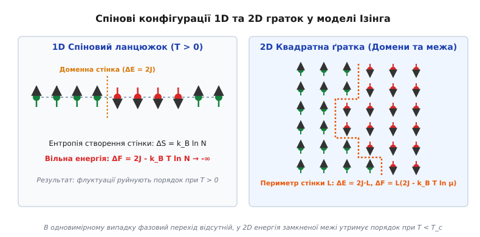
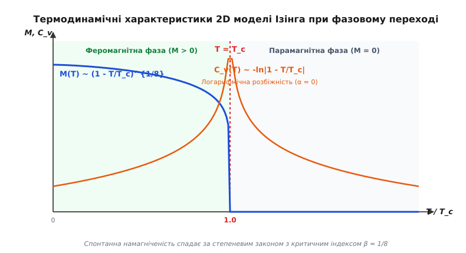
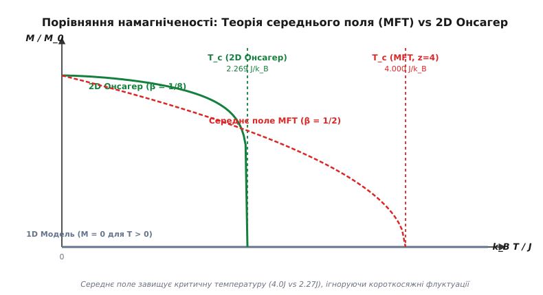

# Модель Ізінга

<preknowlist>
- [Феромагнетизм](topic:ph-condensed/ferromagnetism) — спонтанне паралельне впорядкування магнітних моментів електронів.
- [Точка Кюрі](topic:ph-condensed/curie-temperature) — фазовий перехід 2-го роду з упорядкованого магнітного стану у парамагнітний.
</preknowlist>

Якщо квадратну ґратку з одного мільйона електронних спінів уявити при температурі абсолютного нуля (`T = 0 K`), квантовомеханічна обмінна взаємодія вишикує кожен магнітний диполь строго в одному напрямку. Речовина утворює ідеальний феромагнетик із максимальною спонтанною намагніченістю. Проте зі зростанням температури хаотичні теплові поштовхи починають розвертати окремі спіни проти напрямку поля. При досягненні строго визначеного критичного порогу — **температури Кюрі** `T_c ≈ 2.269185 · J / k_B` — макроскопічна спонтанна намагніченість скачкоподібно втрачає гладкість і звертається в нуль. Кристал миттєво втрачає магнітні властивості, перетворюючись на неразомкнений парамагнетик.

Цей фундаментальний ефект спонтанного перебудування речовини описується **моделлю Ізінга** — найпростішою, але водночас найглибшою математичною конструкцією статистичної фізики. Вона доводить, що для виникнення фазового переходу другого роду й спонтанного порушення симетрії не потрібні складні довгосяжні сили чи квантові хвильові функції високих порядків: достатньо дискретних двопозиційних спінів на статичній ґратці, що взаємодіють лише зі своїми найближчими сусідами.

---

### 1. Мікроскопічна природа Гамільтоніана Ізінга та z-компоненти спінів

У класичній квантовій механіці магнітний момент атома задається вектором спіна `S_i = (S_i^x, S_i^y, S_i^z)`. Взаємодія між магнітними моментами сусідніх атомів виникає не з прямої диполь-дипольної сили (яка є надто слабкою для забезпечення високих температур впорядкування у сотні кельвінів), а з квантового **обмінного взаємозв'язку**, обумовленого принципом Паулі та кулонівським відштовхуванням електронів.

Загальна ізотропна модель Гейзенберга враховує взаємодію всіх трьох скалярних компонент вектора спіна (`S_i · S_j = S_i^x S_j^x + S_i^y S_j^y + S_i^z S_j^z`). Модель Ізінга виникає як граничний випадок кристала з **гранично сильною одновісною магнітною анізотропією** (однокрісталографічною анізотропією типу «легка вісь»), де оператор енергії містить домінуючий доданок `-D · (S_i^z)²`.

У цій ситуації енергія відхилення спіна від легкої осі намагнічування (наприклад, осі `z`) набагато перевищує теплове енергетичне масштабування `k_B · T`. Поперечні `x`- та `y`-компоненти спінів квантово заморожуються через сильне поле анізотропії. Квантовомеханічний оператор `S_i^z` замінюється класичною дискретною скалярною змінною `σ_i ∈ {-1, +1}`. Значення `σ_i = +1` відповідає орієнтації спіна «вгору» (`S_z = +(1/2)ħ`), а `σ_i = -1` — орієнтації «донизу» (`S_z = -(1/2)ħ`).

**Гамільтоніан моделі Ізінга** для системи з `N` спінів у зовнішньому магнітному полі `h` задається виразом:

```
H = -J · sum_<i,j> σ_i · σ_j - h · sum_i σ_i                       [гамільтоніан моделі Ізінга]
```

де:
- `<i, j>` означає сумування за всіма унікальними парами **найближчих сусідів** на кристалічній ґратці (для квадратної ґратки кожна пара враховується один раз);
- `J` — **обмінний інтеграл** взаємодії між сусідніми спінами (має розмірність енергії);
- `h = μ_B · g · B` — ефективне зовнішнє магнітне поле у безрозмірних енергетичних одиницях.

Знак обмінного інтеграла `J` визначає основний магнітний стан системи:
1. **Феромагнітний випадок (`J > 0`):** Мінімум енергії досягається при паралельній орієнтації сусідніх спінів (`σ_i · σ_j = +1`). Енергія пари паралельних спінів дорівнює `-J`, а антипаралельних — `+J`. Система прагне до однорідного впорядкування спінів.
2. **Антиферомагнітний випадок (`J < 0`):** Мінімум енергії вимагає антипаралельної орієнтації сусідів (`σ_i · σ_j = -1`). Спіни утворюють шахове антиферомагнітне впорядкування.

#### Статистична сума Ґіббса та Z_2-симетрія
Згідно з канонічним розподілом Ґіббса, ймовірність перебування системи у мікростані `σ = (σ_1, σ_2, ..., σ_N)` виражається через канонічний фактор Больцмана:

```
P(σ) = (1 / Z) · exp( -H(σ) / (k_B · T) )                         [канонічний розподіл Ґіббса]
```

де `β = 1 / (k_B · T)`, а **статистична сума** `Z` визначається як дискретна сума за всіма `2^N` можливими конфігураціями спінів:

```
Z(T, h) = sum_{σ_1=±1} sum_{σ_2=±1} ... sum_{σ_N=±1} exp( -β · H(σ) )  [статистична сума системи]
```

Знаючи статистичну суму `Z`, можна аналітично обчислити всі макроскопічні термодинамічні потенціали. Вільна енергія Гельмгольца дорівнює `F = -k_B · T · ln Z`, середня енергія `E = -∂(ln Z) / ∂β`, а середня макроскопічна намагніченість на один спін становить:

```
M = (1 / N) · < sum_i σ_i > = (1 / (N · β)) · ∂(ln Z) / ∂h         [середня намагніченість на спін]
```

У відсутності зовнішнього поля (`h = 0`) Гамільтоніан `H = -J · sum σ_i · σ_j` володіє дискретною **глобальною інверсійною Z_2-симетрією**: при одночасному розвороті абсолютно всіх спінів ґратки (`σ_i → -σ_i` для всіх `i`) енергія системи не змінюється (`H(σ) = H(-σ)`).

---

### 2. Одновимірна модель Ізінга: чому в 1D немає фазового переходу

У своїй дисертації 1925 року Ернст Ізінг розв'язав одновимірну модель для замкненого ланцюжка спінів. Для 1D системи з періодичними граничними умовами (`σ_{N+1} = σ_1`) статистична сума обчислюється точним методом трансфер-матриць:

```
Z = λ_1^N + λ_2^N = ( 2 · cosh(βJ) )^N + ( 2 · sinh(βJ) )^N       [статсума 1D ланцюжка]
```

У термодинамічній границі нескінченно довгого ланцюжка (`N → ∞`) старше власне значення `λ_1 = 2 · cosh(βJ)` повністю домінує, і вільна енергія на один спін дорівнює:

```
f(T) = -lim_{N → ∞} (k_B · T / N) · ln Z = -k_B · T · ln( 2 · cosh(J / (k_B · T)) )  [вільна енергія 1D]
```

Середня намагніченість у зовнішньому полі `h` виражається як:

```
M(T, h) = sinh(βh) / sqrt( sinh²(βh) + exp(-4βJ) )                [намагніченість 1D моделі]
```

З цієї формули чітко видно: якщо зовнішнє поле відсутнє (`h = 0`), намагніченість `M(T, 0) = 0` строго дорівнює нулю для **будь-якої скінченної температури T > 0**. Одновимірна модель Ізінга не виявляє спонтанного феромагнетизму при `T > 0`.


*Спінові конфігурації 1D та 2D граток у моделі Ізінга*

#### Парна спін-спінова кореляційна функція
Парна кореляційна функція `G(r) = <σ_i · σ_{i+r}>` визначає ймовірність того, що два спіни на відстані `r` орієнтовані паралельно. Для 1D моделі вона виражається формулою:

```
G(r) = ( tanh(J / (k_B · T)) )^r = exp( -r / ξ )                   [кореляційна функція 1D]
```

де радіус кореляції `ξ(T)` виражається як:

```
ξ(T) = -1 / ln( tanh(J / (k_B · T)) ) ≈ (1 / 2) · exp( 2J / (k_B · T) )  [радіус кореляції 1D]
```

При будь-якій температурі `T > 0` радіус кореляції є скінченним. Він прямує до нескінченності лише при `T → 0 K`.

#### Термодинамічна причина відсутності порядку в 1D (Аргумент Ландау)
Фізичну причину того, чому флуктуації повністю знищують порядок в одновимірному ланцюжку, можна зрозуміти з аналізу вільної енергії створення **доменної стінки** (межі між областю спінів +1 та областю спінів -1).

Розглянемо повністю впорядкований 1D ланцюжок зі спінами «вгору». Щоб створити доменну стінку (перевернувши всі спіни праворуч від вузла `k`), потрібно розірвати лише один зв'язок найближчих сусідів.
1. **Енергетична ціна:** Енергія створення однієї доменної стінки становить `ΔE = 2J` (константа, яка не залежить від довжини ланцюжка чи розміру домену).
2. **Ентропійна вигода:** Цю стінку можна розташувати в будь-якому з `N` вузлів ґратки. Кількість можливих мікростанів дорівнює `g = N`, що дає ентропію `ΔS = k_B · ln N`.

Зміна вільної енергії Гельмгольца `ΔF = ΔE - T · ΔS` при появі однієї доменної стінки дорівнює:

```
ΔF = 2J - k_B · T · ln N                                           [зміна вільної енергії 1D стінки]
```

У термодинамічній границі `N → ∞` член `ln N` прямує до нескінченності. Тому при будь-якій температурі `T > 0` зміна вільної енергії стає негативною (`ΔF → -∞`). Це означає, що термодинамічно вигідно мимовільне зародження величезної кількості доменних стінок. Ці стінки розбивають ланцюжок на скінченні хаотичні домени, що повністю знищує далекий порядок і обнуляє макроскопічну намагніченість.

Детальніше про історію вирішення цього фундаментального парадоксу та роль досліджень Паєрлса читайте у вставці [Історія відкриття моделі Ізінга та точного розв'язку Онсагера](topic:ph-condensed/ising-model/hist-ising-onsager.md).

---

### 3. Двовимірна модель Ізінга та розв'язок Онсагера

У двовимірному просторі (на квадратній ґратці) топологія доменних меж докорінно змінюється. Доменна стінка в 2D — це не одиночна точка на лінії, а **замкнена непреривна лінія (контур)** периметром `L`.

Енергетична ціна створення замкненого доменного контуру довжиною `L` зростає пропорційно його периметру: `ΔE = 2J · L`. Водночас кількість можливих замкнених контурів довжиною `L` зростає як `μ^L` (де `μ ≈ 3` — ефективна геометрична константа зв'язності квадратної ґратки). Зміна вільної енергії для 2D контуру становить:

```
ΔF = L · ( 2J - k_B · T · ln μ )                                  [зміна вільної енергії 2D контуру]
```

- При високих температурах (`k_B · T > 2J / ln μ`) ентропійний член переважає, `ΔF < 0`, контури спонтанно розростаються і руйнують магнітний порядок (парамагнітна фаза).
- При низьких температурах (`k_B · T < 2J / ln μ`) енергетичний член переважає, `ΔF > 0`, утворення великих контурів стає енергетично невигідним і придушується експоненціально. В системі зберігається макроскопічний порядок (`M > 0`).

#### Точний розв'язок Ларса Онсагера (1944)
У 1944 році Ларс Онсагер вивів точний аналітичний розв'язок 2D моделі Ізінга на квадратній ґратці розміром `L × L` у нульовому магнітному полі (`h = 0`).

У термодинамічній границі `L → ∞` точний двовимірний інтеграл для вільної енергії на один спін виражається формулою:

```
f(T) = -k_B · T · ln 2 - (k_B · T / 2π²) · int_0^π int_0^π ln[ cosh²(2J / (k_B T)) - sinh(2J / (k_B T)) · (cos θ_1 + cos θ_2) ] dθ_1 dθ_2  [інтеграл Онсагера]
```

Підінтегральна функція зазнає неаналітичності (звертається в нуль), коли `cosh²(2K) - 2·sinh(2K) = 0`, що зводиться до точного співвідношення для **критичної температури Кюрі T_c**:

```
sinh( 2J / (k_B · T_c) ) = 1                                       [критична умова Онсагера]
```

Розв'язуючи це точне тотожне рівняння відносно `T_c`:

```
2J / (k_B · T_c) = ln(1 + sqrt(2)) ≈ 0.881373                      [проміжне значення]
k_B · T_c = 2J / ln(1 + sqrt(2)) ≈ 2.269185 · J                    [температура Кюрі 2D моделі]
```


*Термодинамічні характеристики 2D моделі Ізінга при фазовому переході*

#### Формула Янга — Онсагера для спонтанної намагніченості
Спонтанна намагніченість `M(T) = lim_{h → 0+} M(T, h)` для двовимірної квадратної ґратки описується знаменитою формулою Янга — Онсагера:

```
M(T) = [ 1 - sinh⁻⁴( 2J / (k_B · T) ) ]^(1/8)   для T < T_c         [формула Янга — Онсагера]
M(T) = 0                                        для T ≥ T_c
```

Поблизу критичної точки `T → T_c⁻` спонтанна намагніченість прямує до нуля за степеневим законом:

```
M(T) ≈ B · ( 1 - T / T_c )^(1/8)                                   [асимптотика намагніченості]
```

Критичний індекс намагніченості `β = 1/8 = 0.125` доведений строго.

Питома теплоємність `C_v(T) = -T · ∂²f / ∂T²` у точці `T_c` демонструє **симетричну логарифмічну розбіжність**:

```
C_v(T) ≈ -(2 k_B / π) · (2J / (k_B · T_c))² · ln| 1 - T / T_c | + const  [асимптотика теплоємності]
```

Повний алгебраїчний розбір математичного апарату трансфер-матриці та перетворення Йордана — Вігнера наведено у вставці [Точний розв'язок Онсагера 2D моделі Ізінга](topic:ph-condensed/ising-model/math-onsager-solution.md).

---

### 4. Фазові переходи другого роду та спонтанне порушення симетрії

За класифікацією Еренфеста, фазові переходи поділяють за порядком найнижчої похідної вільної енергії, яка зазнає розриву:
- **Фазові переходи 1-го роду** (танення льоду, кипіння води) виявляють розрив перших похідних вільної енергії (`∂F / ∂T = -S`, `∂F / ∂p = V`). Вони супроводжуються поглинанням або виділенням прихованої теплоти переходу `ΔH = T · ΔS ≠ 0` та стрибком об'єму.
- **Фазові переходи 2-го роду** (перехід у точці Кюрі, надпровідний перехід) не мають прихованої теплоти (`ΔH = 0`) і стрибка об'єму. Перші похідні вільної енергії є безперервними, але **другі похідні (теплоємність C_v, магнітна сприйнятливість χ, стисливість) виявляють розриви або розбіжності у нескінченність**.

У моделі Ізінга фазовий перехід при `T = T_c` є класичним фазовим переходом 2-го роду.

#### Поняття параметра порядку
Характерною рисою фазового переходу 2-го роду є виникнення макроскопічного **параметра порядку** (order parameter), який характеризує ступінь організованості системи. Для моделі Ізінга параметром порядку є спонтанна намагніченість `M`:
- При `T > T_c`: `M = 0` (хаотична, симетрична парамагнітна фаза).
- При `T < T_c`: `M ≠ 0` (впорядкована феромагнітна фаза).

#### Спонтанне порушення симетрії (Spontaneous Symmetry Breaking)
Гамільтоніан системи при `h = 0` є повністю симетричним відносно інверсії всіх спінів (`σ_i → -σ_i`). Проте при охолодженні системи нижче `T_c` термодинамічний стан змушений «обрати» один із двох повністю еквівалентних мінімумів вільної енергії: стан із переважно додатною намагніченістю (`+M_0`) або стан із переважно від'ємною намагніченістю (`-M_0`).

Система перебуває в одному з цих двох станів, хоча сам Гамільтоніан залишається симетричним. Це явище називається **спонтанним порушенням симетрії**. У нескінченному кристалі (`N → ∞`) бар'єр між цими двома станами стає нескінченно високим, що викликає **порушення ергодичності**.


*Порівняння намагніченості: Теорія середнього поля (MFT) vs 2D Онсагер*

#### Обмеженість феноменологічної теорії Ландау та середнього поля (MFT)
Феноменологічна теорія Ландау розкладає вільну енергію системи за степенями малого параметра порядку `M`:

```
f(M) = f_0 + a_0 · (T - T_c) · M² + b · M⁴                          [розклад Ландау]
```

Мінімізація функціонала `∂f / ∂M = 0` дає криву намагніченості `M(T) ~ (1 - T/T_c)^(1/2)` із критичним індексом `β_MFT = 1/2`.

У теорії середнього поля (MFT) взаємодія з сусідніми спінами замінюється середнім ефективним полем `h_eff = z · J · <σ>` (де `z` — координаційне число ґратки, `z=4` для 2D квадратної ґратки). Це дає самоузгоджене рівняння:

```
M = tanh( z · J · M / (k_B · T) )                                  [самоузгоджене рівняння MFT]
```

Теорія середнього поля передбачає критичну температуру `k_B · T_c^MFT = z · J = 4J`. Проте точний розв'язок Онсагера дає `k_B · T_c^exact ≈ 2.269 J`. Теорія середнього поля **завищує критичну температуру майже вдвічі**, оскільки вона повністю нехтує локальними флуктуаціями спінів.

---

### 5. Критичні індекси та концепція універсальності

У безпосередній близькості від точки фазового переходу (`t = |T - T_c| / T_c → 0`) усі термодинамічні величини змінюються за асимптотичними степеневими законами, що характеризуються **критичними індексами** (critical exponents).

Шість фундаментальних критичних індексів задаються співвідношеннями:
1. **Теплоємність (α):** `C_v ~ |t|^(-α)`
2. **Спонтанна намагніченість (β):** `M ~ (-t)^β`, `(t < 0)`
3. **Магнітна сприйнятливість (γ):** `χ = ∂M / ∂h ~ |t|^(-γ)`
4. **Критична ізотерма (δ):** `M ~ |h|^(1/δ)`, `(t = 0)`
5. **Радіус кореляції (ν):** `ξ ~ |t|^(-ν)`
6. **Парна парціальна кореляційна функція (η):** `G(r) = <σ_0 · σ_r> ~ 1 / r^(d - 2 + η)`, `(t = 0)`

| Критичний індекс | Теорія середнього поля (MFT) | 2D Модель Ізінга (Точна) | 3D Модель Ізінга (Чисельна) |
| :--- | :--- | :--- | :--- |
| **α (Теплоємність)** | `0` (стрибок) | `0` (логарифм `-ln|t|`) | `0.1101(5)` |
| **β (Намагніченість)** | `1/2 = 0.50` | `1/8 = 0.125` | `0.3264(3)` |
| **γ (Сприйнятливість)** | `1.00` | `7/4 = 1.750` | `1.2372(5)` |
| **δ (Ізотерма)** | `3.00` | `15.0` | `4.789(2)` |
| **ν (Кореляція)** | `1/2 = 0.50` | `1.00` | `0.6299(5)` |
| **η (Аномальна дим.)**| `0.00` | `1/4 = 0.250` | `0.0362(5)` |

#### Масштабні співвідношення (Scaling Laws)
Критичні індекси не є незалежними. Теорія ренормалізаційної групи (РГ), розроблена Кеннетом Вільсоном, доводить існування жорстких співвідношень між ними:
- **Співвідношення Рашбрука:** `α + 2β + γ = 2`
- **Співвідношення Відома:** `γ = β · (δ - 1)`
- **Співвідношення Фішера:** `γ = (2 - η) · ν`
- **Гіпермасштабне співвідношення Джозефсона:** `d · ν = 2 - α` (де `d` — вимірність простору).

Перевірка для 2D моделі Ізінга (`d=2, α=0, β=1/8, γ=7/4, ν=1`):
- Рашбрук: `0 + 2(1/8) + 7/4 = 1/4 + 7/4 = 2` (виконується точно).
- Джозефсон: `d · ν = 2 · 1 = 2`, `2 - α = 2 - 0 = 2` (виконується точно).

#### Гіпотеза універсальності
Найважливішим відкриттям сучасної фізики є **гіпотеза універсальності**: критичні індекси фазового переходу залежать **виключно від**:
1. Просторової вимірності системи `d`;
2. Вимірності та симетрії параметра порядку (для моделі Ізінга це скалярний параметр з симетрією Z_2, `N_op = 1`);
3. Радіуса дії міжатомних сил (короткосяжні чи довгосяжні).

Мікроскопічна геометрія кристалічної ґратки (квадратна, трикутна чи шестикутна) впливає лише на числове значення критичної температури `T_c`, але **не змінює критичні індекси**. Кристал фториду заліза `FeF_2`, двовимірний шар адсорбованого газу на графіті та 2D сітка Ізінга мають абсолютно однакові критичні індекси.

---

### 6. Чисельне моделювання та застосування моделі Ізінга

Для 3D граток і 2D систем у зовнішньому магнітному полі точного аналітичного розв'язку не існує. Основним методом досліджень є комп'ютерне моделювання методом Монте-Карло за алгоритмом Метрополіса або кластерними алгоритмами Вульфа.

Повний алгоритмічний розбір, аналіз критичного сповільнення та робочий код мовами C і C++ наведено у вставці [Чисельне моделювання 2D моделі Ізінга методом Монте-Карло](topic:ph-condensed/ising-model/proj-ising-monte-carlo.md).

#### Застосування моделі поза фізикою магнетизму
Завдяки своїй математичній абстрактності модель Ізінга тотожно відображається на величезну кількість систем іншої фізичної та нефізичної природи:

1. **Модель решіткового газу (Lattice Gas Model):**
   Якщо змінну `σ_i = +1` трактувати як присутність атома рідини у вузлі ґратки, а `σ_i = -1` — як порожнечу (вакуум), модель Ізінга тотожно перетворюється на модель фазового переходу **рідина — пара**. Спонтанна намагніченість `M` відповідає різниці густин `ρ_liq - ρ_gas`, а магнітне поле `h` — хімічному потенціалу `μ`. Критична точка Кюрі відповідає критичній точці рідини.

2. **Впорядкування бінарних сплавів (Binary Alloys):**
   У сплаві латуні `CuZn` (мідь — цинк) атоми міді займають вузли з `σ_i = +1`, а атоми цинку — `σ_i = -1`. При високих температурах сплав є неупорядкованим твердим розчином. При охолодженні нижче критичної температури відбувається фазовий перехід впорядкування ґратки (утворення надструктури).

3. **Нейронні мережі та модель Гопфілда (Hopfield Networks):**
   У нейробіології та теорії штучного інтелекту бінарний спін `σ_i = ±1` описує стан нейрона (активний або заморожений). Обмінні інтеграли `J_ij` описують синаптичні ваги зв'язків між нейронами. Мінімуми вільної енергії моделі Ізінга відповідають запам'ятованим образам (асоціативна пам'ять).

4. **Обробка зображень та Марковські випадкові поля (MRF):**
   У комп'ютерному баченні модель Ізінга застосовується для бінаризації зображень, видалення шумів та сегментації. Вузли ґратки відповідають пікселям, а взаємодія `J` задає апріорну гладкість сусідніх пікселям.

5. **Квантова модель Ізінга в поперечному полі:**
   Додавання поперечного магнітного поля `h_x · sum σ_i^x` перетворює модель на квантову, де при `T = 0 K` відбувається **квантовий фазовий перехід**, керований квантовими флуктуаціями.

Завдяки своїй універсальності модель Ізінга залишається фундаментальним еталоном для перевірки будь-яких нових теорій фазових переходів, квантових обчислень та складних мереж.
