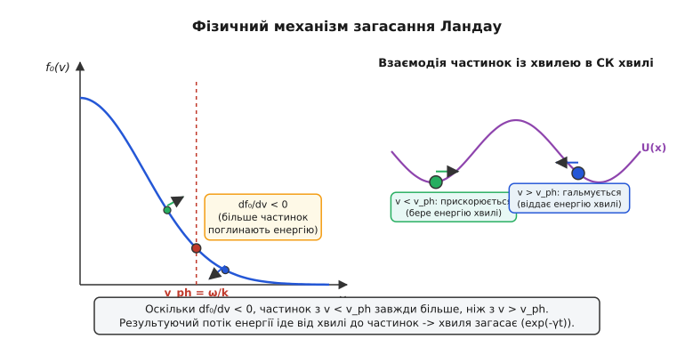
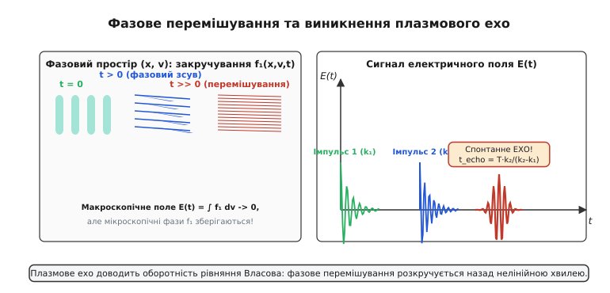
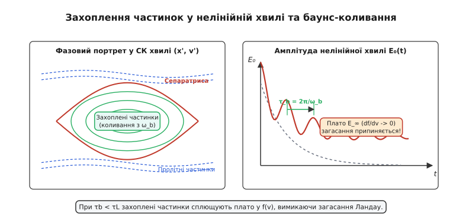

# 🌊 Загасання Ландау в плазмі: Кінетична дисипація без зіткнень

<preknowlist>
- [Рівняння Власова в плазмі](topic:physics/condensed-matter-physics/vlasov-equation) — кінетичне рівняння беззіткновальної плазми та самоузгоджене електростатичне поле.
- [Плазмові коливання електронів](topic:ph-condensed/plasma-oscillations) — Лангмюрівська плазмова частота та дебаївський радіус екранування.
</preknowlist>

Загасання Ландау — це фундаментальний кінетичний ефект у беззіткновальній плазмі, що полягає в експоненціальному згасанні амплітуди колективних електростатичних хвиль за рахунок безпосереднього резонансного обміну енергією між хвилею та зарядженими частинками середовища.

Головна фізична дивовижність загасання Ландау полягає в тому, що макроскопічна дисипація хвильової енергії відбувається в плазмі, де парні кулонівські зіткнення між частинками повністю відсутні або є нехтовно малими (`ν_coll → 0`). У класичній гідродинаміці дисипація енергії неможлива без парних зіткнень, які створюють в'язкість та теплопровідність. У кінетичній же теорії беззіткновальної плазми енергія макроскопічного електричного поля хвилі переходить у кінетичну енергію хаотичного руху резонансних частинок, чиї поздовжні швидкості близькі до фазової швидкості хвилі `v ≈ v_ph = ω / k`.

Історичний контекст цього фундаментального відкриття Лева Ландау 1946 року та тривалі наукові дискусії навколо математичного обходу сингулярності Ван Кампена описує [історична вставка](topic:ph-condensed/landau-damping/hist-landau-discovery.md).

---

### 1. Механізм хвильово-частинкового резонансу та "плазмовий серфінг"

Для наочного розуміння фізики загасання Ландау розглянемо поздовжню електростатичну хвилю Лангмюра, що поширюється вздовж осі `x` з потенціалом `φ(x, t) = φ_0 cos(k x - ω t)`. З цією хвилею пов'язане поздовжнє електричне поле `E_x(x, t) = -∂φ/∂x = E_0 sin(k x - ω t)`.

Перейдемо в супутню систему відліку, що рухається вздовж осі `x` з фазовою швидкістю хвилі `v_ph = ω / k`. У цій системі відліку потенціал хвилі стає стаціонарним синусоїдальним рельєфом `φ(x')`, створюючи послідовність потенціальних ям та горбів для електронів.

Частинки плазми, що рухаються у просторі швидкостей, діляться на дві групи відносно фазової швидкості хвилі:

1. **Повільні частинки (`v < v_ph`):**
   У системі відліку хвилі ці частинки рухаються назад (назустріч хвилі або відстаючи від неї). Натрапляючи на задній схил потенціального горба хвилі, вони гальмуються потенціальним полем, відбиваються або прискорюються вперед під дією поздовжнього електричного поля `E_x`. Усереднений за періодом коливань обмін енергією призводить до того, що хвиля **віддає** імпульс та кінетичну енергію повільним частинкам, підганяючи їх і прискорюючи до фазової швидкості. Це аналог морського серфінгу, коли хвиля підхоплює серфера, що пливе повільніше за неї, і прискорює його до своєї швидкості.

2. **Швидкі частинки (`v > v_ph`):**
   Ці частинки наздоганяють хвилю ззаду. Натискаючи на задній схил потенціальної ями хвилі, вони штовхають хвильне поле вперед і гальмуються під дією гальмівного електричного поля. У результаті вони **віддають** свою кінетичну енергію хвилі, підсилюючи її амплітуду.


*Фізичний механізм обміну енергією між поздовжньою хвилею та резонансними частинками на нахилі максвеллівського розподілу швидкостей.*

Сумарний підсумковий баланс енергії між хвилею та плазмою визначається тим, яких частинок більше у вузькому резонансному інтервалі швидкостей `Δv ~ √(e φ_0 / m)` навколо фазової швидкості `v_ph`:

```
ΔW = W_gain - W_loss ∝ (df_0 / dv)|_{v = v_ph}    [баланс енергії]
```

Для будь-якого термодинамічно рівноважного розподілу частинок (наприклад, ненаокремленого максвеллівського розподілу електронів `f_0(v) = n_0 / √(2π v_th²) · exp(-v² / (2 v_th²))`) похідна функції розподілу по швидкості на будь-якому правому схилі `v > 0` є суворо від'ємною:

```
(df_0 / dv)|_{v = v_ph} < 0                       [умова загасання]
```

Це означає, що у рівноважній плазмі кількість повільних частинок (`v < v_ph`), які відбирають енергію у хвилі, завжди більша за кількість швидких частинок (`v > v_ph`), які віддають енергію хвилі. У результаті хвиля безповоротно втрачає свою електростатичну енергію, а її амплітуда експоненціально згасає з часом:

```
E(t) = E_0 · exp(-γ t) · cos(ω_r t)              [загасання амплітуди поля]
```

Якщо ж у плазмі присутній інжектований електронний пучок із прискореними частинками, профіль `f_0(v)` витворює локальний максимум із додатною похідною `df_0 / dv > 0`. У цьому випадку швидкі частинки переважають повільні, і замість загасання виникає кінетична пучкова нестійкість (*bump-on-tail instability*), при якій хвиля експоненціально розкачується за рахунок кінетичної енергії пучка.

Швидкість зміни кінетичної енергії частинок у резонансній області пропорційна квадрату амплітуди електричного поля `E_0²` та похідній функції розподілу `df_0 / dv`. Енергія, втрачена хвилею, переходить безпосередньо у формування вузького профілю прискорених частинок у просторі швидкостей навколо `v_ph`. При цьому сумарна енергія системи "плазма + хвиля" зберігається строго.

З фізичної точки зору, механізм Ландау є кінетичним аналогом обміну енергією в механічних системах із безліччю зв'язаних осциляторів, де енергія монохроматичного колективного моти дисипує у хаотичні одночастинкові ступені вільності без участі в'язкості. Усереднення сили по максвеллівському ансамблю частинок дає точну від'ємну роботу полем хвилі над плазмою. При цьому переданий частинкам імпульс створює макроскопічний тиск радіаційного поглинання, який прискорює резонансний шар частинок вздовж напрямку поширення хвилі. Формування локального плато на функції розподілу частинок є прямим наслідком зворотного впливу хвилі на середовище. Цей квазілінійний релаксаційний процес описується рівняннями теорії квазілінійного взаємодії Веденова — Кадомцева — Сагдєєва.

---

### 2. Математичне виведення декременту Ландау та контурне інтегрування

Математичний опис кінетики беззіткновальної плазми базується на самоузгодженій системі рівнянь Власова — Пуассона для електронної функції розподілу `f(x, v, t)` у одновимірному просторі:

```
∂f/∂t + v · ∂f/∂x - (e/m) · E(x, t) · ∂f/∂v = 0  [рівняння Власова]
∂E/∂x = (e / ε_0) · (n_0 - ∫ f(x, v, t) dv)       [рівняння Пуассона]
```

Лінеаризуючи функцію розподілу `f(x, v, t) = f_0(v) + f_1(x, v, t)` під дією малого електростатичного збурення `f_1 ≪ f_0` та застосовуючи одностороннє перетворення Лапласа за часом (`t → s = -i ω`) і перетворення Фур'є за простором (`x → k`), дістаємо точне алгебраїчне рівняння для спектральної диелектричної проникності плазми `ε(k, ω)`:

```
ε(k, ω) = 1 + (ω_p² / k²) · ∫ (df_0/dv) / (v - ω/k) dv = 0  [дисперсійне рівняння]
```

де `ω_p = √(n_0 e² / (ε_0 m))` — плазмова (лангмюрівська) частота електронів.

Повний строгий вивід діелектричної проникності `ε(k, ω)`, правила обходу полюса Ландау та обчислення декременту простежує [математична вставка](topic:ph-condensed/landau-damping/math-landau-derivation.md).

Інтеграл у знаменнику містить сингулярний полюс першого порядку на реальній осі швидкостей `v = ω / k`. Лев Ландау вказав, що для коректного врахування початкових умов у перетворенні Лапласа контур інтегрування по швидкості `v` у комплексній площині необхідно аналітично продовжувати, проходячи **нижче** полюса `v = ω / k`.

За формулою Сохоцького — Племеля для контурного інтегрування вздовж дійсної осі:

```
lim_{η → 0+} 1 / (v - u - i η) = P(1 / (v - u)) + i π δ(v - u)  [обхід полюса]
```

де `P` позначує головне значення інтеграла за Коші, а дельта-функція Дірака `δ(v - u)` виділяє уявний внесок резонансних частинок, що відповідає за зсув фаз та беззіткновальне загасання.

Розділяючи діелектричну проникність на дійсну та уявну частини `ε(k, ω) = ε_r(k, ω) + i ε_i(k, ω)`, маємо для долгохвильових хвиль:

```
ε_r(k, ω) = 1 - (ω_p² / ω²) · (1 + 3 k² λ_D²)     [дійсна частина]
ε_i(k, ω) = -π (ω_p² / k²) · (df_0/dv)|_{v = ω/k}  [уявна частина]
```

де `λ_D = √(ε_0 k_B T / (n_0 e²))` — дебаївський радіус екранування електронів.

Декремент загасання `γ = -Im(ω)` обчислюється за стандартною формулою малої уявної добавки до частоти `γ = ε_i / (∂ε_r / ∂ω)`:

```
γ(k) = √(π/8) · (ω_p / (k λ_D)³) · exp(-1 / (2 k² λ_D²) - 3/2)  [декремент Ландау]
```

Дійсна частота коливань відповідає класичному дисперсійному співвідношенню Бома — Ґросса для електростатичних плазмових хвиль з урахуванням теплового руху електронів:

```
ω_r²(k) = ω_p² · (1 + 3 k² λ_D² + 15/4 k⁴ λ_D⁴)  [дисперсія Бома — Ґросса]
```


*Залежність дійсної частоти хвилі Лангмюра та декременту загасання Ландау від приведеного хвильового числа k λ_D.*

#### Фізичні граничні режими загасання Ландау:

1. **Довгохвильова границя (`k λ_D ≪ 1`):**
   Фазова швидкість хвилі значно перевищує теплову швидкість електронів `v_ph = ω / k ≈ ω_p / k ≫ v_th`. У цьому режимі резонансні частинки знаходяться на далеких експоненціальних хвостах максвеллівського розподілу. Кількість резонансних частинок є нехтовно мала, тому декремент загасання є експоненціально малим `γ ∝ exp(-1 / 2 k² λ_D²) ≪ ω_p`. Хвиля Лангмюра поширюється практично без дисипації як довгоживуче колективне коливання плазми.

2. **Короткохвильова границя (`k λ_D ≳ 0.5`):**
   Довжина хвилі стає порівнянною з дебаївським радіусом екранування `λ ~ λ_D`. Фазова швидкість спадає до теплової швидкості електронів `v_ph ~ v_th`. Полюс опиняється у самому центрі максвеллівського розподілу, де густина частинок та похідна `df_0 / dv` максимальні. Декремент загасання стає сумірним із самісінькою плазмовою частотою `γ ~ ω_p`. Загасання відбувається настільки швидко (за час порядку одного періоду коливань `T = 2π / ω_p`), що хвиля Лангмюра взагалі не може існувати як самостійна колективна мода. Це пояснює фундаментальну фізичну причину відсутності плазмових хвиль на просторових масштабах, менших за дебаївський радіус екранування.

Розклад функції дисперсії плазми `Z(ζ)` через ряди Аскралі або неперервні дроби дозволяє обчислювати точні значення декременту `γ(k)` для довільних `k λ_D`, включаючи проміжні значення `k λ_D ≈ 0.3`, де починається інтенсивна дисипація хвилі. Для практичних інженерних розрахунків у фізиці токамаків аналітичні апроксимації функції `Z(ζ)` забезпечують точність обчислень декременту Ландау в межах 1%. Враховується також температурна анізотропія вздовж та впоперек магнітного поля, яка виникає при потужному безнагрівному інжектуванні енергії антенними масивами.

---

### 3. Фазове перемішування та оборотність Власова: плазмове ехо

Загасання Ландау часто називають "удаваним" або чисто кінетичним дисипативним процесом, оскільки фундаментальні рівняння Власова — Пуассона є **строго оборотними відносно інверсії часу** (`t → -t, v → -v`).

З точки зору класичної статистичної физики, мікроскопічна кінетична ентропія Больцмана `S_kin = -∫ f ln f dx dv` для беззіткновальної плазми залишається строго постійною в часі (`dS/dt = 0`). Постає фундаментальне питання: куди ж зникає інформація про макроскопічну хвилю, яка згасла?

Еволюція збурення функції розподілу `f_1(x, v, t)` у просторі швидкостей під дією вільних кінетичних характеристик має вигляд:

```
f_1(x, v, t) ∝ cos(k x - k v t)                  [фазова стружка]
```

З перебігом часу амплітуда просторового електричного поля `E_k(t) = ∫ f_1(x, v, t) dv` прямує до нуля за рахунок **фазового перемішування** (*phase mixing*). Частинки з різними швидкостями `v` випереджають або відстають одна від одної, витворюючи все тоншу й тоншу смугасту структуру ("фазові стружки") у двовимірному фазовому просторі `(x, v)`. Просторова інтеграція за швидкостями дає інтеграл від швидкоосцилюючої функції `exp(-i k v t)`, який прямує до нуля при `t → ∞` за відомою лемою Рімана — Лебега.


*Еволюція тонких фазових стружок у просторі швидкостей та виникнення повторного сплеску електричного поля плазмового ехо.*

Оскільки дрібномасштабна структура зберігається у просторі швидкостей у формі тонких фазових флуктуацій `f_1(v)`, інформація про початковий імпульс та енергію хвилі не втрачається остаточно.

Експериментальним підтвердженням збереження фазової пам'яті плазми є **ефект плазмового ехо** (*spin/plasma echo*), передбачений теорією Ґулда, О'ніла та Мелроузом у 1967 році. Якщо в момент часу `t = 0` збудити в плазмі першу електростатичну хвилю з хвильовим вектором `k_1`, яка повністю згасне за рахунок загасання Ландау, а в момент `t = τ` збудити другу хвилю з `k_2` (`k_2 > k_1`), то в момент часу:

```
t_echo = (k_2 / (k_2 - k_1)) · τ                 [час появи плазмового ехо]
```

у плазмі самочинно виникне третій макроскопічний сплеск електричного поля — плазмове ехо з комбінаційним хвильовим вектором `k_3 = k_2 - k_1`. Цей дивовижний ефект є прямим експериментальним доказом того, що загасання Ландау не є результатом теплової хаотизації, а являє собою чисто кінетичне фазове перемішування.

Нілінійне взаємодія двох осцилюючих фазових стружок видає нелінійну складову третього порядку в функції розподілу `f_2 ~ exp[i k_2 x - i k_2 v (t - τ)] · exp[-i k_1 x + i k_1 v t]`. Коли коефіцієнт при швидкості `v` звертається в нуль `k_2 (t - τ) - k_1 t = 0`, фазове перемішування тимчасово розкручується у зворотному напрямку, збираючи частинки в макроскопічний згусток густини.

Фізична природа плазмового ехо тісно пов'язана зі спиновим ехо Ганна у ядерному магнітному резонансі та фотонним ехо в оптиці квантових середовищ, підкреслюючи універсальність кінетичного принципу зворотності фазового перемішування. Навіть після згасання макроскопічних полів тонка фазова структура залишається закодованою в кінетичному розподілі частинок. При підключенні слабких кулонівських зіткнень ця структура поступово розмивається, призводячи до справжньої термодинамічної дисипації на великих часах та зростання грубозернистої ентропії.

---

### 4. Нелінійне захоплення частинок та БГК-моди

Лінійна теорія Ландау справедлива лише на початкових етапах еволюції хвилі, поки амплітуда електростатичного потенціалу `φ_0` є надзвичайно малою, і частинки рухаються по незабурених траєкторіях.

Коли частина частинок встигає здійснити один повний оборот у потенціальній ямі хвилі, лінійна теорія повністю ламається. Характерний час фазових осциляцій захоплених частинок називається **баунс-часом** (*bounce time*):

```
τ_b = 1 / ω_b = 1 / √(k · e E_0 / m)             [баунс-період захоплених частинок]
```

де `ω_b` — баунс-частота коливань захоплених електронів на дні потенціальної ями.


*Фазовий портрет "котячих очей" захоплених електронів та насичення амплітуди поля на БГК-моді.*

Динаміка системи залежить від співвідношення між декрементом Ландау `γ` та баунс-частотою `ω_b`:

1. **Лінійний режим (`γ ≫ ω_b`):**
   Амплітуда хвилі згасає значно швидше, ніж частинки встигають зробити бодай один оборот у потенціальній ямі (`τ_damping ≪ τ_b`). Загасання описується класичною лінійною формулою Ландау.

2. **Нелінійний режим (`γ ≪ ω_b`):**
   Частинки встигають зробити багато оборотів у потенціальних ямах, перемішуючись усередині резонансної області. Внаслідок цього плато-подібного перемішування похідна функції розподілу в резонансній області вирівнюється:

```
(∂f / ∂v)|_{v ≈ v_ph} → 0                        [вирівнювання плато]
```

   Експоненціальне згасання хвилі зупиняється! Амплітуда електричного поля перестає спадати й виходить на насичене стаціонарне плато з невеликими згасаючими осциляціями на баунс-частоті `ω_b`. Такий стаціонарний нелінійний стан називається **хвилею Бернштейна — Ґріна — Крускала (BGK mode)**.

Параметр нелінійності О'ніла визначається як `q = γ_L / ω_b`. Якщо `q ≫ 1`, хвиля згасає лінійно. Якщо `q ≪ 1`, хвиля захоплює частинки в замкнені фазові траєкторії ("котячі очей") й формує стаціонарну БГК-структуру без подальшої дисипації.

Ширина сепаратриси захоплених частинок у просторі швидкостей виражається формулою `Δv_trap = 2 √(e φ_0 / m)`. Усередині цієї області електрони роблять фазові оберти з частотою `ω_b`, вирівнюючи значення функції розподілу і створюючи горизонтальне плато.

Практична реалізація чисельного розв'язувача 1D1V Vlasov-Poisson рівняння на C++ та Python, а також моделювання переходів між лінійним та нелінійним режимами детально описує [практична вставка](topic:ph-condensed/landau-damping/proj-vlasov-simulation.md).

---

### 5. Загасання Ландау для іонно-звукових хвиль

Крім електронних хвиль Лангмюра, загасання Ландау відіграє вирішальну роль у динаміці низькочастотних **іонно-звукових хвиль** (*ion-acoustic waves*).

Іонний звук являє собою поздовжні коливання іонів під дією пружного тиску електронного газу. Дисперсійне співвідношення іонного звуку у двотемпературній плазмі (`T_e ≫ T_i`) має вигляд:

```
ω(k) = (k c_s) / √(1 + k² λ_De²)                 [дисперсія іонного звуку]
```

де `c_s = √(k_B T_e / m_i)` — швидкість іонного звуку.

Оскільки фазова швидкість іонного звуку задовольняє нерівності `v_th,i ≪ v_ph ≪ v_th,e`, у резонанс із хвилею вступають як іони, так і електрони. Повний декремент загасання складається з двох внесків `γ = γ_e + γ_i`:

```
γ / ω_r = √(π/8) · [√(m_e / m_i) + (T_e / T_i)^(3/2) · exp(-T_e / (2 T_i) - 3/2)]  [декремент іонного звуку]
```

Перший доданок відповідає електронному загасанню Ландау (яке є малим через фактор мас `√(m_e / m_i)`), а другий доданок — іонному загасанню Ландау.

#### Умова існування іонно-звукових хвиль:

- Якщо температура електронів порівнянна з температурою іонів (`T_e ≈ T_i`), другий доданок (іонне загасання Ландау) стає порядка одиниці `γ_i ~ ω_r`. Іони катастрофічно сильно поглинають хвилю, і іонно-звукові коливання взагалі **не можуть поширюватися** в ізотермічній плазмі.
- Щоб іонний звук міг існувати як слабозгасаюча мода, необхідне суворе дотримання умови **температурного дисбалансу**:

```
T_e ≫ T_i   (T_e > 5 T_i)                        [умова існування іонного звуку]
```

У цьому випадку фазова швидкість виходить далеко за межі іонного теплового розподілу (`v_ph ≫ v_th,i`), іонний декремент експоненціально пригнічується `γ_i → 0`, а мале електронне загасання `γ_e / ω ~ √(m_e / m_i) ≪ 1` дозволяє хвилі поширюватися на великі відстані.

Електронне загасання іонно-звукових хвиль забезпечує важливий фізичний канал обміну енергією між електронами та іонами в нерівноважній плазмі газорозрядних трубок та лабораторних плазмових установок. При досягненні дрейфовою швидкістю електронів порогу `u_d > c_s` виникає іонно-звукова нестійкість.

---

### 6. Загасання Ландау у фізиці конденсованого стану та квантовій плазмоніці

Хоча загасання Ландау було первинно відкрите для класичної іонізованої плазми, воно є універсальним ефектом і відіграє фундаментальну роль у фізиці твердого тіла та квантових рідин.

#### 1. Фермі-рідини та нульовий звук у гелії-3
У виродженому електронному газі металів та в квантовій рідині Гелію-3 (`³He`) частинки підпорядковуються статистиці Фермі — Дірака. Лев Ландау у своїй теорії Фермі-рідини (1956) показав, що при низьких температурах `T → 0`, коли класичні зіткнення частинок виморожені, у системі може поширюватися особлива високочастотна мода — **нульовий звук** (*zero sound*). Нульовий звук є колективним коливанням поверхні Фермі зі швидкістю `v_0 > v_F`, а його беззіткновальне загасання описується квантовим аналогом декременту Ландау за рахунок переходу енергії до одночастинкових квазічастинкових збуджень.

#### 2. Квантові плазмони та континуум Стонера
У трьохвимірних металах (наприклад, натрій, алюміній) та двовимірних наноструктурах (графер, квантові ями `GaAs/AlGaAs`) колективними коливаннями густини електронного газу є **плазмони**. 

Згідно з наближенням випадкових фаз (RPA), діелектрична проникність виродженого електронного газу описується **функцією Ліндхарда** `ε_RPA(q, ω)`. Уявна частина `Im[ε_RPA(q, ω)]` визначає спектральну область одночастинкових збуджень електронів із системи (створення пар "електрон — дирка"), яку називають **континуумом Стонера** (*Stoner continuum*).

```
Спектр плазмонів та континуум Стонера в твердому тілі:

  ω ↑
    |       /  Квантовий плазмон ω_p(q)
    |      /
    |     /  . - - - - - - - - - - - - - - - -
    |    / .   Континуум одночастинкових
    |   /.     збуджень (електрон-дирка)
    |  / .     (Загасання Ландау в твердому тілі)
    | /  .
----+----+------------------------------------> q
    0   q_crit
```

Область одночастинкових збуджень у квантовому Фермі-газі обмежена кривими `ω = q v_F ± ℏ q² / (2 m)`.

- При малих імпульсах `q < q_crit` спектральна вітка плазмона лежить **поза** континуумом Стонера. Загасання Ландау заборонене законами збереження енергії та імпульсу, тому плазмон існує як довгоживуча квантова квазічастинка.
- При досягненні критичного імпульсу `q ≥ q_crit` дисперсійна крива плазмона входить у континуум Стонера. Плазмон миттєво розпадається на одночастинкові збудження електрон-дирка за рахунок твердотільного загасання Ландау за надзвичайно короткі фемтосекундні часи (`τ ~ 10 - 100 fs`). Це явище встановлює фундаментальну фізичну межу для мініатюризації пристроїв квантової наноплазмоніки та нанофотоніки.

Для 2D-графена дисперсійне співвідношення плазмонів задовольняє пропорційності `ω_p(q) ∝ √q`, і межа континууму Стонера збігається з конусом Дірака, де квантове загасання Ландау переважає на високих терагерцових частотах.

---

### 7. Релятивістські ефекти та космологічна плазма

У високотемпературній релятивістській плазмі астрофізичних об'єктів (магнітосфери пульсарів, релятивістські струмені активних ядер галактик, акреційні диски навколо чорних дир) кінетична енергія електронів перевищує їхню енергію спокою `k_B T_e ≫ m_e c²`.

У релятивістському рівнянні Власова релятивістська маса частинки залежить від швидкості `m = γ_rel m_0 = m_0 / √(1 - v²/c²)`. Це суттєво змінює дисперсійне співвідношення та умови резонансу Ландау:

1. **Поздовжні релятивістські хвилі:** 
   Для поздовжніх електростатичних мод релятивістське загасання Ландау зберігається, але декремент `γ_rel` виражається через релятивістський максвеллівський розподіл Максвелла — Юттнера `f_MJ(p) ∝ exp(-γ_rel m_0 c² / k_B T)`. Збільшення інертної маси релятивістських електронів пригнічує декремент загасання, роблячи релятивістську плазму більш прозорою для високочастотних коливань.

2. **Поперечні електромагнітні хвилі:** 
   У вакуумі чи незамагніченій плазмі фазова швидкість поперечних електромагнітних хвиль завжди перевищує швидкість світла `v_ph = ω / k > c`. Оскільки жодна реальна частинка з масою спокою не може рухатися зі швидкістю `v > c`, резонансна умова `v = v_ph` **ніколи не виконується**. Відповідно, поперечні електромагнітні хвилі у незамагніченій плазмі зазнають **суворо нульового загасання Ландау**.

3. **Кінетичні альфвенівські хвилі (KAW) у космічному вітрі:** 
   У замагніченій плазмі сонячного вітрі та міжзоряного середовища загасання Ландау на кінетичних альфвенівських хвилях є основним фізичним механізмом беззіткновального нагріву іонів та електронів. Дані космічних апаратів *Parker Solar Probe* та *MMS (Magnetospheric Multiscale)* підтвердили, що турбулентна енергія сонячної корони дисипується на макромасштабах саме завдяки безпосередньому черпанню енергії частинками через резонанс Ландау.

Декремент релятивістського загасання Ландау зменшується пропорційно показнику `exp(-m_0 c² / k_B T)`, що забезпечує вільне поширення релятивістських електромагнітних імпульсів крізь розряджену плазму астрофізичних джерел.

---

### 8. Магнітоплазмові хвилі та замагнічене загасання Ландау

Зовнішнє магнітне поле `B_0` принципово змінює кінетичну динаміку частинок, змушуючи їх обертатися навколо магнітних силових ліній із циклотронною частотою (гірочастотою) `Ω_c = |q| B_0 / m`.

У замагніченій плазмі умова хвильово-частинкового резонансу узагальнюється формулою Допплера для гармонік циклотронного обертання:

```
ω - k_parallel · v_parallel = n · Ω_c            [циклотронний резонанс, n = 0, ±1, ...]
```

де `k_parallel` та `v_parallel` — компоненти хвильового вектора та швидкості частинки, паралельні зовнішньому магнітному полю `B_0`.

1. **Паралельний резонанс Ландау (`n = 0`):**
   При `n = 0` резонансна умова зводиться до `ω = k_parallel · v_parallel`. Це класичний резонанс Ландау, але частинки взаємодіють із хвилею виключно за рахунок свого поздовжнього руху вздовж магнітного поля. Електрони ефективно поглинають енергію низькочастотних кінетичних альфвенівських хвиль та швидких магнітозвукових хвиль, що є головним джерелом безнагрівної дисипації турбулентності в термоядерних токамаках.

2. **Циклотронне загасання (`n = ± 1`):**
   При `n = ± 1` частинки перебувають у резонансі із обертальним електричним полем хвилі. Електрон поглинає енергію хвилі, коли частота хвилі в його власній супутній системі відліку збігається з його гірочастотою `Ω_c`. Це циклотронне загасання Ландау широко застосовують для високоефективного додаткового локального нагріву плазми в токамаках методом електронно-циклотронного резонансу (ECRH).

Збудження вищих гармонік `n = ±2, ±3` виникає при врахуванні скінченного ларморівського радіуса частинок `r_L = v_perpendicular / Ω_c`. Ефекти скінченного ларморівського радіуса (FLR) описуються бесселевими функціями `I_n(k_perpendicular² r_L²)`.

---

### 9. Експериментальна діагностика у токамаках та космічних місіях

Пряма експериментальна перевірка загасання Ландау вимагає прецизійного вимірювання флуктуацій електростатичного поля та кінетичних функцій розподілу частинок `f(v, t)`.

1. **Термоядерні токамаки (ITER, JET, DIII-D, ASDEX Upgrade):**
   У фізиці керованого термоядерного синтезу загасання Ландау використовують для безнагрівного створення тороїдального електричного струму — **генерації струму нижньогібридними хвилями** (*Lower Hybrid Current Drive, LHCD*). Високочастотна радіохвиля інжектується в плазму з фазовою швидкістю, що відповідає хвостовим електронам `v_ph ~ 3-4 v_th`. За рахунок загасання Ландау хвиля передає свій імпульс цим електронам, створюючи стаціонарний струм у 1–2 Мегаампери без використання індуктивного трансформатора.
   У стелараторі W7-X та токамаку ASDEX Upgrade антени ECRH спрямовують потужні мікрохвильові пучки мегаватного рівня безпосередньо у зони циклотронного резонансу Ландау для точкового управління профілем електронної температури `T_e(r)` та пригнічення тороїдальних нестійкостей.
   Сучасні гірокінетичні сімулятори (коди GENE, GYRO, ORB5) обчислюють коефіцієнти турбулентного теплопереносу `χ_e` та `χ_i` в термоядерній плазмі ITER, прямо інтегруючи 5-вимірні замагнічені рівняння Власова з урахуванням загасання Ландау. Розрахунок транспортних бар'єрів H-режиму вимагає точного обліку нелінійного загасання Ландау на градієнтних дрейфових хвилях, оскільки це визначає тривалість утримання високої енергії у плазмовому шнурі та запобігає виходу гарячої плазми на стінки першої вакуумної камери. Точні моделі коригують профілі електронного тиску з урахуванням анізотропії `T_parallel ≠ T_perpendicular`.

2. **Космічні супутникові місії (MMS, Parker Solar Probe):**
   Чотири космічних апарати місії NASA MMS (*Magnetospheric Multiscale*), що літають у формі тетраедра у магнітосфері Землі, оснащені надшвидкими спектрометрами частинок FPI (*Fast Plasma Investigation*). Супутники вперше в історії фізики прямо виміряли 3D функцію розподілу електронів `f(v)` із часовою роздільною здатністю 30 мілісекунд під час магнітного перез'єднання. Вимірювання беззаперечно зафіксували характерні сплески та деформації максвеллівського хвоста у резонансній зоні `v_parallel ≈ ω / k_parallel`, що стало прямою експериментальною візуалізацією загасання Ландау в природних умовах космічного простору. Виміряні фазові вихори ("електронні дірки") прямо узгоджуються з теоретичними моделями нелінійних БГК-солітонів.

Космічні зонди зафіксували, що у сонячному вітрі резонансне загасання Ландау альфвенівських хвиль створює стійкі анізотропні "протоні промені", які зберігають свій кінетичний профіль протягом мільйонів кілометрів поширення у міжпланетному середовищі.

---

### 10. Порівняльний аналіз кінетичних та гідродинамічних мод

Для підсумування кінетичних властивостей плазмових хвиль зведемо основні параметри лінійних хвиль та їхні механізми загасання в порівняльну таблицю:

| Фізична мода | Умова існування | Дисперсійне співвідношення `ω(k)` | Механізм дисипації | Декремент загасання `γ` |
| :--- | :--- | :--- | :--- | :--- |
| **Електронна хвиля Лангмюра** | `k λ_D ≪ 1` | `ω² = ω_p² (1 + 3 k² λ_D²)` | Електронне загасання Ландау | `γ ∝ (ω_p / (kλ_D)³) e^{-1/(2k²λ_D²)}` |
| **Іонно-звукова хвиля** | `T_e ≫ T_i` | `ω = k c_s / √(1 + k²λ_D²)` | Резонанс з іонами та електронами | `γ/ω ≈ √(π m_e / 8 m_i) + ion_tail` |
| **Нульовий звук Ландау** | `T → 0` (Фермі-рідина) | `ω = k v_F (1 + δ)` | Одночастинкові Fermi-збудження | `γ ∝ T² / E_F` |
| **Квантовий плазмон** | `q > q_crit` (Метали/2D) | `ω² = ω_p,3D² + 3/5 v_F² q²` | Розпад у континуум Стонера | `τ_decay ~ 10 - 100 fs` |
| **БГК Нелінійна мода** | `γ ≪ ω_b` (Захоплення) | Стаціонарний потенціал `φ(x)` | Нульова дисипація (Плато `df/dv=0`) | `γ = 0` (коливання `ω_b`) |

Табличне зіставлення виявляє фундаментальний зв'язок між кінетичними декрементами Ландау та характеристичними масштабами системи, підкреслюючи спільність принципу хвильово-частинкового резонансу у найрізноманітніших фізичних середовищах.

---

### 11. Висновки та фундаментальне значення

Загасання Ландау є основоположним наріжним каменем сучасної фізики плазми та фізики конденсованого стану. Воно довело, що беззіткновальна система з величезною кількістю ступенів вільності здатна демонструвати ефективну макроскопічну дисипацію та релаксацію за рахунок фазового перемішування в мікроскопічному фазовому просторі.

Математичне обґрунтування концепції Ландау відкрило цілий розділ сучасної аналітичної фізики, присвячений контурному інтегруванню та розв'язанню нелінійних кінетичних рівнянь Власова. Сучасне теоретичне осмислення загасання Ландау як фазового перемішування у фазовому просторі отримало найвище математичне визнання: у 2010 році Седрік Віллані був нагороджений Філдсівською премією за точний математичний доказ нелінійного загасання Ландау для рівнянь Власова — Пуассона.

Без урахування загасання Ландау неможливо спроектувати термоядерний реактор (токамак чи стеларатор), пояснити безнагрівну дисипацію сонячної корони, побудувати теорію надвисокочастотних генераторів (лазери на вільних електронах, триоди Лангмюра) та розробити новітні пристрої квантової наноплазмоніки.
