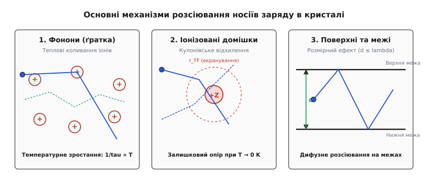
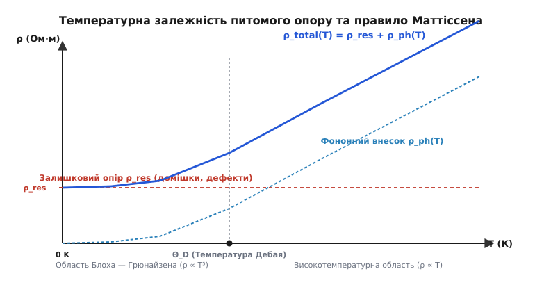
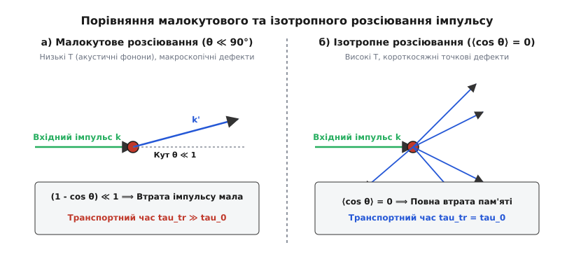

# Довжина вільного пробігу та час релаксації: мікроскопічна динаміка носіїв у кристалах

<preknowlist>
- [Модель Друде](topic:ph-condensed/drude-model) — електронний газ, класична провідність металів та статичний опір.
- [Природа опору](topic:ph-condensed/resistance-origin) — розсіювання носіїв заряду в кристалічній ґратці.
- [Зонна теорія](topic:ph-condensed/band-theory) — квантові стани електронів, поверхня Фермі та ефективна маса.
- [Дрейф електронів](topic:ph-condensed/electron-drift) — напрямлений рух під дією електричного поля.
</preknowlist>

Коли електричний струм тече крізь мідну жилу силового кабелю за кімнатної температури, електрони пролітають у середньому лише 40 нанометрів між двома послідовними актами розсіювання — це відстань усього у сотню атомних радіусів. Проте варто охолодити той самий кристал надчистої міді до температури рідкого гелію, як ця відстань зростає у десятки тисяч разів, досягаючи часток міліметра. Масштаб цього мікроскопічного шляху визначає межу між класичним опором Омівського провідника та квантовим балістичним транспортом у сучасних нанотранзисторах.

Усі макроскопічні транспортні властивості твердих тіл — електропровідність, теплопровідність, коефіцієнт Холла та термоелектрична рушійна сила — фундаментально спираються на дві мікроскопічні величини: **час релаксації `τ`** (середній час між зіткненнями) та **довжину вільного пробігу `λ`** (середню відстань, яку долає носій заряду без втрати імпульсу).

---

### 1. Чому ідеальний кристал не має опору: теорема Блоха та джерела розсіювання

Перш ніж аналізувати розсіювання носіїв, необхідно відповісти на фундаментальне запитання: чому електрон взагалі розсіюється у кристалі?

У класичній фізиці Друде кристал уявлявся як щільна «загата» з позитивних іонів, об які електрони постійно врізаються, подібно до кульок у пінболі. Проте квантова механіка повністю перевернула це уявлення. Згідно з квантовомеханічною **теоремою Блоха**, електрон у твердому тілі описується хвилею де Бройля, яка поширюється у строго періодичному потенційному полі кристалічної ґратки.

Математично, потенціал ідеальної ґратки задовольняє умову трансляційної симетрії `V(r + R) = V(r)` для будь-якого вектора трансляції `R`. У такому періодичному полі хвильова функція електрона є блохівською хвилею `Ψ_k(r) = u_k(r) · exp(i · k · r)`, де `u_k(r + R) = u_k(r)` — функція, що має періодичність кристалічної ґратки.

Головний фізичний наслідок теореми Блоха є безкомпромісним: **в ідеально періодичній кристалічній ґратці електронна хвиля поширюється без жодного згасання та без жодного опору.** Когерентна електронна хвиля резонансно перевипромінюється кожним атомом ґратки так, що вторинні хвилі інтерферують виключно у напрямку початкового поширення (на зразок світла в ідеально прозорому кристалі). В ідеальному кристалі за температури абсолютного нуля `T = 0 K` довжина вільного пробігу є нескінченною (`λ → ∞`), а питомий опір дорівнює нулю (`ρ = 0`).

Електричний опір виникає **виключно через порушення періодичності** потенціалу кристалічної ґратки. Будь-яке відхилення від ідеальної періодичності створює локальне квантовомеханічне збурення ΔV(r), яке викликає відхилення (розсіювання) електронної хвилі з початкового стану з хвильовим вектором k у новий стан k.

Усі джерела порушення періодичності у кристалах поділяються на два принципові класи:
1. **Динамічні (теплові) порушення**: теплові коливання іонів ґратки коло своїх положень рівноваги. У квантовій теорії ці коливання квантуються у вигляді квазічастинок — **фононів**. Оскільки амплітуда коливань зростає з температурою, фононне розсіювання зникає при T → 0 K.
2. **Статичні (структурні) дефекти**: точкові домішкові атоми, вакансії, міжвузлові атоми, дислокації, межі зерен у полікристалах та шорсткість зовнішніх поверхонь зразка. Ці дефекти є замороженими у структурі й створюють опір навіть при температурах, близьких до абсолютного нуля.

---

### 2. Час релаксації `τ`: математична статистика та ансамблі носіїв

Зіткнення носія заряду з дефектом чи фононом є ймовірнісним квантовим актом. Нехай `w` — ймовірність того, що електрон зазнає розсіювання за одиницю часу. Величина, обернена до цієї ймовірності, називається **часом релаксації** або середнім часом вільного пробігу:

```
τ = 1 / w
```

Розглянемо ансамбль з `N_0` електронів, які у момент часу `t = 0` випробували акт розсіювання і розпочали вільний проліт. Кількість частинок `N(t)`, які пролетіли час `t` без жодного додаткового зіткнення, описується диференціальним рівнянням загасання:

```
dN = - N(t) · w · dt = - N(t) · (dt / τ)
```

Інтегруючи це рівняння з початковою умовою `N(0) = N_0`, отримуємо пуассонівський **експоненціальний закон розподілу часу вільного пробігу**:

```
N(t) = N_0 · exp(-t / τ)
```

Ймовірність того, що електрон пролетить без зіткнень час, більший за `t`, дорівнює `P(t) = exp(-t / τ)`.

Обчислимо математичне сподівання часу пробігу частинки:

```
⟨t⟩ = ∫₀^∞ t · P(t) dt / ∫₀^∞ P(t) dt
    = ∫₀^∞ (t / τ) · exp(-t / τ) dt
    = τ                              [математичне сподівання часу пробігу]
```

#### Ієрархія часів релаксації у квантовому транспорті
У фізиці конденсованого стану розрізняють кілька фундаментальних часів релаксації, кожен з яких відповідає за свій фізичний ефект:

- **Транспортний час релаксації імпульсу `τ_tr`**: середня тривалість зберігання напрямку дрейфового імпульсу. Описує зсув всієї сфери Фермі під дією електричного поля і визначає макроскопічну електропровідність та рухливість носіїв `μ = e · τ_tr / m*`. За кімнатної температури у металах `τ_tr ~ 10⁻¹⁴ … 10⁻¹³` с.
- **Одночастинковий квантовий час життя `τ_0` (або `τ_Dingle`)**: середня тривалість перебування електрона у заданому квантовому стані `|k⟩` до будь-якого розсіювання на будь-який кут. Визначить квантове розширення енергетичних рівнів `ΔE ≈ ħ / τ_0` і вимірюється в експериментах із затухання квантових осциляцій де Гааза — ван Альфена та Шубникова — де Гааза.
- **Час релаксації енергії `τ_E`**: середня тривалість, за яку електрон віддає кристалічній ґратці надлишкову кінетичну енергію, набуту від полевого прискорення. При пружному розсіюванні на важких іонах електрон передає іону лише мізерну частку енергії `~ m*/M_ion ≪ 10⁻⁴`. Передача енергії відбувається переважно через непружне випромінювання оптичних фононів або електрон-електронні зіткнення. На відміну від `τ_tr`, за низьких температур час релаксації енергії на декілька порядків перевищує час релаксації імпульсу: `τ_E ≫ τ_tr` (іноді `τ_E ~ 10⁻¹⁰ … 10⁻⁸` с).
- **Час збою квантової фази `τ_φ`**: тривалість зберігання фазової когерентності електронної хвилі. Відіграє вирішальну роль у явищах слабкої локалізації та квантового осциляційного транспорту у наноструктурах.

---

### 3. Довжина вільного пробігу `λ`: від газу Клаузіуса до поверхонь Фермі

**Довжина вільного пробігу `λ`** — це середня геометрична відстань, яку носій заряду долає між двома послідовними актами розсіювання імпульсу.

Зв'язок між довжиною вільного пробігу та часом релаксації фундаментально залежить від того, який статистичний розподіл описує носії заряду.

#### Класичний підхід (модель Друде — Клаузіуса)
У класичному невиродженому електронному газі (або у напівпровідниках за високих температур та малої концентрації) електрони підпорядковуються статистиці Максвелла — Больцмана. Середня швидкість частинок є середньою тепловою швидкістю:

```
v_th = √(3 · k_B · T / m*)
λ_class = v_th · τ
```

Оскільки `v_th ∝ √T`, у класичному газі за відсутності розсіювання довжина вільного пробігу зростала б з температурою, але у твердих тілах час релаксації падає значно швидше за рахунок фононів.

#### Квантовий підхід Зоммерфельда (вироджений електронний газ у металах)
У металах та сильнолегованих напівпровідниках електронний газ є глибоко виродженим (`E_F ≫ k_B · T`). Згідно з принципом заборони Паулі, усі квантові стани під сферою Фермі повністю заповнені. Під дією слабкого електричного поля змінювати свій стан і брати участь у струмі можуть лише електрони, що лежать у вузькому енергетичному прошарку товщиною `~ k_B · T` поблизу **поверхні Фермі**.

Усі ці електрони рухаються з однаковою, величезною швидкістю — **швидкістю Фермі `v_F`**:

```
v_F = ħ · k_F / m* = (ħ / m*) · (3 · π² · n)^(1/3)
```

Швидкість Фермі у металах становить `v_F ≈ 10⁶` м/с (близько 1% від швидкості світла) і практично **не залежить від температури**.

Тому у квантовій теорії металів співвідношення між довжиною вільного пробігу та часом релаксації виражається строго через швидкість Фермі:

```
λ = v_F · τ
```

Подробиці історичної дискусії щодо вимірювання цієї величини та відкриття квантового парадоксу Зоммерфельда описано у 📜 [Історії поняття вільного пробігу](topic:ph-condensed/mean-free-path/hist-mean-free-path.md).

#### Питома провідність через довжину вільного пробігу
Підставивши `τ = λ / v_F` у класичний вираз Друде для питомої провідності `σ = n · e² · τ / m*`, отримуємо квантову формулу провідності через параметри поверхні Фермі:

```
σ = (n · e² · λ) / (m* · v_F)
  = (e² · k_F² · λ) / (3 · π² · ħ)       [узагальнення для сферичної поверхні Фермі]
```

Ця формула показує, що провідність металу прямо пропорційна довжині вільного пробігу `λ`.

#### Експериментальні мікроскопічні параметри металів при T = 300 K
Нижче наведено порівняльні значення швидкості Фермі `v_F`, часу релаксації `τ` та довжини вільного пробігу `λ` для найпоширеніших металів:

| Метал | Концентрація `n` (10²⁸ м⁻³) | Швидкість Фермі `v_F` (10⁶ м/с) | Час релаксації `τ` (10⁻¹⁴ с) | Довжина пробігу `λ` (нм) |
| :--- | :--- | :--- | :--- | :--- |
| **Мідь (Cu)** | 8.47 | 1.57 | 2.5 | 39 |
| **Срібло (Ag)** | 5.86 | 1.39 | 3.8 | 53 |
| **Золото (Au)** | 5.90 | 1.40 | 3.0 | 42 |
| **Алюміній (Al)**| 18.10 | 2.03 | 0.8 | 16 |
| **Натрій (Na)** | 2.65 | 1.07 | 3.2 | 34 |
| **Платина (Pt)** | 6.60 | 0.35 | 0.3 | 1.1 |

У чистих однокристалах міді чи срібла при зниженні температури до `4.2 K` (рідкий гелій) час релаксації `τ` зростає до `10⁻¹¹` с, а довжина вільного пробігу `λ` досягає **0.1 мм (100 000 нм)**!

---

### 4. Головні механізми розсіювання у кристалічній ґратці

Властивості матеріалу та його температурна поведінка визначаються тим, який саме механізм розсіювання домінує за даних умов.


*Три головні мікроскопічні механізми розсіювання носіїв заряду у твердих тілах: 1 — акустичні та оптичні фонони (зростають з температурою); 2 — кулонівське відхилення на іонізованих домішках (збереження залишкового опору при T → 0 K); 3 — граничне дифузне розсіювання на поверхнях тонких плівок та нанодротів при d ≤ λ.*

#### 1. Розсіювання на фононах (ґраткове розсіювання)
Фонони являють собою кванти теплових коливань ґратки. Відхилення атомів від положень рівноваги створює періодичне збурення потенціалу.
- **Високі температури (`T ≫ Θ_D`, де `Θ_D` — температура Дебая)**: Число фононів з енергією `ħ·ω` підпорядковується наближенню Релея — Джинса `N_ph ≈ k_B · T / (ħ · ω) ∝ T`. Ймовірність розсіювання прямо пропорційна кількості фононів: `1/τ_ph ∝ T`. Звідси питомий опір чистих металів та напівпровідників за високих температур зростає лінійно з температурою: `ρ_ph ∝ T`, а довжина вільного пробігу зменшується як `λ_ph ∝ 1/T`.
- **Низькі температури (`T ≪ Θ_D`)**: У металах електрони розсіюються переважно на довгохвильових акустичних фононах. Квантова теорія Блоха — Грюнайзена показує, що через зменшення теплового імпульсу фононів `q ~ k_B · T / s` кут розсіювання стає малим, що приводить до швидкого спаду опору: `ρ_ph ∝ T⁵`. Крім того, важливу роль відіграють **процеси перекиду (Umklapp-процеси)**, у яких вектор сумарного імпульсу виходить за межі першої зони Бріллюена і змінюється на вектор оберненої ґратки `G`.
- **Полярні оптичні фонони у напівпровідниках**: У полярних напівпровідниках групи A³B⁵ (GaAs, GaN, InP) зміщення негативних та позитивних іонів створює сильне макроскопічне електричне поле. Це приводить до **іонного полярного оптичного розсіювання (Фрьоліхівського розсіювання)**, яке домінує при `T > 100 K` і швидко обмежує рухливість носіїв.

#### 2. Розсіювання на іонізованих домішках та дефектах
Коли домішковий атом іонізується (наприклад, фосфор у кремнії), він утворює в кристалі точковий заряд `+Ze`. На відміну від фононів, статичні дефекти не зникають при охолодженні кристала.

Потенціал іонізованої домішки екранується електронним газом і описується потенціалом Юкави: `V(r) = (Ze / 4πεr) · exp(-r / r_TF)`, де `r_TF` — радіус екранування Томаса — Фермі.
- У металах домішкове розсіювання майже не залежить від температури і визначає **залишковий опір** `ρ_res` при `T → 0 K`.
- У напівпровідниках теорія Брукса — Геррінга передбачає, що при зростанні температури середня кінетична швидкість електронів зростає (`v_th ∝ √T`), тому швидкий електрон менше відхиляється кулонівським полем іона. Як наслідок, рухливість за домішкового розсіювання зростає з температурою: `τ_imp ∝ T^(3/2)`.

#### 3. Електрон-електронне розсіювання
Кулонівська взаємодія між носіями заряду зберігає сумарний імпульс електронної системи, тому у першому наближенні вона не створює електричного опору. Проте внаслідок принципу заборони Паулі акти розсіювання дозволені лише для частинок у вузькій смузі `k_B · T` коло поверхні Фермі.

Ефективна частота електрон-електронних зіткнень у рідині Фермі Ландау становить:

```
1 / τ_ee ∝ (k_B · T / E_F)²
```

Це розсіювання дає внесок в опір `ρ_ee ∝ T²`, який стає помітним у дуже чистих металах за наднизьких температур (нижче 10 K).

#### 4. Поверхневе та граничне розсіювання (модель Фукса — Зондгаймера та Маєдаса — Шатцкеса)
Коли товщина металевої плівки або діаметр нанодроту `d` стає порівнянним із об'ємною довжиною вільного пробігу `λ_0` (`d ≤ λ_0`), електрони починають часто зіштовхуватися з фізичними межами зразка.

Якщо розсіювання на поверхні є дифузним (електрон втрачає напрямок дрейфу), ефективна довжина вільного пробігу падає згідно з наближенням Фукса — Зондгаймера:

```
λ_eff ≈ d · (ln(λ_0 / d) + 0.43)    для d ≪ λ_0
```

У полікристалічних провідниках додатково діє **модель Маєдаса — Шатцкеса**, яка описує розсіювання на межах між окремими кристалічними зернами з коефіцієнтом відбивання `R_gb`. Це викликає катастрофічне зростання питомого опору мідних доріжок у процесорах з шириною провідника менше 15 нм.

---

### 5. Правило Маттіссена: сумативність частот розсіювання

Якщо у кристалі одночасно діють декілька незалежних механізмів розсіювання, загальна ймовірність розсіювання за одиницю часу дорівнює сумі ймовірностей окремих процесів.

Це дає **правило Маттіссена** для обернених часів релаксації та довжин вільного пробігу:

```
1 / τ_total = 1 / τ_ph + 1 / τ_imp + 1 / τ_ee + 1 / τ_boundary
1 / λ_total = 1 / λ_ph + 1 / λ_imp + 1 / λ_ee + 1 / λ_boundary
```

Оскільки питомий опір прямо пропорційний оберненому часу релаксації `ρ = m* / (n · e² · τ)`, правило Маттіссена виражається як адитивність окремих внесків у питомий опір:

```
ρ_total(T) = ρ_res + ρ_ph(T) + ρ_ee(T)
```


*Температурна залежність питомого опору металу відповідно до правила Маттіссена. При T → 0 K опір виходить на насичення ρ_res (залишковий опір на домішках). При підвищенні температури додається фононний внесок: спочатку як T⁵ (область Блоха — Грюнайзена), а вище температури Дебая Θ_D — як лінійна функція T.*

#### Залишкове відношення опорів (RRR)
Якість кристала та ступінь його чистоти оцінюють за безрозмірним коефіцієнтом **RRR (Residual Resistance Ratio)**:

```
RRR = ρ(300 K) / ρ(4.2 K)
```

Для звичайної технічної міді `RRR ≈ 50 … 100`. У хімічно чистих кристалах міді після глибокого відпалу `RRR` перевищує **10 000**, що свідчить про гігантську довжину вільного пробігу носіїв при низьких температурах.

Строге квантовомеханічне виведення правила Маттіссена та детальний аналіз випадків його порушення наведено у 🧮 [Виведенні правила Маттіссена](topic:ph-condensed/mean-free-path/math-matthiessen-rule.md).

---

### 6. Повний час життя стану проти транспортного часу релаксації `τ_tr`

Аналізуючи електропровідність, важливо розуміти, що **не кожне зіткнення однаково ефективно гальмує струм**.

Розглянемо два крайніх випадки розсіювання:
1. **Ізотропне розсіювання на великі кути (`θ ~ 90° … 180°`)**: Електрон після удару відлітає у довільному напрямку, повністю втрачаючи пам’ять про свій початковий дрейфовий імпульс.
2. **Малокутове розсіювання (`θ ≪ 1°`)**: Електрон лише злегка відхиляється від початкового траєкторного напрямку, зберігаючи практично увесь свій дрейфовий імпульс вздовж поля.


*Геометрія розсіювання імпульсу: а — малокутове розсіювання (θ ≪ 1), де фактор (1 - cos θ) ≪ 1, завдяки чому транспортний час τ_tr є значно більшим за квантовий час життя τ_0; б — ізотропне розсіювання (⟨cos θ⟩ = 0), де кожен акт повністю знищує дрейфовий імпульс, і τ_tr = τ_0.*

Для розрахунку електричного струму в інтегралі зіткнень Больцмана вводиться ваговий геометричний фактор `(1 - cos θ)`, який визначає частку втраченого поздовжнього імпульсу.

Це дає вираз для **транспортного часу релаксації `τ_tr`**:

```
1 / τ_tr = ∫ w(θ) · (1 - cos θ) · dΩ = (1 / τ_0) · ⟨1 - cos θ⟩
```

де `τ_0` — повний квантовий час життя стану (без фактора `1 - cos θ`).

#### Порівняльний підсумок:
- Якщо розсіювання ізотропне (`⟨cos θ⟩ = 0`), то `(1 - cos θ) = 1`, і `τ_tr = τ_0`.
- Якщо розсіювання малокутове (наприклад, на м'яких акустичних фононах за низьких температур), то `⟨cos θ⟩ ≈ 1`, величина `(1 - cos θ) ≪ 1`, звідки **`τ_tr ≫ τ_0`**.

Це означає, що квантова фаза хвилі електрона може руйнуватися дуже часто (короткий квантовий час `τ_0`), але макроскопічний опір провідника залишається низьким, оскільки транспортний час `τ_tr` є великим.

---

### 7. Квантова межа: ліміт Іоффе — Регеля — Мотта та погані метали

Що станеться, якщо збільшувати концентрацію домішок чи температуру матеріалу до екстремальних значень? Час релаксації `τ` та довжина вільного пробігу `λ` будуть зменшуватися. Проте чи існує фундаментальна нижня межа для `λ`?

У 1960 році радянські фізики Абрам Іоффе та Анатолій Регель, а згодом Невілл Мотт сформулювали квантовий ліміт: **довжина вільного пробігу електрона не може бути меншою за довжину його хвилі де Бройля `λ_dB = 2π / k_F` або міжатомну відстань `a`.**

Ця умова називається **межею Іоффе — Регеля — Мотта**:

```
k_F · λ ≥ 1
```

Якщо формальний розрахунок за формулою Друде дає `k_F · λ < 1` (тобто `λ < a`), класична зонна картина повністю руйнується. Електрон більше не може розглядатися як хвиля Блоха, що вільно пролітає між зіткненнями. Поняття «вільного пробігу» втрачає фізичний зміст.

При досягненні межі Іоффе — Регеля відбувається перехід до **сильної квантової локалізації (локалізація Андерсона)**: хвильові функції електронів стають експоненціально локалізованими в просторі, а система зазнає фазового переходу з металевого стану в стан діелектрика. Мінімально можлива провідність металевого стану перед цим переходом називається **мінімальною металевою провідністю Мотта**:

```
σ_min ≈ (e² / (3 · ħ · a)) ≈ 1000 … 2000  Ом⁻¹·см⁻¹
```

#### Загадка «поганих металів» (Bad Metals)
У сучасній фізиці конденсованого стану існує клас речовин (високотемпературні купратні надпровідники, ферміони з важкими масами, дираківські метали), які називають **поганими металами** (*bad metals*). У цих матеріалах питомий опір зростає лінійно з температурою `ρ ∝ T` до 1000 K і перевищує межу Іоффе — Регеля без жодних ознак насичення. Дослідження транспорту в цих системах вимагає відходу від концепції квазічастинок і описується квантовими критичними теоріями з так званою **планківською частотою розсіювання** `1 / τ_Planckian ≈ k_B · T / ħ`.

---

### 8. Моделювання транспорту методом Монте-Карло

Для точного розрахунку транспорту носіїв у реальних кристалах зі складною зонною структурою та кількома механізмами розсіювання застосовують чисельне моделювання методом Монте-Карло.

Алгоритм моделює траєкторії тисяч окремих електронів у фазовому просторі, випадковим чином вибираючи час вільного прольоту `Δt = - τ · ln(U)` та розподіляючи кути розсіювання згідно з диференціальними перерізами.

Повний кодовий приклад такої симуляції мовами C та C++ з детальним описом алгоритму наведено у ⚙️ [Симуляції транспорту методом Монте-Карло](topic:ph-condensed/mean-free-path/proj-monte-carlo-scattering.md).

---

> 🔧 **Навіщо це в реальній інженерії.**
> Розуміння довжини вільного пробігу є критичним у сучасній наноелектроніці:
> 1. **Інтерконекти мікропроцесорів (Copper Interconnects)**: У сучасних техпроцесах 3 нм і 2 нм ширина мідних доріжок становить менше 10 нм. Оскільки об'ємна довжина вільного пробігу міді за кімнатної температури дорівнює `λ_0 ≈ 39` нм, обмеження розміру `d < λ_0` приводить до катастрофічного зростання питомого опору провідників через поверхневе та граничнозеренне розсіювання. Для подолання цього ефекту індустрія переходить з міді на кобальт (Co), молібден (Mo) та рутеній (Ru), які мають значно меншу об'ємну довжину вільного пробігу `λ_0 ~ 5 … 10` нм при збереженні високої провідності.
> 2. **Високомобільні гетероструктури (HEMT)**: У польових транзисторах на гетеропереході GaAs/AlGaAs застосовують метод модульованого легування (домішки додають у широкий шар AlGaAs, а електрони стікають у чистий шар GaAs). Це просторово відокремлює носії від іонізованих домішок, збільшуючи довжину вільного пробігу від 50 нм до `λ > 10` мкм і піднімаючи рухливість до `μ > 10⁷` см²/(В·с).
> 3. **Балістичні пристрої на графені та нанотрубках**: У чистих зразках графену на підкладці з гексагонального нітриду бору (h-BN) довжина вільного пробігу перевищує `λ > 1` мкм за кімнатної температури. Це дозволяє створювати балістичні транзистори, у яких електрони долають канал взагалі без розсіювання та тепловиділення.
