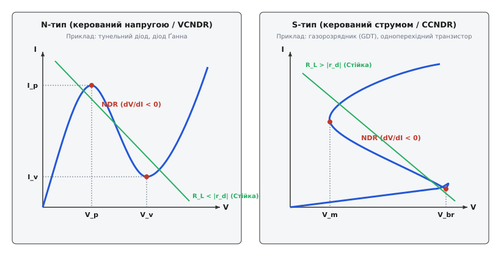
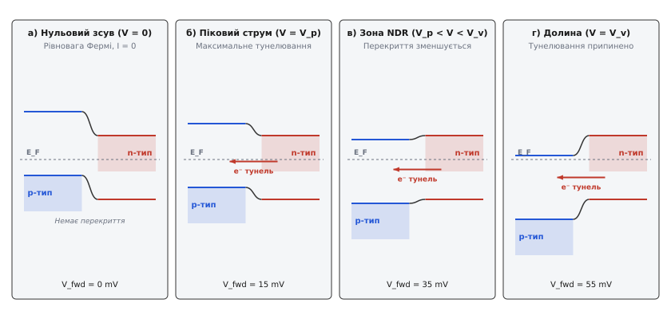
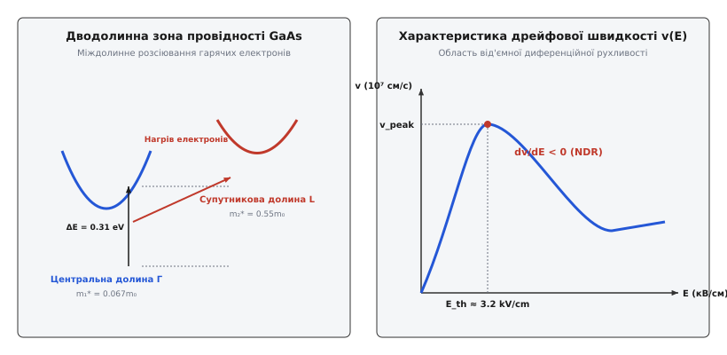
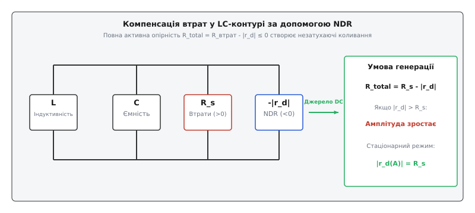
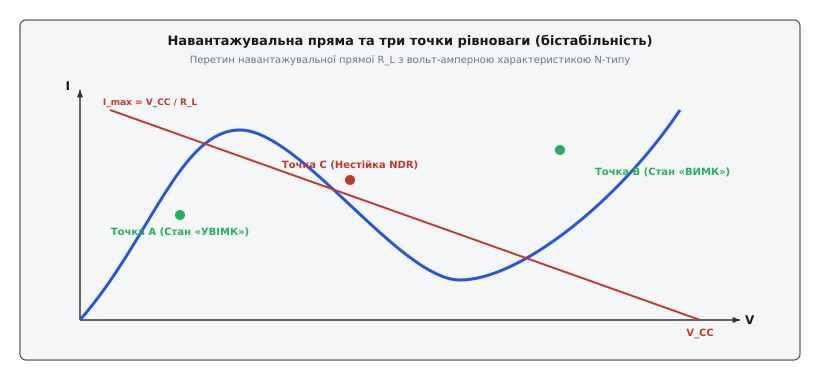

# Від'ємний диференційний опір

<preknowlist>
- [Закон Ома](topic:hw-analog/ohms-law) — пропорційність струму й напруги в лінійних провідниках.
- [Диференційний опір](topic:hw-analog/differential-resistance) — локальна похідна r_d = dV/dI у точці робочого режиму.
- [p-n перехід](topic:hw-components/diode-iv-curve) — бар'єрний потенціал та носії заряду в напівпровідниках.
</preknowlist>

Звичайне пасивне електричне коло підкоряється фундаментальному принципу розсіяння енергії: зростання різниці потенціалів між двома вузлами неухильно збільшує потік зарядів, що протікають між ними, а статичний опір `R = V / I` завжди залишається додатним числом. У такому колі електрична енергія джерела живлення безповоротно перетворюється на теплову енергію Джоуля за законом Ленца-Джоуля. Проте за певними фізичними умовами у напівпровідникових гетероструктурах, вакуумних приладах та іонізованій газовмісній плазмі виникає явище, яке на перший погляд суперечить повсякденному інженерному досвіду: при збільшенні напруги на приладі струм через нього не зростає, а спадає.

Це явище зветься **від'ємним диференційним опором** (Negative Differential Resistance, NDR). Воно не порушує першого та другого законів термодинаміки і не означає виникнення енергії з нічого. Повний статичний опір приладу `R = V / I` у будь-якому робочому стані залишається додатним, а сам прилад виступає активним конвертором: він споживає потужність постійного струму від зовнішнього джерела живлення і перетворює її на енергію незатухаючих високочастотних змінних електричних коливань.

Від'ємний диференційний опір є фізичною основою для створення надвисокочастотних автогенераторів мікрохвильового та терагерцового діапазонів, надшвидкодіючих цифрових тригерів, бістабільних комірок оперативної пам'яті, підсилювачів відбивального типу та приладів із наднизьким рівнем власних шумів.

---

## Механіка активної динаміки: чому струм падає при зростанні напруги

Щоб глибоко зрозуміти фізичну природу від'ємного диференційного опору, необхідно строго розмежувати два фізичних поняття — **статичний (омічний) опір** та **диференційний (динамічний) опір**.

Статичний опір `R_st` обчислюється як відношення повної напруги `V` до повного струму `I` у заданій точці вольт-амперної характеристики (ВАХ):

```
R_st = V / I
```

Для будь-якого пасивного або активного двополюсника у стаціонарному стані `R_st > 0`. Це означає, що результуючий напрямок руху носіїв заряду завжди збігається з напрямком векторного електричного поля, а прилад у цілому споживає від зовнішнього джерела живлення додатну постійну потужність:

```
P_dc = V · I > 0
```

Диференційний опір `r_d` являє собою локальну похідну та показує геометричний нахил дотичної до вольт-амперної характеристики у точці робочого режиму (точці спокою):

```
r_d = dV / dI = 1 / (dI / dV) = 1 / g_d
```

де `g_d = dI / dV` — диференційна провідність приладу.

У більшості класичних матеріалів збільшення напруги призводить до зростання дрейфової швидкості електронів або збільшення їхньої концентрації, що робить похідну `dI / dV > 0`. Проте якщо у внутрішній структурі речовини чи приладу діє механізм від'ємного зворотного зв'язку — коли зростання зовнішнього електричного поля викликає різке падіння рухливості електронів, їхнє міждолинне розсіювання, квантовий вихід носіїв із резонансного перекриття або утворення стримуючого об'ємного заряду — похідна стає від'ємною:

```
g_d = dI / dV < 0  ⇒  r_d = dV / dI < 0
```

Коли диференційний опір є від'ємним (`r_d < 0`), мала приросла зміна напруги `ΔV > 0` викликає від'ємний приріст струму `ΔI < 0`. З точки зору змінного сигналу мала сигнальна потужність `P_ac` стає від'ємною:

```
P_ac = ΔV · ΔI = r_d · (ΔI)² < 0
```

Від'ємний знак малосигнальної потужності свідчить про те, що для змінного сигналу заданої частоти прилад поводиться не як споживач (резистор), а як **джерело активної енергії змінного струму**. Він генерує змінну потужність за рахунок модуляції споживаного постійного струму і віддає її у зовнішнє коло, компенсуючи омічні втрати в реальних котушках індуктивності та конденсаторах.

Енергетичний баланс приладу з від'ємним опором описується виразом:

```
P_total = P_dc + P_ac = V₀·I₀ + ΔV·ΔI > 0
```

Оскільки амплітуди змінних складових `ΔV` та `ΔI` є малими порівняно з постійними значеннями `V₀` та `I₀`, сумарна споживана потужність `P_total` залишається додатною. Прилад не виступає вічним двигуном: він є активним нелінійним елементом, який перекачує енергію джерела постійної напруги у збудження електричних коливань.

ККД перетворення потужності постійного струму `P_dc` у високочастотну потужність змінного струму `P_rf` залежить від форми ВАХ та амплітуди коливань:

```
η_rf = P_rf / P_dc = (|P_ac|) / (V₀ · I₀)
```

Для тунельних діодів цей ККД зазвичай становить 5–10%, для діодів Ґанна — 3–5%, а для імпульсних лавинно-пролітних діодів може досягати 15–20%.

Детальніше про історичний шлях досліджень — від перших спостережень нестабільності дуги Айртон та «співаючої дуги» Дадделла до нобелівського квантового відкриття Есакі — описано у вставці [Історія відкриття від'ємного опору](topic:ph-condensed/negative-differential-resistance/hist-ndr-discovery.md).

---

## Двокласова топологія: N-тип проти S-типу

Залежно від геометричної форми вольт-амперної характеристики та принципу фізичного керування, усі прилади з від'ємним диференційним опором поділяються на два нееквівалентних класи: **N-тип** (керовані напругою) та **S-тип** (керовані струмом).


*Характеристики від'ємного диференційного опору: керований напругою N-тип (ліворуч) та керований струмом S-тип (праворуч).*

### 1. N-тип (Voltage-Controlled NDR / VCNDR)

Для приладів N-типу вольт-амперна характеристика є однозначною функцією напруги: для кожного значення напруги `V` існує єдине значення струму `I = f(V)`. Проте зворотна залежність `V(I)` у деякому інтервалі струмів є багатозначною (одному струму відповідають три значення напруги).

Ключові топологічні точки ВАХ N-типу:
- **Точка піку `(V_p, I_p)`:** Точка, у якій прямий струм досягає локального максимуму `I_p` при напрузі `V_p`. До цієї точки диференційний опір є додатним (`r_d > 0`).
- **Зона NDR (`V_p < V < V_v`):** Спадна ділянка ВАХ, де диференційний опір від'ємний (`r_d = dV/dI < 0`).
- **Точка долини `(V_v, I_v)`:** Точка локального мінімуму струму `I_v` при напрузі `V_v`. За цією точкою ВАХ знову стає зростаючою через класичні механізми теплової дифузії або надбар'єрного інжекування.
- **PVCR (Peak-to-Valley Current Ratio):** Безрозмірний коефіцієнт `PVCR = I_p / I_v`, який визначає динамічний діапазон та ефективність приладу.

Типові представники N-типу: тунельний діод Есакі, діод Ґанна, резонансно-тунельний діод (RTD), вакуумний динатрон Галла.

**Критерій стійкості для N-типу:** Оскільки характеристика `I(V)` є однозначною за напругою, прилад N-типу є стійким у точці спокою всередині зони NDR лише під час живлення від **джерела напруги з малим внутрішнім опором** `R_L`:

```
R_L < |r_d|
```

Якщо опір навантаження перевищує модуль від'ємного опору (`R_L > |r_d|`), робоча точка всередині зони NDR втрачає стійкість, і система самочинно перемикається в один із двох стійких станів поза зоною NDR (бістабільний режим) або переходить у режим автоколивань.

### 2. S-тип (Current-Controlled NDR / CCNDR)

Для приладів S-типу вольт-амперна характеристика є однозначною функцією струму: для кожного значення струму `I` існує єдине значення напруги `V = f(I)`. Залежність `I(V)` при цьому є багатозначною.

Ключові топологічні точки ВАХ S-типу:
- **Напруга пробою/перемикання (`V_br`):** Порогова напруга, при якій високовольтний низькострумовий стан втрачає стійкість.
- **Зона NDR:** Спадна ділянка, на якій зростання струму `I` супроводжується різким падінням напруги на приладі.
- **Напруга підтримки (`V_m`):** Низька напруга у високопровідному стані (`V_m << V_br`), що підтримується плазмою або насиченою інжекцією носіїв.

Типові представники S-типу: газорозрядники (GDT), одноперехідні транзистори (UJT), симистори та тиристори у режимі пробою, лавинні транзистори, халькогенідні склоподібні напівпровідники (ефект Овшинського в фазовій пам'яті PCM).

**Критерій стійкості для S-типу:** Прилад S-типу є стійким у точці спокою у зоні NDR лише при живленні від **джерела струму з великим внутрішнім опором** `R_L`:

```
R_L > |r_d|
```

Спроба підключити прилад S-типу безпосередньо до малоомного джерела напруги (`R_L < |r_d|`) викликає неконтрольований лавиноподібний стрибок струму, який призводить до теплового руйнування приладу.

З точки зору дуальності електричних кіл (Duality Principle), N-тип та S-тип є точними дуальними дзеркалами один одного: напруга та струм, індуктивність та ємність, коротке замикання та холостий хід міняються місцями у їхніх диференціальних рівняннях.

---

## Фізичні мікромеханізми виникнення від'ємного опору

Від'ємний диференційний опір не є властивістю одного конкретного матеріалу. Він виникає внаслідок фундаментальних квантовомеханічних, об'ємно-зонних та плазмових процесів у речовині.

### 1. Квантове тунелювання у вироджених напівпровідниках (Тунельний діод)

У класичному p-n переході з помірним рівнем легування висота потенціального бар'єру перешкоджає руху носіїв при зворотному та малих прямих зсувах. Проте якщо концентрацію донорних та акцепторних домішок в обох областях напівпровідника збільшити до екстремальних значень `10¹⁹–10²⁰ см⁻³` (вироджений напівпровідник), фізика контакту докорінно змінюється.

При такому рівні легування рівень Фермі `E_F` опускається нижче верху валентної зони в p-області та піднімається вище дна зони провідності в n-області. Збіднений шар p-n переходу скорочується до товщини:

```
W_dep = √ ( (2 · ε_s · (V_bi - V)) / (q · N*) ) < 10 нм
```

де `N* = (N_A · N_D) / (N_A + N_D)` — зведена концентрація домішок.

При такій малій товщині бар'єру ймовірність квантовомеханічного квазіпрозорого тунелювання електронів крізь заборонену зону описується квантовим коефіцієнтом прозорості за наближенням Вентцеля-Крамерса-Бріллюена (ВКБ):

```
T_tunnel ≈ exp( -4 · √(2 · m*) · E_g^(3/2) / (3 · q · ℏ · E_field) )
```

де `m*` — ефективна маса електрона, `E_g` — ширина забороненої зони, а `E_field` — напруженість поля у p-n переході.


*Енергетичні зони тунельного діода при зміні прямого зсуву від нуля до зони долиною.*

Еволюція енергетичних зон тунельного діода при зміні прямої напруги `V`:

1. **Нульовий зсув (`V = 0`):** Рівні Фермі p- та n-областей знаходяться на одній висоті. Квантові тунельні потоки електронів в обох напрямках зрівноважують один одного, результуючий струм дорівнює нулю (`I = 0`).
2. **Піковий струм (`V = V_p ≈ 50–70 мВ`):** Невеликий прямий зсув піднімає зону провідності n-області відносно p-області. Заповнені електронами стани дна зони провідності n-типу опиняються точно напроти порожніх валентних станів p-типу. Тунельний струм досягає абсолютного максимуму `I_p`.
3. **Область NDR (`V_p < V < V_v`):** З подальшим зростанням напруги зона провідності n-області піднімається ще вище. Кількість енергетично перекритих станів між заповненою зоною провідності та порожньою валентною зоною швидко зменшується. Електрони більше не мають куди тунелювати, і тунельний струм падає, незважаючи на зростання зовнішньої напруги!
4. **Точка долини (`V = V_v ≈ 350–400 мВ`):** Зони повністю розходяться, тунелювання припиняється. Струм досягає мінімуму `I_v`. За цією точкою починає домінувати звичайний тепловий надбар'єрний дифузійний струм p-n переходу.

Оскільки тунельний процес відбувається без зміни енергії електрона (пружне тунелювання) і не вимагає теплової затримки, швидкодія тунельного діода обмежена лише малою паразитною ємністю p-n переходу (`f_max > 100 ГГц`).

### 2. Міждолинне розсіювання та ефект Ґанна (Об'ємний від'ємний опір)

На відміну від тунельного діода, у діоді Ґанна від'ємний опір виникає не на межі p-n переходу, а в усьому об'ємі однорідного монокристала напівпровідника (наприклад, n-GaAs або n-InP). Цей ефект описується теорією Ридлі-Воткінса-Гілсума (RWH).

Зона провідності арсеніду галію має складну дводолинну структуру у k-просторі:
- **Центральна долина (долина `Г`):** Розташована в мінімумі енергії. Електрони в цій долині мають дуже малу ефективну масу `m₁* = 0.067 m₀` та надзвичайно високу рухливість `μ₁ ≈ 8000 см²/(В·с)`.
- **Супутникова долина (долина `L`):** Розташована на `ΔE = 0.31 еВ` вище за енергією. Електрони у цій долині мають велику ефективну масу `m₂* = 0.55 m₀` та низьку рухливість `μ₂ ≈ 180 см²/(В·с)`.


*Дводолинна структура провідності GaAs та залежність дрейфової швидкості електронів від електричного поля.*

При низьких напруженостях електричного поля (`E < E_th ≈ 3.2 кВ/см`) усі електрони знаходяться у центральній долині `Г`. Дрейфова швидкість `v = μ₁ · E` лінійно зростає з ростом поля, підкоряючись закону Ома.

Коли електричне поле перевищує порогове значення `E_th`, електрони інтенсивно прискорюються і набувають кінетичної енергії, достатньої для міждолинного розсіювання — переходять із центральної долини `Г` у супутникову долину `L`. Оскільки у верхній долині ефективна маса електрона зростає майже в 8 разів, а його рухливість падає у 40 разів, середня дрейфова швидкість усіх носіїв розрахунково падає від пікового значення `v_peak ≈ 2·10⁷ см/с` до насиченого значення `v_sat ≈ 1·10⁷ см/с`.

У результаті виникає **від'ємна диференційна рухливість** (Negative Differential Mobility, NDM):

```
dv_drift / dE < 0  ⇒  dJ / dE = e · n · (dv_drift / dE) < 0
```

Об'ємний від'ємний опір робить однорідний розподіл електричного поля нестійким. У кристалі виникають локальні згустки об'ємного заряду — **домени сильного електричного поля**, які зароджуються біля катода, рухаються вздовж кристала зі швидкістю дрейфу і зникають на аноді, генеруючи НВЧ-імпульси на частотах від 1 до 100 ГГц.

### 4. Наноструктури та квантові суперґратки Есакі-Цзу

У 1970 році Лео Есакі та Рафаель Цзу запропонували концепцію штучної напівпровідникової **суперґратки** — періодичної структури з ультратонких альтернативних шарів двох напівпровідників (наприклад, GaAs та AlGaAs) з товщинами шарів порядку 2–5 нанометрів. Період такої штучної ґратки `d_s` є значно більшим за постійну природної кристалічної ґратки `a_0`.

Внаслідок періодичного потенційного рельєфу стандартна зона провідності розщеплюється на вузькі квантовані **мінізони** (minibands), ширина яких `ΔE` становить десятки міліелектронвольт. Коли до такої суперґратки прикладається зовнішнє електричне поле `E`, електрон прискорюється у межах мінізони доти, доки його хвильовий вектор не досягає межі мінізони Бріллюена `k = π / d_s`.

При `k = π / d_s` відбувається бріллюенівське відбивання електрона від межі мінізони. Електрон починає здійснювати квантові **блохівські осциляції** у k-просторі з частотою:

```
ω_B = (q · E · d_s) / ℏ
```

Якщо час між розсіюваннями носіїв `τ_scat` перевищує період блохівських осциляцій (`ω_B · τ_scat > 1`), середня дрейфова швидкість електронів починає стрімко зменшуватися зі зростанням електричного поля:

```
v_drift(E) = (v_max · 2 · (E / E_c)) / (1 + (E / E_c)²)
```

де `E_c = ℏ / (q · d_s · τ_scat)` — критичне порогове поле блохівського розсіювання.

При перевищенні критичного поля `E > E_c` диференційна рухливість стає від'ємною (`dv_drift / dE < 0`), створюючи квантовий об'ємний від'ємний диференційний опір. Резонансно-тунельні діоди (RTD) та суперґратки є найшвидкодіючішими напівпровідниковими генераторами терагерцового діапазону (частоти від 300 ГГц до 1.5 ТГц).

---

## Математика стійкості, навантажувальна пряма та коливання

Для практичного використання від'ємного опору необхідно вміти аналізувати стійкість точок рівноваги у фазовому просторі та розраховувати умови генерації коливань.

### Компенсація втрат у LC-резонаторі

Будь-який реальний пасивний LC-контур володіє активними втратами на омічний опір дротів та діелектричні втрати конденсатора, які можна представити еквівалентним послідовним опором `R_s > 0`. Затухання коливань у такому контурі описується коефіцієнтом `α = R_s / (2·L)`.


*Компенсація омічних втрат резистора R_s у генераторі на базі елемента з від'ємним опором.*

Якщо послідовно з контуром включити елемент із від'ємним диференційним опором `-|r_d|`, результуючий опір кола стає рівним:

```
R_total = R_s - |r_d|
```

Розглянемо три можливі випадки:

1. **`|r_d| < R_s` (Неповна компенсація):** Повний опір залишається додатним (`R_total > 0`). Коливання у контурі залишаються затухаючими, але їхня добротність `Q` зростає. Цей режим використовується у регенеративних підсилювачах.
2. **`|r_d| = R_s` (Точна компенсація):** Повний опір дорівнює нулю (`R_total = 0`). Затухання зникає (`α = 0`), і в контурі виникають незатухаючі синусоїдальні коливання зі строго постійною амплітудою та частотою `ω₀ = 1 / √(L·C)`.
3. **`|r_d| > R_s` (Самозбудження):** Повний опір стає від'ємним (`R_total < 0`). Коефіцієнт затухання стає від'ємним, і амплітуда малих початкових флуктуацій починає експоненційно зростати за законом `e^(|α|·t)`. Зростання триває доти, доки нелінійність ВАХ не обмежить амплітуду на рівні стаціонарного граничного циклу.

Динаміка зростання коливань та формування граничного циклу Ван дер Поля аналітично описується диференціальним рівнянням:

```
d²v / dt² - ((1/R_n - 1/R_L) / C) · (1 - v² / V_sat²) · (dv / dt) + ω₀² · v = 0
```

Детальний алгебраїчний аналіз полюсів характеристичного рівняння та розв'язок рівняння Ван дер Поля наведено у вставці [Математичний аналіз стійкості NDR](topic:ph-condensed/negative-differential-resistance/math-ndr-stability.md).

### Аналіз навантажувальної прямої та бістабільність

Розглянемо коло, що складається з елемента N-типу, підключеного до джерела напруги `V_CC` через навантажувальний резистор `R_L`. Стан рівноваги графічно визначається перетином ВАХ приладу з навантажувальною прямою:

```
I = (V_CC - V) / R_L
```


*Навантажувальна пряма з трьома точками перетину: дві стійкі (A і B) та одна нестійка в зоні NDR (C).*

При виборі певних значень `V_CC` та `R_L` навантажувальна пряма перетинає N-подібну ВАХ у трьох точках:

- **Точка A (низька напруга, великий струм):** Розташована на першій зростаючій гілці ВАХ (`r_d > 0`). Система є асимптотично стійкою і перебуває у стані **«УВІМКНЕНО»** (низький опір).
- **Точка B (висока напруга, малий струм):** Розташована на другій зростаючій гілці ВАХ (`r_d > 0`). Система є асимптотично стійкою і перебуває у стані **«ВИМКНЕНО»** (високий опір).
- **Точка C (проміжна зона):** Розташована на спадній ділянці ВАХ у зоні NDR (`r_d < 0`). Математичний аналіз показує, що точка C є **сідловою точкою** у фазовому просторі та є абсолютна нестійкою. Найменше збурення примушує систему мгновенно перестрибнути у точку A або B.

Наявність двох стійких станів рівноваги (A і B) робить схему **бістабільним тригером**. Подача короткого позитивного імпульсу напруги переводить систему з точки A у точку B, а негативний імпульс повертає її назад. Це принципова основа надшвидкодіючих тунельних тригерів та статичної оперативної пам'яті (SRAM).

---

## Інженерне застосування та практичні пастки

Фізичні властивості від'ємного диференційного опору використовуються у багатьох галузях сучасної радіоелектроніки та обчислювальної техніки.

### Основні сфери застосування

1. **Генерація НВЧ та терагерцових коливань:** Діоди Ґанна та IMPATT-діоди є основними твердотільними джерелами сигналів для автомобільних радарів адаптивного круїз-контролю (77 ГГц), метеорологічних радарів, супутникових ліній зв'язку та військової системи локації.
2. **Низькошумові підсилювачі (Малошумні підсилювачі відбивального типу):** Рефлексні підсилювачі на тунельних діодах із циркулятором забезпечують коефіцієнт підсилення понад 15 дБ на частотах у десятки гігагерц при рівні власних шумів, порівнюваному з кріогенними параметрами.
3. **Захист від імпульсних перенапруг:** Газорозрядники (GDT) встановлюються на входах трансформаторних підстанцій, у мережевих фільтрах та вхідних каскадах базових станцій стільникового зв'язку для скидання багатокілоамперних імпульсів блискавки.
4. **Елементи квантової логіки та фазової пам'яті:** Резонансно-тунельні діоди (RTD) та прилади фазової пам'яті (PCM) на халькогенідних стеклах дозволяють створювати логічні елементи з частотою перемикання понад 100 ГГц.

Практичний приклад чисельного розрахунку автоколивань мовами Python, C та C++ з використанням методу Рунге-Кутти наведено у вставці [Симуляція автоколивального контуру](topic:ph-condensed/negative-differential-resistance/proj-ndr-oscillator.md).

Повний паспортний довідник параметрів, точних моделей та схем включення популярних компонентів міститься у вставці [Довідник приладів з від'ємним опором](topic:ph-condensed/negative-differential-resistance/api-ndr-devices-ref.md).

### Практичні пастки та способи їх усунення

> 🔧 **Навіщо це.** Знання типових інженерних дефектів при роботі з NDR-приладами дозволяє уникнути виходу компонентів з ладу та збоїв у роботі високочастотних схем.

1. **Паразитна низькочастотна генерація у колах живлення:**
   - *Проблема:* Під час проектування підсилювача на тунельному діоді діод замість підсилення НВЧ-сигналу самочинно генерує низькочастотні коливання (на частотах 1–10 МГц).
   - *Причина:* Дрібні паразитні індуктивності довгих провідників друкованої плати разом із блокувальними конденсаторами утворюють низькочастотний LC-контур. Оскільки умова `R_bias < |r_d|` виконана лише для постійного струму, на радіочастотах опір провідників зростає, і контур самозбуджується.
   - *Усунення:* Розміщення поверхнево-монтованих SMD-конденсаторів з мінімальним паразитим ESR у безпосередній близькості (менше 1 мм) від корпусу діода та використання послідовних чип-резисторів придушення.

2. **Тепловий шнурувальний пробій у приладах S-типу:**
   - *Проблема:* При випробуванні газорозрядника або симистора прилад миттєво руйнується з утворенням короткого замикання.
   - *Причина:* У зоні S-типу локальне підвищення струму спричиняє падіння напруги, що стимулює подальше зростання струму у цій же точці кристала (шнурування струму / Current Filamentation). Без зовнішнього обмеження струм зростає до катастрофічних значень.
   - *Усунення:* Послідовне включення струмообмежувального резистора або варистора, розрахованого на максимальний допустимий струм `I_max`.

3. **Деградація характеристик при температурному дрейфі:**
   - *Проблема:* При нагріванні корпусу діода Ґанна або тунельного діода генерація припиняється або зміщується за частотою.
   - *Причина:* Параметри `I_p`, `I_v` та `|r_d|` мають сильний температурний коефіцієнт. Зростання температури змінює ширину забороненої зони та рухливість електронів.
   - *Усунення:* Застосування термокомпенсованих джерел зміщення на базі прецизійних операційних підсилювачів та масивних теплоотводів.

---

## Синтез

Від'ємний диференційний опір являє собою глибокий приклад того, як нелінійні мікроскопічні механізми переносу носіїв заряду змінюють макроскопічні динамічні властивості електричного кола.

Незалежно від конкретної фізичної природи механізму — чи то квантове тунелювання електронів у тунельному діоді Есакі, міждолинний перенос гарячих носіїв у діоді Ґанна, лавинна іонізація у газорозряднику або дрейфова затримка у ЛПД — усі ці прилади об'єднуються єдиним математичним критерієм: локальною від'ємною похідною `dV / dI < 0`.

Уміння керувати цим явищем дозволяє компенсувати неминучі омічні втрати в реальних провідниках, перетворювати енергію постійного струму у високочастотні коливання та будувати надшвидкодіючі елементи обробки інформації, розсуваючи межі сучасної електродинаміки та мікроелектроніки.
