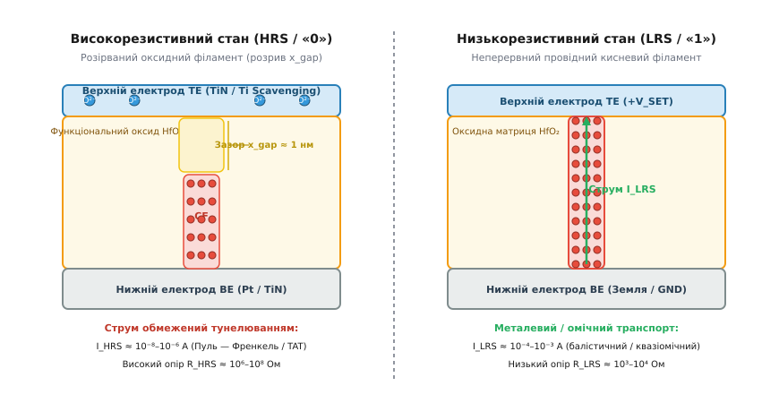
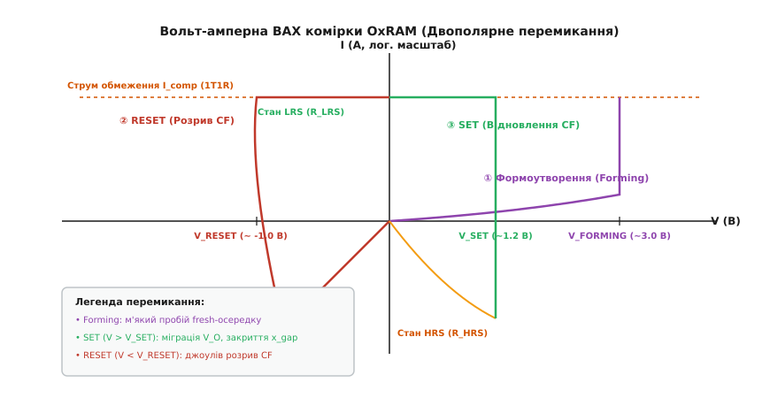
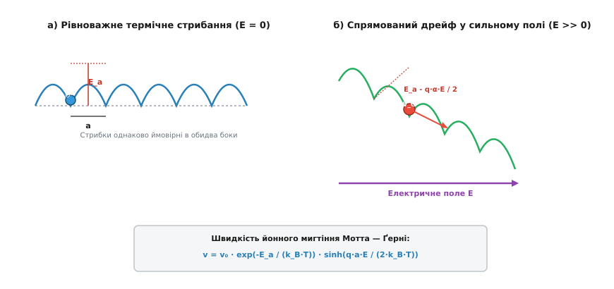
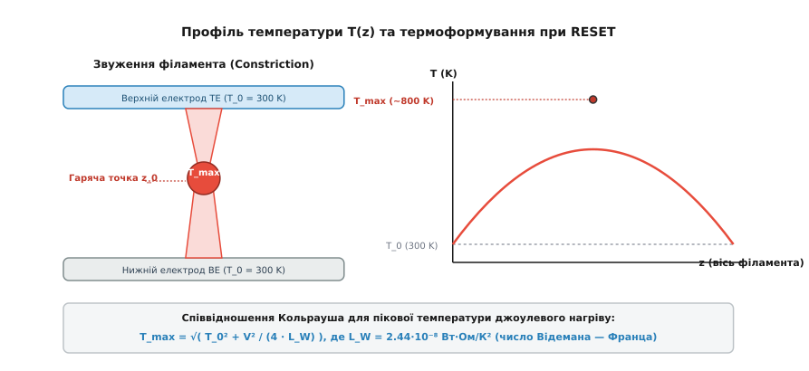

# Оксидна резистивна пам'ять (OxRAM / ReRAM): фізика кисневих вакансій та філаментарного перемикання

<preknowlist>
- [Зонна теорія твердого тіла](topic:ph-condensed/band-theory) — формування енергетичних зон, потенціальні бар'єри та розподіл електронних станів у діелектриках і напівпровідниках.
- [Іонні провідники](topic:ph-condensed/ionic-conductor) — термоактивований перенос іонів, потенціальний рельєф ґратки та йонна провідність під дією електричного поля.
- [Електроміграція](topic:ph-condensed/electromigration) — спрямований масоперенос атомів під дією електронного вітру та сильних електричних полів у твердих тілах.
</preknowlist>

Зменшення елементів енергонезалежної пам'яті типу Flash нижче 15 нанометрів наразилося на фундаментальні фізичні обмеження твердого тіла. У класичних комірках із плаваючим затвором або пасткою заряду кількість збережених електронів скоротилася до кількох десятків, через що випадкова втрата поодиноких носіїв через тунельні витоки призводить до втрати записаної інформації. Спроба витончити тунельний діелектрик діоксиду кремнію SiO₂ розганяла струми прямого квантового тунелювання, позбавляючи пристрій здатності тримати заряд роками.

Виходом із цієї фізичної кризи стало створення **оксидної резистивної пам'яті** (OxRAM / ReRAM, від англ. *Oxide Resistive Random-Access Memory*). Замість накопичення та утримання електричного заряду в ізольованому об'ємі, OxRAM кодує інформацію безпосередньо у вигляді **фазового або структурного опору** нанорозмірного шару діелектрика.

Фізична сутність роботи осередку OxRAM полягає у зворотній утворенні та деструкції тонкого провідного каналу — **кисневого філамента** (*filamentum* — нитка), сформованого точковими дефектами (вакансіями кисню). Історія відкриття та шлях від лабораторних спостережень до комерційних чипів висвітлені у вставці [історії відкриття та еволюції резистивного перемикання](topic:ph-condensed/oxram-cell-physics/hist-oxram-discovery.md).

```
        Планарний осередок Flash (Заряд):         MIM-осередок OxRAM (Філамент):
        ┌───────────────────────────────┐       ┌───────────────────────────────┐
        │  Керувальний затвор (CG)      │       │  Верхній електрод TE (TiN/Ti) │
        ├───────────────────────────────┤       ├───────────────────────────────┤
        │  Пастка заряду (Si₃N₄ / FG)   │       │                               │
        │    - - - (електрони e⁻) - - - │       │  Оксид (HfO₂) [ V_O  V_O ]    │
        ├───────────────────────────────┤       │                [  CF  ]       │
        │  Тунельний SiO₂ (< 6 нм)     │       ├───────────────────────────────┤
        ├───────────────────────────────┤       │  Нижній електрод BE (Pt/TiN)  │
        │  Кремнієвий канал p-Si        │       └───────────────────────────────┘
        └───────────────────────────────┘
```

## 1. Дефектна фізика оксидів та утворення кисневих вакансій

Фундаментальною основою OxRAM є фізика нестехіометричних оксидів перехідних металів, зокрема діоксиду гафнію HfO₂, оксиду танталу Ta₂O₅, діоксиду титану TiO₂ та оксиду вольфраму WO₃.

У ідеальному стехіометричному кристалі HfO₂ кожен атом гафнію зв'язаний із двома атомами кисню, утворюючи широкий заборонений енергетичний інтервал `E_g ≈ 5.6` еВ. Такий матеріал є високоякісним діелектриком із питомим опором `ρ > 10¹⁴` Ом·см. Однак під час осадження тонких плівок (методом атомарно-шарового осадження ALD) або під дією сильного електричного поля у гратці утворюються точкові дефекти — **кисневі вакансії** (*vacantia* — порожнеча).

У нотації Крьогера — Вінка процес утворення френкелівської пари (вакансії кисню та іона кисню) описується рівнянням:

```
O_O^x  ⇄  V_O** + O²⁻
```

де `O_O^x` — атом кисню у нормальному вузлі кристалічної ґратки, `V_O**` — подвійно позитивно заряджена киснева вакансія (вузол, позбавлений негативного іона `O²⁻`), `O²⁻` — міжвузловий іон кисню.

```
       Ідеальна ґратка HfO₂:                 Дефектна ґратка HfO₂-x (з V_O):
       Hf⁴⁺ ─── O²⁻ ─── Hf⁴⁺                 Hf⁴⁺ ─── O²⁻ ─── Hf⁴⁺
        │        │        │                   │        │        │
       O²⁻ ─── Hf⁴⁺ ─── O²⁻                  O²⁻ ─── [V_O**] ── O²⁻  ◄── Вакансія
        │        │        │                   │        │        │
       Hf⁴⁺ ─── O²⁻ ─── Hf⁴⁺                 Hf⁴⁺ ─── O²⁻ ─── Hf⁴⁺
```

Вилучення негативного іона кисню `O²⁻` залишає у локальній області два електрони, які раніше брали участь у ковалентному/іонному зв'язку. Ці електрони локалізуються на незаповнених `d`-орбіталях сусідніх катіонів гафнію Hf⁴⁺, відновлюючи їх до стану Hf³⁺ або Hf²⁺.

З точки зору зонної теорії, самотня киснева вакансія створює глибокий локалізований дефектний рівень у забороненій зоні оксиду на відстані `1.1 – 1.2` еВ нижче дна зони провідності `E_c`. Якщо концентрація вакансій у вузькому каналі перевищує критичний поріг перколяції (`n_v > 10²¹` см⁻³), хвильові функції сусідніх дефектних станів починають перекриватися.

Це перекриття розщеплює дискретні рівні у вузьку **дефектну субоблоку** (sub-band), яка приєднується до зони провідності `E_c`. У результаті локальний питомий опір речовини у каналі падає на 8–10 порядків, перетворюючи діелектрик на провідний напівметал або субоксид `HfO₂-x`.

Енергетичний рельєф утворення вакансій залежить від локальної кристалографічної фази HfO₂. У моноклінній фазі (m-HfO₂) енергія утворення нейтральної кисневої вакансії становить `E_f ≈ 6.4` еВ, тоді як у тетрагональній (t-HfO₂) або аморфній фазі вона знижується до `E_f ≈ 5.2 – 5.8` еВ. Саме тому аморфні та нанокристалічні плівки оксиду гафнію є більш сприятливими для формування провідних філаментів при низьких напругах.

Для порівняння, у оксиді танталу Ta₂O₅ процес дефектоутворення за Крьогером — Вінком супроводжується формуванням субоксидних фаз `TaO_x`:

```
Ta₂O₅  ⇄  2 · TaO₂ + (1 / 2) · O₂(g)
```

Енергія утворення вакансії у Ta₂O₅ становить `E_f ≈ 5.2` еВ, а бар'єр міграції `E_a ≈ 0.9` еВ, що забезпечує стабільність філамента при вищих температурах.

Важливу роль у стабілізації вакансій відіграє шар верхнього електрода-поглинач (*scavenging layer*), зазвичай виготовлений із титану (Ti) або танталу (Ta). Титан володіє вищою хімічною спорідненістю до кисню, ніж гафній:

```
HfO₂ + x · Ti  ⇄  HfO₂-x + x · TiO_x
```

Шар титану товщиною 3–5 нм витягує іони кисню з поверхневого шару HfO₂, створюючи аморфний перехідний шар `TiO_x` і залишаючи високу початкову концентрацію кисневих вакансій `V_O`. Це виконує три фундаментальні функції:
- Знижує напругу первинного формоутворення з 6–8 В до комфортних 2.5–3.0 В;
- Фіксує розташування вершини провідного філамента біля межі з Ti, стабілізуючи геометрію зазору `x_gap`;
- Створює кисневий резервуар, необхідний для зворотного процесу рекомбінації під час операції RESET.

## 2. Процес формоутворення (Forming) та перколяція

Свежо виготовлений осередок OxRAM (стан *fresh*) знаходиться у початковому високорезистивному стані з опором `R > 10⁸` Ом. Для включення пристрою в робочий режим необхідно провести первинну технологічну операцію — **формоутворення** (*forming*).

Формоутворення являє собою м'який, керований пробій оксидного діелектрика під дією високого електричного поля `E_form ≈ 5 – 10` МВ/см.

```
       Формоутворення (Forming):               Формування філамента (Percolation):
       
       TE (TiN / Ti)  [ +V_FORMING ]           TE (TiN / Ti)  [ +V_FORMING ]
       ──────────────────────────────          ──────────────────────────────
       │  o   o   o   o  (O²⁻)      │          │  O²⁻  O²⁻  O²⁻ (у шарі Ti)   │
       │    E-поле 🠗                │ ───────► │       \                     │
       │  ●   ●   ●   ●  (V_O** )   │          │        ●  ●  ● (CF)         │
       ──────────────────────────────          ──────────────────────────────
       BE (Pt / TiN)  [ GND ]                  BE (Pt / TiN)  [ GND ]
```

Під час прикладання до верхнього електрода позитивного потенціалу `V_forming` (близько 2.5–3.5 В) у шарі оксиду створюється надсильне поле. Під дією цього поля відбувається п'ять послідовних фізико-хімічних етапів:
1. **Генерація дефектів покроковим розривом зв'язків:** Електричне поле напруженістю `E > 5` МВ/см розтягує та розриває зв'язки Hf-O, виштовхуючи іони кисню `O²⁻` з вузлів ґратки й генеруючи нові вакансії `V_O**`;
2. **Анодний дрейф іонів кисню:** Негативно заряджені іони `O²⁻` дрейфують угору, до позитивно зарядженого верхнього електрода (TE), де захоплюються шаром-поглиначем Ti. Позитивно заряджені вакансії `V_O**` дрейфують до нижнього електрода (BE);
3. **Зародження конуса вакансій на катоді:** На межі з нижнім електродом (BE) накопичуються перші кисневі вакансії, створюючи локальний виступ — викривлення електричного поля (*field enhancement factor*). На кінчику цього виступу напруженість поля зростає в кілька разів;
4. **Лавиноподібна перколяція та кластеризація:** Локальне посилення поля прискорює міграцію наступних вакансій саме до кінчика зародка (позитивний зворотний зв'язок). Вакансії з'єднуються у неперервний мікроскопічний ланцюжок — **провідний філамент** (CF), що перетинає всю товщину діелектрика;
5. **Теплове насичення діаметра:** Густина струму у новоутвореному каналі створює локальний джоулів нагрів, який стабілізує радіус філамента `r_CF` на рівні кількох нанометрів.


*Мікроскопічна будова осередку OxRAM (MIM). Ліворуч: високорезистивний стан (HRS) із розірваним оксидним зазором x_gap біля верхнього електрода. Праворуч: низькорезистивний стан (LRS) із неперервним провідним філаментом із кисневих вакансій V_O.*

Якщо струм під час формоутворення нічим не обмежувати, перколяційний пробій миттєво перейде у жорсткий термічний пробій: струм зросте до міліамперів, джоулеве тепло розплавить діелектрик, і осередок незворотно коротко замкнеться.

Критичним ризиком при пробої є також швидкий розряд паразитичної ємності бітової лінії (`C_BL ≈ 100` фФ). При різкому падінні опору осередку накопичений заряд `Q = C_BL · V_form` розряджається крізь нанофіламент за кілька пікосекунд, створюючи короткочасний пік струму overshoot `I_peak >> I_comp`. Для придушення цього ефекту транзистор селектора розміщують у безпосередній близькості до MIM-структури, мінімізуючи паразитичну індуктивність та ємність міжз'єднань.

Щоб відвернути необоротне руйнування, осередок OxRAM завжди вмикають у конфігурації **1T1R** (один транзистор — один резистор). Затвор керувального MOSFET-транзистора встановлює жорстке обмеження струму — **струм відповідності** (*compliance current*, `I_comp ≈ 50 – 150` мкА).

```
I_comp = (1 / 2) · μ_n · C_ox · (W / L) · (V_WL - V_th)²
```

Як тільки струм у колі досягає значення `I_comp`, транзистор переходить у режим насичення, фіксуючи струм і скидаючи залишок напруги з оксидного осередку. Саме величина `I_comp` визначає кінцевий геометричний радіус філамента `r_CF` (зазвичай від 2 до 8 нанометрів) та його підсумковий опір у провідному стані `R_LRS`.

Крім того, струм `I_comp` запобігає переповненню шару-поглинача Ti надлишковими іонами кисню, зберігаючи оборотність хімічних реакцій на межі розділу.

## 3. Кінетика перемикання SET та RESET: іонний дрейф та термоформування

Після первинного формоутворення осередок OxRAM здатний багаторазово (понад `10⁶ – 10⁸` разів) перемикатися між низькорезистивним станом (LRS, стан «1») та високорезистивним станом (HRS, стан «0»).

Перемикання відбувається шляхом локального закриття або відкриття нанорозмірного оксидного зазору `x_gap` біля вершини філамента.


*Типова вольт-амперна характеристика двополярного перемикання OxRAM у напівлогарифмічному масштабі. Послідовність процесів: ① Формоутворення (Forming) з обмеженням I_comp ──> ② Скидання опору (RESET) при від'ємній напрузі ──> ③ Встановлення опору (SET) при позитивній напрузі.*

### А. Процес встановлення (SET: HRS ──> LRS):

Операція SET полягає у відновленні цілісності розірваного філамента. На верхній електрод подається позитивний імпульс напруги `V_SET` (близько +1.0…+1.5 В).

Оскільки у стані HRS опір оксидного зазору `x_gap ≈ 1` нм є дуже високим, майже вся прикладна напруга `V_SET` падає безпосередньо на цьому крихітному проміжку. Напруженість поля досягає надвисоких значень `E_gap = V_SET / x_gap ≈ 10` МВ/см.

Прискорений йонний дрейф вакансій описується **моделлю Мотта — Ґерні** для термоактивованого стрибання крізь знижений потенціальний бар'єр:

```
v_drift = 2 · a · ν₀ · exp(-E_a / (k_B · T)) · sinh(q · a · E_gap / (2 · k_B · T))
```

де `a` — постійна ґратки (`a ≈ 0.3` нм), `ν₀` — фононна частота (`~ 10¹³` Гц), `E_a` — енергія активації міграції вакансії (`~ 0.85` еВ), `q = 2e` — заряд вакансії.


*Потенціальний енергетичний рельєф міграції вакансій кисню. а) Рівноважне термічне стрибання без електричного поля (E = 0) із симетричним бар'єром E_a. б) Нахил рельєфу та експоненційне зниження бар'єра у сильному електричному полі (E >> 0).*

Сильне поле нахиляє потенціальний рельєф, знижуючи бар'єр у напрямку поля на величину `ΔE = q · a · E / 2`. Вакансії кисню `V_O**` з високою швидкістю дрейфують у зазор, добудовуючи філамент до контакту з верхнім електродом. Опір комірки стрибкоподібно падає від `R_HRS ≈ 1` МОм до `R_LRS ≈ 10` кОм. Струм знову фіксується селектором на рівні `I_comp`.

Детальний аналіз швидкості закриття зазору показує експоненційну позитивну зворотну залежність: у міру звуження зазору `x_gap` поле `E_gap = V / x_gap` зростає, що прискорює дрейф вакансій на остаточних 0.3 нм за час менше 100 пікосекунд.

### Б. Процес скидання (RESET: LRS ──> HRS):

Операція RESET полягає у термоелектричному розриві провідного звуження філамента. На верхній електрод подається напруга протилежної полярності `V_RESET` (близько -0.8…-1.2 В).

У стані LRS неперервний філамент володіє низьким опором, тому крізь нього тече високий струм `I_reset ≈ 100 – 200` мкА. Через малу площу поперечного перерізу звуження (`r_CF ≈ 2 – 4` нм) густина струму досягає екстремальних значень `J ≈ 10⁸` А/см². Це викликає інтенсивний **джоулів нагрів** вузької шийки філамента.

Температура у найвужчому місці (гарячій точці) швидко зростає до `T_max ≈ 600 – 900` К. Нагрівання запускає два синергетичних механізми деструкції:
1. **Термічна дифузія та рекомбінація:** Підвищена температура експоненційно збільшує коефіцієнт дифузії іонів кисню `D_O = D_0 · exp(-E_d / (k_B · T_max))`. Іони кисню `O²⁻`, що зберігалися у шарі-поглиначі Ti, вивільняються і під дією від'ємного поля дрейфують назад у філамент;
2. **Термохімічне розчинення:** Взаємодія іонів `O²⁻` з вакансіями `V_O**` окиснює металізований субоксид `HfO₂-x` назад до діелектричного `HfO₂`.

У результаті найгарячіший ділянка філамента розчиняється, відновлюючи діелектричний зазор товщиною `x_gap ≈ 0.5 – 1.5` нм. Опір осередку стрибком повертається до високорезистивного стану `R_HRS`.

Важливо зазначити відмінність між двополярним (*bipolar*) та однополярним (*unipolar*) перемиканням. У двополярному режимі (характерному для HfO₂/Ti) операція RESET обов'язково вимагає зміни полярності напруги, оскільки електричне поле допомагає втягувати іони кисню з погливача назад у канал. В однополярному режимі (наприклад, у NiO) RESET відбувається при тій самій полярності, що й SET, але при вищому струмі, спираючись виключно на термічне розплавлення каналу. Двополярне перемикання є значно надійнішим і потребує меншої енергії.

Аналітичні рівняння кінетики росту зазору, виведення швидкостей Мотта — Ґерні та математичні моделі тунельного струму викладені у вставці [математичної кінетики росту та деструкції кисневого філамента](topic:ph-condensed/oxram-cell-physics/math-filament-kinetics.md).

Практичний алгоритм чисельного розв'язання цих диференціальних рівнянь та програмний симулятор ВАХ 1T1R осередку наведено у вставці [чисельного моделювання ВАХ та кінетики філамента](topic:ph-condensed/oxram-cell-physics/proj-oxram-filament-sim.md).

## 4. Механізми переносу заряду у станах LRS та HRS та джоулів нагрів

Фізична природа електричного струму в осередку OxRAM принципово різниться залежно від того, у якому стані перебуває кисневий філамент.

### А. Електроперенос у низькорезистивному стані (LRS):

У стані LRS філамент являє собою неперервний стержень субоксиду `HfO₂-x` із високою концентрацією кисневих вакансій. Оскільки дефектні рівні вакансій утворюють суцільну зона провідності, провідність має металевий або квазіметалевий характер.

Експериментальною ознакою металевої провідності LRS є температурна залежність опору: при підвищенні температури опір `R_LRS` злегка зростає через розсіяння електронів на фононах ґратки:

```
R_LRS(T) = R_0 · [1 + α_T · (T - T_0)]
```

де `α_T ≈ 10⁻³` K⁻¹ — температурний коефіцієнт опору.


*Розподіл температури T(z) уздовж провідного філамента під час операції RESET. Локалізація струму у найвужчій шийці створює гарячу точку z_0 з піковою температурою T_max, розрахованою за співвідношенням Кольрауша.*

Коли діаметр філамента звужується до кількох атомних радіусів (`r_CF ≈ λ_F`), квантово-механічний перенос описується **моделлю квантового точкового контакту (QPC)** Ландауера:

```
G = (2 · e² / h) · ∑ T_i
```

де `2e² / h ≈ (12.9 кОм)⁻¹` — квант провідності `G₀`, `T_i` — коефіцієнт проходження `i`-ї електронної моди. Значення провідності у стані LRS дискретизуються поблизу цілих кратних `1 G₀`, `2 G₀`, що підтверджує нанорозмірну атомарну структуру каналу.

### Б. Електроперенос у високорезистивному стані (HRS):

У стані HRS наявний діелектричний зазор `x_gap` товщиною 0.5–2.0 нм. Перенос електронів крізь цей ізолюючий бар'єр контролюється двома основними механізмами:

1. **Пряме квантове тунелювання (Direct Tunneling):**
   При тонкому зазорі (`x_gap < 1.2` нм) електрони тунелюють крізь прямокутний потенціальний бар'єр HfO₂. Струм описується рівнянням Симмонса і залежить експоненційно від товщини зазору: `I ∝ exp(-A · x_gap)`;
2. **Термоелектронна емісія Пуля — Френкеля (Poole-Frenkel Emission):**
   При більших зазорах або підвищених температурах електрони переміщуються шляхом термічного вивільнення з ізольованих вакансій `V_O*` у зону провідності під дією сильного поля.

Густина струму Пуля — Френкеля описується виразом:

```
J_PF = C · E · exp(-(q · Φ_t - q · √(q · E / (π · ε_r · ε₀))) / (k_B · T))
```

де `Φ_t` — глибина пастки (`~ 1.1` еВ), `ε_r` — оптична діелектрична проникність HfO₂ (`ε_r ≈ 4`).

### В. Термодинаміка нагріву та співвідношення Кольрауша:

Для розрахунку пікової температури `T_max` у звуженні філамента застосовується **співвідношення Кольрауша**, що зв'язує максимальну температуру в гарячій точці з падінням напруги `V` за законом Відемана — Франца:

```
T_max = √( T_0² + V² / (4 · L_W) )
```

де `T_0 = 300` К — температура контактних електродів, `L_W = 2.44 · 10⁻⁸` Вт·Ом/К² — число Відемана — Франца.

При напрузі RESET `V = 0.8` В співвідношення Кольрауша дає локальний нагрів `T_max ≈ 860` К (`~ 590` °C). Саме цей локалізований термоформувальний спалах забезпечує надшвидкий розрив філамента без перегріву сусідніх транзисторів мікросхеми.

Теплова енергія ефективно відводиться крізь масивні металеві електроди (TE та BE), які слугують термодинамічними стоками. Завдяки малій теплоємності нанофіламента охолодження після вимкнення імпульсу RESET відбувається за час менше 1 наносекунди, заморожуючи розірваний стан `x_gap`.

## 5. Порівняльний аналіз матеріальних систем: HfOx проти TaOx

Хоча фізичний принцип формування кисневих філаментів є спільним для всіх бінарних оксидів, вибір конкретного матеріалу діелектрика визначає ключові експлуатаційні параметри осередку пам'яті.

```
       Структура двошарової осередку TaOx ReRAM:
       ┌──────────────────────────────────────────┐
       │  Верхній електрод (TiN)                  │
       ├──────────────────────────────────────────┤
       │  Стехіометричний реакційний шар Ta₂O₅   │ ◄── Зона розриву x_gap
       ├ - - - - - - - - - - - - - - - - - - - - -┤
       │  Збіднений базовий шар TaO_x (Субоксид)  │ ◄── Резервуар вакансій
       ├──────────────────────────────────────────┤
       │  Нижній електрод (Pt або TiN)            │
       └──────────────────────────────────────────┘
```

### А. Системи на основі діоксиду гафнію (HfO₂ / Ti):
- **Переваги:** Повна сумісність із масовим CMOS-процесом (High-k gate stacks), надшвидкісне перемикання (`< 1` нс), низькі напруги SET/RESET (`~ 1` В), масштабованість до розмірів менше 5 нм;
- **Недоліки:** Вищий рівень статистичного розкиду опору від циклу до циклу (*cycle-to-cycle variability*) через стохастичний розвиток поодинокого філамента.

### Б. Двошарові системи на основі оксиду танталу (Ta₂O₅ / TaO_x):
- **Переваги:** Рекордна циклічна ресурсомісткість (*endurance* `> 10¹²` циклів). Використання двошарової структури (стехіометричний `Ta₂O₅` поверх субоксиду `TaO_x`) створює стабільну саморегульовану фазову межу. Під час RESET філамент не розчиняється повністю, а лише витончується у твердій фазі субоксиду, що запобігає аморфній кристалізації;
- **Недоліки:** Складніший процес осадження двошарового оксидного стека з точним контролем стехіометрії `x`.

Повний фізичний та технологічний паспорт оксидних матеріалів, електричні параметри 1T1R комірок та режими багатобітового програмування (MLC / Analog ReRAM) наведено у вставці [фізико-хімічного та технологічного паспорта матеріалів OxRAM](topic:ph-condensed/oxram-cell-physics/api-oxram-switching-params.md).

## 6. Механізми деградації та фізика надійності OxRAM

Для практичного застосування у мікроконтролерах та нейроморфних процесорах осередки OxRAM повинні гарантувати стабільність характеристик протягом тривалого часу. Надійність обмежується трьома основними деградаційними ефектами.

### 1. Термічна втрата ретеншну (Retention Loss):
Збереження стану HRS та LRS визначається термодинамічною стабільністю зазору `x_gap` та провідного філамента. При підвищених температурах навколишнього середовища (`T > 125` °C) кисневі вакансії у стані LRS піддаються радіальній термічній дифузії в об'єм оксидної матриці.

Швидкість радіального витончення філамента радіусом `r_CF` описується рівнянням дифузії Фіка:

```
∂n_v / ∂t = D_v · [ (1 / r) · ∂/∂r (r · ∂n_v / ∂r) ]
```

де `D_v = D_0 · exp(-E_a / (k_B · T))` — коефіцієнт дифузії вакансій. Якщо енергія активації дифузії `E_a` є занадто мала (`< 0.7` еВ), осередок у стані LRS мимовільно втрачає провідність і переходить у HRS за кілька місяців роботи при підвищеній температурі.

### 2. Втома від циклювання (Endurance Degradation):
При виконанні мільйонів циклів SET/RESET високе електричне поле та джоулів нагрів викликають накопичення бічних дефектів у діелектрику навколо основного філамента.

Це призводить до формування декількох конкуруючих провідних гілок (паразитичних філаментів). При операції RESET струм розподіляється між кількома гілками, густина струму у кожній із них падає, і джоулевого нагріву стає недостатньо для повного розриву зазору. Вікно опору `R_HRS / R_LRS` звужується, що зрештою призводить до відмови осередку у стані LRS (stuck-at-LRS failure).

### 3. Дилема «Напруга — Час» (Voltage-Time Dilemma):
Фундаментальною вимогою до пам'яті є поєднання надшвидкого запису (наносекунди при `V_SET ≈ 1` В) та тривалого зберігання стан у режимі очікування (10 років при `V_read ≈ 0.1` В).

Це можливе завдяки експоненційній залежності швидкості дрейфу Мотта — Ґерні від електричного поля `v ∝ sinh(q · a · E / (2 · k_B · T))`. При падінні напруги в 10 разів (від 1.0 В до 0.1 В) швидкість дрейфу вакансій зменшується більш ніж на 12 порядків, що гарантує бездеструктивне зчитування стану роками.

## 7. Архітектури 3D ReRAM та нейроморфні обчислення у пам'яті (In-Memory Computing)

Розвиток технології OxRAM виходить далеко за межі заміни класичної плоскої пам'яті NOR Flash. Завдяки двополюсній MIM-структурі та низькому температурному бюджету осадження (< 400 °C у процесі BEOL), OxRAM є головним кандидатом для створення тривимірних високоелементних масивів пам'яті та аналогових обчислювальних схем ШІ.

```
       Вертикальний стек 3D Crossbar ReRAM:
       
       Word Line 2 (WL2) ═════════════════════════════
                                   │ [1S1R Cell]
       Bit Line 1 (BL1)  ──────────┼──────────────────
                                   │ [1S1R Cell]
       Word Line 1 (WL1) ═════════════════════════════
```

### А. Архітектура 3D Crossbar та селектори (1S1R):
Для створення тривимірних масивів пам'яті комірки OxRAM розміщують у перетинах горизонтальних та вертикальних металевих шин (Crossbar). Щоб усунути паразитичні струми витоку (*sneak paths*) крізь неактивні сусідні комірки у великій матриці, послідовно з кожним OxRAM резистором інтегрують нанорозмірний селектор **1S1R** (1 Selector 1 Resistor).

Як селектор найчастіше використовується пристрій на основі овоїдного порогового перемикання (OTS — *Ovonic Threshold Switch*) на базі халькогенідів (Ge-Se-Sb). OTS показує різкий нелінійний стрибок провідності на 5 порядків при перевищенні порогової напруги `V_th`, блокуючи струми витоку при `V < V_th / 2`.

### Б. Нейроморфне обчислення у пам'яті (In-Memory Computing):
У класичній архітектурі фон Неймана передача вагових коефіцієнтів нейромережі між процесором та DRAM споживає понад 80% енергії при виконанні алгоритмів штучного інтелекту.

Завдяки здатності регулювати провідність `G` філамента зміною струму `I_comp` або тривалості pulse width, комірка OxRAM діє як фізичний аналог біологічного синапсу. У перехресній матриці OxRAM вектор вхідних напруг `V_in` подається на рядки, а вихідний струм на стовпцях розраховується автоматично за законом Ома та першим законом Кірхгофа:

```
I_out,j = ∑ (V_in,i · G_ij)
```

Операція множення матриці на вектор (GEMM) виконується за один фізичний такт без переміщення даних по шині, що знижує питоме енергоспоживання обчислень ШІ до рекордних величин `< 10` фемтоджоулів на операцію (fJ/OP).

Завдяки атомарному масштабу філаментарного перемикання, сумісності з CMOS-процесом BEOL та низькому енергоспоживанню, оксидна резистивна пам'яті є одним із найперспективніших кандидатів на роль універсальної енергонезалежної пам'яті та основи для обчислень штучного інтелекту у наступному десятилітті.
