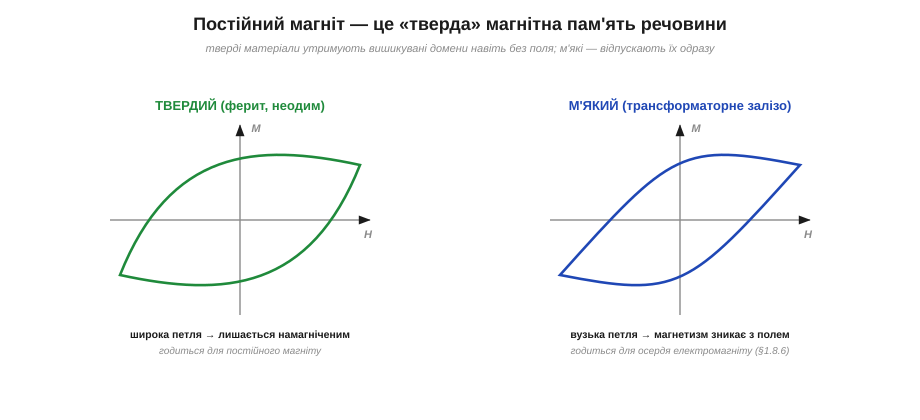
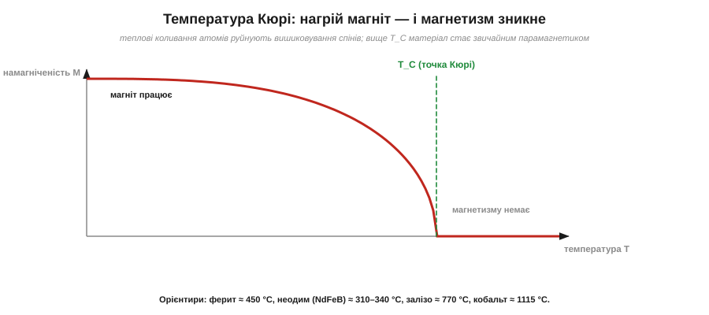
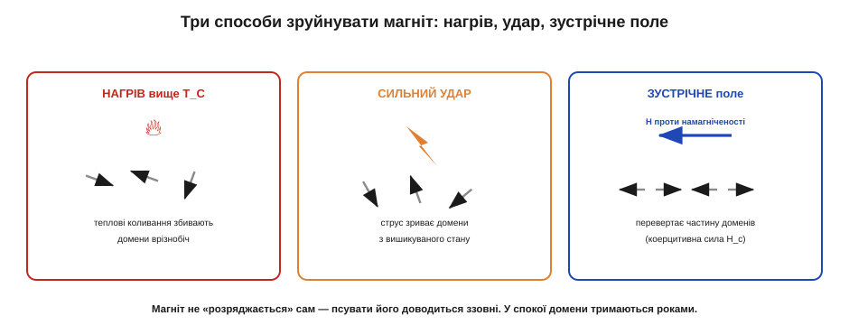

# Постійні магніти: ферит і неодим

У феромагнетику залізо намагнічується тим, що його [магнітні домени](root:ph-condensed/ferromagnetism) вишиковуються вздовж зовнішнього поля. Але тут постає природне питання, яке інтуїтивно бентежить кожного: чому **постійний магніт** залишається магнітом? Адже електрична батарейка з часом «сідає», заряджене тіло поступово втрачає заряд у вологе повітря — а магніт на дверцятах холодильника висить роками й тримає так само міцно, нібито нічого не «витрачає». Звідки він бере силу й чому не «розряджається»? І якщо магнетизм усе ж можна зруйнувати, то як саме? Ці питання ведуть нас до інженерно найважливіших магнітних матеріалів — фериту й неодиму.

### Магніт нічого не «витрачає»

Перше, що варто чітко зрозуміти: проводити аналогію між магнітом і батарейкою — **хибно**. Батарейка віддає енергію, бо в ній іде хімічна реакція, що поступово вичерпує реагенти. Магніт же, просто **лежачи** й тримаючи цвях, **не виконує роботи** й **не витрачає енергії** взагалі. Поле магніту утримує цвях статично — так само, як полиця тримає на собі книжку, не витрачаючи «запасу». Робота виконується лише тоді, коли щось **рухається**; нерухоме поле енергії не споживає.

А сам магнетизм постійного магніту — це **[вишикуваність доменів](root:ph-condensed/ferromagnetism)**. Усі (чи майже всі) домени дивляться в один бік і так і лишаються. Питання тоді переформулюється: чому домени не розсипаються самі собою назад у хаос, як це сталося б у парамагнетику? Відповідь у тому, що постійні магніти роблять зі спеціальних — **«твердих»** — магнітних матеріалів.

Тут варто розвіяти ще одну поширену помилку. Дехто уявляє, ніби магніт «притягає» завдяки якійсь силі, що неухильно вичерпується від роботи. Але робота виконується, лише коли точка прикладання сили **рухається**. Магніт, що тримає цвях нерухомо, роботи не виконує — як не виконує її гак, на якому висить вантаж. Енергію магніт віддає тільки в **момент притягання**, коли цвях летить до нього й набирає швидкості, — але цю енергію магніт не «створює з себе», а лише вивільняє з потенціальної енергії взаємодії, точно як гравітація вивільняє енергію тіла, що падає. Притягнувши цвях, магніт повертається у вихідний стан без жодної втрати. Тому й немає «розряджання»: цикл замкнений, нічого не витрачено безповоротно.

### Тверді й м'які магнітні матеріали

Феромагнетики бувають дуже різні за тим, **наскільки вперто** вони тримають вишикувані домени після того, як зовнішнє поле прибрали. За цією ознакою їх ділять на два табори.


***Тверді** магнітні матеріали (ферит, неодим) утримують вишикувані домени навіть без зовнішнього поля — їхня крива намагнічування описує **широку** петлю; вони й стають постійними магнітами. **М'які** матеріали (трансформаторне залізо) відпускають домени, щойно поле зникне, — їхня петля **вузька**; вони годяться на осердя [електромагнітів](root:ph-electromagnetism/electromagnet), але не на постійний магніт.*

- **Тверді магнітні** (*hard magnetic*) матеріали — ферити, неодимові й самарій-кобальтові сплави. У них доменам **важко** перевернутися: щоб збити їх з вишикуваного стану, потрібне сильне зустрічне поле. Раз намагнітивши такий матеріал, ми отримуємо стабільний постійний магніт, що тримає лад роками.
- **М'які магнітні** (*soft magnetic*) матеріали — чисте залізо, кремнисте «трансформаторне» залізо, пермалой. У них домени вишиковуються легко, але так само легко й розсипаються, щойно зовнішнє поле зникне. Постійного магніту з них не зробиш — зате вони ідеальні там, де поле треба то вмикати, то вимикати (осердя котушок).

Те, наскільки матеріал «твердий», кількісно описує **коерцитивна сила** (*coercivity*, H_c) — величина зустрічного поля, потрібного, щоб розмагнітити матеріал. У твердих магнітів вона велика, у м'яких — крихітна. Повну картину дає [петля намагнічування (гістерезис)](root:ph-condensed/saturation-hysteresis), а тут досить образу: **постійний магніт — це феромагнетик із доменами, замкненими на «тугий замок»**.

### Ферит проти неодиму

Двома робочими конячками сучасної техніки є **феритові** й **неодимові** магніти, і їх корисно протиставити.

**Феритові** (*ferrite*, керамічні) магніти — це спечений порошок оксиду заліза з домішкою барію чи стронцію. Вони **дешеві**, не бояться корозії (це вже й так оксид), витримують високу температуру — але дають **відносно слабке** поле (десяті частки тесла біля поверхні) і крихкі, як кераміка. Це ті чорнуваті важкі магніти з гучномовців, простих моторчиків, навчальних наборів і дверних защіпок. Цікаво, що ферит — це не метал, а **керамічний ізолятор**: він майже не проводить електрики. Ця властивість виявляється неоціненною для осердь на високих частотах, бо ізолятор не дає текти [вихровим струмам](root:ph-electromagnetism/electromagnetic-induction); тут досить запам'ятати, що «ферит» означає клас оксидних, керамічних магнітних матеріалів.

**Неодимові** (*neodymium*, сплав Nd–Fe–B) магніти — найсильніші з масово доступних. За тих самих розмірів вони дають **у рази** сильніше поле (до 1.2–1.4 Тл біля поверхні), тримають величезну вагу. Розплата — ціна, крихкість (сколюються при ударі), схильність до **корозії** (тому їх покривають нікелем чи цинком) і чутливість до нагріву. Саме неодимові магніти стоять у потужних компактних моторах, жорстких дисках, акустиці, защіпках і безлічі давачів. Класи неодиму позначають як **N35, N42, N52** і т. д. — число приблизно відповідає максимальній «магнітній енергії», тож вищий клас означає сильніший магніт; саме так читають [маркування магнітів — класи N35–N52, межі за крихкістю, корозією й температурою](root:hw-components/magnet-grades), щоб не помилитися з вибором.

Що ж це за «магнітна енергія», яку кодує число класу? Її називають **максимальним енергетичним добутком** (*maximum energy product*, BH_max) і міряють у кілоджоулях на кубометр (кДж/м³) або в старих одиницях МГс·Е. Грубо кажучи, BH_max показує, **скільки магнітної енергії запасено в одиниці об'єму** магніту — а отже, наскільки сильне поле він здатен дати при заданому розмірі. У класу N52 число «52» — це і є приблизно BH_max ≈ 52 (у старих одиницях). Тому інженерна логіка проста: за обмеженого місця беруть вищий клас (сильніше поле в тому самому об'ємі), а коли місця досить, дешевший нижчий клас цілком справляється. Феритам же до неодиму тут далеко — їхній BH_max у 5–10 разів менший, тож феритовий магніт тієї самої сили виходить помітно більшим і важчим.

Чому неодим узагалі такий сильний? Секрет — в атомі **неодиму** (рідкісноземельний метал), чия електронна оболонка дає величезний магнітний момент і, головне, дуже високу коерцитивність у сполуці Nd₂Fe₁₄B. Це поєднання — сильне поле плюс упертість доменів — і зробило неодим королем постійних магнітів від самого його винайдення 1984 року.

> 📜 **Історична вставка:** [1984: неодимовий магніт відкривають двічі](root:ph-condensed/permanent-magnets/hist-neodymium.md) — як майже одночасно й незалежно його винайшли Масато Сагава в Японії та команда Джона Кроута в General Motors.

> 🔧 **Навіщо це.** Вибір між феритом і неодимом — щоденне інженерне рішення. Потрібен сильний магніт у малому об'ємі (компактний мотор, тримач, давач положення) — беруть неодим, закладаючи в проєкт його крихкість і температурну межу. Потрібен дешевий магніт, що працюватиме в спеці й не іржавітиме, а сила не критична — ставлять ферит. А неодимовий магніт біля гарячого вузла (поряд із силовим транзистором чи двигуном) може **тихо ослабнути** від перегріву — окрема пастка, що заслуговує на увагу.

### Температура Кюрі: межа, за якою магнетизм зникає

Є один спосіб **гарантовано** зруйнувати будь-який магніт — нагріти його. І тут криється глибока фізика. Вишикуваність доменів тримається на обмінній взаємодії між спінами, але їй протистоїть **тепловий рух**: атоми за будь-якої температури дрижать, і чим гарячіше, тим сильніше це тремтіння збиває спіни з ладу. Доки взаємодія сильніша за теплове тремтіння — лад тримається. Та існує критична температура, за якої тремтіння перемагає й упорядкування зникає **раптово**. Її називають **температурою Кюрі** (*Curie temperature*, T_C) — на честь П'єра Кюрі, що відкрив цей перехід.


*Залежність намагніченості від температури. Доки T < T_C, феромагнетик зберігає магнетизм (хоч він і слабшає з нагрівом); при T_C намагніченість круто падає до нуля, і вище цієї точки матеріал стає звичайним парамагнетиком. Орієнтири: ферит ≈ 450 °C, неодим (NdFeB) ≈ 310–340 °C, залізо ≈ 770 °C, кобальт ≈ 1115 °C.*

Вище T_C речовина повністю **втрачає феромагнітні властивості** — стає звичайним парамагнетиком, домени більше не утворюються. Якщо охолодити її назад без зовнішнього поля, вона лишиться **розмагніченою**: домени застигнуть знову врізнобіч. Тобто перегрів — це незворотна втрата магнетизму, поки магніт не намагнітять заново.

Особливо підступний тут **неодим**: його точка Кюрі — лише близько 310–340 °C, а помітно слабшати він починає вже за значно нижчих температур (іноді від 80 °C для звичайних класів). Тому неодимовий магніт у гарячому вузлі може втратити частину сили задовго до того, як ви взагалі подумаєте про «нагрів до Кюрі».

**Приклад (чи переживе неодимовий магніт паяння поряд).** Прикинемо, чи безпечно тримати магніт біля місця паяння.

```
T_C(неодим)            ≈ 320 °C
типова температура паяння жалом ≈ 350 °C
робоча межа звичайного неодиму (клас N) часто  ≈ 80 °C

350 °C > 320 °C  →  пряме торкання гарячим жалом ПЕРЕВИЩУЄ точку Кюрі
   → магніт незворотно розмагнічується
навіть тепловіддача від паяння поряд може перевищити робочі 80 °C
   → частина сили втрачається
```

Висновок: гаряче жало біля неодимового магніту — це майже гарантована його втрата. На практиці магніти або встановлюють **після** паяння, або беруть високотемпературні класи (з позначками SH, UH, EH), або відводять тепло. Той самий розрахунок для фериту (T_C ≈ 450 °C) дав би більший запас — ще одна причина, чому ферит люблять у гарячих місцях.

### Як іще зіпсувати магніт

Нагрів вище Кюрі — найрадикальніший, але не єдиний спосіб розмагнітити. Загалом їх три, і всі вони про одне: **збити домени з вишикуваного стану**.


*Розмагнічування. **Нагрів** вище T_C руйнує лад тепловим тремтінням. **Сильний удар** механічно струшує домени, частина яких зривається з ладу (тому магніти бережуть від падінь і ударів). **Зустрічне поле**, сильніше за коерцитивну силу H_c, перевертає частину доменів проти намагніченості. У спокої ж, без цих впливів, домени тримаються роками — магніт не «розряджається» сам.*

Отже, на головне питання теми відповідь така: постійний магніт **не розряджається сам**, бо нічого не витрачає — він лише тримає вишикувані домени. Зруйнувати цей лад можна, але для цього треба прикласти зусилля **ззовні**: нагріти, вдарити чи піднести зустрічне поле. Лишений у спокої, добрий магніт із твердого матеріалу зберігає силу десятиліттями.

> 🔧 **Навіщо це.** Звідси прямі правила поводження з магнітами в майстерні. Не кидати й не бити неодимові магніти — від удару вони і сколюються (крихкі), і частково розмагнічуються. Не нагрівати їх паяльником чи феном понад робочу межу. Не зберігати сильні магніти впритул різнойменними полюсами до слабких — сильне поле може перемагнітити слабкий. І навпаки: якщо стара магнітна викрутка «ослабла», її можна **намагнітити заново**, кілька разів провівши вздовж неї сильним магнітом, — ви просто наново вишиковуєте домени.

---
