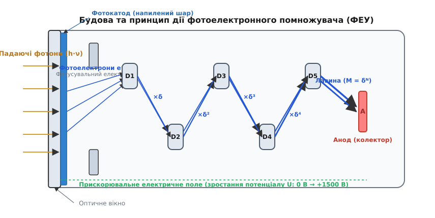
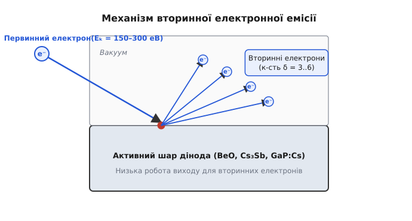
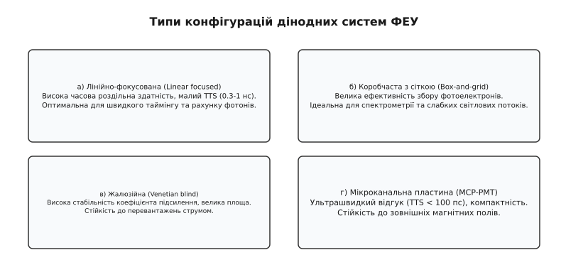
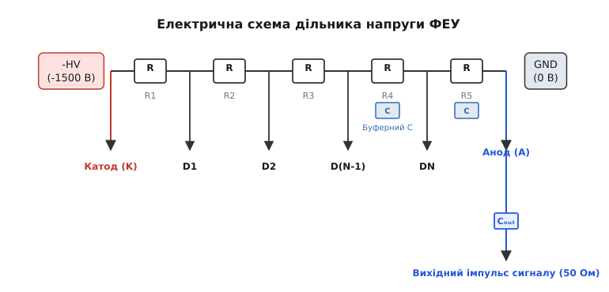
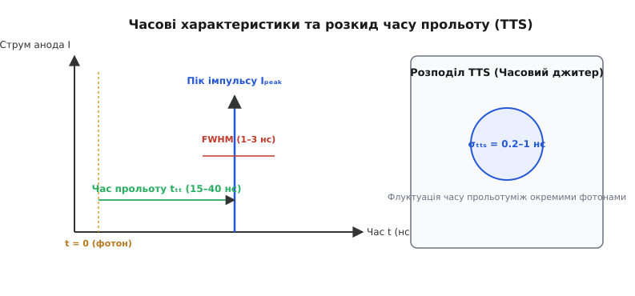

# Фотоелектронний помножувач (ФЕУ)

<preknowlist>
- [Фотон](root:ph-quantum/photon) — квант електромагнітного випромінювання з енергією E = h·ν.
- [Електричне поле](root:ph-electromagnetism/electric-field) — прискорення заряджених частинок у потенціальному полі.
- [Провідники й діелектрики](root:ph-condensed/conductors-insulators) — зонна структура, робота виходу та вільні електрони.
- [Дробовий шум](root:ph-condensed/shot-flicker-noise) — статистичні флуктуації струму при дискретному перенесенні заряду.
- [Напівпровідник](root:ph-condensed/semiconductor) — емісія та електронна спорідненість напівпровідникових матеріалів.
</preknowlist>

Вимірювання надслабких світлових потоків — аж до поодиноких квантів світла — натрапляє на фундаментальний фізичний бар'єр. Коли окремий фотон потрапляє на звичайний напівпровідниковий фотодіод або металевий фотокатод, він народжує один-єдиний електрон. Заряд цього електрона становить `1.602 × 10⁻¹十九` Кл (мізерна величина, нездатна викликати помітне падіння напруги на навантаженні). Якщо спрямувати такий заряд на вхід найкращого сучасного електронного підсилювача, напруга сигналу на навантаженні 50 Ом складе частки нановольта. Звичайні теплові шуми опору та транзисторів повністю поглинуть цей імпульс.

Щоб виявити поодинокий фотон, потрібен детектор із **внутрішнім безшумним підсиленням** порядку `10⁶`–`10⁸` разів — таким, що перетворює один вибитий електрон на потужний струмовий сплеск із мільйонів електронів ще до того, як сигнал покине вакуумний об'єм приладу. Традиційним та досі неперевершеним еталоном такого надчутливого детектора є **фотоелектронний помножувач** (ФЕУ, англ. *Photomultiplier Tube*, PMT). Прилад поєднує в єдиному вакуумному корпусі зовнішній фотоелектричний ефект на вхідному фотокатоді та каскадне електростатичне помноження електронів за допомогою вторинної електронної емісії на системі дінодів.

Детальніше про [історію винайдення ФЕУ](root:ph-condensed/photomultiplier-tube/hist-photomultiplier.md) від відкриттів Столєтова й Ейнштейна до першого каскадного приладу Кубецького та промислових розробок RCA розповідається в історичній довідці.


*Будова та принцип дії фотоелектронного помножувача (ФЕУ): фотони вибивають фотоелектрони на фотокатоді, які прискорюються електростатичною лінзою та розмножуються на каскаді дінодів D1–D5 до анода.*

---

## 1. Перша ланка: квантове перетворення на фотокатоді

Перший етап роботи ФЕУ — перетворення падаючого світлового фотона на вільний електрон у вакуумі. Цей процес спирається на **зовнішній фотоелектричний ефект** (від грец. *φῶς* — світло та *ἤλεκτρον* — бурштин/електрон), виявлений у твердих тілах.

Коли квант світла з енергією `E = h·ν` (де `h` — стала Планка, `ν` — частота) проходить крізь оптично прозоре вхідне вікно помножувача й поглинається шаром фотокатода, його енергія передається одному з електронів речовини. Якщо ця енергія перевищує **роботу виходу** `W` (для металів) або суму ширини забороненої зони та електронної спорідненості `E_g + χ` (для напівпровідників), електрон долає потенціальний бар'єр поверхні й вилітає у вакуумний простір.

### Фізика фотокатода й трикрокова модель Спайсера

Процес емісії фотоелектронів з напівпровідникових фотокатодів описують феноменологічною трикроковою моделлю Спайсера (*Spicer three-step model*):

1. **Оптичне поглинання:** Фотон поглинається у товщі фотокатода, переводячи електрон із валентної зони в зону провідності. Імовірність поглинання визначається коефіцієнтом оптичного поглинання `α(λ)` матеріалу.
2. **Транспорт до поверхні:** Збуджений електрон рухається до межі «тверде тіло — вакуум», втрачаючи частину кінетичної енергії на неупруге розсіювання на фононах та інших електронах. Довжина дифузії гарячих електронів `L_e` визначає ефективну товщину шар-емітера (зазвичай 20–50 нм).
3. **Вихід у вакуум:** Електрон, який досяг поверхні з нормальними складовою імпульсу та енергією, більшою за енергію вакуумного рівня `E_vac`, долає поверхневий бар'єр і вилітає у вакуум як **первинний фотоелектрон**.

Для забезпечення максимальної чутливості фотокатоди виготовляють у вигляді тонких напівпрозорих шарів, напилених на внутрішню поверхню вхідного скла (конфігурація *semitransparent photocathode*). Це дозволяє випромінюванню падати ззовні, а електронам вилітати з протилежного боку всередину вакуумного об'єму.

```
       Падаючий фотон h·ν (ззовні)
                  │
                  ▼
┌──────────────────────────────────┐  Оптичне вікно (скло / кварц)
├──────────────────────────────────┤
│░░░ Фотокатод (20-50 нм) ░░░░░░░░│  Поглинання + Ексітонне збудження
└──────────────────────────────────┘
                  │  (Вихід у вакуум)
                  ▼
            Первинний e⁻
```

### Квантова ефективність та спектральний відгук

Головною характеристикою фотокатода є **квантова ефективність** `η(λ)` (англ. *Quantum Efficiency*, QE) — відношення кількості випромінених фотоелектронів `N_pe` до кількості падаючих фотонів `N_ph` на даній довжині хвилі `λ`:

```
η(λ) = (N_pe / N_ph) · 100%
```

Альтернативно використовують **спектральну чутливість** `S(λ)`, що вимірюється в міліамперах на ват (мА/Вт):

```
S(λ) = (e / (h·ν)) · η(λ) ≈ (λ_nm / 1239.8) · η(λ)   [мА/Вт]
```

Значення квантової ефективності залежить від хімічного складу фотокатода:

- **Білужні фотокатоди (Bialkali, Sb-K-Cs):** Мають пікову квантову ефективність `η ≈ 25–35%` на довжині хвилі 380–420 нм. Вони характеризуються надзвичайно низьким темновим струмом за кімнатної температури та є стандартом для сцинтиляційних детективів на основі `NaI(Tl)` та `LSO`.
- **Багатолужні фотокатоди (Multialkali, Na-K-Sb-Cs):** Забезпечують широкий спектральний діапазон від ультрафіолету до ближнього інфрачервоного світла (300–850 нм) з `η ≈ 10–20%`.
- **Сонячно-сліпі фотокатоди (Solar-blind, Cs-Te, Rb-Te):** Чутливі виключно до ультрафіолетового випромінювання (`λ < 300 нм`) і абсолютно не чутливі до видимого сонячного світла, що критично для космічної та атмосферної фотометрії.
- **GaAs / InGaAs фотокатоди:** Використовують напівпровідникові гетероструктури з негативною електронною спорідненістю (NEA, *Negative Electron Affinity*), досягаючи `η > 40%` у видимому діапазоні.

Матеріал вхідного оптичного вікна задає короткохвильову межу прозорості: звичайне боросилікатне скло зрізає ультрафіолет при `λ < 300 нм`, синтетичний кварц (*fused silica*) прозорий до 160 нм, а кристали фториду магнію (`MgF2`) пропускають вакуумний ультрафіолет аж до 115 нм.

---

## 2. Друга ланка: каскадне помноження на дінодах

Вибитий з фотокатода первинний електрон має мізерну кінетичну енергію (частки електронвольта) і випадковий напрямок вильоту. Щоб підсилити цей заряд, його спрямовують у **дінодну систему** — послідовність емітерів підвищеного потенціалу.

### Механізм вторинної електронної емісії

Кожен дінод являє собою профільований металевий електрод, вкритий тонким шаром матеріалу з високим коефіцієнтом вторинної емісії (найчастіше окис берилію `BeO`, сурм'яно-цезієвий сплав `Cs3Sb` або фосфід галію, легований цезієм `GaP:Cs`).


*Механізм вторинної електронної емісії на поверхні дінода: один високоенергетичний первинний електрон передає енергію електронам решітки, викликаючи виліт δ вторинних електронів у вакуум.*

Коли первинний електрон прискорюється електричним полем між фотокатодом і першим дінодом `D1` до енергії `E_k = 150–300 еВ`, він врізається в поверхню емітера. Унаслідок неупругих зіткнень з атомами решітки первинний електрон передає свою енергію багатьом електронам валентної зони. Збуджені електрони дифундують до поверхні, і ті з них, енергія яких перевищує роботу виходу, вилітають у вакуум.

Кількість вибитих вторинних електронів на один первинний називається **коефіцієнтом вторинної емісії** `δ` (англ. *secondary emission ratio*). Значення `δ` залежить від кінетичної енергії первинного електрона та матеріалу дінода і зазвичай становить:

```
δ = 3..6    (для стандартних емітерів BeO / Cs3Sb)
δ = 10..25  (для високоефективних емітерів GaP:Cs)
```

### Лавинне підсилення каскаду

Вторинні електрони, вибиті з дінода `D1`, підхоплюються електричним полем і прискорюються в напрямку другого дінода `D2`, потенціал якого на 100–200 В вищий за потенціал `D1`. Кожен із цих `δ` електронів бомбардує `D2`, вибиваючи з нього нові вторинні електрони. На другому діноді кількість електронів зростає до `δ²`.

Процес повторюється каскадно на системі з `N` дінодів (типово `N = 8..14`). Загальний коефіцієнт підсилення струму помножувача `M` становить:

```
M = ∏[i=1..N] δ_i
```

Якщо всі каскади мають однакове підсилення `δ`, вираз спрощується до геометричної прогресії:

```
M = δ^N
```

Розглянемо чисельний приклад. Для ФЕУ з `N = 10` дінодами та середнім коефіцієнтом вторинної емісії `δ = 4`:

```
M = 4¹⁰ = 1 048 576 ≈ 1.05 × 10⁶
```

Один-єдиний фотоелектрон перетворюється на лавину з понад **мільйона електронів** за час менше 20 наносекунд. При цьому підсилення відбувається безпосередньо у вакуумі без застосування провідних каналів, що забезпечує мінімальний рівень доданих електронних шумів.

Детальний математичний аналіз залежності `M(V_total)`, виведення степеневого закону чутливості до напруги та фактора надлишкового шуму (Excess Noise Factor) наведено у [математичній моделі коефіцієнта підсилення ФЕУ](root:ph-condensed/photomultiplier-tube/math-dynode-gain.md).

---

## 3. Електронна оптика та геометрія дінодних систем

Ефективне розмноження електронів можливе лише тоді, коли електрони, вибиті з попереднього дінода, майже в повному складі фокусуються та влучають у робочу область наступного. Цю задачу вирішує **електронна оптика** ФЕУ.

### Фокусувальний електрод та ефективність збору

Між фотокатодом і першим дінодом `D1` розташовується спеціальний металевий **фокусувальний електрод** (англ. *focusing electrode*). Його геометрія створює вхідне імпульсно-ізольоване електростатичне поле, яке діє як електронна лінза. Поле збирає фотоелектрони, випромінені з будь-якої точки великої поверхні фотокатода, та зводить їх у вузький пучок, спрямований точно на центр першого дінода.

Якість цієї оптики описують **ефективністю збору** `η_coll` (англ. *collection efficiency*) — часткою фотоелектронів з катода, які досягають `D1` (типове значення `η_coll = 85–95%`).

### Основні конфігурації дінодних масивів

Конструкція дінодного масиву визначає підсилення, часову роздільну здатність, стійкість до магнітних полів та рівень лінійності струму.


*Основні геометрії дінодних систем ФЕУ: (а) лінійно-фокусована, (б) коробчаста з сіткою, (в) жалюзійна, (г) мікроканальна пластина (МКП).*

1. **Лінійно-фокусована система (Linear focused):** Діноди мають спеціально розраховану криволінійну форму, що створює сильні прискорювальні поля між сусідніми каскадами. Траєкторії електронів оптимізовані за часом прольоту. Конструкція забезпечує найвищу часову точність (короткий фронт імпульсу ~1 нс, малий часовий джитер) і є стандартом для швидких коінцидентних вимірювань.
2. **Коробчаста система з сіткою (Box-and-grid):** Кожен дінод виконано у формі чверті циліндра («коробки»), вхід якої перекрито прозорою металевою сіткою. Система створює широке зачіпне поле, забезпечуючи максимальну ефективність збору електронів `η_coll ≈ 98%`, але має більший розкид часу прольоту.
3. **Жалюзійна система (Venetian blind):** Діноди складаються з паралельних плоских пластин, розташованих під кутом, подібно до віконних жалюзі. Така геометрія забезпечує високу стабільність коефіцієнта підсилення, стійкість до струмових перевантажень та велику ефективну площу, хоча є відносно повільною.
4. **Мікроканальні пластини (MCP-PMT):** Традиційні діноди замінено скляною дискретною пластиною з товщиною ~1 мм, пронизаною мільйонами мікроканалів (діаметром 6–25 мкм). Внутрішні стінки каналів є неперервним вторинним емітером під високою напругою. MCP-PMT мають рекордну часову роздільну здатність (розкид часу прольоту < 100 пс) та функціонують у сильних магнітних полях до 1.5 Тл.

---

## 4. Електрична обв'язка: дільник напруги та лінійність

Для забезпечення прискорювальних полів на діноди необхідно подати послідовно зростаючі потенціали. Для цього використовують **високовольтний дільник напруги** (англ. *voltage divider base*), що підключається до зовнішнього джерела високої напруги HV (1000–2500 В).


*Схема високовольтного дільника напруги ФЕУ із розв'язувальними конденсаторами на останніх ступенях та анодним навантаженням 50 Ом.*

### Запобігання просторовому насиченню зарядів

На останніх дінодах каскаду (наприклад, `D8..D10`) кількість електронів у лавині досягає мільйонів. Електронна хмара утворює високу локальну щільність негативного заряду. Цей **просторовий заряд** (англ. *space charge effect*) послаблює зовнішнє прискорювальне електричне поле між останніми дінодами та анодом, унаслідок чого частина електронів сповільнюється і не досягає анода. Виникає нелінійність: анодний струм перестає бути пропорційним інтенсивності світла.

Для подолання ефекту просторового заряду застосовують два схемотехнічні рішення:

1. **Конусний (tapered) дільник:** Опори резисторів на останніх ступенях збільшують у 1.5–3 рази порівняно з початковими. Це створює напруженіше електричне поле між останніми дінодами, яке швидко розганяє та розтягує щільну електронну хмару.
2. **Розв'язувальні конденсатори:** Паралельно останнім резисторам дільника підключають високочастотні високовольтні конденсатори `C` (єдиною ємністю 10–100 нФ). Вони виступають резервуаром заряду, компенсуючи імпульсне просідання напруги під час швидких сплесків струму.

Детальні інженерні формули для розрахунку струму дільника, вибору ємностей та порівняння схем із негативним катодом `-HV` та позитивним анодом `+HV` наведено в інженерному довіднику про [розрахунок дільника напруги ФЕУ](root:ph-condensed/photomultiplier-tube/api-voltage-divider.md).

---

## 5. Формування анодного імпульсу та часові характеристики

Коли лавина з `M` електронів прибуває на анод (колектор), вона наводить у зовнішньому колі імпульс струму.

### Ампераж та напруга однофотонного імпульсу

Загальний заряд, занесений електронною хмарою на анод від одного фотоелектрона, становить:

```
Q = M · e = 10⁶ · (1.602 × 10⁻¹⁹ Кл) = 1.602 × 10⁻¹³ Кл = 0.16 пКл
```

Оскільки електронний пучок зфокусовано у вузький часовий інтервал тривалістю `t_p ≈ 2 нс`, піковий анодний струм імпульсу `I_peak` складає:

```
I_peak ≈ Q / t_p = 0.16 пКл / 2 нс = 80 мкА
```

Спрямувавши цей струм на стандартний навантажувальний резистор коаксіальної лінії `R_load = 50 Ом`, отримуємо амплітуду напруги імпульсу:

```
V_peak = I_peak · R_load = 80 мкА · 50 Ом = 4 мВ
```

Імпульс напруги амплітудою **4 мілівольти** легко впевнено реєструється швидкісними компараторами та осцилографами без загрози тонути в електронних шумах.


*Форма анодного імпульсу струму, час прольоту t_TT та гаусів розподіл флуктуацій часу прольоту (TTS / джитер).*

### Час прольоту та джитер (TTS)

Часові параметри ФЕУ є критичними для методів вимірювання часу прольоту (*Time-of-Flight*, ToF):

1. **Час прольоту (Transit Time, `t_TT`):** Затримка часу від моменту випромінювання фотоелектрона на фотокатоді до моменту досягнення максимуму анодного імпульсу (типово `t_TT = 15–40 нс`).
2. **Час наростання (Rise Time, `t_r`):** Час, за який анодний імпульс зростає від 10% до 90% своєї амплітуди (типово 0.5–2 нс).
3. **Тривалість імпульсу на піввисоті (FWHM):** Ширина імпульсу на рівні 50% амплітуди (типово 1–3 нс).
4. **Розкид часу прольоту (Transit Time Spread, TTS або часовий джитер):** Флуктуація часу прольоту між окремими однофотонними імпульсами. TTS виникає через те, що фотоелектрони вилітають із різних точок фотокатода з різними початковими швидкостями та рухаються трохи відмінними траєкторіями.

Для стандартних лінійно-фокусованих ФЕУ флуктуація становить `σ_TTS = 0.3–1 нс`, а для приладів на мікроканальних пластинах (MCP-PMT) не перевищує 30–50 пікосекунд.

Алгоритм числового моделювання формування імпульсів, випадкового помноження та дискримінації часу прильоту реалізовано в кодовому проекті [симуляції анодного імпульсу ФЕУ](root:ph-condensed/photomultiplier-tube/proj-pmt-pulse-sim.md).

---

## 6. Шуми, темновий струм та ліміти чутливості

Навіть у повній темряві на аноді ФЕУ протікає дрібний постійний або імпульсний струм, який називається **темновим струмом** (англ. *dark current*). Він визначає нижню межу чутливості помножувача.

### Компоненти темнового струму

Темновий струм ФЕУ є сумою чотирьох незалежних фізичних процесів:

1. **Термоелектронна емісія (Thermionic emission):** Головне джерело темнового шуму. Хаотичне теплове тремтіння решітки фотокатода надає окремим електронам енергію, достатню для подолання роботи виходу без участі фотонів. Густина термоструму описується рівнянням Річардсона-Душмана:

```
J_th = A_R · T² · exp(-W / (k_B · T))
```

Оскільки фотокатоди розробляються з низькою роботою виходу `W` для максимальної чутливості до світла, термоелектронний шум за кімнатної температури `T = 300 K` становить від сотень до тисяч відліків на секунду.

*Метод боротьби:* Охолодження ФЕУ за допомогою елементів Пельтьє або рідкого азоту до темпертурин `-20°C...-50°C` знижує термоелектронний шум у 100–1000 разів, зводячи його до поодиноких відліків на хвилину.

2. **Автоелектронна (польова) емісія (Field emission):** На гострих краях дінодів та електродів під дією високої напруженості електричного поля (`E > 10⁶ В/см`) виникає квантово-механічне тунелювання електронів крізь потенціальний бар'єр у вакуум. Польова емісія різко зростає при перевищенні максимально допустимої напруги живлення.
3. **Іонний зворотний зв'язок та післяімпульси (Ion feedback & Afterpulsing):** Залишкові молекули газу у вакуумній колбі (`H2`, `He`, `N2`) іонізуються електронною лавиною поблизу анода. Утворені позитивні іони під дією поля летять у зворотному напрямку до фотокатода. Вдаряючись об фотокатод через `0.1–2 мкс` після первинного імпульсу, іон вибиває групу вторинних електронів, утворюючи фальшивий супутній імпульс — **післяімпульс** (*afterpulse*).
4. **Радіоактивність скла та космічні промені:** Ізотоп калію `⁴⁰K`, що міститься у звичайному склозаводському склі колби, піддається бета-розпаду. Високоенергетичні бета-частинки випромінюють у склі черенковські фотони, які спричиняють короткі локальні спалахи світла. Для зниження цього фону в ультрачутливих фізичних детекторах застосовують колби із синтетичного кварцу або бескалієвого скла.

---

## 7. Порівняння з твердотільними аналогами

Протягом останніх десятиліть у напівпровідниковій індустрії активного розвитку набули твердотільні фотодетектори: PIN-фотодіоди, лавинні фотодіоди (APD) та кремнієві фотопомножувачі (SiPM / MPPC).

| Характеристика | Фотоелектронний помножувач (ФЕУ / PMT) | Кремнієвий фотопомножувач (SiPM / MPPC) | Лавинний фотодіод (APD) |
| :--- | :--- | :--- | :--- |
| **Коефіцієнт підсилення (M)** | `10⁶`–`10⁸` (безшумне вакуумне) | `10⁵`–`10⁶` (гейгерівський режим) | `100`–`500` (лінійний лавинний) |
| **Робоча напруга живлення** | High Voltage: 1000–2500 В | Low Voltage: 20–70 В | Medium Voltage: 100–500 В |
| **Рівень темнового шуму** | Дуже низький (10–100 Гц/см²) | Високий (100 кГц–1 МГц/мм² при 20°C) | Помірний |
| **Часова роздільна здатність (TTS)** | 200–1000 пс (30 пс для MCP) | 100–300 пс | 1–5 нс |
| **Стійкість до магнітних полів** | Вкрай чутливий (потрібен пермалой) | Абсолютно стійкий (до 10–15 Тл) | Стійкий |
| **Активна площа детектування** | Велика (від 1 см до 50 см) | Мала (матриці 3×3 мм, 6×6 мм) | Мала (1–5 мм) |
| **Механічна міцність** | Крихкий (скляна вакуумна колба) | Висока (монолітний кремній) | Висока |

Незважаючи на компактність та низьковольтне живлення SiPM, класичні вакуумні ФЕУ утримують монополію в галузях, де потрібні **величезна площа фотокатода** (наприклад, підземні нейтринні детектори), **ультранизький темновий шум** при кімнатній температурі та **ідеальна спектральна прозорість** в ультрафіолеті.

---

## 8. Практичні застосування ФЕУ

Завдяки граничній чутливості та високій швидкодії ФЕУ стали ключовими детекторами у найвідповідальніших галузях науки й техніки:

1. **Фізика високих енергій та астрофізика:** Нейтринний детектор **Super-Kamiokande** (Японія) містить у резервуарі з 50 000 тонн надчистої води понад 11 000 гігантських 20-дюймових ФЕУ (виробництва Hamamatsu Photonics). Вони реєструють слабкі конуси черенковського випромінювання від релятивістських мюонів та електронів, вибитих нейтрино.
2. **Сцинтиляційна гамма-спектрометрія:** Оптичний контакт ФЕУ з монокристалом іодиду натрію `NaI(Tl)` утворює сцинтиляційний детектор. Гамма-квант високоенергетичного випромінювання народжує в кристалі спалах зі світловим виходом, пропорційним енергії гамма-кванта. ФЕУ перетворює цей спалах на амплітуду електричного імпульсу, дозволяючи точечно визначати ізотопний склад речовини.
3. **Медична діагностика (Позитрон-емісійна томографія, ПЕТ):** Матриці швидкісних ФЕУ реєструють анігіляційні гамма-кванти енергією 511 кеВ від радіофармпрепаратів у тілі пацієнта, дозволяючи з міліметровою точністю будувати тривимірні карти пухлин.
4. **Квантова оптика та флуоресцентна мікроскопія:** Методи вимірювання часу життя флуоресценції (FLIM, *Fluorescence Lifetime Imaging Microscopy*) та однофотонної кореляції спираються на ФЕУ в режимі однофотонного відліку (Single Photon Counting).

> 🔧 **Навіщо це.** Фотоелектронний помножувач — це прилад, який дозволяє подолати квантову межу електронних підсилювачів і побачити поодинокий фотон як чіткий імпульс напруги в кілька мілівольтів. Знання фізики фотокатода, дінодного підсилення та схемотехніки дільника напруги дозволяє проектувати ультрачутливі фізичні детектори, сцинтиляційні спектрометри та системи реєстрації надслабких світлових спалахів без спотворень та шумових перевантажень.
