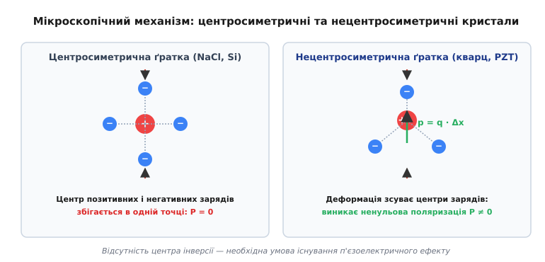
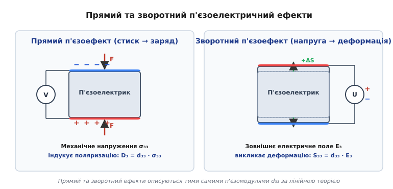
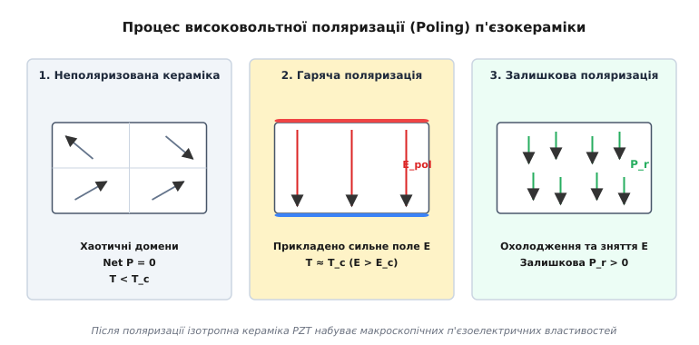
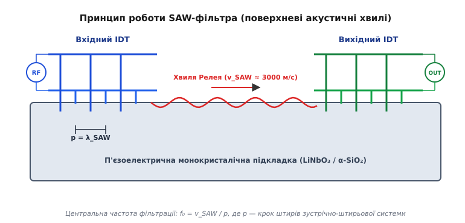

# П'єзоелектрика та зворотний п'єзоефект

<preknowlist>
- [Поляризація діелектрика](root:ph-electromagnetism/electric-polarization) — зв'язані заряди, вектор поляризації P та дипольний момент комірки.
- [Пружна деформація і закон Гука](root:ph-condensed/elastic-deformation) — тензори напружень T, деформацій S та модуль Юнга.
- [Діелектрична проникність](root:ph-electromagnetism/permittivity) — відносна діелектрична проникність ε_r та зв'язок між векторами E й D.
- [Сегнетоелектрики](root:ph-condensed/ferroelectricity) — спонтанна поляризація, доменна структура та точка Кюрі.
</preknowlist>

Інженерна проблема високоточних обчислень, радіозв'язку та прецизійної механіки XIX–XX століть вимагала створення пристроїв, здатних безінерційно перетворювати механічні коливання у високостабільний електричний сигнал і навпаки, оскільки класичні електромагнітні індуктивні реле та механічні маятники виявилися непридатними для мікросекундних систем і нанометрових переміщень. Розв'язанням цієї фундаментальної проблеми стало відкриття п'єзоелектричного ефекту.

Коли до граней монокристала кварцю завтовшки один міліметр прикладають механічну силу стиску всього у 100 ньютонів, на його протилежних поверхнях миттєво виникає електричний заряд, що створює різницю потенціалів понад 15 вольтів. Якщо ж змінити напрямок зусилля зі стиску на розтяг, знак виниклої напруги змінюється на протилежний. Зворотний процес працює з такою ж строгістю: електрична напруга у 100 вольтів змушує той самий кристал змістити свої грані на частки нанометра, розвиваючи механічне зусилля у сотні кілограмів. Цей двобічний зв'язок між механічною деформацією твердого тіла та внутрішнім електричним полем називається **п'єзоелектричним ефектом** (*piezoelectric effect*, від грецького *piezein* — тиснути, стискати). Він є основою стабілізації частоти радіопередавачів, високочастотної фільтрації сигналів у смартфонах, ультразвукової медичної візуалізації, гідроакустичної локації та нанопозиціонування з пікометровою точністю.

---

## 1. Фізична природа та кристалографічні вимоги симетрії

П'єзоелектричні властивості не є загальною рисою всіх речовин. Вони виникають виключно у кристалах із відповідною внутрішньою геометрією та асиметрією розподілу електричних зарядів у елементарній комірці.

У недеформованому стані будь-якого кристала позитивно заряджені катіони та негативно заряджені аніони утворюють періодичну ґратку. Якщо кристал має високу симетрію, центр ваги позитивних зарядів повністю збігається з центром ваги негативних зарядів, тому результуючий дипольний момент елементарного об'єму дорівнює нулю.


*Мікроскопічний механізм поляризації: у центросиметричних кристалах деформація не порушує збіг центрів зарядів (P = 0), тоді як у нецентросиметричних ґратках асиметричний зсув іонів генерує макроскопічний дипольний момент p.*

### Центросиметричні проти нецентросиметричних кристалів

Здатність матеріалу до п'єзоелектричного перетворення повністю визначається наявністю або відсутністю **центра інверсії (центра симетрії)**:

1. **Центросиметричні кристали:** 
   У кристалографічних точкових групах із центром інверсії (наприклад, кубічна ґратка кухонної солі `NaCl` або кремнію `Si`) кожному іону в точці `(x, y, z)` відповідає симетричний іон того самого знака в точці `(-x, -y, -z)`. При прикладанні однорідного механічного напруження (стиску чи розтягу) іони зсуваються строго симетрично. Відстані між усіма різнойменними зарядами змінюються однаково, через що центр позитивних зарядів і центр негативних зарядів залишаються в одній точці. Сумарний дипольний момент елементарної комірки дорівнює нулю (`p = 0`), і макроскопічна поляризація не виникає.

2. **Нецентросиметричні кристали:**
   У ґратках без центра інверсії (наприклад, тригональний кварц `α-SiO₂` або перовськіт `BaTiO₃`) елементарна комірка побудована з асиметричних іонних груп (тетраедрів `SiO₄` або октаедрів `TiO₆`). При механічному напруженні жорсткість хімічних зв'язків у різних напрямках виявляється неоднаковою. Позитивні катіони (`Si⁴⁺`, `Ti⁴⁺`) та негативні аніони (`O²⁻`) зміщуються на різні відстані.

Цей асиметричний зсув підґраток приводить до розриву компенсації зарядів:
- Центр ваги позитивних зарядів зміщується відносно негативних на вектор `Δx`.
- Елементарна комірка набуває індукованого дипольного моменту `p = q · Δx`.
- Сумування векторів `p` по всьому об'єму кристала `V` дає макроскопічний вектор **електричної поляризації** `P`:

```
P = (1 / V) · ∑ p[k] = ΔQ / A
```

На протилежних гранях кристала з'являються некомпенсовані поверхневі зв'язані заряди з густиною `σ_e = P_n`, що створюють вимірювану різницю потенціалів між електродами.

З 32 точкових кристалографічних груп центр інверсії відсутній у 21 класі. Проте у кубічному класі `432` висока симетрія обнуляє всі п'єзоелектричні модулі. Таким чином, **п'єзоелектричний ефект спостерігається виключно у 20 нецентросиметричних кристалографічних класах**.

---

## 2. Прямий та зворотний п'єзоелектричний ефекти: Термодинамічна взаємність

П'єзоелектрика є принципово симетричним (оборотним) електромеханічним процесом, який описується однаковими коефіцієнтами зв'язку в обох напрямках. Ця взаємність описується термодинамічними співвідношеннями Максвелла для вільної енергії Гіббса.


*Принципова схема прямого (генерація заряду під дією тиску) та зворотного (механічна деформація під дією напруги) п'єзоелектричних ефектів.*

### 1. Прямий п'єзоелектричний ефект
Прямий п'єзоефект полягає у виникненні електричної поляризації `P` або векторного зсуву `D` під дією прикладеного механічного напруження `T`.

У найпростішому одновимірному випадку поздовжньої деформації пластини площею `A`:

```
D = d · T     =>     Q = d · F
```

Де:
- `Q` — накопичений поверхневий заряд (кулони, C).
- `F` — прикладена механічна сила (ньютони, N).
- `d` — п'єзоелектричний модуль заряду (кулони на ньютон, C/N, або пікокулони на ньютон, pC/N).

Заряд `Q` генерується миттєво при прикладанні сили. Якщо електроди пластини замкнені через зовнішній провідник, у колі протікає імпульс струму `I = dQ/dt`. Якщо ж електроди розімкнені, кристал поводиться як конденсатор ємністю `C₀ = ε_r ε₀ A / d₀`, на якому виникає напруга холостого ходу:

```
V_oc = Q / C₀ = (d · F · d₀) / (ε_r · ε₀ · A) = g · T · d₀
```

Де `g = d / (ε_r ε₀)` — п'єзоелектрична стала напруги (`V·m/N`).

### 2. Зворотний п'єзоелектричний ефект
Зворотний п'єзоефект полягає у виникненні механічної деформації `S` (відносного видовження `ΔL / L₀`) під дією зовнішнього електричного поля `E`.

```
S = ΔL / L₀ = d · E     =>     ΔL = d · V
```

Зворотний п'єзоефект є лінійним за полем (`S ∝ E`): зміна полярності поданої напруги `V` змінює розширення кристала на стиск.

### Термодинамічне виведення взаємності коефіцієнтів
Запишемо диференціал термодинамічного потенціалу Гіббса `G(T, E)` для ізотермічного процесу:

```
dG = -S · dT_mech - D · dE
```

Оскільки `dG` є повним диференціалом, з рівності других мішаних похідних за змінними `T_mech` та `E` випливає співвідношення взаємності Максвелла:

```
(∂S / ∂E)_T_mech = (∂D / ∂T_mech)_E = d
```

Це математично доводить, що коефіцієнт прямого п'єзоефекту (відношення електричного зсуву `D` до механічного напруження `T_mech`) строго дорівнює коефіцієнту зворотного п'єзоефекту (відношенню деформації `S` до електричного поля `E`).

### Відмінність від електрострикції
Зворотний п'єзоефект слід чітко відрізняти від **електрострикції** (*electrostriction*):
- **Зворотний п'єзоефект є лінійним** (`S ∝ E`) і спостерігається тільки в 20 нецентросиметричних кристалографічних класах.
- **Електрострикція є квадратичною** (`S ∝ E²`). Вона завжди викликає тільки розширення або тільки стиск незалежно від полярності поля і спостерігається абсолютно в усіх діелектриках (включаючи центросиметричні кристали, стекла та рідини).

Детальний огляд хронології експериментальних робіт братів Кюрі, термодинамічного передбачення Ліппмана та створення першого ультразвукового сонара Ланжевена наведено у вставці [📜 Історія відкриття п'єзоелектрики: від братів Кюрі до ультразвукових сонарів та SAW-фільтрів](root:ph-condensed/piezoelectric-tensor-and-materials/hist-curie-lippmann.md).

---

## 3. Математичний формалізм та нотація Фойгта

Оскільки механічний стан описується симетричними тензорами 2-го рангу напружень `T[ij]` та деформацій `S[ij]`, а електричний стан — векторами `E[k]` та `D[i]`, п'єзоелектричні модулі утворюють **тензор 3-го рангу** `d[ijk]`.

У повній тензорній формі конститутивні рівняння стану мають вигляд:

```
D[i] = ε[ij]^T · E[j] + d[ijk] · T[jk]        [прямий ефект]
S[ij] = d[kij] · E[k] + s[ijkl]^E · T[kl]      [зворотний ефект]
```

Тензор `d[ijk]` має 27 компонент, але через симетрію `d[ijk] = d[ikj]` кількість незалежних елементів скорочується до 18.

Для спрощення обчислень використовують **скорочену нотацію Фойгта** (*Voigt notation*), яка замінює пару симетричних індексів `(j,k)` одним матричним індексом `p ∈ {1, 2, 3, 4, 5, 6}`:

```
(1,1) → 1 (стиск/розтяг по X)        (2,3) = (3,2) → 4 (зсув у площині YZ)
(2,2) → 2 (стиск/розтяг по Y)        (1,3) = (3,1) → 5 (зсув у площині XZ)
(3,3) → 3 (стиск/розтяг по Z)        (1,2) = (2,1) → 6 (зсув у площині XY)
```

Тензор 3-го рангу `d[ijk]` перетворюється на прямокутну матрицю **`d[i,p]` розміром 3 × 6**:

```
          [ d₁₁  d₁₂  d₁₃  d₁₄  d₁₅  d₁₆ ]
d[i,p] =  [ d₂₁  d₂₂  d₂₃  d₂₄  d₂₅  d₂₆ ]
          [ d₃₁  d₃₂  d₃₃  d₃₄  d₃₅  d₃₆ ]
```

Матричні рівняння стану у **d-формі** записуються як:

```
D[i] = ∑ (ε[ij]^T · E[j]) + ∑ (d[i,p] · T[p])      (i = 1..3, p = 1..6)
S[q] = ∑ (d[q,i]^t · E[i]) + ∑ (s[qp]^E · T[p])     (q = 1..6)
```

Залежно від обраних незалежних змінних застосовують 4 еквівалентні форми рівнянь (d-форма, e-форма, g-форма, h-форма). Математичний вивід усіх чотирьох форм та розрахунок матриць для різних класів симетрії наведено у вставці [🧮 Математичний апарат п'єзоелектрики: тензорний формалізм, скорочення Фойгта та коефіцієнти зв'язку](root:ph-condensed/piezoelectric-tensor-and-materials/math-piezo-tensor.md).

---

## 4. Порівняльний аналіз п'єзоелектричних матеріалів

У сучасній техніці використовуються чотири основні класи п'єзоелектриків:

### 1. Монокристали (Кварц α-SiO₂, LiNbO₃, LiTaO₃)
Природний та гідротермальний кварц належить до тригонального класу `32`. Він має відносно малий п'єзомодуль (`d₁₁ ≈ 2.31 pC/N`), але характеризується унікально високою механічною добротністю (`Q_m > 10⁵ – 10⁶`) та температурною стабільністю. **AT-зріз кварцю** забезпечує майже нульовий температурний коефіцієнт частоти поблизу кімнатної температури.

### 2. Сегнетоелектрична кераміка (PZT, BaTiO₃)
Полікристалічна кераміка **цирконату-титанату свинцю (`Pb[Zr_x Ti_{1-x}]O₃`, або PZT)** зі структурою перовськіту є основним силовим п'єзоматеріалом. Відразу після спекання кераміка є ізотропною і не має п'єзоефекту, бо її домени орієнтовані хаотично.

Для надання кераміці п'єзоелектричних властивостей проводиться **високовольтна поляризація** (*poling*).


*Три етапи поляризації PZT-кераміки: 1) неполяризований стан з хаотичними доменами (P = 0); 2) нагрівання до T ≈ Tc та прикладання поля E > Ec; 3) поляризований стан із залишковою поляризацією Pr після охолодження.*

- Кераміку нагрівають до температури `T ≈ 120 – 200 °C` (поблизу точки Кюрі `T_c`).
- Прикладають сильне постійне поле `E_pol ≈ 2 – 4 kV/mm`, яке розвертає вектори спонтанної поляризації більшості доменів вздовж осі поля.
- Охолоджують кераміку під полем до кімнатної температури, фіксуючи високу **залишкову поляризацію** `P_r > 0`.

Після поляризації кераміка PZT набуває трансверсально-ізотропної симетрії (клас `6mm`) і демонструє гігантські п'єзомодулі (`d₃₃ ≈ 300 – 650 pC/N`).

### 3. Тонкі плівки (AlN, ZnO)
Тонкоплівкові структури нітриду алюмінію AlN та оксиду цинку ZnO наносять магнетронним напиленням на кремнієві пластини. Вони мають помірний п'єзомодуль (`d₃₃ ≈ 5.5 pC/N`), але володіють винятково високою швидкістю звуку (`v_s ≈ 11000 m/s` для AlN) та повною сумісністю із кремнієвою планарною технологією (CMOS).

### 4. П'єзополімери (PVDF)
Гнучкі плівки полівініліденфториду PVDF `(-CH₂-CF₂-)_n` мають низький акустичний імпеданс (`Z ≈ 2.7 MRayl`), що близький до імпедансу біологічних тканин та води, і застосовуються у гнучких сенсорах і ультразвукових гідрофонах.

Детальний порівняльний аналіз сталих матеріалів, зведену таблицю та аналіз режимів розполяризації (depoling) наведено у вставці [🔌 Класифікація та порівняльний аналіз п'єзоелектричних матеріалів: від монокристалів до плівок і полімерів](root:ph-condensed/piezoelectric-tensor-and-materials/comp-piezo-materials.md).

---

## 5. Динаміка, механічний резонанс та коефіцієнт електромеханічного зв'язку k²

При подачі змінного електричного поля `E(t) = E₀ sin(ω t)` у п'єзоелементі збуджуються вимушені механічні коливання.

### Механічний резонанс та антирезонанс
Коли частота електричного сигналу збігається з власною частотою акустичних коливань п'єзопластини (коли на товщині чи довжині вкладається ціле число півхвиль `λ / 2`), спостерігається **механічний резонанс**.

Поблизу резонансу імпеданс `Z(f)` п'єзоелемента демонструє два екстремуми:
- **Послідовний резонанс (f_s):** Механічні коливання досягають максимуму амплітуди, а електричний імпеданс падає до мінімуму (`Z → R_m`).
- **Паралельний антирезонанс (f_p):** Струм динамічної гілки складається в протифазі зі струмом статичної ємності `C₀`, створюючи гострий максимум імпедансу.

```
       |Z| (Імпеданс)
        ^
        |           /| (Паралельний антирезонанс f_p: Z = Z_max)
        |          / |
        |         /  |
        |  ______/   |
        | /          |
        |/ (f_s)     \
        +-------------+------------------------> f (Частота)
          Резонанс: Z = Z_min
```

### Коефіцієнт електромеханічного зв'язку k²
Ефективність перетворення енергії характеризується безрозмірним **коефіцієнтом електромеханічного зв'язку k**:

```
k² = (Енергія, перетворена в іншу форму) / (Повна підведена енергія)
```

Для поздовжньої деформації (мода 33):

```
k₃₃ = d₃₃ / √(s₃₃^E · ε₃₃^T)
```

Для кварцю `k₃₃ ≈ 0.10` (`k² ≈ 1%`), тоді як для PZT-5H `k₃₃ ≈ 0.75` (`k² ≈ 56%`).

Повні рівняння еквівалентної електричної схеми Баттерворта — Ван-Дайка (BVD), розрахунок статичної `C₀` та динамічних `L_m, C_m, R_m` компонент, а також стандартизовані параметри IEEE 176 зведено у вставці [📋 Довідник фізико-механічних та електричних параметрів п'єзоматеріалів та матриць симетрії](root:ph-condensed/piezoelectric-tensor-and-materials/api-piezo-parameters.md).

---

## 6. Практичні застосування п'єзотехніки

Завдяки здатності до прямого та зворотного перетворення енергії п'єзоелектричні пристрої розділяються на три великі галузі:

### 1. Акустоелектроніка: SAW-фільтри та FBAR-резонатори
У сучасній радіочастотній техніці (смартфонах, станціях 4G/5G, Wi-Fi та GPS-приймачах) п'єзоелектричний ефект єдиний дозволяє створити мікрогабаритні високоселективні смугові фільтри.


*Конструкція SAW-фільтра: вхідний зустрічно-штирьовий перетворювач (IDT) перетворює радіочастотний електричний сигнал на поверхневу акустичну хвилю Релея, яка проходить через п'єзопідкладку і конвертується назад у вихідний електричний сигнал.*

У **фільтрах на поверхневих акустичних хвилях (SAW, Surface Acoustic Wave)**:
1. Вхідний зустрічно-штирьовий перетворювач (IDT) перетворює напругу `V_in(t)` на поверхневу хвилю Релея.
2. Оскільки швидкість звуку в твердому тілі (`v_s ≈ 3000 m/s`) у 10⁵ разів менша за швидкість світла, довжина акустичної хвилі на частоті 1.5 GHz становить лише `λ_s = v_s / f ≈ 2 μm`.
3. Хвиля проходить між електродами з кроком `p = λ_s` і зчитується вихідним IDT, створюючи крутоспадні фільтри розміром у кілька міліметрів.

У високочастотних діапазонах 5G (3–6 GHz) застосовують **обернені об'ємні акустичні резонатори (FBAR)** на основі тонких плівок AlN.

### 2. П'єзоактуатори позиціонування та мікроактуатори
Зворотний п'єзоефект дозволяє створювати **багатошарові п'єзостеки** (PZT-актуатори). Напилення сотень тонких п'єзошарів завтовшки 100 μm, з'єднаних паралельно, дозволяє при низькій напрузі 100 V отримувати переміщення до 20 μm із зусиллям у кілька кілоньютонів.

П'єзоактуатори застосовуються в:
- Скануючих тунельних (STM) та атомно-силових (AFM) мікроскопах для керування голкою з пікометровою роздільною здатністю.
- Системах активної компенсації вібрацій оптичних дзеркал у телескопах та лазерних літографах.
- П'єзофорсунках дизельних двигунів (забезпечують до 8 уприскувань палива за один цикл із часом спрацьовування `< 100 μs`).

### 3. Силовий ультразвук та гідроакустика
Завдяки високому коефіцієнту зв'язку PZT-кераміки у **перетворювачах Ланжевена** генерується потужний ультразвук (20–40 кГц) для ультразвукового зварювання пластмас, кавітаційного миття деталей, ультразвукової хірургії та гідролокаторів (SONAR).

> 🔧 **Навіщо це інженеру.**
> П'єзоелектричний стек має високу власну ємність (до кількох мікрофарад). При високочастотному керуванні напругою `V(t)` джерело живлення мусить віддавати значні реактивні струми `I = C₀ · dV/dt`. Для усунення гістерезису позиціонування (10–15%) п'єзоактуатором слід керувати не джерелом напруги, а **джерелом струму (заряду Q)**, що робить залежність зсуву `x(Q)` майже строго лінійною.

Алгоритм чисельного моделювання динаміки п'єзоактуатора під навантаженням, розрахунок нелінійного гістерезису Бука — Вена та порівняння режимів керування напругою й зарядом мовами C та C++ наведено у вставці [⚙️ Проєкт чисельного моделювання динаміки п'єзоактуатора та електромеханічного гістерезису](root:ph-condensed/piezoelectric-tensor-and-materials/proj-piezo-actuator-sim.md).

---

## 7. Обмеження та нелінійні ефекти

При розробці п'єзоелектричних пристроїв слід враховувати фізичні обмеження матеріалів:

1. **Температурна розполяризація:** Нагрівання кераміки вище температури Кюрі `T_c` приводить до фазового переходу в центросиметричний стан і повної незворотної втрати п'єзовластивостей.
2. **Механічна та електрична міцність:** Стискаючі напруження понад 80–100 MPa або зворотні електричні поля понад `E_c ≈ 1 – 2 kV/mm` приводять до механічної розполяризації матеріалу.
3. **Гістерезис та повзучість (Creep):** Перемикання 90°-вих доменів при керуванні напругою викликає гістерезис зміщення та повільний дрейф позиції у часі після подачі постійної напруги, що вимагає застосування замкнених систем керування з датчиками положення.
