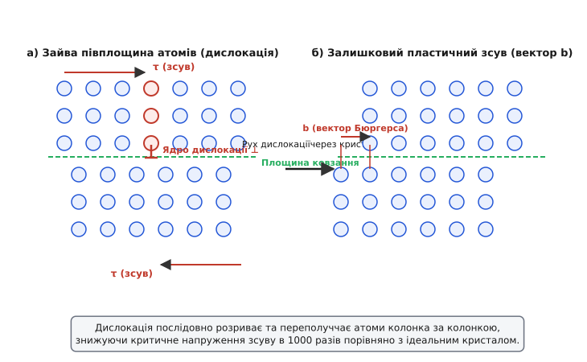
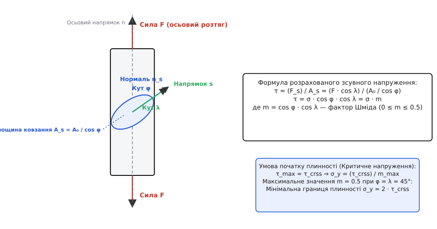
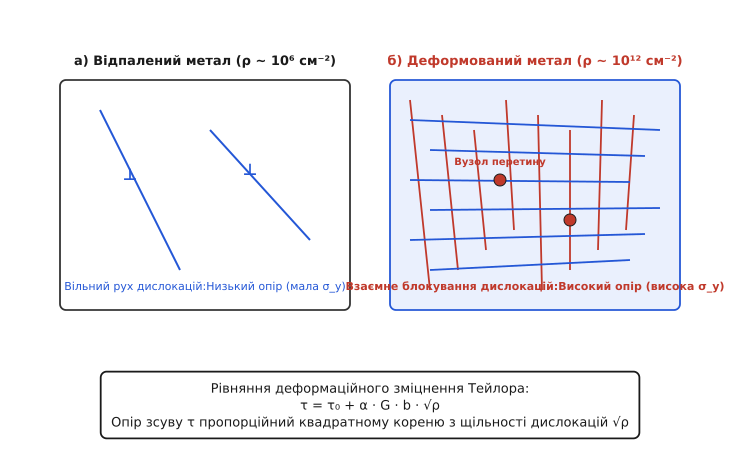
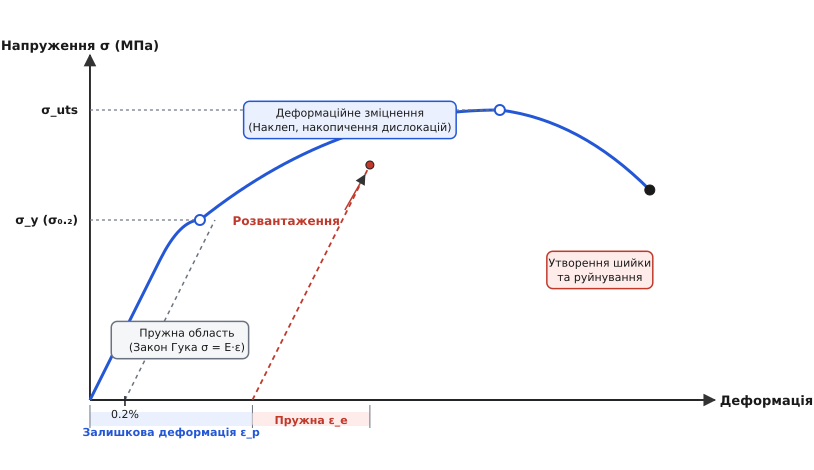

# Пластична деформація і границя плинності

<preknowlist>
- [Пружна деформація і закон Гука](root:ph-condensed/elastic-deformation) — оборотна зміна форми кристалічного тіла та зв'язок напруження й деформації через модуль Юнга E.
- [Другий закон Ньютона](root:ph-mechanics/newtons-second-law) — сила як причина зміни імпульсу та механічна рівновага.
- [Векторні й матричні операції](root:math-algebra/matrices-as-operations) — проектування векторів, скалярний добуток та лінійні перетворення.
</preknowlist>

Коли заготовка зі звичайної маловуглецевої сталі із початковою границею плинності 220 МПа проходить крізь важкі валки стану холодної прокатки під тиском у тисячі тонн, її товщина зменшується вдвічі, а границя плинності зростає до 600 МПа. Отриманий сталевий лист стає значно міцнішим, витримуючи гігантські навантаження в кузовах автомобілів чи мостових фермах без найменшої зміни розмірів. Проте якщо б метал деформувався виключно пружно, спроба змінити його форму холодною штамповкою призвела б лише до миттєвого пружного відскоку або крихкого розтрощення деталі. Здатність кристалічного матеріалу необоротно змінювати свою геометрію під дією механічного напруження без втрати суцільності й одночасно накопичувати внутрішній опір подальшому деформуванню є фундаментом усієї сучасної металургії, машинобудування та фізики міцності.

---

### 1. Фізична сутність пластичності та межа пружності

У механіці твердого тіла пластична деформація визначається як **залишкова (необоротна) зміна розмірів та форми кристалічного тіла**, що повністю зберігається після зняття зовнішніх механічних сил.

На відміну від пружної деформації, під час якої атоми кристалічної ґратки лише невелико та оборотно зміщуються зі своїх рівноважних положень на частки відсотка міжатомної відстані `r₀` (що описується квадратичною ямою міжатомного потенціалу), пластична деформація супроводжується **необоротним розривом одних міжатомних зв'язків та утворенням нових** між іншими атомами кристала.

```
                  ┌─────────────────────────────────────────┐
                  │          Механічне напруження σ         │
                  └────────────────────┬────────────────────┘
                                       │
                    ┌──────────────────┴──────────────────┐
                    ▼                                     ▼
        ┌───────────────────────┐             ┌───────────────────────┐
        │   σ < σ_y (Пружність)  │             │  σ ≥ σ_y (Пластичність)│
        ├───────────────────────┤             ├───────────────────────┤
        │  Розтяг зв'язків Δr   │             │ Розрив і переполуч-   │
        │  Повернення в стан r₀ │             │ чення атомних зв'язків│
        │  Форма відновлюється  │             │  Залишкова деформація │
        └───────────────────────┘             └───────────────────────┘
```

#### Термодинаміка та енергетика пластичного деформування

З термодинамічної точки зору, пружна деформація є потенціальним процесom: уся механічна робота зовнішніх сил `W_ext` накопичується у формі потенціальної енергії пружної деформації кристалічної ґратки `U_elastic` і повністю повертається під час розвантаження.

Пластична деформація є необоротним дисипативним процесом. Переважна більшість механічної роботи зовнішніх сил (від 90% до 95%) незворотно дисипує у теплоту внаслідок в'язкого тертя та коливань ґратки (фононного в'язкого гальмування), що виникають при русі атомних дефектів. Лише мала частка (від 5% до 10% вхідної роботи) запасається всередині кристала у формі **внутрішньої енергії дефектів** — локальних полів пружних напружень навколо розмножених дислокацій, точкових дефектів та викривлених меж кристалічних зерен.

Перехід від пружної поведінки до пластичної відбувається при досягненні напруженням критичного порогу — **границі плинності** `σ_y` *(англ. yield strength)*.

#### Атомний макро- та мікромасштаб

Якщо розглядати кристал макроскопічно, пластична деформація виглядає як однорідна зміна форми (зміна довжини, товщини чи кута зсуву). Проте на мікроскопічному рівні пластична деформація є строго дискретною та гетерогенною: вона реалізується локалізованим ковзанням окремих атомних блоків вздовж окремих кристалографічних площин.

---

### 2. Дислокаційний механізм ковзання

Протягом десятиліть фундаментальним питанням фізики твердого тіла залишалося наступне: за яким саме атомним механізмом здійснюється необоротний зсув атомних шарів?

#### Парадокс теоретичної міцності ідеального кристалу

У 1926 році Яків Френкель розрахував теоретичне напруження зсуву `τ_ideal`, необхідне для одночасного зсуву всієї атомної площини відносно сусідньої в ідеально чистому бездефектному кристалі. 

Оскільки при синхронному зміщенні мільярдів атомів усі міжатомні зв'язки уздовж площини ковзання розриваються одночасно, теоретичний енергетичний бар'єр вимагає гігантського зсувного напруження:

```
τ_ideal = G / (2π) ≈ G / 6                 [теоретична зсувна міцність за Френкелем]
```

де `G` — модуль зсуву матеріалу. Для сталі, міді чи алюмінію це значення становить від `5 000` до `15 000 МПа`. Проте експериментально виміряна границя плинності реальних відпалених монокристалів виявилася рівною всього `0.5–2 МПа`, тобто в 1000–10 000 разів меншою за теоретичну межу!

#### Крайові та ґвинтові дислокації як носії пластичності

Розв'язання цього парадоксу було запропоноване у 1934 році Джеффрі Тейлором, Еґоном Орованом та Майклом Поланьї (див. детальний історичний огляд у вставці [Історія відкриття дислокаційного механізму](root:ph-condensed/plastic-deformation/hist-schmid-taylor-dislocations.md)).

Пластична деформація реальних кристалів відбувається **не шляхом одночасного зсуву цілих площин**, а шляхом послідовного переміщення лінійних дефектів ґратки — **дислокацій**.


*Схема ковзання крайової дислокації у кристалічній ґратці. а) Наявність зайвої атомної півплощини створює ядро дислокації ⊥. б) Під дією зсувного напруження τ дислокація послідовно рухається вздовж площини ковзання, розриваючи та переполуччаючи атомні зв'язки колонка за колонкою. Вихід дислокацій на поверхню створює залишковий пластичний зсув на один вектор Бюргерса b.*

Існують два базові геометричні типи дислокацій:

1. **Крайова дислокація** *(англ. edge dislocation)* — утворена вставленою у кристалічну ґратку зайвою атомною півплошиною. Лінія дислокації строго перпендикулярна до вектора Бюргерса `b` (`L ⊥ b`). Вектор Бюргерса `b` визначає величину та напрямок атомарного зсуву, що виникає при проходженні дислокації.
2. **Ґвинтова дислокація** *(англ. screw dislocation)* — утворена частковим надрізом та зсувом кристала, при якому атомні площини перетворюються на єдину неперервну спіральну гелікоїдальну поверхню навколо лінії дефекту. Лінія дислокації паралельна вектору Бюргерса (`L || b`).

У реальних матеріалах більшість дислокацій є змішаними та утворюють замкнені дислокаційні петлі.

#### Динаміка руху дислокацій та бар'єр Паєрлса — Набарро

Рух крайової дислокації подібний до переміщення складки на важкому килимі: для зміщення дислокації на один міжатомний крок `b` необхідно розірвати міжатомні зв'язки **лише одного ряду атомів**, що утворюють ядро дислокації. 

Зусилля, необхідне для подолання періодичного решіткового потенціалу кристала при русі дислокації, називається **напруженням Паєрлса — Набарро** `τ_PN`:

```
τ_PN = A · G · exp(-2π · a / ((1 - ν) · b))  [напруження Паєрлса — Набарро]
```

де `a` — міжплощинна відстань, `b` — вектор Бюргерса, а `ν` — коефіцієнт Пуассона.

З цієї формули випливають важливі наслідки:
- У металах із щільно упакованими кристалографічними площинами міжплощинна відстань `a` велика, а вектор Бюргерса `b` малий. Експоненційний множник стає мізерно малим, тому опір ґратки `τ_PN` в них становить всього `10⁻⁵ G`. Саме тому мідь, алюмінієві сплави, золото та срібло є надзвичайно пластичними.
- У ковалентних кристалах (алмаз, кремній, германій) та кераміках електронні зв'язки вузько спрямовані, ядро дислокації дуже вузьке, тому `τ_PN` гігантське — при кімнатній температурі такі матеріали ламаються абсолютно крихко до початку будь-якої плинності.

#### Системи ковзання

Ковзання дислокацій відбувається не у довільних напрямках, а уздовж строго визначених кристалографічних площин та напрямків, які разом утворюють **систему ковзання** *(англ. slip system)*:
- **Площина ковзання** *(англ. slip plane)* — площина з найщільнішою упаковкою атомів (найбільша міжплощинна відстань `a`).
- **Напрямок ковзання** *(англ. slip direction)* — напрямок у площині ковзання з найщільнішим розташуванням атомів (найменший вектор Бюргерса `b`).

Залежно від типу кристалічної ґратки, кількість та геометрія систем ковзання суттєво відрізняються:

1. **Граньоцентрована кубічна ґратка (ГЦК / FCC: Cu, Al, Ni, Au, γ-Fe):**
   - Площини ковзання: `{111}` (4 площини).
   - Напрямки ковзання: `<110>` (3 напрямки у кожній площині).
   - Загальна кількість незалежних систем ковзання: `4 × 3 = 12`.
   - Завдяки 12 рівноцінним системам ковзання ГЦК-метали зберігають високу пластичність навіть при глибоких кріогенних температурах.

2. **Об'ємноцентрована кубічна ґратка (ОЦК / BCC: α-Fe, Cr, Mo, W, V):**
   - Основні площини ковзання: `{110}`, а також `{112}` та `{123}`.
   - Напрямки ковзання: `<111>`.
   - Кількість систем ковзання сягає 48. Проте напруження Паєрлса в ОЦК-ґратці сильно залежить від температури. При охолодженні нижче температури в'язко-крихкого переходу ОЦК-метали стрімко втрачають пластичність і стають крихкими.

3. **Гексагональна щільноупакована ґратка (ГПУ / HCP: Zn, Cd, Mg, Ti):**
   - Основна площина ковзання: базисна площина `(0001)`.
   - Напрямки ковзання: `<11-20>` (3 системи ковзання).
   - Через малу кількість базисних систем ковзання монокристали цинку та магнію демонструють сильну анізотропію пластичності.

---

### 3. Закон Шміда та критичне зсувне напруження

Коли до монокристала прикладають макроскопічне одноксиальне розтягувальне напруження `σ = F / A₀`, усередині кристала на кожну похилу систему ковзання діє розраховане зсувне напруження `τ`.


*Геометрія закону Шміда для одноксиального розтягу монокристала. Осьова сила F проектується на напрямок ковзання s (кут λ), а площа перерізу A₀ збільшується до A_s у похилій площині ковзання (кут φ). Зсувне напруження τ дорівнює добутку макроскопічного напруження σ на фактор Шміда m = cos φ · cos λ.*

#### Математичне формулювання закону Шміда

Нехай `n` — одиничний вектор осі розтягу, `n_s` — нормаль до площини ковзання (кут `φ` між ними), а `s` — напрямок ковзання (кут `λ` між `n` та `s`).

Зсувне напруження `τ` у площині ковзання виражається через макроскопічне розтягувальне напруження `σ` співвідношенням:

```
τ = σ · cos φ · cos λ = σ · m             [закон Шміда]
```

Величина `m = cos φ · cos λ` називається **фактором Шміда** *(англ. Schmid factor)*. 

Значення фактора Шміда лежить у межах `0 ≤ m ≤ 0.5`:
- При `φ = 45°` та `λ = 45°` фактор Шміда досягає свого абсолютного максимуму `m_max = 0.5`. При такій орієнтації зсувне напруження в площині ковзання становить половину від макроскопічного розтягувального напруження (`τ = 0.5 σ`).
- При `φ = 0°` (площина ковзання перпендикулярна вісі розтягу) або `φ = 90°` (паралельна) фактор Шміда `m = 0`. У цьому разі `τ = 0`, і пластичний зсув за даною системою неможливий.

#### Критичне зсувне напруження (CRSS)

Фізичний закон Шміда стверджує: *пластична деформація монокристала починається тоді, коли розраховане зсувне напруження `τ` на найбільш сприятливо орієнтованій системі ковзання досягає критичної константи матеріалу — **критичного зсувного напруження** `τ_crss` (Critical Resolved Shear Stress).*

```
σ_y = τ_crss / m_max                       [найменша границя плинності монокристала]
```

Величина `τ_crss` залежить від чистоти металу, температури та густини точкових дефектів, але є фундаментальною константою даного кристала, незалежною від орієнтації осі розтягу (детальні математичні виведення та розрахунки наведено у вставці [Математичне виведення закону Шміда](root:ph-condensed/plastic-deformation/math-schmid-law-yield-criterion.md)).

---

### 4. Деформаційне зміцнення (наклеп) та накопичення дислокацій

Якщо деформувати металевий стержень за межу плинності, а потім полностью розвантажити його і прикласти навантаження повторно, виявиться, що нова границя плинності стала суттєво вищою за початкову. Це явище зростання опору пластичній деформації в міру збільшення залишкової деформації називається **деформаційним зміцненням** або **наклепом** *(англ. work hardening / strain hardening)*.

#### Мікроскопічний механізм зміцнення: Ліс дислокацій

Під час пластичної деформації дислокації не лише рухаються до меж кристала, але й масово розмножуються. Основним джерелом нових дислокацій є **джерела Франка — Рида** *(англ. Frank-Read sources)* — сегменти дислокацій, затиснуті між двома нерухомими вузлами сітки, які під дією зсувного напруження `τ` роздуваються у викривлені петлі та періодично скидають нові концентричні дислокаційні кільця.

В результаті щільність дислокацій `ρ` (довжина ліній дислокацій на одиницю об'єму, вимірюється в м⁻² або см⁻²) зростає на кілька порядків:
- У добре відпаленому м'якому металі: `ρ ≈ 10⁶–10⁸ см⁻²` (`10¹⁰–10¹² м⁻²`).
- У сильно деформованому (холоднопрокатаному) металі: `ρ ≈ 10¹¹–10¹² см⁻²` (`10¹⁵–10¹⁶ м⁻²`).


*Мікроскопічний механізм деформаційного зміцнення. а) У відпаленому кристалі щільність дислокацій мала, дислокації рухаються вільно при низькому напруженні. б) Під час пластичної деформації щільність дислокацій стрімко зростає, виникає «ліс дислокацій» із численними перетинами та вузлами блокування. Рівняння Тейлора пов'язує зростання зсувного напруження τ прямо пропорційно √ρ.*

Коли щільність дислокацій стає високою, відстань між ними `L ≈ 1 / √ρ` скорочується до десятків нанометрів. Дислокації, що рухаються у різних площинах ковзання, починають перетинати одна одну («ліс дислокацій»), утворюючи нерухомі ступені (пороги), сидячі дислокаційні бар'єри Ломер — Коттрелла та дислокаційні сплетіння.

#### Рівняння деформаційного зміцнення Тейлора

У 1934 році Джеффрі Тейлор довів, що опір руху кожної нової дислокації визначається полями пружних напружень від усіх навколишніх дислокацій. Зсувне напруження `τ`, необхідне для продовження пластичної деформації, задається **рівнянням Тейлора**:

```
τ = τ₀ + α · G · b · √ρ                    [рівняння деформаційного зміцнення Тейлора]
```

де:
- `τ₀` — опір руху дислокацій у чистому бездефектному кристалі (паєрлсівський опір ґратки);
- `α` — безрозмірний коефіціент ефективності дислокаційної взаємодії (`α ≈ 0.2–0.5`);
- `G` — модуль зсуву матеріалу;
- `b` — вектор Бюргерса;
- `ρ` — середня щільність дислокацій.

Оскільки щільність дислокацій пропорційна накопиченій пластичній деформації (`ρ ∝ ε_p`), макроскопічна діаграма розтягу на ділянці наклепу демонструє позитивний нахил `dσ/dε > 0`, що описується емпіричним рівнянням Голломона: `σ = K · ε_pⁿ` (де `n` — показник деформаційного зміцнення, `0.1 < n < 0.5`).

> 🔧 **Навіщо це.** 
> Деформаційне зміцнення (наклеп) є основними технологічним способом зміцнення металів та сплавів, які не піддаються гартуванню фазовими перетвореннями (наприклад, технічно чистий алюміній, аустенітні сталі, латунь). 
> - **Холодне волочіння дроту:** протягування мідного або сталевого дроту крізь зменшувані отвори (волоки) піднімає границю плинності сталевого каната з 300 МПа до 1800 МПа, що робить можливим будівництво наддовгих підвісних мостів та високоміцних тросів ліфтів.
> - **Дробоструминне наклепування (Shot Peening):** бомбардування поверхні сталевих ресор чи лопаток турбін дрібними сталевими кульками створює у тонкому поверхневому шарі високу щільність дислокацій та залишкові стискаючі напруження, що блокують зародження втомних мікротріщин та збільшує втомну довговічність деталей у десятки разів.
> 
> Програмне моделювання цього процесу наведено у вставці [Симуляція фактора Шміда та деформаційного зміцнення](root:ph-condensed/plastic-deformation/proj-dislocation-slip-sim.md).

---

### 5. Границя плинності `σ_y` та макроскопічні критерії

На макроскопічній діаграмі розтягу `σ(ε)` перехід від пружної ділянки до пластичної описується декількома характеристиками залежно від хімічного складу та структури матеріалу.


*Типова інженерна діаграма розтягу пластичного металу. Позначено пружну область (Закон Гука σ = E·ε), умовну границю плинності σ₀.₂, область деформаційного зміцнення (наклеп), межу міцності σ_uts, лінію розвантаження (паралельну пружній ділянці) та розділення повної деформації на пружну ε_e і залишкову пластичну ε_p.*

#### Фізична та умовна границя плинності

1. **Фізична границя плинності `σ_y` (зуб плинності та площадка Людерса):**
   - Спостерігається у м'яких маловуглецевих сталях та деяких алюмінієво-магнієвих сплавах.
   - На кривій розтягу виникає характерний **верхній зуб плинності** та **нижній зуб плинності**, після якого напруження лишається постійним протягом кількох відсотків деформації (**площадка плинності**).
   - Мікроскопічна причина верхнього зуба плинності полягає у заклинюванні (блокуванні) дислокацій атмосферами домішкових атомів вуглецю або азоту (**атмосфери Коттрелла**). Щоб відірвати дислокації від атмосфер Коттрелла, потрібне підвищене напруження (верхній зуб). Щойно дислокації відриваються й розмножуються, опір руху стрімко падає до нижнього зуба плинності, а деформація локалізується у вигляді видимих смуг зсуву — **смуг Людерса — Чернова**.

2. **Умовна границя плинності `σ₀.₂` (або `R_{p0.2}`):**
   - Для більшості конструкційних матеріалів (високоміцні сталі, алюмінієві та титанові сплави, мідь) площадка плинності на графіку відсутня, а перехід від пружності до пластичності є плавним.
   - У техніці за **умовну границю плинності `σ₀.₂`** приймають макроскопічне напруження, при якому залишкова (пластична) деформація зразка після зняття навантаження становить **0.2%** (`ε_p = 0.002`).
   - На графіку `σ₀.₂` знаходять як точку перетину кривої деформування з прямою, що проведена паралельно пружній ділянці `σ = E·ε` з точки на осі деформацій `ε = 0.2%`.

#### Співвідношення Холла — Петча: Зміцнення межами зерен

У полікристалічних матеріалах межі між окремими кристалічними зернами слугують нездоланими бар'єрами для руху дислокацій. Рухома дислокація не може безпосередньо перетнути межу зерна через розсув кристалографічних площин сусіднього зерна.

Дислокації накопичуються перед межею зерна у вигляді плоского скупчення. Концентрація напружень на вершині цього скупчення зростає пропорційно кількості дислокацій `N`. Коли локальне напруження досягає критичного значення, воно активує джерела дислокацій у сусідньому зерні.

З цього мікроскопічного механізму випливає **закон Холла — Петча** *(Hall-Petch relation)*:

```
σ_y = σ₀ + k_HP · d⁻¹/²                    [закон Холла — Петча]
```

де:
- `σ₀` — опір деформуванню монокристала (напруження фрикційного опору ґратки);
- `k_HP` — коефіцієнт блокування дислокацій межами зерен (константа матеріалу);
- `d` — середній діаметр кристалічного зерна.

**Зменшення розміру зерна `d` є єдиним механізмом у матеріалознавстві, який одночасно підвищує і границю плинності `σ_y`, і в'язкість руйнування матеріалу!** Дрібнозернисті сталі (із розміром зерна `d < 10 мкм`) демонструють чудове поєднання високої міцності та стійкості до крихкого руйнування при низьких температурах.

#### Макроскопічні критерії плинності у складному напруженому стані

У реальних конструкціях напружений стан у точці є тривісним та описується трьома головними напруженнями `σ₁ ≥ σ₂ ≥ σ₃`. Для визначення моменту початку пластичної деформації використовують феноменологічні критерії плинності:

1. **Критерій максимальних зсувних напружень Треска:**
   - Пластична течія починається, коли максимальне зсувне напруження `τ_max` досягає значення границі зсуву `τ_y = σ_y / 2`:
   ```
   σ₁ - σ₃ = σ_y                           [критерій Треска]
   ```

2. **Критерій енергії формозміни фон Мізеса:**
   - Пластична течія починається, коли інтенсивність октаедричних напружень (інтенсивність деформації формозміни) досягає границі плинності при одноксиальному розтягу:
   ```
   σ_vm = √[ 1/2 · ((σ₁ - σ₂)² + (σ₂ - σ₃)² + (σ₃ - σ₁)²) ] = σ_y  [критерій фон Мізеса]
   ```

Детальні математичні доведення відмінностей між критеріями Треска та фон Мізеса наведено у вставці [Математичне виведення закону Шміда та критеріїв плинності](root:ph-condensed/plastic-deformation/math-schmid-law-yield-criterion.md).

#### Підсумкова порівняльна таблиця механізмів зміцнення

| Механізм зміцнення | Мікроскопічний фізичний бар'єр | Рівняння границі плинності `σ_y` | Приклад застосування |
| :--- | :--- | :--- | :--- |
| **Деформаційне зміцнення (наклеп)** | Взаємне блокування та перетин дислокацій («ліс дислокацій») | `σ_y = σ₀ + α · M · G · b · √ρ` | Холодна прокатка сталі, волочіння дроту, shot peening |
| **Зернограничне зміцнення (Холл — Петч)** | Гальмування дислокацій на неузгоджених межах кристалічних зерен | `σ_y = σ₀ + k_HP · d⁻¹/²` | Термомеханічна обробка, вирощування дрібнозернистих сталей |
| **Твердорозчинне зміцнення** | Поля пружних викривлень ґратки навколо атомів домішок | `σ_y = σ₀ + K_sol · cⁿ` | Легування міді цинком (латунь) або оловом (бронза) |
| **Дисперсійне (осаджувальне) зміцнення** | Перетинання або огинання петлями Орована наночастинок другої фази | `σ_y = σ₀ + G · b / L_particles` | Термічне старіння дюралюмінію (Al-Cu), жароміцні нікелеві сплави |
