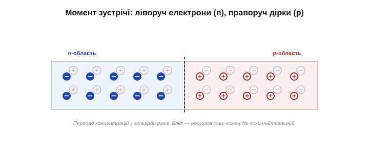
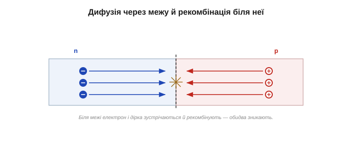
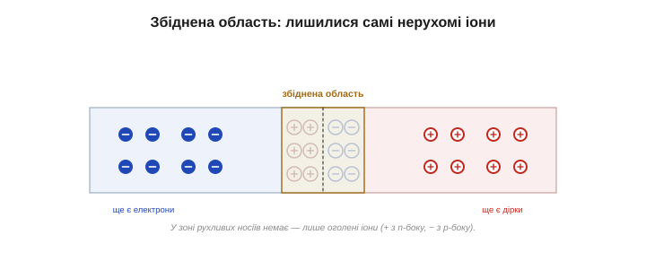
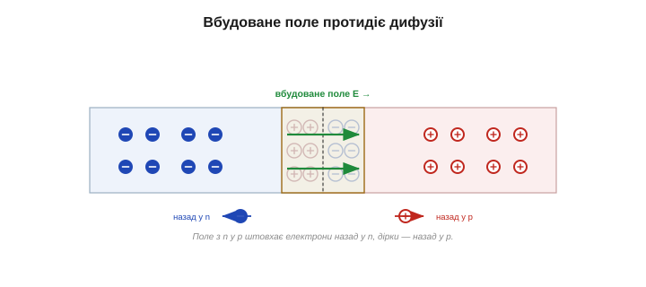
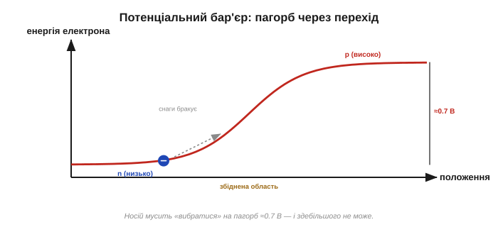
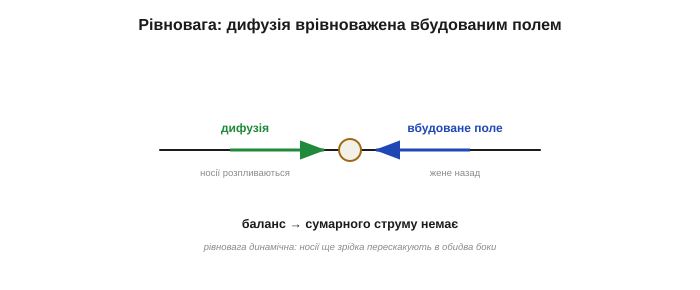

# PN-перехід: бар'єр і збіднена область

[Легування](topic:ph-condensed/doping) дає два різновиди кремнію: **n-тип** із надлишком вільних електронів і **p-тип** із надлишком дірок — кожен сам по собі нейтральний. Тепер — вирішальний крок. З'єднаймо їх в **одному** кристалі: n з одного боку, p — з іншого. Ця межа й зветься **PN-переходом** (*PN junction*). І найдивовижніше: щойно n і p опиняються поряд, на межі — **без жодної батареї** — само собою постає бар'єр, який і робить кристал клапаном. Розберімо, як він виникає; зрозуміти це — означає зрозуміти діод.

Одразу домовмося про одне: «з'єднати» тут не значить притиснути два шматки один до одного (такий стик дав би лише поганий контакт). PN-перехід **вирощують** в одному суцільному кристалі, легуючи його так, щоб одна частина стала n, а сусідня — p. Межа виходить безшовна, на рівні самої ґратки.

### Зустріч: величезний перепад концентрацій

Погляньмо на саму межу в перший уявний момент. Ліворуч, у n-області, аж кишить вільними електронами. Праворуч, у p-області, повно дірок. А посеред — тонюсінька межа, по різні боки якої концентрації носіїв відрізняються в мільярди разів. Природа таких перепадів не терпить.

Чому не терпить? Бо носії невпинно й хаотично рухаються через теплове тремтіння — снують на всі боки без жодної мети. А там, де чогось багато, випадкові блукання частіше виносять його назовні, ніж заносять назад. Тож сам **безлад** поступово вирівнює концентрації — без жодної сили, що «штовхала б» носії, лише гола статистика.

Та сама причина, чому запах із відкритого флакона за хвилину заповнює всю кімнату, а не лишається в кутку: молекули нікуди «не прагнуть», вони просто хаотично блукають — а блукаючи, неминуче розходяться рівномірно. Носії в кристалі поводяться так само, лише замість повітря довкола них ґратка кремнію.

*Уявний перший момент: ліворуч n-область, повна вільних електронів (−), праворуч p-область, повна дірок (+). На межі — величезний перепад концентрацій носіїв. Нерухомі іони домішок (бліді) поки що рівномірно «прикриті» своїми носіями, тож обидва боки нейтральні.*

### Дифузія й рекомбінація

Що роблять частинки, коли їх десь густо, а поряд порожньо? **Дифундують** — розпливаються з тісноти в простір. Так крапля чорнила розходиться у воді, а запах — кімнатою. Носії в кристалі поводяться так само: вільні електрони з n-боку линуть туди, де їх мало (у p), а дірки з p-боку — туди, де їх мало (у n). Це **дифузія** (лат. *diffundere* — розливати, розтікатися) носіїв через межу. Підкреслимо: дифузію не «вмикає» якась сила — це чистий наслідок хаотичного руху й теорії ймовірностей. Біля межі з густого n-боку приходить більше електронів, ніж повертається з рідкого p-боку, — і виходить чистий потік у p. З дірками — дзеркально. Ніхто нікого не штовхає; просто з тісноти статистично легше вийти, ніж зайти.

Але щойно електрон із n-боку забреде в p-область, повну дірок, його чекає швидкий кінець: він «провалюється» в дірку, добудовуючи розірваний зв'язок. Електрон і дірка **зникають як носії** — це **рекомбінація** (*recombination*), точна протилежність народженню [електрон-діркової пари в напівпровіднику](topic:ph-condensed/semiconductor). Так само й дірка, що зайшла в n-область, ловить там вільний електрон. Виходить, що поблизу межі носії, які перейшли кордон, дружно винищують одне одного.

Триватиме це не вічно: рекомбінація йде лише у вузькій смужці біля самої межі й гасне, щойно носії звідти зникнуть. Енергія, що вивільняється при рекомбінації, у кремнії здебільшого йде в тепло (а от у деяких інших матеріалах — у світло; саме на цьому стоїть [світлодіод](topic:hw-sensing/led-photodiode)). Поки що нам важливий лише результат: смужка обабіч межі лишається без рухливих носіїв.

*Електрони дифундують з n у p, дірки — з p у n (стрілки). Зустрічаючись біля межі, електрон і дірка рекомбінують — обидва зникають як носії. Тонкий шар обабіч межі поступово порожніє.*

### Збіднена область і відкриті іони

Носії пішли й порекомбінували — і обабіч межі утворюється тонкий шар, **позбавлений рухливих носіїв**. Його так і звуть — **збіднена область** (*depletion region*). Здавалося б, дрібниця. Та згляньмося на самі домішки: коли електрон покидає n-бік, там лишається його [донор](topic:ph-condensed/doping) — **нерухомий позитивний іон**; коли дірку в p-боці заповнено, там лишається [акцептор](topic:ph-condensed/doping) — **нерухомий негативний іон**, теж намертво вбудований у ґратку. Доти ці іони були акуратно «прикриті» своїми рухливими носіями, і кожен бік був нейтральний. А тепер носії пішли — і іони **оголилися**.

*У збідненій області рухливих носіїв немає — лишилися самі нерухомі іони: позитивні (донори) з n-боку, негативні (акцептори) з p-боку. Поза збідненою областю носії ще є, і там нейтрально.*

Отже, у збідненій області з'являється подвійний шар **зв'язаного** заряду: смужка позитивних іонів з n-боку межі й смужка негативних — з p-боку. Кристал як ціле досі нейтральний, але **локально**, на самій межі, заряди розійшлися.

Наскільки широка ця область? Дуже тонка — зазвичай частки мікрона, тонша за тисячну людської волосини; і що сильніше легований кремній (більше домішок), то вужча вона, бо потрібну кількість іонів «набирають» на коротшій відстані. Та хоч яка тонка, саме вона визначає поведінку діода. Без вільних носіїв збіднена область проводить кепсько — поводиться майже як **ізолятор**: тонкий прошарок «порожнечі» посеред провідного кристала.

Зверніть увагу й на красу балансу: сумарний відкритий «+» заряд з n-боку точно дорівнює сумарному «−» з p-боку — адже кожен електрон, що пішов, лишив по собі один іон, і кожна заповнена дірка теж. Тому перехід і назовні лишається нейтральним, попри розділені всередині заряди.

### Вбудоване поле: гальмо для дифузії

А розділені заряди — це завжди [електричне поле](topic:ph-electromagnetism/electric-field). Смужка «+» з n-боку й смужка «−» з p-боку створюють у збідненій області **вбудоване електричне поле** (*built-in field*), напрямлене від плюса до мінуса — тобто з n у p. І ось ключ: це поле **протидіє** дальшій дифузії. Електрон (заряд −), що намагається перейти з n у p, поле штовхає назад у n; дірку (+), що рветься з p у n, — назад у p. Поле працює як гальмо для тих самих носіїв, що його породили.

*Оголені іони створюють вбудоване поле (з n у p). Воно відштовхує електрони назад у n, а дірки — назад у p, тобто **протидіє** дифузії, що його ж і породила. Що більше носіїв перейшло — то ширша збіднена зона й сильніше поле.*

Тут криється саморегуляція. Що більше носіїв продифундувало, то більше іонів оголилося, то ширша збіднена область і сильніше гальмівне поле. Дифузія сама себе пригальмовує — аж поки поле не стане досить сильним, щоб **зупинити** дальший перехід.

І хоч уся різниця потенціалів тут невелика (менш як вольт), вона зосереджена в надтонкій збідненій смужці — а отже, поле в ній виходить навдивовижу **сильне** (десятки й сотні тисяч вольтів на сантиметр). Саме тому таке скромне на вигляд гальмо здатне спинити потужний дифузійний потік.

### Рівновага й потенціальний бар'єр

Так настає **рівновага**: прагнення носіїв розпливтися (дифузія) точно врівноважене вбудованим полем, що жене їх назад. Рівновага ця **динамічна**, а не мертва: найенергійніші окремі носії все одно зрідка перестрибують бар'єр в обидва боки, але зустрічні потоки точно рівні, тож сумарного струму немає. Це радше жвавий базар, де скільки людей заходить, стільки й виходить, аніж замкнені двері. Через збіднену область установлюється стала різниця потенціалів — **потенціальний бар'єр** (*built-in potential*). Його зручно уявляти як **пагорб**, на який носій мусить вибратися, щоб перейти межу: більшості «снаги» не вистачає, і перехід майже припиняється.

Можна уявити це й інакше — як двоє зустрічних натовпів, що ринули в спільні двері. Перші проходять легко, але дуже швидко в дверях утворюється тиснява зі «застряглих» (це наші оголені іони), і вона дедалі дужче відпихає тих, хто напирає ззаду. Урешті тиснява стає така, що нікого більше не пропускає, — і рух завмирає сам собою, без жодного вахтера. Бар'єр виник не тому, що хтось його поставив, а тому, що носії самі собі заступили шлях.

*Через збіднену область установлюється потенціальний бар'єр — «пагорб» висотою ≈0.7 В для кремнію (≈0.3 В для германію). У рівновазі він якраз такий, щоб зрівноважити дифузію: носії з обох боків здебільшого не можуть його подолати.*

Наскільки високий цей пагорб? Для кремнію — приблизно **0.6–0.7 вольта**, для германію — близько **0.3 В**. Звідки саме така висота? Її задає матеріал — передусім [енергетична щілина напівпровідника](topic:ph-condensed/semiconductor): ширша щілина в кремнію дає вищий бар'єр (≈0.7 В), вужча в германію — нижчий (≈0.3 В). Тому й «поріг відкривання» в кремнієвого та германієвого діодів різний, і та сама висота бар'єра пізніше проступить як «падіння напруги на діоді». І найважливіше — усе це сталося **само собою**, без жодного зовнішнього джерела: сам факт сусідства n і p породжує і збіднену область, і поле, і бар'єр.

І тут варто застерегти від спокуси: чи не можна під'єднати дротики до переходу й живитися з цих ≈0.7 В, як від крихітної батарейки? Ні. Щойно ви чіпляєте контакти, на з'єднаннях метал–напівпровідник виникають **свої** контактні бар'єри, що в сумі точно компенсують вбудований, — і повним колом напруга не йде. Це **рівноважний** бар'єр, а не запас енергії: він існує всередині, але сам по собі струму не жене. Щоб щось сталося, потрібне зовнішнє джерело. (Виняток — коли енергію в перехід вкидає світло: саме так працює сонячний елемент, що його Расселл Ол і відкрив, наткнувшись на PN-перехід у кремнії.)

*Перетягування каната в рівновазі: дифузія штовхає носії через межу, вбудоване поле жене їх назад — рівно настільки, щоб сумарний перехід припинився. Збіднена область стабілізується, бар'єр застигає на ≈0.7 В.*

> 🔧 **Навіщо це.** Збіднена область і потенціальний бар'єр — це і є «механіка» діода. Збіднена зона без рухливих носіїв поводиться майже як ізолятор — ось чому перехід у спокої струму не пропускає. А висота бар'єра (≈0.7 В) задає, скільки напруги треба «докласти», щоб [діод відкрився й пропустив струм](topic:hw-components/diode-iv-curve). Усе подальше — пряме й зворотне зміщення, випрямлення, навіть світлодіод — це різні способи **керувати** цим бар'єром.

Зберімо картину докупи. На межі n і p — **самі собою**, без жодної батареї — виникли: (1) **збіднена область** без рухливих носіїв; (2) подвійний шар нерухомих іонів (+ з n-боку, − з p-боку); (3) **вбудоване поле** через цю область; (4) **потенціальний бар'єр** ≈0.7 В, що зрівноважує дифузію. Усе це — рівноважний стан спокою: жодного струму, жодної зовнішньої напруги. Перехід просто «сидить» зі своїм бар'єром і чекає, що ми з ним зробимо.

Цей бар'єр — не мертвий рубіж, а саме те, на чому стоїть діод. Уся хитрість у тому, що він **по-різному** відповідає на зовнішню напругу залежно від її напрямку. Прикласти її «в один бік» — і носії наваляться на бар'єр, зіб'ють його, збіднена область звузиться й відкриє дорогу струму; прикласти «в інший» — і напруга відтягне носії геть, бар'єр зросте, збіднена область поширшає, а перехід замкнеться ще міцніше. Саме ця однобічна відповідь бар'єра на [пряме й зворотне зміщення](topic:hw-components/diode-bias) і робить безшовний стик n і p клапаном для струму — тією самою однобічністю, яку Карл Фердинанд Браун ще 1874 року вперше помітив у кристалі мінералу, навіть не знаючи її причини.

---
