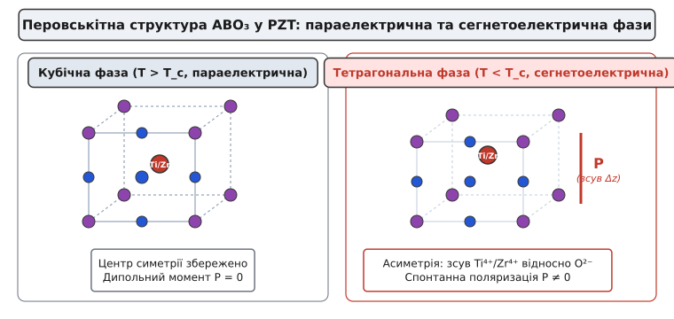
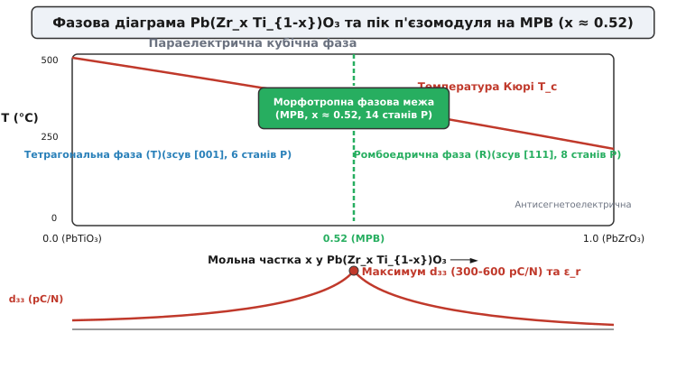
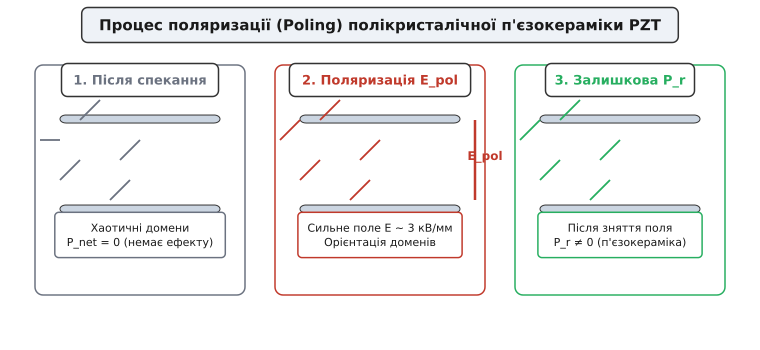
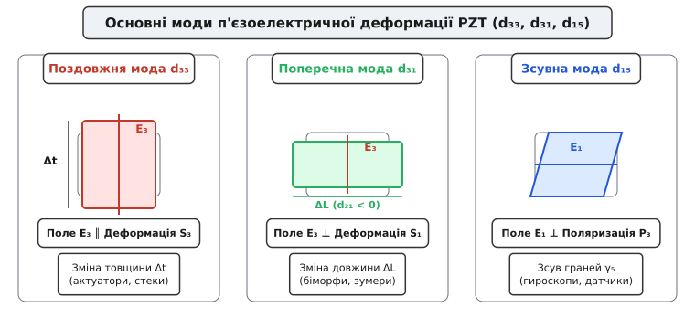
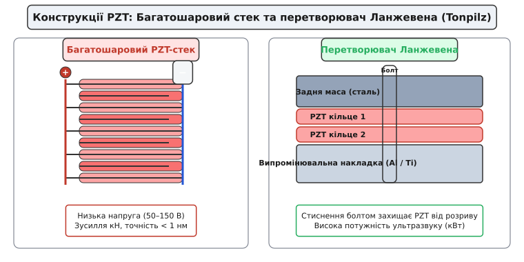

# П'єзокераміка (PZT)

<preknowlist>
- [П'єзоефект](topic:ph-condensed/piezoelectric-effect-quartz-resonance) — прямий і зворотний п'єзоелектричний ефект, симетрія кристалів, механічний резонанс.
- [Електричне поле](topic:ph-electromagnetism/electric-field) — вектор напруженості електричного поля, різниця потенціалів, поляризація діелектриків.
- [Закон Кулона](topic:ph-electromagnetism/coulomb-law) — електростатична взаємодія зарядів та іонні зв'язки в кристалічній ґратці.
- [Насичення та гістерезис](topic:ph-condensed/saturation-hysteresis) — сегнетоелектричні домени, петля гістерезису, залишкова поляризація.
</preknowlist>

Коли 1880 року брати П'єр і Жак Кюрі відкрили прямий п'єзоелектричний ефект у монокристалах кварцу, турмаліну та сегнетової солі, фізика отримала прямий місток між механічним напруженням і електричним зарядом. Проте природні монокристали мали фундаментальне обмеження, яке зупиняло їхнє використання у синій інженерії: їхній п'єзоелектричний модуль був мізерним. Для α-кварцу поздовжній коефіцієнт деформації `d[11]` становить лише `2.3 pC/N` (пікокулонів на ньютон або метрів на вольт). Аби змістити граничну поверхню кварцової пластини бодай на один мікрометр, до неї довелося б прикласти електричну напругу в сотні кіловольт. Крім того, вирощування або видобуток великих однорідних монокристалів без кристалографічних дефектів — надзвичайно дороге, прикро марудне й повільне виробництво, що унеможливлювало масовий випуск силових актуаторів.

Справжній інженерний прорив стався в середині XX століття, коли науковці навчилися створювати штучні полікристалічні сегнетоелектричні матеріали — **п'єзокераміку**. Головним королем п'єзотехніки став **цирконат-титанат свинцю** (Lead Zirconate Titanate, або **PZT**) — твердий розчин із хімічною формулою `Pb[Zr[x] Ti[1-x]] O[3]`. У PZT поздовжній п'єзоелектричний модуль `d[33]` сягає від `300` до `600 pC/N`, що у `130–250` разів перевищує показники кварцу. Саме завдяки PZT п'єзоефект перетворився з чутливого інструменту точних кварцових годинників на потужний силовий двигун сучасного світу: від мікроскопічних приводів у скануючих атомних мікроскопах та паливних форсунках дизельних двигунів до потужних випромінювачів сонарів, ультразвукової медицини, деструкції ниркових каменів та промислового зварювання пластмас.

Проте головний заколот п'єзокераміки полягає в тому, що одразу після спекання у високотемпературній печі керамічний брусок не має жодного п'єзоефекту взагалі. Щоб перетворити спечений керамічний ізолятор на робочий п'єзоелектрик, необхідно здійснити складну внутрішньокристалічну маніпуляцію — **поляризацію** у високому постійному електричному полі.

---

### Від монокристалів до спеченого порошку: межі природного кварцу

Монокристал кварцу має ідеальну впорядкованість: кожна комірка діоксиду кремнію `SiO₂` орієнтована строго в одному напрямку вздовж кристалографічних осей. Проте пружність жорстких ковалентних зв'язків між кремнієм та киснем надзвичайно висока, а зміщення центрів зарядів при деформації — мінімальне. Кварц ідеально підходить для високодобротних резонаторів опорної частоти, де потрібна гостра часова та температурна стабільність, але він абсолютно непридатний там, де від матеріалу вимагається значна механічна сила чи відчутне фізичне переміщення від помірної електричної напруги.

Сегнетова сіль (`KNaC₄H₄O₆ · 4H₂O`), яка давала куди сильніший електричний відгук через наявність спонтанної поляризації, виявилася надто крихкою, розчинялася у воді та розпадалася через фазовий перехід уже при температурі `55 °C`. Інженерам був потрібен матеріал із трьома немислимими раніше властивостями одразу:
1. Колосальний п'єзоелектричний коефіцієнт (сильний електлектромеханічний зв'язок між полем і деформацією);
2. Висока механічна та хімічна міцність, стійкість до вологи й нагріву понад `150–200 °C`;
3. Технологічність виготовлення: можливість випікати методом порошкової металургії деталі будь-якої геометричної форми — диски, кільця, трубки, пластини та багатошарові плівкові структури.

Виготовлення PZT починається зі ретельного змішування вихідних високочистих оксидів `PbO`, `ZrO₂` та `TiO₂` у кульових млинах. Суміш піддають твердофазному синтезу (кальцинації) при температурах `800–900 °C`, під час якої утворюється перовськітна фаза PZT. Після повторного подрібнення та розпилювального сушіння порошок пресують у сталевих прес-формах із додаванням термопластичного органічного зв'язуючого і спекають при температурах `1150–1280 °C` у герметичних тиглях із засипкою з `PbZrO₃` для придушення летючості оксиду свинцю. Під час спекання відбувається рекристалізація та ущільнення керамічного тіла до `95–98%` від теоретичної густини (`ρ ≈ 7.5–7.8 g/cm³`).

Відповіддю стало відкриття сегнетоелектричних керамік зі структурою **перовськіту**. Детальний аналітичний огляд історичного шляху від відкриття титанату барію під час Другої світової війни до створення класичних складів PZT у лабораторних центрах США та Японії викладено у вставці [📜 Історія відкриття PZT та сегнетоелектричної кераміки](topic:ph-condensed/pzt-piezo-ceramics/hist-pzt-discovery.md).

---

### Кристалохімія перовськіту та спонтанна поляризація

Кристалічна структура PZT належить до типу перовськіту (загальна формула `ABO₃`, названа на честь уральського мінералога Л. А. Перовського). Елементарна комірка цього матеріалу являє собою тривимірний куб або прямокутний паралелепіпед:

- У вершинах куба (позиція **A**) розташовані важкі двовалентні іони свинцю `Pb²⁺`.
- У центрі кожної з шести граней куба розташовані двовалентні аніони кисню `O²⁻`, які утворюють жорсткий кисневий октаедр.
- У самому центрі комірки (позиція **B**, всередині кисневого октаедра) знаходиться чотиривалентний катіон — титан `Ti⁴⁺` або цирконій `Zr⁴⁺`.


*Перовськітна структура ABO₃ у PZT. Ліворуч — кубічна параелектрична фаза при T > T_c (центр симетрії збережено, дипольний момент P = 0). Праворуч — тетрагональна сегнетоелектрична фаза при T < T_c, де іон Ti⁴⁺/Zr⁴⁺ зміщений відносно кисневого октаедра, створюючи спонтанну поляризацію P.*

Ключовий фізичний процес відбувається при охолодженні матеріалу нижче критичної межі — **температури Кюрі** (`T_c`, яка для різних складів PZT становить від `200 °C` до `400 °C`):

1. **Вище температури Кюрі (`T > T_c`)**: Кераміка перебуває в **кубічній фазі**. Центр ваги позитивних зарядів (`Pb²⁺` та `Ti⁴⁺/Zr⁴⁺`) строго збігається з центром ваги від'ємних зарядів (`O²⁻`). Комірка є центросиметричною. У такому стані матеріал є параелектриком і **не має п'єзоефекту**.
2. **Нижче температури Кюрі (`T < T_c`)**: Кубічна ґратка стає енергетично нестабільною. Відбувається фазовий перехід другого або першого роду зі спонтанним деформуванням ґратки. Центральний іон `Ti⁴⁺` або `Zr⁴⁺` вискакує з симетричного положення і зміщується уздовж однієї з кристалографічних осей відносно кисневого октаедра на частки ангстрема (`Δz ≈ 0.1 Å`).

Через це зміщення центри додатних і від'ємних зарядів розходяться у просторі. Кожна окрема елементарна комірка набуває постійного **спонтанного електричного дипольного моменту** `P`. Кристалічна комірка видовжується вздовж осі зміщення і стискається в перпендикулярних напрямках. Це явище має назву **сегнетоелектрика** (*ferroelectricity*). Згідно з феноменологічною теорією Ландау — Девоншира, спонтанна поляризація виникає внаслідок мінімізації термодинамічного потенціалу Гіббса при зниженні температури нижче `T_c`.

---

### Морфотропна фазова межа (MPB): точки надзвичайного підсилення

Чому саме цирконат-титанат свинцю став головним матеріалом п'єзотехніки, а не чистий титанат свинцю `PbTiO₃` чи чистий цирконат свинцю `PbZrO₃`?

Відповідь ховається у фазовій діаграмі стану твердого розчину `Pb[Zr[x] Ti[1-x]] O[3]`. Змінюючи співвідношення мольних часток цирконію `x` та титану `1-x`, ми кардинально змінюємо симетрію низькотемпературної фази:

- При високому вмісті титану (`x < 0.48`) комірки при охолодженні деформуються тетрагонально (видовження вздовж вісі `[001]`). У такій ґратці є **6 можливих напрямків** спонтанної поляризації (вгору, вниз, вліво, вправо, вперед, назад).
- При високому вмісті цирконію (`0.53 < x < 0.94`) комірки деформуються ромбоедрично (видовження вздовж просторових діагоналей куба `[111]`). У такій ґратці є **8 можливих напрямків** спонтанної поляризації.


*Фазова діаграма твердого розчину Pb(Zr_x Ti_{1-x})O₃. На морфотропній фазовій межі (MPB) при x ≈ 0.52 співіснують тетрагональна та ромбоедрична фази, що дає 14 рівноцінних напрямків поляризації та колосальний пік п'єзомодуля d₃₃ та діелектричної проникності ε_r.*

Поблизу критичного складу **`x ≈ 0.52`** (точна пропорція 52% `PbZrO₃` та 48% `PbTiO₃`) розташована вузька фазова межа, яка майже незалежна від температури — **Морфотропна фазова межа** (Morphotropic Phase Boundary, або **MPB**).

У цій точці термодинамічні вільно-енергетичні бар'єри між тетрагональною та ромбоедричною фазами стають мізерно малими. У кристалічному об'ємі одночасно співіснують обидві кристалографічні симетрії. Це означає, що вектор поляризації отримує не 6 і не 8, а **14 рівноцінних напрямків** для орієнтації у просторі!

На морфотропній межі кристалічна ґратка стає неймовірно «податливою» для зовнішнього електричного поля чи механічного зусилля. Вектор дипольного моменту легко повертається під дією найменшого зовнішнього поля. Саме на MPB спостерігається гігантський екстремум усіх головних характеристик:
- Поздовжній п'єзомодуль `d[33]` зростає від `50 pC/N` (у чистих фазах) до `300–600 pC/N`;
- Відносна діелектрична проникність `ε[r]` досягає `1500–3500`;
- Коефіцієнт електромеханічного зв'язку `k[33]` досягає `0.70–0.75` (тобто до 75% накопиченої електричної енергії може напряму перетворюватися на механічную потенціальну енергію деформації).

---

### Технологія поляризації (Poling) та стійкість до деполяризації

Спечена PZT-кераміка складається з мільярдів мікроскопічних кристалічних зерен (кристалітів розміром `1–5 мкм`), випадково орієнтованих у просторі. Усередині кожного зерна під час охолодження нижче `T_c` утворюються **сегнетоелектричні домени** — мікроскопічні області, в яких спонтанна поляризація сусідніх комірок спрямована в один бік через квантовомеханічну взаємодію сусідніх диполів.

Проте у свіжоспеченому зразку вектори поляризації різних доменів і зерен спрямовані хаотично по всіх 14 напрямках. Сумарний макроскопічний дипольний момент об'єму дорівнює нулю:

```
P_sum = ∑ P_domain = 0
```

Такий матеріал є макроскопічно ізотропним і не має п'єзоефекту: коли ви стискаєте брусок, деформація одних доменів створює позитивний заряд, а інших — негативний, і вони повністю взаємно гасяться на зовнішніх електродах.

Щоб наділити кераміку п'єзовластивостями, застосовують технологічний процес **поляризації** (*poling*):

1. На протилежні грані керамічного зразка наносять срібні або нікелеві електроди шляхом впалювання пасти або вакуумного напилення.
2. Зразок занурюють у диелектричне силіконове масло і нагрівають до температури `100–150 °C`. Висока температура знижує коерцитивне поле та підвищує рухливість доменних стінок.
3. До електродів прикладають сильне постійне електричне поле поляризації `E[pol] = 2.0–4.0 kV/mm` (тобто від 2000 до 4000 вольт на кожен міліметр товщини кераміки).


*Три етапи поляризації (Poling) п'єзокераміки: 1 — свіжоспечена кераміка з хаотичними доменами (P_sum = 0); 2 — вплив сильного поля E_pol при підвищеній температурі; 3 — результуючий стан залишкової поляризації P_r після зняття поля.*

Під дією поля 90-градусні та 180-градусні домени розвертаються й переорієнтовуються вздовж зовнішніх силових ліній у той із 14 доступних напрямків MPB, який є найближчим до поля. Зразок витримують під напругою 10–30 хвилин, після чого охолоджують до кімнатної температури **не знімаючи електричного поля**.

Коли поле вимикають, атоми не можуть повернутися у вихідний хаотичний стан через високий енергетичний бар'єр переорієнтації при низькій температурі. У кераміці фіксується **залишкова поляризація** `P_r`. Кераміка стає анізотропною та п'єзоактивною: вісь, уздовж якої прикладалося поле, умовно позначають як **вісь 3** (або ось поляризації `Z`). При тривалій експлуатації спостерігається логарифмічне старіння залишкової поляризації та деформаційних модулів (`Δd/d ∝ -log(t)`), що вимагає попереднього штучного загартування керамічних деталей термоцикліруванням.

#### Втрата поляризації (Деполяризація)

Поляризований стан кераміки є метастабільним. П'єзокераміка може назавжди втратити свої властивості (деполяризуватися) під дією трьох руйнівних чинників:

1. **Термічна деполяризація**: Якщо нагріти зразок вище температури Кюрі `T > T_c`, тепловий рух атомів повністю руйнує асиметрію ґратки, і кераміка назавжди стає параелектричною. Практична робоча температура PZT обмежується межею `T_max ≈ (0.5–0.6) · T_c` (зазвичай не вище `150–200 °C`).
2. **Електрична деполяризація**: Якщо прикласти до кераміки зворотне електричне поле, яке перевищує коерцитивну силу матеріалу `E_c` (зазвичай `0.5–1.5 kV/mm`), домени переорієнтуються проти початкового напрямку або роздеполяризуються.
3. **Механічна деполяризація**: Сильний механічний удар або надмірне стискальне напруження (понад `50–100 MPa`) примусово переорієнтовує доменні диполі перпендикулярно до осі тиску, знищуючи залишкову поляризацію.

---

### Легування та поділювання модифікацій: м'які та жорсткі PZT

Чистий базовий склад PZT рідко застосовують у промисловості. Змінюючи мікроструктуру шляхом легування (введення домішок у частках відсотка), інженери навчилися керувати рухливістю доменних стінок. За цією ознакою всю п'єзокераміку PZT поділяють на два великі класи: **сегнетом'яку** (*Soft PZT*) та **сегнетожорстку** (*Hard PZT*).

```
                      ┌─────────────────────────────────────────┐
                      │    Спечена кераміка PZT (PbZr_x Ti_1-x O_3)│
                      └────────────────────┬────────────────────┘
                                           │
                    ┌──────────────────────┴──────────────────────┐
                    ▼                                             ▼
       ┌──────────────────────────┐                  ┌──────────────────────────┐
       │   М'яка кераміка (Soft)  │                  │  Жорстка кераміка (Hard) │
       │  (Донорна домішка: La, Nb)│                  │ (Акцепторна домішка: Fe, Mn)│
       ├──────────────────────────┤                  ├──────────────────────────┤
       │ • Високий d₃₃ (400-600)  │                  │ • Помірний d₃₃ (200-300) │
       │ • Висока проникність ε   │                  │ • Низькі втрати (tan δ)  │
       │ • Низька добротність Q_m │                  │ • Висока добротність Q_m │
       │ • Легка деполяризація    │                  │ • Стійкість до перевантажень│
       └────────────┬─────────────┘                  └────────────┬─────────────┘
                    │                                             │
                    ▼                                             ▼
       Давачі, мікроприводи, hydrophones             Силовий ультразвук, зварювання,
       позиціонування нанометрів                     сонари, мийки, Langevin-головки
```

#### 1. Сегнетом'яка кераміка (Soft PZT, наприклад PZT-5A, PZT-5H)
Отримують шляхом **донорного легування**: іони `Pb²⁺` заміщують тривалентними іонами лантану `La³⁺`, або іони `Ti⁴⁺/Zr⁴⁺` заміщують п'ятивалентним ніобієм `Nb⁵⁺`.

Щоб зберегти електронейтральність ґратки, донорна домішка змушує утворюватися **катіонні вакансії** (порожні вузли у підґратці свинцю). Ці вакансії полегшують послаблення внутрішніх напружень: доменні стінки стають надзвичайно рухливими.

- **Властивості**: Величезні значення `d[33]` (до `600 pC/N`), висока діелектрична проникність (`ε[r] > 3000`), висока чутливість.
- **Недоліки**: Низька механічна добротність (`Q_m ≈ 50–100`), високі діелектричні втрати (`tan δ ≈ 2–3%`), низька коерцитивна сила (легко деполяризується).
- **Застосування**: Чутливі давачі тиску й деформації, гідрофони, мікроактюатори позиціонування голки в АФМ-мікроскопах, п'єзоелектричні звукознімачі.

#### 2. Сегнетожорстка кераміка (Hard PZT, наприклад PZT-4, PZT-8)
Отримують шляхом **акцепторного легування**: іони `Ti⁴⁺/Zr⁴⁺` заміщують дво- або тривалентними іонами заліза `Fe³⁺`, марганцю `Mn²⁺` чи магнію `Mg²⁺`.

Це викликає утворення **аніонних вакансій кисню** (`V_O`). Комплекси з домішкових іонів та кисневих вакансій утворюють стійкі дефектні диполі, які закріплюють («запиняють», *pinning*) доменні межі. Доменні стінки стають жорстко зафіксованими.

- **Властивості**: Висока механічна добротність (`Q_m = 500–2000`), малі діелектричні втрати (`tan δ < 0.4%`), висока стійкість до електричної та механічної деполяризації.
- **Недоліки**: Помірні значення п'єзомодуля `d[33]` (`200–300 pC/N`).
- **Застосування**: Силова ультразвукова техніка (ультразвукові ванни, промислові випромінювачі для миття, ванни зварювання пластмас, гідролокатори високої потужності).

Повний порівняльний довідник фізико-механічних та електричних параметрів стандартних марок PZT наведено у вставці [📋 Параметри та специфікація п'єзокерамічних матеріалів PZT](topic:ph-condensed/pzt-piezo-ceramics/api-pzt-parameters.md).

---

### Тензорні рівняння стану та моди деформації

П'єзокераміка після поляризації стає трансверсально-ізотропним середовищем (група симетрії `C[6v]`). Опис її поведінки вимагає тензорного зв'язку між трьома векторами поляризації/напруженості та шістьма компонентами механічного тензора напружень/деформацій.

У загальноприйнятому стандарті IEEE напрямки позначають цифровими індексами: `1, 2, 3` відповідають вісям `X, Y, Z` (де **3** — це завжди вісь поляризації), а `4, 5, 6` відповідають зсувним деформаціям навколо цих осей.


*Основні геометричні моди п'єзоелектричної деформації PZT: поздовжня мода d₃₃ (E₃ ║ S₃), поперечна мода d₃₁ (E₃ ⊥ S₁) та зсувна мода d₁₅ (E₁ ⊥ P₃).*

Лінійні рівняння стану п'єзоелектрика у формі «деформація-заряд» мають вигляд:

```
S[i] = s[ij]^E · T[j] + d[ki] · E[k]
D[i] = d[ij]   · T[j] + ε[ik]^T · E[k]
```

Де:
- `S[i]` — безрозмірна механічна деформація;
- `T[j]` — механічне напруження (Па);
- `E[k]` — напруженість електричного поля (В/м);
- `D[i]` — електрична індукція (Кл/м²);
- `s[ij]^E` — модуль механічної гнучкості при постійному електричному полі;
- `d[ki]` — тензор п'єзоелектричних модулів (Кл/Н або м/В);
- `ε[ik]^T` — абсолютна діелектрична проникність при постійному напруженні.

Завдяки симетрії поляризованої кераміки з 18 можливих коефіцієнтів `d[ki]` ненульовими залишаються лише три головні моди:

1. **Поздовжня мода `d[33]`**: Електричне поле прикладається вздовж осі поляризації 3, і деформація вимірюється вздовж цієї ж осі 3.
   ```
   S[3] = d[33] · E[3]
   ```
   Зразок змінює свою товщину `Δt = d[33] · U`. Для PZT-5H значення `d[33] ≈ +590 pC/N`.

2. **Поперечна мода `d[31]`**: Електричне поле прикладається вздовж осі 3, але викликає деформацію стиску/розтягу у перпендикуляційній площині (вздовж осі 1 або 2).
   ```
   S[1] = d[31] · E[3]
   ```
   Зверніть увагу: знак `d[31]` завжди протилежний до `d[33]` (для PZT-5H `d[31] ≈ -270 pC/N`). Тобто при розширенні кераміки за товщиною вона одночасно стискається у довжину, зберігаючи свій об'єм майже незмінним.

3. **Зсувна мода `d[15]`**: Електричне поле прикладається перпендикулярно до осі поляризації (вздовж осі 1), викликаючи зсувну деформацію граней.
   ```
   S[5] = d[15] · E[1]
   ```
   Цей коефіцієнт у PZT є найбільшим і може досягати `700–800 pC/N`.

Окрім п'єзоелектричного модуля заряда `d[ij]`, важливим параметром давачів є п'єзоелектричний модуль напруги `g[ij] = d[ij] / ε[ij]^T`, який виражає електричне поле, що виникає при прикладенні одиничного механічного напруження:

```
E[3] = -g[33] · T[3]
```

При роботі в режимі сильного сигналу виникає нелінійний гістерезис деформації, який описується феноменологічною моделлю Релеївського зсуву доменних стінок (`S = d · E + α · E²`).

Строгий математичний вивід матриць симетрії, тензорних рівнянь та формул розрахунку резонансних частот п'єзопластин наведено у вставці [🧮 Математика п'єзомодулів і тензорних рівнянь PZT](topic:ph-condensed/pzt-piezo-ceramics/math-piezo-tensors.md).

---

### Конструктивні втілення: біморфи, багатошарові стеки та перетворювачі Ланжевена

Оскільки деформація монолітної кераміки є відносно малою (навіть при напруженості поля `1 kV/mm` відносне видовження `S₃ = d₃₃ · E₃` становить близько `0.05–0.1%`), для практичних застосувань розроблено спеціальні геометричні конструкції актуаторів та випромінювачів.


*Конструктивні втілення PZT: ліворуч — багатошаровий стек актуатора із паралельними внутрішніми електродами для керування низькою напругою (50–150 В); праворуч — силовий ультразвуковий перетворювач Ланжевена (Tonpilz) із стяжним центральним болтом.*

#### 1. Згинальні елементи: Юніморфи та Біморфи
Щоб отримати великі переміщення (до кількох міліметрів) від низької напруги, використовують принцип біметалевої пластини.
- **Unimorph**: Одинарна пластинка PZT наклеюється на тонкий металевий диск або пластину (латунь, бронза). При подачі напруги кераміка стискається вздовж осі 1 (`d[31]`), а метал не змінює розмірів. Внаслідок цього пластинка прогинається куполом. Саме так влаштовані дешеві **п'єзовипромінювачі-пищалки** (п'єзозумери).
- **Bimorph**: Дві пластинки PZT склеєні разом так, що при подачі напруги одна розширюється, а інша стискається. Згинальний рух ампліфікується у сотні разів.

#### 2. Багатошарові актуатори (PZT Stacks)
Щоб отримати велике зусилля (до кількох кілоньютонів) при збереженні низької робочої напруги (`50–150 V` замість кіловольт), кераміку виготовляють у вигляді **багатошарового стека** (*multilayer stack*).

Замість одного товстого бруса кераміки товщиною `10 мм` випікають монолітний пакет із 100 тонких керамічних плівок товщиною `100 мкм` кожна, перекладених внутрішніми зустрічно-паралельними срібно-паладієвими електродами.

Оскільки напруженість поля `E = U / t`, зменшення товщини шару `t` у 100 разів дозволяє отримати те саме величезне поле при напрузі всього `100 В`. При цьому ходи всіх 100 шарів підсумовуються послідовно:

```
ΔL_total = N · d[33] · U
```

Стекові актуатори здатні рухати вантажі масою в сотні кілограмів із точністю до часток нанометра. Їх застосовують у паливних форсунках Common Rail, системі активного гасіння вібрацій оптичних дзеркал та адаптивній астрономічній оптиці.

#### 3. Перетворювачі Ланжевена (Tonpilz / Langevin Transducers)
Головний ворог п'єзокераміки при роботі на великій потужності — її низька міцність на розрив. Кераміка витримує колосальні стискальні навантаження (до `500 MPa`), але розсипається при розтягуванні понад `20–30 MPa`.

Коли п'єзоелемент випромінює потужний ультразвук на резонансі, інерційні сили при зворотному ході розривають кераміку. Щоб запобігти цьому, французький фізик Поль Ланжевен винайшов конструкцію під назвою **Tonpilz** (з нім. *«звуковий гриб»*):

1. Двоє або декілька кілець PZT затискають між двома масивними металевими накладками.
2. Задня накладка робиться з важкого металу (сталь або бронза), а передня випромінювальна накладка — з легкого та міцного (алюміній або титан).
3. Вся конструкція наскрізно стягується **високоміцним сталевим болтом** із величезним попереднім механічним натягом (`20–40 MPa`).

Завдяки болту керамічні кільця завжди перебувають у стані механічного стиску. Навіть під час найпотужніших коливань амплітуда розтягу лише зменшує стиск, але ніколи не переводить кераміку в область небезпечних розтягувальних напружень.

Крім того, для передачі акустичної енергії у воду чи людське тіло вимагається узгодження акустичних імпедансів `Z = ρ · v`. Оскільки кераміка має високий імпеданс (`Z_pzt ≈ 30 · 10⁶ kg/(m²·s)`), а вода/тканина — низький (`Z_water ≈ 1.5 · 10⁶ kg/(m²·s)`), на передню поверхню наклеюють чвертьхвильовий узгоджувальний шар (*λ/4 matching layer*) з оптимальним імпедансом `Z_match = √(Z_pzt · Z_water)`.

Технічні специфікації, правила монтажу та класифікацію п'єзокерамічних елементів висвітлено у вставці [🔌 П'єзокерамічні приводи та перетворювачі: типи й конструкції](topic:ph-condensed/pzt-piezo-ceramics/comp-piezo-actuator.md).

---

### Схемотехнічні особливості: ємнісне навантаження та резонансний драйвер

З точки зору електричного кола, п'єзокерамічний елемент є **високодобротним ємнісним навантаженням** із паразитними резистивними втратами.

Еквівалентна електрична схема PZT поблизу резонансу описується моделлю Баттерворта — Ван-Дайка (BVD):

```
       ┌───────────[ C₀ ]───────────┐  (Статична ємність кераміки)
───○───┤                            ├───○───
       └─[ R_m ]──[ L_m ]──[ C_m ]──┘  (Динамічна механічна гілка)
```

- **Статична ємність `C₀`**: Ємність звичайного плоского конденсатора, утвореного керамічним диелектриком із діелектричною проникністю `ε[r]`. Вона становить від кількох нанофарад у дисках до `1–10 мкФ` у багатошарових стеках.
- **Динамічна гілка (`R_m, L_m, C_m`)**: Моделює механічну систему: еквівалентна індуктивність `L_m` відповідає масі зразка, ємність `C_m` — механічній гнучкості, а опір `R_m` — механічним втратам і випроміненій акустичній енергії.

```
                     Резонансні частоти PZT:
                     
  Імпеданс |Z|
      ▲
      │       /│
      │      / │ 
      │     /  │  f_a (Антирезонанс, максимальний імпеданс)
      │    /   │  
      │   /    │  
      │  /     │  
      │ /      └──────────
      │/  f_r (Серійний резонанс, мінімальний імпеданс)
──────┼───────────────────────► Частота f
```

При збудженні PZT виникає дві характерні частоти:
- **Послідовний резонанс `f_r`**: Індуктивність `L_m` та ємність `C_m` резонують між собою. Імпеданс падає до мінімуму (`Z = R_m`). Струм максимальний, коливання максимальні.
- **Паралельний антирезонанс `f_a`**: Динамічна гілка резонує зі статичною ємністю `C₀`. Імпеданс досягає величезного піка, струм мінімальний.

#### Проблема керування PZT

Звичайний підсилювач напруги відчуває серйозні проблеми при роботі з PZT. На високих частотах статична ємність `C₀` створює колосальний реактивний струм `I = 2π f C₀ U`. Це призводить до марного нагрівання транзисторів драйвера та виходу з ладу через кидки струму при перемиканні. Нагрів п'єзоелемента викликає додаткове зростання діелектричних втрат (`tan δ`), що приводить до теплового розгону і незворотного виходу з ладу при перевищенні допустимої щільності потужності.

Для ефективного живлення силових PZT-випромінювачів застосовують **резонансні інвертори** (наприклад, мостові чи напівмостові схеми з послідовним або паралельним компенсаційним дроселем `L_comp`). Дросель розраховують так, щоб він утворював LC-контур зі статичною ємністю `C₀` на робочій частоті, повністю компенсуючи реактивний струм.

Крім того, оскільки нагрівання кераміки та механічне навантаження зміщують резонансну частоту `f_r`, силові драйвери обов'язково оснащують **системою автопідлаштування частоти (ФАПЧ / PLL)**, яка відстежує фазовий зсув між струмом і напругою, утримуючи режим нульового перемикання напруги (ZVS).

Повну схему драйвера, алгоритм пошуку резонансної частоти та робочу реалізацію мовами C і C++ наведено у вставці [⚙️ Проєкт драйвера PZT-стека та ультразвукового генератора](topic:ph-condensed/pzt-piezo-ceramics/proj-piezo-driver.md).

---

### Екологічний виклик та безсвинцеві п'єзоматеріали (KNN, BNT)

Попри неперевершені технічні характеристики, PZT має один фатальний недолік: оксид свинцю `PbO` становить понад **60% маси** керамічного зразка.

Під час випалу PZT при температурах `1100–1250 °C` токсичний оксид свинцю інтенсивно випаровується у довкілля. Утилізація відпрацьованої електроніки з PZT створює важке свинець-забруднення ґрунтів і ґрунтових вод.

Європейська директива **RoHS** (*Restriction of Hazardous Substances*) суворо обмежила використання свинцю в електроніці. Для PZT було зроблено тимчасовий виняток через відсутність повноцінних замінників у силовому ультразвуку та медицині, проте науковий світ активно шукає безсвинцеві п'єзоматеріали (*lead-free piezo-ceramics*).

Головні кандидати на заміну PZT:

1. **Ниобат калію-натрію (`(K,Na)NbO₃`, або KNN)**:
   Твердий розчин `KNbO₃` та `NaNbO₃`. На морфотропній межі KNN досягає п'єзомодулів `d[33] ≈ 200–400 pC/N` та має високу температуру Кюрі (`T_c ≈ 400 °C`). Головна проблема — складність спекання через летючість іонів лужних металів (калію та натрію).
2. **Титанат вісмуту-натрію (`(Bi[0.5]Na[0.5])TiO₃`, або BNT)**:
   Має колосальну спонтанну поляризацію та високу коерцитивну силу, але має високі діелектричні втрати й відносно низьку деполяризаційну температуру.
3. **Титанат барію (`BaTiO₃`)**:
   Історично перший сегнетоелектрик (`d[33] ≈ 190 pC/N`). Він нетоксичний і широко використовується в багатошарових керамічних конденсаторах (MLCC), але його температура Кюрі становить лише `120 °C`, що робить його непридатним для автомобільних та промислових застосувань.

> 🔧 **Навіщо це.** Сьогодні PZT лишається абсолютним стандартом промисловості. Якщо ви розробляєте медичний УЗД-сканер, далекомір, паливну форсунку чи промислову ванну мийки — ви працюватимете саме з PZT-4 чи PZT-8. Але розуміння фізики MPB, механізмів поляризації та температурних обмежень дозволить вам правильно розрахувати тепловий режим актуатора, уникнути деполяризації від зворотної напруги та побудувати надійний резонансний драйвер без ризику спалити кераміку.
