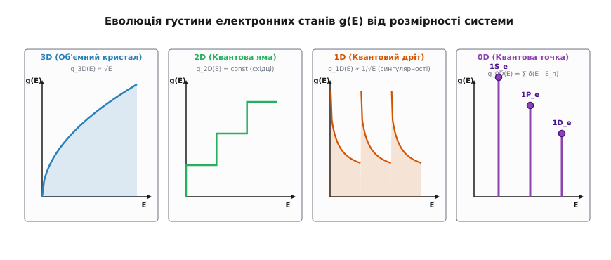
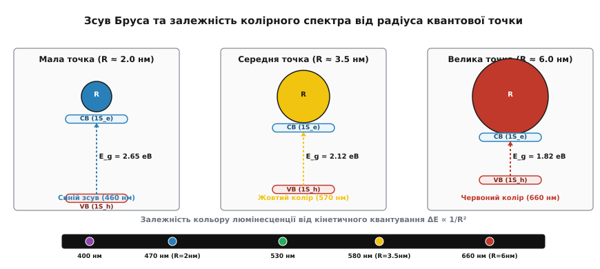
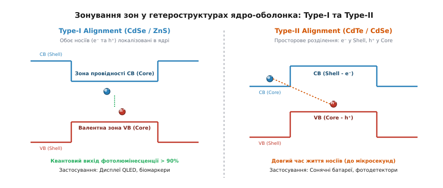
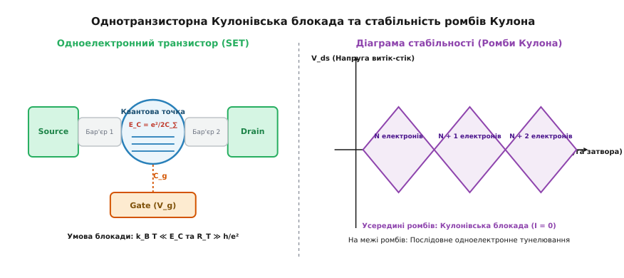

# Фізика квантових точок (0D наноструктури)

<preknowlist>
- [Зонна теорія твердого тіла](root:ph-condensed/band-theory) — валентна зона, зона провідності та формування енергетичного спектра у кристалі.
- [Одновимірне стаціонарне рівняння Шредінгера](root:ph-quantum/stationary-schrodinger-equation) — квантування енергії у потенціальних ямах.
- [Квантування енергії](root:ph-quantum/energy-quantization) — дискретний спектр рівнів у квантово-обмежених системах.
- [Квантові ями](root:ph-condensed/quantum-well) — двовимірний рух носіїв та квантово-розмірний ефект.
- [Принцип заборони Паулі](root:ph-quantum/pauli-exclusion) — ферміонне заповнення дискретних електронних оболонок.
</preknowlist>

У макроскопічному напівпровідниковому кристалі селеніду кадмію (`CdSe`), арсеніду галію (`GaAs`) чи фосфіду індію (`InP`) ширина забороненої зони `E_g` є фундаментальною числовою константою матеріалу. Вона суворо визначається хімічним складом речовини та періодичною симетрією кристалічної ґратки. Оптичне поглинання такого кристала має чітку порогову межу: фотони з енергією, меншою за ширину забороненої зони `h·ν < E_g`, проходять крізь кристал без взаємодії, тоді як високоенергетичні фотони `h·ν ≥ E_g` поглинаються, створюючи зв'язану пару електрон-дірка — [екситон](root:ph-condensed/exciton). У макроскопічному твердому тілі відстань між електроном у зоні провідності та діркою у валентній зоні визначається балансом Кулонівського притягання та диелектричного екранування кристала, що задає характерний просторовий масштаб квазічастинки — екситонний радіус Бора `a_B`:

```
a_B = (4 · π · ε₀ · ε_r · ℏ²) / (μ* · e²)
```

де `ε_r` — відносна диелектрична проникність напівпровідника, `μ* = (m_e* · m_h*) / (m_e* + m_h*)` — зведена ефективна маса пари електрон-дірка. Для більшості класичних напівпровідників екситонний радіус Бора становить від 2 до 18 нанометрів (наприклад, для CdSe `a_B ≈ 5.6 нм`, для InP `a_B ≈ 10 нм`, а для PbS `a_B ≈ 18 нм`).

Якщо ж макроскопічний кристал фізично зменшити за всіма трьома просторовими координатами до розмірів `R`, порівнянних або менших за екситонний радіус Бора (`R ≤ a_B`), періодична зонна структура твердого тіла зазнає радикальної трансформації. Вільна трансляційна симетрія руху носіїв повністю забороняється. Кристал переходить у режим тривимірного розмірного квантування (0D confinement), а його неперервні енергетичні зони розпадаються на дискретний спектр атомоподібних рівнів. Такий нанометровий кристаліт називають **квантовою точкою** (*quantum dot*), або **0D-наноструктурою**.

Головний фізичний і технологічний наслідок цього переходу полягає у зміні фундаментальних правил поглинання та випромінювання світла. Зменшення фізичного радіуса наночастинки `R` спричиняє розсунення енергетичних рівнів та зростання ефективної забороненої зони `E_g(R)` за законом `1/R²`. Змінюючи суто геометричний розмір наночастинки без будь-якої зміни її хімічного складу, можна плавно перебудовувати колір фотолюмінесценції по всьому видимому та ближньому інфрачервоному спектру — від глибокого червоного до насиченого фіолетового.

---

## 1. Перші принципи 0D-обмеження та «штучні атоми»

Щоб зрозуміти фізичну природу квантової точки, необхідно простежити, як змінюється густина електронних станів `g(E)` — кількість квантових станів, доступних носіям заряду на одиничний інтервал енергії — при послідовному зменшенні розмірності напівпровідникової системи.

У трьох вимірах (3D, макроскопічний об'ємний кристал) електрони вільно рухаються у трьох взаємно перпендикулярних напрямках. Густина станів зростає параболічно з віддаленням від дна зони: `g_3D(E) = (1 / 2π²) · (2m* / ℏ³)³ᐟ² · √(E - E_c)`. При зменшенні одного з розмірів кристала до наномасштабу (квантова яма, 2D) рух упоперек шару квантується, і густина станів набуває східчастої форми `g_2D(E) = const`. Зменшення двох розмірів створює квантовий дріт (1D), де густина станів набуває ванхововських сингулярностей зворотного квадратного кореня `g_1D(E) ∝ 1/√(E - E_n)`.

Коли ж геометричне обмеження діє за всіма трьома просторовими напрямками (0D, квантова точка), трансляційний рух носіїв повністю зникає. Електрони й дірки виявляються затиснутими у тривимірному потенціальному бар'єрі. Густина станів перестає бути неперервною і перетворюється на набір дискретних дельта-функцій Дірака:

```
g_0D(E) = 2 · ∑_n δ(E - E_n)
```

де множник 2 враховує двократне спінове виродження кожного електронного рівня відповідно до принципу Паулі.


*Еволюція густини електронних станів g(E) від неперервної параболи 3D до дискретних дельта-піків 0D-наноструктури.*

Залежно від співвідношення між радіусом точки `R` та борівськими радіусами електрона `a_e` і дірки `a_h`, розрізняють три фізичні режими розмірного квантування:
1. **Режим сильного квантового обмеження (`R ≪ a_h, a_e`):** Квантова кінетична енергія електрона й дірки суттєво перевищує потенціальну енергію Кулонівського притягання між ними. Електрон і дірка квантуються незалежно у потенціальній кулі як дві ізольовані частинки. Хвильова функція екситона факторизується у добуток двох незалежних одночастинкових функцій `Ψ(r_e, r_h) = ψ_e(r_e) · ψ_h(r_h)`.
2. **Режим проміжного квантового обмеження (`a_h < R < a_e`):** Більш легкий електрон з малою ефективною масою `m_e*` знаходиться у режимі сильного обмеження (`R < a_e`), тоді як важча дірка `m_h* ≫ m_e*` кулонівськи прив'язана до центрованої електронної хмари.
3. **Режим слабкого квантового обмеження (`R ≫ a_B`):** Енергія Кулонівського зв'язку домінує, а центр мас екситона квантується у кулі як цілісна квазічастинка з сумарною масою `M = m_e* + m_h*`.

Завдяки дискретності спектра квантові точки фундаментально відрізняються від усіх інших наноструктур і часто називаються **«штучними атомами»**. Подібно до справжніх атомів Періодичної системи Менделєєва, квантова точка має дискретну оболонкову структуру:
- **Електронні оболонки у зоні провідності:** позначаються квантовомеханічними індексами `1S_e, 1P_e, 1D_e, 2S_e...`. Основний стан `1S_e` має орбітальний момент `l = 0` і вміщує максимум 2 електрони з протилежними спінами. Збуджений стан `1P_e` (`l = 1`) має трикратне просторове виродження за магнітним квантовим числом `m = {-1, 0, +1}` і вміщує до 6 електронів.
- **Діркові оболонки у валентній зоні:** позначаються як `1S_h, 1P_h, 1D_h...`. Через складну будову валентної зони напівпровідників (наявність важких і легких дірок та спін-орбітально відщепленої зони) спектр діркових станів є більш щільним і складно розщепленим.

Проте, на відміну від природних атомів, енергетичний масштаб «штучного атома» керується не зарядом ядра `Z·e`, а зовнішнім радіусом наночастинки `R`. Якщо в атомі водню відстань між рівнем 1s та 2p становить 10.2 еВ, то у квантовій точці `CdSe` відстань між рівнем `1S_e` та `1P_e` становить від 0.1 до 0.3 еВ, що дозволяє оптично збуджувати ці рівні видимим та інфрачервоним світлом.

---

## 2. Модель Бруса, зсув Бруса та оптична перебудова

Формальний зв'язок між геометричним радіусом наночастинки `R` та енергією основного оптичного переходу `E_g(R)` описується **моделлю Бруса** (*Brus model*), розробленою американським хіміком Луїсом Брусом у 1984 році на основі наближення ефективної маси (EMA).

У цій моделі квантова точка розглядається як сферична потенціальна яма радіуса `R` з нескінченно високими стінками. Енергія основного стану частинки у сферичній кулі визначається першим нулем сферичної функції Бесселя `j_0(π) = 0` і дорівнює `E_{1S} = (ℏ²·π²) / (2·m*·R²)`.

Загальна ефективна ширина забороненої зони квантової точки `E_g(R)`, яка визначає поріг оптичного поглинання та довжину хвилі люмінесценції `λ = h·c / E_g(R)`, дорівнює:

```
E_g(R) = E_{g,0} + ΔE_conf - ΔE_Coulomb - ΔE_pol

E_g(R) = E_{g,0} + (ℏ² · π²) / (2 · R²) · (1/m_e* + 1/m_h*) - 1.786 · e² / (4 · π · ε₀ · ε_r · R) - 0.248 · E_Ry*
```

де `E_{g,0}` — ширина забороненої зони об'ємного кристала, `m_e*` та `m_h*` — ефективні маси електрона й дірки, `ε_r` — відносна диелектрична проникність напівпровідника, `E_Ry*` — ефективна рідбергівська енергія екситона.

У цій формулі змагаються два фундаментальні фізичні ефекти:
1. **Квантовий кінетичний доданок обмеження `ΔE_conf ∝ +1/R²`:** обумовлений стисканням хвильових функцій електрона й дірки у малому об'ємі ями. Він розсуває енергетичні рівні й дає **короткохвильовий (синій) зсув** поглинання.
2. **Кулонівський доданок електростатичного притягання `ΔE_Coulomb ∝ -1/R`:** описує електростатичну взаємодію між електроном у зоні провідності та діркою у валентній зоні. Він дещо зближує рівні (червоний зсув).


*Зсув Бруса: збільшення ефективної забороненої зони E_g(R) та розсунення рівнів при зменшенні радіуса R.*

Оскільки кінетичний доданок зростає квадратично `1/R²`, при малих радіусах нанокристала (`R < 4 нм`) він повністю домінує над лінійним кулонівським зсувом `1/R`. Змінюючи радіус частинки `CdSe` всього від `1.8 нм` до `5.0 нм`, ефективну заборонену зону плавно перебудовують від `2.54 еВ` (блакитне світло, `λ ≈ 488 нм`) до `1.84 еВ` (насичене червоне світло, `λ ≈ 675 нм`).

При дуже малих радіусах (`R < 1.5 нм`) кінетична енергія носіїв стає порівнянною з шириною забороненої зони, і параболічне наближення зон ламається. Для точного опису застосовують багатзонну `k·p` теорію Кейна, яка враховує непараболічність зони провідності. Непараболічність призводить до того, що ефективна маса електрона зростає з енергією `m*(E) = m_0* · (1 + E/E_g)`, що дещо сповільнює розсунення рівнів при малій товщині.

Детальний покроковий математичний вивід усіх доданків рівняння Бруса та чисельні розрахунки для п'яти матеріалів наведено у вставці 🧮 [Математичне виведення рівняння Бруса](root:ph-condensed/quantum-dot-confinement-and-spectrum/math-brus-equation.md).

---

## 3. Тонка структура екситонного спектра та квантово-оптичні ефекти

Енергетичний спектр квантової точки не обмежується простими оболонками `1S_e` та `1S_h`. Через спін-орбітальну взаємодію та міжчастинкову обмінну взаємодію між електроном і діркою основний екситонний стан `1S_e - 1S_h` розщеплюється на кілька підрівнів тонкої структури.

### Світлі та темні екситони

У прямозонних напівпровідниках зі структурою вюрциту чи сфалериту (`CdSe`, `PbS`) електрон має спін `s = 1/2`, а дірка у валентній зоні має повний кутовий момент `j = 3/2`. Спінова обмінна взаємодія між ними, яка описується Гамільтоніаном `H_{ex} = - J_{ex} · (s · j)`, розщеплює основний стан `1S_e - 1S_h` на 8 дрібних підрівнів, які групуються за повним моментом `J = s + j`:
- **Світлий екситон (*bright exciton*):** стан із проекціями моменту `F = ±1`. Для нього дипольний оптичний перехід дозволений за правилами відбору. Час життя світлого екситона за кімнатної температури є коротким і становить від 1 до 20 наносекунд, що забезпечує інтенсивну фотолюмінесценцію.
- **Темний екситон (*dark exciton*):** стан із проекціями моменту `F = ±2` або `F = 0`. Для нього дипольний оптичний перехід суворо заборонений за спіном (`ΔF ≠ ±1`).

Оскільки стан темного екситона лежить на кілька міліелектронвольт (`1–15 мЕв`) нижче за рівень світлого екситона, за низьких (кріогенних) температур носії заряду виявляються замороженими на темному рівні. Це призводить до резкого сповільнення загасання фотолюмінесценції (тривалість життя зростає до мікросекунд), що створює можливість зберігання спінової інформації у квантовій пам'яті.

Зовнішнє магнітне поле `H` викликає Зееманівське розщеплення оптичних рівнів `ΔE_Z = g* · μ_B · H`, де `g*` — ефективний Ланде g-фактор екситона. В епітаксійних точках анізотропія форми кристала розщеплює виродження світлих екситонів на два ортогонально поляризовані підрівні (Fine Structure Splitting, FSS), що важить для генерирації поляризаційно-заплутаних фотонних пар.

### Однофотонне випромінювання та фотонна антигрупуваність

Квантова точка є **однофотонним джерелом** (*single-photon emitter*). Оскільки дискретний рівень `1S_e` може вмістити лише один електрон з даним напрямком спіну, після оптичного або електричного збудження квантова точка випромінює чітко один фотон за один випромінювальний акт.

При вимірюванні другого порядку автокореляційної функції фотонів `g⁽²⁾(τ)` за допомогою інтерферометра Генбері Брауна — Твісса (*Hanbury Brown and Twiss setup*):

```
g⁽²⁾(τ) = <I(t) · I(t + τ)> / <I(t)>²
```

для нулевої часової затримки `τ = 0` спостерігається провал (антигрупування фотонів, *photon antibunching*): `g⁽²⁾(0) < 0.5`. Це прямо доводить квантову некласичну природу випромінюваного світла: квантова точка принципово не може випромінити два фотони одночасно. При розміщенні квантової точки всередині оптичного мікрорезонатора через ефект Перселла швидкість випромінювання зростає у `F_P` разів, а нерозрізненість фотонів за ефектом Хонга — Оу — Манделя (*Hong-Ou-Mandel visibility*) досягає `V_{HOM} > 95\%`.

### Ефекти Оже-рекомбінації та оптичне миготіння (Blinking)

Коли під дією потужного накачування у квантовій точці одночасно створюються дві пари електрон-дірка (біекситон), виникає безвипромінювальна **Оже-рекомбінація** (*Auger recombination*). Енергія анігіляції однієї пари електрон-дірка не перетворюється на фотон, а передається третьому носію (наприклад, електрону), викидаючи його високо у зону провідності або на поверхневу пастку. Швидкість Оже-рекомбінації зростає кубічно зі зменшенням розміру точки `1/τ_{Auger} ∝ 1/R³`.

Якщо електрон вилітає з точки на поверхню, квантова точка залишається зарядженою (іонізованою). У такій зарядженій точці будь-яка наступна збуджена пара електрон-дірка миттєво віддає енергію задишковому заряду через Оже-процес і не випромінює світло. Точка переходить у «темний стан» (*Off-state*). Коли вибитий електрон тунелює назад, точка відновлює випромінювання (*On-state*). Хаотичне чергування цих станів у часі називають **оптичним миготінням** (*fluorescence blinking*).

---

## 4. Анатомія наноструктур: Колоїдні нанокристали проти Епітаксійних точок

За фізичним середовищем та технологічним методом виготовлення квантові точки поділяють на два класи: **колоїдні квантові точки** та **самозібрані епітаксійні точки**.


*Анатомія гетероструктур: локалізація носіїв у Type-I (CdSe/ZnS) проти просторового розділення у Type-II (CdTe/CdSe).*

### Колоїдні квантові точки (Colloidal Quantum Dots, CQD)
Синтезують хімічним шляхом у рідкій фазі. Вони складаються з трьох елементів:
- **Напівпровідникове ядро (*core*):** монокристал діаметром 2–8 нм (`CdSe`, `InP`, `CsPbBr3`), що задає ширину забороненої зони.
- **Захисна оболонка (*shell*):** шар ширшозонного напівпровідника (`ZnS`), який ізолює носії заряду від поверхневих дефектів.
- **Органічні ліганди (*ligands*):** довголанцюгові молекули (олеїнова кислота), які забезпечують розчинність нанокристалів у органічних розчинниках.

Зонуванням країв зон ядра й оболонки формують два типи гетероструктур:
- **Type-I (наприклад, `CdSe/ZnS`):** Края зон оболонки охоплюють ядро з усіх боків. Електрон і дірка локалізовані всередині ядра. Це забезпечує рекордний квантовий вихід люмінесценції понад 90%, що є ідеальним для дисплеїв та світлодіодів.
- **Type-II (наприклад, `CdTe/CdSe`):** Краї зон зсунуті східчасто: електрон локалізується в оболонці, а дірка — в ядрі. Просторове розділення зарядів подовжує час життя носіїв, що важливо для сонячних елементів та фотодетекторів.

Історію того, як із кольорового скла виріс Нобелівський хімічний синтез колоїдних точок, наведено у вставці 📜 [Історія відкриття та фізичного синтезу 0D-структур](root:ph-condensed/quantum-dot-confinement-and-spectrum/hist-quantum-dot-physics.md).

### Епітаксійні квантові точки (Stranski-Krastanov QDs)
Вирощують у високому вакуумі методами молекулярно-променевої епітаксії (MBE). В основі їх створення лежить **механізм Странського — Крастанова**: на підкладку `GaAs` наноситься шар `InAs` з більшою сталою решітки (неузгодженість ~7%). При досягненні критичної товщини напружена плівка розпадається на тривимірні наноострівці пірамідальної форми (база 15–20 нм, висота 3–5 нм), які потім заращують шаром матриці `GaAs`.

Детальний порівняльний аналіз оптичних і провідних характеристик обох типів наноструктур викладено у вставці 🔌 [Порівняння колоїдних та епітаксійних квантових точок](root:ph-condensed/quantum-dot-confinement-and-spectrum/comp-colloidal-vs-epitaxial.md).

---

## 5. Одноелектронний транспорт та Кулонівська блокада

Окрім оптичних властивостей, тривимірне квантове обмеження створює унікальні транспортні явища при проходженні електричного струму через одиночну квантову точку.

Якщо квантову точку розташувати між металевими електродами витоку (*Source*) та стоку (*Drain*) через тонкі тунельні бар'єри й підвести управляючий електрод затвора (*Gate*), утвориться **одноелектронний транзистор** (*Single-Electron Transistor, SET*).


*Енергетична блокада Кулона та діаграма стабільності транспортних каналів у 0D квантовій точці.*

Для того щоб перенести один додатковий електрон з витоку на квантову точку, необхідно подолати енергію електростатичного відштовхування вже наявних у точці електронів. Ця енергія називається **енергією заряджання** (*charging energy*) `E_C`:

```
E_C = e² / (2 · C_Σ)
```

де `C_Σ = C_S + C_D + C_G` — повна електрична ємність квантової точки відносно всіх оточуючих електродів. Завдяки нанометровому розміру `R` ємність точки є мікроскопічною (`C_Σ ≈ 10⁻¹⁸ — 10⁻¹⁷ Ф`), а енергія заряджання `E_C` досягає значень від 10 до 100 мЕв, що значно перевищує теплову енергію `k_B·T` при низьких температурах.

Повна енергія додавання електрона (*addition energy*) `E_{add}` складається з квантово-розмірного розсунення рівнів `ΔE` та енергії Кулонівського заряджання `E_C`:

```
E_{add} = ΔE + E_C = (E_{n+1} - E_n) + e² / C_Σ
```

Явище, при якому струм через квантову точку дорівнює нулю при малих напругах витік-стік `V_{ds}`, бо жоден дискретний рівень точки не потрапляє у вікно між рівнями Фермі витоку та стоку, називається **Кулонівською блокадою** (*Coulomb blockade*).

Для спостереження Кулонівської блокади мають виконуватися дві обов'язкові умови:
1. **Енергетична умова:** `E_C ≫ k_B · T` (енергія заряджання перевищує теплові флуктуації).
2. **Опорний опір тунелювання:** `R_T ≫ h / e² ≈ 25.8 кОм` (опір тунельних бар'єрів перевищує квант опору, що запобігає квантовому розмиванню заряду).

При зміні напруги затвора `V_g` енергетичні рівні квантової точки зсуваються вертикально вниз. У момент, коли один із рівнів збігається з рівнями Фермі електродів, Кулонівська блокада знімається, і у колі протікає піковий струм. На діаграмі стабільності у координатах `(V_{ds}, V_g)` утворюються характерні періодичні **ромби Кулона** (*Coulomb diamonds*). Усередині ромбів число електронів на точці `N` є строго фіксованим цілим числом, а струм повністю заблокований (`I = 0`).

При кріогенних температурах і непарному числі електронів на точці спін-1/2 некогерентно екранується електронами провідності у контактах, що викликає **ефект Кондо у квантових точках** (підвищення провідності при нулевій напрузі затвора за температур `T < T_K`).

---

## 6. Практичне застосування та інженерне втілення

> 🔧 **Навіщо це.**
> Фізичні ефекти тривимірного розмірного квантування та одноелектронного тунелювання перетворили квантові точки з об'єкта фундаментальних наукових досліджень на одну з найбільш динамічних галузей сучасної високоефективної оптоелектроніки, квантової інформатики та фотовольтаїки.
>
> ### 1. Дисплеї нового покоління (QLED та QD-OLED)
> У сучасних дисплеях колоїдні квантові точки використовують як вузькосмугові люмінофори з напівшириною спектра випромінювання менше ніж `20–25 нм`. У світлодіодних панелях QLED квантові точки `InP` або `CdSe` перетворюють синє світло підсвічувальних діодів на надчисті первинні кольори (зелений і червоний). Це забезпечує охоплення колірного простору понад 90% за найсуворішим колірним стандартом `Rec. 2020` та підвищує енергоефективність дисплеїв на 30–40%. У структурі electroluminescent QLED квантові точки слугують безпосередньо емісійним шаром між електрон-транспортним (ZnO) та дірково-транспортним шарами.
>
> ### 2. Фотовольтаїка та сонячні елементи
> У звичайних кремнієвих сонячних батареях кожен фотон з енергією `h·ν > E_g` створює лише одну електрон-діркову пару, а надлишок енергії дисипує у тепло (межа Шокли — Квіссера ~33.7%). У квантових точках завдяки посиленій міжчастинковій взаємодії реалізується ефект **мультикситонної генерації** (*Multiple Exciton Generation, MEG*): один високоенергетичний фотон поглинається й створює дві або три пари електрон-дірка (біекситони) до того, як енергія встигне розсіятися на фононах. Це дозволяє теоретично підняти ККД сонячних елементів на основі `PbS` чи `PbSe` до 44%.
>
> ### 3. Однофотонні джерела для квантової криптографії
> Епітаксійні квантові точки `InAs/GaAs`, інтегровані у оптичні мікрорезонатори (фотонно-кристалічні кавітети), слугують високоефективними джерелами одиночних фотонів для квантового розподілу ключів (QKD) за протоколом BB84. Вони забезпечують чистоту однофотонного стану `g⁽²⁾(0) < 0.01` та частоту повторення імпульсів до гігагерцового діапазону.
>
> ### 4. Напівпровідникові спінові кубіти
> Електростатичні квантові точки, сформовані у двовимірному електронному газі на гетеропереходах `Si/SiGe` або `GaAs/AlGaAs` за допомогою металевих затворів, є елементарними носіями інформації у квантових комп'ютерах. Спін одиночного електрона, затиснутого у такій точці, слугує дворівневою системою (кубітом). Керування спіном здійснюється за допомогою мікрохвильових імпульсів магнітного або спін-орбітального резонансу (EDSR), а зчитування стану — шляхом спін-залежного тунелювання у сусідній електрод.

Чисельне моделювання оптичних спектрів поглинання ансамблів квантових точок із розкидом за розмірами наведено у вставці ⚙️ [Чисельний розрахунок спектрів поглинання квантових точок](root:ph-condensed/quantum-dot-confinement-and-spectrum/proj-quantum-dot-solver.md).
