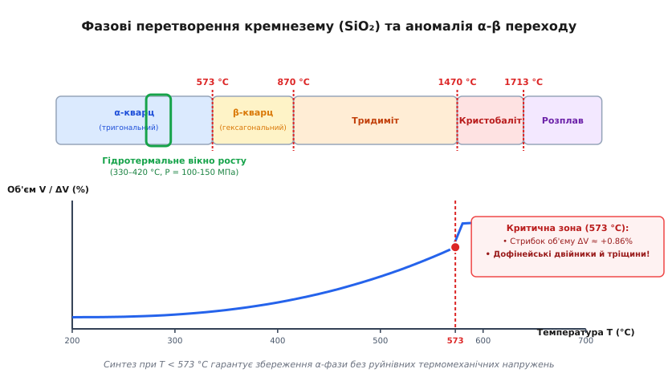
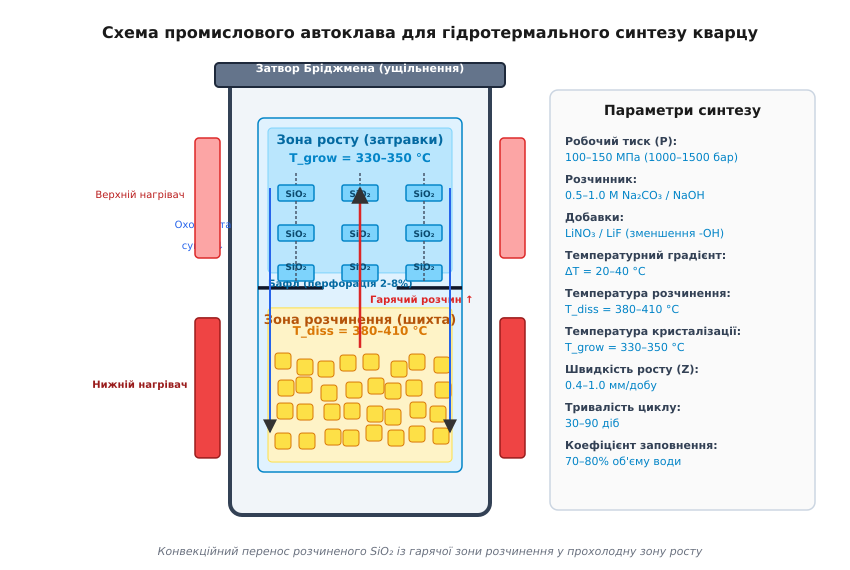
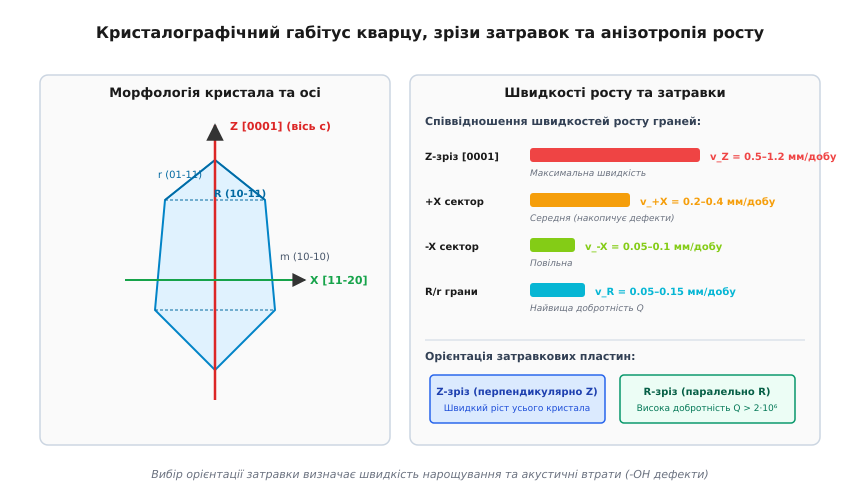

# Вирощування синтетичного кварцу

<preknowlist>
- [Правило фаз Гіббса](topic:ph-thermodynamics/gibbs-phase-rule) — умови термодинамічної рівноваги багатофазних і багатокомпонентних систем.
- [Теорія фазових переходів другого роду Ландау](topic:ph-thermodynamics/phase-transitions-landau) — симетрійні зміни кристалічної ґратки та параметри порядку.
</preknowlist>

Спроба виростити монокристал низькотемпературного кварцу (`α-SiO₂`) безпосередньо зі звичайного розплаву чи шляхом осадження з газової фази закінчується катастрофічним руйнуванням матеріалу. Хоча чистий двоокис кремнію плавиться при високій температурі 1713 °C, отримане при охолодженні тверде тіло або застигає у вигляді аморфного кварцового скла, або кристалізується у високотемпературні поліморфні модифікації (кристобаліт чи тридиміт). Навіть якщо кристал вдається виростити при температурі вище 573 °C у фазі `β-кварцу`, при подальшому охолодженні кристал змушений пройти через структурний фазовий перехід зміщення. Зміна кутів між кремній-кисневими тетраедрами супроводжується анізотропним стрибком об'єму на `+0.86%` та подвійним поворотним двійникуванням, що розриває монокристал сіткою мікротріщин і повністю знищує його п'єзоелектричні властивості.

Єдиним промисловим виходом із цього термодинамічного обмеження є метод **гідротермального синтезу** (*hydrothermal growth*, від грецького *hydor* — вода та *therme* — тепло). Рекристалізація відбуваються у стиснутому водному флюїді при температурах 330–420 °C і тисках 100–150 МПа (1000–1500 бар), що дозволяє вирощувати ідеальні монокристали масою в кілька кілограмів безпосередньо в області термодинамічної стійкості `α-фази`.

---

### 1. Кристалофізичні обмеження розплавного вирощування та фазовий α-β перехід

Кристалічна структура двоокису кремнію (`SiO₂`) побудована із жорстких координаційних тетраедрів `[SiO₄]⁴⁻`, у центрі яких розташований атом кремнію `Si⁴⁺`, а у чотирьох вершинах — атоми кисню `O²⁻`. Кожен атом кисню належить одночасно двом суміжним тетраедрам, утворюючи тривимірний каркас. Довжина зв'язку `Si — O` становить близько `0.161 нм`, а кут міжатомного зв'язку `Si — O — Si` між сусідніми тетраедрами у низькотемпературному `α-кварці` становить близько 144°.

При зміні температури та тиску двоокис кремнію демонструє багату фазову діаграму з багатьма поліморфними модифікаціями: `α-кварц` (до 573 °C) ⇄ `β-кварц` (573–870 °C) ⇄ `тридиміт` (870–1470 °C) ⇄ `кристобаліт` (1470–1713 °C) ⇄ `розплав`.

Зміна фазового стану супроводжується перебудовою кристалографічної симетрії:
- **`α-кварц` (низькотемпературний):** Тригональна симетрія (просторова група `P3₁21` для правообертальних або `P3₂21` для лівообертальних кристалів). Уздовж оптичної осі `c` простягаються потрійні гвинтові осі симетрії `3₁` або `3₂`. Кристал не має центру інверсії, що є необхідною умовою виникнення прямого та зворотного **п'єзоелектричного ефекту** (виникнення електричного заряду при механічній деформації та механічної деформації під дією зовнішнього електричного поля).
- **`β-кварц` (високотемпературний):** Гексагональна симетрія (просторова група `P6₂22` або `P6₄22`), вища симетрія ґратки, при якій кут зв'язку `Si — O — Si` скачкоподібно розвертається до ~150°.

```
    α-кварц (тригональний, P3₁21) <==== 573 °C ====> β-кварц (гексагональний, P6₂22)
     [п'єзоелектрично активний]                      [зміна об'єму ΔV ≈ +0.86%]
```


*Фазові перетворення кремнезему (SiO₂) та аномалія α-β переходу*

#### Параметр порядку Ландау та пом'якшення пружних модулів

У теорії фазових переходів Ландау параметром порядку `η` даного фазового переходу є кут повороту тетраедрів `[SiO₄]` відносно трикратної осі `Z`. Наближаючись до температури фазового переходу `T_c = 573 °C` знизу, параметр порядку прямує до нуля за степеневим законом `η(T) ∝ (T_c - T)^β`, де `β ≈ 0.33`.

Поблизу критичної точки `573 °C` спостерігається аномальне **пом'якшення пружних модулів** кристала (зокрема пружних констант `c₁₁` та `c₄₄`), що призводить до падіння швидкості поширення ультразвукових хвиль.

#### Стрибок об'єму та механізми двійникування

Під час охолодження монокристала `β-кварцу` нижче точки `573 °C` відбувається фазове перетворення другого роду, близьке до першого роду через наявність стрибка параметра порядку. Поворот тетраедрів `[SiO₄]` може відбутися у двох кристалографічно еквівалентних напрямках відносно осі `c`.

В результаті у кристалі виникає два типи деструктивних кристалографічних двійників:

1. **Дофінейські двійники (*Dauphiné twins*):** Вторинні двійники зміщення, які виникають при фазовому переході через 573 °C. Вони являють собою поворот ґратки на 180° навколо оптичної осі `Z`. У сусідніх двійникових доменах напрямок електричної осі `X` розвертається на протилежний (`+X ↔ -X`). В результаті п'єзоелектричний модуль `d₁₁` в одному домені має позитивний знак, а у сусідньому — негативний.

```
Домен А (вісь +X, d₁₁ > 0)  |  Домен Б (вісь -X, d₁₁ < 0)  ===> Макроскопічний п'єзовідгук = 0
```

При накладанні механічного напруження електричні заряди, генеровані доменом А та доменом Б, повністю взаємно компенсуються. Макроскопічний п'єзоелектричний модуль кристала падає до нуля. Крім того, анізотропний стрибок об'єму на `+0.86%` створює внутрішні локальні термомеханічні напруження, що перевищують межу міцності кварцю на розрив (~100 МПа), розколюючи кристал на дрібні фрагменти.

2. **Бразильські двійники (*Brazil optical twins*):** Первинні ростові двійники інверсії, при яких у монокристалі правої енантіоморфної модифікації (`P3₁21`) виникають включення лівої модифікації (`P3₂21`). Вони формуються під час росту при наявності локальних пересиченостей та домішок і призводять до спотворення оптичної активності та механічних втрат.

Отже, вирощування монокристалів п'єзоелектричного кварцю вимагає проведення процесу **strictly при T < 573 °C**.

Проте при кімнатній температурі розчинність кварцю у воді становить менше `10⁻⁴ wt%` (менше 1 мг на літр), а швидкість рекристалізації у твердому стані прямує до нуля. Для забезпечення масопереносу потрібні підвищені температури (330–420 °C), високий тиск та хімічно активне водне середовище.

---

### 2. Фізико-хімія гідротермального розчинення та лужні розчинники

У чистій воді навіть при температурі 350 °C розчинність кварцю не перевищує 0.1 wt%, що занадто мало для промислового росту (нарощування становило б частки мікрона на добу). Для збільшення розчинності у воду додають **мінералізатори** — лужні солі карбонату натрію (`Na₂CO₃`) або гідроксиду натрію (`NaOH`) у концентраціях 0.5–1.2 моль/л, рідше карбонат калію (`K₂CO₃`) або фторид амонію (`NH₄F`).

Гідроксильні аніони `OH⁻` виступають хімічно активним нуклеофільним агентом, який атакує та гідролізує міцні сілоксанові містки `Si — O — Si` на поверхні твердої шихти.

#### Хімізм розчинення та комплексоутворення

При взаємодії `SiO₂` з лужним розчином відбувається послідовність хімічних реакцій:

```
SiO₂ (твердий) + 2 OH⁻ (водний) ⇌ SiO₃²⁻ (водний) + H₂O (рідкий)
3 SiO₂ (твердий) + 2 OH⁻ (водний) ⇌ Si₃O₇²⁻ (водний) + H₂O (рідкий)
```

У середовищі `NaOH` розчинення описується утворенням моно- та дигідроксисилікатів:

```
SiO₂ (твердий) + OH⁻ + 2 H₂O ⇌ [Si(OH)₅]⁻ ⇌ [SiO(OH)₃]⁻ + H₂O
```

У розчині утворюються розчинні натрієво-силікатні комплекси. При високому тиску основним мономерним комплексом є гідроксисилікат-іон `[SiO(OH)₃]⁻`, а при підвищенні концентрації кремнезему утворюються димерні та тримерні полімерні аніони `[Si₃O₇]²⁻`.

```
[ Твердий кремній SiO₂ ] + 2 OH⁻  ===>  [ Гідроксисилікат-іон [SiO(OH)₃]⁻ ]  ===>  Перенос у флюїді
```

Розчинення кварцю в лужних розчинах є **ендотермічним процесом**: ентальпія розчинення має позитивний знак `ΔH_diss > 0` (близько `25–35 кДж/моль` залежно від концентрації лугу).

Згідно з термодинамічним рівнянням Ван т Гоффа, це означає, що **рівноважна розчинність кварцю монотонно зростає з підвищенням температури**:

```
ln S = - (ΔH_diss / (R · T)) + (ΔS_diss / R)
```

де `S` — рівноважна розчинність кремнезему (в `wt%` або моль/л), `R = 8.314 Дж/(моль·К)` — універсальна газова стала, `T` — абсолютна температура в кельвінах.

```
       Температура T ↑   ===>   Рівноважна розчинність S(T) ↑   (Ендотермічний процес)
```

#### Роль тиску та густини надкритичного флюїду

У гідротермальних умовах при температурах 350–400 °C вода перебуває у надкритичному або стиснутому субкритичному стані. Тиск `P` (100–150 МПа) стискає флюїд, збільшуючи його густину `ρ_fluid` від 0.50 г/см³ до 0.75 г/см³.

Підвищення густини флюїду різко збільшує статичну діелектричну проникність середовища та інтенсивність сольватації силікатних іонів. Залежність розчинності від густини описується рівнянням Кеннеді:

```
ln S = a + b · ln ρ_fluid - (ΔH_diss / (R · T))
```

Збільшення робочого тиску від 80 МПа до 140 МПа при `T = 380 °C` підвищує розчинність `SiO₂` у розчині `Na₂CO₃` від 1.2 wt% до 3.1 wt%, забезпечуючи необхідну масу кремнезему для високої швидкості кристалізації.

Детальний математичний вивід температурно-тискових залежностей розчинності та гідродинамічного потоку наведено у вставці [🧮 Термодинаміка розчинності та конвекційного масопереносу](topic:ph-condensed/quartz-growth/math-solubility-convection.md).

---

### 3. Автоклавний реактор та замкнений конвекційний цикл

Синтез здійснюють у спеціальних кованих сталевих судинах високого тиску — **гідротермальних автоклавах**.


*Схема промислового автоклава для гідротермального синтезу кварцу*

Внутрішня порожнина автоклава розділена по висоті на дві технологічні зони:
1. **Нижня зона (зона розчинення / шихти):** Заповнюється подрібненим жильним природним кварцем (дрібна шихта — *lascas*). Зовнішні нагрівачі підтримують вищу температуру `T_diss = 380–410 °C`.
2. **Верхня зона (зона кристалізації / затравок):** У ній на металевих рамах підвішують орієнтовані монокристалічні затравкові пластини `SiO₂`. Зовнішній нагрівач підтримує нижчу температуру `T_grow = 330–350 °C`.
3. **Перфорований бафл (перегородка):** Горизонтальна сталева пластина з просвердленими отворами (відносне відкриття 2–8% від площі перерізу), яка розділяє нижню та верхню зони.

Детальний аналіз конструктивних матеріалів, товстостінних розрахунків за формулою Ламе, самоущільнюваних затворів Бріджмена та аварійних розривних мембран викладено у вставці [🔌 Конструкція автоклавних реакторів високого тиску](topic:ph-condensed/quartz-growth/comp-autoclave-reactor.md).

#### Замкнений конвекційний масоперенос

Різниця температур створює різницю густини водного флюїду: гарячий розчин у нижній зоні має меншу густину `ρ(T_diss)`, ніж прохолодний розчин у верхній зоні `ρ(T_grow)`. Під дією сили Архімеда в автоклаві виникає стаціонарна природна конвекція:

1. **Розчинення шихти:** У нижній зоні при `T_diss` флюїд насичується кремнеземом до високої рівноважної концентрації `S(T_diss)`.
2. **Конвекційний підйом:** Гарячий насичений розчин піднімається вгору крізь центральні отвори бафла.
3. **Охолодження та пересичення:** У верхній зоні розчин охолоджується до `T_grow`. Оскільки розчинність спадає (`S(T_grow) < S(T_diss)`), розчин стає **пересиченим** на величину `ΔC`:

```
ΔC = S(T_diss) - S(T_grow) > 0
```

4. **Кристалізація:** Надлишок розчиненого кремнезему виділяється з пересиченого розчину й нарощується на поверхні затравкових пластин, подовжуючи монокристал.
5. **Низхідний потік:** Охолоджений збіднений розчин із підвищеною густиною опускається вздовж холодних внутрішніх стінок автоклава назад у нижню зону розчинення.

```
Зона розчинення (T_diss)  ==> Нагрівання & Розчинення ==> Гарячий флюїд (підйом)
         ▲                                                       │
         │                                                       ▼
Охолоджений флюїд (спуск) <== Кристалізація на затравках <== Зона росту (T_grow)
```

Масовий потік кремнезему `J` (у кг/(м²·с)) та лінійна швидкість нарощування кристала `v_growth` (у мм/добу) прямо пропорційні абсолютній пересиченості `ΔC` та температурному градієнту `ΔT = T_diss - T_grow`:

```
J = K_m · ΔC
v_growth = (K_m / ρ_cryst) · (∂S / ∂T)_P · ΔT
```

де `K_m` — коефіцієнт масопереносу (залежить від інтенсивності конвекції та відсотка відкриття бафла), `ρ_cryst = 2650 кг/м³` — густина монокристалічного кварцю.

---

### 4. Кристалографічний габітус, затравкові пластини та анізотропія росту

`α-кварц` належить до тригонально-трапецоедричного класу симетрії (точкова група 32, просторова група `P3₁21`). Його кристалографічна структура характеризується вираженою анізотропією фізичних, механічних та кінетичних властивостей.


*Кристалографічний габітус кварцу, зрізи затравок та анізотропія росту*

Головні кристалографічні осі кварцу у чотириосьовій системі Браве — Гексагональній координації `(x, y, u, z)`:
- **Вісь `Z` (головна оптична вісь `c`, [0001]):** Вісь симетрії 3-го порядку, уздовж якої простягаються спіральні ланцюжки тетраедрів `[SiO₄]`.
- **Осі `X` (електричні осі `a`, [112̄0]):** Три взаємно перпендикулярні до `Z` осі 2-го порядку, вздовж яких виникає максимальний п'єзоелектричний заряд.
- **Осі `Y` (механічні осі, [101̄0]):** Осі, перпендикулярні до граней шестигранної призми.

#### Анізотропія швидкості росту граней

За теорією Хартмана — Пердока про періодичні ланцюжки зв'язків (Periodic Bond Chains, PBC), грані кристала поділяють на `F`-грані (плоскі, з двома PBC ланцюжками, ростуть найповільніше), `S`-грані (ступінчасті, з одним PBC ланцюжком) та `K`-грані (зламоподібні, без PBC ланцюжків, ростуть найшвидше).

При гідротермальному синтезі швидкості нарощування різних кристалографічних граней відрізняються у десятки разів:

```
v_Z  >>  v_+X  >  v_-X  >  v_R  ≈  v_r  >>  v_m
```

1. **Базальна грань `Z` (пінакоїд, (0001)):** Належить до `K`-граней і демонструє найвищу швидкість росту `v_Z = 0.5–1.2 мм/добу`. Ріст відбувається шляхом швидкого приєднання силікатних комплексів до ненасичених ненаправлених зв'язків уздовж оптичної осі. Поверхня росту має характерний горбистий («бруківковий») рельєф із численними округлими горбками росту.
2. **Полярні осі `+X` та `-X` ({112̄0}):** Грань `+X` росте зі швидкістю `0.2–0.4 мм/добу`, тоді як грань `-X` наростає суттєво повільніше (`0.05–0.1 мм/добу`). Сектор `+X` є зоною підвищеного накопичення точкових дефектів та включень розчинника.
3. **Ромбоедричні грані `R` (главний ромбоедр (101̄1)) та `r` (малий ромбоедр (011̄1)):** Належать до `F`-граней і наростають повільно (`v_R = 0.05–0.15 мм/добу`). Це атомарно гладкі грані з мінімальною поверхневою енергією, що ростуть за пошаровим дислокаційним механізмом Франка.
4. **Грані призми `m` ({101̄0}):** Належать до найстабільніших `F`-граней і мають найнижчу швидкість росту (`v_m ≈ 0 мм/добу`). У стаціонарному режимі грані призми практично не наростають, формуючи гладкі бокові поверхні монолітного кристалобруса.

#### Орієнтація затравок та накопичення дефектів

Вибір орієнтації затравкової пластини визначає підсумкову форму та якість монокристала:
- **`Z`-зріз (пластини, вирізані перпендикулярно до осі `Z`):** Забезпечують максимальну швидкість нарощування та продуктивність автоклава. Проте через високу швидкість росту сектор `Z` схильний до захоплення структурних дефектів.
- **`R`-зріз (пластини, вирізані паралельно до грані ромбоедра `R`):** Кристалізація відбувається повільніше, але утворений кристал має монолітну досконалу структуру без віцинальних горбків.

Програму чисельного обчислення швидкостей росту, пересиченості та динаміки нарощування товщини кристала наведено у вставці [⚙️ Чисельне моделювання кінетики росту кристалів кварцу](topic:ph-condensed/quartz-growth/proj-autoclave-growth-sim.md).

---

### 5. Дефектоутворення та контроль акустичної добротності (Q-фактора)

Найважливішою характеристикою синтетичного кварцю для п'єзоелектроніки є **акустична добротність** (`Q-фактор`). Добротність визначає мінімальність внутрішніх механічних втрат енергії при високочастотних коливаннях резонатора. Якщо для пересічного кристала `Q ≈ 10⁵`, то прецизійні стандарти частоти вимагають `Q > 2 · 10⁶`.

#### Механізм гідроксильного загасання (-OH дефекти)

Головною причиною акустичних втрат є включення у кристалічну ґратку кварцю структурної води у вигляді гідроксильних груп `OH⁻`.

У кристалічній ґратці атоми кремнію `Si⁴⁺` ізоморфно заміщуються тривалентними домішковими атомами алюмінію `Al³⁺` (який завжди присутній у природній шихті). Для збереження електронетральності поруч із атомом `Al³⁺` у структурному каналі ґратки змушений розташуватися компенсуючий протон `H⁺`, який зв'язується з сусіднім атомом кисню, утворюючи дефектний місток `Al³⁺ — OH⁻`:

```
   Si⁴⁺ (вузол ґратки)  <=== Ізоморфне заміщення ===>  Al³⁺ (вузол) + H⁺ (канал)
                                                             │
                                                             ▼
                                                 Дефектний місток Al³⁺ — OH⁻
```

Під дією високочастотного акустичного поля протон `H⁺` здійснює релаксаційні термоактивовані стрибки між чотирма еквівалентними атомами кисню навколо алюмінієвого тетраедра. Цей процес непружно поглинає енергію механічної хвилі, викликаючи дисипацію енергії та загасання коливань.

Концентрація `-OH` дефектів визначається за допомогою інфрачервоної спектроскопії шляхом вимірювання коефіцієнта оптичного поглинання `α` на хвильовому числі `3585 см⁻¹`:

```
Q ≈ 1.35 · 10⁶ / α_3585
```

де `α_3585` — коефіцієнт ІЧ-поглинання (у см⁻¹). Для кварцю високої акустичної якості вимагається `α_3585 < 0.02 см⁻¹`.

#### Технологічні методи підвищення добротності:
1. **Зменшення швидкості росту:** Зниження `v_Z` до `0.4–0.5 мм/добу` зменшує захоплення `-OH` груп у 3–4 рази порівняно зі швидким ростом (`1.2 мм/добу`).
2. **Літієве легування:** Додавання у розчин солей літію (`LiNO₃` або `LiF`). Дрібні катіони `Li⁺` вбудовуються у структурні канали ґратки замість протонів `H⁺` для компенсації заряду `Al³⁺`. Комплекс `Al³⁺ — Li⁺` не має релаксаційного дипольного моменту і не створює акустичних втрат при кімнатних температурах.
3. **Електропротяжка (Sweeping):** Високотемпературне очищення кристала в постійному електричному полі (`E ≈ 1000 В/см` при `T = 500 °C`). Під дією поля відносно рухливі катіони `Na⁺` та `Li⁺` витягуються вздовж каналів осі `Z`, замещаючись протонами або дегазуючись, що повністю усуває радіаційно-чутливі колірні центри.

---

### 6. Промислові застосування та п'єзоелектричні компоненти

Синтетичний кварц є базовим матеріалом для сучасної електронної, оптичної та телекомунікаційної промисловості.

> 🔧 **Навіщо це.**
> Завдяки кристалографічній анізотропії існує спеціальна орієнтація вирізання пластин — **`AT`-зріз** (вирізаний під кутом 35°15' до оптичної осі `Z`), для якого перший температурний коефіцієнт частоти (ТКЧ) строго дорівнює нулю при кімнатній температурі. Кварцовий резонатор `AT`-зрізу зберігає частоту коливань із точністю до кількох PPM (мільйонних часток) у широкому інтервалі температур від -40 °C до +85 °C. Для бортової та аерокосмічної апаратури застосовують двопаверну зріз **`SC`-зріз** (*Stress-Compensated cut*), який нечутливий до механічних ударів та термічних ударів.
> Це робить синтетичний кварц серцем усіх цифрових систем: від часових резонаторів на `32 768 Гц` у смартфонах до генераторів мікропроцесорів, супутникових систем навігації (GPS/Galileo), оптичних дефлекторів та фільтрів поверхневих акустичних хвиль (ПАХ/SAW) у радіостанціях 5G.

Історія подолання наукових та інженерних труднощів під час розробки перших автоклавів викладена у вставці [📜 Історія розвитку гідротермального синтезу кварцу](topic:ph-condensed/quartz-growth/hist-hydrothermal-quartz.md).

Повний цикл автоклавного вирощування монокристалів синтетичного кварцю поєднує фундаментальні закони хімічної термодинаміки, гідродинаміки надкритичних флюїдів та кристалофізики, забезпечуючи електронну галузь високочистим матеріалом для високочастотних п'єзоелектричних та оптичних пристроїв.
