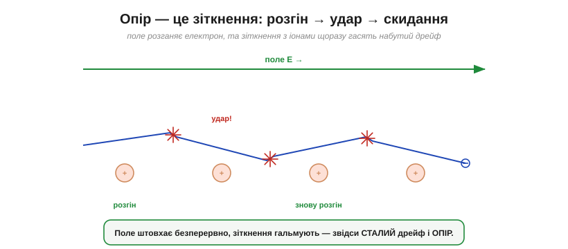
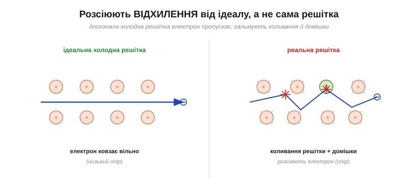
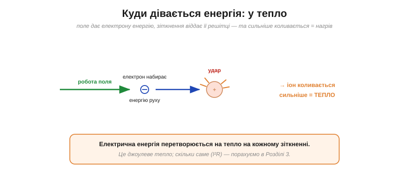
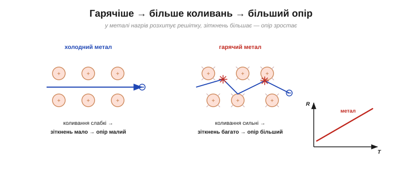

# Зіткнення й нагрів: звідки береться опір руху

У [металі є вільні електрони](topic:ph-condensed/conductors-insulators), та навіть у найкращому провіднику струм не нескінченний: щось руху опирається. Якби нічого не заважало, поле розганяло б електрони **дедалі швидше**, струм ріс би лавиною — а цього не буває. Отже, є **опір** (*resistance*) — спротив рухові. Звідки він і чому через нього провідник **гріється** — тема цієї статті. Тут ідеться про сам механізм; [рахувати опір у числах](topic:ph-condensed/resistance) — окрема справа.

### Опір — це зіткнення

Корінь опору — у самій картині [дрейфу електронів](topic:ph-condensed/electron-drift): дрейфові електрони раз у раз **стикаються** з решіткою. Розгляньмо це уважніше.

*Поле розганяє електрон у потрібний бік — та невдовзі він налітає на перешкоду в решітці, втрачає набуту напрямлену швидкість і відлітає навмання. Потім знову розгін — і знову удар. Ці безперервні **зіткнення** й не дають електронам розігнатися; вони ж і є **опір**.*

Картина — циклічна: коротенький розгін під дією поля, потім зіткнення, що **скидає** набутий дрейф, і все спочатку. Поле штовхає без упину, зіткнення без упину гальмують — і встановлюється **стала** дрейфова швидкість, а не нескінченний розгін. Що **частіші** ці зіткнення (що коротший вільний пробіг електрона між ними), то важче струмові — то більший опір. Опір — це, по суті, **міра того, як часто електрони збиваються** на своєму шляху.

Щоб відчути масштаб: попри шалену теплову швидкість (~10⁶ м/с), електрон у міді пролітає між двома зіткненнями лише **десятки нанометрів** — і встигає це за якісь ~10⁻¹⁴ секунди. Тобто за секунду кожен електрон зазнає **десятків трильйонів** зіткнень. Саме ця карколомна частота ударів і робить [дрейф](topic:ph-condensed/electron-drift) таким повільним, а опір — відчутним навіть у чудовому провіднику.

Корисна, хоч і неточна, аналогія — **тертя** чи опір повітря. Парашутист під силою тяжіння не розганяється без кінця, а виходить на сталу швидкість, бо опір повітря зрівноважує тяжіння. Так само електрон під полем виходить на сталий дрейф, бо зіткнення його «гальмують». Але пам'ятаймо межу образу: справжнього тертя тут немає — є дискретні удари об решітку, а «тертя» — лише зручна назва їхнього усередненого ефекту.

### На чому насправді розсіюються електрони

Тут ховається тонкість, без якої картина була б неповною. Здавалося б, електрони мають битися об щільні ряди іонів решітки — то чим щільніша решітка, тим гірше? Насправді **ні**. Квантова механіка дає несподіваний результат: **ідеальна, нерухома, бездоганно періодична решітка електрон узагалі не розсіює** — він проходив би крізь неї без жодного опору, як хвиля крізь ідеальний кристал.

*Досконала холодна решітка електрон **не гальмує** — він ковзає вільно. Опір створюють **відхилення** від ідеалу: теплові **коливання** іонів (решітка тремтить) і **домішки та дефекти** (чужі атоми, межі зерен). Саме на них електрон і розсіюється.*

Отже, опір створює не сама решітка, а її **недосконалість**: по-перше, **теплові коливання** (іони ніколи не стоять ідеально — вони тремтять, і що гарячіше, то дужче); по-друге, **домішки й дефекти** — чужі атоми, вакансії, межі кристалічних зерен. Електрон спокійно мине ідеальний ряд, але спіткнеться об кожне «викривлення» цього порядку. Звідси й увесь опір.

> 🔧 **Навіщо це.** Ось чому **чисті метали проводять краще за сплави**: у сплаві повно «чужих» атомів, що розсіюють електрони, тож опір вищий. Тому дроти роблять із **чистої міді** (мало домішок — малий опір), а нагрівальні елементи — навпаки, зі **сплавів** на кшталт ніхрому (багато розсіювання — великий опір, що нам тут і потрібен, бо мета — саме грітися). Вибір «чистий метал чи сплав» — це прямий вибір «менше опору чи більше».

### Куди дівається енергія: у тепло

Тепер найважливіший наслідок зіткнень. Між ударами поле виконує над електроном **роботу**, надаючи йому [енергії руху](topic:ph-electromagnetism/electric-potential). А під час зіткнення електрон цю набуту енергію **віддає решітці** — від удару іон починає коливатися сильніше. А сильніші коливання решітки — це і є **тепло**.

*Поле дає електронові енергію руху; при зіткненні він передає її іонові решітки, і той коливається дужче — тобто **нагрівається**. Так електрична енергія на кожному зіткненні перетворюється на **тепло**. Це [джоулеве тепло](topic:ph-electromagnetism/joule-heating), яке має й точний кількісний бік (формула I²R).*

Звідси — фундаментальний факт: **струм у провіднику з опором завжди виділяє тепло**. Енергія, яку джерело вкладає в електрони, не зникає — вона безперервно «осідає» в решітці у вигляді тепла. У сталому режимі це навіть точний баланс: скільки потужності поле передає електронам, стільки ж іде в нагрів решітки. Це явище — **джоулеве тепло** (*Joule heating*); тут головне зрозуміти його **механізм**: тепло народжується зі зіткнень дрейфових електронів.

Кожне окреме зіткнення віддає решітці мізерну крихту енергії. Та електронів астрономічно багато (≈10²⁸ на кубометр), і кожен зазнає десятків трильйонів ударів за секунду. Помножене на такі числа, «непомітне» тепло одного зіткнення складається в цілком відчутні **вати**, що гріють резистор чи дріт. Велике тепло — це сумарний підсумок безлічі крихітних.

### Чому гарячий провідник опирається дужче

Тепер усе складається в одну струнку відповідь на питання, чому опір металу **росте** з температурою.

*У холодному металі іони коливаються кволо, електрон довго летить між зіткненнями — опір малий. У гарячому решітка тремтить шалено, електрон натикається на неї куди частіше — опір більший. Тому для металу опір росте з температурою (права крива R(T)).*

Логіка проста: нагрівання посилює теплові коливання решітки → коливання — головне джерело розсіювання → більше зіткнень → більший опір. Тому в металі опір **зростає** з температурою (і навпаки — холодний метал проводить краще). Це протилежно [напівпровідникам](topic:ph-condensed/conductors-insulators), де нагрів **додає носіїв** і опір падає; різниця в тому, що в металі носіїв і так удосталь, а вирішують саме зіткнення. Кількісний бік цієї залежності описує [температурний коефіцієнт опору](topic:ph-condensed/resistance-temperature).

А якщо охолоджувати далі, до дуже низьких температур? Теплові коливання решітки **завмирають**, розсіювання слабшає, опір падає. У деяких матеріалів він спадає не просто до малого, а **до точного нуля**: за особливим квантовим механізмом електрони починають текти зовсім без зіткнень — це **надпровідність**. Струм у надпровідному кільці може кружляти роками без жодного джерела. Щоправда, для цього потрібен холод у сотні градусів нижче нуля — тож у звичайній техніці опір завжди з нами.

> 🔧 **Навіщо це.** Запам'ятайте намертво: **там, де є струм і опір, завжди виділяється тепло**. Це і благо, і клопіт. Благо — коли тепло є метою: електрообігрівачі, праска, спіраль чайника, нитка лампи розжарення, дротяний запобіжник, що плавиться від перегріву. Клопіт — коли тепло паразитне: дроти й доріжки гріються, потужні транзистори й резистори потребують **радіаторів**, а перегрів — головна причина виходу електроніки з ладу. Уміння прикинути, скільки чого нагріється, — одна з найпрактичніших навичок інженера.

Варто помітити ще одне. Скільки всього зіткнень зазнає струм, залежить не лише від **матеріалу**, а й від **геометрії** провідника: довшим дротом електрони долають більше решітки (більше ударів), а вужчим — тісніше тиснуться. Тому опір конкретного дроту визначають і матеріал, і форма. «Матеріальну» частину описує [питома провідність](topic:ph-condensed/conductivity), а як форма входить у [повну формулу опору](topic:ph-condensed/resistance) R = ρ·L/A — окреме питання.
