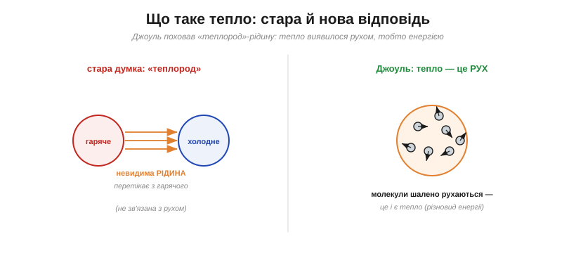
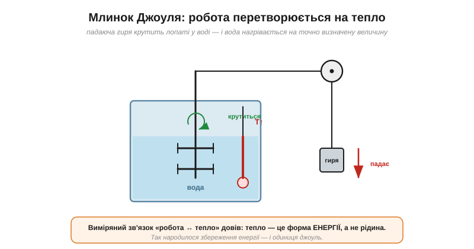
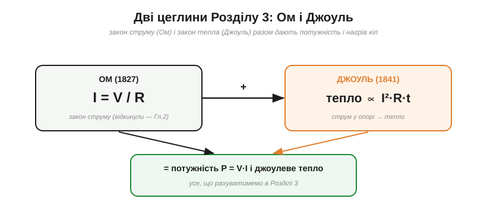

# 📜 Ом і Джоуль: закон, який відкинули, і тепло, що виявилося енергією

> Уся практика [опору](root:ph-condensed/resistance) стоїть на двох законах: **Ома** (скільки потече струму) і **Джоуля** (скільки виділиться тепла). Драму Ома — як його закон спершу зневажили — тут згадаємо коротко, а головну увагу віддамо другому герою: пивовару-аматору, який довів, що **тепло — це енергія**, і тим заклав підмурок усієї теплової електротехніки.

Маючи закон Ома I = V/R, ми знаємо, **скільки** струму пожене напруга крізь опір. Та лишається питання: коли струм продирається крізь опір, провідник **гріється** — звідки береться це тепло й що воно взагалі таке?

---

## Закон струму є, а куди дівається енергія

Спершу — коротко про Ома. **Георг Ом** (*Georg Ohm*) 1827 року дав напрочуд простий закон: I = V/R. Та сучасники, у полоні умоглядної «натурфілософії», зустріли його зневагою; Ом утратив посаду й роками лишався невизнаним, аж доки закордонне визнання й медаль Коплі не повернули правду. Одиниця опору **ом** (Ω) — його посмертна шана.

Але закон Ома мовчить про **енергію**. Опір [гріє провідник через зіткнення електронів із решіткою](root:ph-condensed/resistance-origin) — а що таке саме це тепло? Це питання, на позір невинне, ховало одну з найбільших загадок фізики XIX століття.

---

## Що таке тепло: стара відповідь — «теплород»

Майже все XVIII століття й початок XIX панувала картина, що сьогодні здається дивною. Тепло вважали особливою **невидимою невагомою рідиною** — **теплородом** (*caloric*). За цією теорією теплород перетікає з гарячого тіла в холодне (тому вони й зрівнюються в температурі), його кількість **зберігається**, і з рухом чи роботою він прямо не пов'язаний.

*Стара думка: тепло — це **рідина-теплород**, що перетікає з гарячого в холодне й сама по собі ні з чим не пов'язана. Нова, Джоулева: тепло — це **рух** молекул, тобто різновид **енергії**, який можна діставати з роботи й перетворювати назад.*

Теорія теплороду незле описувала перетікання тепла, та натикалася на дивні факти. Чому тертя гріє **без кінця** — звідки в ньому береться невичерпний «теплород»? Чому свердло гарматного ствола розжарює метал, скільки його не свердли? Якщо теплород зберігається, то він мав би колись скінчитися — а тертя гріє завжди. Щось тут не сходилося.

Перший серйозний удар по теплороду завдав ще раніше **граф Румфорд** (*Count Rumford*) близько 1798 року. Свердлячи гарматні стволи, він помітив, що тертя свердла дає тепло **без кінця** — поки крутиш, поти й гріється, ніби джерело невичерпне. Якби тепло було рідиною, що зберігається, воно мусило б вичерпатися; а воно лилося, доки тривала **робота**. Румфорд здогадався, що тепло пов'язане з рухом, — та строгого доказу й точного «курсу обміну» не дав. Це лишилося Джоулю.

---

## Джоуль: тепло — це енергія

Розв'язати загадку судилося не професорові, а **Джеймсу Прескотту Джоулю** (*James Prescott Joule*, 1818–1889) — синові заможного пивовара з-під Манчестера, який сам керував родинною броварнею, а науку робив **на власні кошти**, як аматор. Саме пильність пивовара до точних вимірів (температури, бродіння) і дала йому те, чого бракувало іншим, — **надточність**. Манчестер тих років був серцем промислової революції, де цінували практичну науку; а замолоду Джоуль навіть брав уроки в самого **Джона Дальтона** — творця атомної теорії. Тож його аматорство було особливим: він мав і вишкіл, і ресурси, і одержимість точністю.

Джоуль поставив за мету довести, що тепло й механічна робота — це **одне й те саме**, лише в різних подобах, і їх можна перетворювати одне в одне за **сталим курсом**. Його найславетніший дослід — **млинок**.

*Падаюча гиря через блок крутить лопаті, занурені у воду. Тертя лопатей об воду нагріває її — і Джоуль виміряв нагрів так точно, що встановив **сталий курс обміну**: певна робота завжди дає певну кількість тепла. Це й є «механічний еквівалент тепла».*

Логіка була бездоганна: гиря, падаючи, виконує цілком вимірювану механічну **роботу**; ця робота йде на обертання лопатей, що тертям нагрівають воду на точно виміряну величину. Скільки роботи — стільки й тепла, завжди в тій самій пропорції. Звідси неуникний висновок: **тепло — не рідина, а форма енергії**; робота перетворюється на тепло (а тепло — на роботу) за незмінним курсом. «Теплород» помер. А народилося одне з найглибших понять фізики — **збереження енергії**: енергія не зникає й не виникає, лише змінює подобу (механічну, теплову, електричну…).

Млинок був не єдиним його доказом. Джоуль міряв «механічний еквівалент тепла» багатьма способами — стискаючи гази, проганяючи струм крізь дроти, тручи залізо об залізо, — і всі ці зовсім різні досліди давали **той самий** курс обміну. А коли до одного числа сходяться незалежні шляхи, сумнівам місця не лишається.

> 🔧 **Навіщо це.** Це та сама ідея, на якій тримається [неперервність струму в колі](root:ph-electromagnetism/current-continuity): енергія не «витрачається» в нікуди, а **перетворюється** — електрична на теплову, світлову, механічну. Джоуль довів це строго й кількісно. Тому, рахуючи, скільки гріється резистор чи скільки енергії бере мотор, ви спираєтеся прямо на Джоулів закон збереження.

---

## Джоулів закон для кіл: тепло ∝ I²R

Ще до млинка, 1841 року, Джоуль зробив відкриття просто-таки про опір: він виміряв, скільки **тепла** виділяє електричний струм у провіднику. І знайшов закон, що носить його ім'я: кількість тепла пропорційна **квадрату струму**, опору й часу — тобто **I²R·t**.

*Закон Ома (скільки струму) і закон Джоуля (скільки тепла) — дві опори всієї практики опору. Разом вони дають потужність P = V·I і **джоулеве тепло** I²R, якими рахують нагрів і енергоспоживання будь-якого кола.*

Тепер [механізм зіткнень електронів із решіткою](root:ph-condensed/resistance-origin) дістав **число**: енергія, яку струм втрачає на опорі, повністю переходить у тепло за законом I²R. Зверніть увагу на **квадрат** струму — він означає, що вдвічі більший струм гріє вчетверо сильніше; саме тому надструми такі небезпечні (пожежі, перегорання), а передавати енергію вигідно малим струмом високої напруги (звідси й [«війна струмів»](root:ph-electromagnetism/dc-vs-ac)). Поєднавши закон Ома з законом Джоуля, можна порахувати **потужність і нагрів** будь-якого елемента — від резистора до дроту.

---

## Аматора знову відкинули

Історія повторилася майже буквально. Як колись Ома, Джоуля-**аматора** наукова спільнота спершу **не сприйняла**: хто такий пивовар, щоб спростовувати шановану теорію теплороду? Його доповіді ігнорували або відхиляли, а надточні виміри здавалися надто гарними, щоб бути правдою. І було чому дивуватися: Джоуль вимірював зміни температури в **соті частки градуса** — точність, нечувану для аматора із саморобними приладами. Скептики просто не вірили, що так узагалі можна виміряти, — а Джоуль був ретельнішим за них.

Та знайшовся той, хто розгледів геній. Молодий і вже авторитетний **Вільям Томсон** (*William Thomson*, згодом лорд **Кельвін**) почув виступ Джоуля 1847 року, був вражений — і став його союзником. Разом вони розвинули вчення про тепло й енергію в струнку **термодинаміку**; Джоулів результат ліг в основу її **першого закону** (збереження енергії). Визнання прийшло, а одиницю енергії назвали **джоулем** (Дж) — на віки.

> 🔧 **Навіщо це.** Подвійний урок цих двох історій варто закарбувати. Перший — науковий: **тепло є енергія**, і в колі електрична енергія неминуче частково стає теплом. Другий — людський: і Ом, і Джоуль були **відкинуті**, бо йшли проти модних уявлень і не мали «належного» статусу, — та правильна фізика зрештою перемогла. Дослід і точний вимір узяли гору над авторитетом і умоглядом — двічі поспіль.

---

## Чим це відгукнулося

Дві людини, кожну свого часу зневажену, дали нам два закони, на яких тримається вся практика опору (і добра половина електротехніки):

- **Ом** (*ohm*, Ω) — закон струму I = V/R, серце будь-якого розрахунку кіл.
- **Джоуль** (*joule*, Дж) — закон тепла I²R і доказ, що **тепло — це енергія**; звідси збереження енергії й перший закон термодинаміки.

Варто додати, що ідея збереження енергії визрівала тоді в кількох головах одночасно: незалежно від Джоуля до неї дійшли німці **Юліус Маєр** (*Julius Mayer*) і **Герман Гельмгольц** (*Hermann Helmholtz*). Між Джоулем і Маєром навіть спалахнула суперечка про першість. Це звична ознака **дозрілої** ідеї: щойно наука підготує ґрунт, її «винаходять» одразу кілька людей.

А ще лишилася гарна легенда: кажуть, Джоуль був такий одержимий вимірюванням тепла, що навіть у весільній подорожі взявся міряти, чи тепліша вода внизу водоспаду, ніж угорі (адже падіння — це робота, що мала б її трохи нагріти). Чи було так насправді — питання спірне, та образ людини, що бачить перетворення енергії геть усюди, влучний.

Маючи обидва закони, можна порахувати головне для практики: **який опір**, **яка потужність** і **скільки тепла** — а з цього й починається інженерний добір деталей.
