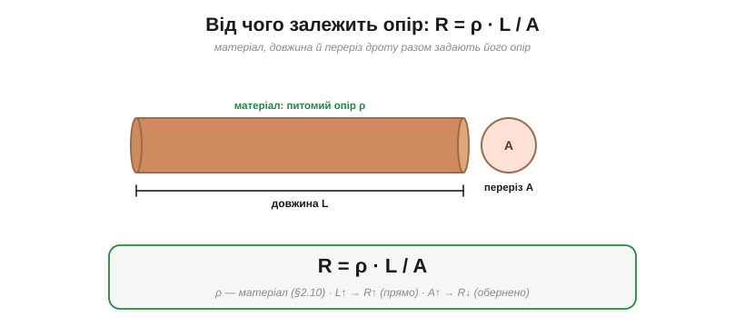
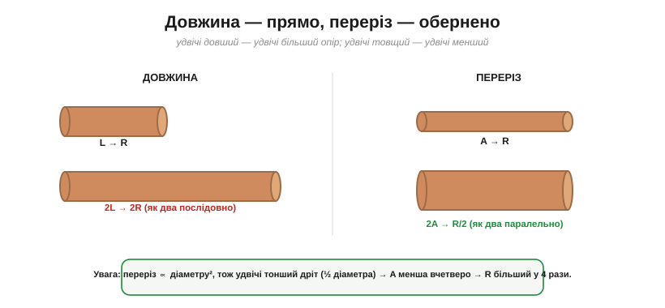
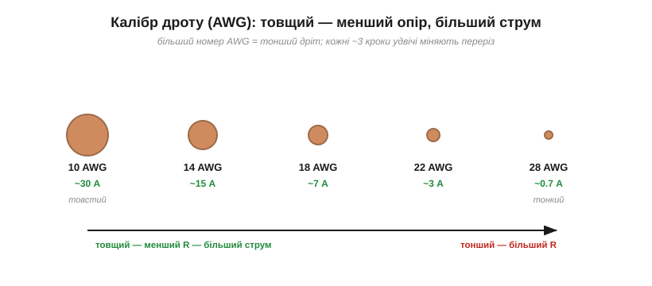
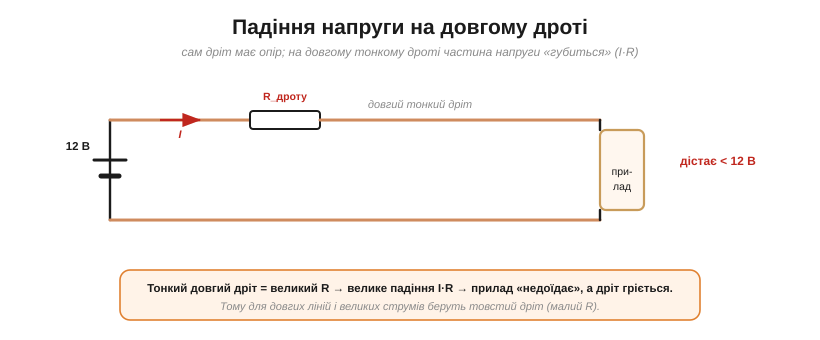

# Від чого залежить опір: матеріал, довжина, переріз

Опір R — це «число на резисторі». Та звідки воно береться для реального провідника — дроту чи доріжки? [Опір](root:ph-condensed/resistance) задають **матеріал** і **форма**, і це можна записати точною формулою — однією з найкорисніших у практичній електротехніці.

### Формула R = ρ·L/A

Опір однорідного провідника дорівнює його питомому опору, помноженому на довжину й поділеному на площу перерізу:

```
R = ρ · L / A
```


*Опір дроту складають три чинники: **ρ** — питомий опір матеріалу, **L** — довжина (входить прямо), **A** — площа перерізу (входить обернено). Що довший і тонший провідник — то більший його опір.*

Кожен множник має просте пояснення, що прямо випливає з [механізму розсіювання електронів на ґратці](root:ph-condensed/resistance-origin):
- **ρ (матеріал)** — наскільки «шорстка» решітка для електронів — це і є [питомий опір](root:ph-condensed/conductivity): у міді малий, у ніхрому великий.
- **L (довжина)** — що довший шлях, то більше зіткнень дорогою, тому опір **прямо пропорційний** довжині.
- **A (переріз)** — що товщий провід, то більше «смуг руху» для електронів паралельно, тому опір **обернено пропорційний** площі.

Чому ж дроти майже завжди мідні? Бо мідь дає чудовий компроміс: дуже малий ρ за помірну ціну. **Срібло** трохи краще, та надто дороге. **Алюміній** має приблизно в півтора раза більший ρ за мідь — зате втричі легший і дешевший; тому на високовольтних лініях і великих шинах беруть алюміній, лише роблячи його товщим, щоб надолужити опір. Вибір матеріалу — завжди торг між ρ, вагою й ціною.

### Довжина прямо, переріз обернено

Ці дві залежності варто відчути окремо — вони працюють по-різному.


***Довжина**: удвічі довший дріт — удвічі більший опір (наче два шматки послідовно). **Переріз**: удвічі товщий (за площею) — удвічі менший опір (наче два дроти паралельно). Важлива пастка: площа залежить від **квадрата** діаметра, тож удвічі тонший дріт має вчетверо менший переріз — і вчетверо більший опір.*

Ключова обережність — із діаметром. Площа круга A = π·d²/4, тобто A ∝ **d²**. Тому коли діаметр дроту зменшити вдвічі, площа падає **вчетверо**, а опір зростає **в чотири рази**. Тонкі дроти опираються набагато сильніше, ніж здається «на око».

Зауважмо й те, що для постійного струму важлива саме **площа** перерізу, а не його форма: круглий дріт, плаский шлейф чи квадратна шина з однаковою площею мають однаковий опір. (На високих частотах це вже не так — там струм тісниться до поверхні, [скін-ефект](root:ph-condensed/conductivity).)

**Приклад (опір мідного дроту).** Який опір має 10 метрів мідного дроту перерізом 0.5 мм²?

```
ρ(мідь) = 1.7 × 10⁻⁸ Ом·м
L = 10 м,  A = 0.5 мм² = 0.5 × 10⁻⁶ м²

R = ρ·L/A = (1.7×10⁻⁸ · 10) / (0.5×10⁻⁶)
R = (1.7×10⁻⁷) / (0.5×10⁻⁶) ≈ 0.34 Ом
```

### Калібр дроту: AWG

На практиці товщину дроту не міряють щоразу — її задають **калібром**. У поширеній системі **AWG** (*American Wire Gauge*) кожному перерізу відповідає номер, і — увага, типова пастка — **більший номер означає тонший дріт**.


*Що менший номер AWG — то товщий дріт, менший опір і більший допустимий струм. 10 AWG — товстий силовий провід (десятки ампер); 28 AWG — тонкий сигнальний (частки ампера). Кожні приблизно три кроки номера удвічі змінюють переріз.*

Логіка та сама, що й у формули: товщий дріт (менший номер AWG) має більший переріз A, отже, **менший опір** — і тому витримує **більший струм** без перегріву (це і є допустимий струм, [ampacity](root:ph-electromagnetism/electric-current)). Тому силові кабелі товсті, а сигнальні — тонкі. Узятий як [повноцінна деталь, дріт](root:hw-components/wire-gauge) має ще й власні риси поза формулою: допустимий струм залежить від умов прокладання, а той самий переріз буває суцільним чи багатожильним.

Сама шкала AWG влаштована логарифмічно: приблизно кожні **3 номери** удвічі змінюють переріз (а отже, і опір), кожні **6** — удвічі діаметр, а **10 номерів** — це вже вдесятеро за площею. У Європі частіше користуються прямо **перерізом у мм²** (0.5; 0.75; 1.5; 2.5 мм²…) — те саме, лише без перекодування в номери.

> 🔧 **Навіщо це.** Калібр дроту добирають **під струм**: що більший струм — то товщий потрібен провід (менший R → менше тепла й менше падіння напруги). Узяти заслабкий дріт — він [перегріється](root:ph-electromagnetism/joule-heating) і може спричинити пожежу; узяти зайво товстий — марно дорого й важко. Орієнтир: для слабких сигналів вистачає тонкого 24–28 AWG, для живлення кількох ампер беруть 18–20 AWG, для потужних навантажень — 14 AWG і товще.

На друкованих платах роль «дроту» грають мідні **доріжки**, і формула працює так само: опір тим менший, чим доріжка ширша й товстіша. Для тонких плівок зручний [**поверхневий опір**](root:ph-condensed/conductivity) (Ом на квадрат): опір доріжки — це поверхневий опір, помножений на число «квадратів» у її довжині (тобто на відношення довжина/ширина). Тому силові доріжки роблять широкими, а часто заливають цілими полігонами міді.

### Падіння напруги на дротах

Найважливіший практичний наслідок формули: **сам дріт теж має опір**, і на ньому теж падає напруга (за [законом Ома](root:hw-analog/ohms-law)). На коротких товстих провідниках це дрібниця, а от на **довгих тонких** — суттєва втрата.


*Опір самого дроту R_дроту «з'їдає» частину напруги: I·R падає вздовж проводу, і прилад на кінці дістає **менше**, ніж видало джерело. Тонкий довгий дріт = великий R = велике падіння + нагрів. Тому для довгих ліній і великих струмів беруть товстий провід.*

**Приклад (втрата на дроті).** Тим самим дротом (R ≈ 0.34 Ом на 10 м) живимо прилад струмом 5 А. Скільки напруги «згубиться» на проводі?

```
треба врахувати обидва проводи (туди й назад): L = 2 × 10 = 20 м
R_дроту ≈ 2 × 0.34 = 0.68 Ом
падіння: U = I·R = 5 × 0.68 ≈ 3.4 В
```

Аж 3.4 вольта! Якщо джерело давало 12 В, до приладу дійде лише ~8.6 В — а різниця піде в **нагрів дроту**. Ось чому тонкий довгий подовжувач під навантаженням гріється, а пристрій на його кінці працює мляво.

> 🔧 **Навіщо це.** Падіння I·R на дротах — постійний клопіт у реальних системах: довгі лінії живлення, тонкі подовжувачі, вузькі доріжки на платі. Боротися з ним просто: коротший і товщий провід (менший R) або вища напруга з меншим струмом (менший I·R — на цьому й тримається передача енергії на високій напрузі, [«війна струмів»](root:ph-electromagnetism/dc-vs-ac)). Прикидати падіння напруги на дроті за R = ρL/A — щоденна навичка проєктувальника живлення.

І ще одне про те саме падіння: на опорі дроту не лише губиться напруга — там [**виділяється тепло**](root:ph-electromagnetism/joule-heating) (I²R_дроту). Тобто заслабкий дріт б'є двічі: і прилад недоїдає, і сам провід гріється, марнуючи енергію. У довідниках для зручності наводять **опір на метр** для кожного калібру — помножив на довжину лінії, і одразу маєш і опір, і падіння, і нагрів.

Формула **R = ρ·L/A** дає опір з самої геометрії провідника — за фіксованої температури. Та значення ρ не сталі: опір металів помітно [«пливе» з температурою](root:ph-condensed/resistance-temperature), тож гарячий дріт опирається сильніше за холодний.
