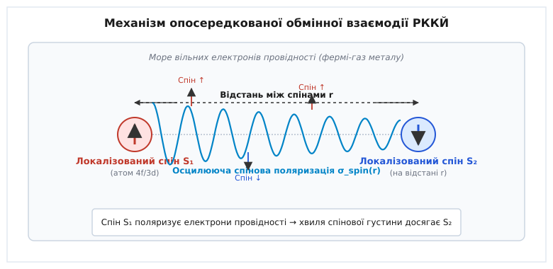
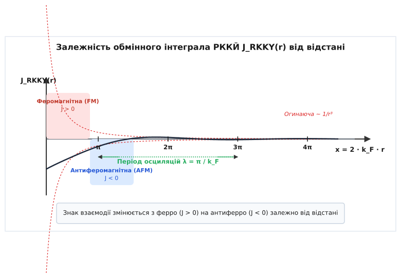
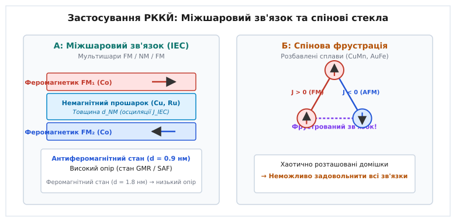

# Взаємодія Рудермана — Кіттеля — Касуї — Йосіди (РККЙ)

<preknowlist>
- [Обмінна взаємодія](root:ph-condensed/exchange-interaction) — квантовомеханічний ефект тотожності ферміонів, що зумовлює ефективне магнітне впорядкування.
- [Рівень Фермі](root:ph-condensed/fermi-level) — межа заповнення електронних станів у металі при абсолютному нулю температур.
- [Гігантський магнітоопір](root:ph-condensed/giant-magnetoresistance) — зміна електричного опору тонкоплівкових магнітних сендвічів при зміні взаємної орієнтації намагніченостей.
</preknowlist>

Теорія взаємодії Рудермана — Кіттеля — Касуї — Йосіди (РККЙ) розв'язує задачу квантового опису довгосяжного магнітного зв'язку між віддаленими атомними спінами через колективне море електронів провідності. Ця задача виникла тому, що класичні та прямі квантові моделі магнетизму виявляються безсилими на нанометрових відстанях: прямий обмінний інтеграл згасає експоненціально `~ exp(-2 α r)` і прямує до строгого нуля вже при `r > 0.4 нм`, а класична диполь-дипольна взаємодія у десятки разів занадто слабка, щоб протистояти тепловому руху. Наприклад, якщо внести 1 атомний відсоток марганцю у матрицю чистої кристалічної міді, середня відстань між суміжними іонами марганцю становитиме від 1.5 до 2.0 нанометрів. На такій дистанції хвильові функції локалізованих 3d-електронів іонів марганцю повністю ізольовані одна від одної, і за класичними уявленнями магнітні моменти мали б поводитися як незалежні парамагнітні диполі. Проте експериментальні вимірювання при кріогенних температурах фіксують у такому сплаві виникнення замороженого магнітного порядку із потужним зв'язком між спінами крізь сотні немагнітних атомів міді, оскільки магнітна інформація передається на нанометрові відстані за допомогою спінової поляризації моря вільних електронів провідності.

---

### 1. Механізм опосередкованого спінового обміну через електронне море

У діелектричних та напівпровідникових магнітних матеріалах (наприклад, оксидах `MnO` або феритах `Fe₂O₃`) міжатомна обмінна взаємодія реалізується за допомогою непрямого суперобміну (*superexchange*). При цьому магнітна інформація передається через віртуальні електронні переходи між d-орбіталями катіонів металу та повністю заповненими p-орбіталями немагнітних аніонів кисню чи галогенів. Проте радіус дії суперобміну суворо обмежений 1–2 міжкристалічними зв'язками (`r ≤ 0.5 нм`) і вимагає наявності хімічного зв'язку з аніоном.

У провідних металевих середовищах виникає принципово інший квантовий канал передачі магнітного моменту. Вільні електрони провідності (s- або p-типу) утворюють вироджений фермі-газ, що вільно пронизує весь об'єм кристалічної ґратки.

Коли локалізований магнітний момент `S₁` (наприклад, недозаповнена 4f-оболонка рідкісноземельного іона гадолінію `Gd³⁺` або 3d-оболонка марганцю `Mn²⁺`) перебуває у вихідній точці `R₁`, він вступає у контактну s-d (або s-f) обмінну взаємодію з електронами провідності, які пролітають поруч. Взаємодія описується ефективним гамільтоніаном Фермі — Кондо:

```
H_sd = - J_sd · S₁ · s(R₁)
```

де `J_sd` — константа s-d обмінного інтеграла, `s(R₁)` — оператор спінової густини електронного газу у точці розташування домішки.

Знак та величина `J_sd` визначають, що електронам із напрямком спіна, паралельним до `S₁`, енергетично вигідніше накопичуватися поблизу домішки, ніж електронам із протилежним спіном. В результаті локалізований спін `S₁` порушує спінову симетрію фермі-газу і створює навколо себе локальну спінову поляризацію електронів провідності:

```
σ_spin(r) = ρ_up(r) - ρ_down(r)
```

де `ρ_up(r)` та `ρ_down(r)` — локальні просторові густини електронів зі спінами "вгору" та "вниз".

Ця індукована спінова поляризація поширюється у просторі у вигляді радіальної хвилі спінової густини. Коли другий локалізований спін `S₂`, розташований у точці `R₂` на відстані `r = |R₁ - R₂|`, потрапляє у цю поляризовану область, він відчуває ефективне внутрішнє магнітне поле, створене спінами електронів провідності.


*Механізм опосередкованої обмінної взаємодії РККЙ через спінову поляризацію електронів провідності*

Підсумовування по всьому електронному морю приводить до ефективного двотільного гамільтоніана непрямої обмінної взаємодії між локалізованими спінами:

```
H_RKKY = - J_RKKY(r) · (S₁ · S₂)
```

Обмінний інтеграл `J_RKKY(r)` описує енергію та знак зв'язку між двома спінами. На відміну від прямого обміну, який завжди згасає монотонно та експоненціально, обмінний інтеграл РККЙ демонструє періодичні осциляції знака залежно від відстані.

Детальний перебіг наукових дискусій та хронологію відкриття цього ефекту висвітлено у вставці [Історія відкриття непрямого обміну](root:ph-condensed/rkky-interaction/hist-rkky-discovery.md).

---

### 2. Осциляції Фріделя та хвильове число ФерМІ

Формування осцилюючого характеру спінової поляризації `σ_spin(r)` корениться у фундаментальній квантовій природі поверхні Фермі.

У класичному газі або при високих температурах квантовий відгук середовища на локальне збурення згасає монотонно за законом Юкави `~ exp(-r / λ_D) / r`, де `λ_D` — дебаївський радіус екранування. Проте електрони провідності у металі підпорядковуються статистиці Фермі — Дірака. При абсолютному нулю температур `T = 0 K` функція розподілу електронів за імпульсами `f(k)` має вигляд жорсткого ступеня: стан повністю заповнений (`f(k) = 1`) для усіх хвильових векторів, обмежених сферою Фермі радиуса `k_F`, і повністю порожній (`f(k) = 0`) поза нею.

Величина хвильового вектора Фермі `k_F` однозначно визначається об'ємною концентрацією вільних електронів провідності `n_e`:

```
k_F = (3 · π² · n_e)⁽¹/³⁾
```

Для більшості благородних і перехідних металів (міді, срібла, золота, алюмінію) значення `k_F` становить близько `1.2–1.8 Å⁻¹` (`12–18 нм⁻¹`).

Коли локалізований спін створює точкове збурення, електронний газ відповідає на нього перерозподілом хвильових векторів. Математично цей відгук описується статичною оборотною сприйнятливістю електронного газу `χ(q)` (функцією Ліндхарда), де `q` — переданий хвильовий вектор під час розсіяння.

Через наявність різкого ступеня у функції розподілу Фермі при `k = k_F`, похідна сприйнятливості `dχ / dq` зазнає логарифмічної особливості (сингулярності) при подвоєному діаметрі сфери Фермі `q = 2 k_F`:

```
dχ / dq |_(q = 2 k_F) → - ∞
```

Ця сингулярність виникає тому, що вектор передачі імпульсу `q = 2 k_F` з'єднує строго протилежні точки на поверхні Фермі. При перетині цього порогу фазовий об'єм можливих стан-стан переходів електронів скачкоподібно змінюється.

У просторовому уявленні обернене перетворення Фур'є цієї логарифмічної особливості створює незгасаючі квантові інтерференційні хвилі густини заряду та спіна — так звані **осциляції Фріделя** (*Friedel oscillations*, на честь французького фізика Жака Фріделя, фр. *Jacques Friedel*).

Довжина хвилі спінових осциляцій `λ_F` визначається крайовим імпульсом Фермі:

```
λ_F = π / k_F
```

Для металевої міді (`k_F = 1.36 Å⁻¹`) період осциляцій становить `λ_F ≈ 0.23 нм`, що порівнянно з міжатомною відстанню у кристалічній ґратці.

Точний квантовомеханічний вивід сприйнятливості Ліндхарда та інтегрування у k-просторі наведено у вставці [Математичний вивід осциляцій Фріделя та функції РККЙ](root:ph-condensed/rkky-interaction/math-rkky-derivation.md).

---

### 3. Знак взаємодії, відстань та просторова вимірність

Аналітичний розрахунок у другому порядку теорії збурень дає універсальний вираз для обмінного інтеграла РККЙ у тривимірному металі:

```
J_RKKY(r) = - J₀ · F(2 · k_F · r)
```

де масштабний енергетичний множник `J₀` дорівнює:

```
J₀ = (J_sd² · m* · k_F⁴) / (8 · π³ · ħ²)
```

тут `m*` — ефективна маса електрона провідності, `ħ` — зведена константа Планка, а безрозмірна осциляційна функція `F(x)` задається формулою:

```
F(x) = (x · cos(x) - sin(x)) / x⁴,      x = 2 · k_F · r
```


*Залежність обмінного інтеграла РККЙ від безрозмірної відстані x = 2 k_F r*

Аналіз функції `F(x)` виявляє три фундаментальні властивості непрямого обміну:

1. **Зміна знака взаємодії (Чергування FM та AFM зон):**
   - При `x = 2 k_F r < 2.4` (малі відстані) функція `F(x) < 0`, що дає `J_RKKY > 0`. Взаємодія є **феромагнітною** (FM): спінам `S₁` та `S₂` енергетично вигідніше орієнтуватися паралельно.
   - У діапазоні `2.4 < 2 k_F r < 5.5` функція змінює знак (`F(x) > 0`), що дає `J_RKKY < 0`. Взаємодія стає **антиферомагнітною** (AFM): спіни прагнуть орієнтуватися антипаралельно.
   - При подальшому збільшенні відстані `r` знак `J_RKKY(r)` періодично чергується з періодом `Δr = π / k_F`.

2. **Степінь згасання амплітуди:**
   При великих відстанях між домішками (`x ≫ 1`) асимптотика функції виражається простіше:
   ```
   F(x) ≈ cos(x) / x³      ⇒      J_RKKY(r) ~ cos(2 · k_F · r) / (2 · k_F · r)³
   ```
   Амплітуда осциляцій згасає за зворотним кубічним законом `~ 1 / r³`. Оскільки об'єм сфери радіуса `r` зростає як `r³`, кількість атомів у шарі компенсує згасання потенціалу. Це робить взаємодію РККЙ дальнодіючою: вона повільно згасає порівняно з експоненціальним прямим обміном.

3. **Вплив просторової вимірності системи:**
   Форма геометричного згасання амплітуди обмінного інтеграла залежить від топології поверхні Фермі та геометрії провідника:

   ```
   3D (об'ємний метал):          J_RKKY(r) ~ cos(2 · k_F · r) / r³
   2D (квантова яма / ґрафен):   J_RKKY(r) ~ sin(2 · k_F · r) / r²
   1D (квантовий нанодріт):      J_RKKY(r) ~ sin(2 · k_F · r) / r
   ```

Зниження вимірності системи від 3D до 1D уповільнює степеневе згасання з `1/r³` до `1/r`, що суттєво посилює непрямий обмін у низьковимірних наноструктурах.

---

### 4. Міжшаровий обмінний зв'язок у магнітних мультишарах та спінтроніка

У 1980-х роках виявилося, що принципи непрямого обміну РККЙ описують не лише точкові магнітні домішки, а й магнітні багатошарові тонкоплівкові структури — так звані "сендвічі" типу **феромагнетик / немагнітний метал / феромагнетик** (`FM₁ / NM / FM₂`), такі як `Co/Cu/Co` або `Fe/Cr/Fe`.

Коли атоми феромагнітного шару `FM₁` утворюють суцільну двовимірну площину, кожен атом створює власну сферичну хвилю спінової поляризації у прошарку немагнітного металу `NM`. Підсумовування (інтегрування) цих хвиль по всій 2D-площині змінює геометричний коефіцієнт згасання.

В результаті виникає **міжшаровий обмінний зв'язок** (*Interlayer Exchange Coupling*, IEC). Енергія взаємодії на одиницю площі інтерфейсу між двома макроскопічними феромагнітними плівками описується співвідношенням:

```
E_IEC = - J_IEC(d) · cos(θ)
```

де `d` — товщина немагнітного прошарку, `θ` — кут між векторами намагніченості двох шарів, а міжшаровий обмінний інтеграл має осциляційний вигляд:

```
J_IEC(d) ≈ (A / d²) · sin(2 · k_F · d + ϕ)
```

де `A` — амплітудний коефіцієнт, `ϕ` — фазовий зсув, зумовлений властивостями інтерфейсу.


*А: Осциляції міжшарового зв'язку у мультишарах. Б: Магнітна фрустрація у розбавленому сплаві*

Зміна товщини немагнітного прошарку `d` всього на кілька ангстрем (1–2 атомні шари) викликає скачкоподібну зміну магнітного стану системи:

1. **Антиферомагнітний стан (`J_IEC < 0`):** При товщині прошарку міді `d ≈ 0.9 нм` намагніченості шарів кобальту орієнтуються строго антипаралельно (`↑ ↓`). У цьому стані структура виявляє максимальний електричний опір.
2. **Феромагнітний стан (`J_IEC > 0`):** При збільшенні товщини міді до `d ≈ 1.8 нм` знак зв'язку змінюється, і намагніченості орієнтуються паралельно (`↑ ↑`), що відповідає мінімальному опору.

Цей ефект став основою для створення спінових клапанів (*spin valves*) та пристроїв **гігантського магнітоопору (ГМО)**. При прикладанні зовнішнього магнітного поля антипаралельна орієнтація шарів примусово переорієнтовується у паралельну, що викликає гігантське падіння опору структури.

Сучасні числові значення фізичних констант, періодів осциляцій та параметрів міжшарового зв'язку для різних металевих систем наведено у довіднику [Експериментальні параметри та матеріали взаємодії РККЙ](root:ph-condensed/rkky-interaction/api-rkky-parameters.md).

---

### 5. Магнітна фрустрація, хаос та фаза спінового скла

Якщо у чистому металі (міді або золоті) хаотично розчинити невелику кількість магнітних атомів марганцю або заліза (`Cu₁₋ₓMnₓ` при `x = 0.1–5 ат. %`), виникає фундаментально новий фізичний стан речовини.

Оскільки магнітні домішки займають вузли кристалічної ґратки випадковим чином, відстані `r_ij` між довільною парою спінів `S_i` та `S_j` є випадковими величинами.

Через осциляційний характер обмінного інтеграла `J_RKKY(r)` це приводить до двох наслідків:
1. **Випадковість за величиною та знаком:** Частина пар спінів взаємодіє феромагнітно (`J_ij > 0`), а інша частина — антиферомагнітно (`J_ij < 0`).
2. **Магнітна фрустрація (*magnetic frustration*, від лат. *frustratio* — обман, марне очікування):** У кристалі виникає безліч замкнених трикутних контурів зі спінів, у яких неможливо одночасно задовольнити вимоги мінімуму енергії для всіх обмінних зв'язків.

Наприклад, якщо у трикутнику спінів `S₁`, `S₂`, `S₃` зв'язок `J₁₂ > 0` (FM), а зв'язки `J₂₃ < 0` та `J₃₁ < 0` (AFM):
- Якщо спін `S₁ = ↑`, то для `J₁₂ > 0` спін `S₂` мусить бути `↑`.
- Для `J₃₁ < 0` спін `S₃` мусить бути `↓`.
- Проте між `S₂ = ↑` та `S₃ = ↓` виникає AFM-зв'язок `J₂₃ < 0`, який задовольняється, але якщо змінити знак одного зі зв'язків, мінімум енергії стає недосяжним для всіх трьох пар одночасно.

Сукупність випадковості (*disorder*) та фрустрації (*frustration*) робить неможливим формування звичайного феромагнітного або антиферомагнітного далекого порядку.

При зниженні температури нижче критичного порогу, названого **температурою заморожування** (`T_f`, *freezing temperature*), тепловий рух вже не може долати бар'єри між обмінними енергіями РККЙ. Системний хаос "заморожується" у нерегулярній, але стаціонарній спіновій конфігурації, названій **спіновим склом** (*spin glass*).

Математичним критерієм переходу у фазу спінового скла є **параметр порядку Едвардса — Андерсона** (*Edwards-Anderson order parameter*, `q_EA`):

```
q_EA = lim_(t → ∞) (1 / N) · ∑ ⟨ S_i(0) · S_i(t) ⟩
```

У парамагнітному стані (`T > T_f`) спіни хаотично коливаються у часі, тому часове усереднення дає `⟨S_i(t)⟩ = 0` та `q_EA = 0`. У фазі спінового скла (`T < T_f`) макроскопічна намагніченість залишкова строго дорівнює нулю (`M_net = ∑ S_i = 0`), але кожен окремий спін заморожується у власному випадковому напрямку, роблячи `q_EA > 0`.

Фазовий простір спінового скла характеризується неергодичністю, наявністю безлічі локальних енергетичних мінімумів та ультраметричною ієрархічною структурою станів, дослідженою Джорджо Паризі (Нобелівська премія з фізики 2021 року).

Детальну алгоритмічну реалізацію моделювання спінового скла методом Монте-Карло Метрополіса наведено у вставці [Чисельне моделювання взаємодії РККЙ та спінового скла](root:ph-condensed/rkky-interaction/proj-rkky-spin-glass.md).

---

> 🔧 **Навіщо це.**
> 
> Знання механізмів РККЙ є ключовим інструментом сучасної наноелектроніки та спінтроніки при розробці:
> 
> 1. **Синтетичних антиферомагнетиків (SAF):** У осередках енергонезалежної магнітної оперативної пам'яті (STT-MRAM) опорний магнітний шар виготовляють у вигляді тришарової структури `CoFeB / Ru / CoFeB`. Товщину рутенію `Ru` підбирають строго рівною `0.4–0.9 нм` (перший антиферомагнітний пік РККЙ). Це жорстко зв'язує два шари антипаралельно, взаємно компенсуючи їхні розсіяні дипольні поля та роблячи комірку пам'яті стійкою до зовнішніх завад.
> 2. **Магнітних сенсорів та зчитувальних головок ГМО:** Налаштування товщини немагнітного прошарку міді `Cu` дозволяє оптимізувати чутливість сенсорів магнітного поля у машинобудуванні, автомобілебудуванні та медичній діагностиці.
> 3. **Спін-орбітальних та квантових обчислювальних платформ:** Взаємодія РККЙ використовується для керованого обмінного зв'язку між віддаленими спіновими кубітами у нанодротах та квантових точках без потреби у фізичному перекритті їхніх хвильових функцій.

---

### 6. Межі застосовності та сучасні узагальнення

Класична теорія РККЙ побудована у припущенні слабкого s-d зв'язку (`J_sd ≪ E_F`) та наявності виродженого електронного газу з кулястою сферою Фермі. У реальних матеріалах виникають відхилення від цієї базової картини.

#### Змагання з ефектом Кондо (Діаграма Доніаха)

У системах із важкими ферміонами та концентрованих рідкісноземельних сполуках (наприклад, `CeCu₂Si₂`, `CeAl₃`) s-d обмінний інтеграл є від'ємним (`J_sd < 0`). Це викликає конкуренцію між двома протилежними квантовими ефектами:
- **Взаємодія РККЙ:** Прагне впорядкувати локалізовані спіни віддалених іонів один відносно одного з енергією `E_RKKY ~ J_sd² · N(E_F)`.
- **Ефект Кондо:** Прагне повністю екранувати кожен локалізований спін хмарою електронів провідності, утворюючи немагнітний синглетний стан з енергією `E_K ~ E_F · exp(-1 / (|J_sd| · N(E_F)))`.

Конкуренція цих двох масштабів енергії описується фазовою діаграмою Доніаха (*Doniach phase diagram*). При малих значеннях `|J_sd|` перемагає взаємодія РККЙ (виникає антиферомагнітний порядок), тоді як при великих `|J_sd|` перемагає ефект Кондо (виникає немагнітна рідина важких ферміонів).

#### Дзялошинський-Морія РККЙ у системах із сильною спін-орбітальною взаємодією

У кристалах без центра інверсії або на інтерфейсах із важкими металами (платиною `Pt`, танталом `Ta`) сильний спін-орбітальний зв'язок додає до ізотропної взаємодії РККЙ анізотропний безекранований доданок — взаємодію Дзялошинського — Морія РККЙ (DM-RKKY):

```
H_DM_RKKY = - D_RKKY(r) · [ S₁ × S₂ ]
```

Векторний характер цієї взаємодії змушує сусідні спіни повертатися перпендикулярно один до одного, що стає причиною формування кіральних спінових текстур — магнітних скірміонів (*skyrmions*) та спіральних доменних стінок у тонких плівках.

#### РККЙ у топологічних ізоляторах та діраківських напівметалах

У новітніх квантових матеріалах — топологічних ізоляторах (`Bi₂Se₃`) та тривимірних діраківських напівметалах — електрони провідності описуються не рівнянням Шредінгера, а безмасовим рівнянням Дірака з лінійним законом дисперсії `E(k) = ħ v_F k`.

У таких системах спін електрона жорстко зчеплений з його імпульсом (*spin-momentum locking*). Непряма взаємодія РККЙ між магнітними домішками на поверхні топологічного ізолятора стає сильно анізотропною: взаємодія залежить не лише від відстані між домішками, а й від орієнтації вектора `r` відносно кристалографічних осей, демонструючи згасання `~ 1/r³` навіть у двовимірному поверхневому шарі.
