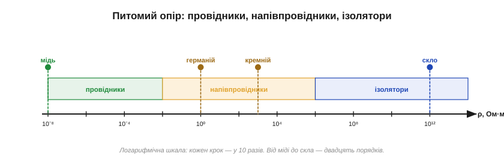
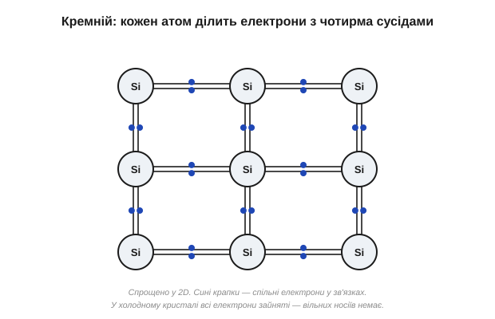
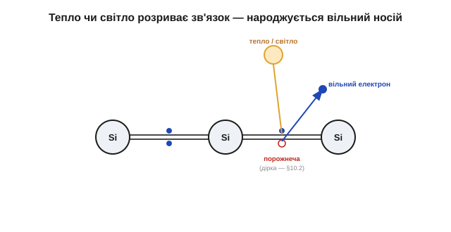
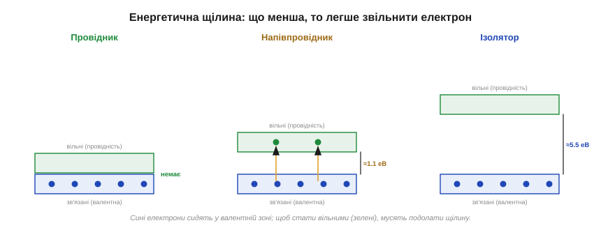
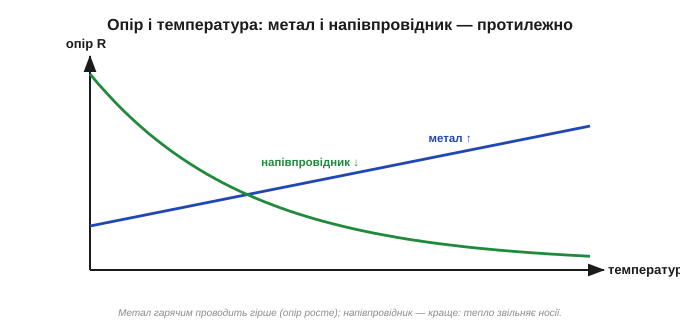
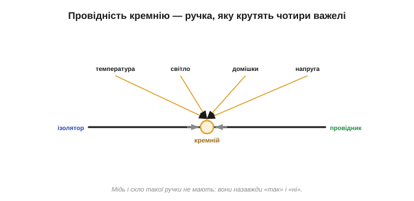

# Напівпровідник: керована провідність кристала

<preknowlist>
- [Провідники й ізолятори](topic:ph-condensed/conductors-insulators) — у металі є вільні електрони, в ізоляторі всі електрони міцно зв'язані з атомами; звідси «проводить» чи «ні».
- [Електричний струм](topic:ph-electromagnetism/electric-current) — напрямлений дрейф вільних носіїв заряду під дією електричного поля.
- [Питомий опір](topic:ph-condensed/resistivity) — міра того, як сильно сам матеріал протидіє струму (ρ, Ом·м), незалежна від розмірів зразка.
- [Валентні електрони](root:basic-chemistry/valence) — зовнішні електрони атома, що утворюють хімічні зв'язки; правило укомплектованої зовнішньої вісімки.
- [Електрон-вольт](topic:hw-sensing/electron-volt) — крихітна одиниця енергії (еВ), зручна під масштаб одного електрона.
</preknowlist>

Опір мідного дроту — це число з таблиці. Хочете дізнатися, як мідь проводить струм, — дивитеся [питомий опір](topic:ph-condensed/resistivity) міді (ρ ≈ 1.7·10⁻⁸ Ом·м) і все: він не залежить ні від того, тепло навколо чи холодно, ні від того, світло чи темрява, ні від напруги, яку ви прикладете. Так само й опір скла — величезне число, теж стале. Метал проводить **завжди**, ізолятор — **ніколи**, і обидва — незмінно.

А тепер уявіть матеріал, у якого опір — **не число з таблиці, а ручка, яку можна крутити**. Той самий шматочок то проводить майже як метал, то майже не проводить, як скло, — залежно від того, наскільки він нагрітий, чи світять на нього, які дрібки чужих атомів у нього вбудували й яку напругу приклали. Саме такий матеріал і зветься **напівпровідником** (*semiconductor*, від латинського *semi-* «напів» і *conductor* «провідник»). Найважливіші з них — **кремній** (*silicon*, Si) і **германій** (*germanium*, Ge, від латинської назви Німеччини — країни першовідкривача). І вся суть, уся цінність напівпровідника — не в якомусь середньому значенні опору, а саме в цій **керованості**. А керованість ця не випадкова — вона випливає просто з того, як влаштований кристал усередині.

### Спершу відчуймо масштаб

Найпростіше побачити «проміжність» напівпровідника — через числа. Розмах питомого опору в природі велетенський:

```
мідь (провідник)     ρ ≈ 1.7·10⁻⁸  Ом·м
кремній (чистий)     ρ ≈ 1·10³     Ом·м
скло (ізолятор)      ρ ≈ 1·10¹²    Ом·м
```

Від міді до скла — це не «у кілька разів», а **двадцять порядків**: у сто мільярдів мільярдів разів. Чистий кремній сидить приблизно посередині цієї прірви — проводить у мільйони разів гірше за метал, але в мільярди разів краще за скло. Не провідник і не ізолятор — щось третє.


*Питомий опір на логарифмічній шкалі (кожен крок — ×10). Від міді до скла — двадцять порядків; напівпровідники займають широку середину. Та головне тут не середнє значення, а те, що для напівпровідника ця точка **рухома**.*

І тут варто одразу застерегти від хибного образу: слово «напівпровідник» оманливе. Річ не в тім, що кремній проводить «наполовину» — тобто вдвічі гірше за мідь. Річ у тім, що він проводить **по-різному** залежно від умов, і його точка на цій шкалі може подорожувати на порядки. Точніше було б назвати його «керованим провідником». Отже, питання не «чому в кремнію такий опір», а «чому цей опір **рухомий**». Відповідь ховається в самому кристалі.

### Всередині кристала: чому носіїв спершу немає

Щоб опір був рухомим, рухомою має бути **кількість вільних носіїв** — бо саме вони переносять струм. У металі носіїв незмінно багато; у напівпровіднику ж їх спершу майже немає — їх доводиться **створювати**. Почнімо з того, чому їх немає.

Атом кремнію має **чотири** зовнішні, валентні електрони. У твердому кремнії кожен атом оточений чотирма сусідами й **ділиться** з кожним по одному електрону, утворюючи спільну електронну пару — **ковалентний зв'язок** (*covalent*, від латинського *co-* «спільно» і *valentia* «сила»). Навіщо саме чотири? Атомові «затишно», коли його зовнішня оболонка укомплектована вісьмома електронами. Маючи свої чотири й позичивши по одному в кожного з чотирьох сусідів, кремній якраз набирає бажану вісімку — тому ґратка виходить симетрична й міцно зшита (та сама структура, що в алмаза). Германій улаштований так само — теж чотири валентні електрони, — тому й поводиться подібно.


*Кожен атом кремнію ділить по парі електронів із чотирма сусідами — ковалентні зв'язки, що добудовують кожному бажану вісімку. У бездоганному холодному кристалі **всі** валентні електрони замкнені у зв'язках, вільних носіїв немає — і чистий кремній поводиться як ізолятор.*

Ось ключ до всього подальшого: у **бездоганному й холодному** кристалі кремнію кожен валентний електрон **зайнятий** у якомусь зв'язку. Вільних, тобто здатних мандрувати кристалом, немає жодного. А раз немає вільних носіїв — немає й струму: ідеально чистий холодний кремній поводиться як **ізолятор**. Це різко відрізняє його від металу, де валентні електрони не прив'язані до окремих атомів, а зливаються в спільну «електронну хмару» й вільні завжди (тому [метал проводить одразу](root:basic-chemistry/metallic-bond), навіть на морозі). У напівпровіднику початок — нуль носіїв. Тож звідки ж береться провідність?

### Розірваний зв'язок народжує пару: електрон і дірку

Зв'язки в кремнії міцні, але не безкінечно. Дайте одному зв'язаному електронові досить **енергії** — і він вирветься зі зв'язку, стане вільним і відтоді блукатиме кристалом, переносячи струм точнісінько як у металі: прикладене поле тягне його крізь ґратку, виходить [дрейф заряду — тобто струм](topic:ph-electromagnetism/electric-current). А енергію цю дає звичайнісіньке **тепло**: за будь-якої температури, вищої за абсолютний нуль, атоми ґратки безупинно тремтять, і подеколи цього тремтіння вистачає, щоб виштовхнути електрон зі зв'язку.

Але тут ховається тонкість, якої немає в металі. Коли електрон покидає зв'язок, на його місці лишається **порожнеча** — незаповнене місце в ковалентній парі. І ця порожнеча теж рухається: сусідній зв'язаний електрон легко перескакує в неї, лишаючи порожнечу вже на **своєму** попередньому місці, туди перескакує наступний — і так незаповнене місце мандрує кристалом у зворотний бік. Рухається воно так, ніби це справжня частинка з **додатним** зарядом, і поводиться як повноцінний носій струму. Цю рухливу вакансію називають **діркою** (*hole*). Отже, один акт розриву зв'язку народжує **пару** носіїв одразу: вільний електрон і дірку.


*Порція енергії (тепло або світло) розриває один зв'язок: електрон стає вільним і дрейфує під полем, а на його місці лишається дірка — вакансія, у яку перескакують сусідні електрони, тож вона теж рухається й переносить заряд. Один акт енергії дає **два** носії — електрон і дірку.*

Ця двоїстість — глибша відмінність напівпровідника від металу, ніж просто «менше носіїв». У металі струм несуть лише електрони; у напівпровіднику — **два сорти носіїв** водночас, негативні електрони й позитивні дірки, і рахувати треба обидва. Те, як діру описують точніше й чому вона поводиться як окрема частинка, розкриває [окрема тема про дірки як носії заряду](topic:ph-condensed/holes-carriers); тут досить знати: розрив зв'язку дає рухому пару, а тепло такі зв'язки безперервно рве.

Народження носіїв — не однобічна вулиця. Вільний електрон рано чи пізно натрапляє на дірку й **повертається** у зв'язок — пара зникає; це **рекомбінація** (*recombination*, «возз'єднання»). За сталої температури тепло народжує пари з тією самою швидкістю, з якою вони рекомбінують, і встановлюється рівновага — певна стала кількість носіїв. Нагрієте кристал — рівновага зсунеться до більшої кількості; охолодите — до меншої. Саме ця рівноважна кількість і визначає провідність. Лишилося зрозуміти головне: **чому** для розриву зв'язку потрібна цілком конкретна порція енергії — і чому в кремнію вона одна, у германію інша, а в скла така, що тепло її майже ніколи не набирає.

### Звідки береться поріг: енергетичні зони

Чому електрон не можна звільнити «трошки», а треба одразу перескочити конкретний поріг? Відповідь — у тому, що в кристалі електрон не може мати будь-яку енергію: дозволені лише певні **смуги** енергій, розділені забороненими проміжками. Побудуймо цю картину з нуля.

В **окремому** атомі електрон може сидіти лише на дозволених рівнях енергії — це відомо з квантової фізики. Тепер зведімо разом безліч атомів у кристал (у кубічному сантиметрі кремнію їх ~5·10²²). Квантовий закон забороняє двом електронам бути в геть однаковому стані, тож коли атоми зближуються, кожен колись однаковий рівень мусить **розщепитися** на безліч трохи різних. З одного рівня в атомі виходить густа «гребінка» з безлічі близьких рівнів — фактично суцільна **зона** дозволених енергій (*band*, «смуга»). А проміжки, що були між рівнями атома, лишаються проміжками й між зонами — там електрону бути **не можна**.

Для провідності важливі дві верхні зони. Нижча з них, **валентна зона**, — це рівні тих самих зв'язаних валентних електронів; за холоду вона заповнена вщерть. Вища, **зона провідності**, — рівні вільних, здатних дрейфувати електронів; за холоду вона порожня. Між ними — **заборонена зона** (енергетична щілина), і її ширину позначають Eg. Тепер уся різниця між трьома класами речовин зводиться до цієї однієї величини:

- У **металі** заборонена зона фактично відсутня — верхні зони перекриваються, вільні рівні є завжди. Тому електрони вільні за будь-якої температури, і провідність чудова.
- В **ізоляторі** заборонена зона величезна (в алмазі ≈ 5.5 еВ). Тепло чи світло майже ніколи не наберуть стільки, щоб перекинути електрон із валентної зони в зону провідності. Носіїв немає — струму немає.
- У **напівпровіднику** заборонена зона мала, але не нульова (у кремнію Eg ≈ 1.12 еВ, у германію ≈ 0.66 еВ). За холоду носіїв обмаль, зате тепло чи світло легко перекидають частину електронів через щілину. Звідси — проміжна й **керована** провідність.


*Дозволені енергії електрона в кристалі збираються у зони: заповнену валентну (сині електрони) і порожню зону провідності (зелені). Між ними — заборонена зона. У металі зони перекриваються (щілини нема), в ізоляторі щілина величезна (≈5.5 еВ), у напівпровіднику мала (Si ≈1.1 еВ). Саме її ширина й вирішує, ким буде речовина.*

Ось чому поріг такий різкий: між «сидить у зв'язку» (валентна зона) і «вільний» (зона провідності) немає проміжних дозволених станів — електрон мусить перестрибнути всю щілину Eg одразу або лишитися на місці. Те, як зони виникають із атомних рівнів, докладніше розбирає [теорія зон у твердому тілі](topic:ph-condensed/band-theory); нам звідси потрібне головне: **малий, але ненульовий поріг Eg — це і є визначальна прикмета напівпровідника**. Тепер порахуймо, скільки ж носіїв цей поріг пропускає.

### Скільки носіїв насправді: рівень Фермі й теплова заселеність

Заборонена зона каже, **скільки** енергії треба на один перескок. Але скільки електронів наберуть цю енергію за даної температури? Тут вступає **рівень Фермі** (*Fermi level*, на честь італійського фізика Енріко Фермі) — умовна «межа заповнення»: рівні енергії нижче за нього прагнуть бути зайнятими, вище — порожніми. У чистому напівпровіднику рівень Фермі лежить приблизно **посеред забороненої зони**. За абсолютного нуля межа різка: усе під нею (валентна зона) заповнене, усе над нею (зона провідності) порожнє — жодного вільного носія.

Із нагріванням межа **розмивається**: з'являється невеликий «хвіст» електронів, яким тепла вистачило, щоб опинитися вище рівня Фермі — у зоні провідності. Скільки їх — вирішує співвідношення між шириною щілини та наявною тепловою енергією. Мірою теплової енергії служить добуток kT (k — стала Больцмана, T — температура в кельвінах); за кімнатної температури kT ≈ 0.026 еВ — у сорок з гаком разів менше за кремнієві 1.12 еВ. Саме тому носіїв за кімнати так мало: перекинути електрон через щілину, вп'ятеро-вдесятеро вищу за типову теплову порцію, вдається лише рідкісному щасливцю з хвоста розподілу. Кількісно цей хвіст спадає **експоненційно** з відношенням Eg до kT — і саме звідси випливе вся драматична чутливість напівпровідника до тепла. [Що таке рівень Фермі й розподіл заселеності](topic:ph-condensed/fermi-level) — окрема тема; нам вистачить висновку: носіїв рівно стільки, скільки тепла перекинуло через щілину, а залежність ця — експонента.

### Полічимо носіїв: власна концентрація та її шалена залежність від тепла

Кількість носіїв у чистому кремнії називають **власною концентрацією** (*intrinsic*, від латинського «внутрішній» — тобто без жодних домішок) і позначають nᵢ. Оскільки кожен розрив зв'язку дає пару, електронів і дірок порівну: n = p = nᵢ. Погляньмо на реальні числа за кімнатної температури (300 К):

**Наскільки рідкісні власні носії в кремнії:**
```
атомів у кристалі      N   ≈ 5.0·10²²   на см³
власних носіїв         nᵢ  ≈ 1.0·10¹⁰   на см³
частка «розбуджених»   nᵢ/N ≈ 2·10⁻¹³   (один носій на ~5·10¹² атомів)
```

Один вільний носій на п'ять трильйонів атомів — мізерна крихта проти металу, де вільний електрон припадає мало не на кожен атом. Ось чому чистий кремній проводить так кепсько (його ρ ≈ 10³ Ом·м — у сто мільярдів разів гірше за мідь). Але вся сіль — у тому, як стрімко ця крихта росте з теплом. Залежність має вигляд:

**Власна концентрація як функція температури:**
```
nᵢ(T) ∝ T^(3/2) · exp( −Eg / (2·k·T) )        k = 8.62·10⁻⁵ еВ/К

при T = 300 К:   Eg/(2kT) = 1.12 / (2 · 8.62·10⁻⁵ · 300) ≈ 21.7
при T = 330 К:   Eg/(2kT) = 1.12 / (2 · 8.62·10⁻⁵ · 330) ≈ 19.7

nᵢ(330) / nᵢ(300) ≈ exp(21.7 − 19.7) · (330/300)^(3/2)
                  ≈ exp(2.0) · 1.15
                  ≈ 7.4 · 1.15 ≈ 8.5
```

Прочитаймо цей результат. Підняли температуру кремнію лише на 30 °C — а власних носіїв стало у **вісім-дев'ять разів** більше. Експонента в формулі й робить залежність такою крутою: власна концентрація кремнію подвоюється приблизно на кожні 9–10 °C нагріву. Це не «трохи більше» — це майже на порядок за пів десятка десятків градусів. Порівняйте з міддю, де кількість носіїв від нагріву не змінюється взагалі. Ось де народжується та сама рухома точка на шкалі опору: провідність напівпровідника росте з температурою по експоненті, тому й опір із нагріванням різко **падає**.

Із формули видно й роль щілини. Що менша Eg, то менший показник Eg/(2kT), то більший експоненційний множник — то більше носіїв за тієї самої температури. Германій із його вужчою щілиною (0.66 еВ проти 1.12 еВ) має за кімнати nᵢ ≈ 2·10¹³ см⁻³ — у тисячі разів більше, ніж кремній. Ця обставина колись зробила германій зручнішим, а згодом — програшним.

### Дві прикмети керованості: тепло і світло

Тепер видно, чому дві найпростіші «ручки» напівпровідника — це температура і світло: обидві вкидають у кристал енергію, що розриває зв'язки.

Температура вже все нам розповіла кількісно: більше тепла → більше розірваних зв'язків → більше носіїв → менший опір. Метал поводиться **протилежно**: у ньому кількість носіїв стала, а нагрівання лише сильніше розгойдує ґратку, що дедалі більше заважає електронам рухатися, тож [опір металу з нагріванням зростає](topic:ph-condensed/resistance-temperature). Один цей факт — провідність, що росте з температурою, — миттєво видає напівпровідник.


*Опір залежно від температури. У металі він поволі зростає (нагріта ґратка дужче розсіює електрони), у напівпровіднику — круто падає (тепло звільняє дедалі більше носіїв). Протилежний хід кривих — надійна прикмета напівпровідника.*

Світло діє так само, тільки енергію приносить не тремтіння ґратки, а **фотони**: якщо енергія фотона більша за Eg, він, поглинувшись, розриває зв'язок і народжує пару носіїв. Тому напівпровідник провідніший на світлі, ніж у темряві.

Обидві ручки вже готові прилади. **[Термістор](topic:hw-sensing/ntc-thermistor)** — напівпровідниковий резистор, опір якого помітно падає при нагріванні; його ставлять давачем температури: міряючи опір, дізнаються, наскільки гаряче. **[Фоторезистор](topic:hw-sensing/photo-sensors)** робить те саме на світло: опір падає на світлі й росте в темряві — звідси давачі освітленості й нічники, що самі вмикаються присмерком. У жодному з них немає механіки — лише кристал, що змінює опір у відповідь на зовнішню умову.

> 🔧 **Навіщо це.** У цій самій чутливості ховається й непроханий бік. Теплові носії народжуються **завжди**, навіть коли їх не просять, і дають невеликий струм там, де мало б бути закрито, — **витік**. Що вужча щілина й що гарячіший прилад, то більший витік; у крайньому разі він розігріває кристал, а тепло народжує ще більше носіїв — виникає самопідсилення, [тепловий пробій](topic:hw-components/thermal-runaway), що може спалити прилад. Тому потужну чи точну напівпровідникову техніку доводиться охолоджувати, а розробники все життя борються з цим тепловим «шумом». Керованість і паразитний витік — дві сторони однієї медалі.

### Не лише скільки, а й як швидко: рухливість

Кількість носіїв — лише половина справи. Провідність залежить ще й від того, **як прудко** кожен носій рухається під полем, і ці два чинники входять у неї окремими множниками:

```
σ = q · ( n·μₙ + p·μₚ )

  σ      — питома провідність (величина, обернена до питомого опору)
  q      — заряд електрона, 1.6·10⁻¹⁹ Кл
  n, p   — концентрації електронів і дірок
  μₙ, μₚ — їхня рухливість
```

**Рухливість** (*mobility*, від латинського *mobilis* «рухливий») μ — це наскільки швидкий дрейф дає носієві одиничне поле. І вона теж не стала: рухаючись крізь ґратку, носій весь час на щось наштовхується й гальмує. Гальмують його головно два винуватці. Перший — теплові коливання ґратки: кванти цих коливань, **фонони** (*phonon*, від грецького *φωνή* «звук»), розсіюють носіїв, і що гарячіше, то фононів більше, то менша рухливість. Другий — самі домішки й дефекти ґратки: кожен чужий атом чи ґандж — це центр розсіяння. [Рухливість носіїв](topic:ph-condensed/carrier-mobility) і [фонони](topic:ph-condensed/phonon) розібрані окремо; нам важливий висновок: провідність — це **добуток** кількості носіїв на їхню рухливість, тож крутити її можна з двох боків.

Рухливість, до речі, пояснює давню технічну перевагу германію: у ньому носії помітно рухливіші, ніж у кремнію (для електронів — близько 3900 проти 1400 см²/(В·с)), тож германієві прилади природно працюють на вищих частотах. А ще вища вона в напівпровіднику арсеніду галію (GaAs) — тому його й досі люблять там, де потрібна швидкодія.

### Чому важить саме розмір щілини: кремній, германій і решта

Ширина забороненої зони визначає одразу дві речі: і скільки носіїв народжує тепло, і як прилад тримається на спеці. Зведімо їх в одну картину на прикладі двох головних матеріалів.

У германію щілина вужча (0.66 еВ), тож за тієї самої температури в ньому куди більше теплових носіїв. Колись це була перевага: германій легше очищався й давав більше «сигналу», тому вся рання електроніка була германієва. Але та сама вузька щілина обертається вадою: германій рясно «підтікає» вже за помірного нагріву (десь від 70–75 °C) і втрачає керованість. Кремній із ширшою щілиною (1.12 еВ) спокійніший: тому самому теплу важче перекинути носія через вищий поріг, витік менший, прилад працює до 150–175 °C. Додайте до цього, що кремній — другий за поширеністю елемент земної кори (звичайний пісок), а його власний оксид SiO₂ виявився ідеальною ізоляцією для виробництва мікросхем, — і стане зрозуміло, чому світ збудовано саме на кремнії.

> 📜 **Історія до теми:** [кремній проти германію — чому виграв «пісок»](topic:ph-condensed/semiconductor/hist-silicon-germanium.md). Уся рання електроніка була германієва; як кремній наздогнав за один 1954 рік (Танненбаум у Bell зробив перший, Тіл у Texas Instruments перший продав), знаменитий фокус Тіла з гарячою олією, і чому остаточно закріпив перемогу кремнію його власний оксид SiO₂.

Ширина щілини керує не лише теплом. Від її «устрою» залежить, чи вміє матеріал світитися. У кремнію та германію щілина **непряма** — при поверненні електрона у зв'язок енергія здебільшого йде в тепло, а не у світло, тож світлодіода з них не зробиш. А от у GaAs щілина **пряма**, і електрон, падаючи назад, легко віддає енергію фотоном — тому світлодіоди й лазери роблять саме з таких матеріалів. Різницю між прямою і непрямою щілиною розбирає [окрема тема](topic:ph-condensed/direct-indirect-bandgap); тут важливо, що вибір напівпровідника — це передусім вибір **ширини й типу щілини** під задачу. Потрібна теплостійкість і висока напруга — беруть широкозонні карбід кремнію (SiC, ≈3.3 еВ) чи нітрид галію (GaN, ≈3.4 еВ); потрібна швидкодія й світло — арсенід галію; потрібна дешевизна й масовість — кремній.

### Від матеріалу до приладу: де починається активна електроніка

Тепло і світло — ручки кволі: ними провідність кремнію не задаси наперед і не перемкнеш за наносекунду. Справжня могутність напівпровідника відкривається з двома куди сильнішими важелями — і саме вони перетворюють цікавий матеріал на основу всієї електроніки.


*Провідність напівпровідника — не стала властивість, а «ручка» між ізолятором і провідником, яку зсувають чотири важелі: тепло, світло, домішки (легування) і прикладена напруга. Мідь і скло такої ручки не мають — вони назавжди «так» і «ні».*

Перша сильна ручка — **домішки**. Якщо в майже ідеально чистий кремній навмисно вбудувати дрібку чужих атомів, можна наперед і назавжди задати, скільки в ньому носіїв і якого сорту — переважно електрони чи переважно дірки. Дивовижно, але вистачає буквально одного чужого атома на мільйон, щоб змінити провідність у тисячі разів. Цей прийом зветься [легуванням](topic:ph-condensed/doping), і з нього починається все цікаве: кремній n-типу (з надлишком електронів), p-типу (з надлишком дірок), а на їхньому стику — [PN-перехід](topic:ph-condensed/pn-junction), який пропускає струм лише в один бік. Друга сильна ручка — **прикладена напруга**: полем можна миттєво відчиняти й зачиняти потік носіїв, і саме на цьому стоїть транзистор.

І ось тут — головна різниця, заради якої весь цей камінь варто вивчати. Пасивні елементи — резистор, конденсатор, котушка — лише **реагують** на сигнал, кожен по-своєму, але пасивно; жоден із них не дає одному електричному впливові керувати іншим. Напівпровідниковий прилад дає це вперше: слабка напруга на затворі керує сильним струмом крізь кристал. Матеріал, чию провідність можна плавно зсувати від ізолятора до провідника на команду, перетворює електрику з чогось, що ти лише пропускаєш чи не пропускаєш, на щось, чим ти **керуєш**. Саме звідси — від рухомої точки на шкалі опору — і починається активна електроніка: клапан (діод), підсилювач і ключ (транзистор), а з мільярдів таких ключів — процесор.

> 📜 **Історія до теми:** [діод і PN-перехід — від «котячого вуса» до кристалічного клапана](topic:ph-condensed/semiconductor/hist-diode.md). Ланцюг питань навколо одного дива: чому шматочок каменю пропускає струм лише в один бік — від спостереження Брауна (1874) і кристалічного детектора Бозе й Пікарда до випадкового PN-переходу Рассела Ола (1939) у Bell Labs, з якого за вісім років виріс [перший транзистор](topic:hw-components/transistor-idea).
