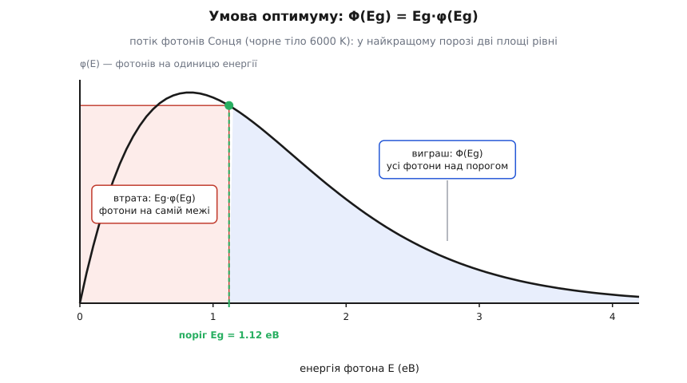
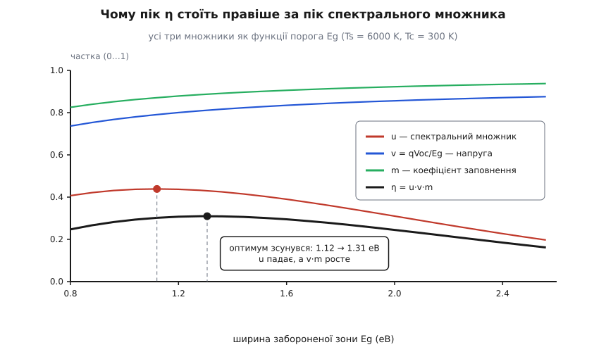
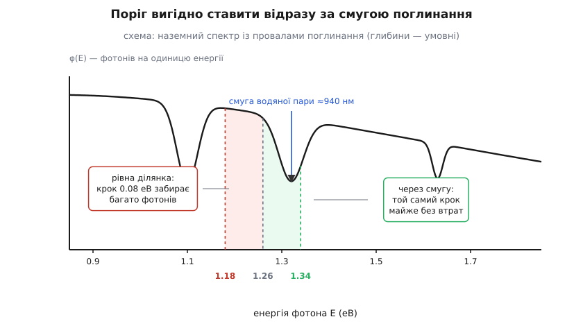

# 🧮 Звідки береться 33.7%: інтеграл по спектру й точка оптимуму

Це число не виміряне й не підігнане: воно виходить із однієї Планкової функції, проінтегрованої двічі, — і тут ця дорога пройдена від першої формули до останньої цифри. Та цікавіше за саме число інше: чому крива межі має пік саме коло 1.3 еВ, а не деінде. За цим стоїть одна коротка умова на похідну, з якої видно і положення максимуму, і чому він такий плаский.

## Правила гри

Модель має рівно три припущення й жодного припасованого коефіцієнта.

**Сонце** — [чорне тіло](topic:ph-thermodynamics/planck-law-and-blackbody-spectrum) за температури Ts = 6000 K: нагріте тіло світить за Планком, і скільки фотонів якої енергії йде з одиниці його площі за секунду, задає сама лише температура. Диск Сонця видно із Землі під кутовим радіусом θ = 0.2665°, тож світло приходить у крихітному тілесному куті:

```
Ω☉ = 2π·(1 − cos θ) = 2π·(1 − cos 0.2665°) = 6.80·10⁻⁵ ср
```

**Елемент** — досконалий поглинач усього, що над порогом Eg, і повний невидимка для того, що під ним; температура Tc = 300 K. Світить він у півсферу над собою, а [ламбертова поверхня віддає з одиниці площі рівно π·b](topic:ph-waves/lambert-cosine-law) — множник π, а не 2π, бо навскісні промені несуть менше. Ось перша асиметрія, яка потім віддасться напругою: елемент випромінює в кут π, а п'є з кута Ω☉, у π/Ω☉ = 4.6·10⁴ разів вужчого.

**Більше нічого:** ні дефектів, ні опору, ні відбиття.

Рахувати треба фотони, а не джоулі: струм складається із зарядів, і кожен поглинутий надпороговий фотон дає рівно один. Тому цеглиною беремо фотонну яскравість — скільки квантів іде з площі за секунду в одиничний тілесний кут в інтервалі енергій біля E:

```
b(E,T) = (2 / h³c²) · E² / (exp(E/kT) − 1)     [фотон·с⁻¹·м⁻²·ср⁻¹ на одиницю E]
```

Позначмо потік, що падає на елемент, φ(E) = Ω☉·b(E,Ts), а його хвіст над порогом — Φ(Eg). Тоді вся модель вкладається в шість рядків:

```
Φ(Eg) = ∫(E ≥ Eg) φ(E) dE           — скільки фотонів Сонця над порогом
Jsc   = q · Φ(Eg)                    — кожен із них дає один заряд
J0    = q · π · ∫(E ≥ Eg) b(E,Tc) dE — власне світіння елемента
Pin   = ∫ E · φ(E) dE = Ω☉·σTs⁴/π    — уся падна потужність
J(V)  = Jsc − J0·(exp(qV/kTc) − 1)   — струм на клемах
η(Eg) = max_V [ V·J(V) ] / Pin       — те, що шукаємо
```

Два з цих рядків варто пояснити. J0 тут не параметр із виміру, а порахована величина: тіло, яке над порогом поглинає все, за рівновагою мусить над порогом і випромінювати як чорне тіло своєї температури — інакше воно саме собою нагрівалося б або холонуло. А множник exp(qV/kTc) з'являється тому, що прикладена напруга зсуває заселеності електронів і дірок у [p-n переході](topic:ph-condensed/pn-junction) і рівно настільки підсилює це саме світіння. У підсумку виходить [ідеальний діодний закон](topic:hw-components/diode-iv-curve) — тільки виведений із лічби фотонів, а не припасований до виміряної кривої.

Останній штрих перед роботою: ККД зручно розбити на три множники, домноживши й поділивши на (Eg/q)·Jsc та Voc.

```
       Pmax       (Eg/q)·Jsc        Voc           Pmax
η  =  ──────  =  ────────────  ·  ────────  ·  ───────────  =  u · v · m
       Pin           Pin            Eg/q          Jsc·Voc
```

Скорочення точне, тож розкласти так можна завжди й задарма. Цінне інше: кожен множник ізолює свою втрату. **u** — частка падної потужності, яка лишилася б, якби кожен надпороговий фотон віддав рівно Eg (тобто разом прозорість і термалізація). **v = qVoc/Eg** — яка частка порога дійшла в напругу. **m** — плата за форму кривої, коліно між струмом і напругою.

## Спектральний множник і його точна умова оптимуму

Перший множник — чиста арифметика спектра:

```
u(Eg) = Eg · Φ(Eg) / Pin
```

Він не залежить ні від температури елемента, ні від геометрії: Ω☉ стоїть і в чисельнику (усередині Φ), і в знаменнику (усередині Pin), тож скорочується. u — властивість самої лише **форми** спектра.

Тепер похідна. Підняли поріг на dEg — саме φ(Eg)·dEg фотонів провалилися під нього, тобто Φ′(Eg) = −φ(Eg). Звідси

```
du/dEg = [ Φ(Eg) − Eg·φ(Eg) ] / Pin
```

і максимум стоїть там, де

```
Φ(Eg) = Eg · φ(Eg)
```

Це рівність двох граничних величин, і кожна має простий зміст. Піднімаємо поріг на dEg: кожен із Φ фотонів, що лишилися над ним, віддає тепер на dEg більше — виграш Φ·dEg. Водночас φ·dEg фотонів випали з гри, і кожен ніс Eg — втрата Eg·φ·dEg. Найкраща точка — де ці дві граничні величини зрівнялися; лівіше вигідно піднімати поріг, правіше — опускати.

Те саме мовою відсотків: Eg·φ/Φ — це рівно −d ln Φ/d ln Eg, тобто на скільки відсотків меншає фотонів, коли поріг підвищується на один відсоток. Оптимум там, де відсоток міняється за відсоток.


*Синій хвіст — Φ(Eg), усі фотони над порогом: стільки їх виграє від підняття порога. Червоний прямокутник — Eg·φ(Eg): фотони на самій межі, помножені на те, що кожен ніс. У найкращому порозі ці дві площі рівні.*

**Оптимум спектрального множника для чорного тіла 6000 K.**
```
підстановка x = E/kTs робить умову безрозмірною й не залежною від Ts:

     ∫(x ≥ xg) x²/(exp(x) − 1) dx  =  xg · xg²/(exp(xg) − 1)

числовий корінь:   xg = 2.166
kTs = k · 6000 K   = 0.5170 еВ
Eg  = 2.166 · 0.5170 = 1.120 еВ

перевірка обох боків в абсолютних одиницях:
     Φ(1.12)    = 3.888·10²¹ фотон/(с·м²)
     Eg·φ(1.12) = 1.12 · 3.472·10²¹ = 3.888·10²¹   ✓

u = Eg·Φ/Pin = 1.12 · 3.888·10²¹ · 1.602·10⁻¹⁹ / 1590 = 0.439
```

Отже, ще до всякої напруги, ще до вибору матеріалу — 43.9%. Саме це число (заокруглено 44%) 1961 року назвали граничною ефективністю. Понад половина сонячної потужності зникає вже тут, і причина видна з тих самих інтегралів: над порогом 1.12 еВ лежить 54.7% усіх сонячних фотонів, і кожен із них зараховується не за своєю енергією, а за порогом.

## Напруга: скільки лишається від порога

Другий множник упирається в J0 — і саме через нього стеля взагалі існує: якби власне світіння елемента можна було вимкнути, логарифм нижче розганяв би напругу без краю. Напруга розімкненого кола береться з умови J = 0:

```
Voc = (kTc/q) · ln(Jsc/J0 + 1)
```

Щоб побачити структуру відповіді, обидва інтеграли варто взяти в наближенні Віна — відкинути −1 у знаменнику Планка. Для елемента це майже точно (Eg/kTc ≈ 50), для Сонця (Eg/kTs ≈ 2.2) — грубіше, і чого це коштує, покаже звірка з точним інтегралом за кілька рядків. Хвостовий інтеграл береться аналітично:

```
∫(E ≥ Eg) E²·exp(−E/kT) dE = kT·exp(−Eg/kT)·(Eg² + 2Eg·kT + 2(kT)²)
```

Відношення двох таких хвостів розпадається на добуток, а логарифм добутку — на суму. Напруга виходить чотирма доданками, і кожен має ім'я:

```
qVoc ≈ Eg·(1 − Tc/Ts) − kTc·ln(π/Ω☉) + kTc·ln(Ts/Tc) + kTc·ln(Fs/Fc)
       де F = 1 + 2kT/Eg + 2(kT/Eg)²  — передмножник хвоста
```

**Розклад напруги при Eg = 1.306 еВ.**
```
kTc/q = 25.85 мВ,   π/Ω☉ = 46 200,   Ts/Tc = 20
Fs = 1 + 2·0.5170/1.306 + 2·(0.5170/1.306)²   = 2.105
Fc = 1 + 2·0.02585/1.306 + 2·(0.02585/1.306)² = 1.040

Eg·(1 − Tc/Ts)  = 1.306 · 0.95      = +1.2406 В   карнотів податок
−kTc·ln(π/Ω☉)   = −0.02585 · 10.74  = −0.2777 В   вузький кут Сонця
+kTc·ln(Ts/Tc)  = +0.02585 · 3.00   = +0.0774 В   гарячіший хвіст
+kTc·ln(Fs/Fc)  = +0.02585 · 0.705  = +0.0182 В   передмножник
                                      ─────────
                                       1.0585 В
точний інтеграл дає                    1.0593 В   (розбіжність 0.8 мВ)
```

Перший доданок — карнотів коефіцієнт машини між гарячим Сонцем і теплим елементом; його не прибрати нічим. Другий — плата за асиметрію кутів: світимо в π, п'ємо з Ω☉. Третій і четвертий — невеликі надбавки за те, що гарячий хвіст Сонця спадає куди повільніше за холодний хвіст елемента.

> 🔧 **Навіщо це.** З чотирьох доданків лише другий піддається інженерії. Сфокусуй сонце лінзою — його видимий кут росте, ln(π/Ω☉) в'яне, і недобір 0.278 В меншає аж до нуля за граничної концентрації. Саме тому концентраторні елементи дають помітно вищу напругу, і саме тому концентрація — найпростіший спосіб підняти стелю, не чіпаючи ні матеріалу, ні кількості переходів.

Головне тут — структура: усі доданки, крім першого, майже не залежать від Eg. Тобто недобір напруги — це майже стала величина:

```
qVoc ≈ 0.95·Eg − 0.18 еВ        (Ts = 6000 K, Tc = 300 K, без концентрації)
v = qVoc/Eg = 0.95 − 0.18/Eg
```

Стала 0.18 еВ з'їдає тим меншу частку, чим вищий поріг. Тому v росте з Eg: 0.791 при 1.12 еВ, 0.811 при 1.31, 0.828 при 1.50. Цю деталь варто запам'ятати — вона зараз посуне оптимум.

## Коліно ВАХ у замкненій формі

Третій множник — форма кривої. Клеми віддають P = V·J(V); шукаємо максимум:

```
dP/dV = 0   ⟹   (1 + z)·eᶻ = Jsc/J0 + 1 ≡ X,     z ≡ qVmp/kTc
```

Рівняння трансцендентне, але не безнадійне. Домножмо обидва боки на e: (1 + z)·e^(1+z) = e·X. А це рівно означення [W-функції Ламберта](topic:math-analysis/lambert-w) — оберненої до w·eʷ, тобто W(y) є розв'язком рівняння w·eʷ = y. Отже, робоча точка виражається точно:

```
qVmp/kTc = z = W(e·X) − 1
```

Далі все виходить алгебраїчно, без жодного пробігу по напрузі. З (1 + z)·eᶻ = X маємо J0·eᶻ = (Jsc + J0)/(1 + z), тож

```
Jmp  = Jsc − J0·(eᶻ − 1) = (Jsc + J0) · z/(1 + z)
Pmax = Vmp · Jmp = (kTc/q) · (Jsc + J0) · z²/(1 + z)
m    = Pmax/(Jsc·Voc) = z² / [ (1 + z)·voc ],     voc ≡ qVoc/kTc
```

**Робоча точка при Eg = 1.306 еВ.**
```
Jsc = 523.7 А/м²,   J0 = 8.38·10⁻¹⁶ А/м²

voc = ln(Jsc/J0 + 1) = 40.98   →  Voc = 40.98 · 25.85 мВ = 1.0593 В
z   = W(e^41.98) − 1 = 37.33   →  Vmp = 37.33 · 25.85 мВ = 0.9651 В
Jmp = 523.7 · 37.33/38.33 = 510.1 А/м² = 51.0 мА/см²
Pmax = 0.9651 · 510.1 = 492.3 Вт/м²
m    = 37.33² / (38.33 · 40.98) = 0.887
```

Числовий пробіг по напрузі дає ті самі 0.96507 В — збіг до п'ятого знака. Ані повного струму Jsc, ані повної напруги Voc одночасно не зняти: [робоча точка максимальної потужності](topic:hw-power/panel-iv-mpp) завжди сидить у згині.

Замкнена форма ще й пояснює одну відому емпіричну формулу. Асимптотика W(eʸ) ≈ y − ln y дає z ≈ voc − ln(1 + voc), а точний вираз z²/[(1 + z)·voc] відрізняється від простішого z/(1 + voc) лише на 0.2% — отже, m ≈ (voc − ln(1 + voc))/(1 + voc). Це рівно вигляд наближення m ≈ (voc − ln(voc + 0.72))/(voc + 1), яким користуються для коефіцієнта заповнення; стала 0.72 замість одиниці — підгонка, що прибирає решту похибки. При voc = 40.98 воно дає 0.8873 проти точних 0.8872. Отже, емпірична на вигляд формула — це просто перший член розкладу W.

## Куди зсувається оптимум

Тепер збираємо. Максимум добутку зручно шукати через логарифми, бо логарифм добутку — сума:

```
d ln η/dEg = d ln u/dEg + d ln v/dEg + d ln m/dEg = 0
```

Перший доданок відомий точно — це та сама гранична умова, переписана як похідна:

```
d ln u/dEg = 1/Eg − φ(Eg)/Φ(Eg)
```

Другий — із формули v = 0.95 − b/Eg, де b ≈ 0.18 еВ:

```
d ln v/dEg = b / (Eg · qVoc)
```

При Eg = 1.306 це 0.18/(1.306·1.059) = 0.131 еВ⁻¹; точне диференціювання дає 0.118, трохи менше — бо b поволі росте з Eg через той самий передмножник хвоста. Третій доданок найменший: кожен додатковий електронвольт порога додає до voc близько 0.95/kTc ≈ 37 одиниць, а що більше voc, то квадратніше коліно.

**Баланс трьох нахилів (Ts = 6000 K, Tc = 300 K).**
```
Eg, еВ    d ln u/dEg   d ln v/dEg   d ln m/dEg     сума
1.12        −0.000       +0.159       +0.118      +0.277
1.20        −0.094       +0.139       +0.103      +0.148
1.26        −0.158       +0.127       +0.093      +0.061
1.306       −0.204       +0.118       +0.086       0.000   ← оптимум
1.40        −0.291       +0.103       +0.075      −0.113
```

Читається таблиця так. У піку спектрального множника (1.12 еВ) його власний нахил уже нульовий, а напруга й коліно ще ростуть — отже, добуток там ще росте, і зупинятися рано. Оптимум сповзає праворуч рівно доти, доки падіння u не з'їсть увесь приріст v·m. Те саме видно й з умови: рівність φ/Φ = 1/Eg тепер має виконуватися не сама по собі, а з добавкою праворуч, а відношення φ/Φ монотонно росте з порогом — тож корінь неминуче зсувається вгору.

Наскільки саме — видно з квадратичного наближення. Коло свого піку ln u падає з кривиною −d²ln u/dEg² = 1.24 еВ⁻², а сумарний нахил, що його дають v і m, коло 1.2 еВ становить +0.242 еВ⁻¹:

```
ΔEg ≈ 0.242 / 1.24 = 0.195 еВ    →    Eg ≈ 1.12 + 0.20 = 1.32 еВ
```

Точний корінь — 1.306 еВ. Тобто весь зсув оптимуму від спектрального 1.12 до справжніх 1.31 — це плата за те, що напруга й коліно люблять високий поріг більше, ніж спектр його не любить.


*Спектральний множник u має пік при 1.12 еВ, але напруга v і коефіцієнт заповнення m монотонно ростуть — тож пік добутку η стоїть правіше, коло 1.31 еВ.*

**Складання числа (Ts = 6000 K, Tc = 300 K, оптимальний поріг).**
```
Eg   = 1.306 еВ
Pin  = Ω☉·σTs⁴/π                  = 1590 Вт/м²
Jsc  = q·Φ(Eg)                     = 523.7 А/м² = 52.4 мА/см²
J0   = q·π·∫(E ≥ Eg) b(E,Tc) dE    = 8.4·10⁻¹⁶ А/м²
Voc  = 25.85 мВ · ln(Jsc/J0 + 1)   = 1.0593 В
Pmax = (kTc/q)·(Jsc + J0)·z²/(1+z) = 492.3 Вт/м²

u = 1.306 · 523.7 / 1590           = 0.430
v = 1.0593 / 1.306                 = 0.811
m = 492.3 / (523.7 · 1.0593)       = 0.887

η = 0.430 · 0.811 · 0.887          = 0.310   →  31.0 %
```

Одна перевірка на здоровий глузд. Чорне тіло 6000 K у сонячному тілесному куті дає 1590 Вт/м², тоді як над атмосферою міряють ≈1361 Вт/м² — модель світить забагато. ККД є відношенням, тож частину цієї похибки він гасить, але не всю: візьміть Ts = 5778 K (та ефективна температура, що дає правильну сонячну сталу) — і оптимум переїде на 1.265 еВ, а стеля стане 30.5% замість 31.0%. Це ціна вибору однієї цифри в моделі.

## Чому полиця така пласка

Той самий прогін по всіх порогах дає не шпиль, а плато:

```
Eg, еВ    0.90   1.00   1.12   1.20   1.31   1.42   1.50   1.60
η, %      27.1   28.8   30.2   30.7   31.0   30.7   30.3   29.5
```

На цілих 0.3 еВ вибору — від 1.12 до 1.42 — ККД тримається в межах одного відсоткового пункта. Це прямий наслідок нуля похідної: біля максимуму функція квадратична, а кривина тут мала, бо спектр Планка широкий і u спадає повільно, тоді як v·m ще й підтримує криву згори.

> 🔧 **Навіщо це.** Пласка полиця означає, що гонитва за матеріалом з «ідеальною» зоною майже нічого не дає: кремній зі своїми 1.12 еВ програє оптимуму менше за відсотковий пункт (30.2 проти 31.0), тоді як зайва десята вольта втрат на напрузі забирає майже три пункти — утричі дорожче. Оптимізувати треба не Eg, а все, що заганяє J0 вище за його теплову підлогу.

## Справжній спектр: звідки 33.7% при 1.34 еВ

Усе досі рахувалося для гладкого чорного тіла. Наземне світло не таке: атмосфера вигризає з нього смуги — водяна пара, кисень, вуглекислий газ — і зрізає краї. Саме таку пораховану за атмосферними даними криву й закріплено як стандартний спектр AM1.5G (ASTM G173), унормований на 1000 Вт/м² ([модель сонячної інсоляції](topic:ph-waves/solar-irradiance-model) пояснює, звідки вона береться й що означає «маса атмосфери 1.5»).

У машинерії не міняється нічого: φ(E) тепер табличний, а Φ(Eg) і Pin беруться [чисельним інтегруванням](topic:math-numeric/numerical-integration) по відліках замість аналітичних хвостів Планка. Міняється відповідь, і в двох речах.

Перша: оптимум переїздить із ~1.31 на 1.34 еВ, а стеля піднімається до ≈33.7%, тобто 337 Вт/м² із 1000. Росте вона тому, що обидва відрізи працюють на u: зрізаний ультрафіолет — це фотони, з яких у поріг зараховувалася найменша частка, а зрізаний далекий інфрачервоний хвіст додавав до Pin, не додаючи до Φ нічого. Це найпоширеніше цитоване число; докладний табульований перерахунок дає 33.16% при тому самому 1.34 еВ (S. Rühle, 2016). Розкид у півпункта — це різниця в дрібницях моделі й нормуванні спектра, а не суперечка про фізику: положення піка в усіх перерахунках однакове.

Друга: крива η(Eg) перестає бути гладкою — на ній з'являються дрібні хвилі. Обидві зміни випливають із тієї самої формули для нахилу:

```
d ln u/dEg = 1/Eg − φ(Eg)/Φ(Eg)
```

У провалі поглинання φ(Eg) різко малий, а Φ(Eg) — площа всього хвоста — майже не міняється; отже, нахил підскакує вгору й ККД росте. Простими словами: пересунути поріг через смугу поглинання майже нічого не коштує, бо тих фотонів у спектрі й так немає, а виграш dEg з кожного вцілілого лишається повний. Тому локальні максимуми сідають на короткохвильові краї смуг. Глобальний максимум при 1.34 еВ — це 1240/1.34 = 925 нм: поріг стоїть рівно перед смугою водяної пари коло 940 нм.


*Схема: два однакові кроки порога по 0.08 еВ. Той, що йде рівною ділянкою спектра, забирає під поріг багато фотонів; той, що переступає смугу поглинання, — майже жодного, бо смуга їх уже з'їла. Звідси й хвилі на кривій межі.*

Кремнієві 1.12 еВ — це 1107 нм; під AM1.5G вони дають ≈32–33%, знову менше пункта від вершини. У самому числі 33.7% немає нічого від конкретного матеріалу: у ньому сидять лише форма сонячного спектра над порогом і температура, за якої елемент світить назад. А місце піка вибирає рівність двох граничних величин, зсунута вгору рівно настільки, наскільки напруга любить високий поріг дужче, ніж спектр його не любить.
