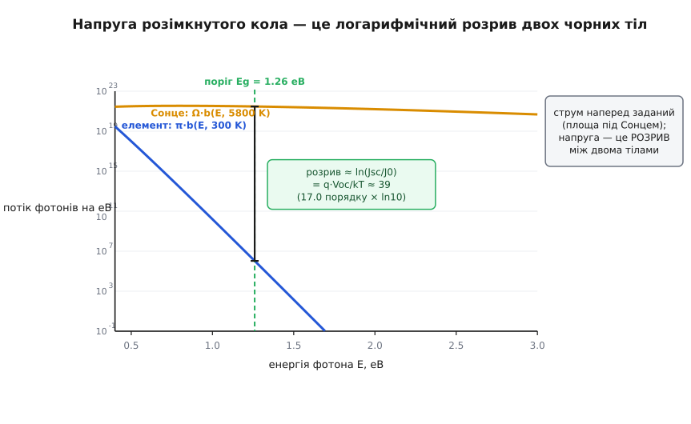
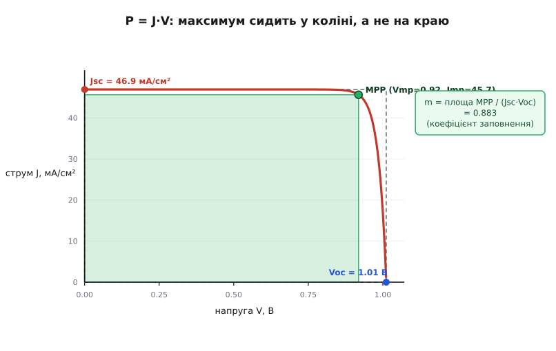

# 🧮 Детальний баланс одного переходу: від Планкового потоку до η(Eg)

> Числова машинерія межі Шоклі–Квайссера. Тут стеля «≈31%» перестає бути готовою цифрою й виводиться крок за кроком з ОДНІЄЇ формули — потоку фотонів чорного тіла. З неї народжуються струм генерації Jsc, струм насичення J0, напруга Voc, максимальна потужність — і нарешті добуток трьох множників η = u·v·m, кожне число якого збігається з текстом.

Домовмося про модель, у якій немає жодного припасованого коефіцієнта — лише фізичні сталі й дві температури. Сонце — [чорне тіло](topic:ph-thermodynamics/planck-law-and-blackbody-spectrum) за температури Ts = 5800 K. [Елемент — ідеальний поглинач](topic:ph-condensed/photovoltaic-cell) усіх фотонів, енергійніших за поріг Eg, і повний невидимка для слабших. Єдина втрата, яку ми дозволяємо, — та, якої заборонити не можна: сам елемент за своєї температури Tc = 300 K теж світиться. Більше нічого: ні дефектів, ні опору, ні відбиття. Уся арифметика нижче — це три інтеграли однієї функції.

### Цеглина: Планків потік фотонів

Нам потрібна не густина енергії випромінювання, а **скільки фотонів** тіло кидає, бо струм рахує заряди, і кожен поглинутий надпороговий фотон дає рівно один. Тому основою беремо **фотонну яскравість** чорного тіла — число фотонів, що йдуть з одиниці площі поверхні за секунду в одиничний тілесний кут в інтервалі енергій біля E:

```
b(E,T) = (2 / h³c²) · E² / (exp(E/kT) − 1)     [фотон·с⁻¹·м⁻²·ср⁻¹ на одиницю E]
```

Розберімо, звідки кожен множник. Знаменник `exp(E/kT) − 1` — це заселеність моди поля за Бозе: скільки квантів у середньому сидить у коливанні з енергією E за температури T; саме він робить спектр спадним на високих енергіях. Чисельник `E²` — густина самих мод (скільки різних коливань поля припадає на інтервал енергій); мод тим більше, чим вища частота. Двійка спереду — дві поляризації світла на кожну моду. А `h³c²` внизу — стала, що переводить це в потік крізь площу. Одну функцію треба лишень двічі проінтегрувати з різними геометричними множниками — і вся модель складена.

Геометрія входить так. Ламбертова поверхня, що світить у **всю півсферу** над собою, віддає з одиниці площі потік `π·b` (інтеграл `cos θ` по півсфері дає рівно π, а не 2π — навскісні промені несуть менше). Це і є та форма, яку часто пишуть одразу:

```
N(E,T) = π · b(E,T) = (2π / h³c²) · E² / (exp(E/kT) − 1)     — емісія з площі в півсферу
```

Але Сонце **не** заповнює півсферу: його диск займає крихітний тілесний кут. Кутовий радіус Сонця із Землі θ ≈ 0.2665°, тож

```
Ω☉ = 2π·(1 − cos θ) = 2π·(1 − cos 0.2665°) ≈ 6.80·10⁻⁵ ср
```

Ось перша важлива асиметрія, яка потім віддасться напругою: **елемент випромінює в кут ≈ π, а п'є з кута Ω☉ ≈ 6.8·10⁻⁵**, тобто в π/Ω☉ ≈ 46 000 разів вужчий. Він світить у все небо, а Сонце дістає лише з вушка голки.

### Струм генерації: полічити фотони Сонця

Кожен надпороговий фотон, що впав на елемент, дає одну пару носіїв — тобто один квант заряду q. Струм короткого замикання — це просто число таких фотонів за секунду з площі, помножене на q; фотони приходять від Сонця, тож із яскравості беремо сонячний тілесний кут Ω☉:

```
Jsc = q · Ω☉ · ∫(E ≥ Eg) b(E, Ts) dE
```

Числово для оптимального порога 1.26 еВ:

```
Jsc = 469 А/м² = 46.9 мА/см²
```

Перевірмо геометрію на відомому числі. Повна падна потужність — той самий інтеграл, лише з вагою E (енергія, а не лік):

```
Pin = Ω☉ · ∫ E · b(E, Ts) dE = Ω☉ · σTs⁴/π ≈ 1361 Вт/м²
```

Це з точністю до частки відсотка збігається із **сонячною сталою** — потоком, який супутники міряють над атмосферою. Отже, розведення яскравості чорного тіла 5800 K сонячним тілесним кутом дає правильну величину; геометрія стоїть на своєму місці.

### Струм насичення: елемент мусить світитися

Тепер — та єдина дозволена втрата. Уявімо елемент у темряві, у рівновазі із власним оточенням за 300 K. За другим законом він не може ні нагріватися, ні холонути сам собою: на кожній енергії скільки фотонів він поглинає з навколишнього теплового поля, стільки ж мусить і випромінювати. Але поглинає він, за нашим означенням, **усе** над порогом. Значить, над порогом він і **випромінює як досконале чорне тіло за 300 K** — це закон Кірхгофа для теплового випромінювання, і тут він не постулат, а прямий наслідок рівноваги. Здатність поглинати й здатність світити — один механізм, пущений у два боки.

Це світіння в напівпровіднику зветься випромінною рекомбінацією, і воно задає струм насичення діода — потік власних фотонів елемента в півсферу:

```
J0 = q · π · ∫(E ≥ Eg) b(E, Tc) dE
```

Числово при Eg = 1.26 еВ і Tc = 300 K:

```
J0 = 4.8·10⁻¹⁵ А/м²
```

Величина мізерна — і не випадково: хвіст Планка холодного елемента за 1.26 еВ лежить на ~17 порядків нижче за сонячний. Головне не в дрібності числа, а в тому, що **J0 тут ніхто не підганяв**. У звичайному діоді струм насичення — параметр із виміру; тут він порахований з першопринципів як теплове світіння, і саме ця жорсткість робить межу справжньою стелею, а не поточним рекордом.

> 🔧 **Навіщо це.** J0 — та деталь, яка дає стелі зуби. Якби J0 дорівнював нулю, формула напруги (нижче) розганяла б Voc у нескінченність, і жодної межі не було б. Скінченний J0 = власне сяйво елемента — це рівно те, що обмежує напругу згори. Будь-яка **реальна** втрата (безвипромінна рекомбінація, витік) лише **додає** до J0 і тягне напругу ще нижче; чистий S–Q бере найменший можливий J0 — саме тепловий.

### Діодний закон із балансу

Тепер посвітімо Сонцем і прикладімо напругу V у прямому напрямку. Генерація доливає постійні Jsc (фотони ззовні). Рекомбінація — це те саме світіння, але напруга зсуває заселеності електронів і дірок у переході, і [за статистикою переходу](topic:ph-condensed/pn-junction) емісія зростає в exp(qV/kT) разів проти рівноважної. У темряві при V = 0 світіння J0 точно врівноважене поглинанням тих самих 300 K фотонів довкола (теж J0) — це «−1». Складаємо струми:

```
J(V) = Jsc − J0·(exp(qV/kT) − 1)
```

Це [ідеальний діодний закон](topic:hw-components/diode-iv-curve), тільки виведений із бухгалтерії фотонів, а не припасований. Уся фізика елемента сидить тепер у двох числах — Jsc і J0.

### Напруга розімкнутого кола: нуль струму

На розімкнутих клемах струм у навантаження не тече, J = 0. Прирівнюємо й розв'язуємо відносно V:

```
0 = Jsc − J0·(exp(qVoc/kT) − 1)
exp(qVoc/kT) = Jsc/J0 + 1
Voc = (kT/q) · ln(Jsc/J0 + 1)
```

Підставмо числа (kT/q при 300 K = 25.85 мВ):

```
Jsc/J0 = 469 / 4.8·10⁻¹⁵ ≈ 9.8·10¹⁶
Voc = 0.02585 В · ln(9.8·10¹⁶) = 0.02585 · 39.1 = 1.011 В
```

Ось геометричний зміст цієї формули: напруга — це **логарифм відстані між двома чорними тілами**. Струм наперед заданий площею під сонячним хвостом; а напругу дає вертикальний розрив між сонячним хвостом (5800 K, розведений Ω☉) і власним хвостом елемента (300 K) над порогом. Розрив у ~17 порядків — це й є ті 39 одиниць kT, тобто 1.01 В.


*Два потоки фотонів у лог-масштабі: що приносить Сонце (Ω☉·b за 5800 K) і що випромінює елемент (π·b за 300 K). Над порогом їх розділяє ≈17 порядків — це ln(Jsc/J0) = qVoc/kT ≈ 39. Струм задає площа під верхньою кривою; напруга — сам розрив.*

**Анатомія напруги: куди діваються 0.25 В.** Повний поріг у вольтах тут 1.26 В, а Voc лише 1.01 — недобір ~0.25 В. Розкладімо його. Над порогом E ≥ Eg ≫ kT, тож в інтегралах працює лише хвіст Віна `∫E²·exp(−E/kT)dE ≈ kT·Eg²·exp(−Eg/kT)`. Тоді відношення струмів

```
Jsc/J0 = (Ω☉/π) · [∫b(Ts) / ∫b(Tc)] ≈ (Ω☉/π) · (Ts/Tc) · exp( (Eg/k)·(1/Tc − 1/Ts) )
```

Беремо логарифм, множимо на kT/q — і напруга розпадається на три доданки з ясним фізичним змістом:

```
Voc ≈ (Eg/q)·(1 − Tc/Ts)  −  (kTc/q)·ln(π/Ω☉)  +  (kTc/q)·ln(Ts/Tc)
    =   1.195 В            −      0.278 В         +     0.077 В        ≈ 0.99 В
```

(точний інтеграл дає 1.011 В; зайві ~17 мВ — це відкинутий поліноміальний передмножник хвоста). Кожен доданок — окрема історія:

- **(Eg/q)·(1 − Tc/Ts) = 1.195 В — температурний податок.** Множник (1 − Tc/Ts) — це в точності карнотів коефіцієнт машини між гарячим Сонцем і теплим елементом. Його **не прибрати нічим**: навіть ідеальний концентратор не підніме напругу вище за Eg·(1 − Tc/Ts).
- **−(kTc/q)·ln(π/Ω☉) = −0.278 В — етандю-недобір (геометрія).** Це плата за ту саму асиметрію кутів: елемент світить у π, а п'є з Ω☉. Саме на цей доданок **націлена концентрація**: сфокусуй сонце лінзою, і його кут Ω☉ росте до π, логарифм в'яне, недобір меншає. Гранична концентрація (Ω☉ → π, множник ~46 000) прибирає всі 0.278 В — тому концентраторні елементи дають помітно вищу напругу.
- **+(kTc/q)·ln(Ts/Tc) = +0.077 В — яскравісна надбавка.** Гарячий хвіст Сонця сам собою густіший на моду, і це трохи повертає напругу назад.

Отже «податок на світіння» ~0.25 В — не одна величина, а різниця цих трьох: неминучий карнотів доданок, геометричний (що його з'їдає концентрація) і невелика надбавка за яскравість Сонця.

### Максимальна потужність і форма коліна

Клеми віддають потужність P = J·V. Підставмо діодний закон і пошукаймо максимум:

```
P(V) = V · [ Jsc − J0·(exp(qV/kT) − 1) ]
dP/dV = 0   ⟹   (1 + qVmp/kT)·exp(qVmp/kT) = Jsc/J0 + 1
```

Рівняння трансцендентне — у скінченних функціях не розв'язати, тож робочу точку Vmp беруть числово (пробіг по напрузі). При Eg = 1.26 еВ вершина сидить у Vmp ≈ 0.92 В, Jmp ≈ 45.7 мА/см², і Pmax = Jmp·Vmp ≈ 419 Вт/м². Ані повного струму Jsc, ані повної напруги Voc одночасно зняти не можна: [робоча точка максимальної потужності](topic:hw-power/panel-iv-mpp) завжди в згині кривої.

Наскільки згин «крадькома» забирає — міряє **коефіцієнт заповнення** (fill factor):

```
m = Pmax / (Jsc · Voc)
```

Це частка прямокутника Jsc×Voc, яку лишає коліно. Є зручне наближення (Ґрін, 1981): усе залежить лише від **нормованої напруги** voc = qVoc/kT:

```
m ≈ (voc − ln(voc + 0.72)) / (voc + 1)
```

При voc = 1.011/0.02585 = 39.1 воно дає:

```
m ≈ (39.1 − ln 39.85) / 40.1 = (39.1 − 3.685) / 40.1 = 0.883
```

— рівно те, що дає числовий максимум. Урок простий: чим вища напруга у kT-одиницях, тим квадратніше коліно й тим ближче m до одиниці.


*Струм від напруги за діодним законом. Зовнішній прямокутник — недосяжна стеля Jsc×Voc; зафарбований — реальна Pmax = Jmp·Vmp у коліні. Їхнє відношення і є m ≈ 0.88.*

### Складання: η = u·v·m

Тепер зберімо все в одне число. ККД — це віддана потужність поділити на падну: η = Pmax/Pin. Хитрість у тому, щоб домножити й поділити на дві величини — (Eg/q)·Jsc та Voc — так, що дріб **телескопується** на три множники:

```
       Pmax     (Eg/q)·Jsc       Voc          Pmax
η  =  ─────  =  ──────────  ·  ────────  ·  ──────────
       Pin         Pin          (Eg/q)       Jsc·Voc
                   └─ u ─┘       └─ v ─┘      └─── m ───┘
```

Скорочення точне: (Eg/q) з чисельника u гасить (Eg/q) у знаменнику v; Voc із v гасить Voc у знаменнику m; Jsc теж скорочується — лишається чистий Pmax/Pin. Тобто розбити ККД на три множники можна **завжди й задарма**. Цінне інше: кожен множник ізолює одну з трьох втрат:

- **u = (Eg/q)·Jsc / Pin — спектральний (граничний) множник.** Частка падної потужності, що лишилася б, якби кожен надпороговий фотон віддав рівно Eg. Він одразу вбирає обидві спектральні втрати — підпорогову прозорість (фотони не ввійшли в Jsc) і термалізацію (беремо тільки Eg, а не повну енергію фотона).
- **v = q·Voc / Eg — множник напруги.** Яка частка порога дійшла в напругу після розібраного вище податку на світіння.
- **m = Pmax / (Jsc·Voc) — множник форми ВАХ.** Плата за коліно.

**Приклад: три множники коло оптимуму (Eg = 1.26 еВ, Сонце — чорне тіло 5800 K).**

```
Pin  = 1361 Вт/м²                                    (= сонячна стала)
Jsc  = q·Ω☉·∫(E≥Eg) b(E,Ts) dE = 469 А/м²
J0   = q·π ·∫(E≥Eg) b(E,Tc) dE = 4.8·10⁻¹⁵ А/м²
Voc  = (kT/q)·ln(Jsc/J0 + 1)   = 0.02585·39.1 = 1.011 В
Pmax = максимум P=J·V          = 419 Вт/м²

u = (Eg/q)·Jsc / Pin = (1.26·469) / 1361   = 0.435
v = q·Voc / Eg       = 1.011 / 1.26         = 0.803
m = Pmax / (Jsc·Voc) = 419 / (469·1.011)    = 0.883

η = u · v · m = 0.435 · 0.803 · 0.883       = 0.308   →  30.8 %
```

Округлені 0.44 · 0.80 · 0.88 ≈ 0.31 — те саме число, що стоїть у тексті. Самі лише спектральні втрати (u ≈ 0.44) забирають більш як половину; напруга й форма ВАХ разом віднімають ще близько чверті решти.

### Прогін по всіх Eg і два опорні числа

Порахувавши той самий добуток для кожного порога, дістаємо криву межі η(Eg). Ось кілька точок:

```
Eg, еВ   Jsc, мА/см²   Voc, В    u       v       m       η
1.12       53.9        0.881    0.443   0.787   0.870   0.303    ← кремній
1.26       46.9        1.011    0.435   0.803   0.883   0.308    ← пік (5800 K)
1.34       43.2        1.086    0.426   0.811   0.889   0.307
1.42       39.7        1.161    0.414   0.818   0.895   0.303    ← GaAs
```

Видно самий механізм плато: з ростом Eg множник u **спадає** (менше фотонів кваліфікуються), а v **росте** (з кожної пари більша напруга), m ще й повільно підповзає (вища voc — квадратніше коліно). Дві протилежні тенденції гасять одна одну, тож добуток має не гострий шпиль, а широку полку 1.1–1.4 еВ, де η тримається коло 30–31%.

Два зовнішні числа прив'язують модель до реальності. По-перше, [Шоклі й Квайссер 1961 року](topic:ph-condensed/shockley-queisser-limit/hist-detailed-balance-paper.md) дістали **30% при 1.1 еВ**, узявши Сонце чорним тілом 6000 K — наша чорнотільна модель (5800 K) кладе пік трохи інакше, 30.8% при 1.26 еВ, і це та сама фізика. По-друге, якщо замість гладкого чорного тіла підставити **реально виміряний наземний спектр AM1.5** (сонце крізь атмосферу), пік підіймається до **33.7% при 1.34 еВ** — канонічна цифра межі. Оптимум зсувається праворуч саме через смуги атмосферного поглинання: провали у спектрі роблять трохи вищий поріг вигіднішим.

Уся стеля, отже, — це два інтеграли однієї Планкової функції й логарифм між ними: полічити фотони Сонця над порогом (це струм), полічити власні фотони елемента за 300 K (це струм насичення), узяти логарифм їхнього відношення (це напруга) — а далі лише P = J·V шукає своє коліно.
