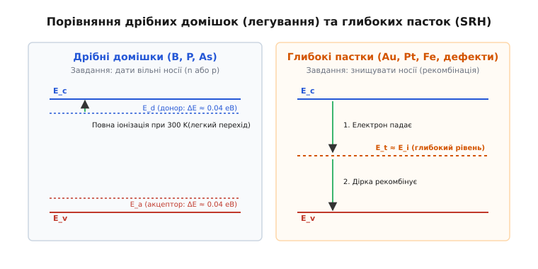
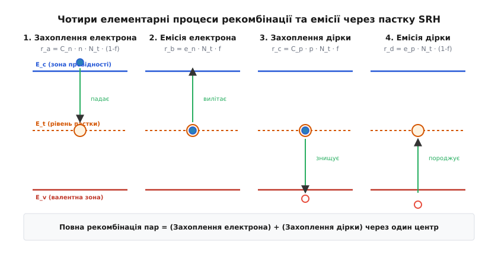
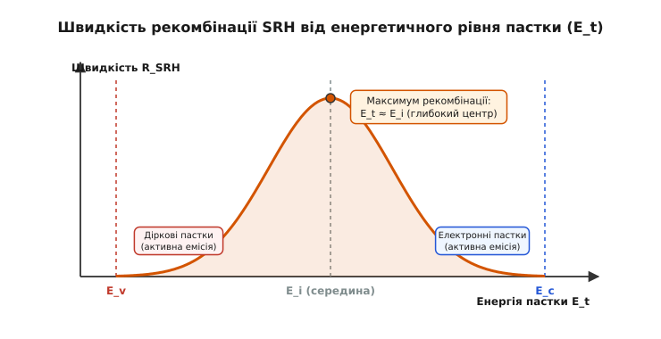
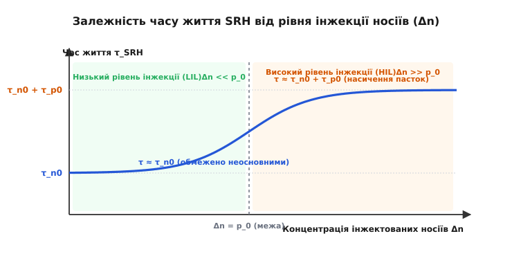

# Рекомбінація Шокли — Рида — Холла (SRH)

<preknowlist>
- [Напівпровідник](topic:ph-condensed/semiconductor) — зонна структура, валентна зона, зона провідності, заборонена зона та теплова генерація пар.
- [Легування](topic:ph-condensed/doping) — n- і p-тип, донори, акцептори, основні та неосновні носії заряду.
- [PN-перехід](topic:ph-condensed/pn-junction) — збіднена область, дрейфовий і дифузійний струми, прямо й зворотна напруга.
</preknowlist>

Квантова розрахункова модель ідеального кристала кремнію передбачає, що вільний електрон із зони провідності має випромінити фотон із енергією 1.12 еВ для рекомбінації з діркою у валентній зоні, що дає теоретичний час життя носіїв близько однієї секунди. За такого часу життя діод p-n переходу перемикався б зі стану провідності у запертий стан секундами, унеможливлюючи роботу будь-яких високочастотних транзисторів та імпульсних джерел живлення. Однак реальні вимірювання на надчистих кремнієвих пластинах показують час життя від десятків наносекунд до кількох мікросекунд — на шість-дев'ять порядків швидше за теоретичну межу випромінювального міжзонного переходу.

Причиною цього розходження є **рекомбінація Шокли — Рида — Холла** (*Shockley-Read-Hall recombination*, SRH) — безвипромінювальний процес винищення електронів і дірок через дефекти кристалічної ґратки та домішкові атоми, які утворюють глибокі енергетичні рівні (пастки) всередині забороненої зони.

> 📜 **Історія до теми:** [Як тріо фізиків розгадало таємницю пасток у кремнії](topic:ph-condensed/shockley-read-hall-recombination/hist-shockley-read-hall.md). Про те, як у 1952 році Вільям Шокли, Волтер Рид та Роберт Холл незалежно пояснили роль глибоких центрів і створили базову математичну модель кінетики носіїв.

---

### Чому пряма рекомбінація настільки малоімовірна

Щоб зрозуміти, чому безвипромінювальна рекомбінація через пастки панує у кремнії, германії та карбіді кремнію, треба зіставити три фундаментальні механізми винищення носіїв заряду в напівпровідниках:

```
1. Пряма міжзонна випромінювальна рекомбінація (Band-to-Band Radiative):
   Електрон (E_c) ───[ фотон hν ]───> Дірка (E_v)
   Домінує у прямозонних матеріалах (GaAs, InP). У кремнії пригнічена законом збереження імпульсу.

2. Оже-рекомбінація (Auger Recombination):
   Електрон + Дірка ───[ передача енергії 3-й частинці ]───> Гарячий носій
   Домінує лише при надвисоких концентраціях носіїв (n, p > 10¹⁸ см⁻³).

3. Рекомбінація Шокли — Рида — Холла (SRH):
   Електрон (E_c) ──> Пастка (E_t) ──> Дірка (E_v)  [енергія іде у фонони/тепло ґратки]
   Домінує при низьких та помірних концентраціях у непрямозонних напівпровідниках (Si, Ge, SiC).
```

У прямозонних напівпровідниках (таких як арсенід галію GaAs чи нітрид галію GaN) мінімум зони провідності та максимум валентної зони розташовані при одному й тому самому значенні хвильового вектора (імпульсу) `k`. Там електрон падає у валентну зону напряму, миттєво випромінюючи квант світла (фотон).

Кристалічний кремній є **непрямозонним** напівпровідником (*indirect bandgap semiconductor*). Мінімум зони провідності у кремнію зсунутий уздовж кристалографічного напрямку [100] на 85% від межі зони Бріллюена, тоді як максимум валентної зони перебуває у центрі зони Бріллюена (`k = 0`). Для рекомбінації електрона з діркою потрібна одночасна участь не лише фотона (для відбору енергії 1.12 еВ), а й **фонона** — кванту коливань кристалічної ґратки, який візьме на себе великий хвильовий вектор `Δk`. Імовірність того, що в одній точці простору в один момент часу зіткнуться електрон, дірка та відповідний акустичний чи оптичний фонон потрібної енергії та імпульсу, надзвичайно мала.


*Ліворуч: дрібні домішки бору чи фосфору розташовані біля меж зон (ΔE ≈ 0.04 еВ) і слугують джерелом вільних носіїв. Праворуч: глибокі пастки золота чи дефектів розміщені поблизу середини забороненої зони E_i й працюють як дворівневий ескалатор для рекомбінації.*

Якщо ж у забороненій зоні існує глибокий енергетичний рівень `E_t`, електрон не повинен здійснювати один гігантський малоімовірний стрибок. Він розбиває процес на два послідовних кроки: спершу електрон падає на рівень пастки `E_t`, а потім пастка захоплює дірку (або віддає електрон у валентну зону). Кожен із цих двох кроків супроводжується випромінюванням сітки дрібних фононів (тепла), що робить загальний процес у мільйони разів імовірнішим.

З квантовомеханічної точки зору безвипромінювальне захоплення носія пасткою пояснюється теорією **багатофононного випромінювання** (*multiphonon emission*). Коли електрон сідає на пастку, атомний остов дефекту зміщується зі свого рівноважного положення (ефект релаксації ґратки), а надлишок енергії вивільняється у вигляді пакету з 10–30 квантів коливань кристалу (фононів).

Оже-рекомбінація, яка є іншим безвипромінювальним процесом, передає енергію рекомбінації третьому вільній частинці (електрону або дірці), перетворюючи її на «гарячий» носій. Проте швидкість Оже-рекомбінації пропорційна кубу концентрації носіїв (`R_{Auger} = C_n n² p + C_p n p²`). При робочих концентраціях носіїв у базових областях напівпровідникових приладів (10¹⁴–10¹6 см⁻³) Оже-рекомбінація є нехтувано малою, і саме механізм SRH повністю визначає час життя носіїв та електричний опір матеріалу.

---

### Анатомія пастки: чотири елементарні кроки та фізичні параметри

Центр рекомбінації (пастка) — це атом сторонньої домішки (наприклад, золото Au, платина Pt, залізо Fe, мідь Cu) або структурний дефект (дислокація, точкова вакансія, міжфазна межа зерен), який створює в локальному об'ємі кристала потенціальну яму для носіїв.

Пастка характеризується трьома основними фізичними параметрами:
1. **Енергетичним рівнем `E_t`** (в еВ відносно середини забороненої зони `E_i`).
2. **Перерізами захоплення `σ_n` та `σ_p`** (см²), які визначають ефективну площу, у яку повинен потрапити електрон чи дірка для захоплення центром.
3. **Зарядним станом пастки:** нейтральна, позитивно чи негативно заряджена (що визначає кулонівське притягання або відштовхування носіїв).

Геометричний переріз атома у ґратці становить близько 10⁻¹⁵ см². Проте якщо пастка є позитивно зарядженою (наприклад, іонізований донорний дефект), вона притягує негативний електрон кулонівським полем, завдяки чому переріз захоплення `σ_n` зростає до 10⁻¹² см²! Навпаки, однойменно заряджений центр відштовхує носій, зменшуючи переріз захоплення до 10⁻¹⁸ см² за рахунок квантовомеханічного тунелювання через кулонівський бар'єр.

Динаміка рекомбінації складається з чотирьох фундаментальних мікроскопічних процесів, які відбуваються на рівні `E_t`.


*Чотири базові стани центру рекомбінації: 1) захоплення електрона з зони провідності; 2) емісія електрона назад у зону провідності; 3) захоплення дірки з валентної зони (рекомбінація пари); 4) емісія дірки (генерація нової пари).*

Позначимо через `N_t` концентрацію пасток в одиниці об'єму (см⁻³), а через `f` — імовірність того, що пастка в даний момент зайнята електроном. Записуємо швидкості кожного з чотирьох процесів (см⁻³·с⁻¹):

#### 1. Захоплення електрона із зони провідності (`r_a`)
Вільний електрон падає на порожню пастку (яка перебуває у стані `1 - f`). Швидкість процесу пропорційна концентрації вільних електронів `n`, концентрації порожніх пасток `N_t · (1 - f)` та коефіцієнту захоплення `C_n`:
```
r_a = C_n · n · N_t · (1 - f)
```
де `C_n = σ_n · v_{th,n}` — коефіцієнт захоплення електронів, а `v_{th,n} = √(3 · k_B · T / m_n*) ≈ 10⁷` см/с — теплова швидкість електронів при 300 K.

#### 2. Емісія електрона у зону провідності (`r_b`)
Теплові коливання ґратки вибивають електрон із зайнятої пастки (стан `f`) назад у зону провідності. Швидкість процесу пропорційна концентрації зайнятих пасток `N_t · f` та коефіцієнту емісії `e_n`:
```
r_b = e_n · N_t · f
```

#### 3. Захоплення дірки з валентної зони (`r_c`)
Зайнята електроном пастка (стан `f`) захоплює дірку з валентної зони. З позиції квантового стану це означає, що електрон із пастки падає на вільне місце у валентній зоні, внаслідок чого і електрон, і дірка **зникають як вільні носії**. Це і є акт повної рекомбінації електрон-діркової пари:
```
r_c = C_p · p · N_t · f
```
де `C_p = σ_p · v_{th,p}` — коефіцієнт захоплення дірок.

#### 4. Емісія дірки у валентну зону (`r_d`)
Порожня пастка (стан `1 - f`) захоплює електрон із валентної зони, залишаючи у валентній зоні порожнє місце — нову дірку. Це процес генерації вільних дірок:
```
r_d = e_p · N_t · (1 - f)
```

Експериментальне вимірювання параметрів `E_t`, `σ_n` та `σ_p` здійснюється за допомогою методу **релаксаційної спектроскопії глибоких рівнів** (*Deep Level Transient Spectroscopy*, DLTS). Метод полягає у подачі короткого імпульсу прямого зсуву на p-n перехід для заповнення пасток із подальшим вимірюванням часової релаксації ємності бар'єру при зворотному зсуві при різних температурах.

---

### Принцип детальної рівноваги та рівняння SRH

У стані термодинамічної рівноваги (без прикладеної напруги чи освітлення) рекомбінація та генерація носіїв збалансовані для кожного процесу окремо: `r_a = r_b` та `r_c = r_d`.

Застосовуючи статистику Фермі — Дірака для ступеня заповнення пастки `f_0 = 1 / (1 + exp((E_t - E_F)/k_B T))`, можна строго зв'язати невідомі коефіцієнти емісії `e_n` та `e_p` з коефіцієнтами захоплення `C_n` та `C_p`:

```
e_n = C_n · n_1      [де n_1 = n_i · exp((E_t - E_i) / (k_B · T))]
e_p = C_p · p_1      [де p_1 = n_i · exp((E_i - E_t) / (k_B · T))]
```

Фізичні параметри `n_1` та `p_1` мають чітке значення: це концентрації електронів та дірок, які існували б у зонах, якби рівень Фермі `E_F` точно збігався з енергетичним рівнем пастки `E_t`.

> 🧮 **Математичний вивід до теми:** [Строге математичне виведення рівняння рекомбінації SRH](topic:ph-condensed/shockley-read-hall-recombination/math-srh-derivation.md). Детальний покроковий математичний вивід стаціонарного ступеня заповнення пастки `f` та чистої швидкості рекомбінації з кінетичних рівнянь балансу.

У стаціонарному нерівноважному стані результуючий потік електронів на пастки `r_a - r_b` дорівнює результуючому потоку дірок на пастки `r_c - r_d`. Прирівнюючи ці потоки, отримуємо результуючу швидкість рекомбінації SRH (`R_{SRH}`, см⁻³·с⁻¹):

```
R_{SRH} = (C_n · C_p · N_t · (n · p - n_i²)) / (C_n · (n + n_1) + C_p · (p + p_1))
```

Ввівши характеристичні часи життя неосновних носіїв при низькому рівні інжекції:
```
τ_{n0} = 1 / (C_n · N_t) = 1 / (σ_n · v_{th} · N_t)   [час життя електронів у p-матеріалі]
τ_{p0} = 1 / (C_p · N_t) = 1 / (σ_p · v_{th} · N_t)   [час життя дірок у n-матеріалі]
```

Отримуємо класичну формулу Шокли — Рида — Холла:

```
R_{SRH} = (n · p - n_i²) / (τ_{p0} · (n + n_1) + τ_{n0} · (p + p_1))
```

Аналіз цієї формули відкриває фундаментальні закономірності поведінки напівпровідників:

1. **Якщо `n · p > n_i²` (надлишок носіїв):** `R_{SRH} > 0`, відбувається чиста **рекомбінація** (наприклад, при прямому зсуві p-n переходу чи під час освітлення сонячного елемента).
2. **Якщо `n · p = n_i²` (рівновага):** `R_{SRH} = 0`, генерація і рекомбінація строго врівноважені.
3. **Якщо `n · p < n_i²` (збіднення носіїв):** `R_{SRH} < 0`, відбувається чиста теплова **генерація** пар електрон-дірка (наприклад, у збідненій області зворотно зсунутого p-n переходу).

Квазірівноважне розщеплення рівнів Фермі `E_{Fn} - E_{Fp} = k_B · T · ln(n · p / n_i²)` безпосередньо пов'язане з чисельником формули SRH: що більше розщеплення квазірівнів Фермі, то вища швидкість винищення носіїв.

---

### Чому найнебезпечніші пастки — посередині забороненої зони

Подивімося на знаменник рівняння SRH, а саме на доданки `n_1` та `p_1`. Стан енергетичного рівня `E_t` відносно середини забороненої зони `E_i` кардинально змінює роль пастки.


*Залежність ефективності рекомбінації SRH від енергетичного рівня пастки E_t. Максимум рекомбінації досягається строго посередині забороненої зони (E_t ≈ E_i). При наближенні пастки до меж зон E_c або E_v ефективність падає до нуля через переважання зворотної теплової емісії.*

#### 1. Дрібні пастки біля зони провідності (`E_t` поблизу `E_c`)
Якщо пастка розміщена близько до зони провідності (`E_t - E_i >> 0`), параметр `n_1 = n_i · exp((E_t - E_i)/k_B T)` стає гігантським.

З фізичної точки зору це означає, що енергетичний бар'єр для зворотного вильоту електрона в зону провідності є мізерним. Електрон, захоплений такою пасткою, майже миттєво вилітає назад у зону провідності шляхом теплового збудження, перш ніж пастка встигне дочекатися дірки.

Такий центр називають не рекомбінатором, а **пасткою прилипання електронів** (*electron trap* / *sticking center*). Вона тимчасово затримує носії, але не винищує їх.

#### 2. Дрібні пастки біля валентної зони (`E_t` поблизу `E_v`)
Аналогічно, якщо пастка лежить близько до валентної зони (`E_i - E_t >> 0`), параметр `p_1` стає величезним. Захоплена дірка миттєво скидається назад у валентну зону. Це **пастка прилипання дірок**.

#### 3. Глибокі пастки посередині забороненої зони (`E_t ≈ E_i`)
Коли рівень пастки лежить глибоко всередині забороненої зони (поблизу `E_i`), обидва параметри `n_1` та `p_1` стають мінімальними й близькими до `n_i` (для кремнію при 300 K `n_i ≈ 1.5e10` см⁻³, що на багато порядків менше за концентрації робочих носіїв `n` та `p`).

Математично, якщо мінімізувати знаменник формули SRH по енергії `E_t`, то оптимальне значення енергії пастки дорівнює:
```
E_t^{opt} = E_i + (1 / 2) · k_B · T · ln(σ_p / σ_n)
```
Якщо перерізи захоплення однакові (`σ_n = σ_p`), то максимум рекомбінації досягається **строго посередині забороненої зони** (`E_t = E_i`).

У цьому випадку зворотна теплова емісія електронів і дірок пригнічена. Захоплений електрон надійно утримується пасткою до приходу дірки. Знаменник формули SRH стає мінімальним, а швидкість рекомбінації `R_{SRH}` досягає свій абсолютний **максимум**.

Саме тому атоми важких металів (золото Au із `E_t - E_v = 0.54` еВ, платина Pt із `E_t - E_v = 0.52` еВ, залізо Fe) є найнебезпечнішими «убивцями» часу життя у кремнії.

Деякі домішки утворюють **багаторівневі центри**. Наприклад, золото у кремнії створює два енергетичні рівні: донорний рівень `E_v + 0.35` еВ та акцепторний рівень `E_c - 0.54` еВ. Акцепторний рівень розташований майже точно на рівні `E_i` (0.56 еВ від `E_v`), завдяки чому золото є найпотужнішим середовищем для прискорення рекомбінації.

---

### Режими інжекції: низький проти високого

У практичних напівпровідникових приладах концентрація нерівноважних носіїв описується як `n = n_0 + Δn` та `p = p_0 + Δp`, де `Δn = Δp` у силу умови квазінейтральності. Поведінка часу життя `τ_{SRH}` кардинально різниться залежно від рівня інжекції.


*Характерна крива залежності часу життя носіїв від рівня інжекції Δn. Під низькою інжекцією час життя стабільний і дорівнює τ_{n0} (визначається уловлюванням неосновних носіїв). Під високою інжекцією пастки насичуються, і час життя зростає до суми τ_{n0} + τ_{p0}.*

#### Низький рівень інжекції (Low Injection Level, LIL)
Розглянемо напівпровідник p-типу, легований акцепторами (`p_0 >> n_0`). Умова низького рівня інжекції означає, що концентрація доданих світлом чи струмом носіїв значно менша за концентрацію основних носіїв: `Δn << p_0`.

Тоді `p ≈ p_0`, а `n = n_0 + Δn ≈ Δn`. Підставляючи ці значення у формулу SRH для глибокої пастки (`n_1, p_1 << p_0`), отримуємо:

```
R_{SRH} ≈ (Δn · p_0) / (τ_{n0} · p_0) = Δn / τ_{n0}
```

Визначаємо ефективний час життя неосновних носіїв `τ_n = Δn / R_{SRH}`:

```
τ_n ≈ τ_{n0} = 1 / (σ_n · v_{th} · N_t)
```

**Головний висновок для низького рівня інжекції:** Швидкість рекомбінації повністю лімітується темпом захоплення **неосновних носіїв** (електронів у p-матеріалі або дірок у n-матеріалі). Основних носіїв навколо настільки багато, що після захоплення неосновного носія пастка миттєво знаходить йому пару.

#### Високий рівень інжекції (High Injection Level, HIL)
У потужних силових діодах, IGBT-транзисторах при прямому струмі або у сонячних елементах під зконцентрованим сонячним світлом рівень інжекції стає величезним: `Δn = Δp >> p_0, n_0`.

Тоді `n ≈ p ≈ Δn >> n_1, p_1`. Формула SRH спрощується до вигляду:

```
R_{SRH} ≈ (Δn²) / (τ_{p0} · Δn + τ_{n0} · Δn) = Δn / (τ_{n0} + τ_{p0})
```

Ефективний час життя під високою інжекцією дорівнює сумі двох характеристичних часів:

```
τ_{HIL} = τ_{n0} + τ_{p0}
```

Під високою інжекцією пастки насичуються: концентрації електронів і дірок зрівнюються, і пастці доводиться почергово очікувати на захоплення обох типів носіїв. Час життя носіїв зростає, що призводить до ефекту модуляції провідності у силових приладах.

---

### Вплив сильного електричного поля та температурні ефекти

#### Ефект Пуля — Френкеля та тунелювання через пастки (TAT)
У сильних електричних полях `E > 10⁵` В/см (наприклад, у збідненій зоні зворотно зсунутого p-n переходу чи під затвором силового MOSFET) швидкість рекомбінації та генерації SRH додатково зростає за рахунок двох квантових ефектів:

1. **Ефект Пуля — Френкеля (*Poole-Frenkel effect*):** Сильне зовнішнє електричне поле деформує кулонівську потенціальну яму пастки, знижуючи висоту теплового бар'єра емісії на величину `ΔE_t = √(q · E / (π · ε))`. Це різко прискорює зворотну емісію `e_n` та `e_p`.
2. **Тунелювання за участю пасток (*Trap-Assisted Tunneling*, TAT):** Електрон із зони провідності тунелює крізь сужений трикутний потенціальний бар'єр безпосередньо на рівень пастки `E_t`, після чого рекомбінує. Це явище зумовлює м'який пробій p-n переходів та зростання струму витоку при високих напругах.

#### Температурна залежність часу життя SRH
Зі зростанням температури `T` швидкість теплової емісії з пасток `e_n = C_n · n_1` зростає експоненційно через параметр `n_1 = n_i · exp((E_t - E_i)/k_B T)`.

Внаслідок цього при підвищенні температури пастки частіше викидають захоплені носії назад у зони, не встигаючи їх рекомбінувати. Це призводить до зростання часу життя носіїв `τ_{SRH}(T)` із температурою при низькому рівні інжекції. Водночас у збіднених областях p-n переходів експоненційне зростання `n_i(T)` викликає різке підвищення темного струму генерації та струму витоку.

---

### Поверхнева рекомбінація (Surface SRH Recombination)

На поверхні напівпровідника ідеальна періодична структура ґратки обривається. Ненасичені («недобудовані») хімічні зв'язки поверхневих атомів кремнію утворюють безперервний спектр глибоких поверхових станів (пасток) із високою густиною `D_{it}` (см⁻²·еВ⁻¹).

Рекомбінація на поверхні описується модифікованою формулою SRH і характеризується **швидкістю поверхневої рекомбінації `S`** (см/с):

```
R_s = S · Δn_s
```

На непасивованій поверхні кремнію `S` сягає 10⁴–10⁵ см/с, що знищує ефективність сонячних батарей та світлодіодів. Для пригнічення поверхневого SRH застосовують **пасивацію**:
1. **Хімічну пасивацію:** Вирощування тонкого шару диоксиду кремнію (SiO₂) або оксиду алюмінію (Al₂O₃), де атоми кисню та водню насичують обірвані зв'язки кремнію, зменшуючи `D_{it}` в тисячі разів.
2. **Польову пасивацію:** Нанесення заряджених діелектричних плівок (наприклад, Al₂O₃ із негативним вбудованим зарядом), які відштовхують електрони від поверхні, унеможливлюючи винищення пар.

---

### Практичне застосування та інженерія часу життя

Уміння керувати рекомбінацією SRH — це один із головних важелів у розробці сучасних напівпровідникових приладів.

> 🔧 **Навіщо це.** Без розуміння механізму SRH неможливо створити ні швидкодіючий силовий інвертор для електромобіля, ні високоефективну сонячну батарею, ні маложирний сенсор камери смартфона. Інженери використовують SRH як у бік прискорення рекомбінації (скорочення часу вимикання), так і в бік її повного пригнічення (збільшення КПД та зменшення шумів).

#### 1. Силова електроніка: швидкісні діоди та IGBT
У високовольтних силових діодах і IGBT-транзисторах під час прямого проходження струму в слаболегованій n-області накопичується величезний заряд неосновних носіїв. 

При різкому вимиканні приладу цей заряд має розсмоктатися. Якщо час життя `τ_{SRH}` великий (наприклад, 10 мкс), виникне гігантський зворотний струм відновлення (*reverse recovery current*, `I_{rr}`), який спричинить величезні теплові втрати та може спалити випрямляч.

Для прискорення вимикання інженери застосовують **інженерію часу життя** (*lifetime engineering*):
- Легування кремнію золотом (Au) або платиною (Pt) через високотемпературну дифузію.
- Опромінення кристалів високоенергетичними електронами чи протонами (локальне зниження часу життя у районі p-n переходу).

Це дозволяє цілеспрямовано скоротити `τ_{SRH}` з 10 мкс до 20–50 нс. Діод стає надшвидким (*Ultra-fast diode*), а втрати перемикання зменшуються в десятки разів.

#### 2. Сонячні елементи: гетерування та чистота
У фотовольтаїці завдання є діаметрально протилежним. Фотон створює пару електрон-дірка в товщі кремнію. Щоб згенерувати електричний струм, ця пара має дифундувати до p-n переходу на відстань `L = √(D · τ)`. Напруга холостого ходу елемента `V_{oc}` безпосередньо залежить від насиченого струму витоку `J_0`:
```
V_{oc} = (k_B · T / q) · ln(J_{ph} / J_0 + 1)
```
Оскільки `J_0 ∝ 1 / √(τ_{n0})`, збільшення часу життя SRH на порядок дає суттєвий приріст напруги сонячного елемента.

Якщо кремній містить домішки заліза Fe чи міді Cu, час життя падає нижче 1 мкс, довжина дифузії `L` стає меншою за товщину пластини, і фотоносії рекомбінують, не дійшовши до контактів. ККД сонячного елемента падає з 25% до 5%.

Для боротьби з SRH застосовують технологію **фосфорного гетерування** (*phosphorus gettering*): під час випалу пластини шкідливі домішки важких металів дифундують з об'єму кремнію у високолегований фосфором поверхневий шар і зв'язуються там, очищаючи робочу зону кристала.

#### 3. Струм темряви у сенсорах зображення (CMOS Image Sensors)
У збідненій області пікселя КМОН-матриці під зворотною напругою вільні носії відсутні (`n ≈ 0, p ≈ 0`). Формула SRH дає від'ємну швидкість рекомбінації — тобто **генерацію**:

```
G_{SRH} = n_i / (2 · τ_0)    [при E_t = E_i та τ_{n0} = τ_{p0} = τ_0]
```

Цей процес створює паразитний **струм темряви** (*dark current*). Якщо в якомусь пікселі опиниться одиночний атом заліза чи дислокація, швидкість генерації в ньому підскочить у тисячі разів. На фотографії такий піксель перетвориться на білу точкову дефектну пляму — **гарячий піксель** (*hot pixel*).

> ⚙️ **Практичний розрахунок до теми:** [Симулятор часу життя носіїв та швидкості SRH](topic:ph-condensed/shockley-read-hall-recombination/proj-srh-calculator.md). Готовий чисельний модуль мовами Python, C та C++ для розрахунку `R_{SRH}`, темного струму генерації та залежності `τ_{eff}` від рівня інжекції.

---

### Підсумковий синтез

Рекомбінація Шокли — Рида — Холла — це фундаментальний безвипромінювальний механізм взаємодії носіїв заряду в напівпровідниках через глибокі енергетичні рівні.

```
┌────────────────────────────────────────────────────────────────────────┐
│                   КЛЮЧОВІ ПРИНЦИПИ МЕХАНІЗМУ SRH                       │
├────────────────────────────────────────────────────────────────────────┤
│ 1. Двокроковий процес: електрон падає на пастку E_t, потім захоплюється│
│    дірка. Енергія передається сітці фононів (у тепло).                │
│                                                                        │
│ 2. Максимальна ефективність: досягається для глибоких пасток поблизу  │
│    середини забороненої зони (E_t ≈ E_i).                             │
│                                                                        │
│ 3. Залежність від інжекції: при LIL (Δn << p0) час життя обмежений     │
│    уловлюванням неосновних носіїв (τ ≈ τ_n0); при HIL пастки         │
│    насичуються (τ ≈ τ_n0 + τ_p0).                                     │
│                                                                        │
│ 4. Двобічність застосування: швидкісні силові прилади вимагають       │
│    скорочення τ_SRH, а сонячні елементи й КМОН-сенсори — збільшення.  │
└────────────────────────────────────────────────────────────────────────┘
```

Модель SRH поєднує мікроскопічну фізику квантових станів дефектів із макроскопічними електричними характеристиками напівпровідникових приладів, визначаючи граничні частоти, втрати перемикання, коефіцієнт корисної дії та рівень шумів у всій сучасній мікроелектроніці.
