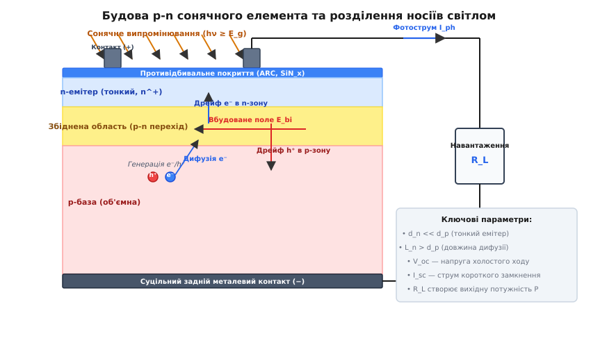
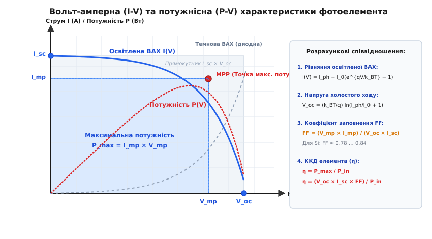
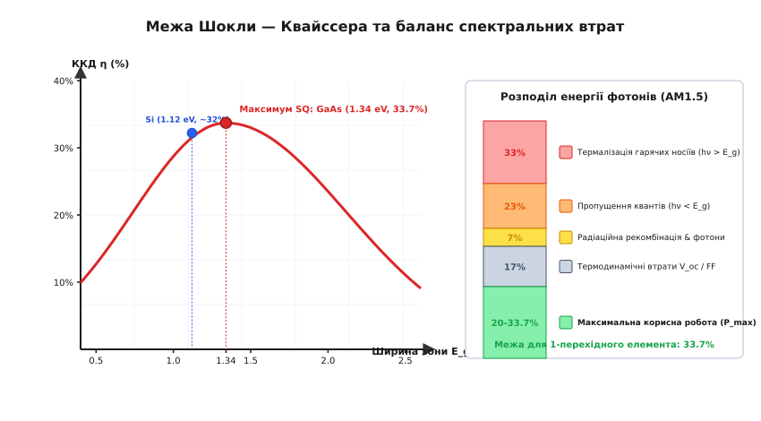

# Фізика сонячного елемента

<preknowlist>
- [p-n перехід](topic:ph-condensed/pn-junction) — збіднена область, вбудований потенціал та приплинні сили.
- [Зонна теорія твердих тіл](topic:ph-condensed/band-theory) — валентна зона, зона провідності та енергетична щілина E_g.
- [Напівпровідники](topic:ph-condensed/semiconductor) — генерація, рекомбінація та носії заряду у напівпровідниках.
- [Дифузійна довжина неосновних носіїв](topic:ph-condensed/diffusion-length-limits-and-measurement) — перенесення та час життя неосновних носіїв.
</preknowlist>

Потрапляння сонячних фотонів на поверхню напівпровідникового кристала збуджує зв'язані електрони валентної зони і переносить їх через заборонену зону `E_g` у зону провідності. У кристалі миттєво народжується пара вільних носіїв заряду — негативний електрон та позитивна дірка. Якщо цей процес відбувається у однорідному (однорідно легованому) напівпровіднику без внутрішніх полів, згенеровані носії хаотично дифундують на незначну відстань і протягом кількох мікросекунд безізлучально рекомбінують, перетворюючи поглинуту енергію світла на звичайне тепло кристалічної ґратки.

Перетворення оптичного випромінювання на корисний електричний струм вимагає наявності асиметричного внутрішнього потенціального бар'єра, який примусово розділить нерівноважні електронно-діркові пари до того, як вони встигнуть рекомбінувати. Цю роль виконує замикаюче електричне поле p-n переходу, гетероструктури або бар'єра Шотткі. Явище прямого перетворення фотонів на електрорушійну силу та струм у зовнішньому колі називається **фотовольтаїчним ефектом** (від грецького *phōs* — світло та імені італійського фізика Алессандро Вольта, англ. *photovoltaic*).

Докладніше про перші експерименти Беккереля, Фріттса та фундаментальний прорив науковців лабораторій Bell Labs читайте у розгорнутому [історичному екскурсі виникнення та еволюції фотовольтаїки](topic:ph-condensed/solar-cell-physics/hist-photovoltaics.md).

## 1. Поглинання світла та генерація фотоносіїв

Першою ланкою фотовольтаїчного перетворення є оптичне поглинання квантів світла в об'ємі напівпровідника. Взаємодія фотона з кристалічною ґраткою підпорядковується фундаментальним законам збереження енергії та квантовомеханічного імпульсу.

Щоб викликати міжзонний оптичний перехід і створити вільну електронно-діркову пару, енергія кванта світла `h·ν` повинна перевищувати ширину забороненої зони напівпровідника `E_g`:

```
h·ν ≥ E_g
```

Якщо енергія фотона менша за порогове значення (`h·ν < E_g`), кристал є оптично прозорим для даної довжини хвилі. Такий фотон проходить крізь напівпровідник без поглинання або взаємодіє лише з вільними носіями заряду та дефектами ґратки, викликаючи паразитне омічне нагрівання матеріалу.

У неорганічних кристалічних напівпровідниках (таких як кремній Si чи арсенід галію GaAs) диелектрична проникність матеріалу є високою (`ε_r ≈ 10 … 12`). Завдяки цьому кулонівське притягання між згенерованими електроном та діркою суттєво екранується, а енергія зв'язку екситона Ваньє — Мотта є дуже малою (`E_ex < 15 мВ`), що значно менше за теплову енергію при кімнатній температурі (`k_B·T ≈ 25.8 мВ`). У результаті фотон миттєво народжує **вільні носії зарядів**. Натомість в органічних або перовськітних матеріалах із малою диелектричною проникністю енергія зв'язку екситона може досягати `100 … 300 мВ`, що вимагає спеціальних внутрішніх гетеромеж для примусового розриву екситонів.

Коли енергія кванта суттєво перевищує ширину забороненої зони (`h·ν > E_g`), міжзонне поглинання відбудеться з імовірністю, близькою до одиниці, проте надлишок енергії `h·ν − E_g` витрачається на надання згенерованим електрону та дірці значної кінетичної енергії. Такі гарячі носії протягом кількох пікосекунд (`τ_rel ≈ 10⁻¹² с`) скидають надлишкову енергію у вигляді оптичних фононів (короткохвильових коливань кристалічної ґратки), опускаючись до країв зони провідності та валентної зони. Цей релаксаційний процес називається **термалізацією носіїв**.

Згасання монохроматичного світлового потоку вглиб напівпровідника вздовж просторової координати `z` описується законом Бугера — Ламберта — Бера:

```
I(z) = I_0 · exp(−α(λ) · z)
```

де `I_0` — інтенсивність світла, що зайшло в кристал після врахування коефіцієнта поверхневого відбивання `R(λ)`, а `α(λ)` — коефіцієнт оптичного поглинання на довжині хвилі `λ` (вимірюється в `см⁻¹`).

Залежність коефіцієнта поглинання `α(E)` від енергії фотона описується квантовомеханічною теорією міжзонних переходів і визначається комбінованою густиною станів (Joint Density of States, JDOS):
- У **прямозонних напівпровідниках** (наприклад, арсенід галію GaAs, телурид кадмію CdTe, перовськіти MAPbI₃) міжзонні переходи відбуваються без зміни хвильового вектора `k` (вертикальний перехід у k-просторі). Залежність має вигляд:

```
α_direct(E) = A_d · √(E − E_g)
```

  Коефіцієнт поглинання поблизу краю забороненої зони сягає `α ≈ 10⁴ … 10⁵ см⁻¹`. Для повного поглинання сонячного світла достатньо плівки напівпровідника завтовшки всього `1 … 2 мкм`.

- У **непрямозонних напівпровідниках** (таких як монокристалічний кремній Si або германій Ge) мінімум зони провідності та максимум валентної зони рознесені в k-просторі. Для міжзонного переходу потрібна одночасна участь третьої частинки — фонона ґратки із взаємодією по енергії `E_phon` для виконання закону збереження імпульсу. Поглинання описується квадратичною залежністю:

```
α_indirect(E) = A_ind · (E − E_g ∓ E_phon)²
```

  Через тричастинковий характер переходу коефіцієнт поглинання кремнію поблизу краю зони є відносно малим (`α ≈ 10² … 10³ см⁻¹`), що вимагає використання значно товстіших напівпровідникових пластин (`130 … 170 мкм`).

Локальна швидкість генерації електронно-діркових пар `G(z)` на глибині `z` визначається як чисельне зменшення потоку фотонів на одиницю довжини шляху:

```
G(z) = − dΦ(z) / dz = α(λ) · Φ_0 · exp(−α(λ) · z)
```

де `Φ_0 = I_0 / (h·ν)` — спектральна густина потоку фотонів, що входять у напівпровідник. Інтегрування швидкості генерації по всьому об'єму пластини з урахуванням спектра Сонячного випромінювання задає теоретичну межу фотоструму.

## 2. Просторове розділення носіїв та стаціонарне рівняння неперервності

Сама лише генерація електронно-діркових пар у напівпровіднику не створює макроскопічного струму, оскільки згенеровані носії рухаються хаотично. Для отримання корисної електричної потужності носії протилежних знаків необхідно просторово розвести до протилежних контактів приладу до того, як вони встигнуть рекомбінувати.

Цю задачу вирішує вбудоване електричне поле `E_bi`, створене в області просторового заряду p-n переходу.


*Фізична структура сонячного елемента, процес генерації електронно-діркових пар світлом та їхнє розділення дрейфовим полем p-n переходу.*

Розглянемо класичну геометрію сонячного елемента: тонкий високолегований емітер n-типу (`n^+`) товщиною `d_n ≈ 0.3 … 0.5 мкм` розташований на освітлюваній поверхні, а під ним лежить об'ємна база p-типу товщиною `d_p ≈ 150 мкм`. Поміж ними формується збіднена область товщиною `W`.

У збідненій області існує потужне вбудоване електричне поле `E_bi`, напрямлене від n-зони до p-зони (тобто вглиб бази). Розділення фотоносіїв відбувається у трьох просторових областях:

1. **Збіднена область (`W`)**:
   Якщо електронно-діркова пара поглинається безпосередньо в збідненій області, сильне поле `E_bi` миттєво підхоплює носії. Електрон під дією дрейфової сили скидається в n-емітер, а дірка виштовхується в p-базу за часи порядку пікосекунд (`τ_drift < 10⁻¹¹ с`). Імовірність рекомбінації в цій зоні є нехтовно малою.

2. **Об'ємна p-база**:
   Більша частина сонячних фотонів видимого та ближнього інфрачервоного діапазонів поглинається в p-базі. Оскільки в нейтральній p-базі електричне поле відсутнє (`E ≈ 0`), згенеровані електрони (які тут є неосновними носіями) рухаються суто за рахунок дифузії.

   Стаціонарний перенос нерівноважної концентрації електронів `Δn(z)` в нейтральній p-базі описується одномірним диференціальним рівнянням неперервності другого порядку:

```
D_n · (d²Δn(z) / dz²) − (Δn(z) / τ_n) + G(z) = 0
```

   де `D_n` — коефіцієнт дифузії електронів, `τ_n` — об'ємний час життя неосновних носіїв, а `G(z) = α·Φ_0·exp(−α·z)` — джерело оптичної генерації.

   Характеристичним параметром цього рівняння є **дифузійна довжина неосновних носіїв** `L_n`:

```
L_n = √(D_n · τ_n)
```

   Граничні умови для диференціального рівняння визначаються поверхневою рекомбінацією на задній грані `z = d_p` (зі швидкістю `S_b`) та поглинанням носіїв полем p-n переходу на межі збідненої області `z = W`:

```
D_n · (dΔn / dz)|_{z=d_p} = − S_b · Δn(d_p)
Δn(W) = 0                                       [Ідеальне висмоктування носіїв полем переходу]
```

   Розв'язок цього рівняння дозволяє знайти точний дифузійний струм електронів, що перетинають p-n перехід з бази:

```
J_n = q · D_n · (dΔn / dz)|_{z=W}
```

   Аналіз розв'язку показує: якщо дифузійна довжина носіїв більша за товщину бази (`L_n > d_p`), а швидкість поверхневої рекомбінації на задній грані мінімізована пасивацією (`S_b → 0`), ефективність збору носіїв з бази наближається до `100\%`. Для високоякісного кремнію час життя сягає `τ_n ≈ 100 … 500 мкс`, що забезпечує `L_n ≈ 300 … 600 мкм > d_p`.

3. **n-емітер**:
   Неосновні носії в емітері (дірки) аналогічно дифундують до збідненої області й переносяться в p-базу. Оскільки емітер виготовляють дуже тонким (`d_n << L_p`), майже всі дірки успішно збираються переходом, за винятком тих, що рекомбінують на фронтальній поверхні зі швидкістю `S_f`.

У результаті дрейфового розділення електрони накопичуються в n-емітері, надаючи йому негативного заряду, а дірки — в p-базі, створюючи позитивний заряд. Накопичені носії створюють фото-ЕРС, яка зменшує початковий вбудований потенціал `V_bi`.

## 3. Освітлений p-n перехід та вольт-амперна характеристика

У темряві вольт-амперна характеристика (ВАХ) p-n переходу описується класичним рівнянням Шокли для диода:

```
J_dark(V) = J_0 · (exp(q·V / (A·k_B·T)) − 1)
```

де `J_0` — густина насичення темного струму екстракції, `q` — елементарний заряд, `A` — коефіцієнт неідеальності диода (`A = 1` для чистої дифузії, `A = 2` при рекомбінації в збідненій області), `k_B` — стала Больцмана, `T` — абсолютна температура.

При освітленні сонячним світлом дрейфове розділення фотоносіїв генерує постійний фотострум `J_ph`, який протікає у зворотному (запірному) напрямку відносно провідності диода.

Згідно з принципом суперпозиції, загальна густина струму освітленого сонячного елемента `J(V)` визначається як різниця між темновою диодною інжекцією та генерованим фотострумом:

```
J(V) = J_0 · (exp(q·V / (A·k_B·T)) − 1) − J_ph
```

При роботі в режимі генератора енергії зручно змінити знак струму на протилежний, розглядаючи струм, що витікає у зовнішнє навантаження, як позитивний:

```
J(V) = J_ph − J_0 · (exp(q·V / (A·k_B·T)) − 1)
```

Для більш точного фізичного опису реального приладу використовують **двохдиодну модель**, яка враховує дифузійний струм в об'ємі (`A_1 = 1`) та рекомбінаційний струм Шокли — Ріда — Холла у збідненій області (`A_2 = 2`):

```
J(V) = J_ph − J_01·(exp(q·V / (k_B·T)) − 1) − J_02·(exp(q·V / (2·k_B·T)) − 1)
```

Освітлення зміщує класичну криву диода вниз уздовж осі струмів на величину фотоструму `J_ph`, переводячи характеристику у четвертий квадрант, де сонячний елемент працює як джерело електричної потужності.


*Вольт-амперна (I-V) та потужнісна (P-V) характеристики освітленого сонячного елемента з виділенням прямокутника коефіцієнта заповнення FF та точки максимальної потужності MPP.*

Ключовими параметрами вольт-амперної характеристики сонячного елемента є:

### А. Струм короткого замикання (`J_sc`)
Струм короткого замикання вимірюється при нульовій напрузі на виводах приладу (`V = 0`). За умови відсутності опору зовнішнього кола диодний інжекційний струм дорівнює нулю, і весь генерований фотострум витікає у зовнішнє коло:

```
J_sc = J(V=0) = J_ph = q · ∫_{0}^{λ_g} Φ(λ) · EQE(λ) dλ
```

де `Φ(λ)` — спектральна густина падаючого сонячного потоку, а `EQE(λ)` — зовнішня квантова ефективність (External Quantum Efficiency), яка визначає частку зібраних електронів у зовнішньому колі на один падаючий фотон довжини хвилі `λ`.

Для сучасних кремнієвих елементів густина струму короткого замикання становить `J_sc ≈ 40 … 43 мА/см²`.

### Б. Напруга холостого ходу (`V_oc`)
Напруга холостого ходу вимірюється при розімкненому зовнішньому колі, коли результуючий струм дорівнює нулю (`J = 0`). У цьому режимі весь генерований фотострум `J_ph` компенсується прямим диодним струмом інжекції:

```
J_ph = J_0 · (exp(q·V_oc / (A·k_B·T)) − 1)
```

Нехтуючи одиницею порівняно з експонентою, виражаємо напругу холостого ходу:

```
V_oc = (A · k_B · T / q) · ln((J_ph / J_0) + 1)
```

З фізичної точки зору, напруга `V_oc` визначається різницею квазірівнів Фермі електронів та дірок `E_Fn − E_Fp = q·V_oc` при максимальному накопиченні нерівноважних носіїв. Для збільшення `V_oc` необхідно мінімізувати густину темного струму насичення `J_0`. Оскільки `J_0` пропорційне швидкості рекомбінації, усунення об'ємних і поверхневих дефектів є головним шляхом підвищення напруги.

Для однокристалічного кремнію при `T = 300 K` напруга холостого ходу зазвичай становить `V_oc ≈ 0.65 … 0.74 В`.

## 4. Потужність, коефіцієнт заповнення FF та ККД

Електрична потужність `P(V)`, яку сонячний елемент віддає в навантаження з одиниці площі, дорівнює добутку струму на напругу:

```
P(V) = J(V) · V = [J_ph − J_0 · (exp(q·V / (A·k_B·T)) − 1)] · V
```

Залежність `P(V)` є нелінійною функцією: при `V = 0` (коротке замикання) та при `V = V_oc` (холостий хід) вихідна потужність дорівнює нулю. Між цими крайніми точками існує єдина **точка максимальної потужності** (Maximum Power Point, MPP), у якій вихідна потужність досягає свого пікового значення `P_max = J_mp · V_mp`.

Умова знаходження точок `V_mp` та `J_mp` задається рівнянням:

```
dP / dV = 0  ⇒  J_mp + V_mp · (dJ / dV)|_{V_mp} = 0
```

Для оцінки того, наскільки ВАХ близька до ідеального прямокутника з сторонами `J_sc` та `V_oc`, вводять безрозмірний **коефіцієнт заповнення** (Fill Factor, `FF`):

```
FF = (J_mp · V_mp) / (J_sc · V_oc) = P_max / (J_sc · V_oc)
```

Геометрично `FF` дорівнює відношенню площі заштрихованого прямокутника `J_mp × V_mp` до площі великого прямокутника `J_sc × V_oc`. Для ідеального p-n переходу без опорів значення `FF` обчислюється емпіричною формулою Мартина Ґріна:

```
FF_ideal = (v_oc − ln(v_oc + 0.72)) / (v_oc + 1)
```

де `v_oc = q·V_oc / (k_B·T)` — безрозмірна напруга. Для високоякісних кремнієвих приладів `FF ≈ 0.80 … 0.84`.

При врахуванні паразитних послідовного опору `R_s` (Ом·см²) та шунтуючого опору `R_sh` (Ом·см²) реальний коефіцієнт заповнення падає за наближеною формулою:

```
FF_real ≈ FF_ideal · (1 − 1.1 · r_s) · (1 − (v_oc − 0.7) / v_oc · (r_s / r_sh))
```

де `r_s = R_s / R_ch` та `r_sh = R_sh / R_ch` — відносні опори (`R_ch = V_oc / J_sc`).

Підсумковий **коефіцієнт корисної дії** (ККД, `η`) сонячного елемента визначається як відношення максимальної вихідної електричної потужності до повної густини потужності падаючого сонячного випромінювання `P_in`:

```
η = P_max / P_in = (J_sc · V_oc · FF) / P_in
```

Стандартні випробувальні умови (Standard Test Conditions, STC) передбачають інтенсивність випромінювання `P_in = 1000 Вт/м²`, сонячний спектр AM1.5G та температуру елемента `T = 25 °C` (`298.15 K`).

### Температурна залежність параметрів сонячного елемента
Підвищення температури напівпровідника суттєво впливає на його фізичні характеристики:
- Збільшення температури спричиняє звуження забороненої зони `E_g(T)`, що призводить до незначного зростання струму короткого замикання `J_sc` (приблизно `+0.05\% / °C`).
- Проте зростання концентрації власних носіїв `n_i² ∝ T³ · exp(−E_g / (k_B·T))` викликає експоненційне зростання темного струму насичення `J_0`. Це призводить до стрімкого падіння напруги холостого ходу:

```
dV_oc / dT ≈ − (E_g0 / q − V_oc) / T ≈ −2.0 … −2.3 мВ / °C
```

У результаті загальний ККД кремнієвого сонячного елемента падає зі температурним коефіцієнтом близько `−0.35\% … −0.45\% / °C`.

Детальний аналіз конструктивних шарів, паразитних опорів `R_s` та `R_sh`, а також сучасних промислових архітектур PERC, TOPCon і HJT наведено у [детальному аналізі архітектури та втрат кремнієвого фотоелемента](topic:ph-condensed/solar-cell-physics/comp-silicon-solar-cell.md).

## 5. Межа Шокли — Квайссера та баланс втрат

Виникає фундаментальне фізичне питання: який максимально можливий ККД може мати сонячний елемент із одним p-n переходом за умов відсутності будь-яких технологічних дефектів?

У 1961 році Вільям Шокли та Ганс-Йоахім Квайссер розрахували цю межу за допомогою методу детального балансу. Вони розглянули сонячний елемент як відкриту термодинамічну систему, що перебуває в променевому обміні між гарячим випромінюванням Сонця (`T_s = 5778 K`) та холодним навколишнім середовищем (`T_c = 300 K`).


*Залежність граничного ККД одноперехідного фотоелемента від ширини забороненої зони E_g та діаграма розподілу спектральних і термодинамічних втрат сонячної енергії.*

Фундаментальні чинники, що обмежують ККД одноперехідного сонячного елемента, підпорядковуються суворим законам термодинаміки:

1. **Непоглинання довгохвильових фотонів (`h·ν < E_g`)**:
   Фотони з енергією, меншою за ширину забороненої зони, не створюють електронно-діркових пар. Для кремнію (`E_g = 1.12 еВ`) це призводить до втрати близько `23\%` усієї потужності сонячного спектра.

2. **Термалізація високоенергетичних фотонів (`h·ν > E_g`)**:
   Кожен квант світла ультрафіолетового чи синього діапазону здатний згенерувати лише одну електронно-діркову пару. Надлишкова енергія `h·ν − E_g` за пікосекунди розсіюється у вигляді тепла при зіткненнях із фононами. Для кремнію це спричиняє втрату близько `33\%` сонячної енергії.

3. **Термодинамічне падіння напруги (`q·V_oc < E_g`)**:
   Внаслідок випромінювальної рекомбінації та термодинамічного розширення носіїв напруга холостого ходу `V_oc` завжди менша за величину `E_g / q`. Для кремнію при `E_g = 1.12 еВ` напруга `V_oc` не може перевищити `0.87 В`, що відбирає ще близько `17\%` енергії.

4. **Радіаційна рекомбінація та коефіцієнт заповнення**:
   Згідно з принципом детального балансу, будь-який ефективний поглинач світла є одночасно і його випромінювачем. Обов'язкове теплове випромінювання фотоелемента при `T = 300 K` та відхилення `FF` від `1.0` зменшують ККД ще на `7\%`.

Сума цих втрат визначає граничну криву Шокли — Квайссера. Залежність ККД від ширини забороненої зони `E_g` має чіткий максимум:
- При малих значеннях `E_g` (наприклад, Ge, `0.67 еВ`) занадто мала напруга `V_oc`, що дає ККД не більше `13.5\%`.
- При великих значеннях `E_g` (наприклад, GaP, `2.0 еВ`) поглинається лише коротка частина спектра, що дає ККД менше `21.5\%`.
- Глобальний максимум `η_max = 33.7\%` досягається при `E_g = 1.34 еВ` (що майже ідеально відповідає арсеніду галію GaAs та перовськітам).
- Для кристалічного кремнію (`E_g = 1.12 еВ`) межа Шокли — Квайссера становить `32.2\%` (а з урахуванням внутрішньої Оже-рекомбінації — близько `29.4\%`).

Повний математичний апарат, розрахунки інтегралів Планка та виведення трансцендентних рівнянь детального балансу дивіться у [математичному виведенні межі Шокли — Квайссера](topic:ph-condensed/solar-cell-physics/math-shockley-queisser.md).

> 🔧 **Навіщо це.**
> Розуміння фізики фотовольтаїчного ефекту та межі Шокли — Квайссера є фундаментальною основою сучасної мікроелектроніки та відновлюваної енергетики. Завдяки подоланню поверхневих та рекомбінаційних втрат лабораторний ККД одноперехідних кремнієвих елементів досяг `26.8\%`, що впритул наближається до фізичної межі для одного переходу (`29.4\%`).
> 
> Щоб подолати фундаментальну межу Шокли — Квайссера у `33.7\%`, фізики розробляють **багатоперехідні (каскадні або тандемні) сонячні елементи**. Шляхом послідовного каскадування матеріалів із різними ширинами заборонених зон (наприклад, верхній перовськіт із `E_g1 = 1.7 еВ` та нижній кремній із `E_g2 = 1.12 еВ`) сині фотони поглинаються в верхньому елементі з високою напругою `V_oc`, а інфрачервоні — у нижньому. Це знижує втрати термалізації та дозволяє досягати ККД понад `47\%` у концентрованих космічних системах і понад `33.9\%` у перовськіт-кремнієвих тандемах для наземної енергетики.
