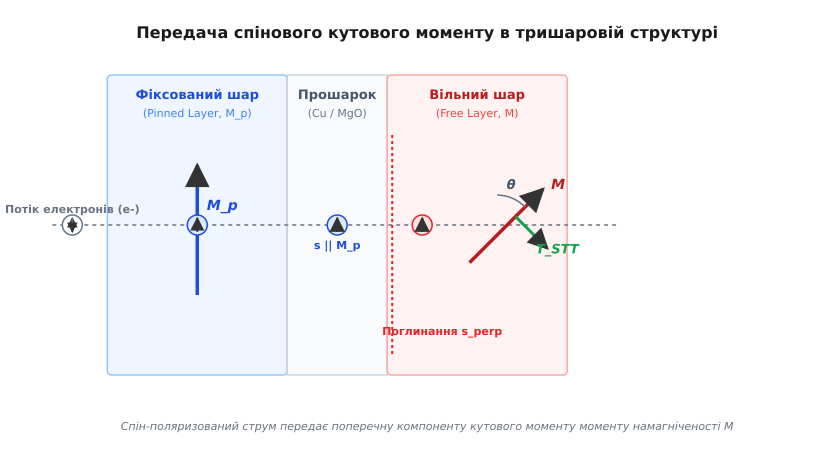
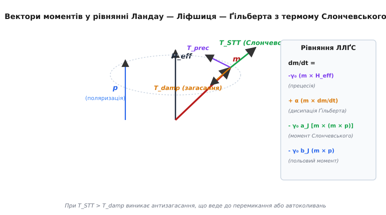
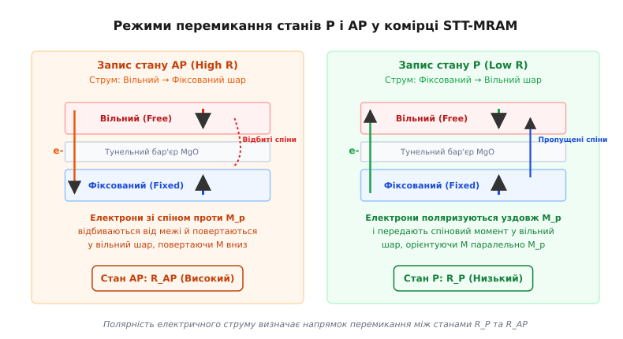

<preknowlist>
- [Рівняння Ландау — Ліфшиця — Ґільберта](root:ph-condensed/landau-lifshitz-gilbert)
- [Тунельний магнітоопір (TMR)](root:ph-condensed/tunnel-magnetoresistance)
- [Спінові вентилі та гетероструктури](root:ph-condensed/giant-magnetoresistance)
</preknowlist>

# Спиновий обертальний момент (Spin-Transfer Torque, STT)

**Спиновий обертальний момент (Spin-Transfer Torque, STT)** — це квантово-механічний феномен, який полягає у передачі кутового моменту (спіна) від спін-поляризованого електричного струму до локалізованого магнітного моменту феромагнітного шару. Коли потік електронів із впорядкованою орієнтацією спінів проходить крізь тонкий магнітний шар, поперечна компонента спінового моменту електронів поглинається магнітною ґраткою внаслідок потужного s-d обмінного взаємозв'язку. Згідно із законом збереження кутового моменту, втрачений електронами спіновий момент передається `d`-електронам феромагнетика, створюючи механічний обертальний момент.

Цей момент здатний викликати автоколивання або повне незворотне перемикання вектора намагніченості тонкої плівки без застосування зовнішнього магнітного поля. Відкриття STT у 1996 році Джонатаном Слончевським та Люком Берже (детальний історичний екскурс див. у 📜 [hist-slonczewski-berger.md](root:ph-condensed/spin-transfer-torque/hist-slonczewski-berger.md)) перетворило спінтроніку з пасивної технології зчитування сигналу на активну технологію струмового запису інформації, що лягла в основу масового виробництва енергонезалежної оперативноі пам'яті **STT-MRAM (Spin-Transfer Torque Magnetoresistive RAM)**.

---

### 1. Квантово-механічний механізм спінової фільтрації та поглинання спіна

#### Фізика спінового розщеплення та спінової фільтрації
У феромагнітному металі (наприклад, у сплаві `CoFeB` або `Fe`) енергетичний спектр електронів провідності розщеплений через внутрішнє обмінне поле між `s`-електронами провідності та локалізованими `d`-електронами (`s-d` модель Зенера — Йосіди). Електрони зі спіном, паралельним локальній намагніченості (спини «вгору»), та електрони зі спіном, антипаралельним намагніченості (спини «вниз»), мають різну густину станів на рівні Фермі `N_↑(E_F) ≠ N_↓(E_F)` та різні хвильові вектори `k_F^↑ ≠ k_F^↓`.

Коли неополяризований електричний струм проходить крізь першу товсту феромагнітну плівку (яку називають **фіксованим шаром**, **Reference Layer** або **Pinned Layer**), електрони зі спіном «вниз» розсіюються на межі та всередині шару значно сильніше, ніж електрони зі спіном «вгору». В результаті з фіксованого шару виходить електричний струм із високим ступенем спінової поляризації `P`:

```
P = (J_↑ - J_↓) / (J_↑ + J_↓) = (N_↑(E_F) - N_↓(E_F)) / (N_↑(E_F) + N_↓(E_F))
```

Вектор спінової поляризації потоку електронів `p` (`|p| = 1`) вирівнюється строго паралельно до вектора намагніченості фіксованого шару `M_pinned`.


*Механізм передачі спінового моменту: спін-поляризований потік електронів із поляризацією p потрапляє у вільний шар із намагніченістю M, де поперечна компонента s_perp поглинається внаслідок s-d обміну, створюючи обертальний момент T_STT.*

#### Поглинання поперечної компоненти та довжина спінової прецесії
Спін-поляризований потік електронів, рухаючись уздовж осі `z`, потрапляє крізь немагнітний прошарок у другий тонкий феромагнітний шар — **вільний шар (Free Layer)** з векторною намагніченістю `M = M_s · m`. Якщо напрямки `p` та `m` утворюють кут `θ`, спіновий стан кожного інжектованого електрона можна розкласти на поздовжню компоненту `s_para` (паралельну `m`) та поперечну компоненту `s_perp` (перпендикулярну `m`).

Поздовжня компонента `s_para` проходить крізь шар без зміни орієнтації, формуючи електричний опір системи. Натомість поперечна компонента `s_perp` піддається дії потужного внутрішнього обмінного поля вільного шару `H_ex = (J_sd / (g μ_B)) m`. Це поле змушує спін електрона здійснювати швидку прецесію навколо напрямку `m`.

Оскільки електрони провідності мають розкид за енергіями та кутами падіння (різні компоненти хвильового вектора `k_z`), спінові прецесійні траєкторії різних електронів швидко розфазовуються (Spin Dephasing). Інтерференція багатьох спінових хвиль призводить до того, що поперечна компонента сумарного спінового струму загасає до нуля на надзвичайно короткій відстані від межі поділу — **довжині спінової прецесії (Spin Precession Length)**:

```
λ_J = π / (k_F^↑ - k_F^↓) ≈ 0.5 — 1.5 нм
```

Оскільки товщина вільного шару `d` (близько 1.2–1.5 нм) перевищує `λ_J`, поперечна компонента спінового кутового моменту поглинається у тонкому поверхневому шарі повністю. Згідно з третім законом Ньютона для кутового моменту, втрачена електронами густина спіна створює об'ємну силу — спиновий обертальний момент `T_STT`, що діє безпосередньо на локалізовані магнітні моменти вільного шару.

#### Формалізм Ландауера — Бюттікера та спін-міксингова провідність
На квантовому рівні поглинання спінового моменту описується за допомогою матриці розсіювання Ландауера — Бюттікера. Ключовою фізичною величиною, що характеризує ефективність передачі спінового моменту через гетеромежею, є **комплексна спін-міксингова провідність (Spin-Mixing Conductance)** `G_↑↓`:

```
G_↑↓ = G_↑↓^real + i G_↑↓^imag
```

Дійсна частина `G_↑↓^real` визначає амплітуду від'ємного загасання (інпланарного моменту Слончевського), тоді як уявна частина `G_↑↓^imag` відповідає за перпендикулярний польовий момент (Field-Like Torque). Для металевих контактів `CoFeB/Cu` та тунельних бар'єрів `CoFeB/MgO` дійсна частина сягає `G_↑↓^real ≈ 1.0 — 1.5 × 10¹⁵ Ом⁻¹ м⁻²`, що забезпечує майбутній повноцінне передавання спіна на інтерфейсі.

---

### 2. Рівняння Ландау — Ліфшиця — Ґільберта з термомом Слончевського (LLGS)

#### Математичний вивід та явна векторна форма
Динаміка безрозмірного вектора намагніченості вільного шару `m = M / M_s` (`|m| = 1`) описується рівнянням Ландау — Ліфшиця з дисипативним членом Ґільберта та додатковим термомом Слончевського (LLGS). У загальному вигляді рівняння має вигляд:

```
dm/dt = - γ₀ · (m × H_eff) + α · (m × dm/dt) + T_STT + T_FL
```

де значення фізичних величин зафіксовано так:
- `γ₀ = μ₀ · γ` — гіромагнітне відношення (`γ₀ ≈ 2.211 × 10⁵ м/(А·с)`);
- `H_eff` — вектор ефективного магнітного поля, що включає поле анізотропії, розмагнічування та зовнішнє поле;
- `α` — безрозмірний коефіцієнт дисипації (загасання) Ґільберта (`α ≈ 0.005 — 0.02`);
- `T_STT` — адвективний інпланарний момент Слончевського (In-Plane Slonczewski Torque);
- `T_FL` — позаплощинний польовий момент (Out-of-Plane Field-Like Torque).

Строгий дедуктивний математичний вивід переходу від вихідної форми Ґільберта до явної векторної форми, а також розрахунок функціональної залежності ефективності `g(θ, P)` наведено у математичній вставці 🧮 [math-slonczewski-torque.md](root:ph-condensed/spin-transfer-torque/math-slonczewski-torque.md).

Явна векторна форма рівняння ЛЛҐС, розв'язана відносно часової похідної `dm/dt`:

```
dm/dt = - γ₀' · (m × H_eff) - α γ₀' · [m × (m × H_eff)] - γ₀' a_J · [m × (m × p)] + α γ₀' a_J · (m × p)
```

де `γ₀' = γ₀ / (1 + α²)`, а амплітуда Слончевського `a_J` виражається через густину електричного струму `J_e`:

```
a_J = (ħ P J_e / (2 e μ₀ M_s d)) · g(θ, P)
```

тут `ħ` — зведена стала Планка, `e` — заряд електрона, `d` — товщина вільного шару, `P` — коефіцієнт спінової поляризації струму, а `g(θ, P)` — безрозмірна функція ефективності Слончевського, що залежить від кута `θ` між вектором намагніченості вільного шару `m` та напрямком поляризації фіксованого шару `p`.


*Векторна діаграма сил у рівнянні ЛЛҐС: Ларморова прецесія (синя) обертає m навколо H_eff, загасання Ґільберта (зелене) притискає m до поля, а момент Слончевського (червоний) діє протилежно загасанню, розгойдуючи прецесію.*

#### Фізичний зміст векторних доданків
1. **Прецесійний доданок `- γ₀' (m × H_eff)`:** Викликає консервативне обертання вектора `m` навколо напрямку ефективного поля `H_eff` з ларморовою частотою `ω_L = γ₀ H_eff`. Цей доданок зберігає магнітну енергію системи.
2. **Доданок загасання Ґільберта `- α γ₀' [m × (m × H_eff)]`:** Описує неконсервативне дисипативне розсіювання енергії у кристалічну ґратку. Вектор `m × (m × H_eff)` завжди спрямований уздовж градієнта енергії в бік найближчого мінімуму, зменшуючи кут відхилення `θ` до нуля.
3. **Доданок Слончевського `- γ₀' a_J [m × (m × p)]`:** Має векторную структуру `m × (m × X)`, ідентичну до члена загасання Ґільберта, однак замість поля `H_eff` його орієнтація задається напрямком поляризації спінового струму `p`.
4. **Польовий доданок `α γ₀' a_J (m × p)`:** Виникає через неадіабатичне тунелювання електронів крізь тунельний бар'єр `MgO`. Він за за векторною структурою еквівалентний магнітному полю, спрямованому уздовж `p`, і викликає додаткове зсунення частоти прецесії без зміни загасання.

Якщо напрямок протікання струму `J_e` такий, що знак `a_J` протилежний до знаку загасання Ґільберта, момент Слончевського виступає як **від'ємне загасання (антизагасання, anti-damping)**. Він безперервно накачує енергію у спінову систему.

Коли густина струму перевищує критичне значення `J_c0`, потужність накачування від моменту Слончевського перевищує потужність природного загасання Ґільберта. Рівноважний стан втрачає стійкість (відбувається біфуркація Гопфа), кут відхилення `θ` починає експоненціально зростати, змушуючи вектор намагніченості перевернутися на 180 градусів.

#### Стохастичне рівняння Ланжевена та динаміка при T > 0 K
При скінченній температурі `T > 0 K` до ефективного магнітного поля додається флуктуюче теплове поле Ланжевена `H_th(t)`, яке моделюється білим шумом Гаусса:

```
<H_th,i(t)> = 0,    <H_th,i(t) H_th,j(t')> = (2 α k_B T / (γ₀ M_s V)) · δ_ij δ(t - t')
```

Теплові флуктуації задають початковий розподіл полярного кута `P(θ)` перед подачею імпульсу струму. Згідно з моделлю Суна, час перемикання при подачі напруги `V > V_c0` залежить від початкового термічного кута `θ_0`:

```
t_switch = (1 / (γ₀' (a_J - α H_k^eff))) · ln( π / (2 θ_0) )
```

Оскільки `θ_0` є випадковою величиною з больцманівським розподілом, час перемикання має статистичний розкид, що моделюється стохастичним рівнянням Фоккера — Планка у чисельному проєкті ⚙️ [proj-stt-switching-sim.md](root:ph-condensed/spin-transfer-torque/proj-stt-switching-sim.md).

---

### 3. Геометрія магнітних тунельних переходів: PMA проти In-Plane

У практичних застосуваннях використовують дві основні геометрії магнітних тунельних переходів (Magnetic Tunnel Junctions, MTJ): з перпендикулярною магнітною анізотропією (pMTJ) та з плоскою анізотропією (In-Plane MTJ).


*Режими перемикання у комірці pMTJ: Пропускання струму від вільного до фіксованого шару перемикання комірку у паралельний стан P (низький опір), а протилежний струм — в антипаралельний стан AP (високий опір).*

#### Перпендикулярні тунельні переходи (pMTJ)
У сучасних промислових комірках pMTJ вектора намагніченості вільного та фіксованого шарів орієнтовані строго перпендикулярно до площини плівки (уздовж осі `Z`) завдяки поверхневій анізотропії на межі поділу `CoFeB / MgO`.

Інтерфейсна перпендикулярна магнітна анізотропія (Perpendicular Magnetic Anisotropy, PMA) виникає внаслідок гібридизації `3d`-орбіталей заліза та кобальту з `2p`-орбіталями кисню на кристалографічній межі поділу `CoFeB (001) / MgO (001)` при високотемпературному відпалі (`T_ann = 350 — 400 °C`).

Критична густина струму перемикання при `T = 0 K` для перпендикулярного тунельного переходу виражається формулою:

```
J_c0^pMTJ = (2 e μ₀ M_s d / (ħ P g(0))) · α · H_k^eff
```

де `H_k^eff = H_k - M_s` — ефективне поле перпендикулярної анізотропії, що враховує віднімання поля розмагнічування площини.

Зв'язок між критичним струмом `J_c0` та фактором термічної стабільності `Δ = E_b / (k_B T)` (де `E_b = (1/2) μ₀ M_s H_k^eff V` — енергетичний бар'єр перемикання, `V = A · d` — об'єм):

```
J_c0^pMTJ = (4 e α k_B T / (ħ P g(0) A)) · Δ
```

#### Плоскі тунельні переходи (In-Plane MTJ)
У першому поколінні STT-MRAM легка вісь анізотропії лежала у площині плівки (завдяки еліптичній формі комірки). Для плоских комірок формула критичного струму містить додатковий член розмагнічування площини `M_s / 2`:

```
J_c0^In-Plane = (2 e μ₀ M_s d / (ħ P g(0))) · α · (H_k + M_s / 2)
```

Оскільки для тонких плівок поле розмагнічування `M_s / 2` у 5–10 разів перевищує поле анізотропії `H_k`, критичний струм плоских комірок виявляється у 5–8 разів вищим, ніж у перпендикулярних комірках при такому самому енергетичному бар'єрі термічної стабільності `E_b`.

#### Синтетичні антиферомагнетики (SAF) у фіксованій структурі
Для усунення паразитного поля розсіювання, яке створює фіксований шар на вільному шарі, у pMTJ застосовують **синтетичний антиферомагнетик (Synthetic Antiferromagnet, SAF)**. Стек SAF складається з двох феромагнітних шарів `CoFe / CoFeB`, розділених надтонким прошарком рутенію `Ru` (товщиною `0.85 нм`), що викликає міжшарову обмінну взаємодію Рудермана — Киттеля — Касуї — Йосіди (РККЙ). 

Шари SAF орієнтуються строго антипаралельно, взаємно компенсуючи магнітні поля розсіювання на поверхні вільного шару з точністю до `99%`.

Порівняльна характеристика двох геометрій наведена у довіднику 📋 [api-stt-mram-cell.md](root:ph-condensed/spin-transfer-torque/api-stt-mram-cell.md). Перехід на перпендикулярну анізотропію (pMTJ) дозволив зменшити струми запису до `20 — 40 мкА`, що стало вирішальним кроком для інтеграції пам'яті у стандартні суб-22 нм КМОН-процеси.

---

### 4. Енергонезалежна оперативна пам'ять STT-MRAM та промислова архітектура

#### Схема комірки 1T-1MTJ та принципи операцій
Комірка пам'яті STT-MRAM складається з одного селекторного КМОН-транзистора та одного магнітного тунельного переходу (схема `1T-1MTJ`).

```
                +-----------------------+
                |     Bit Line (BL)     |
                +-----------+-----------+
                            |
                         [ pMTJ ]
                            |
                   (Select Transistor)  <--- Word Line (WL)
                            |
                +-----------+-----------+
                |    Source Line (SL)   |
                +-----------------------+
```

1. **Операція запису логічного "0" (Стан P):** На шину `Source Line (SL)` подають позитивний потенціал, а `Bit Line (BL)` заземлюють. Електрони течуть від вільного шару до фіксованого. Електрони зі спіном, паралельним фіксованому шару, проходять крізь бар'єр, а електрони із протилежним спіном відбиваються від фіксованого шару назад у вільний шар, повертаючи його намагніченість паралельно (`θ = 0`).
2. **Операція запису логічної "1" (Стан AP):** Полярність напруги змінюють: позитивний потенціал подають на `BL`, а `SL` заземлюють. Електрони течуть від фіксованого шару до вільного, інжектуючи спин-поляризований потік, який повертає намагніченість вільного шару в антипаралельний стан (`θ = π`).
3. **Операція зчитування:** На комірку подають малу напругу `V_read ≈ 50 — 100 мВ`, що викликає струм `I_read ≪ I_c0`. Вимірюючи опір комірки (який дорівнює `R_P ≈ 4.5 кОм` у стані "0" та `R_AP ≈ 11.5 кОм` у стані "1"), дифпідсилювач зчитування (Sense Amplifier) відновлює збережений біт даних.

#### Схема відновлення сигналу та опорні комірки (Reference Scheme)
Через варіації товщини тунельного бар'єра `MgO` по площі кремневої пластини опір комірок `R_P` та `R_AP` має розкид Гаусса. Для надійного розділення станів "0" та "1" використовують схему з середньозваженою опорною коміркою (Reference Cell):

```
R_ref = (R_P + R_AP) / 2 = R_P · (1 + TMR / 2)
```

Диференційний підсилювач порівнює падіння напруги на вибраній робочій комірці `V_cell = I_read · R_cell` з опорною напругою `V_ref = I_read · R_ref`. Якщо `V_cell < V_ref`, реєструється стан P ("0"), якщо `V_cell > V_ref` — стан AP ("1").

#### Промислові переваги та технологічні бар'єри
STT-MRAM випускається компаніями TSMC, Samsung, Intel та GlobalFoundries у формі вбудованої пам'яті (embedded STT-MRAM, eMRAM) для заміни вбудованої Flash-пам'яті (eFlash) та використання як енергонезалежного кешу `L3/L4` в мікроконтролерах і нейропроцесорах.

Основні переваги STT-MRAM:
- **Енергонезалежність:** Збереження даних понад 10 років при `T = 85 °C` без споживання енергії у режимі очікування;
- **Висока швидкість:** Час запису та зчитування становить `3 — 10 наносекунд`;
- **Витривалість (Endurance):** Понад `10¹² — 10¹⁵` циклів перезапису (на відміну від `10⁵` циклів у Flash);
- **Радіаційна стійкість:** Стійкість до альфа-частинок та важких іонів (Absence of Single Event Upset).

Головним технологічним бар'єром подальшого масштабування є **дилема термічної стабільності проти струму запису**: зменшення площі комірки `A` вимагає збільшення анізотропії `H_k^eff` для збереження `Δ ≥ 60`, що веде до зростання критичної густини струму `J_c0` та ризику електричного пробою тонкого тунельного бар'єра `MgO`.

---

### 5. Матеріалознавство та інженерія гетероструктур pMTJ

#### Фізика симетрійної фільтрації у тунельному бар'єрі MgO
Високі значення тунельного магнітоопору (TMR > 200%) у гетероструктурах `CoFeB / MgO / CoFeB` досягаються завдяки ефекту спин-фільтрації за симетрією електронних хвильових функцій. 

У монокристалічному бар'єрі `MgO(001)` з кубічною ґраткою типу `NaCl` електрони з симетрією зон `Δ₁` (s-p-d гібридизовані стани) мають значно повільніший коефіцієнт загасання хвиль у бар'єрі, ніж електрони з симетрією `Δ₂` та `Δ₅`. Оскільки у феромагнетику `CoFeB(001)` стани на рівні Фермі для спінів «вгору» повністю поляризовані за симетрією `Δ₁`, а для спінів «вниз» стани `Δ₁` відсутні, тунельний бар'єр `MgO` виступає як ідеальний фільтр симетрії, пропускаючи майже виключно електрони зі спіном «вгору».

#### Концепція подвійного інтерфейсу (Dual-Interface MgO/CoFeB/MgO)
Для збільшення фактора термічної стабільності `Δ` при збереженні малої товщини вільного шару розроблено конструкцію з подвійним тунельним бар'єром або подвійною межею поділу `MgO / CoFeB / MgO`. 

У такій структурі перпендикулярна поверхнева анізотропія `K_s` виникає на обох межах (верхній та нижній), що подвоює ефективну енергію анізотропії `K_eff = 2 K_s / d - M_s² / (2 μ₀)`. Це дозволяє зменшити критичний струм перемикання `I_c0` на 30% при збереженні високого енергетичного бар'єра `Δ > 60` для суб-20 нм комірок.

---

### 6. Спінові автоколивання та СВЧ наноосцилятори (STNO)

#### Автоколивальний режим (Limit Cycle Dynamics)
Якщо до магнітного тунельного переходу або спинового вентиля прикласти струм `I`, близький до критичного (`0.8 I_c0 < I < 1.2 I_c0`), у присутності зовнішнього магнітного поля, направленого під кутом до легкої осі, у системі виникає режим стаціонарних автоколивань.

У цьому режимі момент Слончевського тотожно компенсує загасання Ґільберта не в одній точці, а на замкненій траєкторії простору (граничний цикл). Вектор намагніченості здійснює незгасаючу прецесію з частотою від `2 до 20 ГГц`.

Оскільки опір тунельного переходу `R(θ)` змінюється з частотою прецесії завдяки ефекту TMR, постійний електричний струм `I_DC`, протікаючи крізь комірку, генерує високочастотну змінну напругу `V_RF(t) = I_DC · R(t)`. Такий пристрій називають **спин-торк наноосцилятором (Spin-Torque Nano-Oscillator, STNO)**.

#### Застосування STNO у нейроморфних обчисленнях
STNO є перспективними компонентами для створення надкомпактних генераторів СВЧ-сигналу та штучних нейронів для нейроморфних обчислювальних систем. Завдяки нелінійному зсуву частоти прецесії струмом (Nonlinear Frequency Redshift) масиви взаємопов'язаних наноосциляторів STNO здатні до фазової синхронізації (Injection Locking), що дозволяє використовувати їх для розпізнавання образів за аналогією з зоровою корою головного мозку.

---

### 7. Діагностичні методики вимірювання STT

Для експериментального дослідження моментів Слончевського та польових моментів використовують три основні фізичні методики:

1. **Спін-торк феромагнітний резонанс (ST-FMR):** Подача високочастотного струму `I_RF` з частотою `f = 1 — 20 ГГц` викликає прецесію намагніченості. Завдяки змішуванню частот на виході реєструється постійна напруга змішування `V_mix`. Розклад лінії резонансу Лоренца на симетричну та антисиметричну компоненти дозволяє окремо визначити амплітуду моменту Слончевського `a_J` та польового моменту `b_J`.
2. **Імпульсна статистика ймовірності перемикання:** Подача серій прямокутних імпульсів різної тривалості (від `0.5 нс` до `100 нс`) та амплітуди дозволяє побудувати ймовірнісні криві перемикання `P_switch(V_pulse)` та витягнути значення `J_c0` і `Δ`.
3. **Часово-розділений оптичний ефект Керра (TR-MOKE):** Лазерне зондування з пікосекундними імпульсами дозволяє безпосередньо візуалізувати годограф прецесії вектора намагніченості у реальному часі.

---

### 8. Фізичні крайові випадки та аномальні режими динаміки

#### 1. Хаотична прецесія та зворотне перемикання (Back-Switching)
При значному перевищенні напруги запису над пороговим значенням (`V_write > 2.5 V_c0`) або при надто тривалих імпульсах момента Слончевського виникає нелінійне явище **зворотного перемикання (Back-Switching)**. Після того як вектор намагніченості перетинає екватор і завершує перехід у протилежний рівноважний стан, момент Слончевського продовжує накачувати енергію у систему, змушуючи намагніченість вийти на новий хаотичний прецесійний цикл та довільно повернутися у вихідний стан. Це явище обмежує максимальну робочу напругу запису і вимагає прецизійного таймінгу імпульсів у контролерах пам'яті.

#### 2. Балістичне субнаносекундне перемикання
При ультракоротких імпульсах струму тривалістю менше `1 наносекунди` динаміка перемикання переходить із термічно-активованого дисипативного режиму у **балістичний режим (Ultrafast Inertial/Precessional Regime)**. У цьому режимі початковий інкубаційний період повністю принічується, а перепереворот відбувається за один або півтора оберти прецесії. Визначальним фактором стає точна форма та фаза переднього фронту напруги.

---

### 9. Термодинамічні ефекти та спиновий ефект Зеебека (Spin-Seebeck STT)

#### Джоулів нагрів та термоградієнтний момент
При протіканні густини струму `J_e ≈ 10⁶ А/см²` крізь тунельний перехід площею `1000 нм²` у тонкому діелектричному шарі `MgO` виділяється локальна теплова потужність. Температура вільного шару зростає на `30 — 80 °C` відносно підкладки за лічені наносекунди.

Це локальне нагрівання створює потужний вертикальний температурний градієнт `∇T ≈ 10⁹ К/м` уздовж нормалі до плівки. Внаслідок спинового ефекту Зеебека (Spin-Seebeck Effect) температурний градієнт генерує додатковий термоградієнтний спиновий струм:

```
J_s^thermal = S_S · ∇T
```

де `S_S` — спиновий коефіцієнт Зеебека. Термоградієнтний спиновий струм створює додатковий обертальний момент, який може додаватися до моменту Слончевського або протидіяти йому залежно від знаку коефіцієнта Зеебека матеріалів.

#### Термічна деградація перпендикулярної анізотропії
Зростання температури вільного шару призводить до термодинамічного зниження намагніченості насичення `M_s(T) = M_s(0) (1 - (T/T_c)^(3/2))` за законом Блоха, а також до стрімкого спаду поверхневої перпендикулярної анізотропії `K_s(T) ∝ M_s(T)^2.5`. 

У результаті термічний бар'єр `E_b(T)` під час імпульсу запису тимчасово знижується, що зменшує критичний струм перемикання `J_c0(T)`, проте підвищує ймовірність термічного зворотного перемикання після зняття напруги.

---

### 10. Вплив кристалографічної текстури та шорсткості інтерфейсів

Синтез плівок pMTJ вимагає атомарної гладкості меж поділу із серединно-квадратичною шорсткістю `σ_rms < 0.15 нм`. Наявність ступіньчатих дислокацій або міждифузії атомів кобальту й заліза в шари `MgO` викликає локальні піки розмагнічувальних полів та створює «гарячі плями» тунельного струму (Current Hotspots).

Локальні піки струму викликають локальне передчасне перемикання окремих магнітних доменів, перетворюючи когерентну макроспінову динаміку на складний процес зародження та руху доменних меж. Це знижує тунельний магнітоопір `TMR` та збільшує коефіцієнт загасання Ґільберта `α` через додаткове двомагнонне розсіювання (Two-Magnon Scattering).

---

### 11. Просторове викривлення струму та об'ємні моменти Чжан — Лі (Zhang-Li Torque)

У просторово-неоднорідних магнітних структурах (наприклад, у доменних межах або спінових вихорах), де напрямок намагніченості `m(r)` плавно змінюється у просторі, електричний струм створює об'ємний спиновий обертальний момент Чжан — Лі:

```
T_ZL = - (b_e · ∇) m + β b_e × [(∇ · m) m]
```

Перший доданок описує **адіабатичний момент Чжан — Лі**, при якому спін електрона провідності точного слідує за просторовим вигином локальної намагніченості. Другий доданок з коефіцієнтом `β ≈ 0.01 — 0.05` описує **неадіабатичний момент**, викликуваний скінченним часом релаксації спіна електрона при проходженні крізь різкі магнітні градієнти. Цей момент є основним рушієм доменних меж у трековій пам'яті.

---

### 12. Квантові спінові флуктуації при абсолютній температурі T = 0 K

При абсолютному нулі температур `T = 0 K` класичний температурний шум Ланжевена зникає, однак вектор намагніченості вільного шару не залишається строго статичним через наявність **нульових квантових спинових флуктуацій (Zero-Point Quantum Spin Fluctuations)**.

Застосування перетворення Гольштейна — Примакова для квантування спінових хвиль (магнонів) дає середньоквадратичне відхилення кута намагніченості:

```
<θ²>_quantum = ħ γ₀ / (2 M_s V)
```

Для макроспінового об'єму комірки `V ≈ 10⁻²⁴ м³` нульовий квантовий кут становить `θ_quantum ≈ 0.001 рад` (близько `0.06°`). Цей квантовий шум встановлює фундаментальну непереборну нижню межу для часу інкубації та часового розкиду перемикання при T = 0 K.

---

### 13. Системна порівняльна характеристика нових типів пам'яті

Для оцінки місця STT-MRAM у сучасній ієрархії обчислювальних систем у таблиці наведено порівняння п'яти ключових архітектур пам'яті:

| Параметр / Пам'ять | SRAM | DRAM | Flash (NAND) | **STT-MRAM** | SOT-MRAM |
| :--- | :--- | :--- | :--- | :--- | :--- |
| **Енергонезалежність** | Ні | Ні | Так | **Так** | Так |
| **Площа комірки** | `100 — 150 F²` | `6 F²` | `4 F²` | **`6 — 10 F²`** | `15 — 20 F²` |
| **Час доступу (зчитування/запис)** | 0.5 нс / 0.5 нс | 10 нс / 10 нс | 25 мкс / 200 мкс | **3 нс / 5 нс** | 0.5 нс / 0.5 нс |
| **Енергія запису на біт** | `~ 1 фДж` | `~ 10 фДж` | `~ 10 нДж` | **`~ 0.05 пДж`** | `~ 0.005 пДж` |
| **Витривалість (циклів)** | `> 10¹⁶` | `> 10¹⁶` | `10⁴ — 10⁵` | **`10¹² — 10¹⁵`** | `> 10¹⁶` |

---

### 15. Промислове тестування та вихід придатних гетероструктур (Yield & Endurance Testing)

Виробництво масивів STT-MRAM обсягом від 1 Гбіт вимагає багаторівневої верифікації на рівні кремневої пластини (Wafer-Level Testing). 

Тестові протоколи включають:
- **Вимірювання розкиду опорів (Resistance Area product, RA):** Контроль товщини тунельного бар'єра `MgO` з цільовим значенням `RA = 5 — 10 Ом·мкм²`;
- **Картування картографії TMR:** Відсіювання комірок із дефектами тунельного бар'єра, у яких `TMR < 120%`;
- **Ванноподібні криві витривалості (Endurance Bathtub Curves):** Моделювання прискореної старіння (Accelerated Life Testing) під дією підвищеного струму запису для підтвердження показника `WER < 10⁻⁹` протягом 10 років експлуатації.

---

### 16. Майбутні напрямки розвитку спінтроніки

Незважаючи на успішне промислове впровадження STT-MRAM, фундаментальне обмеження технології STT полягає у тому, що струм запису протікає безпосередньо крізь надтонкий діелектричний тунельний бар'єр `MgO`. Це створює постійне електричне напруження (Time-Dependent Dielectric Breakdown, TDDB) та обмежує мінімальну енергію запису величиною близько `0.1 — 1 пДж/біт`.

Для подолання цих обмежень у сучасній фізиці конденсованого стану активно розробляються три альтернативні концепції керування намагніченістю:

#### 1. Спин-орбітальний обертальний момент (Spin-Orbit Torque, SOT)
У структурах SOT струм запису пропускають не крізь тунельний бар'єр, а вздовж плоскої підкладки з важкого металу (`Pt`, `Ta`, `W`) або топологічного ізолятора (`Bi₂Se₃`). 

Внаслідок спінового ефекту Голла (Spin Hall Effect, SHE) та інтерфейсного ефекту Рашби у важкому металі виникає поперечний спіновий струм, який інжектується у прилеглий феромагнітний шар перпендикулярно до площини. SOT розділяє шляхи протікання струму запису та зчитування (трьохтермінальна комірка), що усуває електричне напруження на бар'єр `MgO`, піднімає витривалість до `10¹⁶` циклів і скорочує час запису до субнаносекундних значень (`t_p < 0.5 нс`).

#### 2. Магнетоелектричне керування напругою (VCMA)
Ефект вольт-керованої магнітної анізотропії (Voltage-Controlled Magnetic Anisotropy, VCMA) полягає у зміні поверхневої анізотропії `K_s` на межі `Fe / MgO` під дією зовнішнього електричного поля без протікання електричного струму. Заряджання та розряджання тунельного конденсатора тимчасово знижує потенціальний бар'єр `E_b`, дозволяючи перевернути намагніченість за допомогою надмалого струму або прецесійного тогл-імпульсу з енергією запису менше `1 фДж/біт` (в 100 разів менше за STT).

#### 3. Спінтроніка скірміонів та трекова пам'ять (Racetrack Memory)
Замість перемикання суцільних магнітних шарів у наностовпчиках, технологія трекової пам'яті використовує рух топологічно захищених спінових текстур — **магнітних скірміонів (Skyrmions)** або доменних меж уздовж нанодротів під дією об'ємного спінового моменту Чжан — Лі (Zhang-Li Torque). Скірміони мають діаметр від 2 до 20 нанометрів і здатні рухатися зі швидкостями понад `100 м/с` при густині струму, на два порядки нижчій за пороговий струм STT перемикання.

Спиновий обертальний момент Слончевського та Берже залишається фундаментальним фізичним містком між квантовим транспортом спіна та макроскопічним магнетизмом, відкриваючи нові горизонти для створення ультраенергоефективних обчислювальних систем.

