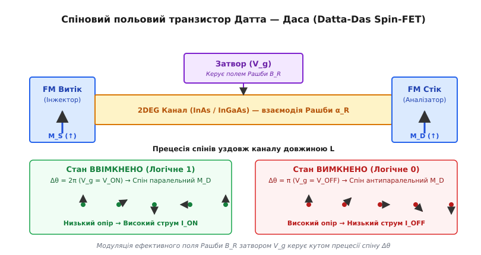
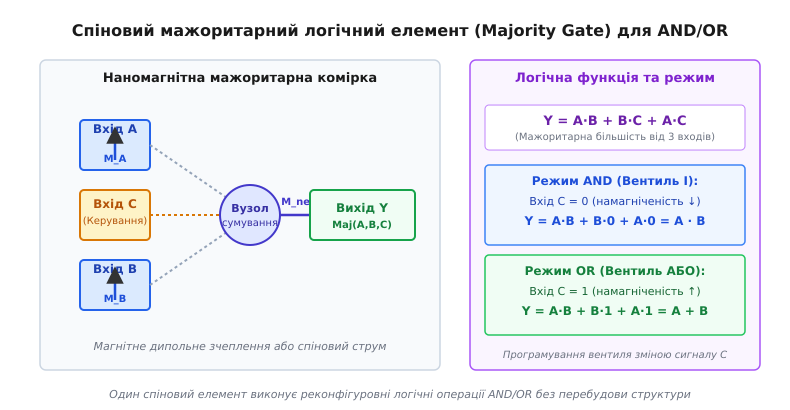
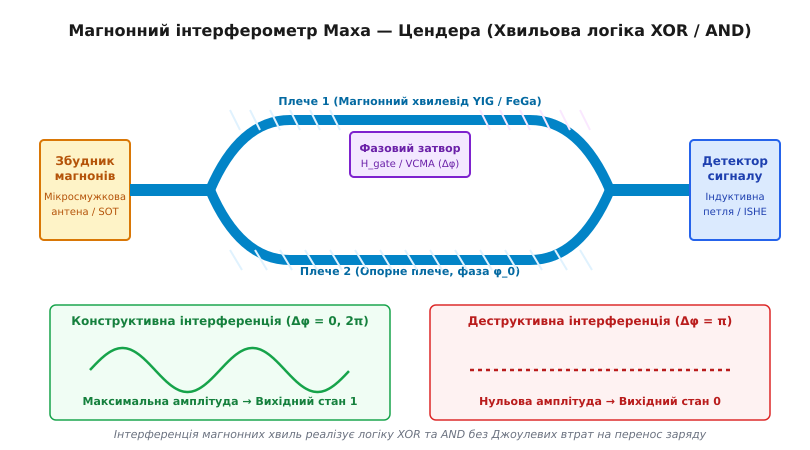

# Спінтронні логічні елементи та інтерферометри

<preknowlist>
- [Гігантський магнетоопір](root:ph-condensed/giant-magnetoresistance) — залежність електричного опору від відносної орієнтації намагніченостей феромагнітних шарів.
- [Тунельний магнітоопір](root:ph-condensed/tunnel-magnetoresistance) — ефект квантового тунелювання спіново-поляризованих електронів крізь тонкий діелектричний бар'єр MTJ.
- [Перенесення спінового моменту](root:ph-condensed/spin-transfer-torque) — перемикання намагніченості феромагнетика за допомогою спіново-поляризованого струму.
- [Спіновий ефект Холла](root:ph-condensed/spin-orbit-torque) — генерація спінового струму у важких металах через спін-орбітальну взаємодію.
- [Спінові хвилі та магнони](root:ph-condensed/spin-wave) — колективні коливання спінових моментів у магнітовпорядкованих середовищах.
</preknowlist>

Напівпровідникові логічні вентилі на базі КМОН-транзисторів зіштовхнулися з фізичним бар'єром тепловиділення: при масштабуванні технологічного нормалю нижче 7 нанометрів витоки струму крізь затвор та Джоулеве нагрівання провідників споживають понад 30% усієї потужності чипа у стані спокою. На відміну від зарядової логіки, де логічний біт кодується наявністю чи відсутністю тисяч електронів у каналі транзистора, спінтроніка (від англ. *spin transport electronics*) використовує квантовий спіновий ступінь вільності електрона та орієнтацію вектора намагніченості. Це дозволяє здійснювати логічні операції AND, OR, XOR та мажоритарне сумування з енергією перемикання аж до аттоджоулевого рівня, забезпечуючи енергонезалежність обчислювальних елементів та усуваючи згасання заряду на ємностях міжатомних з'єднань.

## Фізичні основи спінового обчислення та обмеження КМОН

У класичних напівпровідникових схемах передача інформації супроводжується перенесенням заряду `Q = N · e`. Перезарядка ємності затвора `C` вимагає енергії `E = C · V²`, яка безповоротно розсіюється у вигляді тепла при кожному такті обчислень. Зі зменшенням розмірів елементів струми витоку суттєво зростають, що унеможливлює дальше підвищення тактової частоти понад 4–5 ГГц.

Згідно з фундаментальним межовим принципом Ландауера, мінімальна енергія, необхідна для стирання одного біта інформації за температури `T`, становить:

```
E_Landauer = k_B · T · ln(2) ≈ 2.87 × 10⁻²¹ Дж (при T = 300 K)
```

Сучасні КМОН-транзистори споживають близько `10⁻¹⁵` Дж (1 фДж) на перемикання, що на шість порядків перевищує термодинамічну межу. Основна причина такої неефективності — необхідність переміщення колосальної кількості електронів для створення потенціалу на паразитарних ємностях провідників.

Спінтроніка пропонує принципово інший підхід. Електрон володіє власним кутовим моментом (спіном) `s = 1/2` та пов'язаним із ним магнітним моментом:

```
μ = -g · μ_B · s
```

де `g ≈ 2.0023` — g-фактор вільного електрона, а `μ_B = e·ℏ / (2·m₀)` — магнетон Бора. Для побудови логічного елемента визначальними є три фізичні ефекти:

1. **Енергонезалежність зберігання стану:** Логічний стан `0` або `1` кодується орієнтацією намагніченості `M` наномагніта чи тунельного магнітного переходу (MTJ). Збереження стану не потребує струму підтримання, що повністю усуває статичну потужність витоку.
2. **Низька дисипація при перемиканні:** Переорієнтація спіна не вимагає фізичного переміщення всієї маси електронів уздовж провідника. У магнонних середовищах інформація передається спіновими хвилями без джоулевих втрат.
3. **Реконфігуровність та висока логічна щільність:** Один спіновий елемент (наприклад, мажоритарний вентиль) здатен виконувати логічні функції, які у КМОН-технології вимагають від 6 до 12 окремих транзисторів.

### Фізика спінового накопичення та спінового хімічного потенціалу
У спінових вентилях перенос інформації описується не просто носіями заряду, а розділеними спіновими хімічними потенціалами для електронів зі спіном вгору `μ_↑` та спіном вниз `μ_↓`. Спінове накопичення становить:

```
Δμ_s = μ_↑ - μ_↓
```

Різниця спінових потенціалів створює чисто спіновий струм `J_s = (1/e) · ∇(Δμ_s)`, який може поширюватися крізь металеві та напівпровідникові провідники навіть за відсутності результуючого електричного струму заряду `J_e = 0`.

Детальний аналіз виникнення спінової логіки та роль ключових дослідників описано в історичній довідці [Історія спінового транзистора Датта — Даса та концепції спінової логіки](root:ph-condensed/spintronic-logic-gates/hist-datta-das.md).

## Спіновий польовий транзистор Датта — Даса

У 1990 році Супрійо Датта та Бісваджіт Дас запропонували концепцію спінового польового транзистора (Datta-Das Spin-FET), який став першим теоретичним прикладом напівпровідникового спінового вентиля.

### Принцип роботи та ефект Рашби

Транзистор складається з двох феромагнітних металевих контактів, розділених полупровідниковим каналом із двовимірним електронним газом (2DEG), сформованим у квантовій ямі гетероструктури InAs/InGaAs. Перший контакт слугує інжектором спіново-поляризованих електронів, а другий — аналізатором спінового стану.


*Спіновий польовий транзистор Датта — Даса: модуляція кута прецесії спіна затвором у двовимірному електронному газі.*

Керування струмом каналу здійснюється за допомогою спін-орбітальної взаємодії Рашби (від імені фізика Еммануїла Рашби). Електричне поле затвора `E_z`, спрямоване перпендикулярно до площини каналу, створює у системі відліку рухомого електрона ефективне магнітне поле:

```
B_R = (α_R / (g · μ_B · ℏ)) · (p_y, -p_x, 0)
```

де `α_R` — параметр Рашби, який прямо пропорційний напрузі затвора `V_g`. 

Під дією поля `B_R` спін електрона зазнає Ларморівської прецесії (від лат. *praecessio* — випередження) під час руху уздовж каналу довжиною `L`. Повний кут прецесії `Δθ` на виході з каналу визначається виразом:

```
Δθ = (2 · m* · α_R · L) / ℏ²
```

якщо кут `Δθ = 2·π` (або `0`), спін електрона підходить до аналізатора паралельно його намагніченості `M_D`. Опір контакту є мінімальним, і крізь пристрій протікає високий струм `I_ON` (логічний стан `1`). Якщо напруга затвора `V_g` змінює параметр `α_R` так, що `Δθ = π`, спін повертається антипаралельно до `M_D`. Опір контакту стає максимальним, і струм блокується до рівня `I_OFF` (логічний стан `0`).

Залежність нормалізованого струму каналу від напруги затвора описується співвідношенням:

```
I(V_g) / I_max = cos²( Δθ / 2 ) = cos²( (m* · α_R(V_g) · L) / ℏ² )
```

### Проблема неспівпадіння імпедансів та її розв'язання

Тривалий час практична реалізація транзистора Датта — Даса стримувалася ефектом Ферта — Жафре (Fert-Jaffrès effect). Через значну різницю провідностей металевого феромагнетика (`σ_FM ≈ 10⁷` См/м) та напівпровідника (`σ_SC ≈ 10²` См/м) майже всі поляризовані електрони відбивалися від межі розділу, а ефективність спінової інжекції `γ` не перевищувала 0.1%.

Формула ефективності спінової інжекції без бар'єра має вигляд:

```
γ ≈ (σ_SC · λ_FM) / (σ_FM · λ_SC) ≪ 1
```

де `λ_FM` та `λ_SC` — довжини спінової релаксації у феромагнетику та напівпровіднику відповідно.

Вирішенням стало введення надтонких тунельних бар'єрів (наприклад, шарів MgO або Al₂O₃ товщиною 1–2 нм) між металом і каналом. Тунельний опір розриває прямий омичний контакт і зрівнює спінові хімічні потенціали, дозволяючи досягти ефективності інжекції `γ > 70%` при кімнатній температурі.

### Механізми спінової релаксації у каналі

Під час руху електрона крізь напівпровідник його спіновий стан руйнується через три основні фізичні механізми:

- **Механізм Дьяконова — Переля (DP):** Виникає у системах із сильним спін-орбітальним розщепленням (таких як InAs квантові ями). Під час руху електрон імпульсно розсіюється на домішках. Між зіткненнями напрямок ефективного поля Рашби змінюється, що викликає хаотизацію прецесії. Час спінової релаксації `τ_s` обернено пропорційний часу імпульсного розсіяння `τ_p`: `1/τ_s ∝ α_R² · τ_p`.
- **Механізм Елліота — Яфета (EY):** При кожному зіткненні електрона з фононом або домішкою існує ймовірність перевороту спіна через спін-орбітальну компоненту кристалічного потенціалу. Тут `1/τ_s ∝ 1/τ_p`.
- **Механізм Бірчковича — Аронова — Пікуса (BAP):** Виникає у p-легованих напівпровідниках через обмінну взаємодію між електронами провідності та дірками валентної зони.

Повний математичний вивід гамільтоніана Рашби та розрахунок кута прецесії подано у матеріалі [Математика спінової прецесії Рашби та інтерференції магнонів](root:ph-condensed/spintronic-logic-gates/math-rashba-precession.md).

## Спінові вентилі AND, OR та XOR на базі MTJ, STT та SOT

Сучасна спінтроніка відійшла від використання напівпровідникового каналу на користь суцільнометалевих та тунельних маніпуляцій спіновим моментом. Ключовим елементом таких схем є тунельний магнітний перехід (MTJ).

> 🔧 **Навіщо це.**
> Застосування вентилів SOT-MTJ дозволяє будувати енергонезалежну логіку в пам'яті (Logic-in-Memory). Традиційний процесор витрачає понад 60% енергії на пересилання даних між оперативною пам'яттю та арифметико-логічним пристроєм (ALU) через шину даних. Логічні спінові вентилі виконують обчислення безпосередньо всередині масиву пам'яті MRAM, усуваючи так звану «пляшкову шийку фон Неймана».

### Фізична структура тунельного магнітного переходу (MTJ)

Тунельний магнітний перехід складається з трьох основних шарів:

1. **Фіксований (опорний) феромагнітний шар (Pin Layer):** Намагніченість `M_pin` жорстко зафіксована антиферомагнітним шаром підтискання (Synthetic Antiferromagnet, SAF).
2. **Надтонкий тунельний діелектрик:** Шар монокристалічного оксиду магнію (MgO) товщиною близько 1 нанометра.
3. **Вільний феромагнітний шар (Free Layer):** Намагніченість `M_free` може вільно перемикатися між двома напрямками (паралельним та антипаралельним відносно `M_pin`).

Опір тунельного переходу залежить від відносного кута `φ` між векторами намагніченості за законом:

```
R(φ) = R_LRS + (R_HRS - R_LRS) · (1 - cos(φ)) / 2
```

де `R_LRS` — опір у паралельному стані (Low Resistance State), а `R_HRS` — опір у антипаралельному стані (High Resistance State).

### Перемикання через STT та SOT

Для керування станом вільної намагніченості у логічних вентилях використовуються два фізичні ефекти:

- **Перенесення спінового моменту (Spin-Transfer Torque, STT):** Спіново-поляризований струм протікає безпосередньо крізь тунельний бар'єр MTJ і передає свій кутовий момент вільному магнітному шару, розвертаючи його намагніченість. Проте висока густина струму `J_c ≈ 10^6` А/см² викликає деградацію та електричний пробій надтонкого MgO діелектрика.
- **Спін-орбітальний момент (Spin-Orbit Torque, SOT):** Струм протікає уздовж треку з важкого металу (Pt, Ta, W), розташованого під наномагнітом. Завдяки спіновому ефекту Холла у важкому металі виникає чисто спіновий струм, який інжектується перпендикулярно у вільний шар:
  ```
  J_spin = θ_SH · (ℏ / (2 · e)) · J_charge
  ```
  де `θ_SH` — кут спіна Холла. SOT повністю розділяє шляхи запису та зчитування, підвищуючи надійність елемента та знижуючи енергію перемикання у 10–20 разів.

### Наномагнітна мажоритарна логіка (Majority Logic Gate)

На відміну від КМОН, де базовими вентилями є NAND/NOR, природним логічним елементом для спінтроніки є **мажоритарний вентиль від трьох входів**.


*Наномагнітна мажоритарна комірка та її реконфігуровне програмування у вентилі AND та OR.*

Мажоритарна комірка складається з трьох вхідних наномагнітів (`A`, `B`, `C`), одного центрального вузла сумування та вихідного наномагніта (`Y`). Вхідні наномагніти створюють магнітні дипольні поля або інжектують спінові струми у вузол сумування. Намагніченість вихідного елемента перевертається у напрямку, який відповідає більшості входів:

```
Y = Maj(A, B, C) = A·B + B·C + A·C
```

Реконфігуровність елемента досягається шляхом фіксації одного з входів (наприклад, входу `C`):

- При `C = 0` (намагніченість спрямована вниз): `Y = A·B + B·0 + A·0 = A · B` (Режим **AND** — логічне І).
- При `C = 1` (намагніченість спрямована вгору): `Y = A·B + B·1 + A·1 = A + B` (Режим **OR** — логічне АБО).

Таким чином, одна фізична мажоритарна комірка перемикається між операціями AND та OR без жодних структурних змін, лише зміною сигналу на керуючому вході `C`.

### Спінові вентилі XOR та XNOR

Реалізація логічного елемента «Виключне АБО» (XOR) спирається на диференційну схему з двома тунельними переходами. Якщо входи `A` та `B` мають однакову орієнтацію (`00` або `11`), мостова схема збалансована, і вихідна різниця напруг дорівнює нулю (`0`). Якщо входи протилежні (`01` або `10`), виникає дисбаланс опорів, і на виході формується високий потенціал (`1`).

Таблиця істинності для універсальних спінових вентилів:

| Вхід A | Вхід B | Керування C | Режим AND (C = 0) | Режим OR (C = 1) | Режим XOR (Диференційний) |
| :---: | :---: | :---: | :---: | :---: | :---: |
| 0 | 0 | 0 / 1 | **0** | **0** | **0** |
| 0 | 1 | 0 / 1 | **0** | **1** | **1** |
| 1 | 0 | 0 / 1 | **0** | **1** | **1** |
| 1 | 1 | 0 / 1 | **1** | **1** | **0** |

### Суцільноспінова логіка (All-Spin Logic, ASL)

У концепції All-Spin Logic (ASL), запропонованій префесором Каушіком Роєм (Kaushik Roy), передача сигналів між логічними вентилями здійснюється чисто спіновим струмом у металевих дротах (Cu або Al) без перетворення спіна у напругу. Спінове накопичення `μ_s` поширюється за законом спінової дифузії:

```
∇²μ_s = μ_s / L_s²
```

де `L_s` — довжина спінової дифузії. ASL дозволяє каскадувати логічні елементи без використання проміжних КМОН-підсилювачів.

## Магнонні інтерферометри та хвильова логіка

Найбільш перспективним напрямом безарядової логіки є **магноніка** (від лат. *magnetis* — магніт), у якій носіями інформації є магнони — квазічастинки, що відповідають квантованим спіновим хвилям.

### Магнонний інтерферометр Маха — Цендера

Основним логічним блоком магнонної елементної бази є магнонний інтерферометр Маха — Цендера. Пристрій формується на основі хвилеводних каналів із тонких плівок залізо-ітрієвого гранату (YIG, Y₃Fe₅O₁₂) — діелектричного феромагнетика з рекордним низьким затуханням спінових хвиль (`α_G ≈ 10⁻⁴`).


*Магнонний інтерферометр Маха — Цендера: деструктивна та конструктивна інтерференція спінових хвиль для реалізації логіки XOR.*

Принцип роботи інтерферометра:

1. **Генерація хвиль:** Вхідна мікросмужкова антена або SOT-трансдюсер збуджує спінову хвилю частотою від 5 до 20 ГГц.
2. **Розщеплення:** Хвилевід ділиться у Y-подібному розгалужувачі на два паралельні плечі одинакової довжини.
3. **Фазова модуляція:** Над одним із плечей розташовано затвор. Подача локального магнітного поля `H_gate` або напруги на шар ферроелектрика (ефект VCMA — Voltage-Controlled Magnetic Anisotropy) змінює локальний хвильовий вектор магнона `k_mag` і створює додатковий фазовий зсув `Δφ`.
4. **Рекомбінація та інтерференція:** Хвилі об'єднуються у вихідному Y-з'єднанні:
   - **Конструктивна інтерференція (`Δφ = 0` або `2·π`):** Амплітуди хвиль складаються, результуюча інтенсивність сигналу `I_out = 4 · A²` піднімається вище порогу детектування (Логічна `1`).
   - **Деструктивна інтерференція (`Δφ = π`):** Хвилі гасять одна одну у протифазі, результуюча амплітуда падає до нуля `I_out = 0` (Логічний `0`).

Завдяки природній суперпозиції хвиль один магнонний інтерферометр виконує операцію XOR безпосередньо у хвильовому середовищі без побудови складних вентильних ланцюгів.

### Магнонні кристали та нелінійні ефекти
Для розширення функціональності магнонних вентилів застосовують магнонні кристали — хвилеводи з періодичною модуляцією магнітних властивостей або геометрії. У магнонних кристалах виникають заборонені енергетичні зони для спінових хвиль (Magnonic Bandgaps), що дозволяє будувати керовані частотні фільтри та магнонні транзистори.

При підвищенні амплітуди спінових хвиль виникають нелінійні ефекти: трьохмагнонний розпад, самофокусування спінових променів (магнонні каустики) та формування спін-хвильових солітонів, які дозволяють будувати порогові елементи для нейроморфного обчислення.

Алгоритмічна модель інтерферометра та код моделювання подано у матеріалі [Моделювання магнонного логічного елемента XOR/AND](root:ph-condensed/spintronic-logic-gates/proj-magnonic-gate-sim.md).

## Порівняння з КМОН, каскадування та технічні бар'єри

Для оцінки життєздатності спінтронних логічних вентилів порівняємо їхні ключові показники з традиційним 7-нанометровим КМОН-процесом:

| Параметр | КМОН (7 нм FinFET) | SOT-MTJ Вентиль | Магнонний інтерферометр |
| :--- | :--- | :--- | :--- |
| **Енергія на операцію** | ≈ 1–5 фДж | ≈ 5–20 фДж | **≈ 0.01–0.1 фДж** |
| **Час затримки вентиля** | ≈ 10 пс | ≈ 200–500 пс | ≈ 100–300 пс |
| **Площа комірки AND/OR** | 12–16 F² (6 транзисторів) | **4 F² (1 мажоритарний)** | 8–10 F² (хвилевід) |
| **Енергонезалежність** | Ні (потрібне живлення) | **Так (феромагнітний стан)** | Так (у комбінації з MTJ) |
| **Ступінь розгалуження (Fan-Out)**| > 10 | 1 – 2 (потрібне підсилення) | 1 – 2 (згасання хвиль) |

### Проблема каскадування (Cascading) та підсилення

Найбільш критичним бар'єром для створення повністю спінових обчислювальних процесорів є **каскадування** — можливість передачі вихідного сигналу одного вентиля безпосередньо на входи декількох наступних.

Оскільки спіновий струм або амплітуда магнонної хвилі згасає під час руху через затухання Гільберта та спінову релаксацію, коефіцієнт розгалуження (Fan-Out) чисто спінових вентилів зазвичай не перевищує `N = 1`.

Для вирішення цієї проблеми застосовують два підходи:

1. **Гібридні КМОН-спінтронні схеми:** Спіновий вентиль виконує логічну операцію, після чого опір MTJ зчитується компактним КМОН-підсилювачем зчитування (Sense Amplifier), який відновлює рівень напруги для наступного каскаду.
2. **Параметричне підсилення магнонів:** Застосування додаткових імпульсів SOT або надвисокочастотного накачування для відновлення амплітуди спінових хвиль безпосередньо у магнонному хвилеводі.

### Термічна стабільність та суперпарамагнітна межа

При зменшенні об'єму наномагніта `V` нижче 10 нм енергія анізотропії `K_u · V` стає порівнянною з енергією теплових флуктуацій `k_B · T`. Виникає суперпарамагнетизм — спонтанний переворот намагніченості під дією тепла, що призводить до втрати збереженого логічного біта.

Для забезпечення 10-річного терміну зберігання даних у спінтронних логічних вентилях вимагається виконання суворого критерію термічної стабільності:

```
Δ = (K_u · V) / (k_B · T) ≥ 60
```

Це досягається використанням матеріалів із високою перпендикулярною магнітною анізотропією (PMA), таких як багатошарові плівки CoFeB/MgO або перпендикулярні шари FePt.

Кількісні паспорти пристроїв та електричні інтерфейси узгодження наведено у довіднику [Параметри та фізичний інтерфейс спінових логічних вентилів](root:ph-condensed/spintronic-logic-gates/api-spin-gate-params.md).

Завдяки відсутності перезарядки паразитрах ємностей та природній підтримці мажоритарних операцій, спінтронні логічні елементи є головним кандидатом на роль обчислювальної платформи для нейроморфних процесорів та ультра-низькоспоживаних систем штучного інтелекту.
