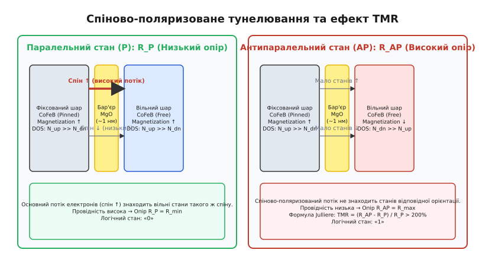
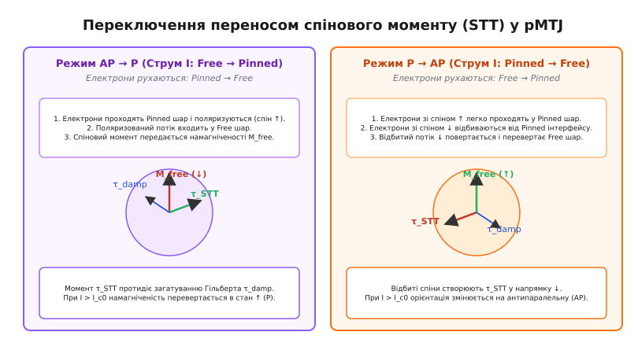
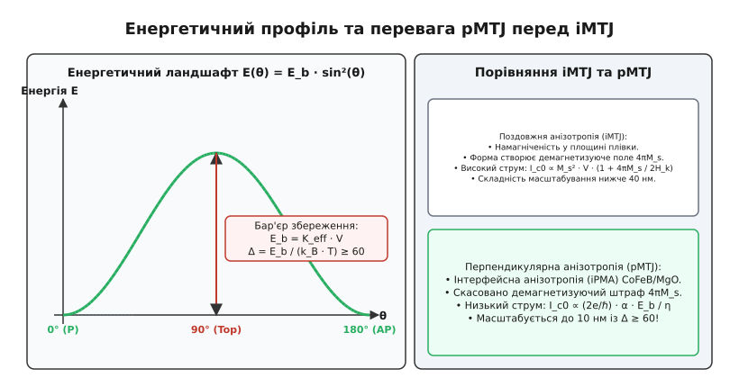
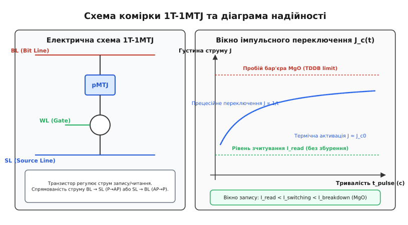

# Фізика STT-MRAM комірки та магнітного тунельного переходу (MTJ)

<preknowlist>
- [Феромагнетизм](topic:ph-condensed/ferromagnetism) — спонтанна намагніченість, обмінна взаємодія та орієнтація магнітних моментів у феромагнетиках.
- [Зонна теорія твердого тіла](topic:ph-condensed/band-theory) — спіновий розподіл станів на рівні Фермі в металах та потенціальний бар'єр у діелектриках.
- [Обмінна взаємодія](topic:ph-condensed/exchange-interaction) — спін-орбітальна та квантово-механічна обмінна взаємодія, що визначає магнітну анізотропію.
</preknowlist>

Зменшення геометричних розмірів осередків енергонезалежної та оперативної пам'яті SRAM, DRAM та Flash нижче позначки 15 нанометрів наразилося на фундаментальні фізичні обмеження твердого тіла. У класичних транзисторних і конденсаторних осередках зменшення об'єму накопичувача заряду призводить до катастрофічного зростання витоків носіїв через пряме тунелювання крізь тонкі діелектрики та термічні флуктуації. Спроба використати орієнтацію вектора намагніченості феромагнетика для зберігання біта інформації тривалий час опиралася на зовнішні магнітні поля, створені струмами у металевих провідниках. Проте при нанорозмірах необхідне для переключення поле зростало пропорційно зменшенню об'єму, вимагаючи струмів у десятки міліампер, які миттєво руйнували напівпровідникову структуру електроміграцією та перегрівом.

Виходом із цього масштабного тупика став перехід від класичного електромагнетизму Максвелла до безпосереднього використання квантового спінового моменту імпульсу провідних електронів — технології **Spin-Transfer Torque MRAM (STT-MRAM)**.

## 1. Обмеження класичної MRAM та фізична необхідність STT

Щоб зрозуміти фундаментальний фізичний прорив STT-MRAM, необхідно розібрати механізм, який зупинив розвиток першого покоління магнітної пам'яті (Field-Switched MRAM).

У класичній MRAM елемент пам'яті являє собою феромагнітну острівкову плівку. Переключення вектора намагніченості `M` з одного напрямку на протилежний здійснювалося зовнішнім магнітним полем `H`, яке створювалося імпульсом струму `I`, пропущеним через керівні шини Bit Line та Word Line. 

При великих розмірах елемента (`> 100` нм) переключення відбувалося шляхом зародок-утворення та руху доменних меж. Проте при зменшенні розміру магнітний елемент переходить у однодоменний стан, де всі спіни обертаються узгоджено — як єдиний макроспін. Переключення макроспіна полем описується астроїдою Стонера — Вольфарта:

```
(H_x / H_k)⁰·⁶⁷ + (H_y / H_k)⁰·⁶⁷ = 1      [Астроїда Стонера — Вольфарта: межа переключення полем]
```

де `H_k` — поле магнітної анізотропії, а `H_x, H_y` — компоненти зовнішнього магнітного поля вздовж легкої та важкої осей.

```
                                    Струм Word Line (I_WL)
                                              │
                                              ▼
 ┌────────────────────────────────────────────────────────────────────────┐
 │                      Астроїда Стонера — Вольфарта                      │
 │                                                                        │
 │                                 H_y ▲                                  │
 │                                     │    Астроїдна межа                │
 │                                ─────┼───── /                           │
 │                               /     │     \                            │
 │                              /      │      \                           │
 │                             │       │       │                          │
 │                    ─────────┼───────┼───────┼─────────► H_x            │
 │                             │       │       │                          │
 │                              \      │      /                           │
 │                               \     │     /                            │
 │                                ─────┼─────                             │
 │                                     │                                  │
 └────────────────────────────────────────────────────────────────────────┘
```

При зменшенні лінійного розміру осередку `d` виникли три фундаментальні фізичні перешкоди:

1. **Суперпарамагнітна межа та енергетичний бар'єр:** Щоб зберігати записаний стан протягом 10 років при робочій температурі 85 °C, висота потенціального енергетичного бар'єра `E_b = K_eff · V` (де `K_eff` — ефективна анізотропія, `V` — об'єм магнітного шару) повинна задовольняти умову `E_b ≥ 60 · k_B · T`. Зменшення об'єму `V ∝ d³` вимагає пропорційного збільшення анізотропії `K_eff`.
2. **Зростання критичного поля та струму:** Поле анізотропії зростає як `H_k = 2 · K_eff / M_s`. Оскільки магнітне поле, створене струмом на відстані `r`, визначається законом Біо — Савара — Лапласа (`H ∝ I / r`), для створення вищого поля `H_k` у меншому об'ємі потрібен **більший** струм `I`. При `d < 90` нм струм переключення перевищив 10 мА, викликаючи електроміграцію провідників.
3. **Паразитична перехресна завада (Half-Select Error):** Дипольні магнітні поля від шин простягаються у просторі на сотні нанометрів. При записі в осередок `(X, Y)` сусідні комірки вздовж тієї ж шини піддавалися дії полуполя, що викликало випадкові стирання сусідніх бітів.

Рішенням став перехід від поля `H` до локального проходження спіново-поляризованого струму безпосередньо крізь наноструктуру. Детальна хронологія цього відкриття представлена в [історії відкриття STT та еволюції MRAM](topic:ph-condensed/stt-mram-cell-physics/hist-stt-mram-evolution.md).

## 2. Магнітний тунельний перехід (MTJ) та квантова фізика TMR

Серцем комірки STT-MRAM є **Магнітний Тунельний Перехід (MTJ)** — квантово-механічна гетероструктура, яка складається з двох феромагнітних металевих електродів, розділених надтонким шар-бар'єром діелектрика товщиною менше 1.5 нанометра.

```
                    Структура тунельного переходу (MTJ):

     ┌────────────────────────────────────────────────────────┐
     │  Вільний шар (Free Layer): CoFeB                       │  (Намагніченість переключається)
     ├────────────────────────────────────────────────────────┤
     │  Тунельний бар'єр: MgO (1 нм, ~4-5 атомарних шарів)    │  (Квантове тунелювання)
     ├────────────────────────────────────────────────────────┤
     │  Фіксований шар (Reference / Pinned Layer): CoFeB     │  (Намагніченість жорстко зафіксована)
     └────────────────────────────────────────────────────────┘
```

Фізичний стан MTJ кодується через орієнтацію намагніченостей двох феромагнітних шарів:
* **Паралельний стан (P):** Намагніченості вільного та фіксованого шарів спрямовані в один бік. Опір переходу є мінімальним (`R_P`). Кодує логічний «0».
* **Антипаралельний стан (AP):** Намагніченості спрямовані в протилежні боки. Опір переходу є максимальним (`R_AP`). Кодує логічну «1».

Величина зміни опору характеризується безрозмірним коефіцієнтом **Тунельного Магнітоопору (TMR)**:

```
TMR = (R_AP - R_P) / R_P
```


*Зліва: у паралельному стані P електрони основного спінового каналу тунелюють у вільні стани аналогічної спінової орієнтації, забезпечуючи високу провідність та низький опір R_P. Справа: в антипаралельному стані AP спіново-поляризований потік зустрічає низьку густину станів протилежної орієнтації, що різко знижує ймовірність тунелювання та формує високий опір R_AP.*

### Модель Жюльєра та її квантово-механічне розширення

У першому наближенні Величина TMR пояснюється феноменологічною моделлю Мішеля Жюльєра (1975). Нехай `P_1` та `P_2` — спінові поляризації густини електронних станів на рівні Фермі для двох феромагнітних електродів:

```
P = (N_up(E_F) - N_dn(E_F)) / (N_up(E_F) + N_dn(E_F))
```

Імовірність тунелювання електрона пропорційна добутку густин станів у початковому та кінцевому електродах. Тоді провідність у паралельному `G_P` та антипаралельному `G_AP` станах записується як:

```
G_P ∝ N_up1 · N_up2 + N_dn1 · N_dn2
G_AP ∝ N_up1 · N_dn2 + N_dn1 · N_up2
```

Підставляючи вирази для провідності в означення TMR, отримуємо класичну формулу Жюльєра:

```
TMR = (G_P - G_AP) / G_AP = 2·P_1·P_2 / (1 - P_1·P_2)
```

Для класичних 3d-перехідних металів (Fe, Co, Ni) спінова поляризація `P` не перевищує 40–50%. Згідно з моделлю Жюльєра, граничне значення TMR для таких електродів мало б становити не більше 50–70%.

### Квантово-симетричне фільтрування в бар'єрі MgO

У перших дослідних MTJ використовувався аморфний бар'єр діоксиду алюмінію Al₂O₃, який забезпечував TMR на рівні всього 20–40%. Проривом став перехід до монокристалічного оксиду магнію **MgO(001)** у поєднанні з електродами зі сплаву `CoFeB(001)`, що підняло TMR до понад 200% при кімнатній температурі (і понад 600% при кріогенних температурах).

Фізична причина цього феномену полягає у **симетрійній поляризації блохівських хвиль**.

У монокристалічному феромагнетику CoFeB зі структурою ОЦК (001) електронні стани на рівні Фермі `E_F` розкладаються за симетрією блохівських хвиль на три групи: `Δ₁` (`spd`-гібридизовані стани), `Δ₂` (`d_x²-y²` стани) та `Δ₅` (`d_xz, d_yz` стани).

Квантово-механічний розрахунок згасання хвильової функції у діелектрику описується коефіцієнтом згасання `κ`:

```
κ(E) = √[ 2 · m* · (V_0 - E) / ℏ² + k_parallel² ]     [Коефіцієнт згасання хвильової функції]
```

де `V_0` — висота потенціального бар'єра MgO (`V_0 ≈ 3.9` еВ), `m*` — ефективна маса електрона у діелектрику, `k_parallel` — поперечний хвильовий вектор.

Завдяки узгодженню симетрії решіток `CoFeB(001)` та `MgO(001)`:
1. Хвильові функції симетрії `Δ₁` проникають у бар'єр MgO з найменшим згасанням (`κ_Δ1 ≈ 0.85` Å⁻¹).
2. Хвильові функції симетрій `Δ₂` та `Δ₅` зустрічають високий потенціальний бар'єр і затухають у кілька разів швидше (`κ_Δ2, Δ5 ≥ 1.6` Å⁻¹).
3. На рівні Фермі у CoFeB стани `Δ₁` присутні **виключно для спінового каналу «гору»** (majority spin) і повністю відсутні для спінового каналу «вниз» (minority spin).

```
       Згасання хвильових функцій електронів у кристалічному MgO(001):

   Густина станів DOS
         ▲
         │    Δ₁ (Majority Spin) ──────────► [Мінімальне згасання в MgO]
         │    Δ₅ (Mixed Spin)    ── ── ── ─► [Швидке згасання]
         │    Δ₂ (Minority Spin) ──────────► [Максимальне згасання]
         └─────────────────────────────────────────────────────────────► Товщина MgO
```

Таким чином, кристалічний бар'єр MgO працює як ідеальний квантовий фільтр симетрії: проходячи крізь 1 нм MgO, електронний потік стає майже на 100% поляризованим за спіном симетрії `Δ₁`.

### Температурна деградація TMR через магнонне розсіювання

З підвищенням температури величини `R_AP` та TMR зменшуються. Фізичною причиною деградації є термічне збудження магнонів (спінових хвиль) на межі CoFeB/MgO. Збуджені магнони розсіюють тунелюючі електрони зі зміною спінового стану (перевертанням спіна), відкриваючи паразитичні канали провідності в антипаралельному стані. Залежність TMR від температури описується законом Блоха для магнонів:

```
TMR(T) = TMR_0 · [ 1 - α_M · T¹·⁵ ]                   [Магнонна деградація TMR]
```

де `α_M` — параметр магнонного розсіювання. У промислових MTJ це вимагає оптимізації відпалу для підвищення температури Кюрі інтерфейсного шару CoFe.

Матеріалознавчі особливості вирощування та пошаровий склад реального елемента деталізовані у вставці [Будова та матеріалознавство pMTJ стека](topic:ph-condensed/stt-mram-cell-physics/comp-pmtj-stack-structure.md).

## 3. Механізм переключення переносом спінового моменту (STT)

На відміну від тунельного зчитування, де крізь MTJ пропускається малий струм `I_read`, запис інформації в STT-MRAM здійснюється пропусканням потужнішого струму `I_write > I_c0`. При цьому магнітне поле не прикладається взагалі — переключення відбувається внаслідок безпосереднього обміну спіновим кутовим моментом між електронами провідності та локалізованими `d`-електронами вільного шару.


*Зліва: при проходженні струму від вільного до фіксованого шару (рух електронів Pinned → Free) поляризовані спіни ↑ входять у вільний шар і передають йому свій момент, переключаючи стан AP → P. Справа: при зворотному струмі (рух електронів Free → Pinned) електрони зі спіном ↑ проходять далі, а електрони зі спіном ↓ відбиваються від бар'єра назад у віль шар, переключаючи його в стан P → AP.*

### Векторна динаміка Слонашевського

Коли спіново-поляризований потік електронів з орієнтацією спину `m_p` потрапляє у вільний шар із намагніченістю `m`, поперечна компонента спінового моменту електронів не може зберегтися в об'ємі феромагнетика. На відстані кількох атомарних моношарів (`< 1` нм) поперечний спін поглинається кристаллографічною ґраткою.

За законом збереження моменту імпульсу, це поглинання генерує механічний крутильний момент **Spin-Transfer Torque (`τ_STT`)**, який діє безпосередньо на вектор намагніченості вільного шару:

```
τ_STT = (γ_0 · a_J) · m × (m × m_p) + (γ_0 · b_J) · (m × m_p)
```

де `a_J` — амплітуда адіабатичного моменту у площині, а `b_J` — неадіабатичний field-like момент. Значення `a_J` пропорційне густині струму `J` та спіновій поляризації `P`:

```
a_J = (ℏ · J · P) / (2 · e · M_s · t_fl)      [Амплітуда спін-переносного моменту Слонашевського]
```

Динаміка вектора намагніченості `m` описується рівнянням Ландау — Ліфшиця — Гільберта — Слонашевського (LLGS):

```
dm/dt = -γ_0 · (m × H_eff) + α · (m × dm/dt) + (γ_0 · a_J) · m × (m × m_p)
```

У цій формулі змагаються три фізичні вектори:
1. **Прецесійний член `-γ_0 · (m × H_eff)`:** Змушує вектор `m` здійснювати прецесію навколо ефективного поля анізотропії `H_eff` із ларморівською частотою `f_L ≈ 10 – 30` ГГц.
2. **Дисипативний член Гільберта `α · (m × dm/dt)`:** Прагне притиснути вектор `m` назад до вихідної легкої осі, гасячи прецесію. Фізичним джерелом коефіцієнта `α` є спін-орбітальне розсіювання та ефект спінового насоса (Spin Pumping), при якому прецесуюча намагніченість випромінює спіновий струм у сусідні металеві шари.
3. **Спін-переносний член Слонашевського `τ_STT`:** При відповідній полярності струму спрямований **проти** загасання Гільберта.

Коли густина струму перевищує критичне значення `J > J_c0`, спіновий момент `τ_STT` стає більшим за момент загасання Гільберта. Прецесія стає незатухаючою, амплітуда відхилення вектора `m` зростає, і протягом 1–3 наносекунд намагніченість перевертається на 180°.

Строге математичне виведення рівняння LLGS та аналітичний розрахунок `J_c0` наведено у вставці [Математична теорія рівняння LLGS та критичного струму](topic:ph-condensed/stt-mram-cell-physics/math-llgs-slonczewski.md).

## 4. Перпендикулярна магнітна анізотропія (pMTJ) та бар'єр збереження E_b / k_B T

Перше покоління STT-MRAM використовувало геометрію з поздовжньою анізотропією (in-plane iMTJ), де вектор намагніченості лежав у площині тонкої плівки. Проте в iMTJ виник гострий фізичний конфлікт між струмом переключення та енергією збереження даних.


*Зліва: енергетичний профіль E(θ) = E_b · sin²(θ) з двома стійкими станами (0° та 180°), розділеними бар'єром E_b. Праворуч: порівняння геометрій iMTJ та pMTJ, яке демонструє скасування розмагнічуючого штрафу 4πM_s у перпендикулярних структурі pMTJ.*

### Фізична перевага pMTJ над iMTJ

У геометрії iMTJ для повертання намагніченості у площині вектор `m` змушений тимчасово виходити з площини плівки. Це викликає появу гігантського розмагнічуючого поля форми `4π·M_s ≈ 1` Тл. В результаті критичний струм переключення для iMTJ визначається виразом:

```
J_c0_iMTJ = (2 · e · α · M_s · t_fl / (ℏ · P)) · (H_k + 4π·M_s / 2)   [Штраф поля демагнетизації]
```

Оскільки `4π·M_s / 2 ≫ H_k`, більша частина струму запису витрачалася не на подолання корисного бар'єра `E_b`, а на боротьбу з паразитичним полем розмагнічування форми.

Перехід до **Перпендикулярної Магнітної Анізотропії (pMTJ)** розв'язав цю проблему. У pMTJ легка вісь анізотропії спрямована перпендикулярно до площини плівки (уздовж осі Z). Ефективне поле анізотропії включає розмагнічуючий член зі знаком «мінус»: `H_k_eff = H_k - 4π·M_s`.

Критичний струм для pMTJ спрощується до виразу:

```
J_c0_pMTJ = (2 · e / ℏ) · (α / P) · (2 · E_b / A)          [Критичний струм pMTJ без 4πM_s]
```

де `A` — площа переходу, `E_b` — енергетичний бар'єр.

Скасування розмагнічуючого поля `4π·M_s` дозволило **зменшити струм переключення у 5–8 разів** при збереженні того ж самого рівня термічної стабільності!

### Фізика інтерфейсної анізотропії (iPMA)

У тонких плівках CoFeB перпендикулярна анізотропія виникає завдяки ефекту **Interfacial Perpendicular Magnetic Anisotropy (iPMA)** на межі розділу CoFeB/MgO.

Під дією внутрішнього кристаллографічного поля на гетеромежі знімається виродження `3d`-орбіталей атомів заліза Fe. Орбіталі `3d_z²`, `3d_xz`, `3d_yz` формують хімічні зв'язки з `2p_z`-орбіталями кисню O. Це створює перпендикулярний момент орбітального руху електронів `L_z`, який через спін-орбітальну взаємодію `λ · L · S` орієнтує вектор спіна перпендикулярно до площини плівки.

Загальна анізотропія на одиницю об'єму виражається формулою:

```
K_eff = K_v - 2π·M_s² + K_s / t_fl                     [Формула балансу анізотропії iPMA]
```

де `K_v` — об'ємна магнітно-кристалічна анізотропія, `-2π·M_s²` — розмагнічуючий член форми, `K_s` — поверхнева анізотропія (`K_s ≈ 1.3` мДж/м²). Перпендикулярний стан існує лише тоді, коли товщина плівки менша за критичну: `t_fl < t_crit = K_s / (2π·M_s² - K_v) ≈ 1.5` нм.

### Фактор термічної стабільності Δ = E_b / (k_B · T)

Здатність комірки зберегти записаний стан проти термічних флуктуацій атомарних спінів опирається на Закон Арреніуса — Неєля. Імовірність самовільного термічного перевертання біта за час `t` дорівнює:

```
P_error(t) = 1 - exp(-t / τ_thermal)
```

де час термічної релаксації `τ_thermal` визначається формулою:

```
τ_thermal = τ_0 · exp(E_b / (k_B · T)) = τ_0 · exp(Δ)
```

де `τ_0 ≈ 1` нс — характерний час спроби термічної релаксації, `Δ = E_b / (k_B · T)` — фактор термічної стабільності.

```
       Залежність часу збереження даних (Data Retention) від фактора Δ:

  Час збереження τ
         ▲
 10 років ┼                                                  ▲ (Δ = 60)
         │                                                 ╱
  1 доба  ┼                                           ▲────┘ (Δ = 45)
         │                                          ╱
  1 секунда ┼                         ▲────────────┘ (Δ = 30)
         │                       ╱
 1 мікросек ┼ ───▲───────────────┘ (Δ = 15)
         └───┴────────────────────────────────────────────────► Фактор Δ
            15                  30                45         60
```

Щоб забезпечити промисловий стандарт збереження даних протягом **10 років** при робочій температурі 85 °C (`358 K`), фактор термічної стабільності повинен бути:

```
Δ = E_b / (k_B · T) ≥ ln(10 років / 1 нс) ≈ 60
```

У pMTJ комірках діаметром 20 нм високий рівень `Δ ≥ 60` досягається завдяки Ефекту Інтерфейсної Перпендикулярної Магнітної Анізотропії (**iPMA**) на гетеромежі CoFeB/MgO, спричиненому гібридизацією `3d`-орбіталей заліза та `2p`-орбіталей кисню.

## 5. Фізичні механізми зносу, витривалість (Endurance) та надійність зчитування (Read Disturb)

Незважаючи на високу швидкість та енергоефективність, фізика pMTJ накладає суворі обмеження на робоче вікно напруг комірки, що пов'язано з товщиною тунельного діелектрика MgO (~1 нм).


*Зліва: електрична схема елемента пам'яті 1T-1MTJ. Праворуч: вікно напруги та густини струму J_c(t), сформоване між порогом переключення STT та порогом електричного пробою діелектрика MgO.*

### 1. Витривалість (Endurance) та часово-залежний пробій діелектрика (TDDB)

На відміну від Flash-пам'яті, де знос зумовлений деградацією оксиду при тунелюванні високовольтних електронів Фаулера — Нордгейма (10–15 В), в STT-MRAM проходження струму відбувається при низьких напругах запису `V_write ≈ 0.6 – 0.9` В.

Проте товщина MgO становить лише 4–5 атомарних шарів. Напруга 0.8 В створює всередині MgO колосальне електричне поле:

```
E_MgO = V_write / t_MgO = 0.8 В / 1.0 нм = 8 × 10⁶ В/см      [Напруженість поля в діелектрику]
```

Під дією такого сильного поля в тонкому діелектрику розвивається процес **Часово-залежного пробою діелектрика (TDDB — Time-Dependent Dielectric Breakdown)**:
* Високовольтні електрони поступово вибивають атоми кисню з решітки MgO, створюючи вакансії кисню (пастки заряду). Імовірність утворення вакансії опирається на термофлуктуаційну модель Еверта (`E-model`): `t_BD ∝ exp(-γ_E · E_MgO)`.
* Накопичення вакансій з часом утворює суцільний провідний мікромісток (перколяційний шнур пробою).
* Опір MTJ катастрофічно падає, ефект TMR зникає (`TMR → 0`), і комірка втрачає здатність зберігати дані.

При правильному виборі амплітуди та тривалості імпульсу запису (`t_pulse ≈ 5 – 10` нс) витривалість STT-MRAM досягає **`10¹² – 10¹⁵` циклів перезапису**, що на 7–9 порядків перевищує показники Flash-пам'яті (`10⁵` циклів) та наближається до нескінченного ресурсу SRAM.

### 2. Стійкість до зчитування (Read Disturb)

Зчитування стану комірки здійснюється пропусканням малого струму `I_read` у тому ж напрямку, що й струм запису. Оскільки `I_read` протікає крізь той самий шар pMTJ, виникає ймовірність випадкового перевертання вільного шару під час зчитування — ефект **Read Disturb**.

Згідно з теорією термічної активації, при наявності зчитувального струму `I_read < I_c0` ефективний енергетичний бар'єр знижується:

```
E_b_eff(I_read) = E_b · (1 - I_read / J_c0)
```

Імовірність помилки зчитування `P_disturb` під час одного пасауту тривалістю `t_read` визначається виразом:

```
P_disturb = 1 - exp[ - (t_read / τ_0) · exp( - Δ · (1 - I_read / J_c0) ) ]
```

Щоб гарантувати імовірність збурення меншу за `10⁻¹²` протягом 10 років безперервних операцій зчитування, струм зчитування мусить бути строго обмежений рівнем **`I_read ≤ 0.2 · I_c0`**.

## 6. Архітектура комірки 1T-1MTJ та порівняльний синтез

У масивах оперативної пам'яті STT-MRAM реалізується у топології **1T-1MTJ** (один селекторний NMOS транзистор + один pMTJ елемент).

```
                            Топологія комірки 1T-1MTJ:

                   Bit Line (BL)
                       │
                       ▼
                 ┌───────────┐
                 │   pMTJ    │  (Елемент пам'яті)
                 └─────┬─────┘
                       │
                       │ Стік (Drain)
                 ┌───┴───┐
 Word Line (WL) ─┤ NMOS  │     (Селекторний транзистор)
                 └───┬───┘
                       │ Витік (Source)
                       ▼
                 Source Line (SL)
```

Селекторний транзистор виконує дві фізичні функції:
1. **Вибір комірки у масиві:** Запобігає протіканню паразитичних струмів витоку крізь сусідні незадіяні комірки.
2. **Обмеження струму (Current Limiter):** Канал транзистора в режимі насичення обмежує максимальний струм, захищаючи надтонкий бар'єр MgO від випадкових сплесків напруги та пробою.

### Фізична асиметрія струму запису в 1T-1MTJ

У комірці 1T-1MTJ існує прихована фізична асиметрія між двома напрямками запису:
* **Запис `P → AP` (струм від BL до SL):** Потенціал на стоці транзистора високий. Напруга на затворі `V_GS = V_WL` є максимальною, транзистор працює у режимі з загальним витоком, забезпечуючи високий струм.
* **Запис `AP → P` (струм від SL до BL):** Потенціал на витоку зростає за рахунок спаду напруги на MTJ. Це зменшує ефективну напругу затвор-витік `V_GS = V_WL - V_MTJ`, що призводить до зсуву порогової напруги та зменшення струму транзистора.

Для компенсації цієї асиметрії фіксований шар pMTJ орієнтують так, щоб режим з вищим критичним струмом `J_c0(P→AP)` збігався з напрямком струму, де транзистор забезпечує більшу провідність.

### Порівняльний синтез фізичних параметрів носіїв пам'яті

Для оцінки місця STT-MRAM серед інших технологій твердотільної пам'яті наведено порівняльний синтез їхніх фізичних характеристик:

| Фізичний параметр | SRAM | DRAM | 3D NAND Flash | **STT-MRAM (pMTJ)** |
| :--- | :--- | :--- | :--- | :--- |
| **Фізичний носій біта** | Тригер (6 транзисторів) | Заряд конденсатора | Заряд у пастці Si₃N₄ | **Спіновий стан pMTJ** |
| **Енергонезалежність** | Ні | Ні (потрібне регенерація) | Так | **Так (retention > 10 років)** |
| **Час запису / читання** | < 0.5 нс / < 0.5 нс | 10 нс / 10 нс | 100 мкс / 25 мкс | **2–10 нс / 2–5 нс** |
| **Напруга запису** | ~0.7 В | ~1.1 В | 15–20 В | **0.6–0.9 В** |
| **Енергія на операцію** | ~1 фДж/біт | ~1–2 пДж/біт | ~10 нДж/біт | **~100–500 фДж/біт** |
| **Витривалість (Endurance)**| Необмежена (>10¹⁶) | Необмежена (>10¹⁶) | 10³–10⁵ циклів | **10¹²–10¹⁵ циклів** |
| **Площа комірки** | 120–150 F² | 6 F² | < 4 F² (3D stacking) | **6–20 F² (1T-1MTJ)** |

Фізична практична реалізація чисельного розрахунку траєкторій прецесії намагніченості у Python та C++ доступна у вставці [Чисельне моделювання динаміки pMTJ комірки у Python та C++](topic:ph-condensed/stt-mram-cell-physics/proj-stt-switching-sim.md).

> 🔧 **Навіщо це.** Фізика STT-MRAM вирішує критичну проблему енергоспоживання у сучасних обчислювальних системах — ефект «пам'ятного бар'єра» (*Memory Wall*) та витоки статики у критичних рівнях кеш-пам'яті L2/L3. Оскільки SRAM-комірка вимагає постійного струму живлення для утримання біта, у мікропроцесорах за нормами 3 нм до 50% всієї енергії кристала витрачається просто на збереження кешу у стані спокою. Заміна SRAM на вбудовану pMTJ STT-MRAM дозволяє повністю вимикати живлення блоків пам'яті без втрати даних, усуваючи статичні витоки та зменшуючи споживання систем на чіпі (SoC) у десятки разів.
