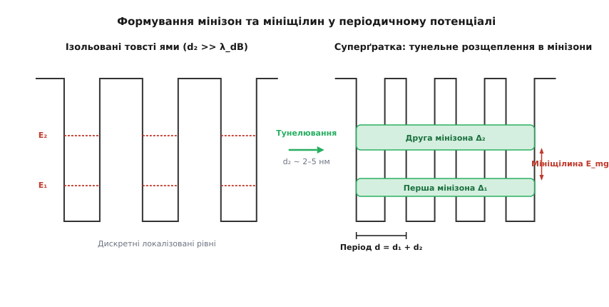
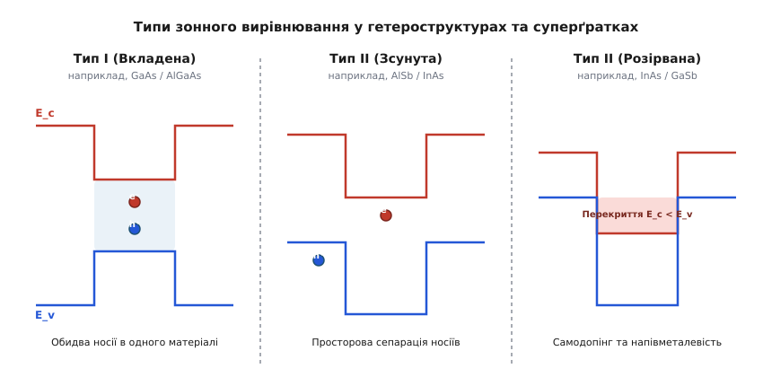
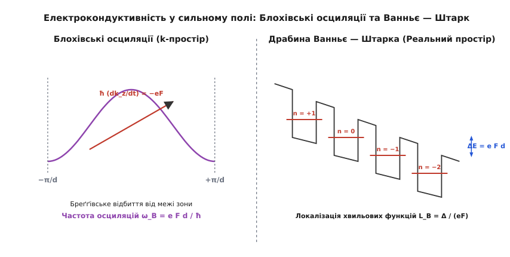
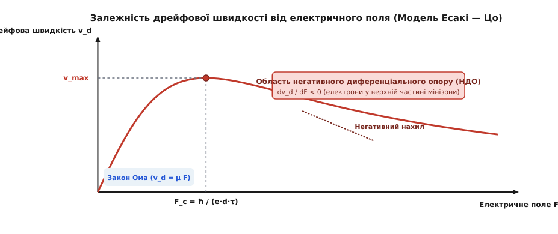

# Напівпровідникові суперґратки

<preknowlist>
- [Зонна теорія напівпровідників](topic:ph-condensed/semiconductor) — зонна структура кристалів, енергетичні щілини, зони провідності та валентні зони.
- [Дрейф електронів і рухливість носіїв](topic:ph-condensed/electron-drift) — час вільного пробігу, розсіювання на фононах та насичення дрейфової швидкості.
- [PN-перехід і гетероструктури](topic:ph-condensed/pn-junction) — енергетичні бар'єри, розриви зон та квантово-розмірне обмеження носіїв.
- [Циклотронний резонанс](topic:ph-quantum/cyclotron-resonance) — тензор ефективної маси та динаміка заряджених частинок у періодичних полях.
</preknowlist>

Коли довжина вільного пробігу електрона у напівпровідниковому кристалі перевищує кілька нанометрів, стандартний опис носіїв за допомогою фундаментальної зонної структури монокристала виявляється недостатнім для керування їхнім транспортом у високих електричних полях. У звичайному арсеніді галію (`GaAs`) або кремнії (`Si`) кристалічний потенціал повторюється з періодом атомної ґратки `a₀ ≈ 0.5 нм`, формуючи широку зону провідності заввишки у кілька електронвольт. Під дією зовнішнього електричного поля понад `10⁴ В/см` електрони інтенсивно розсіюються на оптичних фононах, а їхня дрейфова швидкість жорстко обмежується величиною насичення `v_{sat} ≈ 10⁷ см/с`. Для подолання цієї фундаментальної межі фізика конденсованого стану застосовує концепцію штучного періодичного потенціалу: періодичне чергування ультратонких шарів двох різних напівпровідників із періодом `d ≈ 5–10 нм`, що перетворює вихідний кристал на **напівпровідникову суперґратку**.

Суперґратка радикально трансформує електронний енергетичний спектр. Оскільки період суперґратки `d` у 10–20 разів перевищує період природної кристалічної ґратки `a₀`, у k-просторі виникає нова, значно вужча зона Бріллюена з межами `k_z = ± π / d`. Ця додаткова періодичність розщеплює широкі дозволені зони вихідних матеріалів на послідовність вузьких енергетичних підзон — **мінізон** (*minibands*), відокремлених **мініщілинами** (*minigaps*). Ширину мінізон `Δ ~ 10–100 меВ` та енергетичні зазори між ними можна прецизійно налаштовувати ще під час вирощування структури, змінюючи товщини шарів та хімічний склад матеріалів. Це відкриває можливість конструювати носії з наперед заданими динамічними властивостями, аж до створення ефектів негативної ефективної маси, блохівських осциляцій та генерації високочастотного випромінювання.

---

### Фізичні передумови та формування мінізонного спектра

Штучний періодичний потенціал суперґратки створюється шляхом послідовного вирощування гетероструктур із двох або більше напівпровідників (наприклад, `GaAs` та `Al_x Ga_{1-x} As`) з різними ширинами забороненої зони. Розрив дна зони провідності `ΔE_c` та верху валентної зони `ΔE_v` на межах розділу шарів формує одновимірний прямокутний потенціальний рельєф `V(z) = V(z + d)` вздовж осі росту `z`.

Для фундаментального розуміння процесу розглянемо граничний перехід від ізольованих квантових ям до тунельно-зв'язаної періодичної структури:

1. **Ізольовані ями:** При товстих бар'єрах (`d_2 >> 10 нм`) тунелювання електронів між сусідніми ямами практично відсутнє. Електронні хвильові функції повністю локалізовані всередині кожної ями. Енергетичний спектр складається з наборів дискретних рівнів розмірного квантування `E_1, E_2, \ldots`, енергії яких визначаються глибиною та шириною прямокутної ями `d_1`. Кожен такий рівень є квантово-механічно виродженим за кількістю ям у структурі.

2. **Формування мінізон:** Якщо товщину потенціального бар'єра зменшити до величини `d_2 ≈ 1–3 нм`, що співрозмірна з довжиною згасання підбар'єрної хвильової функції `1/β = ℏ / √(2 m* (V_0 - E))`, хвильові функції сусідніх ям починають суттєво перекриватися. Квантово-механічне тунелювання знімає виродження: кожен дискретний рівень розщеплюється у безперервну підзону — мінізону шириною `Δ`.

Математичний опис цього процесу у наближенні сильного зв'язку переконливо показує, як тунельний інтеграл перекриття визначає ширину мінізони [🧮 Математичний вивід зонної структури та формули Есакі — Цо](topic:ph-condensed/superlattice/math-miniband-kronig-penney.md). Закон дисперсії для носіїв у першій мінізоні суперґратки описується косинусоїдальною залежністю:

```
E(k_z) = E_0 - (Δ / 2) · cos(k_z · d)                [дисперсія Есакі — Цо]
```

де `k_z` — хвильовий вектор носія уздовж осі росту суперґратки.


*Рис. 1. Еволюція енергетичного спектра від ізольованих квантових ям до тунельно-зв'язаних мінізон та мініщілин суперґратки.*

Ширина мінізони `Δ` спадає експоненціально зі збільшенням товщини бар'єра `d_2` та зростанням висоти бар'єра `V_0`. Налаштовуючи геометрію шарів, інженери можуть змінювати ширину мінізони від десятих часток міліелектронвольта (ізольований режим) до сотен міліелектронвольт (режим вільного тунельного руху).

Важливо підкреслити анізотропний характер електронного руху у суперґратці. У той час як вздовж осі росту `z` рух електрона описується вузькою мінізоною з законом дисперсії `E(k_z)`, у площині шарів `(x, y)` періодичний потенціал відсутній, і електрон рухається як вільна частинка з ефективною масою вихідного напівпровідника `m*_\perp`:

```
E(k_x, k_y, k_z) = ℏ² · (k_x² + k_y²) / (2 · m*_\perp)  +  E_0 - (Δ / 2) · cos(k_z · d)
```

У результаті ізоенергетичні поверхні Фермі або дна зони провідності у суперґратках мають форму сплюснутих еліпсоїдів або відкритих гофрованих циліндрів. Це робить електронний газ у суперґратках квазідвовимірним.

Анізотропія закону дисперсії безпосередньо позначається на електронній густині станів `g(E)`. На відміну від суцільного тривимірного кристала, де густина станів зростає за коренєвим законом `g(E) ∝ √(E)`, у суперґратці густина станів у межах мінізони описується східчастою залежністю з ванхововськими особливостями на межах мінізони (`E = E_0 ± Δ/2`). Це різко підвищує селективність оптичного поглинання та підсилення.

---

### Класифікація суперґраток за типом зонного вирівнювання

Залежно від хімічного складу матеріалів шарів та взаємного розташування країв енергетичних зон `E_c` та `E_v` на гетероінтерфейсах, напівпровідникові суперґратки поділяють на чотири фундаментальні класи.


*Рис. 2. Схеми енергетичних зон та просторового вирівнювання у гетероструктурах різного типу.*

#### 1. Складникові суперґратки Типу I (Вкладені)
У суперґратках Типу I (найяскравіший приклад — `GaAs / Al_x Ga_{1-x} As`) вужча заборонена зона одного матеріалу (`GaAs`) повністю лежить всередині ширшої забороненої зони іншого матеріалу (`AlGaAs`). Дно зони провідності `E_c` у шарі `GaAs` розташоване нижче, а верх валентної зони `E_v` — вище, ніж у сусідньому шарі. 

У результаті квантові ями як для електронів, так і для дірок формуються в одному й тому самому шарі. Електрони та дірки просторово локалізовані разом, що забезпечує високий інтеграл перекриття їхніх хвильових функцій та високу ймовірність випромінювальної рекомбінації. Саме суперґратки Типу I є базовими для світлодіодів, напівпровідникових лазерів та квантових ям.

#### 2. Суперґратки Типу II (Зсунуті та розірвані)
У суперґратках Типу II потенціальні ями для електронів та дірок знаходяться у різних шарах. Цей клас додатково поділяють на дві підкатегорії:
- **Зсунута зона (Staggered / Type II-A):** Прикладом є гетеропара `AlSb / InAs`. Дно зони провідності `InAs` лежить нижче дна зони провідності `AlSb` (потенціальна яма для електронів у `InAs`), але верх валентної зони `AlSb` знаходиться вище, ніж у `InAs` (потенціальна яма для дірок у `AlSb`). Електрони та дірки просторово розділені по сусідніх шарах, що суттєво збільшує час життя випромінювальної рекомбінації.
- **Розірвана зона (Broken-gap / Type II-B):** Унікальна система `InAs / GaSb`. Дно зони провідності `InAs` розташоване **нижче** за верх валентної зони `GaSb` на величину `ΔE ≈ 0.15 еВ`. Оскільки енергетичні рівні валентної зони `GaSb` виявляються вищими за рівні зони провідності `InAs`, відбувається спонтанний перетік електронів із валентної зони `GaSb` у зону провідності `InAs` навіть за відсутності зовнішнього збудження. Це створює сумісний двовимірний електронний та дірковий газ безпосередньо на гетеромежі, надаючи структурі напівметалевих властивостей.

#### 3. Дираківські суперґратки Типу III
Утворені комбінацією нормального напівпровідника з широкою забороненою зоною (`CdTe`) та безщілинного напівпровідника з інвертованою зонною структурою (`HgTe`). На інтерфейсі `HgTe / CdTe` відбувається перехід від топологічно тривіальної до інвертованої зони, що призводить до виникнення безмасових дираківських станів із лінійним законом дисперсії.

#### 4. Леговані суперґратки (n-i-p-i суперґратки)
На відміну від складникових суперґраток, `n-i-p-i` структури вирощуються з одного й того самого напівпровідника (наприклад, чистого `GaAs`), але з періодичною зміною типу легування: донорний шар (`n`), нелегований інтринсивний шар (`i`), акцепторний шар (`p`) та знову інтринсивний шар (`i`).

Просторове розділення іонізованих донорів `N_d^+` та акцепторів `N_a^-` створює періодичний електростатичний потенціал, який згинає зони провідності та валентності у протилежних напрямках. Головна особливість `n-i-p-i` суперґраток полягає у тому, що амплітуду потенціального рельєфу та ефективну ширину забороненої зони можна динамічно налаштовувати за допомогою зовнішньої напруги або оптичного освітлення (генеровані фотоносії екранують об'ємний заряд і випрямляють зони).

---

### Динаміка носіїв у сильних полях: Блохівські осциляції та драбина Ванньє — Штарка

Найбільш видовищні квантові транспортувальні ефекти у суперґратках виникають при накладанні сильного однорідного електричного поля `F` уздовж осі росту структури. Історію боротьби вчених за експериментальне спостереження цих явищ викладено у матеріалі [📜 Історія виникнення ідеї суперґраток Есакі та Цо](topic:ph-condensed/superlattice/hist-esaki-tsu.md).

#### Блохівські осциляції
Згідно з напівкласичним рівнянням руху, під дією сталого електричного поля `F` квазіімпульс електрона змінюється лінійно у часі:

```
ℏ · (dk_z / dt) = - e · F                            [рівняння руху квазіімпульсу]
k_z(t) = k_z(0) - (e · F · t / ℏ)                     [лінійне зростання імпульсу]
```

У звичайному монокристалі електрон розсіюється на фононах за час `τ ~ 10⁻¹³ с`, не встигаючи пройти й малої частки великої зони Бріллюена. Проте у суперґратці перша зона Бріллюена є дуже вузькою (`-π/d ≤ k_z ≤ π/d`). Якщо електричне поле достатньо сильне, електрон без розсіювання досягає межі зони `k_z = -π/d`.

На межі зони Бріллюена відбувається бреґґівське відбиття електронної хвилі: стан з імпульсом `k_z = -π/d` еквівалентний стану `k_z = +π/d`. Змінивши напрямок группової швидкості `v_z = (1/ℏ) · (∂E / ∂k_z)` на протилежний, електрон починає гальмуватися, повертається до дна зони і повторює рух. У результаті замість монотонного дрейфу електрон здійснює періодичні **блохівські осциляції** у реальному та імпульсному просторах.


*Рис. 3. Блохівські осциляції у k-просторі та квантування Ванньє — Штарка у реальному просторі суперґратки.*

Фундаментальна частота Блохівських осциляцій `ω_B` залежить виключно від напруженості поля та періоду суперґратки:

```
ω_B = e · F · d / ℏ                                   [частота блохівських осциляцій]
```

Амплітуда просторових осциляцій електрона у реальному просторі дорівнює:

```
z_B = Δ / (2 · e · F)                                 [амплітуда блохівських осциляцій]
```

Для спостереження незатухаючих Блохівських осциляцій має виконуватися критерій чистого квантового транспорту: електрон повинен зробити принаймні один повний оберт до моменту акту розсіювання, тобто `ω_B · τ > 1`. Для суперґратки з періодом `d = 6 нм` та часом релаксації `τ = 0.5 пс` критичне поле становить `F_c ≈ 2 · 10⁴ В/см`, а частота осциляцій потрапляє у терагерцовий діапазон (`f_B = ω_B / 2π ≈ 1.5 ТГц`).

#### Драбина Ванньє — Штарка
У суто квантовому описі накладання стаціонарного поля `F` додає до періодичного потенціалу суперґратки лінійний нахил `V_{ext}(z) = -e · F · z`. Це руйнує трансляційну симетрію структури і призводить до того, що безперервна мінізона розпадається на послідовність просторово локалізованих квантових станів — **драбину Ванньє — Штарка**.

Енергетичний спектр рівнів драбини Ванньє — Штарка є повністю еквідістантним:

```
E_n = E_0 + n · e · F · d                             [рівні драбини Ванньє — Штарка]
```

де `n = 0, ±1, ±2`. Кожна хвильова функція `ψ_n(z)` локалізована поблизу `n`-ї квантової ями суперґратки з просторовою довжиною локалізації:

```
L_B = Δ / (e · F)                                     [довжина локалізації Ванньє — Штарка]
```

При низьких полях (`e · F · d < Δ`) довжина локалізації `L_B` охоплює багато періодів, і стани перекриваються, утворюючи мінізону. При високих полях (`e · F · d > Δ`) довжина локалізації стає меншою за період суперґратки (`L_B < d`), хвильові функції стають повністю локалізованими в окремих ямах, а тунельний транспорт між сусідніми ямами пригнічується (ефект Штарківської локалізації).

При квантовому описі міжпідзонних оптичних переходів між рівнями Ванньє — Штарка у спектрах електропоглинання спостерігаються розщеплені спектральні лінії:
- **Центральна лінія (`n = 0`):** Перехід усередині тієї самої ями (енергія фотона `ℏ ω = E_g`).
- **Блакитні сателіти (`n > 0`):** Переходи із квантовим стрибком електрона на `n` ям вгору за потенційним нахилом (`ℏ ω = E_g + n e F d`).
- **Червоні сателіти (`n < 0`):** Переходи зі стрибком електрона на `n` ям вниз (`ℏ ω = E_g - n e F d`).

---

### Вольт-амперна характеристика Есакі — Цо та негативний диференціальний опір

Особливості зонної структури мінізон безпосередньо відображаються на макроскопічному електричному транспорті суперґратки. Опис розрахунку транспорту методом Монте-Карло деталізовано у практичному розділі [⚙️ Симуляція блохівських осциляцій та негативного диференціального опору](topic:ph-condensed/superlattice/proj-bloch-oscillator-sim.md).

Залежність середньої дрейфової швидкості електронів `v_d` від прикладеного поля `F` у моделі Есакі — Цо описується виразом:

```
v_d(F) = v_max · ( 2 · (F / F_c) / ( 1 + (F / F_c)² ) )  [формула транспорту Есакі — Цо]
```

де критичне поле `F_c = ℏ / (e · d · τ)`, а пикова швидкість `v_max = Δ · d / (4 · ℏ)`.


*Рис. 4. Вольт-амперна характеристика Есакі — Цо із ділянкою негативного диференціального опору.*

Вольт-амперна характеристика суперґратки чітко розпадається на дві фазові області:

1. **Омічна область (`F < F_c`):** При слабких полях електричне поле лише трохи зміщує центр розподілу електронів від дна мінізони. У цій зоні ефективна маса позитивна (`m*_z > 0`), дрейфова швидкість зростає лінійно з полем за законом Ома: `v_d = μ_0 · F`, де рухливість носіїв `μ_0 = e · d² · Δ · τ / (2 · ℏ²)`.
2. **Область негативного диференціального опору (НДО, `F > F_c`):** Коли поле перевищує критичне значення `F_c`, електрони прискорюються настільки швидко, що досягають верхньої половини мінізони (`k_z > π / 2d`) раніше, ніж зазнають розсіювання. У цій області ефективна маса носіїв стає **негативною** (`m*_z < 0`). Електричне поле почне гальмувати такі електрони замість прискорення! 

У результаті при зростанні напруги струм крізь суперґратку починає спадати (`d v_d / d F < 0`). Виникає ефект **негативного диференціального опору** (НДО). Негативний диференціальний опір є незамінним для створення високочастотних автогенераторів та підсилювачів електромагнітних коливань терагерцового діапазону.

#### Електрична доменна нестійкість:
У режимі негативного диференціального опору однорідний розподіл електричного поля у суперґратці стає нестійким. Випадкове локальне зростання концентрації електронів призводить до розшарування структури на високопольові та низькопольові електричні домени (домени Ганна). 

У високопольовому домені електрони локалізовані у станах Ванньє — Штарка, а транспорт між доменами відбувається за рахунок послідовного резонансного тунелювання між різними рівнями драбини Ванньє — Штарка. Це призводить до виникнення пилоподібних осциляцій струму та високочастотної генерації.

---

### Практичне застосування та наноінженерія суперґраток

Сучасні епітаксійні технології (молекулярно-променева епітаксія MBE та газофазна епітаксія MOCVD) дозволяють вирощувати суперґратки з точністю до одного атомарного шару. Детальні технологічні карти та специфікації матеріалів наведено у матеріалі [📋 Специфікація епітаксійного вирощування та параметри квантово-каскадних структур](topic:ph-condensed/superlattice/api-superlattice-growth.md).

Унікальні фізичні властивості суперґраток знайшли застосування у ключових галузях наноелектроніки та фотоніки:

#### 1. Квантово-каскадні лазери (QCL)
Найважливіше практичне застосування суперґраток. У QCL генерація світла відбувається не за рахунок міжзонних переходів електронів із зони провідності у валентну зону, а за рахунок **міжпідзонних переходів** усередині зони провідності спеціально спроектованої суперґратки.

Один електрон, рухаючись уздовж послідовності потенціальних ям під дією зовнішньої напруги, послідовно проходить крізь 50–100 каскадів активних областей, випромінюючи фотон на кожному ступені. Змінюючи товщини шарів суперґратки, інженери можуть змінювати енергетичну відстань між мінізонами та плавно налаштовувати довжину хвилі випромінювання від середнього інфрачервоного (`3 мкм`) до далекого терагерцового діапазону (`300 мкм`). QCL широко використовуються у газоаналізі, екологічному моніторингу та медичній діагностиці.

#### 2. Матричні фотодетектори інфрачервоного діапазону (Type-II Superlattice Photodetectors)
Суперґратки Типу II на основі `InAs / GaSb` стали головною альтернативою токсичним та нестабільним кристалам `CdHgTe` у тепловізорах та космічних фотоприймачах.

Завдяки розірваному зонному перекриттю у суперґратках `InAs / GaSb` ефективна ширина забороненої зони може регулюватися у діапазоні від `0.3 еВ` до `0.03 еВ`, що відповідає довжинам хвиль від `3 мкм` до `30 мкм` (далекий ІЧ-діапазон). При цьому велика ефективна маса дірок суттєво пригнічує тунельні струми витоку, підвищуючи робочу температуру фотодетекторів.

#### 3. Терагерцові генератори на блохівських осциляціях
Завдяки частоті Блохівських осциляцій `ω_B ~ 1–10 ТГц` суперґратки виступають природними компактними твердотільними джерелами терагерцового випромінювання. Вони заповнюють так звану «терагерцову прогалину» (*THz gap*) між високочастотною мікрохвильовою електронікою та оптичними лазерами.

Контроль квантових мінізон у напівпровідникових суперґратках є видатним прикладом того, як фундаментальні квантово-механічні ефекти розмірного квантування та тунелювання дозволяють створювати матеріали із заданими фізичними властивостями, недосяжними у природних кристалах.
