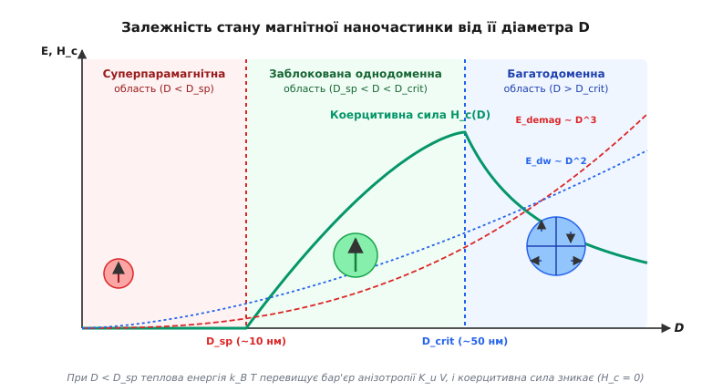
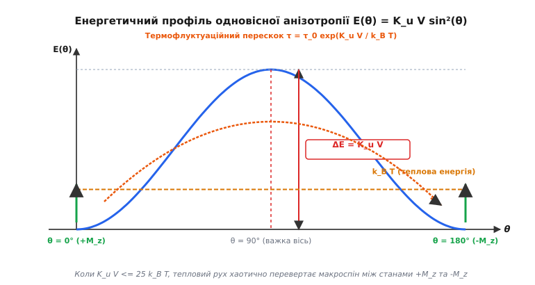
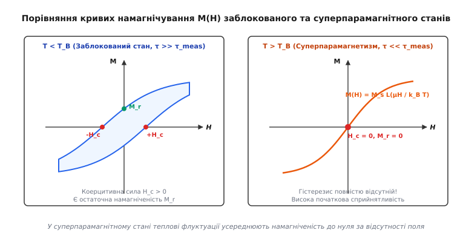
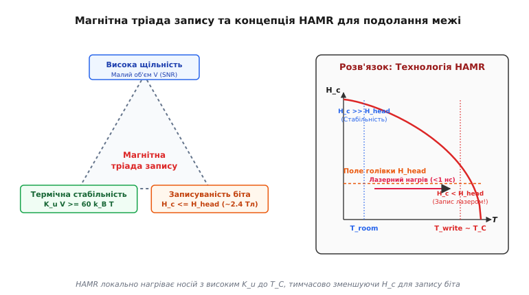

# Суперпарамагнетизм та суперпарамагнітна межа

<preknowlist>
- [Феромагнетизм](root:ph-condensed/ferromagnetism) — спонтанна намагніченість та магнітна анізотропія у впорядкованому стані спінів.
- [Температура Кюрі](root:ph-condensed/curie-temperature) — тепловий фазовий перехід між феромагнітним та парамагнітним станами.
- [Магнітні домени](root:ph-condensed/magnetic-domains) — структура доменних стінок та мінімізація магнітостатичної енергії.
- [Насичення та гістерезис](root:ph-condensed/saturation-hysteresis) — петля гістерезису, коерцитивна сила та залишкова намагніченість.
</preknowlist>

Зменшення фізичних розмірів феромагнітного кристала до нанометрового масштабу кардинально змінює його магнітну структуру та термодинамічну поведінку. У масивних феромагнетиках спонтанна намагніченість зафіксована внутрішньою кристалографічною анізотропією, що створює стійку коерцитивну силу та залишкову намагніченість, розділяючи матеріал на домени. Однак при досягненні нанометрових розмірів об'єм кристала стає настільки мікроскопічним, що енергетичний бар'єр утримання магнітного моменту порівнюється з тепловою енергією навколишнього середовища. 

У цьому режимі макроскопічний спіновий момент частинки починає спонтанно флуктуювати, хаотично змінюючи свій напрямок між легкозначущими осями анізотропії зі частотою у мільйони перевертань за секунду. Цей фізичний стан називається суперпарамагнетизмом. Він перетворює однодоменну феромагнітну наночастинку на безгістерезисний парамагніт із гігантським магнітним моментом. Суперпарамагнетизм визначає фундаментальну межу максимальної щільності зберігання інформації у цифрових накопичувачах і водночас відкриває унікальні можливості для біомедичної діагностики та терапії.

## Перехід до однодоменності та концепція макроспіна

У макроскопічному феромагнітному кристалі спонтанна намагніченість прагне мінімізувати повну вільну магнітну енергію системи. Головним дестабілізуючим чинником виступає магнітостатична енергія розмагнічування `E_demag`, яка утворюється полюсами намагніченості на поверхні кристала й створює зовнішнє поле розмагнічування. Щоб зменшити цю енергію, кристал розділяється на безліч магнітних доменів — локальних областей із різними напрямками вектора намагніченості.

Однак поділ на домени вимагає формування доменних стінок (меж Блоха або Нееля), усередині яких атомні спіни вимушені плавно розвертатися від напрямку одного домену до напрямку сусіднього. Ширина доменної стінки `δ_w` визначається конкуренцією між обмінною взаємодією та анізотропією: `δ_w = π · √(A_ex / K_u)`. Утворення стінки супроводжується питомими енергетичними витратами `σ_w = 4 · √(A_ex · K_u)`, оскільки відхилення сусідніх спінів від паралельної орієнтації порушує обмінну взаємодію.

Масштабування цих двох енергетичних внесків залежно від характерного розміру (діаметра) частинки `D` має фундаментальну відмінність:
- Енергія доменної стінки `E_dw` пропорційна площі її перерізу, тобто масштабується пропорційно квадрату розміру: `E_dw ∝ D²`.
- Магнітостатична енергія розмагнічування `E_demag` пропорційна об'єму частинки, тобто масштабується пропорційно кубу розміру: `E_demag ∝ D³`.

При зменшенні розміру частинки `D` об'ємна енергія розмагнічування `E_demag` спадає значно швидше за поверхневу енергію доменної межі `E_dw`. При досягненні декількох десятків нанометрів виникає фізична межа, за якою енергетичні витрати на утворення навіть однієї доменної стінки перевищують увесь потенційний виграш від зменшення поля розмагнічування. 

Розмір частинки, нижче якого утворення доменної структури стає енергетично невигідним, називається критичним діаметром однодоменності `D_crit`. Зіставлення енергій дає аналітичний вираз для критичного діаметра сферичної частинки:

```
D_crit ≈ 9 · √(A_ex · K_u) / (μ0 · M_s²)
```

де `A_ex` — константа обмінної взаємодії (Дж/м), `K_u` — константа одновісної магнітної анізотропії (Дж/м³), `M_s` — намагніченість насичення матеріалу (А/м), а `μ0` — магнітна стала.

Для більшості феромагнітних матеріалів критичний діаметр однодоменності перебуває в діапазоні від 10 до 80 нанометрів. Наприклад, для чистого заліза `D_crit ≈ 14` нм, для кобальту `D_crit ≈ 70` нм, а для гексагонального фериту барію `D_crit ≈ 500` нм.

Для частинок несферичної (витягнутої) форми важливий внесок дає анізотропія форми, зумовлена різницею розмагнічувальних факторів вздовж короткої `N_x` та довгої `N_z` осей еліпсоїда обертання:

```
K_shape = (1/2) · μ0 · (N_x - N_z) · M_s²
```

Крім того, у наночастинках із високим співвідношенням поверхні до об'єму суттєво зростає роль поверхневої анізотропії `K_s`, спричиненої порушенням симетрії кристалічного оточення поверхневих атомів та наявністю окисленого шару. Ефективна константа анізотропії частинки діаметром `D` у цьому випадку описується феноменологічною формулою:

```
K_eff = K_v + (6 / D) · K_s
```

де `K_v` — об'ємна кристалографічна анізотропія. При зменшенні `D` нижче 5 нм саме поверхневий внесок `K_s` починає домінувати над об'ємним, змінюючи орієнтацію легких осей наночастинки та створюючи ефекти поверхневого спінового розвпорядкування (spin canting).

Усередині однодоменної частинки `(D < D_crit)` всі атомні спіни (від `10³` у нанокластерах до `10⁶` у наночастинках середнього розміру) жорстко зчеплені між собою потужною короткодіючою обмінною взаємодією. Внаслідок цього окремі атомні спіни втрачають індивідуальну свободу орієнтації й повертаються строго синхронно як єдине ціле. Така система описується наближенням макроспіна — велетенського векторного магнітного моменту частинки:

```
μ = M_s · V
```

де `V` — об'єм однодоменної частинки. Сумарний магнітний момент `μ` макроспіна може досягати від `10³` до `10⁵` магнетонів Бора (`μ_B`), що у тисячі разів перевищує момент окремого атома.


*Залежність магнітного стану однодоменної наночастинки та її коерцитивної сили H_c від діаметра D: перехід від багатодоменного стану до заблокованого однодоменного та суперпарамагнітного.*

Якщо розмір частинки лежить у діапазоні `D_sp < D < D_crit`, частинка перебуває у заблокованому однодоменному стані. У цьому режимі частинка демонструє максимально можливу коерцитивну силу `H_c`, оскільки її перемагнічування не може відбуватися шляхом легкого зсуву доменних стінок. Зміна напрямку намагніченості вимагає одночасного розвороту всього макроспіна проти сил кристалографічної та формової анізотропії. Проте при подальшому зменшенні діаметра частинки `(D < D_sp)` вирішальну роль починають відігравати теплові флуктуації.

## Термофлуктуації та релаксація Нееля — Брауна

Магнітна анізотропія однодоменної частинки задає енергетичний профіль, який залежить від орієнтації макроспіна відносно кристалографічних осей. У найпростішому й найпоширенішому випадку одновісної анізотропії існує одна вісь легкого намагнічування. Густина енергії анізотропії як функція кута `θ` між макроспіном та легкою віссю описується виразом:

```
E(θ) = K_u · V · sin²(θ)
```

Цей потенціальний профіль має два симетричні мінімуми у точках `θ = 0` (полярний стан `+M_z`) та `θ = π` (стан `-M_z`). Для того щоб макроспін перейшов з одного стійкого стану в інший, він повинен розвернутися через екваторіальну площину `θ = π/2` (важку вісь), подолавши потенціальний енергетичний бар'єр:

```
ΔE = K_u · V
```

Висота цього бар'єра пропорційна об'єму частинки `V`. У масивному матеріалі об'єм великий, тому потенціальний бар'єр `ΔE` перевищує теплову енергію `k_B · T` у десятки тисяч разів. У такому разі вектор намагніченості надійно зафіксований в одному з мінімумів, гарантуючи довготривалу стабільність феромагнітного стану.

Однак у наночастинці об'ємом `V ≈ 100` нм³ при кімнатній температурі (`T = 300` К, де `k_B · T ≈ 4.14 · 10⁻²¹` Дж) висота потенціального бар'єра `K_u · V` стає сумірною з енергією теплових хаотичних коливань атома. Теплові коливання кристалічної ґратки генерують стохастичні флуктуаційні поштовхи, які передаються спіновій системі через спін-фононну та спін-магнонну взаємодії.

Коли енергія чергового сплеску термофлуктуацій перевищує висоту бар'єра `ΔE`, макроспін частинки спонтанно перестрибує через важку вісь, змінюючи орієнтацію намагніченості на протилежну.


*Двоямовий потенційний профіль одновісної анізотропії E(θ) = K_u V sin²(θ) та схематичне зображення термофлуктуаційного перескоку макроспіна через бар'єр ΔE.*

Середній час перебування макроспіна в одному енергетичному мінімумі до спонтанного перевороту називається часом релаксації Нееля — Брауна `τ`. Для нульового зовнішнього магнітного поля він описується законами статистичної кінетики Крамерса — Нееля:

```
τ = τ_0 · exp(K_u · V / (k_B · T))
```

де `τ_0` — час спроби (attempt time), який дорівнює періоду гіромагнітної прецесії макроспіна у внутрішньому ефективному полі анізотропії `H_k = 2 · K_u / M_s`.

Фізик Вільям Фуллер Браун застосував апарат стохастичних диференціальних рівнянь Ланжевена та Фоккера — Планка до динаміки Ландау — Ліфшиця, встановивши суворий вираз для часового множника `τ_0`:

```
τ_0 = (M_s · (1 + α²)) / (2 · γ · α · K_u) · √(π · k_B · T / (K_u · V))
```

де `γ ≈ 1.76 · 10¹¹` рад/(с·Тл) — гіромагнітне співвідношення, а `α` — безрозмірний коефіцієнт згасання Ґільберта (типово `0.01`–`0.1`).

Для переважної більшості феромагнітних наноматеріалів при кімнатній температурі величина `τ_0` перебуває у вузькому діапазоні від `10⁻¹¹` до `10⁻⁹` секунди. 

Наявність експоненціальної залежності у формулі Нееля — Брауна означає, що час релаксації `τ` змінюється на десятки порядків при найменшій зміні розміру частинки або температури:
- При `K_u · V = 10 · k_B · T`: `τ = 10⁻⁹ · exp(10) ≈ 22` наносекунди. Намагніченість флуктуює миттєво.
- При `K_u · V = 25 · k_B · T`: `τ = 10⁻⁹ · exp(25) ≈ 720` секунд (близько 12 хвилин).
- При `K_u · V = 40 · k_B · T`: `τ = 10⁻⁹ · exp(40) ≈ 2.35` доби.
- При `K_u · V = 60 · k_B · T`: `τ = 10⁻⁹ · exp(60) ≈ 1.14 · 10¹⁷` секунд (понад `3.6` мільярда років!). Намагніченість заморожена на геологічні проміжки часу.

Якщо до наночастинки прикладено зовнішнє магнітне поле `H`, спрямоване під кутом `θ` до легкої осі, енергетичний профіль стає асиметричним. Потенціальний бар'єр для перескоку за напрямком поля зменшується, а проти поля — зростає:

```
ΔE(H) = K_u · V · (1 - H / H_k)²
```

Це призводить до того, що ймовірності перескоку в протилежні боки стають неоднаковими, і ансамбль наночастинок набуває переважної намагніченості вздовж поля. Математичні деталі стохастичного рівняння Фоккера — Планка, виведення коефіцієнта Брауна та аналіз кінетики заселеності енергетичних ям винесено у вставку [виведення часу релаксації Нееля — Брауна та функції Ланжевена](root:ph-condensed/superparamagnetism/math-neel-brown-relaxation.md).

## Стан блокування, температура блокування T_B та термодинаміка

Магнітна поведінка ансамблю однодоменних наночастинок істотно залежить від часу спостереження або вимірювання `τ_meas`, який визначається часовою роздільною здатністю експериментального приладу. Наприклад, для SQUID-магнітометра чи VSM час вимірювання становить `τ_meas ≈ 100` секунд; для спектроскопії Мессбауера `τ_meas ≈ 10⁻⁸` с; для високочастотної голівки зчитування жорсткого диска `τ_meas ≈ 1` нс.

Залежно від співвідношення між часом релаксації Нееля — Брауна `τ` та часом вимірювання `τ_meas` розрізняють два фундаментальні фізичні стани:

### 1. Заблокований стан (Blocked State): τ ≫ τ_meas
Коли час релаксації наночастинки значно перевищує час вимірювання приладу, теплові флуктуації не встигають розвернути макроспін за період спостереження. Для даного експерименту частинка поводиться як стандартний феромагнетик: вона зберігає залишкову намагніченість `M_r` та демонструє відкриту петлю гістерезису з коерцитивною силою `H_c > 0`.

### 2. Суперпарамагнітний стан (Superparamagnetic State): τ ≪ τ_meas
Коли час релаксації набагато менший за час вимірювання, макроспін частинки встигає хаотично перевернутися між протилежними напрямками мільйони разів за один вимірювальний цикл. Усереднена за часом спостереження результуюча намагніченість ансамблю частинок за відсутності зовнішнього поля дорівнює нулю:

```
⟨M⟩_t = 0
```

У результаті залишкова намагніченість `M_r` та коерцитивна сила `H_c` повністю зникають (`H_c = 0`, `M_r = 0`). Петля гістерезису вироджується в єдину безгістерезисну криву намагнічування.


*Порівняння кривих намагнічування M(H): відкрита петля гістерезису у заблокованому стані (T < T_B) та безгістерезисна крива Ланжевена у суперпарамагнітному стані (T > T_B).*

За наявності зовнішнього магнітного поля `H` хаотичний тепловий рух макроспінів орієнтується уздовж вектора поля. Оскільки магнітний момент кожної частинки `μ = M_s · V` надзвичайно великий (`10³`–`10⁵ μ_B`), результуюча намагніченість ансамблю описується класичною функцією Ланжевена `L(x)`:

```
M(H) = N · μ · (coth(μ0 · μ · H / (k_B · T)) - (k_B · T / (μ0 · μ · H)))
```

де `N` — концентрація наночастинок в одиниці об'єму.

У слабких полях (`μ0 · μ · H ≪ k_B · T`) розклад функції Ланжевена `L(x) ≈ x / 3` дає початкову магнітну сприйнятливість суперпарамагнетика `χ_sp`:

```
χ_sp = (dM / dH)[H->0] = μ0 · N · M_s² · V² / (3 · k_B · T)
```

Зверніть увагу на квадрат об'єму `V²` у чисельнику: завдяки цьому суперпарамагнетики демонструють велетенську початкову сприйнятливість, виходячи на магнітне насичення `M_sat = N · M_s · V` у слабких полях порядку сотень Ерстед при кімнатній температурі.

Фізична межа між заблокованим та суперпарамагнітним станами визначається температурою блокування `T_B`. Це температура, при якій час релаксації Нееля — Брауна точно дорівнює часу вимірювання `τ(T_B) = τ_meas`:

```
T_B = K_u · V / (k_B · ln(τ_meas / τ_0))
```

Для стандартного квазістатичного магнітного вимірювання (`τ_meas ≈ 100` с, `τ_0 ≈ 10⁻⁹` с) логарифмічний фактор `ln(100 / 10⁻⁹) = ln(10¹¹) ≈ 25.3`. Звідси отримуємо класичне практичне співвідношення:

```
K_u · V ≈ 25 · k_B · T_B
```

При температурі нижче температури блокування `(T < T_B)` коерцитивна сила спадає зі зростанням температури за температурним законом Шаррока:

```
H_c(T) = H_c0 · [1 - (T / T_B)^(1/2)]
```

де `H_c0 ≈ 0.96 · K_u / M_s` — коерцитивна сила ізольованої частинки при абсолютному нулю `0 K`. При `T = T_B` коерцитивна сила звертається в нуль і матеріал переходить у суперпарамагнітний стан.

Експериментально температуру блокування визначають за допомогою вимірювань намагніченості у режимах охолодження в нульовому полі (ZFC — Zero-Field-Cooled) та охолодження у полі (FC — Field-Cooled). У процедурі ZFC зразок охолоджують від високої температури до кріогенної за відсутності магнітного поля, після чого прикладають слабке вимірювальне поле `H` і знімають криву `M_ZFC(T)` при нагріванні. При низьких температурах частинки заблоковані з хаотичною орієнтацією, тому намагніченість мала. При нагріванні тепловий рух вивільняє макроспіни, і `M_ZFC(T)` зростає, досягаючи максимуму точно при `T = T_B`. При надалі зростанні температури `M(T)` спадає за законом Ланжевена `~ 1/T`.

У режимі FC зразок охолоджують безпосередньо у вимірювальному полі `H`. Нижче `T_B` макроспіни частинок заморожуються уздовж напрямку поля, тому крива `M_FC(T)` залишається високою та монотонно зростає при зниженні температури. Точка розходження кривих ZFC та FC виокремлює температуру блокування найкрупніших частинок у полідисперсному ансамблі.

Крім постійного поля, важливу інформацію дає динамічна сприйнятливість у змінному полі `χ(ω) = χ'(ω) - i · χ"(ω)`. Уявна частина сприйнятливості `χ"(ω)` описує дисипативні втрати й демонструє чіткий резонансний пік при виконанні умови `ω · τ(T) = 1`, що дозволяє визначати розподіл часів релаксації наночастинок.

Історію створення цієї теорії, наукову дискусію між Неелєм та Брауном та походження терміна «суперпарамагнетизм» у працях Біна та Якобса винесено у вставку [історії відкриття суперпарамагнетизму та теорії релаксації Нееля — Брауна](root:ph-condensed/superparamagnetism/hist-neel-brown.md).

## Суперпарамагнітна межа магнітного запису (Superparamagnetic Limit)

Найважливішим прикладної та технологічним проявом суперпарамагнетизму є фундаментальне обмеження на максимальну щільність магнітного запису інформації у жорстких дисках (HDD).

Цифрова інформація на дисковому носії зберігається у вигляді прямокутних бітових осередків, намагнічених у протилежних напрямках. Для забезпечення високого відношення сигнал/шум (SNR) під час індукційного або magnetoresistive зчитування кожен бітовий осередок формується з масиву дрібних магнітних зерен (`N_grains ≈ 15`–`30` зерен на один біт). Відношення сигнал/шум середовища масштабується за статистичним законом:

```
SNR ∝ √(N_grains)
```

Щоб збільшити щільність запису (вимірювану в Гбіт/дюйм² або Тбіт/дюйм²), необхідно зменшувати площу бітового осередку. Оскільки зменшувати кількість зерен `N_grains` нижче 15 неможливо через стрімке зростання медиа-шуму та помилок зчитування, єдиним фізичним шляхом збільшення щільності є зменшення об'єму кожного окремого зерна `V`.

Однак зменшення об'єму зерна `V` викликає деструктивну дію закону Нееля — Брауна. Коли об'єм зменшується настільки, що бар'єр анізотропії зерна `K_u · V` стає порівнянним з тепловою енергією `k_B · T`, час релаксації `τ` падає від десятиліть до днів чи секунд. Звичайні теплові флуктуації при кімнатній температурі спонтанно перевертають намагніченість зерен, самочинно руйнуючи записану інформацію. Цей фізичний ліміт називається суперпарамагнітною межею запису.

### Магнітна тріада запису (Magnetic Recording Trilemma)

Проблема суперпарамагнітної межі формує жорстке тристороннє технологічне протиріччя, відоме як магнітна тріада запису:

1. **Щільність запису (Signal-to-Noise Ratio)**: Вимагає зменшення об'єму магнітного зерна `V`.
2. **Термічна стабільність (Thermal Stability)**: Вимагає збереження високого бар'єра анізотропії `K_u · V ≥ 60 · k_B · T` (для забезпечення часу збереження даних `τ ≥ 10` років). При зменшенні об'єму `V` єдиним способом зберегти термічну стабільність є застосування матеріалів із високою константою анізотропії `K_u`.
3. **Записуваність (Writeability)**: Щоб перезаписати біт у матеріалі з високим `K_u`, магнітна голівка повинна створити коерцитивне поле `H_write`, що перевищує поле анізотропії `H_k = 2 · K_u / M_s`. Проте максимальне поле запису магнітної голівки фундаментально обмежене індукцією насичення найкращих сплавів заліза та кобальту (`FeCo`): `μ0 · H_write,max ≈ 2.4` Тесла.


*Схема трикутника магнітної тріади запису (щільність, стабільність, записуваність) та її розв'язання за допомогою технології HAMR.*

Для традиційних носіїв поздовжнього магнітного запису (сплави `CoCrPt` з `K_u ≈ 2 · 10⁵` Дж/м³) суперпарамагнітна межа настала на рівні близько `100` Гбіт/дюйм² у 2005 році. Подальше зменшення розміру зерен робило накопичувачі непридатними для надійного зберігання даних.

> 🔧 **Навіщо це.**
> Розуміння суперпарамагнітної межі є основою проективання всіх сучасних систем зберігання даних великої ємності. Без подолання цього фізичного ліміту ємність 3.5-дюймового жорсткого диска назавжди зупинилася б на позначці `100` Гігбайт. Завдяки фізичному управлінню анізотропією `K_u` та наноструктуруванню матеріалів сучасні HDD досягають ємностей понад `30` Терабайт на один корпус, забезпечуючи роботу інфраструктури хмарних дата-центрів.

## Технологічні шляхи подолання суперпарамагнітної межі

Щоб розірвати трикутник магнітної тріади й продовжити масштабування ємності накопичувачів, фізика конденсованого стану та магнітна наноінженерія розробили серію послідовних інноваційних рішень.

### 1. Перпендикулярний магнітний запис (PMR — Perpendicular Magnetic Recording)
Першим технологічним проривом у 2005 році став перехід від поздовжньої орієнтації векторів намагніченості (у площині диска) до перпендикулярної (вектори `M` спрямовані строго перпендикулярно до поверхні диска). 

Це дозволило:
- Використовувати товстіші магнітні шари при збереженні малої поверхневої площі біта, що підвищило фізичний об'єм зерна `V`.
- Інтегрувати м'який магнітний підшар (SUL — Soft Underlayer) безпосередньо під тонким інформаційним шаром `CoCrPt-SiO₂`. Підшар працює як магнітне дзеркало для потоку голівки запису, що подвоїло амплітуду ефективного поля запису `H_write` майже до `2.2` Тл.

Завдяки PMR суперпарамагнітна межа була відсунута до `1` Тбіт/дюйм².

### 2. Матеріали з екстремальною анізотропією (L1₀-FePt)
Для подальшого зменшення середнього розміру зерна до `3`–`4` нанометрів вимагається застосування матеріалів із надвисокою магнітною анізотропією. Найкращим кандидатом є хімічно впорядкована тетрагональна фаза `L1₀-FePt`, яка володіє константою анізотропії `K_u ≈ 7 · 10⁶` Дж/м³ (у `28` разів вище за `CoCrPt`).

Зерно `FePt` об'ємом всього `15` нм³ (`D ≈ 3` нм) гарантує фактор стабільності `K_u · V / (k_B · T) > 60`, зберігаючи записаний біт понад 100 років. Однако коерцитивне поле такого матеріалу при кімнатній температурі сягає `H_k ≈ 4`–`5` Тесла, що робить його неможливим для запису звичайною магнітною голівкою.

### 3. Термомагнітний запис (HAMR — Heat-Assisted Magnetic Recording)
Технологія HAMR розв'язує проблему запису в суперстабільні носії `L1₀-FePt` шляхом локального лазерного нагріву матеріалу безпосередньо в момент запису біта.

Фізичний принцип HAMR спирається на стрімке спадання анізотропії `K_u(T)` та коерцитивного поля `H_c(T)` при наближенні до температури Кюрі (`T_C ≈ 470` °C для `FePt`). При `T -> T_C` коерцитивне поле матеріалу прямує до нуля.

Процес запису HAMR відбувається у кілька етапів за частки наносекунди:
1. Інфрачервоний лазер подає світловий імпульс на ближньопольовий оптичний транзистор (NFT — Near-Field Transducer), змонтований на полюсі магнітної голівки.
2. Плазмонний NFT локалізує світлову енергію в пляму діаметром менше `20` нанометрів, локально нагріваючи бітовий осередок диска до температури `T ≈ 480` °C за час `< 1` нс.
3. При цій температурі коерцитивне поле `H_c` падає нижче `0.8` Тл, і звичайна магнітна голівка легко розвертає макроспіни зерен.
4. Голівка зміщується, біт миттєво охолоджується до кімнатної температури зі швидкістю понад `10¹¹` К/с, і відновлена висока анізотропія `FePt` надійно «заморожує» записаний стан.

Завдяки HAMR щільність магнітного запису зросла до `4`–`10` Тбіт/дюйм², що дозволяє створювати жорсткі диски ємністю понад `40` Терабайт.

### 4. Мікрохвильовий магнітний запис (MAMR — Microwave-Assisted Magnetic Recording)
Іншим високотехнологічним підходом є використання високочастотного мікрохвильового поля для стимуляції феромагнітного резонансу (ФМР) в інформаційному шарі. На магнітній голівці монтується спін-потоковий осцилятор (STO — Spin-Torque Oscillator), який генерує локальне змінне магнісне поле частотою `20`–`40` ГГц. Це мікрохвильове поле збуджує прецесію макроспінів зерен, розхитуючи їхній кут і тимчасово знижуючи коерцитивне поле, необхідне для перемагнічування.

### 5. Бітовані структуровані носії (BPM — Bit-Patterned Media)
Альтернативним шляхом є заміна гранулярного суцільного магнітного шару на масив літографічно сформованих ізольованих наноострівців. У BPM кожен біт зберігається не в масиві з `20` випадкових зерен, а у єдиній впорядкованій однодоменній наночастинці з високим `K_u`. Це повністю усуває міжзерновий шум і дозволяє підняти щільність запису понад `10` Тбіт/дюйм².

Чисельний аналіз стохастичної динаміки LLG для розрахунку процесів перевертання макроспінів наведено у вставці [чисельного моделювання релаксації Нееля — Брауна](root:ph-condensed/superparamagnetism/proj-superparamagnetic-sim.md). Кількісні фізичні параметри матеріалів та технологічні специфікації PMR, HAMR і BPM зібрано у [довіднику параметрів матеріалів та межевих критеріїв магнітного запису](root:ph-condensed/superparamagnetism/api-magnetic-recording-limits.md).

## Прикладні застосування суперпарамагнітних наночастинок

Хоча у магнітному записі суперпарамагнетизм є деструктивним обмежувальним фактором, у біомедицині та нанотехнологіях ця властивість перетворюється на важливу перевагу. 

Головна цінність суперпарамагнітних наночастинок оксиду заліза (SPIONs — Superparamagnetic Iron Oxide Nanoparticles, магнетит `Fe₃O₄` та маггеміт `γ-Fe₂O₃`) полягає у тому, що при відсутності зовнішнього магнітного поля вони повністю втрачають намагніченість (`M_r = 0`). Завдяки цьому частинки не злипаються під дією магнітного диполь-дипольного притягання у кровоносних судинах і утворюють стійкі гідрофільні колоїдні розчини.

### 1. Магнітно-резонансна томографія (МРТ контрастування)
Суперпарамагнітні наночастинки є високоефективними `T₂`-контрастними речовинами для МРТ. Завдяки велетенському макроспіну `μ ≈ 10⁴ μ_B` наночастинки, введені в організм, створюють сильні локальні неоднорідності магнітного поля довкола себе. Це прискорює поперечну релаксацію протонів води у тканинах, роблячи ділянки накопичення частинок (наприклад, пухлини або ураження печінки) темними на МРТ-сканах.

### 2. Магнітна гіпертермія ракових пухлин
Якщо ввести суперпарамагнітні наночастинки безпосередньо у тканину пухлини та прикласти зовнішнє високочастотне змінне магнісне поле (`f ≈ 100`–`500` кГц, `H_0 ≈ 10`–`20` кА/м), частинки починають інтенсивно поглинати енергію поля.

Тепловиділення відбувається за рахунок двох релаксаційних механізмів:
- **Ніелівська релаксація**: Спонтанні перевертання макроспіна всередині частинки з подоланням бар'єра анізотропії.
- **Браунівська релаксація**: Механічне обертання всієї наночастинки у в'язкому рідкому середовищі під дією в'язкого тертя.

Виділена питома потужність поглинання (SAR / SLP) описується формулою Розенцвейга:

```
SAR = (π · μ0 · χ" · H_0² · f) / ρ_Fe
```

де `χ"` — уявна частина динамічної магнітної сприйнятливості. Виділене тепло локально нагріває пухлину до температури `42`–`45` °C. Ракові клітини є значно чутливішими до перегріву, ніж здорові, і зазнають термоіндукованого апоптозу (загибелі) без пошкодження навколишніх здорових тканин.

### 3. Магнітні рідини (Ferrofluids)
Магнітні рідини являють собою стабільні колоїдні системи суперпарамагнітних наночастинок розміром `8`–`10` нм, вкритих шаром поверхнево-активних речовин (олеїнова кислота, поверхневі полімери) та завислих у рідкому носії (олія, вода, гас). 

Магнітна рідина поєднує плинність звичайного рідини із здатністю притягуватися до магніту та утримуватися у зоні сильних магнітних полів. Вони застосовуються у герметичних рідинних ущільненнях валів космічних та вакуумних апаратів, амортизаторах преміум-автомобілів та високочастотних акустичних динаміках для охолодження звукових котушок.
