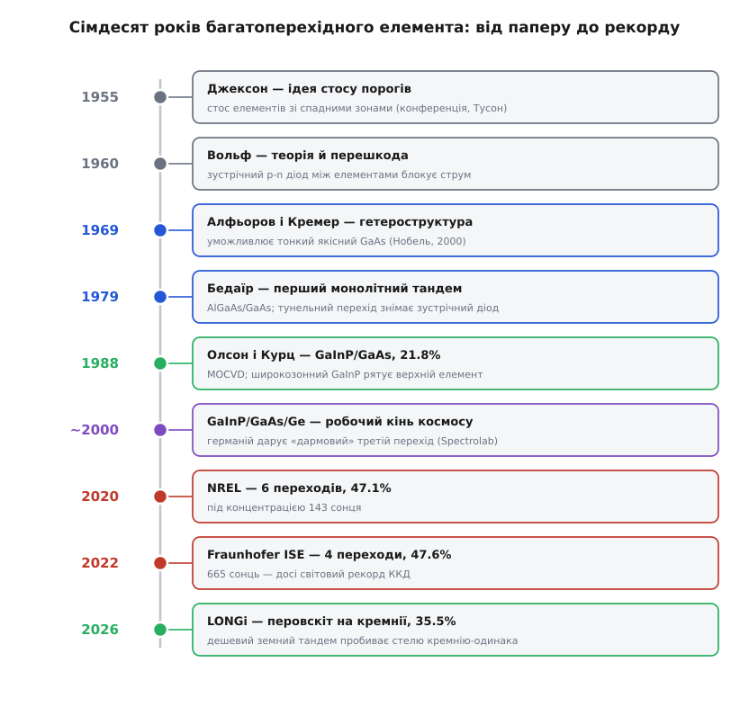
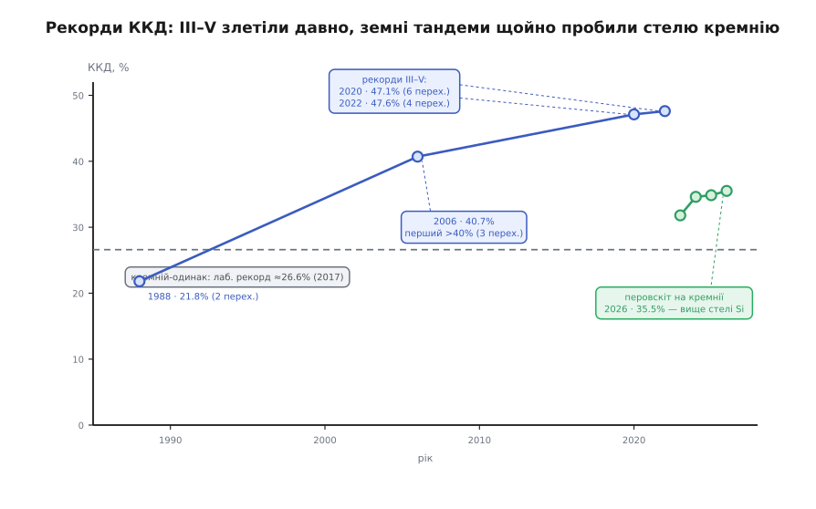

# 📜 Історія багатоперехідного елемента: від паперу до перовскітних тандемів

Ідея тандема — поставити кілька порогів поглинання один за одним, щоб кожен фотон зустрів найдоречніший, — виглядає такою очевидною, що дивуєшся, чому найефективніші сонячні елементи людство навчилося робити аж через кілька десятиліть після того, як цю думку вперше висловили. А річ у тім, що між красивою думкою на папері й працездатним стосом кристалів лежала конкретна фізична перешкода, якої майже двадцять років ніхто не вмів обійти, і ще довший шлях матеріалів та методів вирощування, без яких стос просто не виріс би. Історія багатоперехідного елемента — це не історія одного винаходу й тим паче не одного винахідника: це ланцюжок, де кожну ланку кував хтось інший, в іншій країні й з іншою метою, а склалися вони в струнку річ лише під тиском однієї дуже вимогливої замовниці — космонавтики.

*Сімдесят років шляху: ідея (сірі), перші реалізації в кристалі (сині), матеріальний прорив GaInP (зелений), космічний робочий кінь (фіолетовий), лабораторні рекорди концентраторів (червоні) і, нарешті, дешевий земний перовскітний тандем. Жодна ланка не з'явилася сама з себе — кожна спиралася на попередню.*

## Ідея на папері: Джексон, 1955

Коли 1954 року в Bell Labs зробили перший практичний кремнієвий елемент, одразу стало ясно, що один поріг поглинання обслуговує сонячний спектр марнотратно. Уже наступного, 1955-го, на конференції з використання сонячної енергії в Тусоні (штат Аризона) інженер на ім'я Е. Д. Джексон (E. D. Jackson) виступив із доповіддю з промовистою назвою — «Напрями поліпшення напівпровідникового перетворювача сонячної енергії». Саме там уперше пролунала думка, яку сьогодні знає кожен фотовольтаїк: скласти кілька елементів стосом так, щоб зверху стояв найширокозонніший, а нижче — з дедалі вужчими зонами. Кожен ловив би свою частину спектра, а разом вони зняли б куди більше, ніж один. Пізніше Джексон закріпив ідею патентом США № 2 949 498, виданим 16 серпня 1960 року. *(Дата й авторство — усталений, документально підтверджений факт; це саме перша відома пропозиція, а не «перший елемент».)*

Наголосімо на цьому чесно: Джексон запропонував **ідею**, а не прилад. У 1955-му не існувало ні матеріалів потрібної чистоти, ні способу виростити стос без дефектів, ні — і це виявиться головним — способу з'єднати сусідні елементи так, щоб струм між ними тік. Ідея випередила можливості років на двадцять із гаком.

## Вольф і перешкода, якої не знали, як обійти

Наступний крок був не вперед, а вглиб: 1960 року Мартін Вольф (Martin Wolf) у праці «Обмеження й можливості поліпшення фотовольтаїчних перетворювачів» (Proc. IRE) розібрав ідею стосу докладно — і вказав пальцем на те, об що вона розбивалася. Якщо просто поставити два p-n елементи впритул, то на стику верхнього й нижнього неминуче виникає **третій, зайвий p-n перехід, повернутий назустріч робочому струмові**. Це діод, увімкнений «не туди»: він замикає струм між елементами, і стос стає непрохідним. Вольф чесно констатував, що практично реалізувати тандем на послідовно з'єднаних p-n переходах наразі неможливо саме через цей зустрічний, зворотно зміщений діод.

Цікаво, що фізичний ключ до розв'язку вже лежав поруч — тільки в іншій шухляді. Ще 1957 року японський фізик Лео Есакі (Leo Esaki, яп. 江崎玲於奈), працюючи в майбутній Sony, відкрив тунельний діод: якщо p-n перехід легувати нестямно щільно, збіднена зона стискається до кількох нанометрів, і заряди починають **тунелювати** — просочуватися крізь бар'єр, який класично був би непереборним. За це відкриття тунелювання в напівпровідниках Есакі 1973 року здобув Нобелівську премію з фізики (розділивши її з Айваром Ґ'євером і Браяном Джозефсоном). Але сполучити ідею Джексона, перешкоду Вольфа й тунель Есакі в одному кристалі ще належало комусь здогадатися й зуміти.

> 🔧 **Навіщо це.** Ця пара «перешкода — прихований ключ» — типовий портрет застряглого інженерного завдання: теорія готова, потрібний фізичний ефект уже відкритий, а поступу нема, бо ніхто ще не зшив їх у робочу конструкцію й не навчився це вирощувати. Історія тандема показує, що між «зрозуміли, що заважає» і «зробили» лежить не одне прозріння, а ціла технологія — і саме її, а не саму ідею, найважче створити.

## Космос ставить питання руба

Двадцять років ідея пролежала б і далі суто академічною, якби не з'явився замовник, для якого зайвий відсоток ефективності важив дорожче за будь-яку складність, — космонавтика. Перші супутники живилися кремнієвими елементами, і дуже скоро виявилося, що орбіта їх нищить. Хрестоматійний випадок — «Телстар-1» (Telstar 1), запущений 10 липня 1962 року: буквально напередодні, 9 липня, США провели високогірний ядерний вибух «Starfish Prime», який накачав радіаційні пояси Землі зарядженими частинками. Ця радіація поступово вбивала на «Телстарі» і транзистори, і сонячні елементи; апарат остаточно замовк 21 лютого 1963-го. *(Зв'язок відмови «Телстара» зі «Starfish Prime» — усталений історичний факт; тим самим вибухом пояснюють відмови ще кількох супутників.)*

Мораль була ясна: космосу потрібні **радіаційно стійкі** матеріали. І тут згадали про арсенід галію. Перший GaAs-елемент зробили ще 1956 року в RCA — Дженні, Лоферський і Раппапорт (Jenny, Loferski, Rappaport), щоправда, з мізерним ККД близько 4%. Але GaAs мав рису, дорожчу за початкову ефективність: він переносив радіацію набагато краще за кремній. Саме радіаційна стійкість наприкінці 1970-х спрямувала дослідників на вирощування GaAs-приладів на германієвих підкладках — германій за кристалічною ґраткою добре пасує до GaAs. Так уперше зійшлися матеріали, з яких за десятиліття виросте космічний трипереходник.

## Гетероструктура: цеглина, без якої стос не стояв

Щоб зробити тонкий і ефективний GaAs-елемент, самого GaAs замало — потрібне вміння вирощувати **гетероструктури**, тобто різкі, атомарно чисті межі між шарами різних [напівпровідників](root:ph-condensed/semiconductor) із різною шириною зони. Цю фізику створювали в 1960-х двоє незалежно. Жорес Алфьоров (Zhores Alferov) — радянський фізик, народжений 1930 року у Вітебську (тодішня Білоруська РСР, нині Білорусь), який працював в Іоффівському фізико-технічному інституті в Ленінграді, — 1969 року першим виростив узгоджену за ґраткою гетероструктуру AlGaAs/GaAs із чіткими межами шарів. Одночасно й незалежно ті самі ідеї розвивав Герберт Кремер (Herbert Kroemer) — фізик, народжений у німецькому Ваймарі, згодом професор Каліфорнійського університету в Санта-Барбарі. За розробку напівпровідникових гетероструктур обидва 2000 року дістали половину Нобелівської премії з фізики (другу половину присудили Джекові Кілбі за інтегральну схему). *(Авторство — подвійне й незалежне; це усталений факт, і його важливо не «згорнути» до однієї особи чи однієї країни.)*

Гетероструктура — не про сонячні елементи безпосередньо, вона народилася для лазерів і швидкої електроніки. Але без неї не було б ні якісного тонкого GaAs, ні тим паче тунельного перемикання між елементами стосу: усе це — той самий інструментарій різких меж між зонами.

## Перший стос у металі: Бедаїр, 1979

Ланки нарешті зійшлися 1979 року в руках Салаха Бедаїра (Salah M. Bedair) з Університету штату Північна Кароліна. Його група виростила **перший монолітний тандем** — два елементи, AlGaAs (широка зона, зверху) і GaAs (вужча, знизу), нарощені одним кристалом і з'єднані послідовно. І тут спрацював той самий прихований ключ: між елементами Бедаїр вставив **тунельний перехід** — надщільно легований шар, крізь який заряди йдуть тунелюванням. Саме він знімав зустрічний діод, об який розбивалася ідея за Вольфом: тунельне з'єднання пропускає струм між елементами майже без опору й лишається прозорим для світла. Стос вирощували повільним рідинно-фазним осадженням (LPE); прилад давав напругу холостого ходу близько 2.0 В (майже втричі більше за один перехід) при ККД близько 9%. *(Канонічна дата — публікація в Appl. Phys. Lett. 34, 38, 1979; це усталений факт.)*

Дев'ять відсотків — небагато навіть на ті часи. Але важило інше: ідея Джексона вперше стала кристалом, а перешкода Вольфа впала. Далі йшлося вже не «чи можна», а «як зробити добре».

## GaInP рятує верхній елемент: Олсон і Курц

Перший тандем мав вроджену ваду — верхній елемент з AlGaAs. Алюміній жадібний до кисню: навіть сліди кисню в реакторі псують кристал дефектами, і верхній елемент виходить кволим. Розв'язок прийшов з двох боків. По-перше, дозрів метод вирощування — метал-органічне газофазне осадження (MOCVD, воно ж MOVPE), яке дає чисті шари III-V куди керованіше за LPE. По-друге, Джеррі Олсон (Jerry Olson) і Сара Курц (Sarah Kurtz) в Інституті досліджень сонячної енергії (SERI, згодом NREL) знайшли кращий матеріал для верхнього елемента — **GaInP**: широка зона, узгодження з GaAs за ґраткою й жодної кисневої примхи алюмінію. Їхній монолітний GaInP/GaAs-тандем із GaAs-тунельним переходом 1988 року показав 21.8% — і став першим тандемом, що обійшов за ефективністю будь-який одинарний елемент. *(21.8% — усталений результат, оприлюднений на 20-й конференції IEEE PVSC 1988 року.)*

Ця пара матеріалів — GaInP згори, GaAs знизу — виявилася такою вдалою, що NASA взяло її на озброєння: на цій самій основі згодом живилися, серед іншого, марсоходи «Спірит» і «Оппортьюніті». Верхній елемент нарешті перестав бути слабкою ланкою.

## Германій дарує третій перехід

Наступний виграш прийшов майже задарма — і почасти несподівано. Германій під стосом довго вважали просто підкладкою, механічною основою. Але коли на германій p-типу нарощують перший зародковий шар GaInP, фосфор дифундує в поверхню германію й утворює в ньому n-p перехід. Тобто підкладка **сама собою стає повноцінним третім, нижнім елементом** — із вузькою зоною близько 0.67 еВ, що підбирає інфрачервоне, яке GaAs пропускає. З двоперехідного стос перетворився на трьохперехідний GaInP/GaAs/Ge, не додавши жодного зайвого дорогого шару. *(Механізм — дифузійне утворення переходу в германії під час нарощування — добре задокументований.)*

Приблизно з рубежу 2000-х саме трьохперехідний GaInP/GaAs/Ge на германії став **робочим конем космічної енергетики**. Його налагодили на потік такі виробники, як Spectrolab (підрозділ Boeing) та інші; двоперехідні GaInP/GaAs-елементи літали в космосі вже із середини 1990-х, а трьохперехідні швидко витіснили кремній на панелях майже кожного нового супутника. Причина та сама, що й тридцять років тому: на орбіті важить потужність із кожного грама й сантиметра, а радіаційну стійкість III-V успадкували від GaAs і германію.

## Гонитва рекордів

Коли конструкція усталилася, почалося головне змагання — за відсотки. Його зручно бачити на одній картинці.

*Дорогі III–V-елементи (сині) під концентрованим світлом злетіли за 40% ще у 2000-х і тримають абсолютні рекорди близько 47–48%. Пунктир — стеля лабораторного кремнію-одинака (≈26.6%). Зелена лінія — молоді земні перовскіт-кремнієві тандеми: вони щойно, у 2020-х, пробили цю кремнієву стелю дешевими матеріалами.*

Перший символічний бар'єр — 40% — узяла Boeing-Spectrolab 2006 року: метаморфний трьохперехідний GaInP/GaInAs/Ge під концентрацією 240 сонць дав 40.7%, і це підтвердив NREL. Далі планку піднімали числом переходів і концентрацією. 2020 року NREL зробив **шестиперехідний** інвертований метаморфний елемент — 47.1% під концентрацією 143 сонця (і заразом рекорд 39.2% за одного сонця). А 2022 року Фраунгоферів інститут сонячних енергосистем (Fraunhofer ISE, Фрайбург) довів **чотириперехідний** елемент до 47.6% при 665 сонцях — піднявши власний рекорд із 46.1% головно завдяки кращому просвітлювальному покриттю. Це й досі найвищий ККД перетворення сонця будь-яким фотоелементом. *(Усі три числа — 40.7%, 47.1%, 47.6% — незалежно підтверджені рекорди; це усталені факти.)* Наступна оголошена мета в цих перегонах пряма й кругла — 50%.

## Перовскіт спускає тандем на землю

Уся ця розкіш має одну ваду — ціну. III-V-стоси ростуть на дорогій германієвій пластині повільним епітаксіальним осадженням, і для звичайного даху вони безнадійно дорогі. Тому земна вітка тандема пішла іншим шляхом — **перовскіт на кремнії**: знизу звичайний дешевий кремнієвий елемент, згори тонка плівка перовскіту з ширшою зоною, що забирає синє світло, доки воно не змарнувалося на кремнії. Матеріали дешеві, технологія лишається сумісною з кремнієвим виробництвом.

Прогрес тут стрімкий, майже рік у рік. Китайський виробник LONGi (Лонджі) провів свій двоклемний перовскіт-кремнієвий тандем через цілу низку сертифікованих рекордів: 31.8% (2023), далі 33.9%, 34.6% (2024), 34.85% (квітень 2025, підтвердження NREL) і, нарешті, 35.5% (14 липня 2026, підтвердження європейської лабораторії ESTI). *(Останнє число — найсвіжіший на середину 2026 року сертифікований лабораторний рекорд для цього типу елемента; це усталений факт.)* Головне в цих числах не самі відсотки, а те, що вони **вже впевнено перевищили стелю кремнію-одинака** (лабораторний рекорд якого — близько 26.6%, [прямозонні](root:ph-condensed/direct-indirect-bandgap) III-V тут ні до чого, це звичайний кремній). Ту саму фізичну межу, об яку один поріг упирався десятиліттями, дешевий земний тандем щойно переступив — і саме на цю технологію тепер дивляться як на наступний масовий крок сонячної енергетики.

## Що показує ця історія

Багатоперехідний елемент — чи не найкращий приклад того, як народжується складна технологія: не спалахом одного генія, а естафетою. **Ідею** стосу порогів кинув на папір Джексон (1955). **Перешкоду** — зустрічний діод між елементами — назвав Вольф (1960), і майже двадцять років вона тримала оборону. Фізичний **ключ** до неї — тунелювання — відкрив Есакі (1957) зовсім для іншого; **інструмент** різких меж між зонами дали гетероструктури Алфьорова й Кремера (1969), теж не заради сонця. **Перший стос** у кристалі зшив Бедаїр (1979), одруживши тунельний перехід зі стосом. **Матеріальний прорив** — надійний верхній елемент із GaInP на зрілому MOCVD — зробили Олсон і Курц (1988). У **систему й серійне виробництво** це перетворила космічна індустрія (Spectrolab та інші), а германій дорогою подарував третій перехід. **Рекорди** нині кують NREL і Fraunhofer ISE (за 47%), а на **земні дахи** ту саму ідею несе перовскіт-кремнієвий тандем від LONGi та інших, пробиваючи кремнієву стелю.

Ані єдиного винахідника, ані єдиної нації тут немає — і не могло бути. Американські теоретики, японське відкриття тунелювання, гетероструктури фізика, народженого у Вітебську, і фізика з Ваймара, американські й німецькі рекордні лабораторії, китайський лідер земних тандемів: кожна ланка потребувала іншого вміння, іншої мети й іншого часу. Тандем зібрався не тому, що хтось один усе придумав, а тому, що всі ці шматки нарешті лягли в один кристал.
