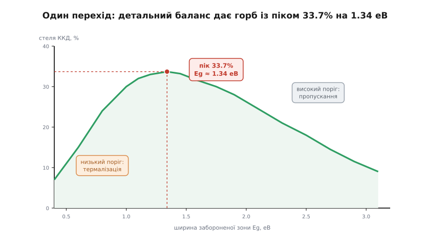
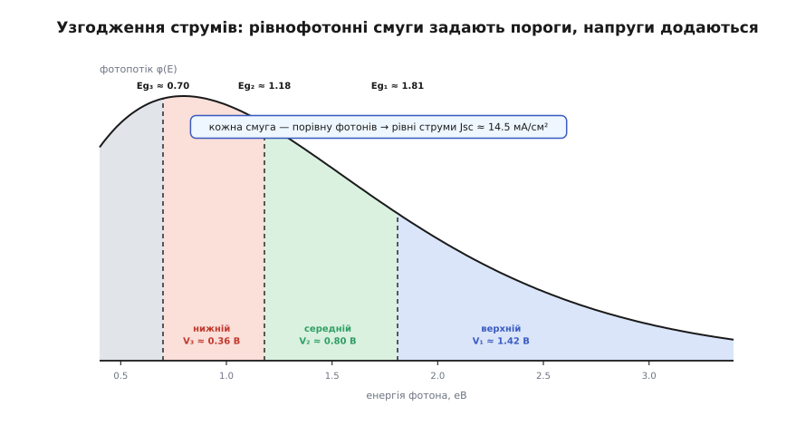
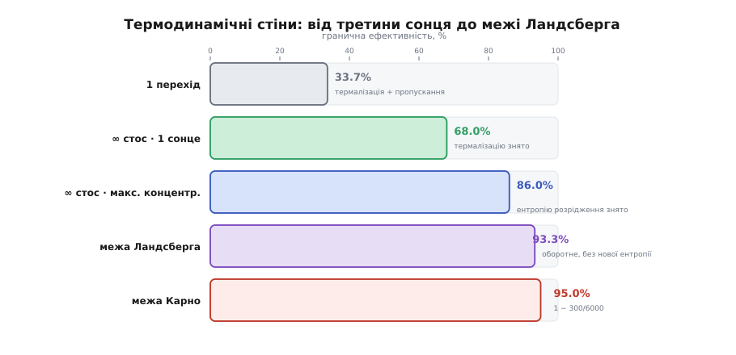

# 🧮 Стеля ефективності через детальний баланс

Числа 33.7%, 42%, 49%, 68%, 86% ніхто не виміряв приладом — їх **порахували**, і всі до одного з тієї самої короткої думки. Думка така: якщо матеріал уміє поглинати фотон, то тим самим механізмом він уміє й **випромінювати** його назад. Поглинання й випромінювання — не два різні явища, а один процес, пущений у два боки. Із цієї на позір невинної симетрії виростає стеля, вища за яку жоден одинарний перехід фізично піднятися не може, — і саме її, сходинку за сходинкою, піднімає багатоперехідний елемент. Порахуймо цю стелю чесно, від першопричини.

## Означення: що таке детальний баланс

**Принцип детального балансу** прийшов зі статистичної фізики. У тепловій рівновазі кожен мікроскопічний процес точно врівноважений своїм оберненим: скільки за секунду атомів переходить з рівня A на рівень B, стільки ж повертається з B на A — не «в середньому по системі», а саме для цієї конкретної пари переходів. Рівновага тримається не спокоєм, а рівністю двох зустрічних потоків.

Прикладімо це до фотоелемента. Гарний елемент — це той, що **добре поглинає** надпорогове світло: майже кожен фотон з енергією понад заборонену зону Eg лишається в кристалі й народжує пару носіїв. Але детальний баланс каже: те саме оптичне сполучення, яким елемент ловить фотон, робить його й **добрим випромінювачем** на тих самих енергіях. Отже, ідеальний поглинач надпорогового світла неминуче **світиться сам** — як чорне тіло за своєї власної температури (300 K). Це світіння і є **випромінна рекомбінація**: пара носіїв анігілює, віддаючи назад фотон. І це — та єдина втрата, якої не прибрати ніякою інженерією: вона вшита в саму здатність поглинати.

Вільям Шоклі (американський фізик, народжений у Лондоні; Нобель 1956 за транзистор) і Ганс-Йоахім Квайссер (німецький фізик) 1961 року взяли цю **єдину** втрату — випромінну рекомбінацію — і порахували, яку частку сонця за неї одну ще можна віддати в струм. Так народилася [межа Шоклі–Квайссера](root:ph-condensed/shockley-queisser-limit) — детально-балансова стеля одного переходу.

Чому це **правильна** стеля, а не заниження? Бо детальний баланс дає найдобріший з можливих підрахунків: він припускає, що всяка **інша** втрата вимкнена. Немає безвипромінної рекомбінації (носії гинуть тихо, не давши й фотона), немає послідовного опору, немає відбиття, поглинання ідеальне. Реальний елемент може лише **додати** втрат до цього списку — жодна з них стелю не підніме. Тому детально-балансова цифра — це стіна: не «скільки виходить у нас», а «скільки взагалі дозволяє фізика».

> 🔧 **Навіщо це.** Ідеалізована стеля здається академічною, доки не спитати: а куди взагалі бігти? 33.7% для одного переходу — це не гасло, а межа, до якої кремній у лабораторії підповз упритул (26–27%) і далі не піде **в принципі**. Знаючи стелю, бачиш дві речі одразу: скільки ще можна вичавити з наявної конструкції — і де доводиться міняти саму конструкцію, бо поточна вперлася в стіну.

## Інтуїція: чому одному порогу є стеля

Перш ніж рахувати, вловімо, звідки стеля береться на пальцях. Один поріг Eg накладає дві **незалежні** бухгалтерії, і вони тягнуть у різні боки.

**Бухгалтерія фотонів (струм).** Елемент поглинає фотон лише з енергією E ≥ Eg — нижче порога [напівпровідник для світла прозорий](root:ph-condensed/semiconductor). І, що ключове, кожен упійманий фотон переносить через зону рівно **одну** пару носіїв — байдуже, ледь-ледь він перескочив поріг чи вдвічі його переважив. Тому фотострум рахує **фотони, а не енергію**:

```
Jsc = q · Φсонця(≥Eg) = q · ∫[Eg→∞] φ(E) dE
```

Опустиш поріг — усередину пустиш більше фотонів — більший струм. Струм **любить низький** поріг.

**Бухгалтерія енергії (напруга).** Кожен носій здатен віддати в коло щонайбільше близько Eg роботи: увесь надлишок (E − Eg) осідає теплом за фемтосекунди (термалізація), ще перше ніж носій дійде до контакту. А зверху напругу підрізає те саме вимушене світіння. Тому що вищий поріг — то більша напруга з кожного носія. Напруга **любить високий** поріг.

Струм тягне поріг униз, напруга — вгору, а віддає елемент їхній **добуток** P = J·V. Добуток двох величин, що ростуть назустріч одна одній, має максимум десь усередині — оце і є горб ефективності. Лишається його порахувати.

## Формальний апарат: рівняння одного переходу

Детальний баланс дає нам те, чого бракує, — **темновий (рекомбінаційний) струм**. У темряві, у рівновазі, скільки елемент поглинув навколишніх фотонів, стільки ж випромінив: потоки рівні. Прикладемо напругу V — і випромінювання підскочить у exp(qV/kTc) разів. Причина глибока й гарна: прикладена напруга розсуває квазірівні Фермі на qV, а це розсування працює як **хімічний потенціал для фотонів** (узагальнений закон Планка) — кожен джоуль qV множить випромінений потік експонентою. Різниця «поглинуто мінус випромінено» і є струм у коло:

```
J(V) = Jsc − J₀ · [ exp(qV / kTc) − 1 ]
```

Це та сама діодна експонента, що й у [фотоелемента як зміщеного світлом діода](root:ph-condensed/photovoltaic-cell) — але тут `J₀` **не** припасований до виміру коефіцієнт. Це **струм насичення від власного світіння** елемента — потік чорного тіла за температури Tc = 300 K, зібраний над порогом:

```
J₀ = q · ∫[Eg→∞] φчт(E, Tc) dE,     φчт(E,T) ∝ E² / (exp(E/kT) − 1)
```

Ось де вся сила методу: `J₀` **не має** вільних параметрів — його задають лише температура елемента й ширина зони. Стеля виходить із двох чисел (Eg, Tc) і спектра сонця, і більше нізвідки.

Знайдімо напругу холостого ходу — там J = 0, тож `Jsc = J₀·[exp(qVoc/kTc) − 1]`, звідки:

```
Voc = (kTc / q) · ln( Jsc / J₀ + 1 )
```

`Jsc` надходить від **гарячого** сонця (≈5800 K), `J₀` — від **холодного** елемента (300 K). Гаряче тіло сипле надпорогових фотонів у безліч разів густіше, ніж 300-градусне випромінює назад, тож відношення `Jsc/J₀` величезне, логарифм — велика додатна величина. І все ж qVoc сідає на кілька десятих електронвольта **нижче** за Eg. Ця щілина між qVoc і Eg — **термодинамічний дефіцит напруги**, неминуча плата за вимушене світіння. Для Eg = 1.34 еВ виходить Voc ≈ 1.08 В, тобто qVoc ≈ 1.08 еВ — дефіцит близько 0.26 еВ, і жоден із нього не викрутиться, бо його диктує сам детальний баланс.

Далі — механіка: беремо P = J·V, максимізуємо по V (звідти робоча точка Vmp, Jmp — [максимум потужності ВАХ](root:hw-power/panel-iv-mpp)), ділимо на потужність падаючого сонця:

```
η(Eg) = Pmax(Eg) / Pсонця
```

Проженемо це по всіх порогах — і горб проявиться сам:


*Стеля ККД одного переходу проти його порога Eg (спектр AM1.5G). Ліворуч від вершини низькі пороги топлять потужність у термалізації — струму багато, напруги катма; праворуч високі пороги проґавлюють забагато фотонів — напруга висока, та струму мало. Перемир'я — на Eg ≈ 1.34 еВ, і воно дає 33.7%. Кремній (1.12 еВ) і GaAs (1.42 еВ) невипадково лягають обабіч цієї вершини — тому вони й найкращі одинаки.*

Одне застереження про числа. Первісна праця Шоклі й Квайссера 1961 року брала сонце як чорне тіло 6000 K і давала близько 30% біля 1.1 еВ. Коли той самий підрахунок прогнати проти стандартного земного спектра **AM1.5G** (світло, що пройшло крізь 1.5 атмосфери), вершина стає 33.7% на 1.34 еВ. Метод один — різняться лише вхідним спектром, і саме AM1.5G-цифру наводять сьогодні.

## Чому стеля росте з кожним доданим порогом

Одинарний поріг марнує світло на два боки водночас: підпорогові фотони проходять намарно (пропускання), а надлишок надпорогових гине теплом (термалізація). Стос порогів б'є саме по **термалізації**, і ось точна механіка чому.

Поділімо спектр на N смуг порогами Eg₁ > Eg₂ > … > Eg_N. Піделемент з номером i ловить фотони зі своєї смуги [Eg_i, Eg_{i−1}) — тобто ті, що просочилися крізь усі вищі елементи над ним. Фотон із цієї смуги віддає близько Eg_i роботи, а в тепло йде лише **надлишок над його порогом** — щонайбільше ширина смуги (Eg_{i−1} − Eg_i), а не повне (E − Eg), як в одинака. Вужча смуга — менший надлишок на кожен фотон.

Тепер уявний граничний перехід N → ∞: смуги стають нескінченно тонкі, надлишок на фотон → 0, термалізація зникає **зовсім**. Кожен фотон перетворюється практично на своїй власній енергії. Що лишається? Тільки те, що детальний баланс прибрати не дає, — вимушене світіння й пов'язана з ним ентропійна плата. Ця підлога і є 68% за одного сонця. Уся послідовність рахується тим самим апаратом, що дав 33.7%:

```
N = 1:   33.7 %     ← одинак, повна термалізація
N = 2:   ≈ 42 %
N = 3:   ≈ 49 %
N = ∞:   ≈ 68 %     ← за одного сонця; лишилась сама ентропійна підлога
```

Спадна віддача вшита в саму механіку: перший доданий поріг зрізає **найтовщий** пласт термалізації (розрубує навпіл найширшу смугу надлишку), кожен наступний — дедалі тонший. Тому реальні стоси й спиняються на двох-чотирьох переходах: п'ятий-шостий уже не окуповує ускладнення.

## Задача добору порогів: інтеграл узгодження

Досі ми ділили спектр вільно. У реальному монолітному стосі вступає жорстке обмеження, яке й формує всю конструкцію. Елементи вирощені одним кристалом і з'єднані **послідовно**, тож крізь них тече **один** струм (закон Кірхгофа для послідовного кола). А фотострум кожного піделемента задає його власна смуга:

```
Jsc,i = q · ∫[Eg_i → Eg_{i−1}] φсонця(E) dE
```

Послідовне коло пропускає струм **найслабшої** ланки, а надлишок сильніших піделементів зрізається в тепло. Отже, правильна мета — не «вичавити максимум із кожного шару», а зробити всі Jsc,i **рівними**. Це й є **узгодження струмів**, і математично воно — система з N−1 рівнянь:

```
Jsc,1 = Jsc,2 = … = Jsc,N
```

Геометрично умова прозора: поділити спектр фотопотоку на N смуг з **однаковою кількістю фотонів** у кожній. Проінтегруй φ(E) від найнижчого порога вгору, розріж накопичений потік на N рівних часток — межі часток і дадуть пороги.


*Схематичний сонячний фотопотік (за чорним тілом 5800 K) проти енергії фотона. Три смуги вирізано так, щоб кожна несла порівну фотонів — тоді фотоструми піделементів рівні, і послідовний стос нічого не зрізає. Прив'язавши низ до Eg₃ = 0.70 еВ, рівні третини кладуть внутрішні пороги на Eg₂ ≈ 1.18 еВ і Eg₁ ≈ 1.81 еВ. Струми смуг однакові — а напруги піделементів (V₁ > V₂ > V₃, бо ширша зона дає вищу напругу) над смугами додаються.*

Що ці рівні третини кладуть пороги на 1.81 / 1.18 / 0.70 еВ — не випадковість і не підгонка: це майже точно реальна трійка **GaInP / GaAs / Ge ≈ 1.9 / 1.4 / 0.67 еВ** і класичний ідеал Генрі ≈ 1.75 / 1.18 / 0.70. Проста вимога «порівну фотонів у смузі» сама виводить на пороги, які інженери відбирали матеріалами десятиліттями.

**Струм рівний, напруга — сума.** Тривперехідний стос, узгоджений під розрахунковий спектр:

```
рівнофотонні смуги  →  рівні фотоструми:
   верхній  [1.81 еВ, ∞)     Jsc ≈ 14.5 мА/см²
   середній [1.18, 1.81 еВ)  Jsc ≈ 14.5 мА/см²
   нижній   [0.70, 1.18 еВ)  Jsc ≈ 14.5 мА/см²
струм стосу = min = 14.5 мА/см²   (нічого не зрізано — на те й узгодження)

напруги піделементів додаються (кожна ≈ Eg_i/q мінус дефіцит ≈0.4 В):
   V = 1.42 + 0.80 + 0.36 ≈ 2.58 В   (проти ≈1.08 В в одного переходу)
```

Чому додавання напруг — це і є виграш, видно з добутку потужності. Стос віддає P = Jспільний · Vстос, і хоч спільний струм тепер малий (кожна смуга несе лише близько 1/N усіх фотонів, тож Jsc падає в N разів проти того, що дав би один низькопороговий елемент), **сумарна напруга** [набирається послідовним з'єднанням](root:hw-power/panel-iv-mpp) і забирає в кожного фотона шматок його енергії **біля власного порога**, а не викидає надлишок. Одна цифра замість слів:

```
Vстос = V₁ + V₂ + V₃ ≈ (Eg₁ + Eg₂ + Eg₃)/q − N·дефіцит
```

Сума порогів Eg₁+Eg₂+Eg₃ ≈ 3.69 еВ — ось скільки «висоти» стос знімає з кожного узгодженого фотона, тимчасом як одинак з будь-яким одним порогом узяв би тільки одну з цих сходинок. Практичний бонус ще й у тому, що висока напруга за малого струму означає тонші дроти й менші втрати в контактах.

## Межа нескінченного стоса й роль концентрації

За N → ∞ термалізації вже немає — кожен фотон перетворено на його енергії. Лишається **сама термодинаміка**: елемент **мусить** випромінювати, а випромінювання забирає не тільки енергію, а й **ентропію**. Дві ентропійні плати переживають граничний перехід і не дають дійти навіть до 100%.

Перша — елемент світить назад як тіло 300 K: це теплова машина зі скиданням у 300-градусний холодильник, а будь-яка теплова машина віддає не все.

Друга, тонша, — **розрідженість**. Одне сонце приходить із крихітного тілесного кута (Сонце видно під кутом близько 0.53°), а випромінює елемент у **всю** півсферу над собою. Цей розмин тілесних кутів — чиста генерація ентропії, і платиться за неї **напругою**: дефіцит (kTc/q)·ln(відношення тілесних кутів). Саме друга плата й тримає нескінченний стос за одного сонця на 68%, хоч термодинаміка дозволяла б вище.

А що коли розрідженість **прибрати** — сфокусувати світло лінзою? Під концентрацією C фотопотік, а з ним і Jsc, ростуть у C разів, тож із формули для Voc:

```
ΔVoc = (kTc / q) · ln(C)
```

Кожні 10× концентрації додають kTc/q·ln10 ≈ 0.06 В на кожен перехід — прямий, вимірюваний приріст напруги. Стеля досягається на **максимальній геометричній концентрації**, де вхідний і вихідний тілесні кути зрівнюються (елемент дивиться на світло під тим самим кутом, під яким сам світить):

```
Cmax = 1 / sin²(θсонця) ≈ 1 / (0.00465)² ≈ 46 000
```

За Cmax ентропія розрідження зникає повністю, і стеля нескінченного стоса підіймається до ≈86%. Оце й є та пара чисел: **68% за одного сонця, 86% за максимальної концентрації** — обидві порахував Алексіс Де Вос (бельгійський фізик, Гент) 1980 року тим самим детальним балансом, лише розширеним на стос.

За ними лежать останні термодинамічні стіни, яких фотоелемент детального балансу дістати вже **не** може, бо світить як 300-градусне чорне тіло: **межа Ландсберга** ≈93.3% (цілком оборотне перетворення без народження ентропії; Пітер Ландсберг, британський фізик німецького походження) і зовсім наївна межа Карно 1 − 300/6000 ≈ 95%. Фотоелемент лягає нижче за них саме тому, що його вимушене світіння — необоротне.


*Вкладені стелі й те, яку ентропійну плату знімає кожна сходинка. Один перехід (33.7%) обмежений термалізацією; нескінченний стос прибирає її й упирається в 68% за одного сонця; концентрація прибирає ентропію розрідження й підіймає до 86%; далі — суто термодинамічні межі Ландсберга (93.3%) і Карно (95%), недосяжні для випромінного перетворювача.*

## Де в темі це працює

Уся ця арифметика — не окраса, а прямий проєктний важіль. Світовий рекорд ≈47.6% належить чотириперехідному елементу **під концентрацією** не випадково: він їде саме гілкою 86%, доїть напругу з того самого (kTc/q)·ln(C). Тому рекорд завжди ставить концентраторний елемент, а не плоска панель. Земні тандеми «перовскіт на кремнії», що вже перескочили за 34%, — це той самий стрибок N=1 → N=2, з 33.7% на ≈42%, тільки взятий дешевими матеріалами замість дорогих III–V. А **узгодження струмів** пояснює, чому паспортний ККД багатоперехідного елемента намертво прив'язаний до конкретного спектра (AM0 для космосу, AM1.5 для землі): пороги дібрані під рівні фотоструми **під цим** спектром, і щойно спектр зсунеться, найслабша смуга потягне весь стос униз.

Тож стеля тандема — це не одне число, а **драбина**: скільки порогів ти можеш собі дозволити й наскільки сфокусуєш світло, стільки сходинок і піднімешся — від третини сонця в одинака до двох третин у нескінченного стоса й далі під лінзою. Кожну сходинку цієї драбини креслить один і той самий детальний баланс: поглинання, врівноважене неминучим випромінюванням.
