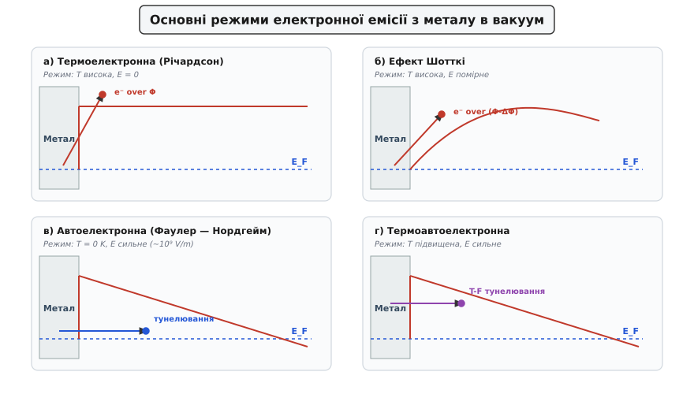
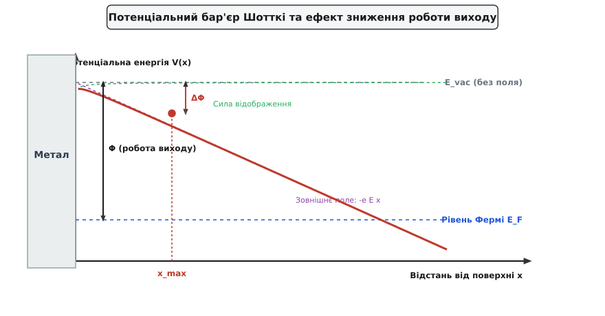
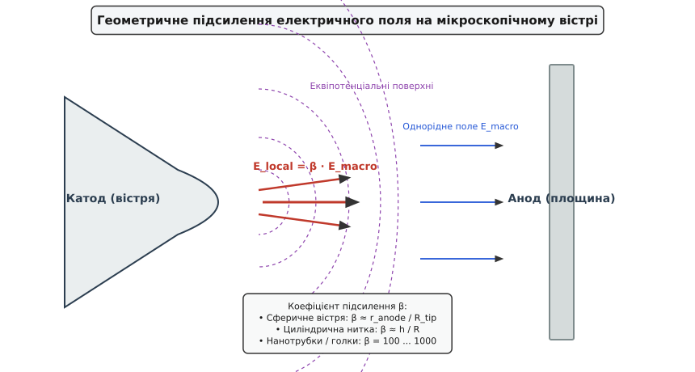

# Термоелектронна та автоелектронна емісія (Річардсон — Фаулер — Нордгейм)

<preknowlist>
- [Провідники та діелектрики](topic:ph-condensed/conductors-insulators) — зонна структура металів, рівень Фермі та робота виходу електронного газу.
- [Одновимірне стаціонарне рівняння Шредінгера](topic:ph-quantum/stationary-schrodinger-equation) — квантовий тунельний ефект крізь потенціальний бар'єр.
</preknowlist>

У потужних вакуумних приладах, електронно-зондових мікроскопах, прискорювачах частинок та радіочастотних надпровідних резонаторах металеві електроди слугують джерелами вільних електронів. За звичайних умов при кімнатній температурі електрони провідності надійно утримуються всередині кристалічної ґратки кулонівським притяганням до позитивних іонних остів. Проте варто нагріти катод вище `1000 K` або прикласти до його поверхні сильну електричну напругу порядку кіловольт, як з металу у вакуум починає текти потужний потік електронів. Розуміння механізмів, за якими носії заряду долають поверхневий потенціальний бар'єр — через теплову активацію понад бар'єром чи через квантове тунелювання крізь нього — визначає граничні параметри вакуумної електроніки, роздільну здатність мікроскопів та електричну міцність високовольтних ізоляційних проміжків.

Однак класичні підходи до опису емісії мають суттєві фізичні обмеження при спробі застосувати їх до реальних пристроїв. Історично сформувалися дві граничні теорії: класична теорія термоелектронної емісії Річардсона, яка враховує лише надбар'єрну теплову активацію електронів і повністю нехтує звуженням бар'єру сильним електричним полем, та квантова теорія автоелектронної емісії Фаулера — Нордгейма, яка описує тунелювання електронів при абсолютному нулю температур (`T = 0 K`) й ігнорує теплове збудження носіїв на вищі енергетичні рівні. При окремому застосуванні теорія Річардсона катастрофічно занижує струм у сильних полях, а теорія Фаулера — Нордгейма ламається при підвищених температурах, оскільки не враховує тунелювання збуджених електронів поблизу верхівки бар'єру.

У сучасних емісійних джерелах (зокрема, термоелектронно-автоелектронних катодах із підігрівом) сильне поле та висока температура діють одночасно. Це викликало потребу у створенні єдиної теорії термоелектронно-автоелектронної емісії (TF-емісії), яка враховує комбінований процес: зниження й звуження потенціального бар'єру зовнішнім полем (ефект Шотткі) разом із термоавтоелектронним тунелюванням електронів, що піднялися по енергетичній драбині за рахунок теплового руху.


*Основні режими виходу електронів з металу в вакуум під дією температури та електричного поля.*

## 1. Електронний газ у металі та потенціальний бар'єр поверхні

Щоб зрозуміти, як електрон залишає тверде тіло, необхідно розглянути енергетичний стан електронного газу всередині провідника. У металах зовнішні валентні електрони атомів ділокалізовані й утворюють колективну систему — фермі-газ. Згідно з квантово-механічною теорією провідності Друде — Зоммерфельда, електрони заповнюють енергетичні рівні у просторі імпульсів відповідно до принципу заборони Паулі.

Розподіл електронів за енергетичними станами `E` при температурі `T` описується статистикою Фермі — Дірака:

```
f(E) = 1 / (exp((E - E_F) / (k_B · T)) + 1)
```

де `E_F` — рівень Фермі, який відповідає граничній енергії заповнених електронних станів при абсолютному нулю температур (`T = 0 K`), a `k_B` — стала Больцмана. Величина рівня Фермі `E_F` відраховується від дна зони провідності і визначається об'ємною концентрацією вільних електронів `n`:

```
E_F = (ℏ² / (2 · m)) · (3 · π² · n)^(2/3)
```

Для більшості металів значення `E_F` лежить у діапазоні від `5 eV` до `12 eV` (зокрема, для вольфраму `E_F ≈ 5.8 eV`, для міді `E_F ≈ 7.0 eV`, для алюмінію `E_F ≈ 11.7 eV`).

Усередині металевого кристала потенційна енергія електрона в середньому нижча, ніж у вакуумі, за рахунок привабливої взаємодії з позитивно зарядженими іонами ґратки. Поверхня металу являє собою потенціальний бар'єр глибиною `V_0`. Різниця між потенціальною енергією електрона у вакуумі на нескінченній відстані від поверхні `E_vac` та рівнем Фермі `E_F` називається **роботою виходу** `Φ`:

```
Φ = E_vac - E_F
```

Робота виходу є фундаментальною характеристикою поверхні провідника. Вона складається з двох основних компонентів: об'ємного квантово-механічного потенціалу зв'язку електрона в гратці та поверхневого дипольного бар'єру, утвореного перерозподілом електронної густини на межі кристала.

### Анізотропія роботи виходу та поверхневі диполі

Оскільки поверхневий дипольний шар залежить від щільності упаковки атомів у кристалографічній площині, робота виходу проявляє чітку кристалографічну анізотропію. Найбільш щільно упаковані грані кристала мають вищу роботу виходу, ніж грані з пухкою упаковкою, оскільки на щільних гранях електронна хмара менше проникає назовні кристала.

Для монокристалічного вольфраму (W), який належить до об'ємно-центричної кубічної решітки, значення роботи виходу для різних кристалографічних граней суттєво відрізняються:
- Грань (110) — найбільш щільно упакована грань: `Φ = 5.25 eV`.
- Грань (100) — грань із середньою щільністю упаковки: `Φ = 4.63 eV`.
- Грань (111) — грань із пухкою упаковкою: `Φ = 4.47 eV`.
- Грань (310) — грань із високим ступенем кутової ступенястості: `Φ = 4.35 eV`.

Ця анізотропія відіграє вирішальну роль у функціонуванні автоелектронних та термоелектронних джерел: при нагріванні або під дією поля електрони емітуються переважно з граней із мінімальною роботою виходу, створюючи характерний симетричний емісійний візерунок.

### Сили дзеркального відображення

На мікроскопічному рівні потенціальний бар'єр не є ідеально вертикальним ступенем. Коли електрон знаходиться у вакуумі на малій відстані `x` від гладкої металевої поверхні, його негативний електричний заряд `-e` індукує на поверхні провідника позитивний поверхневий заряд. 

Згідно з методом дзеркальних зображень класичної електродинаміки, поле цього індукованого заряду тотожне полю фіктивного позитивного точкового заряду `+e`, розташованого симетрично на відстані `-x` всередині металу. Приваблива сила дзеркального відображення дорівнює:

```
F_img(x) = - e² / (16 · π · ε₀ · x²)
```

де `ε₀` — електрична стала. Потенціальна енергія цієї взаємодії становить:

```
V_img(x) = - e² / (16 · π · ε₀ · x)
```

Сила дзеркального відображення плавно скругляє потенціальний бар'єр на відстанях від частки нанометра до кількох нанометрів від поверхні, відсуваючи різке підняття потенціалу від атомного шару. На атомарних відстанях (`x < 0.2 nm`) ця класична формула насичується й плавно зшивається з потенціалом кристалічної ґратки завдяки квантово-механічним кореляційним та обмінним ефектам електронного газу.

## 2. Термоелектронна емісія та закон Річардсона — Дешмана

При кімнатній температурі енергія теплового руху електронів `k_B · T ≈ 0.025 eV` значно менша за роботу виходу `Φ ≈ 4.5 eV`. Заповнення «хвоста» функції Фермі — Дірака для енергій `E > E_F + Φ` прямує практично до нуля, тому виліт електронів повністю відсутній.

Однак при нагріванні металу до високих температур (`T > 1000 K` для оксидних катодів або `T > 2000 K` для вольфраму) енергетичний розподіл за квантовими станами розмивається. Завдяки високоенергетичному хвосту теплового розподілу з'являється помітна кількість електронів, кінетична енергія яких, нормальна до поверхні `E_x = p_x² / (2·m)`, перевищує вакуумний поріг `E_vac = E_F + Φ`. Ці електрони вилітають понад потенціальним бар'єром у вакуум. Цей процес називається **термоелектронною емісією**.

Детальний аналіз квантової історії дослідження цього явища наведено у вставці [Історія відкриття термоелектронної та автоелектронної емісії](topic:ph-condensed/thermal-field-emission/hist-richardson-fowler.md).

### Виведення закону емісії

Для обчислення густини термоелектронного струму необхідно проінтегрувати потік електронів із нормальними енергіями `E_x > E_F + Φ` по всьому простору імпульсів. Кількість електронів із нормальними імпульсами в інтервалі `p_x ... p_x + dp_x`, які щосекунди досягають одиниці площі поверхні, описується квантовою функцією постачання:

```
J_RD = e · ∫ [ E_F + Φ to ∞ ] N(E_x) dE_x
```

Підставляючи вираз для функції постачання `N(E_x) = (4·π·m·k_B·T / h³) · ln(1 + exp((E_F - E_x)/(k_B·T)))` та враховуючи, що для `E_x ≥ E_F + Φ` виконується умова `(E_x - E_F) / (k_B · T) >> 1`, ми можемо використати апроксимацію `ln(1 + δ) ≈ δ`.

Інтегрування показникової функції дає **закон Річардсона — Дешмана**:

```
J_RD = A_0 · (1 - r̄) · T² · exp( - Φ / (k_B · T) )
```

де `A_0` — фундаментальна константа Річардсона:

```
A_0 = (4 · π · m · e · k_B²) / h³ ≈ 1.2017 × 10⁶ A / (m² · K²)
```

а `r̄` — усреднений коефіціент квантового відбивання електронів від потенціального ступеня на поверхні (для повільних електронів `r̄ ≈ 0.05–0.2`).

### Квантове відбивання електронів над бар'єром

Квантово-механічна природа електрона проявляється не лише у тунелюванні під бар'єр, а й у квантовому відбиванні над бар'єром. Відповідно до одновимірного рівняння Шредінгера, для електронної хвилі з кінетичною енергією `E_x > V_0`, яка падає на потенціальний ступінь висотою `V_0`, коефіцієнт відбивання `R(E_x)` не дорівнює нулю:

```
R(E_x) = ( (k_1 - k_2) / (k_1 + k_2) )²
```

де `k_1 = √(2·m·E_x) / ℏ` — хвильове число електрона у металі, а `k_2 = √(2·m·(E_x - V_0)) / ℏ` — хвильове число у вакуумі. 

Для електронів, енергія яких лише незначно перевищує роботу виходу (`E_x - V_0 << V_0`), хвильове число у вакуумі `k_2` прямує до нуля, тому коефіцієнт відбивання `R(E_x)` прямує до одиниці. Це означає, що частина електронів, яка теоретично має достатньо енергії для вильоту, хвилеподібно відбивається від поверхневої границі назад у металеву решітку.

### Фізичний зміст константи Річардсона та температурна залежність роботи виходу

Константа `A_0` складається виключно з фундаментальних фізичних сталих: заряду електрона `e`, маси електрона `m`, сталої Планка `h` та сталої Больцмана `k_B`. Вона визначає максимально можливу густину емісійного струму для ідеального провідника з нульовим відбиванням та фіксованою роботою виходу.

На практиці виміряне експериментальне значення передпередекспоненційного коефіцієнта `A_eff` часто відрізняється від теоретичного значення `A_0`. Головна фізична причина полягає в тому, що сама робота виходу металу слабко залежить від температури через теплове розширення кристалічної решітки та зміну поверхневого дипольного потенціалу: `Φ(T) = Φ_0 + α · T`. 

Підставляючи цей лінійний розклад у закон Річардсона, отримуємо додатковий температурно-незалежний множник `exp(-α / k_B)`:

```
J_RD = A_0 · (1 - r̄) · exp(-α / k_B) · T² · exp( - Φ_0 / (k_B · T) )
```

Отже, експериментально вимірюваний передпередекспоненційний множник дорівнює `A_eff = A_0 · (1 - r̄) · exp(-α / k_B)`. Для вольфраму `α ≈ 6 × 10⁻⁵ eV/K`, що дає `exp(-α / k_B) ≈ 0.5`, пояснюючи експериментальне значення `A_eff ≈ 60 A/(cm²·K²)`.

### Порівняльні характеристики термоелектронних катодів

Вибір матеріалу для термоелектронного катода визначається компромісом між максимальною робочою температурою, роботою виходу та стійкістю до іонного розпилення в вакуумі.

| Матеріал катода | Робота виходу `Φ` (eV) | Ефективна константа `A_eff` (A/(cm²·K²)) | Робоча температура `T` (K) | Емісійна густина струму `J` (A/cm²) | Основні галузі застосування |
| :--- | :--- | :--- | :--- | :--- | :--- |
| **Чистий Вольфрам (W)** | 4.54 | 60–70 | 2500–2800 | 1–3 | Рентгенівські трубки, високочастотні генератори |
| **Торійований вольфрам (Th-W)** | 2.63 | 3.0 | 1800–2000 | 2–5 | Генераторні лампи високої потужності |
| **Гексаборид лантану (LaB₆)** | 2.67 | 29 | 1700–1900 | 20–50 | Електронні мікроскопи, електронно-променева зварка |
| **Оксидний катод (BaO-SrO)** | 1.1–1.2 | 0.5–1.5 | 900–1100 | 0.5–2 | Електронно-променеві трубки, освітлювальні лампи |

Як видно з таблиці, використання моноатомних плівок (наприклад, торію на вольфрамі) або керамічних сполук із низькою роботою виходу (гексаборид лантану `LaB_6`) дозволяє знизити робочу температуру катода майже на тисячу градусів при збереженні або навіть істотному збільшенні струму емісії.

### Обмеження струму об'ємним зарядом (Закон Ленгмюра)

У реальних вакуумних діодах при високих температурах катода випромінені електрони утворюють у вакуумному проміжку електронну хмару з об'ємною густиною заряду `ρ`. Цей негативний об'ємний заряд створює зустрічне електростатичне поле, яке гальмує виліт нових електронів і повертає частину з них назад на катод.

У результаті біля поверхні катода формується потенціальний мінімум `V_min < 0`. Залежність струму діода від анодної напруги `U` в цьому режимі описується не законом Річардсона, а **законом Богуславського — Ленгмюра (закон трьох創других)**:

```
J_space_charge = (4/9) · ε₀ · √(2·e / m) · (U^(3/2) / d²)
```

де `d` — відстань між катодом та анодом. Лише після того, як анодна напруга зростає до значень, при яких анодне поле повністю розганяє об'ємний заряд, струм досягає насичення й починає підпорядковуватися закону Річардсона — Дешмана.

## 3. Ефект Шотткі — зниження бар'єру в зовнішньому полів

Якщо у вакуумному проміжку між катодом та анодом прикласти зовнішню прискорювальну електричну напругу, біля поверхні катода створюється однорідне електричне поле напруженістю `E`.

Це поле додає до потенціальної енергії електрона у вакуумі лінійний терм `-e · E · x`. Повна потенціальна енергія електрона з урахуванням сил дзеркального відображення описується рівнянням Шотткі:

```
V(x) = E_F + Φ - e · E · x - e² / (16 · π · ε₀ · x)
```


*Скругляння та зниження потенціального бар'єру Шотткі під дією зовнішнього електричного поля та сил дзеркального відображення.*

Додавання лінійного поля перетворює нескінченно платоподібний у вакуумі бар'єр на профіль із максимумом на певній відстані `x_max` від поверхні.

### Обчислення максимуму та зниження бар'єру

Знайдемо позицію максимуму потенціальної енергії `x_max`, прирівнявши першу похідну `dV/dx` до нуля:

```
dV / dx = - e · E + e² / (16 · π · ε₀ · x_max²) = 0      [умова екстремуму]

x_max = √( e / (16 · π · ε₀ · E) )                       [позиція максимуму]
```

Для помірного поля `E = 10⁶ V/m` (10 кВ/см) позиція максимуму становить `x_max ≈ 1.9 nm`. Для сильнішого поля `E = 10⁸ V/m` максимум наближається до поверхні: `x_max ≈ 0.6 nm`.

Підставимо `x_max` назад у вираз для потенціальної енергії, щоб знайти абсолютну висоту вершини бар'єру:

```
V(x_max) = E_F + Φ - e · E · x_max - e² / (16 · π · ε₀ · x_max)
         = E_F + Φ - 2 · e · E · x_max                     [підстановка e²/(16·π·ε₀·x_max) = e·E·x_max]
         = E_F + Φ - √( e³ · E / (4 · π · ε₀) )           [підстановка x_max = √(e / (16·π·ε₀·E))]
```

Таким чином, зовнішнє електричне поле знижує ефективну роботу виходу на величину **зниження Шотткі** `ΔΦ`:

```
ΔΦ = √( e³ · E / (4 · π · ε₀) )
```

У зручних практичних одиницях:

```
ΔΦ [eV] ≈ 3.795 × 10⁻⁴ · √(E [V/m]) = 1.200 × 10⁻² · √(E [V/cm])
```

Наприклад, при полі `E = 10⁷ V/m` зниження роботи виходу становить `ΔΦ ≈ 0.12 eV`. При напруженості поля `E = 10⁸ V/m` зниження досягає `ΔΦ ≈ 0.38 eV`.

Оскільки в законі Річардсона робота виходу стоїть у показнику експоненти, це зниження викликає значне зростання емісійного струму — **ефект Шотткі**:

```
J_Schottky = J_RD · exp( (e · ΔΦ) / (k_B · T) )
           = J_RD · exp( (e / (k_B · T)) · √( e³ · E / (4 · π · ε₀) ) )
```

В логарифмічних координатах залежність `ln(J)` від `√E` (так звані **прямі Шотткі**) являє собою лінійну функцію, кутовий коефіцієнт якої дозволяє точно визначити температуру катода або перевірити чистоту його поверхні. Невеликі відхилення від прямолінійності при слабких полях виникають через мікроплямистість поверхні (неоднорідність роботи виходу окремих кристалітів).

## 4. Автоелектронна (польова) емісія та теорія Фаулера — Нордгейма

Якщо електричне поле біля поверхні катода збільшити до екстремальних значень `E ~ 10⁹ V/m` (тобто `1 V/nm`), ширина потенціального бар'єру `x_max` зменшується до `1–2 nm`.

На таких малих просторових масштабах стають домінуючими хвильові властивості електронів. Електрону більше не потрібно отримувати теплову енергію для перельоту понад бар'єром: він із високою ймовірністю тунелює **крізь** звужений трикутний бар'єр безпосередньо з рівнів поблизу `E_F`. 

Вихід електронів із металу під дією сильного електричного поля без участі теплового збудження (навіть при `T = 0 K`) називається **автоелектронною (польовою або холодною) емісією**.


*Вольт-амперна характеристика автоелектронної емісії в координатах Фаулера — Нордгейма ln(J / E²) залежно від 1 / E.*

Детальне квантово-механічне виведення наведено у вставці [Математичне виведення рівняння Фаулера — Нордгейма](topic:ph-condensed/thermal-field-emission/math-fowler-nordheim.md).

### Рівняння Фаулера — Нордгейма

Квантовий розрахунок у квазікласичному наближенні ВКБ дає для густини автоелектронного струму **рівняння Фаулера — Нордгейма**:

```
J_FN = (A_FN · E² / (Φ · t²(y))) · exp( - (B_FN · Φ^(3/2) · v(y)) / E )
```

де `A_FN` та `B_FN` — фундаментальні фізичні константи:

```
A_FN = e³ / (8 · π · h) ≈ 1.5414 × 10⁻⁶ A · eV / V²
B_FN = (8 · π · √(2·m)) / (3 · h · e) ≈ 6.8308 × 10⁹ V / (m · eV^(3/2))
```

а `v(y)` та `t(y)` — безрозмірні функції Нордгейма, які враховують скруглення вершин бар'єру силами дзеркального відображення. Змінна `y` являє собою відносний параметр Шотткі: `y = ΔΦ / Φ = √(e³·E / (4·π·ε₀)) / Φ`.

Для практичних обчислень еліптичні функції Нордгейма апроксимують поліномами:
- `v(y) ≈ 1 - y² + (y² / 3) · ln(y)` (зменшує показник експоненти на 10–20%, суттєво полегшуючи тунелювання);
- `t(y) ≈ 1 + 0.11 · y²` (близько до одиниці).

### Графіки Фаулера — Нордгейма та діагностика поверхні

Якщо знехтувати слабкою залежністю передпередекспоненційного множника та функції `v(y)` від поля, рівняння Фаулера — Нордгейма можна прологарифмувати:

```
ln( J / E² ) = ln( A_FN / Φ ) - ( B_FN · Φ^(3/2) ) / E
```

Залежність `ln(J / E²)` від `1 / E` є прямою лінією з від'ємним нахилом `k`:

```
k = - B_FN · Φ^(3/2) / β
```

де `β` — коефіцієнт підсилення поля. Прямолінійність характеристики в координатах `ln(J / E²) - (1 / E)` слугує беззаперечним критерієм того, що спостережуваний струм має саме тунельну (автоелектронну) природу.

Аналіз нахилу графіків Фаулера — Нордгейма є основним методом аналітичного контролю стану емітерів у наноелектроніці. Якщо робота виходу `Φ` відома, з нахилу прямої `k` обчислюють геометричний коефіцієнт підсилення `β`. Навпаки, при відомій геометрії вістря зміна нахилу вказує на адсорбцію залишкових газів або зміну хімічного складу поверхні.

### Вплив вакуумної екології та низькочастотний флікер-шум

Автоелектронні катоди критично чутливі до залишкового газу. За формулою Герца — Кнудсена — Ленгмюра при тиску `10⁻⁴ Pa` моношар адсорбованих газиків формується всього за одну секунду. Адсорбція молекул кисню чи води створює поверхневий дипольний шар, який підвищує роботу виходу вольфраму з `4.5 eV` до `6.0 eV`, зменшуючи струм тунелювання на 4–6 порядків!

Хаотична міграція адсорбованих атомів по поверхні під дією сильного поля породжує часові флуктуації робочої функції `δΦ(t)`. Це викликає низькочастотний флікер-шум ($1/f$ шум) емісійного струму. Щоб стабілізувати струм холодних автоемітерів (CFEG), необхідний крайньо високий вакуум (`< 10⁻⁹ Pa`) та періодичний розігрів вістря — **процедура флешингу** (Thermal-field flashing), під час якої короткочасний імпульс струму за `1–2` секунди випаровує адсорбати й відновлює атомарно-чисту грань (310).

### Деградація та вибухова електронна емісія (EEE)

При перевищенні критичної густини струму (`J_FN > 10⁷ A/cm²`) виникають деструктивні процеси, що приводять до пробою вакуумного проміжку:

1. **Катодне розпилення іонами:** Електрони іонізують залишковий газ, і позитивні іони прискорюються до вістря, збиваючи поверхневі атоми та руйнуючи його геометрію.
2. **Поверхнева електромиграція:** Градієнт пондермоторних сил викликає поверхневу дифузію атомів до вершини вістря, що створює спонтанні наногорбкуваті «мікровістря».
3. **Вибухова електронна емісія (Explosive Electron Emission):** Джоулів розігрів вершини емісійним струмом піднімає температуру до точки випаровування металу. Випаровані атоми металу іонізуються автоелектронними електронами, створюючи біля поверхні щільну прикатодно-плазмову пляму (мікрофакел). Тунельна емісія миттєво переходить у вибухову емісію з густиною струму `10⁸ A/cm²`, утворюючи вакуумну дугу.

## 5. Геометричне підсилення поля та термоавтоелектронний режим

Макроскопічним полем `E_macro = U / d` між плоскими електродами важко досягти величин `10⁹ V/m` без виклику глобального міжелектродного пробою. Як же автоелектронна емісія реалізується у реальних приладах?

Розв'язок полягає в геометрії катода. Якщо виготовити катод у формі гострої голки, мікропика або вістря з радіусом заокруглення вершини `R ~ 10–100 nm`, силові лінії електричного поля концентруються на вершині.


*Геометричне концентрування ліній електричного поля поблизу мікроскопічного вістря катода.*

Локальне поле на вершині вістря `E_local` пов'язане з макроскопічним полем `E_macro` через **коефіцієнт підсилення поля** `β`:

```
E_local = β · E_macro
```

Для ізольованого сферичного вістря радіуса `R` на відстані `D` від анода: `β ≈ D / R`. Для одиночної нанотрубки або нитки висотою `h` та радіусом `R`: `β ≈ h / R + 2`. Для реальних польових емітерів та вуглецевих нанотрубок значення `β` лежить у діапазоні від `100` до `1000`, що дозволяє отримувати автоемісійні поля `3 × 10⁹ V/m` при зовнішній напрузі всього у кілька десятків або сотень вольт.

### Взаємне екранування у масивах емітерів

При виготовленні матричних автоелектронних катодів (наприклад, килимів із вертикально вирощених вуглецевих нанотрубок або матриць Спіндта) виникає ефект електростатичного екранування. Якщо сусідні емітери розташовані занадто близько один до одного (відстань `s < h`), їхні силові лінії електричного поля перекриваються. 

Це приводить до істотного падіння коефіцієнта підсилення `β`. Електростатичні розрахунки показують, що оптимальна густина вирощування нанотрубок відповідає відношенню `s / h ≈ 2`. При такому інтервалі густина струму масиву досягає свого максимуму.

### Термоавтоелектронна емісія (T-F емісія)

У реальних умовах катод може одночасно перебувати при підвищеній температурі та під дією сильного електричного поля. Цей сумісний режим описується теорією Мерфі — Ґуда (Murphy-Good theory).

Зростання температури приводить до того, що електрони збуджуються на енергетичні рівні вище рівня Фермі `E > E_F`. На цих підвищених рівнях потенціальний бар'єр значно тонший, тому ймовірність тунелювання зростає на кілька порядків. Процес тунелювання термозбуджених електронів називається **термоавтоелектронною емісією** (Thermally Assisted Field Emission).

Перехідна температура `T_trans`, яка розділяє переважно термоелектронний та переважно автоелектронний режими, виражається формулою:

```
T_trans = (e · E · ℏ) / (2 · π · k_B · √(2 · m · Φ))
```

При `T < T_trans` струм визначається виключно тунелюванням з рівня Фермі (холодна автоемісія). При `T > T_trans` струм стає комбінованим термоавтоелектронним.

Для чисельного аналізу всіх трьох режимів емісії та побудови вольт-амперних характеристик зверніться до вставки [Чисельний розрахунок струмів термоелектронної та автоелектронної емісії](topic:ph-condensed/thermal-field-emission/proj-emission-solver.md).

## 6. Практичне застосування та порівняння катодів

Вибір режиму емісії визначає архітектуру сучасних електронно-оптичних систем. У таблиці нижче наведено порівняння ключових параметрів трьох основних типів джерел електронів, які використовуються в скануючій (СЕМ / SEM) та просвічуючій (ТЕМ / TEM) електронній мікроскопії:

| Параметр | Термоелектронний (W нитка) | Джерело Шотткі (ZrO/W) | Холодне автоемісійне (CFEG) |
| :--- | :--- | :--- | :--- |
| **Режим роботи** | Термоелектронний | Ефект Шотткі (T + E) | Автоелектронний (T = 300 K) |
| **Робоча температура** | 2700 K | 1800 K | 300 K |
| **Локальне поле `E`** | < 10⁶ V/m | ~10⁸ V/m | ~3 × 10⁹ V/m |
| **Розмір джерела `d`** | 20–50 μm | 15–30 nm | 3–5 nm |
| **Яскравість (A/(cm²·sr))** | 10⁵ | 10⁸ | 10⁹ |
| **Енергетичний розкид `ΔE`** | 1.5–2.5 eV | 0.4–0.7 eV | 0.25–0.35 eV |
| **Вимоги до вакууму** | 10⁻³ Pa (високий) | 10⁻⁷ Pa (надвисокий) | 10⁻⁹ Pa (крайньо високий) |
| **Стабільність струму** | Висока (0.5%) | Дуже висока (< 1%) | Середня (потребує флешингу) |

Катоди Шотткі та холодно-автоемісійні катоди (CFEG) завдяки крихітному розміру джерела та низькому енергетичному розкиду `ΔE` дозволяють формувати електронні зонди субатомного діаметра (< 0.1 nm), що робить можливим атомарне розділення у сучасних електронних мікроскопах.

> 🔧 **Навіщо це.**
> Знання фізики термоелектронної та автоелектронної емісії є критичним у трьох практичних інженерних галузях:
> 
> 1. **Проектування електронних мікроскопів та літографів:** Вибір між катодом Шотткі (стійкий струм для тривалого аналізу) та Cold Field Emitter (максимальне розділення для атомарної роздільності).
> 2. **Профілактика високовольтного вакуумного пробою:** На мікроскопічних шорсткостях поверхонь високовольтних вакуумних вимикачів, надпровідних прискорювальних резонаторів (SRF) та рентгенівських трубок виникає локальне підсилення поля `β`. Автоелектронний струм із цих мікровістер викликає локальний розігрів анода, випаровування металу та пробій вакуумного проміжку.
> 3. **Вакуумна наноелектроніка та космічні двигуни:** Створення плоских автоемісійних катодів на основі матриць нанотрубок для плазмових мікродвигунів cubesat та високочастотних вакуумних підсилювачів терагерцового діапазону.
