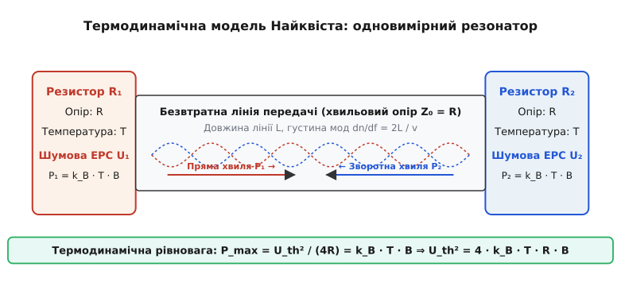
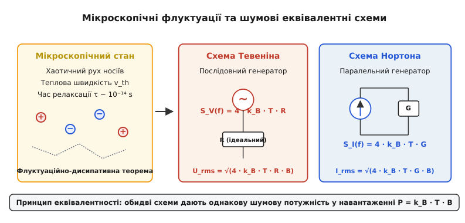
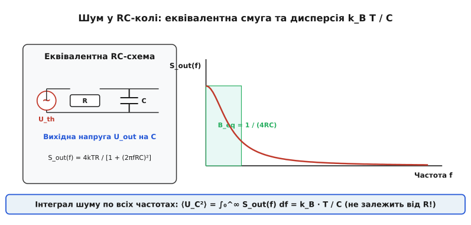
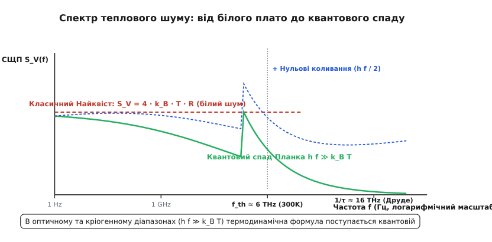

# Тепловий шум: флуктуації заряду та флуктуаційно-дисипативна теорема у конденсованому стані

<preknowlist>
- [Провідність](topic:ph-condensed/conductivity) — перенесення заряду носіями та питомий опір середовища.
- [Дрейф електронів](topic:ph-condensed/electron-drift) — хаотичний тепловий та спрямований дрейфовий рух носіїв під дією поля.
- [Природа опору](topic:ph-condensed/resistance-origin) — дисипація енергії носіїв при зіткненнях у кристалічній ґратці.
- [Напівпровідник](topic:ph-condensed/semiconductor) — концентрація носіїв, рухливість та теплове генерування пар.
</preknowlist>

Звичайний металевий провідник або напівпровідниковий пластик, що лежить на лабораторному столі при кімнатній температурі `T = 300 K` і не під'єднаний до жодного джерела ЕРС, перебуває у стані неперервної електричної метушні. За рахунок теплової енергії кристалічної ґратки вільні носії заряду (з концентрацією `N ~ 10²⁸ m⁻³` у металах) рухаються з високими тепловими швидкостями `v_th ~ 10⁵…10⁶ m/s`, постійно зазнаючи пружних та непружних зіткнень із фононами та домішками кожні `τ ~ 10⁻¹⁴ s`. Хоча усереднений по часовому інтервалу макроскопічний струм строго дорівнює нулю, у кожну окрему мікроскопічну мить на виводах провідника виникає випадковий надлишок або нестача заряду. Ці випадкові різниці потенціалів утворюють **тепловий шум** (або **шум Джонсона — Найквіста**) — фундаментальну фізичну межу для будь-яких вимірювальних систем, сенсорів та підсилювачів.

Розуміння природи теплового шуму лежить на перетині термодинаміки, статистичної фізики конденсованого стану та електродинаміки. На відміну від технологічних шумів, пов'язаних із дефектами матеріалу чи нестабільністю контактів, тепловий шум виникає безпосередньо з термодинамічної рівноваги системи. Він б'є фундаментальну підлогу чутливості приладів, але водночас є потужним інструментом для безконтактного вимірювання температури, дослідження спектрів релаксації носіїв та перевірки квантово-механічних границь вимірювань. Детальну [історію відкриття ефекту](topic:ph-condensed/thermal-noise/hist-johnson-nyquist.md) висвітлено в окремому нарисі.

## 1. Фізична природа та термодинамічна рівновага носіїв

У конденсованому середовищі вільні електрони провідності утворюють електронну рідину або газ, який перебуває в постійному тепловому обміні з кристалічною ґраткою. За теоремою про рівнорозподіл енергії класичної статистичної механіки, кожна поступальна ступінь вільності носія заряду в середньому володіє кінетичною енергією `(1 / 2) · k_B · T`, де `k_B = 1.380649 × 10⁻²³ J/K` — стала Больцмана.

Внаслідок хаотичного руху вектор швидкості окремого електрона `v_i(t)` неперервно змінює свій напрямок. Якщо розглянути фіксований переріз провідника площею `A`, то число електронів, які перетинають цей переріз зліва направо за час `dt`, у кожну мить злегка відрізняється від числа електронів, які рухаються справа наліво. Це створює миттєві флуктуації густини струму `j(r, t)` та локальної густини заряду `ρ(r, t)`.

### Квантове виродження електронного газу в металах

У металевих провідниках квантова статистика носіїв заряду відіграє визначальну роль. Електрони є ферміонами з напівцілим спіном і підкоряються принципу заборони Паулі та розподілу Фермі — Дірака:

```
f(E) = 1 / ( exp((E - E_F) / (k_B · T)) + 1 )      [розподіл Фермі — Дірака]
```

де `E_F` — енергія Фермі, яка для типових металів (мідь, алюміній, срібло) становить `E_F ~ 5…10 eV`. Оскільки кімнатна теплова енергія `k_B · T ≈ 0.026 eV` становить менше `0.5%` від енергії Фермі (`k_B · T ≪ E_F`), електронний газ у металах є глибоко виродженим.

Принциповою квантовою особливістю виродженого газу є те, що електрони, які лежать глибоко під поверхнею Фермі (`E ≪ E_F - k_B T`), не можуть змінювати свої енергетичні стани при теплових поштовхах, оскільки всі сусідні стани повністю зайняті іншими електронами. У тепловому русі та флуктуаціях беруть участь лише електрони з розмитого теплового шару товщиною `~ k_B · T` поблизу самої поверхні Фермі.

Швидкість цих електронів становить швидкість Фермі `v_F = √(2 E_F / m) ~ 10⁶ m/s` і практично не залежить від температури `T`. Однак кількість активних електронів, здатних брати участь у термодинамічних флуктуаціях, пропорційна температурі: `N_act ≈ N · (k_B · T / E_F)`. Саме ця компенсація (стала швидкість Фермі `v_F` та лінійне зростання числа активних носіїв `N_act ∝ T`) математично забезпечує класичну залежність теплового шуму від температури `S_V ∝ T` навіть для виродженої квантової системи.

На противагу металам, у невироджених напівпровідниках концентрація вільних носіїв мала, розподіл Фермі — Дірака переходить у класичний розподіл Максвелла — Больцмана, а теплова швидкість носіїв розраховується за класичною формулою `v_th = √(3 k_B T / m^*) ~ 10⁵ m/s`.

### Дисипативно-флуктуаційний зв'язок у моделі Друде

Зв'язок між процесами розсіяння носіїв (які визначають електричний опір `R`) та флуктуаціями струму є глибоко двостороннім. У класичній моделі Друде — Зоммерфельда макроскопічний питомий опір `ρ_res` задається частотою зіткнень носіїв з атомами ґратки `ν = 1 / τ`:

```
ρ_res = m / (n · e² · τ)      [питомий опір за моделлю Друде]
```

Ті самі зіткнення, які гальмують спрямований дрейф електронів під дією зовнішнього поля і призводять до дисипації електричної енергії у вигляді тепла Джоуля, слугують джерелом випадкових поштовхів, що збивають напрямок руху носіїв і повертають енергію ґратки назад електронній системі у формі флуктуацій. За відсутності зовнішнього поля система перебуває в стані детальної рівноваги: швидкість дисипації енергії носіями строго збалансована швидкістю її флуктуційного поповнення від теплового резервуара ґратки.

Внаслідок цього опір `R` виступає не лише як коефіцієнт втрат, а й як міра зв'язку між електронною системою та тепловим резервуаром. Провідник із вищим опором сильніше розсіює енергію дрейфу, але водночас і сильніше шумить у стані рівноваги. Навпаки, ідеальний надпровідник із нульовим активним опором (`R = 0`) позбавлений теплового шуму, оскільки куперівські пари рухаються без зіткнень із ґраткою.

## 2. Термодинамічне виведення Найквіста та модель ліній передачі

У 1928 році Гаррі Найквіст показав, що величину теплового шуму можна порахувати абсолютно точно на основі загальних принципів термодинаміки, не вдаючись до детального розрахунку мікроскопічних траєкторій окремих електронів.

Розглянемо виважену систему з двох однакових опорів `R₁ = R₂ = R`, що перебувають при однаковій температурі `T` і з'єднані між собою довжиною двопровідної безвтратної лінії передачі з хвильовим опором `Z₀ = R`.


*Термодинамічне виведення Найквіста: лінія передачі довжиною L з хвильовим опором Z₀ = R з'єднує два однакові резистори R при температурі T. У стані рівноваги випромінювана потужність P₁ дорівнює поглинаній P₂, що дає спектральну формулу шуму.*

У цій лінії виникають електромагнітні стоячі хвилі. Оскільки лінія замкнена на узгоджені опори, будь-яка хвиля, згенерована резистором `R₁`, повністю поглинається резистором `R₂` без відбиття. Навпаки, шум від резистора `R₂` поглинається резистором `R₁`. У стані термодинамічної рівноваги сумарний потік енергії зліва направо повинен строго дорівнювати потоку енергії справа наліво.

У лінії довжиною `L` густина власних електромагнітних мод у частотному інтервалі `B = Δf` становить `dn / df = 2L / v`, де `v` — швидкість світла в середовищі лінії. Згідно з класичною теоремою про рівнорозподіл, на кожну градусну моду припадає середня теплова енергія `⟨E⟩ = k_B · T`. Це означає, що середня шумова потужність `P`, яку провідник передає в узгоджене навантаження в смузі частот `B`, дорівнює:

```
P = k_B · T · B      [потужність теплового шуму в смузі B]
```

З теорії електричних кіл відомо, що максимальна потужність, яку джерело з внутрішнім опором `R` та ЕРС `U_th` може віддати в узгоджене навантаження `R`, становить `P_max = ⟨U_th²⟩ / (4 · R)`. Прирівнюючи термодинамічну потужність до схематичної, отримуємо знамениту **формулу Джонсона — Найквіста**:

```
⟨U_th²⟩ / (4 · R) = k_B · T · B  ⇒  ⟨U_th²⟩ = 4 · k_B · T · R · B      [формула Найквіста для напруги]
```

Середньоквадратичне значення (RMS) шумової напруги дорівнює:

```
U_rms = √(4 · k_B · T · R · B)      [RMS шумова напруга]
```

Одностороння спектральна щільність потужності (СЩП) напруги `S_V(f)`, яка визначається як `S_V(f) = d⟨U_th²⟩ / df`, є величиною сталою і не залежить від частоти у всьому класичному діапазоні:

```
S_V(f) = 4 · k_B · T · R      [спектральна щільність напруги шуму]
```

Це означає, що тепловий шум є **білим шумом** (*white noise*): його енергетичний спектр рівномірно розподілений по всіх частотах, аналогічно білому світлу в оптиці. Крок за кроком [детальне математичне виведення закону Найквіста](topic:ph-condensed/thermal-noise/math-nyquist-derivation.md) та [розрахунок спектральної густини шуму](topic:ph-condensed/thermal-noise/math-noise-density.md) наведено у відповідних вставках.

Для практичного оцінювання корисно запам'ятати базові масштаби. При кімнатній температурі (`T = 300 K`) величина `4 · k_B · T` становить приблизно `1.65 × 10⁻²⁰ J`. Отже, для резистора опором `1 kΩ` у смузі частот `1 kHz` RMS шумова напруга становить:

```
U_rms = √(1.65 × 10⁻²⁰ J · 1000 Ω · 1000 Hz) ≈ 128 nV      [приблизний масштаб шуму]
```

Якщо ж опір становить `1 MΩ`, а смуга вимірювання розширена до `1 MHz` (типово для осцилографів), шумова напруга зростає у 1000 разів і досягає `128 μV`, що вже стає помітним на тлі корисних мікровольтних сигналів.

## 3. Флуктуаційно-дисипативна теорема та узагальнений імпеданс

Формула Найквіста для чисто активного опору є окремим випадком фундаментального закону фізики конденсованого стану — **флуктуаційно-дисипативної теореми (ФДТ)**, сформульованої Гербертом Калленом та Теодором Велтоном у 1951 році.

ФДТ стверджує: якщо фізична система описується комплексним імпедансом `Z(ω) = R(ω) + i · X(ω)`, де уявна частина `X(ω)` описує реактивне накопичення енергії (електричного чи магнітного поля), а дійсна частина `R(ω) = Re[Z(ω)]` описує дисипацію енергії (перетворення в тепло), то спектральна щільність спонтанних теплових флуктуацій напруги строго визначається лише дійсною частиною імпедансу:

```
S_V(f) = 4 · k_B · T · Re[Z(2π · f)]      [ФДТ для комплексного імпедансу]
```

Реактивні елементи — ідеальні конденсатори `C` та ідеальні індуктивності `L` — самі по собі **не ґенерують теплового шуму**, оскільки вони не дисипують енергію (`Re[Z] = 0`). Однак вони перерозподіляють спектральний склад шуму, створеного активними опорами схеми.

Для аналізу шумових кіл використовують дві еквівалентні дуальні схеми:
1. **Схема Тевеніна**: послідовне з'єднання ідеального безшумного опору `R` та джерела шумової ЕРС із спектральною щільністю `S_V(f) = 4 · k_B · T · R`.
2. **Схема Нортона**: паралельне з'єднання ідеальної провідності `G = 1 / R` та джерела шумового струму із спектральною щільністю `S_I(f) = 4 · k_B · T · G`.


*Мікроскопічний хаотичний рух носіїв заряду та дуальні шумові еквівалентні схеми Тевеніна (послідовне джерело напруги) та Нортона (паралельне джерело струму).*

### Співвідношення Крамерса — Кроніга та універсальність ФДТ

Універсальність флуктуаційно-дисипативної теореми тісно пов'язана з фундаментальним принципом причинності в аналітичній фізиці. Згідно з причинністю, лінійний відгук системи `χ(t)` не може передувати за часом зовнішньому збуренню (`χ(t) = 0` при `t < 0`). Це вимагає, щоб комплексний коефіцієнт сприйнятливості `χ(ω) = χ'(ω) + i · χ''(ω)` був аналітичною функцією у верхній напівплощині комплексної частоти.

З аналітичності випливають математичні співвідношення Крамерса — Кроніга, які строго пов'язують дійсну частину сприйнятливості `χ'(ω)` (реактивний накопичувальний відгук) та уявну частину `χ''(ω)` (дисипативний відгук):

```
χ'(ω) = (2 / π) · P.V. ∫₀^∞ [ (x · χ''(x)) / (x² - ω²) ] dx      [співвідношення Крамерса — Кроніга]
```

Оскільки уявна частина `χ''(ω)` визначає коефіцієнт теплових флуктуацій через ФДТ, співвідношення Крамерса — Кроніга показують, що наявність теплового шуму є математично невіддільною від здатності системи реагувати на зовнішні електричні, магнітні чи механічні поля.

Завдяки такій універсальності ФДТ застосовується не лише в електроніці, а й у різноманітних галузях фізики конденсованого стану:
- **Механічні флуктуації та броунівський рух**: макроскопічні підвіси дзеркал в інтерферометрах гравітаційних хвиль (LIGO/Virgo) підкоряються ФДТ, де механічне демпфування `γ` матеріалу дзеркала ґенерує теплові зміщення товщини підкладки `⟨Δx²⟩ ∝ k_B T γ / ω`.
- **Акустичні шуми в рідинах**: флуктуації тиску та густини в рідких середовищах описуються в'язкістю рідини через ФДТ.
- **Магнітні флуктуації**: теплові флуктуації намагніченості у феромагнетиках та високочутливих SQUID-магнітометрах визначаються появою уявної частини магнітної сприйнятливості `μ''(ω)`.

### Аналіз шуму в реактивних колах та теорема `k_B T / C`

Розглянемо важливий практичний приклад: паралельне RC-коло, яке складається з резистора `R` та конденсатора `C`. Комплексний імпеданс такого кола дорівнює:

```
Z(ω) = R / (1 + i · ω · R · C)  ⇒  Re[Z(ω)] = R / (1 + (ω · R · C)²)      [дійсний імпеданс RC-кола]
```

Згідно з ФДТ, спектральна щільність напруги на виходах RC-кола вже не є білою, а падає на високих частотах за лоренцівським законом:

```
S_out(f) = 4 · k_B · T · R / (1 + (2π · f · R · C)²)      [спектр шуму RC-кола]
```


*Шум у паралельному RC-колі. Конденсатор шунтує високочастотні компоненти білого шуму резистора. Повна інтегральна дисперсія напруги дорівнює ⟨U²⟩ = k_B T / C і не залежить від величини опору R.*

Якщо проінтегрувати цю спектральну щільність по всьому частотному діапазону від `0` до `∞`, ми отримаємо повну дисперсію шумової напруги на конденсаторі `⟨U_C²⟩`:

```
⟨U_C²⟩ = ∫₀^∞ S_out(f) df = 4 · k_B · T · R · ∫₀^∞ [1 / (1 + (2π · f · R · C)²)] df
```

Використовуючи табличний інтеграл `∫₀^∞ [1 / (1 + (a · x)²)] dx = π / (2 · a)`, де `a = 2π · R · C`, маємо:

```
⟨U_C²⟩ = 4 · k_B · T · R · [ π / (2 · 2π · R · C) ] = k_B · T / C      [теорема k_B T / C]
```

Цей виражений результат називають **теоремою про шум `k_B · T / C`**. Зверніть увагу: повна шумова потужність на конденсаторі **взагалі не залежить від величини опору `R`**! 

Фізичне пояснення цього парадоксу полягає у взаємній компенсації двох факторів. Збільшення опору `R` підвищує висоту спектральної площадки шуму на низьких частотах (`S_V(0) = 4 k_B T R`), але одночасно пропорційно звужує смугу пропускання RC-фільтра `B_eq = 1 / (4 R C)`. Збудження та фільтрація точно компенсують одне одного, залишаючи інтегральну енергію термодинамічно фіксованою: `(1 / 2) · C · ⟨U_C²⟩ = (1 / 2) · k_B · T`. Це строго відповідає теоремі про рівнорозподіл енергії для однієї електричної ступені вільності конденсатора.

Аналогічно, для послідовного або паралельного RLC-контуру інтегрування спектральної щільності струму дає середній квадрат флуктуацій струму через індуктивність `⟨I_L²⟩ = k_B · T / L`, що є дуальною теоремою для магнітної енергії осцилятора `(1 / 2) · L · ⟨I_L²⟩ = (1 / 2) · k_B · T`.

Практичні аспекти [чисельного моделювання теплового шуму та RC-фільтрації](topic:ph-condensed/thermal-noise/proj-thermal-sim.md) розкрито у проєктній вставці.

## 4. Квантові межі: Планківська поправка та нульові коливання

При підйомі частоти `f` або зниженні температури `T` до кріогенних значень класична теорема про рівнорозподіл енергії `⟨E⟩ = k_B · T` порушується. Якщо енергія кванта електромагнітного поля `h · f` стає порівнянною або перевищує теплову енергію `k_B · T`, класична фізика передбачає уявну «ультрафіолетову катастрофу» для шуму.

При кімнатній температурі `T = 300 K` характерна теплова частота становить:

```
f_th = k_B · T / h ≈ (1.38 × 10⁻²³ · 300) / (6.626 × 10⁻³⁴) ≈ 6.25 THz      [теплова частота при 300 K]
```

Оскільки радіочастотна та мікрохвильова електроніка працюють на частотах до `100 GHz ≪ 6.25 THz`, класична формула Найквіста виконується з високою точністю. Однак у кріогенних системах (наприклад, у надпровідних квантових процесорах при `T = 10 mK`) теплова частота падає до `f_th ≈ 200 MHz`. На частотах кубітів `5 GHz` умова `h · f ≫ k_B · T` стає панівною.

У квантовій статистиці середня енергія осцилятора розраховується за формулою Планка з урахуванням енергії нульових коливань вакууму `(1 / 2) · h · f`:

```
⟨E_quant⟩ = h · f / (exp(h · f / (k_B · T)) - 1) + (1 / 2) · h · f      [квантова енергія осцилятора]
```

Замінюючи класичний фактор `k_B · T` на квантову енергію Планка, отримуємо **узагальнену формулу Планка — Найквіста**:

```
S_V(f) = 4 · R · [ h · f / (exp(h · f / (k_B · T)) - 1) + (1 / 2) · h · f ]      [формула Планка — Найквіста]
```


*Спектральна щільність напруги теплового шуму. Класичне плато Найквіста експоненціально спадає у квантовій області h f ≫ k_B T. Член нульових коливань (h f / 2) задає квантову підлогу шуму.*

Аналіз квантового спектра виявляє два важливі наслідки:
1. **Експоненціальний спад теплового шуму**: при `h · f ≫ k_B T` кількість теплових фотонів `n_th = 1 / (exp(h f / k_B T) - 1)` експоненціально прямує до нуля. Тепловий шум повністю «заморожується», і провідник більше не випромінює теплових квантів.
2. **Нульові коливання вакууму**: доданок `(1 / 2) · h · f` залишається не нульовим навіть при `T = 0 K`. Ці нульові флуктуації принципово не дозволяють вилучити енергію для здійснення корисної роботи (вони не порушують другого начала термодинаміки), однак вони створюють квантовий шум вимірювальних приладів. Квантова межа встановлює, що будь-який лінійний підсилювач додає до сигналу щонайменше еквівалентний шум `S_V_min = 2 · h · f · R`.

Крім квантового межі, існує й високоефективне **кінетичне обмеження** спектра білого шуму у металах, пов'язане з кінцевим часом релаксації імпульсу електронів `τ`. На частотах `f ≥ 1 / (2π · τ) ≈ 10…20 THz` носії заряду не встигають розсіюватися між періодами електромагнітного поля. У цій області активний опір металу за моделлю Друде стає частотно-залежним: `R(f) = R_0 / (1 + (2π · f · τ)²)`, що спричиняє додатковий високочастотний спад спектральної щільності шуму.

## 5. Особливості теплового шуму в напівпровідниках, 2D-системах та плазмі

У напівпровідникових структурах, двовимірному електронному газі (2DEG) та іонізованій плазмі фізичний механізм теплового шуму збагачується специфічними мікроскопічними ефектами.

### Напівпровідники та гарячі електрони

У напівпровідниках концентрація вільних носіїв `n(T)` сильно залежить від температури. При зниженні температури відбувається «виморожування» носіїв на донорних або акцепторних рівнях, що призводить до стрімкого зростання опору `R(T)`. Хоча зниження `T` зменшує шум через співмножник `T` у формулі Найквіста, паралельне зростання `R(T)` може сумарно **збільшити** шумову напругу `U_rms = √(4 k_B T R B)`.

У сильних електричних полях `E` напівпровідникові прилади виходять зі стану термодинамічної рівноваги. Електрони отримують від поля енергію швидше, ніж встигають передати її фононам кристалічної ґратки. У результаті середня кінетична енергія носіїв характеризується ефективною **електронною температурою** `T_e`, яка перевищує температуру ґратки `T_L`:

```
T_e = T_L · [ 1 + (μ · E / v_s)² ]      [температура гарячих електронів]
```

де `μ` — рухливість носіїв, a `v_s` — швидкість насичення. У цьому стані виникає **нерівноважний тепловий шум гарячих електронів**, спектральна щільність якого описується модифікованою формулою Найквіста `S_V = 4 · k_B · T_e · R_diff`, де `R_diff = dV / dI` — диференціальний опір зразка.

### Балістичний транспорт у низьковимірних провідниках

У мезоскопічних наноструктурах (вуглецеві нанотрубки, нанодроти) довжина провідника `l` стає меншою за довжину вільного пробігу електрона `l_e`. У цьому режимі **балістичного транспорту** розсіяння всередині каналу відсутнє, а квантова провідність описується формулою Ландауера — Бюттікера `G = (2 e² / h) · M`, де `M` — кількість відкритих квантових каналів.

Тепловий шум балістичного провідника за формулою Найквіста дорівнює `S_I = 4 k_B T G`. Оскільки електрони пролітають канал без зіткнень, опір `R = 1 / G` виникає не у самому каналі, а на контактах входження/виходження носіїв (контактний опір Шараваін — Ландауера). Отже, джерелом теплового шуму в балістичних наноструктурах є флуктуаційне перерозподілення носіїв у масивних контактах-резервуарах.

### Двовимірний електронний газ (2DEG) та квантовий ефект Холла

У гетероструктурах GaAs/AlGaAs або напівпровідникових квантових ямах вільні носії обмежені в одному напрямку, утворюючи 2D-електронний газ. У режимі квантового ефекту Холла при сильних магнітних полях поздовжній опір `R_xx` прямує до нуля у областях плато Холла. Відповідно до ФДТ, тепловий шум нахолодженого 2DEG у поздовжньому напрямку `S_V_xx = 4 k_B T R_xx` різко зникає, що дозволяє проводити надточні еталонні вимірювання опору.

### Надпровідники та теплові стрибки фази

У надпровідних дротах і контактах Джозефсона при `T < T_c` електропровідність забезпечується куперівськими парами без опору. Однак при температурах, близьких до критичної `T_c`, або в умовах колосальних шумових сплесків термодинамічні флуктуації можуть викликати флуктуаційні збудження — **теплові флуктуційні стрибки фази** (*phase slips*). Стрибок фази надпровідного параметра порядку на `2π` створює короткий імпульс напруги `∫ U dt = Φ₀ = h / (2e)`, що створює так званий флуктуаційний опір і тепловий шум у надпровідних нанодротах за теорією Куркіярві — Амбегаокара.

### Іонізована плазма

У повністю або частково іонізованій плазмі хаотичний тепловий рух електронів та іонів створює флуктуації електричного поля й потенціалу. Теплові флуктуації в плазмі обмежені радіусом дебаївського екранування `λ_D = √(ε₀ · k_B · T_e / (n_e · e²))`. На масштабах, більших за `λ_D`, плазма зберігає квазінейтральність, однак на відстанях `r < λ_D` флуктуації створюють так зване теплове плазмове випромінювання. Спектр теплового шуму плазми має виражений резонансний пік на електронній плазмовій частоті `ω_pe = √(n_e · e² / (m_e · ε₀))`, який використовується в космічних апаратах для радіочастотної діагностики концентрації плазми у сонячному вітрі та іоносфері.

## 6. Експериментальне спостереження, охолодження та фундаментальні межі

У реальних фізичних вимірюваннях тепловий шум встановлює нижню межу співвідношення сигнал/шум (SNR). Успішна боротьба з тепловим шумом вимагає системного аналізу трьох його «ручок»: температури `T`, опору `R` та смуги частот `B`.

```
          ┌─────────────────────────────────────────┐
          │  Зменшення шуму U_rms = √(4·k_B·T·R·B)  │
          └────────────────────┬────────────────────┘
                               │
         ┌─────────────────────┼─────────────────────┐
         ▼                     ▼                     ▼
┌───────────────────┐ ┌───────────────────┐ ┌───────────────────┐
│ 1. Охолодження T  │ │ 2. Зменшення R    │ │ 3. Звуження B     │
│ Кріостати LN₂/LHe │ │ Оптимізація джерел│ │ Фільтри, DSP,     │
│ 300 K → 77 K → 4 K│ │ та узгодження     │ │ локін-підсилювачі │
└───────────────────┘ └───────────────────┘ └───────────────────┘
```

Для кількісного опису шумових властивостей вимірювальних трактів використовують поняття **еквівалентної шумової температури** `T_e` та **коефіцієнта шуму** `NF` (*Noise Figure*):

```
NF = 10 · lg( 1 + T_e / T_0 )      [коефіцієнт шуму в децибелах, T₀ = 290 K]
```

Ідеальний підсилювач, який не додає власних шумів, має `T_e = 0 K` і `NF = 0 dB`.

При послідовному з'єднанні `M` підсилювальних каскадів загальна шумова температура системи розраховується за **формулою Фрііса**:

```
T_e_total = T_e1 + T_e2 / G_1 + T_e3 / (G_1 · G_2) + ...      [формула Фрііса для каскадів]
```

де `G_i` — коефіцієнт підсилення по потужності `i`-го каскаду. З формули Фрііса випливає критично важливий інженерний висновок: шум усього вимірювального тракту майже повністю визначається першим каскадом (предпідсилювачем). Якщо перший каскад має високе підсилення `G₁ ≫ 1` та низький власний шум `T_e1`, то шуми наступних каскадів послаблюються у `G₁` разів і практично не впливають на підсумкове співвідношення сигнал/шум.

Для досягнення мінімального коефіцієнта шуму в транзисторних підсилювачах застосовують **шумове узгодження імпедансу**. Власний шум підсилювача описується еквівалентною шумовою напругою `e_n` (`nV / √Hz`) та шумовим струмом `i_n` (`pA / √Hz`). Оптимальний опір джерела сигналу `R_opt`, при якому коефіцієнт шуму є мінімальним, становить:

```
R_opt = e_n / i_n      [оптимальний опір шумового узгодження]
```

> 🔧 **Навіщо це.** Фізичне розуміння закону Найквіста запобігає марній витраті ресурсів на спроби «екранувати» або «виправити» тепловий шум за допомогою схемотехнічних хитрощів. Якщо датчик має власний внутрішній опір `R = 100 kΩ`, його тепловий шум `S_V = 4 k_B T R` є об'єктивною фізичною реальністю. Єдиними фізично обґрунтованими шляхами підвищення чутливості є:
> 1. **Кріогенне охолодження**: занурення датчика в рідкий азот (`77 K`) зменшує шумові мікровольти у 2 рази, а в рідкий гелій (`4.2 K`) — майже у 8.5 разів. У разі рефрижераторів розчинення ³He/⁴He при `10 mK` шум знижується у понад 170 разів. У радіоастрономії (телескопи ALMA, VLA) використання cryo-HEMT підсилювачів дозволяє реєструвати слабкі космічні сигнали з шумовою температурою всього `T_e ~ 10 K`.
> 2. **Звуження вимірювальної смуги `B`**: використання вузькосмугових синхронних детекторів (lock-in підсилювачів), які фільтрують сигнал у смузі `B = 0.1 Hz`, знижує шумові мікровольти у 100 разів порівняно зі смугою `1 kHz`.
> 3. **Трансформація імпедансу**: використання імпедансних трансформаторів або малошумних польових транзисторів (FET) із високим вхідним опором для мінімізації струмового шуму та забезпечення узгодження `R_src ≈ R_opt`.

Тепловий шум Джонсона — Найквіста залишається яскравим прикладом того, як фундаментальний закон термодинаміки проектується на повсякденну практичну інженерію, встановлюючи чітку межу між фізично можливим і неможливим у світі чутливих вимірювань.
