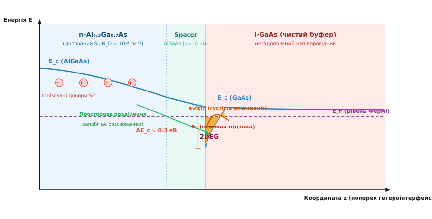
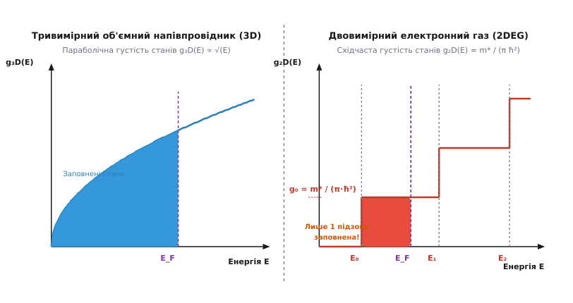
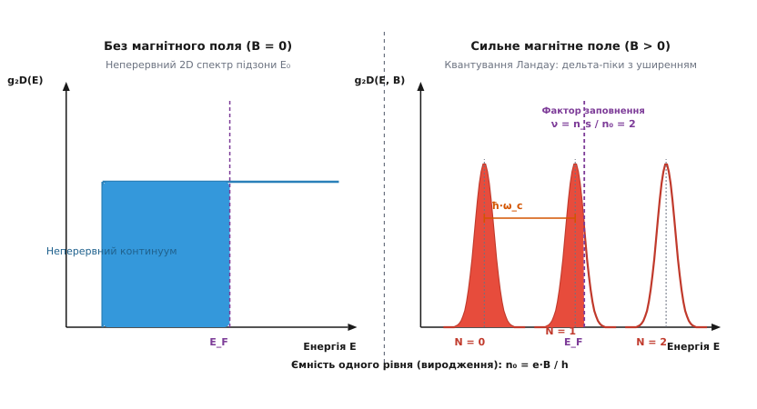

# Двовимірний електронний газ (2DEG)

<preknowlist>
- [Квантова яма](topic:ph-condensed/quantum-well) — просторовий розрив зонного спектра, що квантує поперечний рух носіїв.
- [Густість станів](topic:physics/density-of-states) — функція розподілу доступних квантових станів за енергією.
- [Напівпровідникові гетероструктури](topic:ph-condensed/semiconductor) — контакт матеріалів із різною шириною забороненої зони.
- [Циклотронний резонанс](topic:ph-quantum/cyclotron-resonance) — обертання заряджених частинок у перпендикулярному магнітному полі.
</preknowlist>

У звичайному тривимірному об'ємному напівпровіднику при зниженні температури до кріогенних значений `T < 4.2 K` електрична провідність катастрофічно падає через ефект виморожування носіїв заряду на донорні домішки. Теплова енергія `k_B · T` стає значно меншою за енергію іонізації донорів `E_D`, внаслідок чого електрони рекомбінують назад на свої материнські атоми, а концентрація вільних носіїв у зоні провідності падає експоненційно до нуля. Прагнучи підвищити концентрацію носіїв за низьких температур, інженери змушені легувати напівпровідник високою концентрацією донорних атомів `N_D > 10¹⁸ см⁻³`. Однак це викликає зворотну фундаментальну проблему: вільні електрони починають сильно розсіюватися на позитивно іонізованих атомах домішок `Si⁺`, що обмежує їхню рухливість скромною величиною `μ < 10³ – 10⁴ см²/(В·с)`. 

Просторова локалізація електронів у нанометровому шарчику на межі розділу двох різних напівпровідників радикально змінює ситуацію. Потенціальний розрив зон вигинає енергетичний рельєф, квантуючи рух електронів уздовж однієї осі, а технологія модуляційного допування просторово відокремлює носії заряду від іонізованих донорних атомів. Утворюється двовимірний електронний газ (2DEG — *Two-Dimensional Electron Gas*) із рекордною рухливістю, що перевищує `3.5 × 10⁷ см²/(В·с)`, у якому електрони переміщуються у балістичному режимі на сотні мікрометрів без жодного зіткнення з дефектами кристала.

## 1. Фізичний механізм формування 2DEG та модуляційне допування

Формування двовимірного електронного газу вимагає створення такої квантової потенціальної ями `V(z)`, у якій геометрична ширина обмежувального шару `d` є сумірною з де-бройлівською довжиною хвилі електрона `λ_dB = h / p ≈ 10 – 30 нм`. За таких умов енергія руху перпендикулярно до межі `z` перестає бути неперервною і квантується на дискретні рівні підзон `E₀, E₁, E₂`. При цьому рух у площині `(x, y)` залишається абсолютно вільним і описується планарними хвильовими векторами `(k_x, k_y)`.

Класичним прикладом системи з 2DEG є гетероперехід між широкозонним напівпровідником `Al_x Ga_{1-x} As` (ширина забороненої зони `E_g ≈ 1.8 еВ`) та вузькозонним `GaAs` (`E_g ≈ 1.42 еВ`).


*_Зонна діаграма гетероінтерфейсу n-AlGaAs/GaAs: просторове відокремлення іонізованих донорів від ями за допомогою спейсера піднімає рухливість електронів на кілька порядків._*

Фізичний механізм виникнення 2DEG на гетеромежі розгортається у кілька послідовних етапів:

1. **Зонний розрив на гетероінтерфейсі:** На межі контакту двох матеріалів виникає розрив зони провідності `ΔE_c ≈ 0.6 · ΔE_g ≈ 0.3 еВ`. Завдяки більшій ширині забороненої зони шар `AlGaAs` виконує роль високого потенціального бар'єра для електронів провідності.
2. **Перетікання заряду та вигинання енергетичних зон:** При допованні шару `AlGaAs` атомами кремнію `Si` електрохімічний потенціал (рівень Фермі `E_F`) у `n-AlGaAs` розташовується значно вище, ніж у чистому незадопованому `i-GaAs`. Прагнучи вирівняти рівні Фермі вздовж усієї структури, електрони термодинамічно перетікають через межу з `n-AlGaAs` у `GaAs`.
3. **Формування трикутної квантової ями:** Перетеклі електрони накопичуються у тонкому приповерхневому шарі `GaAs`. Завдяки позитивному заряду іонізованих донорів `Si⁺`, що лишилися по інший бік межі у `AlGaAs`, створюється потужне приповерхневе електростатичне поле `F_s ~ 10⁷ В/м`. Це поле вигинає дно зони провідності `E_c(z)` у `GaAs`, утворюючи потенціальну яму практично трикутної форми.
4. **Просторове відокремлення носіїв (Spacer Layer):** Для запобігання Кулонівському розсіюванню між `n-AlGaAs` та `i-GaAs` вирощують тонкий (від `10` до `30 нм`) шар абсолютно чистого незадопованого `AlGaAs` — **спейсер**. Спейсер віддаляє позитивні іони `Si⁺` від локалізованого у ямі електронного шарчика. Оскільки кулонівська сила розсіювання спадає з відстанню як `1 / r²`, кулонівське розсіювання електронів пригнічується на кілька порядків.

У результаті електрони виявляються запертими у вузькому шарчику товщиною менше `10 нм` біля гетеромежі. Вони утворюють двовимірний електронний газ з унікальною комбінацією високої концентрації `n_s ~ 10¹¹ – 10¹³ см⁻²` та ультрависокої рухливості. Історичні деталі відкриття перших інверсійних шарів у кремнієвих MOSFET та гетероструктурах Bell Labs детально розкрито у [історії відкриття та дослідження двовимірного електронного газу](topic:ph-condensed/two-dimensional-electron-gas/hist-2deg.md).

## 2. Квантові стани, енергетичний спектр та східчаста густість станів

Повна хвильова функція електрона в двовимірному електронному газі розкладається на добуток площини хвилі у площині `(x, y)` та обмежувальної хвильової функції поперечного руху `ψ_n(z)`:

```
Ψ_{n, k_x, k_y}(x, y, z) = (1 / √S) · exp(i · k_x · x + i · k_y · y) · ψ_n(z)
```

де `S = L_x · L_y` — площа зразка, а index `n = 0, 1, 2, ...` нумерує квантовані поперечні підзони.

Енергетичний спектр електронів у 2DEG є сумою дискретної енергії підзони `E_n` та параболічної кінетичної енергії планарного руху з ефективною масою `m*`:

```
E(n, k_x, k_y) = E_n + (ħ² / (2 · m*)) · (k_x² + k_y²) = E_n + (ħ² · k_ll²) / (2 · m*)
```

Для трикутного потенціалу наближення Ейрі дає точні значення дна підзон:

```
E_n ≈ (ħ² / (2 · m*))¹/³ · [(3 · π · e · F_s / 2) · (n + 3/4)]²/³
```

За низьких температур (`k_B · T ≪ E₁ - E₀`) та помірних концентрацій електронів заповненою є лише найнижча квантова підзона `E₀`. Такий стан називають **чистим двовимірним електронним газом (режим однієї підзони)**.


*_Порівняння густості станів: тривимірна параболічна залежність g₃D(E) ∝ √E трансформується у двовимірну східчасту функцію g₂D(E) із висотою ступеня m*/(π·ħ²)._*

Зниження вимірності системи від трьох вимірів (3D) до двох (2D) кардинально змінює функціональний вигляд густості квантових станів `g(E)`:

- **У тривимірному кристалі (3D):** Густість станів зростає параболічно з енергією: `g₃D(E) = (m* / (π² · ħ³)) · √(2 · m* · E) ∝ √E`.
- **У двовимірному електронному газі (2DEG):** Кількість квантових станів на одиницю площі у межах однієї підзони взагалі не залежить від енергії і є постійною величиною!

Сумарна двовимірна густість станів `g₂D(E)` має східчастий вигляд:

```
g₂D(E) = ((g_v · m*) / (π · ħ²)) · ∑_{n=0}^{∞} θ(E - E_n)
```

де `θ(x)` — східчаста функція Хевісайда, a `g_v` — фактор долинового виродження. Для прямозонного арсеніду галію `GaAs` (`g_v = 1`) висота одного ступеня густості станів дорівнює:

```
g₀ = m* / (π · ħ²)
```

Завдяки постійності `g₂D(E)` зв'язок між двовимірною концентрацією електронів `n_s` та енергією Фермі `E_F` при `T = 0 K` є строго лінійним:

```
n_s = ∫_{E₀}^{E_F} g₀ dE = (m* / (π · ħ²)) · (E_F - E₀)
```

Отже, енергія Фермі `E_F - E₀ = (π · ħ² · n_s) / m*` залежить виключно від площинної густини електронів і не вимагає складного розрахунку тривимірних інтегралів. Поверхня Фермі у 2D являє собою ідеальне коло радіуса `k_F = √(2 · π · n_s)`.

Унікальною математичною особливістю двовимірного електронного газу є екранування електростатичних збурень (скринінг Томас-Фермі). На відміну від тривимірного напівпровідника, де радіус скринінгу залежить від концентрації електронів як `q_TF,3D ∝ (n_3D)¹/⁶`, у двовимірній системі хвильовий вектор скринінгу `q_TF = (2 · m* · e²) / (ε · ħ²)` взагалі не залежить від концентрації електронів чи енергії носіїв! Це забезпечує стабільний і ефективний захист електронного газу від потенціальних збурень при будь-яких рівнях допування. Детальний математичний апарат із формулами 2D-скринінгу Томас-Фермі подано у [виведенні квантових станів та фермієвської механіки 2DEG](topic:ph-condensed/two-dimensional-electron-gas/math-2deg-quantum-states.md).

Для практичного розрахунку самоузгодженого профілю потенціалу `V(z)` та чисельного знаходження підзон `E₀, E₁` використовують ітераційні чисельні алгоритми. Готовий чисельний код розв'язувача наведено у [проекті самоузгодженого розв'язку рівнянь Пуассона та Шредінгера](topic:ph-condensed/two-dimensional-electron-gas/proj-2deg-subbands.md).

## 3. Транспортні властивості та надвисока рухливість носіїв

Питома провідність двовимірного електронного газу описується класичною формулою Друде:

```
σ_xx = e · n_s · μ = (e² · n_s · τ_p) / m*
```

де `μ` — рухливість носіїв, a `τ_p` — транспортний час релаксації імпульсу.

Довжина вільного пробігу електронів `l_m = v_F · τ_p` у високочистих гетероструктурах `GaAs/AlGaAs` при гелієвих температурах сягає астрономічних величин `l_m > 100 – 300 мкм`. Це перевищує розміри сучасних мікросхем і переводить транспорт у **балістичний режим**: електрони пролітають весь канал транзистора без жодного зіткнення з дефектами кристалічної ґратки.

Головними механізмами, які визначають межу рухливості електронів у 2DEG при різних температурах, є:

1. **Розсіювання на віддалених іонізованих донорах (Remote Impurity Scattering):** При `T < 4 K` це основний фактор. Використання товстих спейсерів `d_spacer > 20 нм` дозволяє мінімізувати цей внесок, піднімаючи рухливість до `μ > 10⁷ см²/(В·с)`.
2. **Розсіювання на акустичних фононах (Деформаційний та П'єзоелектричний потенціал):** Домінує у діапазоні `4 K < T < 80 K`. Акустичні коливання ґратки викликають термодинамічні зміщення атомів, створюючи локальні потенціальні збурення `μ_ac ∝ T⁻¹`.
3. **Розсіювання на полярних оптичних фононах (LO-phonons):** Стає визначальним при `T > 100 K`. Взаємодія електронів із поздовжніми оптичними фононами кристала `GaAs` (`ħ · ω_LO ≈ 36 меВ`) експоненційно знижує рухливість при наближенні до кімнатної температури: `μ_LO ∝ exp(ħ · ω_LO / (k_B · T)) - 1`.

Окрім транспортного часу `τ_p`, розрізняють одночастинковий квантовий час життя `τ_q`, який визначається з аналізу графіків Дінґла при осциляціях Шубникова — де Гааза. Якщо відношення `τ_p / τ_q ≈ 1`, у системі переважає малокутове розсіювання на короткодіючих точкових дефектах. У високочистих гетероструктурах зі спейсером це відношення сягає `τ_p / τ_q ≫ 10 – 100`, що є прямим доказом пригнічення великокутового розсіювання завдяки просторовому відокремленню донорів.

Порівняння реальних фізичних параметрів 2DEG для різних матеріальних систем подано у [довіднику параметрів та матеріальних систем з 2DEG](topic:ph-condensed/two-dimensional-electron-gas/api-2deg-parameters.md).

## 4. Спін-орбітальна взаємодія Рашби та Дрессельгауза у 2DEG

У двовимірному електронному газі відсутність інверсійної симетрії потенціалу ями викликає появу сильного спін-орбітального розщеплення енергетичного спектра навіть за відсутності зовнішнього магнітного поля.

Розрізняють два основні механізми спін-орбітальної взаємодії:

1. **Ефект Рашби (Rashba Effect):** Обумовлений структурною асиметрією потенціалу гетероями (Structural Inversion Asymmetry — SIA). Поперечне електричне поле `F_s` у релятивістській системі відліку електрона, що рухається зі швидкістю `v`, створює ефективне магнітне поле `B_eff ∝ (v × F_s)`. Додаток до гамільтоніана дорівнює:
   ```
   H_R = α_R · (σ_x · k_y - σ_y · k_x)
   ```
   де `α_R` — параметр Рашби, пропорційний електричному полю `F_s`. Величиною `α_R` можна плавно управляти за допомогою напруги на зовнішньому затворі.
2. **Ефект Дрессельгауза (Dresselhaus Effect):** Виникає через об'ємну відсутність інверсійної симетрії самої кристалічної ґратки типу цинкової обманки `GaAs` (Bulk Inversion Asymmetry — BIA):
   ```
   H_D = β_D · (σ_x · k_x - σ_y · k_y)
   ```

Спін-орбітальна взаємодія розщеплює параболічний спектр 2DEG на два спінові підрівні, зміщені у `k`-просторі. Це є фізичною основою **спінтроніки** — створення спінових польових транзисторів Датта — Даса (*Datta-Das Spin Transistor*), де напрем напрямку спіну електронів управляється електричним полем затвора через коефіцієнт Рашби `α_R`.

## 5. Квантування Ландау та квантовий ефект Холла у 2DEG

При прикладанні сильного магнітного поля `B`, спрямованого перпендикулярно до площини 2DEG (вздовж осі `z`), сила Лоренца закручує траєкторії електронів у кола з циклотронною частотою `ω_c = e · B / m*`.

Магнітне поле повністю пригнічує вільний рух у площині `(x, y)` та перетворює неперервний двовимірний спектр у дискретний набір **рівнів Ландау**:

```
E_N = E₀ + ħ · ω_c · (N + 1/2) ± (1/2) · g* · μ_B · B
```

де `N = 0, 1, 2, ...` — номер рівня Ландау, `g*` — ефективний g-фактор, `μ_B` — магнетон Бора.


*_Квантування Ландау: трансформація неперервного 2D-спектра у дискретні рівні Ландау під дією магнітного поля B зі збереженням сумарного числа станів._*

Унікальною властивістю 2DEG є те, що при квантуванні Ландау густість станів перетворюється з горизонтальної прямої у серію нескінченно вузьких дельта-піків (у реальних кристалах вони уширяються до Гауссових піків через мікроскопічний хаос дефектів).

Кількість станів, що вміщується на один рівень Ландау на одиницю площі (ємність або виродження рівня `n₀`), не залежить від маси носіїв і визначається виключно магнітним полем:

```
n₀ = (e · B) / h = B / Φ₀
```

де `Φ₀ = h / e ≈ 4.135 × 10⁻¹⁵ Вб` — квант магнітного потоку.

Співвідношення між повною густиною електронів `n_s` та ємністю одного рівня Ландау визначає **фактор заповнення** `ν`:

```
ν = n_s / n₀ = (h · n_s) / (e · B)
```

Коли фактор заповнення є строго цілим числом `ν = 1, 2, 3, ...`, рівень Фермі `E_F` потрапляє в енергетичну щілину між сусідніми рівнями Ландау. У цьому режимі виникає **целочисельний квантовий ефект Холла (IQHE)**.

На мікроскопічному рівні транспорт електронів у режимі IQHE описується картиною топологічних одновимірних **крайових каналів** (модель Ландауера — Бюттікера). Всередині зразка електронні стани локалізовані на замкнених циклотронних орбітах і струму не несуть. Але біля фізичного краю зразка потенціал стрімко зростає, згинаючи рівні Ландау вгору і перетинаючи рівень Фермі `E_F`. 

Незаперті крайні орбіти відбиваються від стінки зразка, здійснюючи стрибкоподібний рух вздовж краю. Оскільки на протилежних краях зразка електрони рухаються у протилежних напрямках (хіральний транспорт), зворотне розсіювання носіїв через товщу зразка є квантово забороненим! Це забезпечує абсолютну відсутність дисипації `ρ_xx = 0` та строге квантування холлівського опору:

```
R_xy = ρ_xy = h / (e² · ν) = R_K / ν
```

де `R_K = h / e² ≈ 25812.807 Ом` — константа фон Клітцинґа.

При подальшому підвищенні якості гетероінтерфейсів та зниженні температури `T < 1 K` у сильних магнітних полях розкривається **дробовий квантовий ефект Холла (FQHE)** при `ν = 1/3, 2/5, 3/7, ...`. Він обумовлений сильними електрон-електронними Кулонівськими кореляціями і виникненням нових квазічастинок з дробовим електричним зарядом `e* = e / 3`.

## 6. Експериментальні методи діагностики 2DEG

Для точного вимірювання фізичних характеристик двовимірного електронного газу у лабораторіях застосовують комплекс діагностичних методів:

1. **Осциляції Шубникова — де Гааза (SdH):** Вимірювання поздовжнього опору `ρ_xx(B)` при низьких температурах дає осциляції, періодичні за оберненим магнітним полем `1/B`. Період осциляцій `Δ(1/B) = (2 · e) / (h · n_s)` дозволяє прямо й з максимальною точністю виміряти двовимірну концентрацію носіїв `n_s` без залежності від геометричних розмірів зразка.
2. **Циклотронний резонанс (CR):** Опромінення зразка мікрохвильовим або інфрачервоним випромінюванням у магнітному полі викликає резонансне поглинання потужності на частоті `ω = ω_c = e · B / m*`. Це дає прямий метод вимірювання ефективної маси електрона `m*` безпосередньо у провідній підзоні.
3. **Вольт-фарадні характеристики (C-V вимірювання):** Вимірювання ємності структури від напруги затвора `C(V_g)` дозволяє побудувати точний просторовий профіль розподілу носіїв `n(z)` та визначити точку виснаження чи заповнення другої підзони.

> 🔧 **Навіщо це.**
> Двовимірний електронний газ є фундаментальною платформою сучасної наноелектроніки. На основі 2DEG створюються **транзистори з високою рухливістю електронів (HEMT / MODFET)** у напівпровідникових системах `AlGaN/GaN` та `GaAs/AlGaAs`. Завдяки високим швидкостям насичення носіїв `v_sat > 2 × 10⁷ см/с` та відсутності донорного розсіювання HEMT-транзистори працюють на надвисоких частотах до `100 – 500 ГГц`. Вони складають основу малошумливих вхідних підсилювачів у супутниковому зв'язку, радіотелескопах, 5G/6G прийомо-передавачах та військових радарах.
> У метрології квантовий ефект Холла в 2DEG використовується для первинного відтворення одиниці електричного опору (Ом) з відносною погрешністю менше `10⁻⁹`, усуваючи потребу в матеріальних еталонах. У перспективних квантових обчисленнях межові неабелеві квазічастинки в 2DEG у режимі `ν = 5/2` розглядаються як головний кандидат для створення топологічних кубітів, захищених від декогеренції на рівні фізичної топології.
