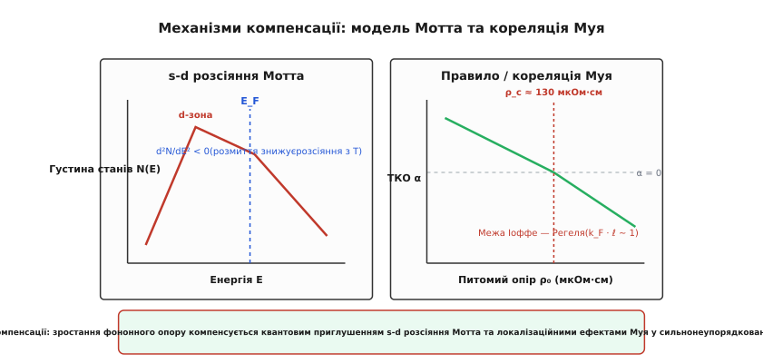
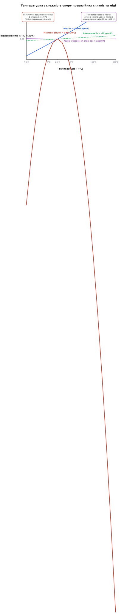
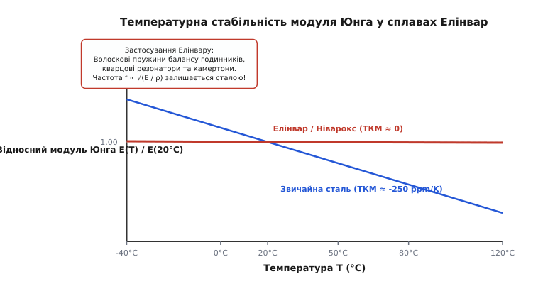
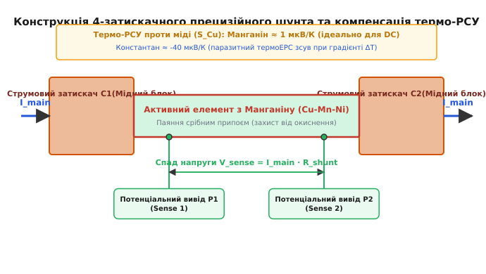

# Сплави з нульовим ТКО

<preknowlist>
- [Модель Друде](root:ph-condensed/drude-model) — класичний зв'язок питомого опору з концентрацією та часом релаксації носіїв.
- [Довжина вільного пробігу](root:ph-condensed/mean-free-path) — зіткнення електронів з дефектами кристалічної ґратки та межа Іоффе — Регеля.
- [Рухливість носіїв заряду](root:ph-condensed/carrier-mobility) — температурна динаміка фононного та домішкового розсіяння.
- [Закон Ома](root:hw-analog/ohms-law) — зв'язок напруги, струму та питомого опору провідників.
</preknowlist>

Коли через мідний вимірювальний шунт омметра тече струм силою `100 А`, виділення джоулевого тепла на потужності `10 Вт` швидко нагріває провідник на `30 °C`. Через високу температурну чутливість чистої міді її питомий опір зростає на `12%`, перетворюючи точне вимірювання на похибку у десятки відсотків. Причина полягає у тому, що у звичайних металах амплітуда теплових коливань іонної ґратки зростає пропорційно температурі, регулярно збиваючи напрямлений дрейф електронних хвиль.

Для подолання цього дрейфу у прецизійній приладобудуванні використовують спеціально синтезовані **сплави з нульовим температурним коефіцієнтом опору (ТКО)**. Вони поєднують у собі протилежні фізичні процеси: класичне зростання фононного розсіяння при нагріванні точково нейтралізується квантовими ефектами розмиття функції Фермі — Дірака та деструкцією слабкої локалізації електронів у сильно неупорядкованій атомній ґратці.

## 1. Термодинаміка електричного опору та температурний коефіцієнт (ТКО)

Макроскопічний електричний опір суцільного металевого провідника довжиною `l` та площею поперечного перерізу `S` задається співвідношенням:

```
R(T) = ρ(T) · l(T) / S(T)
```

де `ρ(T)` — питомий електричний опір матеріалу, який вимірюється в `Ом·м` або позасистемних одиницях `мкОм·см` (`1 мкОм·см = 10⁻⁸ Ом·м`).

При зміні температури розміри провідника зазнають ізотропного теплового розширення за законом `l(T) = l_0 · (1 + α_L · ΔT)` та `S(T) = S_0 · (1 + 2 · α_L · ΔT)`, де `α_L` — коефіцієнт лінійного теплового розширення (КТР, порядок `10⁻⁵ K⁻¹`). Геометричний внесок КТР у зміну опору дорівнює `-α_L · ΔT`. Однак геометрична зміна розмірів є на два порядки меншою за електронну зміну питомого опору `ρ(T)`. Тому у фізиці твердого тіла геометрією нехтують, визначаючи температурну динаміку опору виключно через питомий опір.

Відносну швидкість зміни питомого опору при зміні температури описують фізичною величиною, яку називають **температурним коефіцієнтом опору (ТКО)**, або в міжнародній термінології **TCR** (від англ. *Temperature Coefficient of Resistance*). Диференціальне означення ТКО при певній температурі `T` виражається формулою:

```
α(T) = (1 / ρ_0) · (dρ / dT)
```

де `ρ_0` — питомий опір при базовій референтній температурі (традиційно `20 °C` або `293.15 K`).

У системі SІ одиницею вимірювання ТКО є `К⁻¹` або `°C⁻¹`. Однак для прецизійних сплавів величина `α` є надзвичайно малою (порядок `10⁻⁶ К⁻¹`), тому у фізиці конденсованого стану та метрології загальноприйнято використовувати одиницю **`ppm/K`** (від англ. *parts per million per Kelvin* — мільйонних часток на Кельвін):

```
1 ppm/K = 10⁻⁶ К⁻¹ = 0.0001 %/°C
```

Значення `10 ppm/K` означає, що при нагріванні на `1 °C` опір провідника змінюється всього на `0.001%` від свого номінального значення. Для вимірювальної приладобудівної індустрії це дозволяє створювати системи, калібрування яких не плаває при сезонних або добових коливаннях температури навколишнього середовища.

### Фізична природа ТКО чистих металів та правило Маттіссена
У чистих монокристалічних металах (мідь `Cu`, алюміній `Al`, срібло `Ag`, платина `Pt`) механізм електропровідності описується класичною теорією Друде та квантовою теорією Блоха. В ідеальній періодичній ґратці електронна хвиля Блоха поширюється без жодного опору, оскільки квантові фази розсіяння на регулярних вузлах взаємно гасяться внаслідок трансляційної симетрії. Опір виникає лише через порушення періодичності.

Згідно з правилом Маттіссена, загальний питомий опір додається з двох незалежних внесків:

```
ρ(T) = ρ_res + ρ_ph(T)
```

1. **Залишковий опір `ρ_res`**: викликаний розсіянням електронів на статичних дефектах, вакансіях, міжзеренних межах та атомах домішок. У класичному наближенні `ρ_res` визначається концентрацією дефектів і не залежить від температури (`dρ_res / dT = 0`).
2. **Фононний опір `ρ_ph(T)`**: викликаний непружним розсіянням на теплових коливаннях атомів ґратки (акустичних фононах). При температурах, вищих за температуру Дебая (`T > Θ_D`), кількість акустичних фононів пропорційна температурі `N_ph ∝ T`, а густина кінцевих станів для розсіяння залишається сталою.

У результаті для чистих металів фононний опір зростає за лінійним законом:

```
ρ_ph(T) = A · T
```

де `A` — матеріальна константа, що залежить від деформаційного потенціалу та маси атомів ґратки.

Підставляючи вираз фононного опору у диференціальне означення ТКО, отримуємо:

```
α_metal = (1 / ρ_0) · (dρ_ph / dT) = A / (ρ_res + A · T_0)
```

Оскільки у чистих високоочищених металах залишковий опір є вкрай малим (`ρ_res << ρ_ph`), ТКО чистих металів при кімнатній температурі близький до оберненої абсолютної температури `1 / 293 K ≈ +3.4 · 10⁻³ К⁻¹`. Для чистої міді `α_Cu ≈ +3900 ppm/K`, для алюмінію `α_Al ≈ +4200 ppm/K`, а для платини `α_Pt ≈ +3927 ppm/K`.

Тобто при нагріванні на кожні `10 °C` опір мідного дріт зростає майже на `4%`. Така висока температурна чутливість є корисною для первинних термометрів опору (наприклад, платинових датчиків `Pt100`), однак вона є катастрофічною для прецизійних резисторів, цифрових аналого-цифрових перетворювачів (АЦП) та вимірювальних систем.

У концентрованих сплавах правило Маттіссена зазнає порушення. Коли концентрація домішкових атомів досягає десятків відсотків, домішкове розсіяння перестає бути сумою ізольованих актів зіткнення і перетворюється на розсіяння у сильно неупорядкованій потенціальній матриці. Це створює фізичні умови для штучного керування температурним коефіцієнтом.

## 2. Квантово-механічні механізми приглушення й компенсації ТКО

Для створення сплаву з ТКО, близьким до нуля (`α ≈ 0`), необхідно сформувати у матеріалі додатковий внутрішній канал розсіяння, похідна якого за температурою є від'ємною (`dρ_add / dT < 0`), і яка за модулем тотожно дорівнює позитивній фононній похідній у робочому діапазоні температур:

```
dρ_total / dT = dρ_ph / dT + dρ_add / dT = 0
```

У фізиці конденсованого стану існує два ключових квантово-механічних механізми, які створюють такий негативний вклад: двозонна модель `s-d` розсіяння НевІлла Мотта та ефекти квантової інтерференції Муя у сильно неупорядкованих середовищах.


*Механізми компенсації розсіяння у сильнонеупорядкованих твердих розчинах переходних металів.*

### Модель s-d розсіяння НевІлла Мотта
Перехідні метали (такі як марганець `Mn`, нікель `Ni`, хром `Cr`, залізо `Fe`) мають складну електронну зонну структуру. У них широка `s`-зона провідності, яка відповідає за перенесення електричного струму, перекривається з вузькою `d`-зоною. Густина станів у `d`-зоні `N_d(E)` є надзвичайно високою за рахунок малого просторового радіуса `d`-орбіталей, але `d`-електрони мають велику ефективну масу `m_d* >> m_s*` і практично не беруть участі у перенесенні струму.

Високорухливі `s`-електрони під дією електричного поля прискорюються, однак при зіткненнях з флуктуаціями потенціалу вони квантово вистрибують у вільні стани `d`-зони (так званий `s-d` процес розсіяння Мотта). За золотим правилом Фермі у квантовій теорії обурень, ймовірність цього розсіяння `1 / τ_sd` прямо пропорційна густині прийнятних станів `N_d(E)` у `d`-зоні на рівні Фермі:

```
1 / τ_sd(E) ∝ N_d(E)
```

При підвищенні температури функція розподілу Фермі — Дірака `f(E, T)` розмивається навколо енергії Фермі `E_F` на величину порядку `k_B · T`. Провідність обчислюється шляхом інтегрування густини станів по енергетичному вікну розмиття.

Детальне квантово-механічне виведення інтеграла Фермі — Дірака наведено у вставці [Квантово-механічне виведення ефекту Муя та модель Мотта](root:ph-condensed/zero-tcr-compensation-physics/math-mooij-mott-derivation.md).

За розкладом Зоммерфельда для систем із невиродженим або слабовиродженим електронним газом, температурна похідна опору `s-d` розсіяння залежить від другої похідної густини станів `d`-зони за енергією `d²N_d / dE²`:

```
dρ_sd / dT ∝ - T · [d²N_d(E_F) / dE²]
```

Якщо склад сплаву дібрано так, що рівень Фермі `E_F` потрапляє на локальну вершину (пік) `d`-зони, де перша похідна дорівнює нулю (`dN_d / dE ≈ 0`), а друга похідна є строго від'ємною (`d²N_d / dE² < 0`), то з ростом температури теплове розмиття зменшує ефективну густину станів, доступних для розсіяння `s`-електронів.

У результаті інтенсивність `s-d` розсіяння з температурою **падає**, що надає негативний температурний коефіцієнт `dρ_sd / dT < 0`. Зменшення ймовірності розсіяння компенсує фононний опір, формуючи стабільну область провідності.

### Кореляція та правило Муя
У 1973 році голландський фізик Джонатан Муй (Jonathan Mooij) проаналізував експериментальні дані щодо сотень неупорядкованих металевих сплавів та концентрованих твердих розчинів. Він встановив універсальне емпіричне правило: при збільшенні залишкового питомого опору `ρ_0` температурний коефіцієнт опору `α` систематично зменшується і змінює знак з позитивного на негативний при досягненні критичного опору `ρ_c ≈ 130–150 мкОм·см`:

```
α = A · (ρ_c - ρ_0)
```

Фізичний зміст кореляції Муя полягає у досягненні **межі Іоффе — Регеля**. При високих концентраціях домішок питомий опір `ρ_0` зростаєстільки, що середня довжина вільного пробігу електрона `ℓ` зменшується до міжатомної відстані `a` у ґратці та довжини дебройлівської хвилі `λ_F = 2π / k_F`:

```
k_F · ℓ ≈ 1
```

де `k_F` — фермієвський хвильовий вектор.

На межі Іоффе — Регеля класичне фононне розсіяння втрачає ефективність, оскільки електронний імпульс повністю збивається вже на одному атомі. Подальше зростання амплітуди фононних коливань не може додатково зменшити довжину вільного пробігу `ℓ`, бо вона досягла свого фізичного мінімуму `ℓ ≈ a`.

Натомість у сильно неупорядкованому середовищі починають домінувати ефекти **квантової інтерференції** електронних хвиль, розсіяних на хаотичному потенціалі дефектів. Конструктивна інтерференція хвиль, що проходять замкнені траєкторії у протилежних напрямках, збільшує ймовірність зворотного розсіяння — явище **слабкої локалізації**.

З підвищенням температури непружні зіткнення електронів з фононами руйнують фазову когерентність хвильових пакетів на довжині `L_φ(T) ∝ T⁻ᵖ/²`. Зруйнування слабкої локалізації при нагріванні підвищує провідність матеріалу, що призводить до від'ємного ТКО (`dρ_loc / dT < 0`).

Поєднуючи допування transition-металами та квантову неупорядкованість, фізики синтезують матеріали, у яких ТКО прямує до нуля у заданому діапазоні температур.

## 3. Фазово-структурні методи формування параболічного плато R(T)

На практиці для досягнення нульового ТКО мало отримати лінійну компенсацію при одній точці. Залежність опору прецизійного сплаву від температури `R(T)` являє собою гладку криву з локальним екстремумом.


*Порівняння температурних кривих відносного опору міді, константану, манганіну та карми.*

### Параболічна характеристика манганіну
Для класичного прецизійного сплаву **манганіну** (склад: `86% Cu`, `12% Mn`, `2% Ni`) залежність опору в околі кімнатної температури описується параболічним поліномом другого степеня:

```
R(T) = R_20 · [1 + α_20 · (T - 20) + β · (T - 20)²]
```

де:
- `R_20` — опір при `20 °C`;
- `α_20` — лінійний ТКО при `20 °C` (`α_20 ≈ ±(1..5) · 10⁻⁶ К⁻¹`);
- `β` — квадратичний температурний коефіцієнт (`β ≈ -(3..5) · 10⁻⁷ К⁻²`).

Оскільки квадратичний коефіцієнт `β` є строго від'ємним, парабола орієнтована гілками вниз. Вершина параболи `T_peak`, у якій перша похідна дорівнює нулю (`dR / dT = 0`), виражається як:

```
T_peak = 20 - α_20 / (2 · β)
```

Шляхом прецизійної термообробки та регулювання масової частки марганцю і нікелю інженери зміщують вершину параболи `T_peak` точно у точку `20 °C` або `25 °C`. У цій точці лінійний ТКО дорівнює нулю `α = 0`. В інтервалі температур `15–30 °C` зміна опору манганіну не перевищує всього `0.001%` (`10 ppm`).

Детальний історичний нарис про відкриття манганіну Едвардом Вестоном та створення первинних еталонів Ома наведено у вставці [Історія відкриття манганіну та створення національних еталонів](root:ph-condensed/zero-tcr-compensation-physics/hist-manganin-discovery.md).

### Атомне впорядкування та К-стан у сплавах Карма
Для розширення температурного плато від криогенних температур до `+150 °C` використовують сплави типу **Карма** (`73% Ni`, `20% Cr`, `3% Al`, `3% Fe`).

При загартуванні з високих температур сплав Карма виявляє хаотичний твердий розчин з помірним ТКО. Однак при низькотемпературному стабілізуючому відпалі при температурах `400–500 °C` у кристалічній ґратці виникає **К-стан** (близький атомний порядок).

Атоми алюмінію та хрому утворюють впорядковані субмікроскопічні кластери у нікелевій матриці. Створення К-стану призводить до двох ефектів:
1. Питомий опір зростає до високого значення `ρ_0 ≈ 130 мкОм·см`.
2. Температурний коефіцієнт опору сплющується, розширюючи область нульового ТКО (`|α| < 1 ppm/K`) у надзвичайно широкому діапазоні від `-50 °C` до `+150 °C`.

Цей ефект робить сплави класу Карма та Еваном основним матеріалом для виготовлення сучасних прецизійних металофольгових резисторів та бортових датчиків космічної техніки.

## 4. Порівняльний аналіз прецизійних сплавів

Кожен прецизійний сплав оптимізовано під конкретну інженерну задачу: вимірювальні еталони, струмові шунти, термопари або механічні резонатори.

Повний каталог фізичних, термічних та механічних параметрів усіх промислових сплавів наведено у вставці [Довідник фізичних параметрів прецизійних сплавів](root:ph-condensed/zero-tcr-compensation-physics/api-alloy-properties-ref.md).

### Манганін проти Константану: проблема термо-РСУ
При виборі матеріалу для прецизійного резистора або струмового шунта постійного струму вирішальне значення має не лише ТКО, але й **диференційна термоелектрорушійна сила (термо-РСУ)** проти мідних виводів (`S_Cu`).

За ефектом Зеєбека, якщо між двома спаями різнорідних металів виникає різниця температур `ΔT = T_1 - T_2`, у колі генерується паразитний термоЕРС зсув:

```
V_thermo = S_Cu-Alloy · ΔT
```

- **Манганін (`Cu-Mn-Ni`)**: має надзвичайно малу термо-РСУ проти міді (`S_Cu-Mn ≈ +1.0 мкВ/К`). Навіть при нерівномірному нагріванні шунта на `10 °C` паразитний зсув становить лише `10 мкВ`, що легко враховується або компенсується. Це робить манганін **ідеальним матеріалом для еталонів та шунтів постійного струму (DC)**.
- **Константан (`Cu-Ni`)**: виявляє величезну термо-РСУ проти міді (`S_Cu-Const ≈ -40.0 мкВ/К`). Градієнт температури у `10 °C` генерує паразитну напругу `400 мкВ`, що на два порядки перевищує вимірюваний спад напруги на шунті. Тому **константан категорично непридатний для прецизійних шунтів постійного струму**, однак він є ідеальним для термопар (пари Мідь-Константан тип J, Хромель-Константан тип E) та вимірювальних кіл змінного струму (AC).

### Сплави Елінвар та Ніварокс: нульовий температурний коефіцієнт модуля Юнга (ТКМ)
Окрім електричного опору, у механічних та кварцових вимірювальних системах виникає задача стабілізації пружних властивостей. У звичайних сталях модуль пружності (модуль Юнга `E`) при нагріванні зменшується (`dE / dT < 0`), через що волоскові пружини годинників втрачають жорсткість, а механічні резонатори змінюють частоту.


*Температурна залежність модуля Юнга для звичайної сталі та сплавів Елінвар з нульовим ТКМ.*

Для розв'язання цієї проблеми французький фізик Шарль Едуар Гійом (Charles Édouard Guillaume, Нобелівська премія з фізики 1920 року) розробив сплави **Елінвар** (від фр. *Élasticitée invariable* — незмінна пружність) на основі заліза, нікелю та хрому (`36% Ni`, `12% Cr`, `52% Fe`).

Завдяки явищу інварної магнітострикції, при нагріванні сплаву Елінвар зміна магнітного порядку компенсує теплове пом'якшення кристалічних ґрат. У результаті **температурний коефіцієнт модуля Юнга (ТКМ)** дорівнює нулю:

```
γ_E = (1 / E) · (dE / dT) ≈ 0
```

Сучасні модифікації Елінвару (сплави **Ніварокс**, Nivarox) використовуються для виготовлення волоскових пружин прецизійних механічних годинників, камертонних кварцових резонаторів та мембран датчиків тиску.

## 5. Інженерні конструкції прецизійних резисторів та вимірювальних шунтів

Використання сплавів з нульовим ТКО вимагає спеціальних конструктивних рішень для усунення механічних напружень та паразитної індуктивності.


*Схема 4-затискачного шунта з манганіну із мідними струмовими блоками та вирівнюванням термоЕРС.*

Детальний аналіз конструкцій дротяних, металофольгових резисторів Vishay Bulk Metal Foil та термомеханічної автокомпенсації КТР наведено у вставці [Конструктивні типи та термомеханіка прецизійних резисторів](root:ph-condensed/zero-tcr-compensation-physics/comp-precision-resistors.md).

### 4-затискачна схема Кельвіна для вимірювальних шунтів
При вимірюванні великих струмів опір шунта виготовляють дуже малим (від `100 мкОм` до `10 мОм`). Перехідний опір болтових контактів та підвідних дротів становить `1–5 мОм`, що сумірне з опором самого шунта.

Для усунення похибки підвідних провідників застосовують **4-провідне підключення Кельвіна**:
1. **Струмові затискачі (C1, C2)**: масивні мідні блоки, через які пропускається основний вимірюваний струм `I_main`.
2. **Потенціальні затискачі (P1, P2)**: тонкі вимірювальні виводи, припаяні срібним припоєм безпосередньо до активної пластини з манганіну.

Оскільки вольтметр має вхідний опір у десятки мегаом, струм через вимірювальні затискачі `P1–P2` дорівнює нулю. Виміряна напруга задається строго законом Ома для активної манганінової ділянки:

```
V_sense = I_main · R_shunt
```

### Комп'ютерне моделювання та компенсація ТКО
Для розрахунку теплового розгону шунта та фітингу фактичних параметрів ТКО за виміряними точками використовують чисельне моделювання методом найменших квадратів.

Повна програма моделювання самонагріву та поліноміального фітингу з вихідним кодом на C та C++ наведена у вставці [Симуляція температурної компенсації та поліноміальний фітинг ТКО](root:ph-condensed/zero-tcr-compensation-physics/proj-tcr-compensation-sim.md).

> 🔧 **Навіщо це.**
> Сплави з нульовим ТКО є фундаментом всієї сучасної силової та прецизійної вимірювальної електроніки. Без манганінових 4-затискачних шунтів неможливо побудувати інвертори сонячних електростанцій, системи керування тяговими батареями електромобілів (BMS) та цифрові амперметри високого класу точності, де струми у сотні ампер вимірюються з похибкою менше `0.01%`. Металофольгові резистори зі сплаву Карма забезпечують стабільність опорних джерел напруги та аналого-цифрових перетворювачів (АЦП) розрядністю 24 біти у медичних томографах та космічних апаратах, де зміна температури на супутнику від `-50 °C` до `+80 °C` не повинна викликати зсуву калібрувальних коефіцієнтів.
