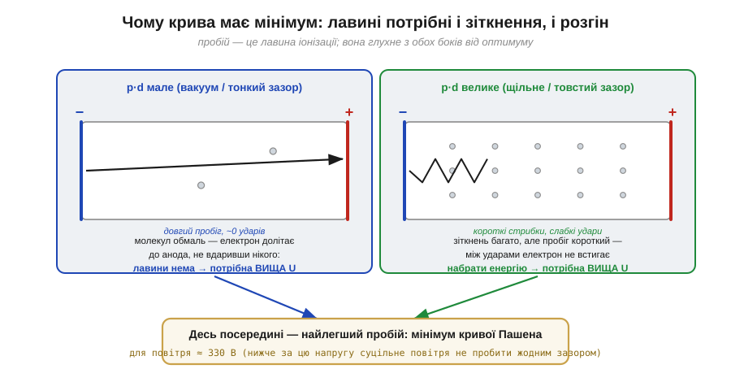
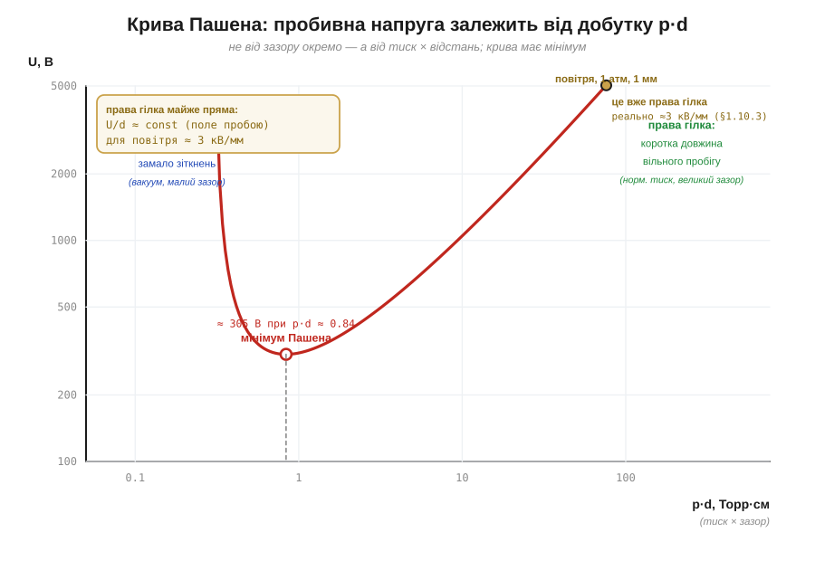

# 🧮 Крива Пашена: чому тонкий зазор пробити важче, ніж товстий

Зручне правило каже: повітря пробиває поле близько **3 кВ/мм** (*dielectric strength*, Eпр). Зручне — але оманливе, бо натякає, що пробивна напруга просто пропорційна зазору: подвоїв відстань — подвоїв напругу. Для міліметрів і сантиметрів так і є. А от на дуже малих зазорах (мікрометри між контактами роз'єму, щілина в корпусі) правило ламається: там пробити **важче**, ніж обіцяє 3 кВ/мм. Чому — пояснює крива Пашена (*Paschen curve*), і саме вона стоїть за роботою газових розрядників і за тим, чому мікросхеми вмирають від кіловольтів, а не від десятків вольтів.

### Означення: напруга пробою залежить не від зазору, а від добутку p·d

Фрідріх Пашен (*Friedrich Paschen*, німецький фізик) 1889 року виміряв напругу пробою в газі й знайшов несподіване: вона залежить не від тиску й зазору окремо, а **тільки від їхнього добутку**.

```
Uпр = f(p · d)
```

де **p** — тиск газу (*pressure*), **d** — відстань між електродами (*gap*). Одиниця добутку — Торр·см або Па·м. Це закон подібності (*similarity law*): розряд у вузькій щілині при високому тиску поводиться так само, як у широкому проміжку при низькому — аби збігся добуток p·d.

### Інтуїція: лавині потрібні і зіткнення, і розгін

Чому ж добуток, а не кожна величина окремо? Відповідь — у самому механізмі пробою. Пробій — це **електронна [лавина](root:ph-electromagnetism/air-breakdown)** (*Townsend avalanche*): вільний електрон розганяється полем, б'є молекулу, вибиває з неї ще один електрон, тих стає двоє, четверо, вісім. Щоб лавина пішла, кожному електронові треба на шляху до анода **і зустріти молекули** (бо інакше нема кого іонізувати), **і встигнути між ударами набрати енергію** на іонізацію. Добуток p·d — це фактично середня кількість зіткнень електрона на шляху через проміжок: тиск задає густину молекул, зазор — довжину дороги.


*Чому крива має мінімум. Ліворуч (мале p·d — вакуум або тонкий зазор) молекул обмаль: електрон пролітає наскрізь, майже нікого не вдаривши, лавини нема — потрібна вища напруга. Праворуч (велике p·d — щільне повітря або товстий зазор) зіткнень багато, але вільний пробіг короткий: між ударами електрон не встигає набрати енергію на іонізацію — знову потрібна вища напруга. Найлегший пробій — посередині.*

Звідси й форма: на обох кінцях напруга росте, а посередині є **мінімум**. Зліва пробити важко через нестачу зіткнень, справа — через нестачу розгону. Між ними є оптимальне p·d, де лавина зривається найлегше.

### Формальний апарат: формула й мінімум

Цю якісну картину двох тенденцій теорія Таунсенда (*Townsend*) доводить до замкненого вигляду:

```
            B · (p·d)
Uпр = ──────────────────────────
       ln(A · p·d) − ln[ ln(1 + 1/γ) ]
```

де A і B — сталі газу (для повітря приблизно A ≈ 15 (Торр·см)⁻¹, B ≈ 365 В/(Торр·см)), а **γ** — коефіцієнт вторинної емісії з катода (*secondary-emission coefficient*, типово 10⁻²). Сталі тут — підручникові, дібрані під околицю мінімуму; для точного інженерного розрахунку беруть таблиці конкретного газу.


*Крива Пашена для повітря (логарифмічна вісь p·d). Видно U-подібну форму з мінімумом. Ліва гілка круто йде вгору — там розряд глухне без зіткнень; права гілка майже пряма — на ній U/d ≈ const, тобто те саме «поле пробою» ≈3 кВ/мм. Робоча точка побуту (повітря, 1 атм, зазор 1 мм) лежить далеко праворуч від мінімуму, на прямій гілці.*

Найважливіше число — **координати мінімуму**. Для повітря пробивна напруга не падає нижче приблизно

```
Uпр(min) ≈ 327 В   при   p·d ≈ 0.57 Торр·см  (≈ 5.7 Торр·мм)
```

Це жорсткий поріг: **суцільне повітря неможливо пробити напругою, нижчою за ≈330 В**, хоч як підбирай зазор. Це наслідок самої фізики лавини, а не випадкове значення.

### Де це працює на практиці

Ця U-подібна крива з її жорстким порогом дає три практичні висновки.

Перше — вона **пояснює парадокс мікрозазорів**, з якого ми й почали. Правило «3 кВ/мм» працює лише на правій, майже прямій гілці (звичайні зазори при атмосферному тиску — саме там лежить робоча точка 1 атм/1 мм). Якщо зменшувати зазор далі, до десятків мікрометрів, рухаємося вліво до мінімуму — і напруга пробою не падає пропорційно, а впирається в ті самі ≈330 В. Тому близько розставлені контакти роз'єму захищають від іскри не так добре, як підказує лінійне правило.

Друге — це **фізична основа газового розрядника** (*gas discharge tube*, GDT): усередині — газ під підібраним тиском, тобто розрядник свідомо поставлено в околицю мінімуму Пашена, щоб він спрацьовував від відносно невисокої напруги.

Третє — мінімум Пашена пояснює, чому **вакуум і дуже низький тиск ізолюють краще**, ніж проміжне розрідження: на лівій гілці пробити проміжок важко. Той самий механізм лежить і за тим, чому [волога повітря](root:ph-electromagnetism/humidity-static-control) змінює поведінку статики — чому суху зиму вона любить більше за вологе літо.
