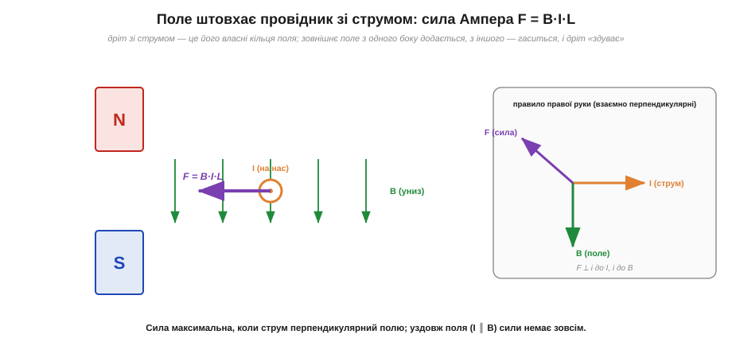
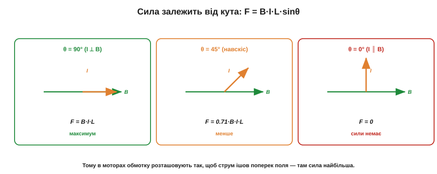
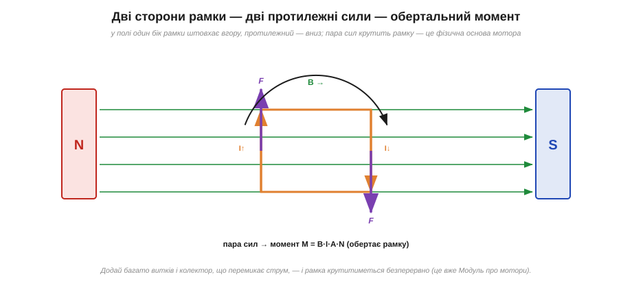

# Сила Ампера: поле штовхає провідник зі струмом

[Дослід Ерстеда](topic:ph-electromagnetism/oersted-experiment) показав, що струм **діє** на магнітну стрілку. Але якщо струм діє на магніт, то — за третім законом Ньютона — і магніт мусить діяти на струм. І справді: помістіть провідник зі струмом у магнітне поле — і поле штовхне цей провідник з цілком відчутною силою. Це **сила Ампера** (*Ampère force*, або сила Лапласа), і саме вона перетворює електрику на механічний рух. Без неї не було б жодного електродвигуна, жодного гучномовця, жодного стрілочного приладу. Розберімо її від першопричин.

### Чому поле штовхає струм

Інтуїцію дає проста картина. Провідник зі струмом оточений [власними кільцями магнітного поля](topic:ph-electromagnetism/oersted-experiment). Тепер накладемо на нього **зовнішнє** однорідне поле. З одного боку дроту власні кільця спрямовані **за** зовнішнім полем — там лінії згущуються, поле підсилюється. З протилежного боку власне поле спрямоване **проти** зовнішнього — там лінії розріджуються, поле слабшає. Виходить асиметрія: з одного боку дроту поле «густе», з іншого «рідке». А магнітні лінії, наче напнуті гумки, прагнуть випрямитись і розштовхнутись — тож вони **виштовхують** дріт із густого боку в рідкий. Дріт зазнає сили вбік.


*Провідник зі струмом у зовнішньому полі зазнає сили. З одного боку власне поле дроту додається до зовнішнього (густо), з іншого — гаситься (рідко); ця асиметрія «здуває» дріт убік. Сила F перпендикулярна і до струму I, і до поля B; її напрям дає правило правої руки (праворуч).*

Цей самий ефект можна (і строгіше) пояснити через силу, що діє на кожен рухомий заряд у дроті, — **силу Лоренца**. Але образ «густих і рідких ліній, що виштовхують дріт» дуже наочний і добре працює.

Найкрасивіший окремий випадок — **два паралельні дроти зі струмом**. Кожен дріт оточений [своїми кільцями поля](topic:ph-electromagnetism/oersted-experiment), і кожен опиняється в полі сусіда. Якщо струми течуть в **один** бік, дроти **притягуються**; якщо в **протилежні** — **відштовхуються**. (Зверніть увагу на красиву протилежність до зарядів: однакові заряди відштовхуються, а однаково напрямлені струми — притягуються.) Цей ефект настільки фундаментальний, що тривалий час саме через нього **означували ампер**: один ампер — це такий струм, що, течучи у двох паралельних дротах за метр один від одного, створює між ними силу 2 × 10⁻⁷ Н на кожен метр довжини. Тобто базова одиниця струму всього курсу історично спиралася саме на силу Ампера між дротами. Це й нагадування, наскільки глибоко магнетизм вшитий в основи електрики.

### Формула: F = B·I·L

Скільки ж сили? Експеримент дає просту відповідь. Сила тим більша, чим сильніше поле B, чим більший струм I і чим довший шматок дроту L перебуває в полі:

```
F = B · I · L          (коли струм перпендикулярний полю)
```

де **F** — сила (Н), **B** — індукція поля (Тл), **I** — струм (А), **L** — довжина провідника в полі (м). Формула гранично проста, і кожен множник інтуїтивний: більше поле — сильніше штовхає; більший струм — більше рухомих зарядів, на кожен діє сила; довший дріт — більше таких зарядів у полі. Власне, з цієї формули й означують саму одиницю поля: 1 тесла — це таке поле, що діє силою 1 ньютон на провідник завдовжки 1 метр зі струмом 1 ампер.

### Напрям сили й роль кута

Сила Ампера має дивовижну властивість: вона спрямована **не вздовж струму й не вздовж поля, а перпендикулярно їм обом**. Це знову задача для правої руки (одна з кількох її версій):

> Витягніть пальці правої руки за напрямом струму I, зігніть так, щоб вони повертали до поля B; тоді **відставлений великий палець** покаже напрям сили F. (Рівнозначно: F спрямована «вбік» від площини, у якій лежать I та B.)

А що, як струм **не** перпендикулярний полю? Тоді працює лише та складова поля, що поперек струму, і сила слабшає за синусом кута:

```
F = B · I · L · sinθ        (θ — кут між струмом і полем)
```


*Залежність сили від кута θ між струмом і полем. При θ = 90° (струм поперек поля) сила максимальна: F = B·I·L. При θ = 45° вона менша (множник sin45° ≈ 0.71). При θ = 0° (струм уздовж поля) сила **дорівнює нулю** — поле не діє на струм, що тече вздовж нього. Тому в моторах обмотку завжди ставлять так, щоб струм ішов поперек поля.*

Крайній випадок варто запам'ятати: **уздовж поля сили немає взагалі**. Струм, що тече паралельно B, поле не штовхає. Максимальна ж сила — коли струм строго поперек поля. Звідси пряме конструктивне правило: щоб дістати найбільшу силу (а отже, найпотужніший мотор), струм у робочих провідниках пускають **перпендикулярно** магнітному полю.

Чому ж саме поперечна складова працює, а поздовжня — ні? Пояснює це той самий механізм асиметрії. Сила народжується з того, що власні кільця поля дроту накладаються на зовнішнє поле асиметрично. Якщо струм тече **впоперек** B, кільця дроту орієнтовані так, що з одного боку чітко додаються до зовнішнього поля, а з іншого гасяться — асиметрія максимальна, виштовхування найсильніше. Якщо ж струм тече **вздовж** B, кільця дроту лежать у площині, перпендикулярній полю, і додаються до нього симетрично з усіх боків — асиметрії немає, виштовхувати нікуди. Тому поздовжній струм поле «не помічає». Цей самий висновок строго випливає з векторного добутку, але інтуїція з кільцями дає його без жодної формули.

> 🧮 **Математична вставка:** [векторний добуток — математика правил правої й лівої руки](topic:ph-electromagnetism/ampere-force/math-cross-product.md) — як одна операція F = I·L × B заміняє всі «правила руки» й автоматично дає і величину sinθ, і напрям.

### Від сили — до обертання: зародок мотора

Тепер найкрасивіше. Візьмемо не прямий дріт, а **рамку** (виток) зі струмом і помістимо її в поле. Дві протилежні сторони рамки несуть струм у **протилежних** напрямах. Отже, на одну сторону сила Ампера діє в один бік, а на протилежну — у другий. Дві рівні протилежно спрямовані сили, прикладені до різних боків рамки, утворюють **пару сил**, яка не зрушує рамку з місця, а **крутить** її.


*Рамка зі струмом у полі. На лівій і правій сторонах струм тече в протилежні боки, тож сили Ампера на них протилежні — виникає пара сил, що створює обертальний момент M = B·I·A·N (A — площа рамки, N — кількість витків). Це фізична основа електродвигуна: лишається додати багато витків і пристрій, що вчасно перемикає напрям струму.*

Ось вона — серцевина будь-якого електромотора. Рамка зі струмом у магнітному полі прагне **повернутися**. Чому ж потрібне перемикання струму? Бо рамка, повернувшись до положення, де її площина перпендикулярна полю, опиняється в **рівновазі**: пара сил тут уже не крутить, а лише розтягує рамку, і вона зупиняється. Щоб обертання тривало, треба саме в цю мить **змінити напрям струму** в рамці — тоді сили перекинуться, і рамка знову матиме момент, що жене її далі. Якщо додати багато витків (більше N — більший момент) і пристрій, що вчасно перемикає струм, — дістанемо двигун, що крутиться безперервно. Деталі цього перемикання — колектор у щіткових моторах, електронна комутація в безщіткових — це вже інженерія конкретних [двигунів](topic:hw-motion/brushed-dc-motor); тут важлива сама фізика: **поле + струм у рамці = обертальний момент**, а перемикання струму лише підтримує цей момент у потрібному напрямі.

> 🔧 **Навіщо це.** Сила Ампера — це фізичний двигун (буквально) усієї рухомої електроніки. Електромотори дрона, серводвигуни, вібромоторчик у телефоні, привід дисковода, котушка гучномовця, що штовхає дифузор у такт музиці, стрілка аналогового приладу, що відхиляється пропорційно струму, — усе це сила Ампера в дії. Розуміючи F = B·I·L, інженер відразу бачить, **від чого залежить тяга** мотора чи гучність динаміка (сильніший магніт, більший струм, більше витків) — і де межа, за якою обмотка просто перегріється.

**Приклад (сила на провіднику в полі магніту).** Прямий провідник завдовжки L = 4 см зі струмом I = 2 А лежить поперек поля B = 0.3 Тл (поле феритового магніту). Яка сила діє на нього?

```
струм перпендикулярний полю → sinθ = 1
F = B · I · L
F = 0.3 Тл · 2 А · 0.04 м
F = 0.024 Н   (≈ 2.4 грама-сили)
```

Сила скромна — близько ваги двох грамів. Але в реальному моторі чи гучномовці провідник згорнуто в котушку із сотень витків, тож сили складаються в сотні разів, а поле беруть сильніше (неодим, добре сфокусоване осердям) — і сумарна тяга стає цілком відчутною. Цей приклад показує, чому одиночний дріт «майже нічого не може», а котушка з багатьох витків у сильному полі рухає механізми.

### Два прямі застосування: гучномовець і стрілочний прилад

Силу Ампера варто побачити й у двох простих пристроях, що не потребують жодного обертання, — там вона працює найнаочніше.

**Гучномовець.** До легкого паперового дифузора прикріплено котушку (звукову котушку), що сидить у вузькому кільцевому зазорі сильного постійного магніту. Через котушку пускають **звуковий** струм — змінний струм, форма якого повторює звукову хвилю. За формулою F = B·I·L сила на котушці миттєво слідує за струмом: струм більший — сила більша, струм змінив знак — сила штовхнула в інший бік. Котушка з дифузором коливається точно в такт струму, штовхає повітря — і ми чуємо звук. Гучномовець — це майже буквальне втілення сили Ампера: електричний сигнал → сила → рух повітря.

**Стрілочний прилад.** В аналоговому амперметрі чи вольтметрі (магнітоелектричний механізм Вестона) котушка на осі сидить у полі постійного магніту й утримується спіральною пружинкою. Пропустиш струм — сила Ампера створює момент, що повертає котушку зі стрілкою; пружинка протидіє, і стрілка зупиняється під кутом, **пропорційним струму**. Так невидимий струм стає видимим відхиленням стрілки. Це теж чиста сила Ампера, тільки зрівноважена пружиною замість безперервного обертання.

**Приклад (тяга котушки мотора зі ста витків).** Та сама геометрія, що й вище (L = 4 см, B = 0.3 Тл), але тепер це котушка з N = 100 витків при струмі I = 1 А. Яка сумарна сила на одній стороні котушки?

```
кожен виток несе струм I у полі → сила на N витках складається
F = B · I · L · N
F = 0.3 Тл · 1 А · 0.04 м · 100
F = 1.2 Н   (≈ 120 грамів-сили)
```

Зі скромних двох грамів на одному дроті ми піднялися до 120 грамів-сили на стороні котушки — у сто разів, рівно як і число витків. А в моторі таких сторін дві (пара сил), поле часто сильніше за феритове, та й витків буває більше. Звідси ясно, як із кволого F = B·I·L одного провідника народжується відчутна механічна потужність реальних двигунів: усе вирішує множення на витки й добрий магнітний потік.

---
