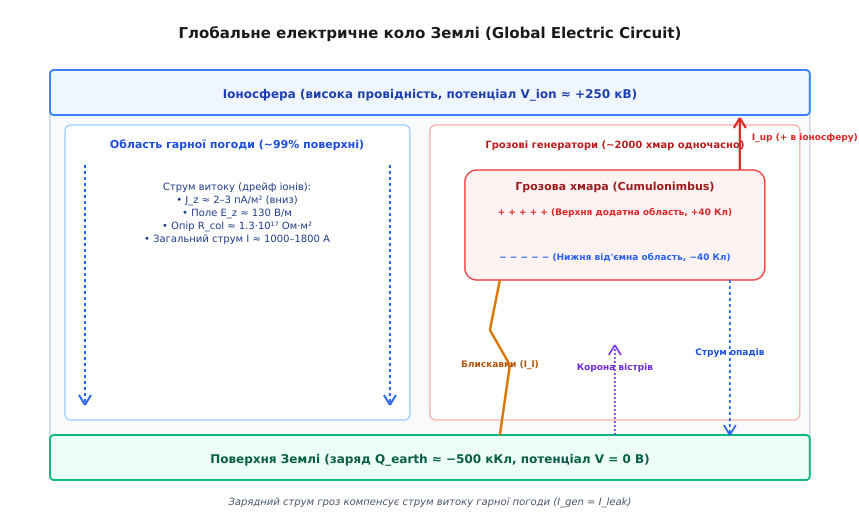
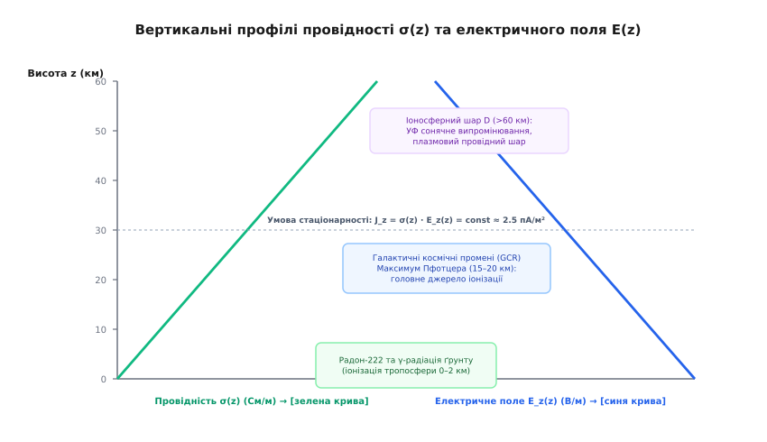
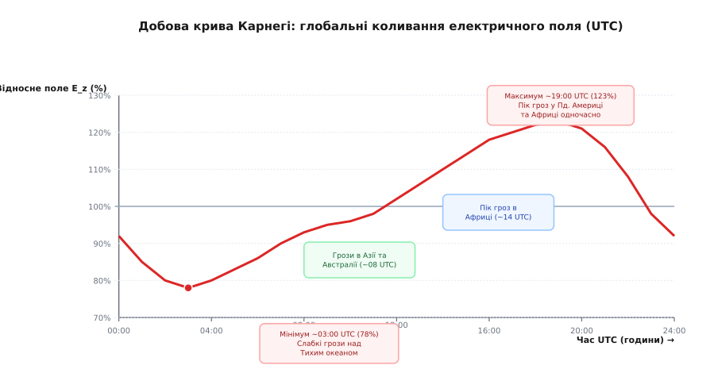
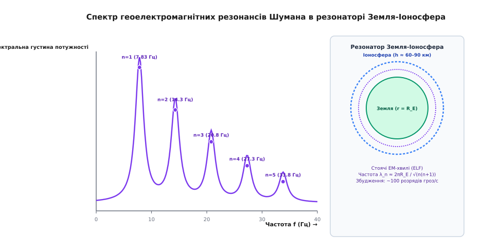

# Атмосферна електрика: глобальне коло, електричне поле та струм гарної погоди

<preknowlist>
- [Закон Кулона](topic:ph-electromagnetism/coulomb-law)
- [Електричне поле](topic:ph-electromagnetism/electric-field)
- [Електричний потенціал](topic:ph-electromagnetism/electric-potential)
- [Іонна провідність](topic:ph-electromagnetism/ionic-conduction)
- [Релаксація заряду](topic:ph-electromagnetism/charge-relaxation)
- [Блискавка](topic:ph-electromagnetism/lightning)
- [Коронний розряд](topic:ph-electromagnetism/corona-discharge)
- [Магнітне поле Землі](topic:ph-electromagnetism/earth-magnetic-field)
</preknowlist>

Якщо вставити два металеві стрижні в ґрунт на відстані ста метрів один від одного і підключити між ними чутливий мікроамперметр, прилад зафіксує неперервний слабкий струм. Повітря навколо нас, яке у шкільних підручниках описують як ідеальний діелектрик, насправді пронизане постійним вертикальним електричним полем із напруженістю близько 130 вольтів на кожен метр висоти. Від голови стоячої людини до її ніг виникає потенціальна різниця понад 200 вольтів.

Навіщо ж існує це поле і чому воно не розряджає Землю остаточно? За законами класичної електродинаміки, оскільки повітря має скінченну електропровідність за рахунок іонізації, від'ємний заряд поверхні Землі мусить повністю нейтралізуватися струмом витоку менш ніж за хвилину. Проте поле існує мільйони років. Відповідь на цю загадку криється в існуванні **Глобального електричного кола** (Global Electric Circuit) — гігантської планетної системи, у якій тисячі грозових хмар працюють як батареї, підтримуючи заряд Землі проти неперервного витоку в областях гарної погоди.

---

## 1. Глобальне електричне коло Землі

Землю разом із її атмосферою можна уявити як сферичний конденсатор величезних розмірів. Внутрішньою провідною обкладкою є поверхня суші та океанів (тверда Земля), а зовнішньою — нижня іоносфера (D-шар на висотах `60–90 км`). Простір між ними виповнений слабопровідним атмосферним газом, що виконує роль неоднорідного діелектрика.


*Схема Глобального електричного кола (GEC): грозові хмари виступають як генератори постійного струму, заряджаючи іоносферу до потенціалу +250 кВ відносно Землі, а в областях гарної погоди струм витоку неперервно стікає вниз.*

Електрична структура цього планетного контуру описується трьома основними елементами:

1. **Планетний потенціал іоносфери:** Нижня іоносфера має високу провідність завдяки сонячному ультрафіолетовому та рентгенівському випромінюванню. Вона вирівнює свій потенціал по всій кулі до значення `V_ion ≈ +250–500 кВ` відносно поверхні Землі.
2. **Грозові генератори (Thunderstorm Generators):** Потужні грозові хмари (*Cumulonimbus*) та мезомасштабні конвективні системи, що займають у кожен момент часу не більше 1% площі поверхні Землі, генерують вгору струми заряджання іоносфери, а вниз — струми переносу від'ємного заряду на землю.
3. **Області гарної погоди (Fair-Weather Regions):** Займають понад 99% планетного диска. На цих територіях за відсутності опадів та хмарності відбувається зворотне повільне витокування додатного заряду з іоносфери на Землю під дією постійного вертикального електричного поля.

Процес відкриття цієї планетної системи розгортався протягом двох століть завдяки експериментам Бенджаміна Франкліна, Шарля Кулона, Віктора Гесса та Чарльза Вільсона. Повний історичний шлях від перших шовкових зміїв до супутникових систем спостереження наведено у [вставці про історію відкриття Глобального кола](topic:ph-electromagnetism/atmospheric-electricity/hist-global-circuit.md).

### Механізм розділення зарядів у грозових хмарах

Як саме грозова хмара стає природною електростанцією? Усередині конвективної хмари при висхідних потоках повітря зі швидкістю `10–30 м/с` відбувається розділення мас та електростатичних зарядів. Внаслідок неіндукційного механізму заряджання під час зіткнень легких кристалів криги та важких гранул граду (*graupel*) у присутності переохолоджених крапель води при температурах від `−10 °C` до `−20 °C`:

- Легкі кристали криги заряджаються **позитивно** і виносяться восхідним потоком у верхню частину хмари (ковадлу) на висоти `8–12 км`.
- Важкі гранули граду заряджаються **негативно** і осідають під дією гравітації у середню частину хмари на висоти `4–7 км`.
- Біля основи хмари (`1–2 км`) часто формується невеликий локальний додатний заряд.

Фізична природа неіндукційного заряджання полягає у переносі носіїв заряду (протонів та іонів `OH⁻` і `H₃O⁺`) через рідку квазірідку плівку на поверхні гранули граду під час короткочасного контакту з кристалом криги. Напрямок переносу заряду задається критичною **температурою реверсу заряду** `T_rev ≈ −15 °C`: при температурах, холодніших за `T_rev`, град заряджається від'ємно, а при тепліших температурах біля основи хмари — позитивно.

### Внутрішня триполярна структура та екранні шари

Макроскопічно грозова хмара являє собою електростатичний триполь:
- **Верхній додатний зарядний центр:** `+20...+50 Кл` на висотах `8–12 км` (температура від `−30 °C` до `−50 °C`).
- **Основний негативний зарядний центр:** `−20...−50 Кл` на висотах `4–7 км` (температура від `−10 °C` до `−25 °C`).
- **Нижній позитивний зарядний центр:** `+5...+10 Кл` на висотах `1.5–3 км` (температура від `0 °C` до `−10 °C`).

На зовнішніх межах грозової хмари під дією сильнійшого внутрішнього електричного поля виникають так звані **екранні шари** (*screening layers*). Вільні іони з навколишнього слабопровідного повітря приваблюються до країв хмари: додатні іони осідають на негативній нижній межі, а від'ємні іони формують тонку екранну плівку поверх верхньої додатної ковадли.

### Ініціація розрядів космічними променями (Runaway Breakdown)

Звичайне пробійне поле сухого повітря біля землі становить близько `3000 кВ/м`, проте макроскопічні вимірювання всередині грозових хмарах показують максимуми полів не більше `100–300 кВ/м`. Для пояснення винінення блискавки за таких відносно низьких полів академік Олександр Гуревич запропонував концепцію **пробою на втікаючих електронах** (*Relativistic Runaway Electron Avalanche, RREA*).

Первинні космічні промені надвисоких енергій народжують у хмарі високоенергетичні електрони з енергією `> 0.1 МеВ`. У полі хмари з напруженістю понад `E_th ≈ 280 кВ/м` гальмівні втрати електрона стають меншими за енергію, отримувану від поля. Електрон прискорюється («втікає»), іонізуючи нові молекули та створюючи ураганну релятивістську лавину електронів, яка знижує пробійний поріг повітря в 10 разів і ініціює стримерний канал блискавки.

### Електричний баланс струмів генератора

Струми, що замикають грозовий генератор у загальне планетне коло, складаються з чотирьох основних компонент:
- **Розряди блискавок «хмара-земля» (−CG):** Переносять від'ємний заряд біля `20–30 Кл` з основи хмари на поверхню Землі. Сукупний струм блискавок по всій кулі дає вклад близько `200–300 А`.
- **Струми коронного розряду (Point Discharge Currents):** Напруженість електричного поля під грозовою хмарою досягає `5–10 кВ/м`, що викликає коронний розряд («вогні Святого Ельма») із загострених предметів, дерев та веж. Цей струм стікає з землі вгору до основи хмари, переносячи додатний заряд і компенсуючи виток гарної погоди на `400–600 А`.
- **Струми провідності вгору до іоносфери:** Від верхнього додатного полюса хмари крізь розріджене стратосферне повітря тече постійний дрейфовий струм провідності `I_up ≈ 0.5–1.5 А` від кожної грози.
- **Струми осаду та конвекції:** Заряджені краплі дощу та град переносять позитивний та негативний заряд механічним шляхом під дією сили тяжіння.

### Сонячно-земні зв'язки та висипання релятивістських електронів

На стан Глобального електричного кола суттєво впливають геомагнітні бурі. Під час збурень магнітосфери відбувається висипання релятивістських електронів із зовнішнього радіаційного поясу Землі (Relativistic Electron Precipitation, REP) у високих широтах. Ці високоенергетичні електрони проникють у стратосферу до висот `20–30 км`, створюючи додаткову іонізацію, що знижує опір полярних колон атмосфери і перерозподіляє лінії струму Глобального кола між екватором та полюсами.

---

## 2. Електрика гарної погоди: провідність, поле та струм

У метеорології та геофізиці під **умовами гарної погоди** (*fair-weather conditions*) розуміють атмосферний стан за відсутності опадів, гроз, туману, низької хмарності (понад 3 бали) та сильного вітру (понад `6 м/с`). У цих областях електричні процеси визначаються квазістаціонарним струмом витоку.


*Вертикальний профіль провідності повітря σ(z) та напруженості електричного поля E_z(z) від поверхні Землі до іоносфери (60 км).*

### Джерела іонізації та мікроскопічна провідність

Чистий сухий газ є діелектриком. Електропровідність повітря `σ` зумовлена наявністю легких іонів — молекулярних комплексів із 4–12 нейтральних молекул води, згрупованих навколо одного центрального іона `H₃O⁺` або `O₂⁻`. Рухливість таких легких іонів біля землі становить `b ≈ 1.3–1.8 · 10⁻⁴ м²/(В·с)`.

Основні джерела іонізації повітря розділені за висотою:
1. **Приземний шар (`0–2 км`):** Головним джерелом є альфа-, бета- та гамма-випромінювання радіоактивних ізотопів радону (`²²²Rn`), торону (`²²0Rn`) та їхніх продуктів розпаду, що виділяються з ґрунту, а також природна земна радіоактивність рок-порід. Швидкість утворення іонів у приземному шарі становить `q_ion ≈ 5–10 іон/см³·с`.
2. **Стратосфера та тропосфера (`2–60 км`):** Радон швидко розпадається (період напіврозпаду `²²²Rn` становить 3.82 доби) і не піднімається високо. Тут єдиним іонізатором виступають **первинні космічні промені** — високоенергетичні протони та альфа-частинки галактичного походження. Вони народжують каскади вторинних частинок (мюонів, електронів), досягаючи максимуму іонізації на висоті 15–20 км (максимум Пфотцера).

Узагальнена динаміка концентрації легких іонів `n` задається рівнянням іонізаційного балансу Томсона:

```
dn / dt = q_ion − α · n² − β · n · N_aerosol
```

де `α ≈ 1.6·10⁻⁶ см³/с` — коефіцієнт рекомбінації легких іонів, а `β` — коефіцієнт приєднання легких іонів до нейтральних аерозольних частинок із концентрацією `N_aerosol`. 

У чистому океанічному повітрі (`N_aerosol → 0`) концентрація іонів задається рівновагою `n = √(q_ion / α) ≈ 500–800 іон/см³`. У міському або пиловому повітрі приєднання до аерозолів переважає, утворюючи важкі аерозольні іони Ланжевена з низькою рухливістю, що зменшує провідність приземного повітря у 3–5 разів.

### Сонячна циклічність та ефект Форбуша

На провідність стратосфери відчутно впливає 11-річний цикл сонячної активності. Під час сонячного максимуму посилене міжпланетне магнітне поле Сонця ефективніше відхиляє галактичні космічні промені (ефект Форбуша). Це призводить до падіння швидкості іонізації `q_ion` у стратосфері на 5–10%, що викликає відповідне зменшення провідності `σ(z)` та тимчасове зростання загального опору планетного кола `R_global`.

### Експоненціальний профіль полів та струм витоку

Оскільки в областях гарної погоди струм витоку є стаціонарним, густина вертикального струму `J_z` має бути строго постійною по всій висоті атмосферного стовпа (`dJ_z / dz = 0`):

```
J_z = σ(z) · E_z(z) = const ≈ −2.5 · 10⁻¹² А/м²
```

Звідси випливає фундаментальний фізичний зв'язок: там, де провідність атмосфери `σ(z)` мала (біля поверхні), напруженість електричного поля `E_z(z)` мусить бути максимальною. Навпаки, у високопровідній стратосфері поле спадає майже до нуля:

```
E_z(z) = E₀ · exp(−z / h_σ)
```

де `h_σ ≈ 6.0 км` — характерна висота однорідності атмосферної провідності, а `E₀ ≈ 125–130 В/м` — напруженість поля біля землі.

Повний опір вертикального атмосферного стовпа перерізом `1 м²` від землі до іоносфери називається **опором колони** (`R_col ≈ 1.3·10¹⁷ Ом·м²`). 

### Ефект приземного електрода (Electrode Effect)

Оскільки земля є твердим провідним електродом, вона не випромінює від'ємних іонів у повітря. Під дією вертикального поля гарної погоди (`E_z < 0`) додатні іони дрейфують зверху вниз і осідають на поверхню, тоді як від'ємні іони рухаються вгору. Це створює у найнижчому шарі атмосфери товщиною `1–10 м` дефіцит від'ємних іонів і виникнення додатного об'ємного заряду `ρ₀ ≈ +1.92 пКл/м³`.

Точний математичний вивід профілів провідності, потенціалу `V(z)`, опору колони, часу релаксації заряду `τ = ε₀ / σ` та приземного ефекту електрода детально розібрано у [вставці математичної моделі атмосферної провідності](topic:ph-electromagnetism/atmospheric-electricity/math-fair-weather-model.md).

---

## 3. Крива Карнегі та добова ритміка планетного поля

Одне з найяскравіших доказів існування єдиного Глобального електричного кола було отримано під час океанічних експедицій науково-дослідного вітрильного судна «Карнегі» (Carnegie) у 1915–1929 роках.


*Крива Карнегі: добова варіація напруженості електричного поля гарної погоди у світовому часі (UTC) та внесок трьох головних світових грозових центрів.*

Вчені виявили, що якщо вимірювати напруженість приземного електричного поля `E_z` у чистому океанічному повітрі далеко від промислових забруднень, його добовий хід **не залежить від місцевого сонячного часу**, а строго підпорядковується єдиній часовій шкалі — світовому координованому часу (UTC).

Ця крива, названа **кривою Карнегі**, має чіткий мінімум близько 03:00 UTC та глобальний максимум близько 19:00 UTC, коли напруженість поля зростає приблизно на 15–20% від середнього значення.

### Фізична причина кривої Карнегі

Причина добового колівання поля полягає у добовому ході обертання Землі відносно сонячного термінатора та нерівномірному розподілі материків по географічній довготі. Площа грозових осередків на суші в десятки разів перевищує грозову активність над океанами. Глобальний струм грозових генераторів підпорядковується добовому розвитку термічної конвекції над трьома головними материковими масивами:

1. **Азіатсько-Австралійський центр (пік о 08:00 UTC):** Конвекційні грози спалахують у тропіках Східної Азії, Індонезії та Австралії.
2. **Африканський центр (найпотужніший пік о 14:00 UTC):** Сонячний полудень над Африкою та Європою викликає масований розвитку грозових хмар над екваторіальною Африкою.
3. **Американський центр (найширший пік о 19:00 UTC):** Полудень над Південною та Північною Америкою створює колосальний грозовий масив над басейном Амазонки та Кордильєрами.

О 03:00 UTC сонячний полудень припадає на безкрайній Тихий океан, де континентальна конвекція відсутня, тому загальна кількість грозових хмар на всій планеті стає мінімальною (`~1500` одночасних гроз проти `~2500` о 19:00 UTC). Відповідно, падає струм заряджання іоносфери, що миттєво відбивається на напруженості поля гарної погоди по всій Землі.

### Відмінність вимірювань на суходолі та в океані

На відміну від відкритих океанів, вимірювання напруженості поля на суходолі сильно спотворюються місцевим добовим ходом аерозольного забруднення, сухим пилом та турбулентним перемішуванням. У денні години розігрів поверхні Землі створює потужні конвекційні вихори, які піднімають приземний додатний об'ємний заряд (ефект електрода) на висоту кількох сотень метрів (шар турбулентного обміну). Це створює локальний максимум напруженості поля у місцевий полудень, який не пов'язаний із глобальною кривою Карнегі.

---

## 4. Геоелектромагнітні резонанси Шумана

У 1952 році німецький фізик Вінфрід Отто Шуман теоретично передбачив, що провідна поверхня Землі та провідна іоносфера утворюють сферичний хвилеводний резонатор для наднизькочастотних (ELF) електромагнітних хвиль. 

Джерелом збудження хвиль у цьому резонаторі є ті самі розряди блискавок, які щомиті спалахують по всій кулі (близько 50 розрядів щосекунди). Електромагнітний імпульс від кожної блискавки огинає Землю вздовж екватора і повертається у вихідну точку, утворюючи стоячі хвилі.


*Спектральна густина потужності резонансів Шумана з характерними піками на частотах 7.83 Гц, 14.3 Гц, 20.8 Гц, 27.3 Гц та 33.8 Гц.*

### Спектр та власні частоти стоячих хвиль

Для ідеального безвтратного сферичного резонатора власні частоти гармонік задаються математичною формулою:

```
f_n = (c / (2 · π · R_E)) · √(n · (n + 1))
```

де `c` — швидкість світла, `R_E` — радіус Землі, а `n = 1, 2, 3...` — номер гармоніки. 

Проте через кінцеву електропровідність іоносфери та витоки енергії у тропосферу швидкість поширення ELF-хвиль виявляється трохи меншою за швидкість світла у вакуумі. Це зміщує реальні резонансні частоти приблизно на 25–30% вниз від теоретичних значень.

Експериментально виміряні пікові частоти резонансів Шумана становлять:
- **1-ша гармоніка (фундаментальна):** `f₁ = 7.83 Гц` (довжина хвилі дорівнює довжині кола Землі `~40 000 км`).
- **2-га гармоніка:** `f₂ = 14.3 Гц`.
- **3-тя гармоніка:** `f₃ = 20.8 Гц`.
- **4-та гармоніка:** `f₄ = 27.3 Гц`.
- **5-та гармоніка:** `f₅ = 33.8 Гц`.

Добротність земного резонатора є відносно низькою (`Q ≈ 4–6`), що вказує на швидке згасання хвиль через дисипацію у D-шарі іоносфери. Проте неперервний характер грозової діяльності на Землі підтримує постійний спектральний шум на цих частотах.

Розробку вбудованого модуля цифрової обробки сигналів (DSP) мовами C та C++ для автоматичного розрахунку спектрів Шумана, пригнічення завади 50 Гц та виділення резонансних піків детально описано у [практичній вставці моніторингу резонансів Шумана](topic:ph-electromagnetism/atmospheric-electricity/proj-schumann-monitor.md).

---

## 5. Висотно-атмосферні розряди (TLEs)

Тривалий час вважалося, що всі розряди атмосферної електрики зосереджені у тропосфері — від поверхні Землі до верхівок хмар (`0–15 км`). Проте наприкінці XX століття високочутливі камери нічного бачення та космічні спостереження відкрили цілий клас електричних розрядів у мезосфері та стратосфері — **висотно-атмосферні розряди** або **транзієнтні світлові явища** (*Transient Luminous Events, TLEs*).

### Основні типи мезосферних спалахів

1. **Спрайти (Sprites):** Величезні слабкосвітія червоного кольору, що виникають на висотах `50–90 км` безпосередньо над потужними грозовими масивами через `1–10 мс` після сильного позитивного розряду блискавки «хмара-земля» (+CG). Позитивний розряд нейтралізує велику масу від'ємного заряду у хмарі, створюючи у верхній атмосфері імпульсне квазістаціонарне електричне поле, яке перевищує поріг стримерного пробою розрідженого повітря за законом Пашена.
2. **Ельфи (Elves):** Світлові кільця, що швидко розширюються у діаметрі до 300–500 км на нижній межі іоносфери (`80–100 км`). Вони викликані нагріванням та збудженням молекул азоту під дією потужного електромагнітного імпульсу (EMP), випроміненого вертикальним каналом блискавки.
3. **Блакитні струмені (Blue Jets):** Вузькі конуси яскраво-синього світла, що вистрілюють вгору від верхівок грозових хмар і проростають крізь стратосферу до висоти `40–50 км` зі швидкістю близько `100 км/с`. Вони являють собою класичні концентровані стримерні розряди між додатним зарядом вершини хмари та негативним об'ємним зарядом стратосфери.
4. **Гігантські струмені (Giant Jets):** Рідкісні грандіозні розряди, що пробивають усю товщу атмосфери від верхівки грозової хмари (15 км) безпосередньо до нижньої межі іоносфери (90 км), здійснюючи пряме електричне коротке замикання між генератором та обкладкою планетного конденсатора.

---

## 6. Електрика пилових бур, вулканічних плюмів та авіаційна безпека

Атмосферна електрика виникає не лише під час класичних дощових гроз, а й у цілому ряді екстремальних геофізичних процесів та технічних ситуацій.

### Електризація пилових бур та пилових вихорів (Dust Devils)

У сухих пустелях тертя піщин одна об одну при вітровому перенесенні створює потужний **трибоелектричний ефект**. Завдяки тому, що дрібні пилинки заряджаються негативно і піднімаються восхідними потоками повітря вгору, а важкі піщинки заряджаються позитивно і лишаються біля землі, у песчаних бурях та пилових вихорах (*dust devils*) виникають вертикальні електричні поля напруженістю до `10–20 кВ/м` навіть за абсолютно безхмарного неба.

### Вулканічні блискавки

Під час по потужних вибухових вулканічних вивержень викинутий попіл, краплі лави та гази утворюють щільний вулканічний плюм. Інтенсивне трибоелектричне тертя між частинками попелу різного дисперсного складу генерує потужне електричне поле. У результаті усередині вулканічного плюму та над жерлом вулкана спалахують сітки вулканічних блискавок, які переносять заряд на землю та компенсують електризацію плюму.

### Електризація літаків у польоті (Aircraft Charging)

Під час польоту літака крізь хмари, крижаний пил або сухий сніг тертя обшивку судна об атмосферні частинки викликає трибоелектричне заряджання планера. Потенціал літака відносно навколишнього повітря може досягати `100–500 кВ`. 

Цей заряд створює сильний коронний розряд із гострих крайових поверхонь фюзеляжу та кінців крил, який генерує інтенсивні радіозавади на бортові системи зв'язку та навігації. Для безпечного скидання статичного заряду у повітря на задніх крайках крил та кіля встановлюють спеціальні **статичні розрядники** (*static dischargers*) — вугільні або металеві гноти з високим опором. Сучасні пасажирські літаки з композитними планерами (з вуглепластику) мають впресовану в поверхню мідну або бронзову сітку, що виконує роль клітки Фарадея, розсіюючи струми блискавки амплітудою до `200 кА` без деструктивного руйнування фюзеляжу.

### Сейсмо-електромагнітні аномалії

За 1–3 доби до руйнівних землетрусів над сейсмічно активними розломами земної кори спостерігаються характерні електричні аномалії. Механічний напруг гірських порід генерує напівпровідникові струми позитивних дірок (p-holes), а тріщиноутворення викликає підвищений вихід радіоактивного радону. Зростання приземної іонізації та модифікація об'ємного заряду змінюють напруженість приземного електричного поля `E_z` та генерують імпульсне ULF/ELF випромінювання, що слугує провісником тектонічних поштовхів.

### Вплив аварійних радіоактивних викидів

Трагічні техногенні аварії на АЕС (Чорнобиль 1986 року, Фукусіма 2011 року) надали сумний, але унікальний матеріал для перевірки теорії атмосферної провідності. Викид великих обсягів радіоактивних ізотопів (`¹³⁷Cs`, `¹³¹I`, `⁹⁰Sr`) у повітря викликав різкий сплеск приземної іонізації `q_ion` у тисячі разів. 

У результаті питома провідність приземного повітря `σ₀` поблизу аварійних зон зросла на кілька порядків, що призвело до локального падіння напруженості приземного поля гарної погоди `E_z` практично до нуля. Вимірювання `E_z` стало одним із дистанційних методів картографування радіоактивних хмар.

---

## 7. Методи вимірювання, стандарти та практичні застосування

Дослідження атмосферної електрики має важливе практичне значення для метеорології, авіації, космічної фізики та кліматології.

### Прилади для вимірювання атмосферного поля та стандарти розгортання

Для точної реєстрації напруженості приземного електричного поля без спотворення вимірювань власним зарядом приладу використовують **обертові флуксметри** або **мельниці полів** (*field mills*).

Прилад складається з заземленого секторного металевого ротора, який обертається електродвигуном і почергово перекриває та відкриває статорні вимірювальні електроди. Електричне поле Землі індукує на відкритому статорі змінний заряд `q_ind(t) = ε₀ · E_z · S(t)`. Струм індукції `i = dq/dt` перетворюється у змінну напругу, амплітуда якої є строго пропорційною напруженості атмосферного поля `E_z`.

Згідно зі стандартами Всесвітньої метеорологічної організації (WMO), вимірювачі напряженості поля розміщують на відкритому майданчику розміром не менше `50 × 50 метрів` без високих дерев, споруд та ліній електропередач у радіусі 100 метрів. Для усунення геометричного спотворення ліній поля датчик монтують урівень із поверхнею Землі у заземленому колодязі (Flush-Mounted Sensor) або застосовують строго розрахований коефіцієнт формозміни електричного поля.

### Глобальна грозопеленгація та космічний моніторинг

Мережі радіопеленгації блискавок (такі як WWLLN — World Wide Lightning Location Network або NLDN) використовують реєстрацію імпульсних радіохвиль наднизького діапазону (атмосфериків), випромінюваних розрядами блискавок. Шляхом вимірювання часу приходу сигналу (Time of Arrival, TOA) на кілька рознесених по кулі станцій обчислюються координати кожного розряду з точністю до сотень метрів. Бортові системи літаків (наприклад, Stormscope) вимірюють імпульсні магнітні та електричні поля на частотах `50 кКц–1 МГц`, визначаючи відстань та азимут до грозового осередка в радіусі до 300 км.

Окрім наземних мереж, сучасна геофізика активно використовує супутникові оптичні датчики:
- **LIS (Lightning Imaging Sensor):** Оптичний монітор блискавок, що працював на орбітальній станції МКС та супутнику TRMM.
- **GLM (Geostationary Lightning Mapper):** Оптичний картограф блискавок на метеорологічних супутниках серії GOES, який реєструє сукупну частоту спалахів у Північній та Південній Америці в реальному часі.

### Модуляція колу явищами El Niño та загрози глобального потепління

Міжрічні кліматичні коливання океанічних течій у Тихому океані (El Niño / La Niña) викликають глобальне переміщення осередків глибокої тропічної конвекції. Під час фази Ель-Ніньйо посилення грозової діяльності над Східним Тихим океаном призводить до збільшення амплітуди кривої Карнегі та підвищення напруженості фундаментальної гармоніки Шумана `7.83 Гц`.

Таким чином, напруженість електричного поля гарної погоди та амплітуда резонансів Шумана виступають у ролі високочутливого «глобального індикатора» стану кліматичної системи Землі. Безперервний спектральний моніторинг Глобального електричного кола дозволяє науковцям оцінювати динаміку планетарного енергетичного балансу в умовах глобальних кліматичних змін та вивчати взаємозв'язок сонячно-земної фізики.
