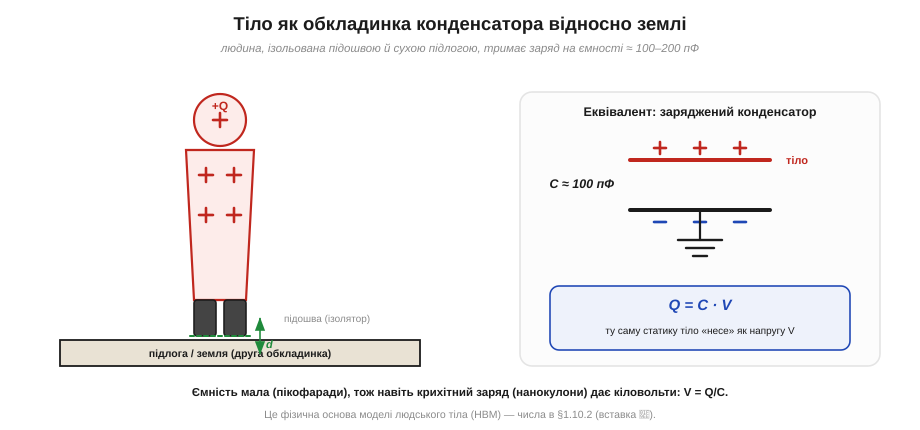
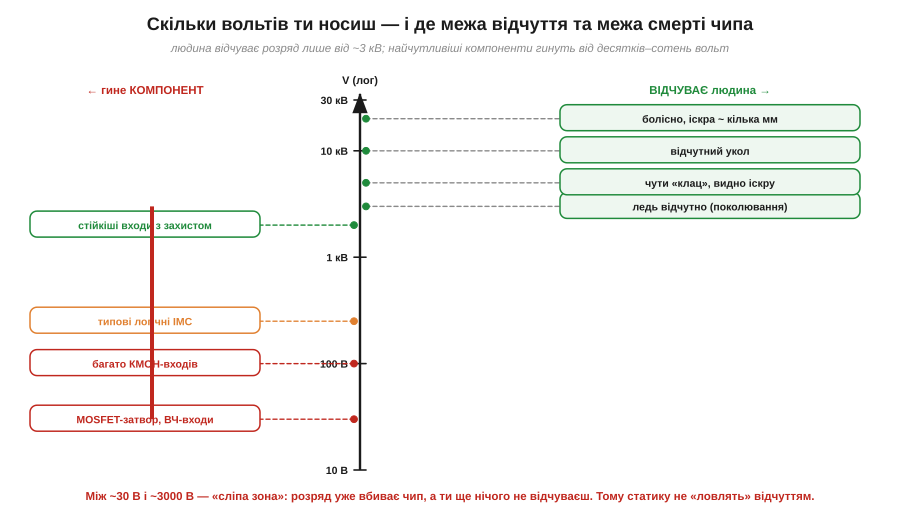

# Тіло як накопичувач заряду: скільки вольтів ти носиш

На тілі легко накопичується [заряд від тертя](topic:ph-electromagnetism/triboelectricity). Тоді постає, мабуть, найдивовижніше питання всієї статики: якщо на тобі заряд, то **під якою ти напругою**? Відповідь шокує новачка: ходячи по килиму, людина легко набирає напругу в **кілька, а то й десятки кіловольтів** — більшу, ніж на високовольтній лінії в під'їзді. І при цьому нічого не відчуває. Як таке можливо? Розгадка — у тому, що тіло поводиться як **конденсатор** дуже малої ємності, а на малій ємності навіть крихітний заряд дає велетенську напругу. А ще — у тому, що людське відчуття й чутливість мікросхеми лежать у зовсім різних діапазонах напруг.

### Тіло — це обкладинка конденсатора відносно землі

Щоб зв'язати заряд із напругою, скористаймося ключовим фактом: будь-які два провідники, розділені ізолятором, утворюють конденсатор. Тіло людини — непоганий провідник (солона вода й [іони, що переносять струм](topic:ph-electromagnetism/ionic-conduction)). Земля (підлога, будівля, ґрунт) — теж провідник. А між ними — **ізолятор**: підошва взуття, сухий килим, повітря.


*Людина, ізольована від землі підошвою й сухою підлогою, — це заряджена обкладинка конденсатора з ємністю близько 100–200 пФ. Заряд Q, що сидить на тілі, пов'язаний із напругою V простим співвідношенням Q = C·V. Мала ємність означає велику напругу за малого заряду.*

Зв'язок між зарядом і напругою конденсатора — це фундаментальне Q = C·V, де коефіцієнт C і є [ємністю](topic:ph-electromagnetism/capacitance). Перепишемо його, щоб знайти напругу:

```
V = Q / C
```

І ось де ховається весь фокус. Ємність тіла **C мала** — близько 100 пФ (пікофарад, 100 × 10⁻¹² Ф). А заряд від тертя хоч і малий у кулонах, але це все ж нанокулони. Поділи нанокулони на пікофаради — і отримаєш кіловольти. Мала ємність — це підсилювач напруги: вона перетворює дрібний заряд на величезну різницю потенціалів.

**Приклад (скільки вольтів дає типовий заряд тіла).** Хай після ходи по килиму на тілі Q = 0.3 мкКл, а ємність тіла C = 100 пФ. Яка напруга?

```
V = Q / C
V = (0.3 × 10⁻⁶ Кл) / (100 × 10⁻¹² Ф)
V = (0.3 × 10⁻⁶) / (1.0 × 10⁻¹⁰)
V = 3000 В = 3 кВ
```

Три кіловольти — від простої ходи. А вставання з крісла з його 0.5 мкКл дало б уже 5 кВ. Це не екзотика, а буденність сухого зимового дня.

> 🔧 **Навіщо це.** Ємність тіла — не абстракція: вона лежить в основі **моделі людського тіла** (*Human Body Model, HBM*) — стандартного способу описувати ESD-удар «з пальця». У HBM тіло — це конденсатор ≈100 пФ, заряджений до кількох кіловольтів, що розряджається через опір ≈1.5 кОм (опір руки й шкіри). Саме на цю модель розраховують захист входів мікросхем, і саме її числа (100 пФ, 1.5 кОм) задають форму й силу удару. Докладніше — у вставці 🧮 [Модель людського тіла (HBM)](topic:ph-electromagnetism/body-charge/math-hbm.md).

### Звідки беруться саме 100 пФ і чому це число «плаває»

Природно спитати: чому ємність тіла саме така — близько сотні пікофарад? Точне число залежить від геометрії «конденсатора» тіло–земля: від площі, оберненої до землі, і від «зазору» між ними (товщини й матеріалу підошви, відстані до заземлених предметів). Тіло — велике, тож площа чимала; але й «обкладинки» рознесені, та й форма складна, тож виходить порядок сотні пікофарад, а не мікрофаради. Грубо кажучи, людина — це конденсатор «розміром із людину», і пікофаради тут — природний масштаб.

Важливо, що ця ємність **не стала**: вона помітно міняється від пози й оточення. Підніми руку до заземленого приладу — площа «навпроти землі» збільшиться, ємність зросте. Сядь — зміниться і площа, і зазор. Підійди впритул до великого заземленого корпусу — ємність між тобою й ним додасться. Через те саму людину описують діапазоном (типово 100–250 пФ), а не одним числом. Для нас тут важливий не точний фарад, а наслідок: **ємність мала й мінлива**, тож напруга на тілі — теж велика й мінлива, і покладатись на «зараз я, мабуть, не дуже заряджений» не можна.

Є й корисний бік цієї мінливості. Коли заряджена людина **наближає** палець до виводу (заземленого чи з'єднаного з великою масою), ємність між пальцем і ціллю стрімко зростає в останні міліметри. А заряд при підльоті ще майже сталий, тож напруга V = Q/C на цьому проміжку **падає** — але поле в зазорі все одно встигає сягнути [порога пробою повітря](topic:ph-electromagnetism/air-breakdown), і розряд стрибає за частку міліметра до дотику. Саме тому ESD часто «б'є» ще до фізичного контакту: остання ділянка зближення — це різка зміна ємності.

Зробимо ще один корисний висновок із малості ємності — про те, як **легко** тіло заряджається до небезпечних напруг. Мала ємність означає, що тілу не треба «багато заряду», аби набрати кіловольти: достатньо нанокулонів, які дає одна-єдина дія [тертя](topic:ph-electromagnetism/triboelectricity). Інакше кажучи, тіло — це не лише підсилювач напруги, а й **дуже легка мішень** для заряджання: кілька кроків по килиму, і ти вже під кіловольтами. Великий конденсатор довелося б довго «накачувати»; крихітну ємність тіла наповнює до небезпечного рівня будь-який дріб'язок. Тому статика на людині — не рідкісна подія, а майже постійний фоновий стан, що його доводиться весь час «здувати» заземленням.

### Мала ємність як підсилювач напруги: ще один погляд

Щоб закріпити головну інтуїцію, погляньмо на V = Q/C з іншого боку — через **[енергію конденсатора](topic:ph-electromagnetism/capacitor-energy)**, поки що якісно. Той самий заряд на малій ємності «коштує» більшої напруги — буквально тому, що заштовхати наступну порцію заряду на маленьку обкладинку дедалі важче: однойменні заряди тісняться й сильно відштовхуються ([закон Кулона](topic:ph-electromagnetism/coulomb-law)). Велика обкладинка «розводить» заряди далеко один від одного, і напруга росте повільно; мала тримає їх близько, тож кожна нова порція швидко піднімає потенціал. Звідси й образ: **малий конденсатор — це підсилювач напруги**, що з мізерного заряду робить кіловольти.

**Приклад (та сама дія, інша ємність).** Хай людина набрала Q = 0.3 мкКл. Порівняймо напругу для «звичайної» пози (C = 100 пФ) і для пози ближче до заземленого приладу (C = 250 пФ):

```
V₁ = Q / C₁ = (0.3 × 10⁻⁶) / (100 × 10⁻¹²) = 3000 В = 3 кВ
V₂ = Q / C₂ = (0.3 × 10⁻⁶) / (250 × 10⁻¹²) = 1200 В = 1.2 кВ
```

Той самий заряд дав то 3 кВ, то 1.2 кВ — лише через зміну ємності. Це ще раз нагадує, що «скільки вольтів ти носиш» — величина рухома, і єдиний надійний спосіб тримати її низькою — це **постійно стікати заряд** ([антистатичний браслет](topic:hw-pcb/antistatic-workplace)), а не сподіватись на вдалу позу.

### Чому ти цього не відчуваєш: драбина напруг

Якщо на тобі 3 кіловольти, чому ти спокійно сидиш і працюєш? Тому що **відчуття** залежить не від напруги самої по собі, а від енергії й струму розряду через нервові закінчення — а людина має досить високий **поріг сприйняття** статичного розряду. І саме тут криється найнебезпечніше місце всієї теми статики.


*Праворуч — що відчуває людина: до ~3 кВ узагалі нічого, ледь відчутне поколювання від ~3 кВ, чутний «клац» та іскра від ~5 кВ. Ліворуч — від чого гинуть компоненти: найчутливіші входи вмирають уже від десятків вольт. Між ~30 В і ~3000 В — «сліпа зона»: розряд уже вбиває чип, а людина ще нічого не помічає.*

Уважно роздивімося цю драбину, бо вона — серце всієї ESD-дисципліни. Людина починає **щось** відчувати лише від приблизно 3 кВ — і то як ледь помітне поколювання. Чіткий «клац» з видимою іскрою — це вже 5 кВ і вище. Болісний укол — десятки кіловольтів. А тепер подивись ліворуч: найчутливіші входи (затвори польових транзисторів, ВЧ-входи) гинуть від **30–100 вольтів**. Типова логіка — від сотень вольтів.

Висновок приголомшливий і його треба засвоїти раз і назавжди: **між порогом загибелі чутливого чипа й порогом твого відчуття лежить майже сто разів напруги**. Тобто ти можеш убити мікросхему розрядом, якого **взагалі не помітив** — ні поколювання, ні іскри, ні звуку. Це і є та «сліпа зона» на рисунку, червона смуга між ~30 В і ~3 кВ. Саме тому статику **не можна контролювати відчуттям**: твоє тіло — поганий детектор у тому самому діапазоні, де гинуть деталі.

### Поріг відчуття проти порога ушкодження: чому це різні шкали

Варто окремо наголосити, чому пороги такі різні за природою. Поріг **відчуття** — це властивість нервової системи: щоб ти щось відчув, через нерви має пройти певний струм протягом певного часу. Статичний розряд короткий (наносекунди–мікросекунди) і несе мало заряду, тож аби розбудити нерв, потрібна висока напруга — звідси поріг у кіловольтах.

Поріг **ушкодження** чипа — це властивість його внутрішньої будови: тонесенькі ізолятори завтовшки в нанометри пробиваються вже кількома вольтами поля на собі ([фізика руйнування чипа розрядом](topic:hw-components/esd-damage)). Чипові байдуже, чи відчула щось людина; йому важливо лише, яке поле виникло на його тоненькому оксиді. Тому дві шкали — відчуття й ушкодження — це **різні фізичні явища**, які просто опинились у незручному взаємному розташуванні: ми сліпі рівно там, де чип найвразливіший.

Можна було б подумати: «гаразд, я заряджений на 3 кВ, але ж розряд короткий — невже кількох наносекунд досить, щоб щось спалити?» Досить, і ось чому. Хоча тривалість мала, **струм** у піку розряду великий: ті самі кіловольти, поділені на невеликий опір руки (≈1.5 кОм у HBM), дають піковий струм у кілька ампер. Кілька ампер крізь мікроскопічну структуру чипа — навіть на наносекунди — це колосальна густина струму й локальний нагрів. Для нервів така коротка порція майже непомітна (вони реагують на довші процеси), а для нанометрового оксиду чи тоненької доріжки — фатальна. Отже, річ не лише в напрузі, а в тому, що мала тривалість шкодить нерву мало, а чипу — багато: ще одна причина розбіжності двох шкіл.

Практичний наслідок жорсткий: **відсутність відчуття нічого не гарантує**. Можна за робочий день жодного разу не «отримати клац» — і все одно занапастити кілька компонентів прихованими розрядами зі сліпої зони. Тому досвідчений розробник не питає себе «чи відчув я статику?», а просто **завжди** працює так, ніби на ньому небезпечні кіловольти, — бо найчастіше так і є.

### Не лише людина: і виріб може бути зарядженим

Заряд на **тілі**, що розряджається в чип, — це класична «модель людського тіла». Та є й дзеркальний випадок, не менш небезпечний: заряджається **сам виріб**, а потім розряджається, торкнувшись чогось заземленого. Уяви: плату дістали зі звичайного пакета (вона набрала заряд через [тертя об плівку](topic:ph-electromagnetism/triboelectricity)) і кладуть на металеву заземлену поверхню. У мить дотику весь заряд плати миттєво стікає через **один** вивід, що торкнувся першим, — і саме крізь нього проходить руйнівний імпульс. Тут людина взагалі ні до чого не торкалась: заряд був на самому виробі.

Цей випадок підказує дві речі. По-перше, безпека — це не лише «розрядити людину», а й «не дати зарядитись виробу»: звідси вимога до [пакування й тари](topic:hw-pcb/esd-packaging) не електризувати вміст. По-друге, розряджати заряджений виріб теж треба **повільно** — не кидати його на голий метал, а класти на розсіювальний мат, через який заряд стече помалу, без різкого піка струму крізь одну ніжку. Знову той самий лейтмотив розділу: небезпечний не сам заряд, а **раптовість** його стікання вузьким шляхом; дай заряду розтектись повільно — і та сама кількість кулонів пройде безпечно.

Звідси й чесне уточнення до «скільки вольтів ти носиш»: питати треба ширше — скільки вольтів **на всьому**, що зараз бере участь у роботі. Заряджена людина, заряджена плата, заряджений інструмент, заряджений пакет — будь-що з цього може стати джерелом розряду в чип. Тому й заземлюють (через мегаом) не лише зап'ястя, а й мат, тару, інструмент — щоб жоден учасник не лишився під напругою.

> 🔧 **Навіщо це.** Звідси — головне правило роботи з електронікою: **не покладайся на відчуття, дій профілактично**. Не «торкнуся — як стрельне, тоді й буду обережним»: коли стрельнуло так, що ти відчув, це вже 3+ кВ, і чутливий компонент давно мертвий. Тому [браслет, мат і заземлення](topic:hw-pcb/antistatic-workplace) одягають **до** роботи й завжди, а не «коли запахне статикою». Профілактика тут безальтернативна саме через сліпу зону.

Картина виходить чітка й тривожна: тіло — це конденсатор ємністю близько 100 пФ, і на ньому навіть нанокулони дають кіловольти (V = Q/C); людина не відчуває розряду до ~3 кВ, а чутливі чипи гинуть від десятків вольт — між цими порогами лежить «сліпа зона», у якій ми безпорадні. А «стрельнуло», «іскра», «клац» — це вже [пробій повітря](topic:ph-electromagnetism/air-breakdown), коли заряд проскакує крізь те, що взагалі-то є ізолятором.

---
