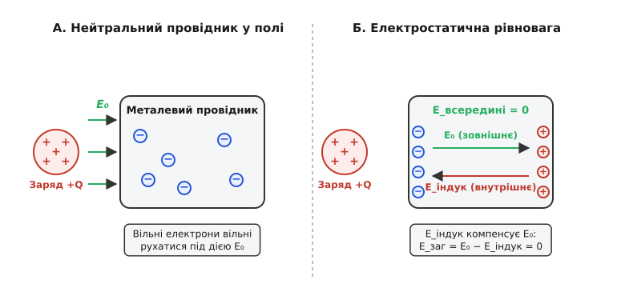
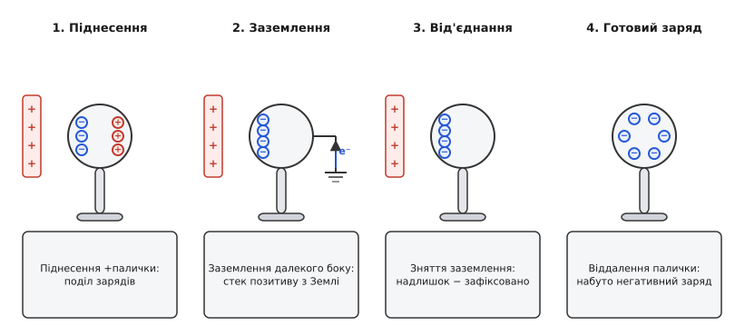
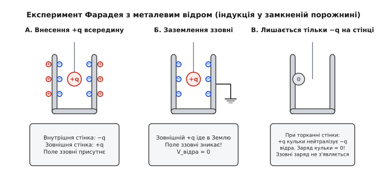
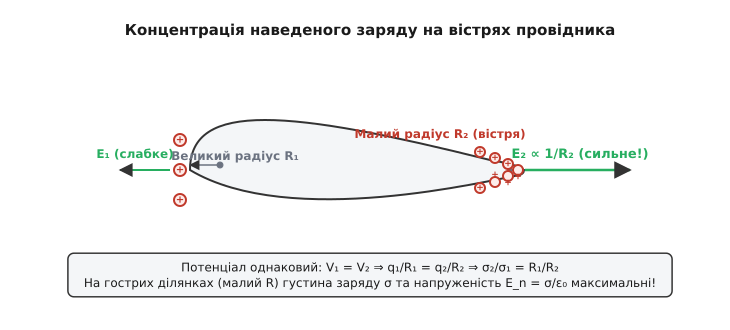
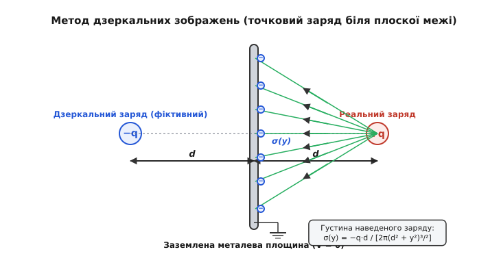

# Електростатична індукція: перерозподіл зарядів та індуковані поля

<preknowlist>
- [Електричний заряд](root:ph-electromagnetism/electric-charge) — поняття про позитивний і негативний заряди, закон збереження заряду.
- [Закон Кулона](root:ph-electromagnetism/coulomb-law) — сила кулонівської взаємодії між точковими зарядами.
- [Електричне поле](root:ph-electromagnetism/electric-field) — напруженість поля E, силові лінії та дія поля на заряди.
- [Електричний потенціал](root:ph-electromagnetism/electric-potential) — еквіпотенціальні поверхні, зв'язок напруженості з градієнтом потенціалу.
</preknowlist>

Кожен, хто натирав пластмасовий гребінець об сухе волосся або янтарну паличку об вовняну тканину, спостерігав дивовижне явище: натруджений предмет починає притягувати до себе дрібні шматочки паперу, тирсу, шматочки сухих ниток або металеву фольгу. Проте, якщо замислитися над мікроскопічною природою речей, виникає глибокий фізичний парадокс. Шматочки паперу чи металевої фольги є макроскопічно абсолютно нейтральними — сумарний [електричний заряд](root:ph-electromagnetism/electric-charge) усередині кожного з них точно дорівнює нулю. Відповідно до [закону Кулона](root:ph-electromagnetism/coulomb-law), сила кулонівської взаємодії між точковим зарядом `Q` та точковим незарядженим тілом з `q = 0` мала б строго дорівнювати нулю. Чому ж тоді макроскопічно нейтральне тіло не просто взаємодіє із зовнішнім зарядом, а завжди відчуває до нього **сильне результуюче притягання**, незалежно від того, додатним чи від'ємним є знак заряду натрудженої палички?

Причина полягає у тому, що сумарний нульовий заряд речовини зовсім не означає відсутності носіїв заряду всередині неї. Уся макроскопічна матерія складається з позитивно заряджених атомних ядер та негативно заряджених електронів. Коли незаряджене тіло потрапляє у зовнішнє [електричне поле](root:ph-electromagnetism/electric-field), кулонівські сили починають зміщувати ці рухливі носії у протилежних напрямках. Негативні електрони притягуються до позитивного джерела або відштовхуються від негативного, тоді як позитивні іони залишаються на місці чи зміщуються навпаки. У результаті у раніше однорідному середовищі виникає просторовий поділ зарядів. Цей процес наведення електричного стану у речовині під дією зовнішнього поля без безпосереднього механічного дотику називається **електростатичною індукцією** (від грецького *ēlektron* — бурштин, *statikos* — той, що стоїть/нерухомий, та латинського *inductio* — наведення, спонукання).

---

### 1. Мікроскопічний механізм у провідниках: екранування внутрішнього поля

Щоб зрозуміти внутрішню динаміку індукції, розглянемо поведінку ідеального металевого провідника, умебльованого велетенською кількістю вільних електронів провідності (модель квантового електронного газу Друде-Лоренца та Фермі). У відсутності зовнішнього поля електрони хаотично рухаються між вузлами кристалічної ґратки із тепловими швидкостями порядка сотень кілометрів на секунду. Проте їхній середній просторовий розподіл є строго однорідним: у кожному мікроскопічному об'ємі від'ємний заряд електронів повністю компенсує додатний заряд іонного остова ґратки.

Коли у просторі поблизу провідника з'являється зовнішній заряд `+Q` (що створює первинне зовнішнє поле `E₀`), на кожен вільний електрон усередині металу починає діяти кулонівська сила:

```
F⃗_e = − e · E⃗₀
```

Оскільки сила напрямлена проти вектора напруженості `E⃗₀`, електрони починають масовий упорядкований дрейф до тієї грані провідника, яка повернута до зовнішнього заряду. На цій ближчій грані виникає **надлишок електронів** — локальний індукований негативний поверхневий заряд `−q_ind`.

Одночасно на протилежній, віддаленій грані провідника виникає **дефіцит електронів** — некомпенсований позитивний заряд іонного остова ґратки `+q_ind`.


*При піднесенні зовнішнього заряду вільні електрони провідника зміщуються під дією сили Кулона. Перерозподіл зарядів триває доти, доки внутрішнє наведене поле E_індук повністю не компенсує зовнішнє поле E₀.*

Цей перерозподіл зарядів на поверхні провідника створює власне **внутрішнє індуковане поле** `E⃗_ind`, напрямлене всередині провідника від додатного полюса (дефіцит електронів) до від'ємного (надлишок електронів). Тобто вектор `E⃗_ind` дивиться строго **проти** напрямку первинного зовнішнього поля `E⃗₀`.

Переміщення вільних носіїв триває доти, доки результуюче поле всередині провідника не стане строго рівним нулю:

```
E⃗_total = E⃗₀ + E⃗_ind = 0⃗                 [всередині провідника]
```

#### Динаміка релаксації та Томас-Ферміївське екранування

Динаміку зникнення об'ємного заряду описують рівнянням неперервності струму та диференціальною формою закону Ома й закону Гаусса:

```
∂ρ/∂t + ∇·j⃗ = 0
j⃗ = σ_cond · E⃗
∇·E⃗ = ρ / ε₀

⇒ ∂ρ/∂t + (σ_cond / ε₀) · ρ = 0
⇒ ρ(t) = ρ₀ · e^(−t / τ)
```

Характерний час цього процесу (час релаксації заряду) для металів визначається відношенням діелектричної сталої вакууму до питомої провідності матеріалу `τ = ε₀ / σ_cond` і становить неймовірно малу величину порядка `10⁻¹⁹ c` (фемтосекунди). Це означає, що електростатична рівновага у провідниках встановлюється практично миттєво.

Глибина проникнення електростатичного поля в метали обмежена Томас-Ферміївським радіусом екранування:

```
λ_TF = √[ (ε₀ · E_F) / (3 · n · e²) ] ≈ 0.5 Å
```

де `E_F` — енергія Фермі, `n` — концентрація електронів провідності. Оскільки `λ_TF` менше за атомарний радіус, у глибині металу поле завжди дорівнює нулю.

#### Властивості провідника у стані електростатичної рівноваги

З умови `E⃗_total = 0⃗` всередині провідника випливають чотири фундаментальні наслідки, на яких тримається вся електростатика провідних тіл:

1. **Еквіпотенціальність об'єму та поверхні**: Оскільки `E⃗ = − ∇V = 0⃗`, [електричний потенціал](root:ph-electromagnetism/electric-potential) у всіх точках усередині та на поверхні провідника є однаковим:
   ```
   V(x, y, z) = const
   ```
2. **Ортогональність силових ліній до поверхні**: Напруженість поля біля самої поверхні провідника ззовні напрямлена строго по нормалі `n̂` до поверхні. Тангенціальна складова поля дорівнює нулю (`E_t = 0`), інакше електрони продовжували б рухатися вздовж поверхні.
3. **Локалізація заряду на поверхні**: За [законом Гаусса](root:ph-electromagnetism/gauss-law) (`∇ · E⃗ = ρ / ε₀`), оскільки всередині провідника `E⃗ = 0⃗`, об'ємна густина заряду `ρ` всередині провідника тотожно дорівнює нулю. Усі наведені та надлишкові заряди розташовуються **виключно на зовнішній поверхні** тонким шаром атомарної товщини.
4. **Зв'язок напруженості та поверхневої густини**: Нормальна складова поля біля поверхні прямо пропорційна локальній густині поверхневого заряду `σ`:
   ```
   E_n = σ / ε₀
   ```

#### Чому виникає результуюче притягання?

Тепер ми можемо вичерпно відповісти на початкове запитання: чому нейтральний провідник притягується до зовнішнього заряду `+Q`?

На ближчій грані провідника наводиться негативний заряд `−q_ind`, а на дальній — позитивний `+q_ind`. Оскільки за модулем ці заряди є абсолютно однаковими (`|+q_ind| = |−q_ind|`), але ближня грань знаходиться на меншій відстані `r_near < r_far` від джерела `+Q`, сила кулонівського притягання негативного заряду за законом обернених квадратів є **значно більшою**, ніж сила відштовхування позитивного заряду:

```
F_attract = k · Q · q_ind / r_near²
F_repel   = k · Q · q_ind / r_far²

F_net = F_attract − F_repel > 0            [результуюча сила завжди напрямлена ДО джерела]
```

Отже, у неоднорідному електростатичному полі будь-яке незаряджене провідне тіло завжди втягується в область сильнішого поля, незалежно від знака джерела.

---

### 2. Заряджання провідника через індукцію без дотику

Електростатична індукція відкриває можливість надати ізольованому провіднику стійкий електричний заряд без жодного фізичного контакту із зарядовим донором і без найменшої витрати заряду самого донора.

Процес складається з чотирьох послідовних етапів.


*Чотириетапний цикл заряджання через індукцію. Після зняття заземлення та віддалення зовнішньої палички провідник набуває стійкий заряд протилежного знака.*

#### Баланс зарядів та потенціалів за етапами

Для повного системного розуміння наведемо таблицю стану заряду `Q` та потенціалу `V` провідника на кожному кроці процедури:

| Етап процедури | Сумарний заряд Q | Потенціал провідника V | Фізичний стан зарядів на поверхні |
|:---|:---:|:---:|:---|
| **0. Початковий стан** | `0` | `0` | Заряди розподілені однорідно, `E_int = 0` |
| **1. Піднесення +Q** | `0` | `V > 0` | Поділ зарядів: `−q` на ближньому боку, `+q` на дальньому |
| **2. Заземлення** | `−q_acquired` | `0` | Електрони з Землі нейтралізують `+q`. Залишається зв'язаний `−q` |
| **3. Розрив землі** | `−q_acquired` | `0` | Надлишок `−q` замкнено на провіднику, `V = 0` за наявності `+Q` |
| **4. Віддалення +Q** | `−q_acquired` | `V < 0` | Заряд `−q` рівномірно розподіляється по поверхні, `V < 0` |

#### Енергетичний баланс індукційного заряджання

В результаті цієї процедури куля набула **стійкий негативний заряд** `-Q_acquired`, знак якого є **протилежним** до знака палички-індуктора! При цьому сама паличка `+Q` не втратила жодного елементарного заряду.

Звідки ж взялася електрична енергія накопиченого заряду `W_el = Q² / (2C)`? Вона утворилася за рахунок **механічної роботи**, видатків м'язової сили експериментатора, який долав кулонівське притягання при віддаленні позитивної палички від негативно зарядженої кулі на четвертому етапі:

```
W_mech = ∫_d^∞ F⃗_attract · dr⃗ = Q² / (2·C)
```

Індукційний процес є прямим механізмом перетворення механічної роботи на потенціальну енергію розділених зарядів.

#### Динамічний струм заземлення

При наближенні індукційного заряду `+Q` зі швидкістю `v = dz/dt` до заземленого провідника через заземлювальний дріт протікає індукційний струм зміщення:

```
i(t) = dq_ind / dt = (dq_ind / dz) · (dz / dt) = (dq_ind / dz) · v
```

Цей струм можна зареєструвати чутливим амперметром, що лежить в основі роботи динамічних індукційних датчиків наближення.

> 📜 Детальніше про те, як цей принцип у XVIII столітті перетворили на перший циклічний генератор високої напруги, читайте у вставці [Історія відкриття індукції та електрофора Вольти](root:ph-electromagnetism/charge-induction/hist-electrophorus.md).

---

### 3. Екранування та експеримент Фарадея з льодовим відром

Особливо цікаві та практично важливі явища виникають тоді, коли провідник має внутрішню порожнину.

Якщо суцільний провідник має порожнину, у якій відсутні електричні заряди, то у стані електростатичної рівноваги **електричне поле всередині порожнини дорівнює нулю**, незалежно від того, які потужні заряди чи поля існують ззовні. Це явище називається **електростатичним екрануванням**.

Причина полягає у наступному: якщо уявити силову лінію поля всередині порожнини, вона мала б починатися на одній точці стінки порожнини і закінчуватися на іншій. Але оскільки вся провідна стінка є еквіпотенціальною поверхнею (`V = const`), різниця потенціалів між будь-якими двома точками стінки дорівнює нулю (`ΔV = 0`). Отже, циркуляція і напруженість поля всередині замкненої провідної оболонки тотожно дорівнюють нулю.

#### Експеримент Фарадея з льодовим відром (*Faraday's Ice Pail Experiment*)

У 1843 році Майкл Фарадей виконав знамениту серію дослідів із металевою судиною для льоду, яка остаточно довела точність закону збереження заряду та кількісні закони індукції у замкнених порожнинах.


*Дослід Фарадея з відром. Зарядщена кулька всередині металевої порожнини індукує точно рівний за модулем протилежний заряд на внутрішній стінці та такий самий заряд на зовнішній стінці.*

Розглянемо три етапи досліду Фарадея:

1. **Внесення заряду всередину**: Металеву кульку із зарядом `+q` опускають на ізолюючій шовковій нитці всередину заземленого незарядженого металевого відра, не торкаючись його стінок. Поле кульки `+q` індукує на **внутрішній стінці** відра від'ємний заряд `−q_int`, а на **зовнішній стінці** — додатний заряд `+q_ext`. За допомогою електрометра Фарадей довів, що `|−q_int| = |+q_ext| = q`. Силові лінії поля кульки повністю закінчуються на внутрішній стінці відра, тож потік вектора напруженості через будь-яку поверхню всередині металу відра дорівнює нулю.
2. **Заземлення зовнішньої стінки**: Якщо торкнутися пальцем зовнішньої стінки відра, зовнішній додатний заряд `+q_ext` негайно стече в Землю. Електричне поле поза відром повністю зникає, але на внутрішній стінці залишається заряд `−q_int = −q`, міцно утримуваний притяганням внутрішньої кульки `+q`.
3. **Торкання стінки**: Якщо опустити кульку нижче і торкнутися нею внутрішньої стінки відра, заряд кульки `+q` та індукований заряд внутрішньої стінки `−q` повністю нейтралізують один одного в точці контакта (`(+q) + (−q) = 0`). Вийнявши кульку з відра, виявляють, що вона стала **абсолютно нейтральною**, а на відрі не залишилося жодного заряду! Усі 100% заряду кульки беззалишково перейшли на зовнішню поверхню провідника.

Цей дослід став основою створення сучасних металевих екранів, коаксіальних кабелів та [клітки Фарадея](root:ph-electromagnetism/faraday-cage), яка захищає чутливу мікроелектроніку від зовнішніх електромагнітних завад, атмосферних розрядів і блискавок.

#### Порівняння електростатичного та високочастотного екранування

Слід строго розрізняти електростатичне екранування та високочастотне електромагнітне екранування:
* **Електростатичне екранування**: Працює для постійних полів (`f = 0`). Вимагає суцільного або сітчастого провідника обов'язково заземленого для екранування внутрішніх зарядів назовні. Поле ззовні всередину екранується навіть без заземлення.
* **Високочастотне екранування**: Спирається на відбиття та поглинання електромагнітних хвиль за рахунок скінового ефекту та наведених вихрових струмів Фуко (`f > 0`).

---

### 4. Концентрація індукованого заряду та напруженості на вістрях

Густина індукованого заряду `σ` та нормальна напруженість поля `E_n = σ / ε₀` розподіляються по поверхні провідника непропорційно. Вони критично залежать від місцевої кривини поверхні: **чим більша кривина поверхні (тобто чим менший радіус кривини R), тим вищою є густина індукованого заряду та напруженість поля біля цієї ділянки**.

#### Модель двох з'єднаних куль різного радіуса

Щоб математично зрозуміти цей механізм, розглянемо спрощену модель: дві металеві кулі радіусів `R₁` та `R₂` (де `R₁ > R₂`), з'єднані між собою довгим тонким провідником і внесені в електростатичне поле.


*Концентрація заряду на вістрях. Оскільки потенціал V обох ділянок новий і однаковий, густина заряду σ та напруженість E_n є обернено пропорційними радіусу кривини R.*

Оскільки кулі з'єднані провідником, у стані рівноваги їхній електричний потенціал є однаковим:

```
V₁ = V₂
```

Виразимо потенціал кожної кулі через її заряд та радіус (нехтуючи взаємним впливом через велику відстань):

```
V₁ = (1 / 4·π·ε₀) · q₁ / R₁
V₂ = (1 / 4·π·ε₀) · q₂ / R₂

q₁ / R₁ = q₂ / R₂  ⇒  q₁ / q₂ = R₁ / R₂
```

Тепер знайдемо відношення поверхневих густин заряду `σ₁ = q₁ / (4·π·R₁²)` та `σ₂ = q₂ / (4·π·R₂²)`:

```
σ₂ / σ₁ = (q₂ / q₁) · (R₁² / R₂²) = (R₂ / R₁) · (R₁² / R₂²) = R₁ / R₂
```

Звідси отримуємо фундаментальне співвідношення:

```
σ ∝ 1 / R
E_n = σ / ε₀ ∝ 1 / R
```

Поверхнева густина індукованого заряду та напруженість поля поблизу поверхні провідника **обернено пропорційні радіусу кривини** поверхні.

#### Коронний розряд та електричний вітер

На гострих ребрах, голках та вістрях (де `R → 0`) напруженість поля досягає колосальних значень (понад `3 × 10⁶ В/м` у повітрі при атмосферному тиску). Настільки сильне поле починає іонізувати навколишнє повітря: електрони відриваються від молекул газу під дією ударної іонізації (лавина Таунсенда), виникає тиховодний коронний розряд (*corona discharge*), а іонізовані молекули одного знака відштовхуються від вістря, створюючи механічний потік повітря — «електричний вітер».

Цей ефект лежить в основі роботи громовідводів (блискавковідводів), іонізаторів повітря, лазерних принтерів та промислових електрофільтрів. Захисний конус блискавковідводу із вершиною на вістрі традиційно приймають рівним куту 45° від вертикалі.

---

### 5. Математичний опис: граничні умови та метод дзеркальних зображень

Для аналітичного розрахунку полів та сил при індукції використовують метод дзеркальних зарядів (зображень). Замість складного розв'язання рівняння Лапласа з граничною умовою `V = 0` на поверхні провідника, провідну поверхню подумки вилучають, а її дію замінюють точковими дзеркальними зарядами, розташованими у фіктивних точках поза обчислимим простором.


*Метод дзеркальних зображень для точкового заряду над заземленою площиною. Сумарний розподіл поля створюється реальним зарядом +q та фіктивним зарядом −q.*

#### Точковий заряд біля плоскої заземленої межі

Для точкового заряду `+q`, розташованого на відстані `d` від заземленої площини `z = 0`, фіктивний дзеркальний заряд `−q` розміщують у точці `z = −d`.

Точний вираз для розподілу густини наведеного поверхневого заряду на площині має вигляд:

```
σ(r) = − (q · d) / (2·π · [r² + d²]^(3/2))

де r — радіальна відстань від осі симетрії в площині.
```

Сумарний індукований заряд, знайдений інтегруванням `σ(r)` по всій площині від `r = 0` до `r = ∞`, строго дорівнює:

```
Q_ind = ∫₀^∞ σ(r) · 2·π·r dr = − q
```

Сила притягання між точковим зарядом та площиною розраховується за законом Кулона для реального заряду та його дзеркального відображення на відстані `2d`:

```
F = (1 / 4·π·ε₀) · q² / (4·d²)
```

#### Практичний числовий розрахунок сили та заряду

Розглянемо числовий приклад. Нехай заряд `q = 1 мкКл = 10⁻⁶ Кл` розміщено на відстані `d = 10 см = 0.1 м` від великої заземленої металевої пластини.

Обчислимо максимальну густину наведеного заряду безпосередньо під точковим зарядом (`r = 0`):

```
σ_max = − q / (2·π·d²)                     [формула густини в центрі при r = 0]
      = − (10⁻⁶) / (2 · 3.14159 · 0.01)     [підстановка q = 1 мкКл, d = 0.1 м]
      = − 1.5915 × 10⁻⁵ Кл/м²               [чисельний розрахунок]
      = − 15.92 мкКл/м²                     [переведення у мікрокулони на м²]
```

Сила кулонівського притягання заряду до металевої пластини:

```
F = (8.9875 × 10⁹) · (10⁻⁶)² / (4 · 0.01)    [підстановка у формулу Кулона при d = 0.1 м]
  = (8.9875 × 10⁹) · 10⁻¹² / 0.04           [спрощення чисельника та знаменника]
  ≈ 0.2247 Н                                [обчислення результуючої сили]
```

Сила в `0.225 Н` дорівнює вазі вантажу масою `23 грами`. На невеликій відстані `1 см` сила зростає у 100 разів, досягаючи `22.5 Н` (вага вантажу `2.3 кг`), що наочно підтверджує велетенські масштаби електростатичних сил індукції.

> 🧮 Повний математичний вивід для плоскої та сферичної меж подано у вставці [Математичний вивід методу дзеркальних зарядів](root:ph-electromagnetism/charge-induction/math-method-of-images.md).
> ⚙️ Чисельну комп'ютерну програму моделювання розподілу зарядів дивіться у вставці [Чисельне моделювання наведених зарядів та сил](root:ph-electromagnetism/charge-induction/proj-electrostatic-sim.md).

---

### 6. Індукція в діелектриках: відмінність від провідників

У діелектричних матеріалах (ізоляторах) відсутні вільні носії заряду — усі електрони міцно зв'язані зі своїми материнськими атомами чи молекулами. Тому під дією зовнішнього поля у діелектриках виникає не макроскопічне переміщення вільних зарядів, а **поляризація діелектрика**.

У залежності від структури речовини розрізняють три основні мікроскопічні механізми поляризації:

1. **Електронна (деформаційна) поляризація**: У сферично симетричних атомах (наприклад, інертні гази, алмаз) зовнішнє поле `E₀` зміщує негативну електронну хмару відносно позитивного ядра на мікроскопічну відстань `x ≈ 10⁻¹⁶ м`, перетворюючи кожний атом на індукований електричний диполь.
2. **Орієнтаційна (дипольна) поляризація**: У речовинах із полярними молекулами (наприклад, вода `H₂O`, спирти), які мають власний постійний дипольний момент, хаотично орієнтовані хаотичним тепловим рухом диполі під дією зовнішнього поля розвертаються переважно вздовж ліній поля.
3. **Іонна поляризація**: У кристалічних ґратках іонних сполук (наприклад, `NaCl`) позитивні та негативні іони зміщуються у протилежних напрямках.

#### Зв'язані заряди та послаблення поля

У результаті поляризації на поверхні діелектрика виникають незсувні **зв'язані поверхневі заряди** `σ_b = P⃗ · n̂`, де `P⃗` — вектор поляризованості. На відміну від вільних зарядів провідника, зв'язані заряди не можна зняти заземленням чи торканням, оскільки вони є частиною самих атомів.

Зв'язаний заряд утворює внутрішнє протилежне поле `E⃗_pol`, проте це поле лише **послаблює**, але **ніколи повністю не компенсує** зовнішнє поле `E₀`.

Поле всередині однорідного діелектрика зменшується у `ε_r` разів:

```
E = E₀ / ε_r

де ε_r > 1 — відносна діелектрична проникність середовища.
```

Саме тому електростатичне притягання незарядженого діелектрика (наприклад, сухого паперу) до зарядженого тіла є суттєво слабшим, ніж притягання металевого фольгованого провідника тих самих розмірів.

---

### 7. Інженерне значення, ESD-ризики та вимірювання

У сучасній мікроелектроніці, приладобудуванні та високовольтній техніці електростатична індукція виступає як потужним інструментом, так і джерелом високих технологічних ризиків.

> 🔧 **Навіщо це.** Електростатична індукція є головною причиною прихованого розрушення та пошкодження сучасних інтегральних мікросхем статичною електрикою (Electrostatic Discharge, ESD). Оператор, накопичивши статичний заряд на одязі чи взутті, підносить руку до друкованої плати, навіть не торкаючись виводів мікросхеми. Зовнішнє поле індукує високий потенціал на чутливих КМОН-затворах, викликаючи пробій підзатворного діелектрика товщиною у кілька нанометрів і виводячи пристрій з ладу без жодної видимої іскри.

#### Промислові застосування індукції

* **Промислові електрофільтри (абсорбери)**: У димових трубах ТЕЦ та металургійних заводів пилові частинки диму проходять крізь зону коронного розряду, набувають індукованого заряду і під дією сильного поля осідають на осаджувальних металевих електродах, очищаючи повітря на 99.5%.
* **Електростатичне фарбування**: Розпилена фарба проходить крізь індукційне сопло і набуває заряду одного знака, а фарбована деталь (корпус автомобіля) заземлюється. Завдяки індукції краплі фарби рівномірно огортають навіть тильні незахищені поверхні деталі без утворення патьоків.
* **Електростатичні флюксметри**: Прилади для безконтактного вимірювання напруженості поля та заряду без фізичного контакту з об'єктом.

> 📋 Специфікацію промислового цифрового датчика поля та код C/C++ драйвера дивіться у вставці [Специфікація та API електростатичного флюксметра](root:ph-electromagnetism/charge-induction/api-field-meter.md).

Розуміння фізичних механізмів електростатичної індукції — від мікроскопічного перерозподілу вільних електронів до еквіпотенціальних границь і методів дзеркальних зображень — утворює фундамент для проектування надійних систем електростатичного захисту, вимірювальної техніки та розуміння загальної електродинаміки суцільних середовищ.
