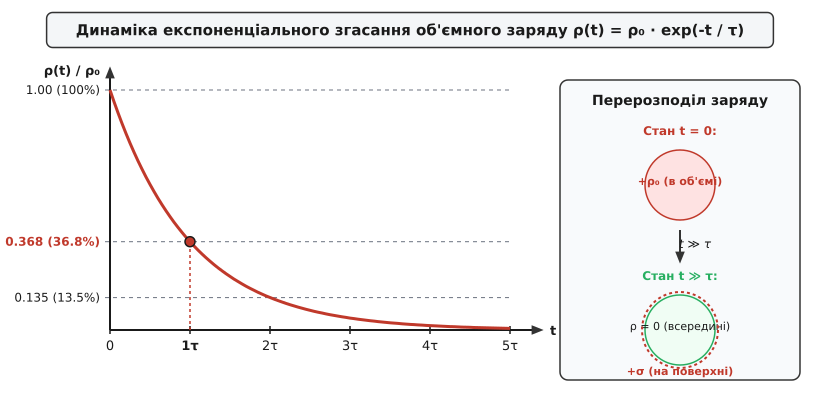
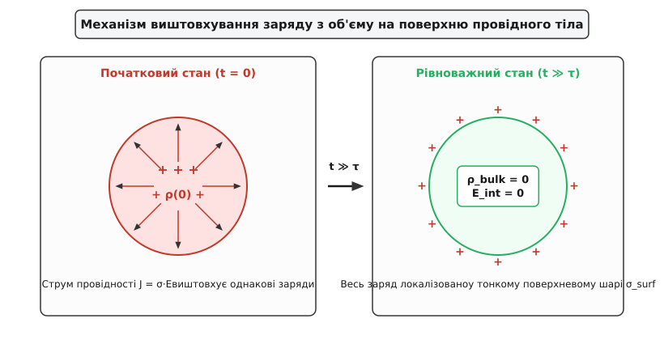
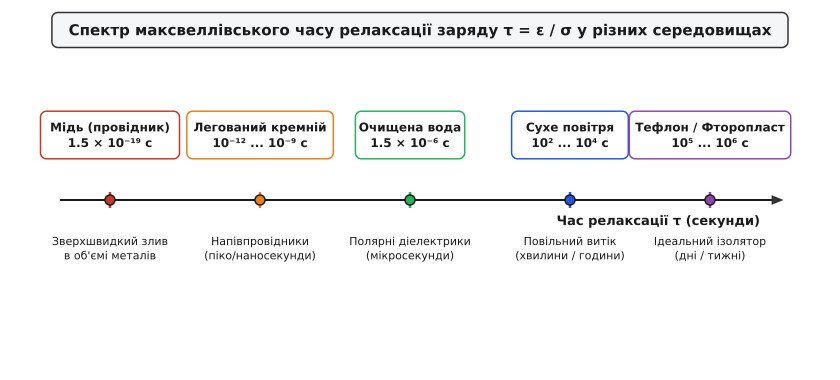
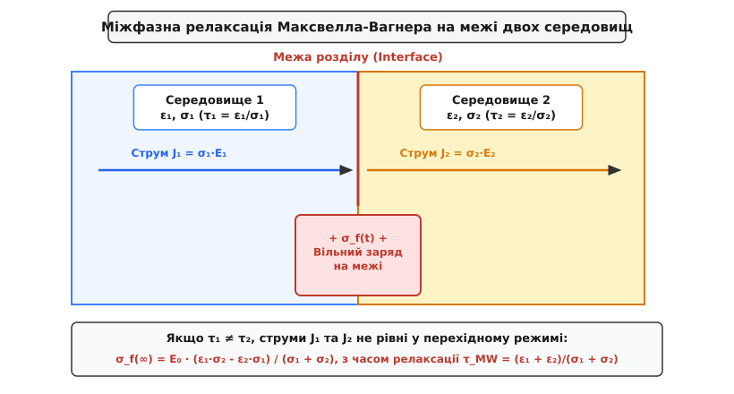
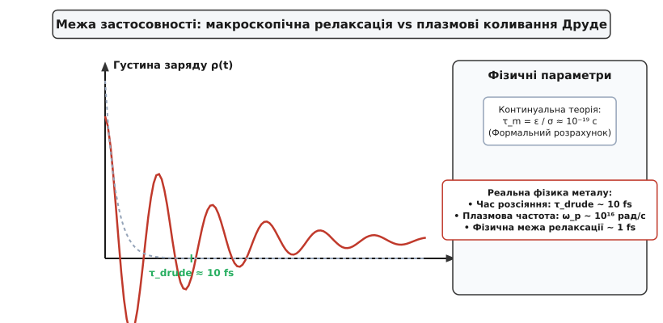

# Час релаксації заряду

<preknowlist>
- [Закон Ома у диференціальній формі](root:ph-electromagnetism/electric-current) — зв'язок густини струму, напруженості поля та питомої провідності середовища.
- [Рівняння неперервності струму](root:ph-electromagnetism/current-continuity) — закон збереження електричного заряду у диференціальній формі.
- [Теорема Гаусса для електричного поля](root:ph-electromagnetism/electric-field) — зв'язок дивергенції вектора напруженості з об'ємною густиною заряду.
</preknowlist>

Потрапляння надлишкових носіїв заряду всередину провідного чи діелектричного середовища створює кулонівське поле відштовхування, яке негайно приводить ці носії в рух. У суцільнометалевій мідній шині електросистеми чи у велетенському цистерновому резервуарі з авіаційним гасом цей процес витискання завершується за принципово різний час: від sub-фемтосекунд `1.5 × 10⁻¹⁹ с` у провідниках до годин і днів `10⁵ ... 10⁶ с` у діелектриках. Час, протягом якого об'ємна густина заряду в однорідній речовині зменшується в `e` разів (приблизно в `2.718` раза), називається **максвеллівським часом релаксації заряду** `τ = ε / σ`.

Ця величина є однією з найважливіших констант макроскопічної електродинаміки суцільних середовищ. Вона визначає фундаментальну межу між статичним накопиченням заряду та його швидким розсмоктуванням, відповідає за явище виштовхування заряду на поверхню провідників, визначає поведінку матеріалів у змінних електромагнітних полях і задає норми безпеки в авіаційній, нафтогазовій та електронній промисловості.

## Фізична інтуїція та причинно-наслідковий механізм

Щоб зрозуміти фізичну природу релаксації заряду, розглянемо уявний експеримент. Нехай усередині суцільного провідного тіла з питомою електропровідністю `σ` та діелектричною проникністю `ε` у початковий момент часу `t = 0` якимось чином створено локальний надлишок вільного заряду з об'ємною густиною `ρ₀` (наприклад, шляхом інжекції електронів пучком або локальної іонізації).

Фізичний процес розгортається за чітким причинно-наслідковим ланцюгом:

1. **Виникнення внутрішнього кулонівського поля:** Згідно з законом Кулона та теоремою Гаусса, будь-який локальний об'ємний заряд `ρ` створює у навколишньому просторі електричне поле `E`. Лінії цього поля спрямовані від центрів позитивного заряду або до центрів негативного заряду.
2. **Поява струму провідності:** Наявність електричного поля `E` у середовищі з відмінною від нуля провідністю `σ > 0` неминуче викликає дрейф вільних носіїв заряду (електронів або іонів). Згідно з диференціальним законом Ома, виникає густина струму провідності `J = σ · E`.
3. **Відтік носіїв та розсмоктування заряду:** Оскільки напрямок вектора `J` у кожній точці збігається з напрямком сили кулонівського відштовхування, вільні заряди починають рухатися геть один від одного. У результаті дивергенція струму `∇ · J` стає додатною, що за законом збереження заряду (рівнянням неперервності) призводить до безперервного зменшення об'ємної густини заряду `∂ρ / ∂t < 0`.


*Динаміка експоненціального спаду об'ємного заряду ρ(t) та його переходу в поверхневий стан за час τ.*

Цей процес є саморегульованим: що більшим є початковий заряд `ρ`, то сильнішим є створене ним електричне поле `E`, то більшим є струм провідності `J` і то швидше відбувається відтік носіїв. У міру зменшення `ρ` поле `E` послаблюється, струм спадає, і процес релаксації асимптотично наближається до нуля за експоненціальним законом.

## Мікроскопічні носії заряду та дрейфово-релаксаційний рух

На мікроскопічному рівні механізм релаксації суттєво залежить від агрегатного стану та фізичної природи носіїв заряду в середовищі:

- **У металах:** Носіями є вільні колективізовані електрони провідності, які перебувають у стані квантового електронного газу Фермі. При появі внутрішнього поля `E` електронна хмара як ціле зміщується відносно іонного остова кристалічної ґратки. Оскільки середня дрейфова швидкість електронів `v_drift = μ_e · E` визначається рухливістю `μ_e`, а питома провідність пов'язана з концентрацією електронів `n` співвідношенням `σ = n · q · μ_e`, релаксація відбувається шляхом колективного дрейфу величезного ансамблю носіїв.
- **У електролітах та рідких діелектриках:** Носіями є позитивні та негативні іони (наприклад, `Na⁺` та `Cl⁻` у воді або іонізовані смолисті домішки в нафтопродуктах). Зважаючи на значно більшу масу іонів та в'язке тертя у рідині, їхня рухливість `μ_ion` у мільйони разів менша за рухливість електронів. Процес релаксації відбувається як двосторонній дрейф аніонів та катіонів у протилежних напрямках.
- **У газах:** Релаксація визначається наявністю вільних аероіонів та вільних електронів, утворених природним радіаційним фоном або космічним випромінюванням. Низька концентрація носіїв у сухому повітрі зумовлює великий час релаксації.

## Математичний вивід рівняння релаксації

Математичний опис процесу базується на трьох фундаментальних рівняннях макроскопічної електродинаміки у диференціальній формі.

Першим є диференціальний закон Ома для однорідного та ізотропного середовища:

```
J = σ · E
```

Другим є диференціальна форма закону Гаусса, яка пов'язує напруженість електричного поля `E` з об'ємною густиною вільного заряду `ρ`:

```
∇ · E = ρ / ε
```

де `ε = ε_r · ε₀` — абсолютна діелектрична проникність середовища.

Третім є диференціальне рівняння неперервності струму, яке виражає фундаментальний закон збереження електричного заряду:

```
∇ · J + ∂ρ / ∂t = 0
```

Для виведення рівняння релаксації підставимо вираз для густини струму `J` із закону Ома в рівняння неперервності:

```
∇ · (σ · E) + ∂ρ / ∂t = 0
```

Оскільки середовище передбачається однорідним, скалярний коефіцієнт питомої провідності `σ` є константою у просторі (`σ = const`). Це дозволяє винести `σ` за знак оператора дивергенції `∇ ·`:

```
σ · (∇ · E) + ∂ρ / ∂t = 0      [дивергенцію застосовано до поля E]
```

Тепер підставимо значення дивергенції електричного поля `∇ · E` з рівняння Гаусса:

```
σ · (ρ / ε) + ∂ρ / ∂t = 0      [заміна ∇ · E на ρ / ε]
```

В результаті отримуємо лінійне однорідне диференціальне рівняння першого порядку відносно об'ємної густини заряду `ρ(t)`:

```
∂ρ / ∂t + (σ / ε) · ρ = 0
```

Розділивши змінні та проінтегрувавши це рівняння по часу від `0` до `t`, отримуємо:

```
∫ (1 / ρ) dρ = - ∫ (σ / ε) dt
ln(ρ(t) / ρ₀) = - (σ / ε) · t
```

Потенціюючи ліву та праву частини, маємо закон часової еволюції об'ємного заряду:

```
ρ(r, t) = ρ₀(r) · exp(-t / τ_m)
```

де параметр `τ_m` є максвеллівським часом релаксації:

```
τ_m = ε / σ = (ε_r · ε₀) / σ
```

Детальні кроки алгебраїчного виведення, аналіз тривимірних векторних тотожностей та розв'язок для неоднорідних початкових розподілів наведено у вставці [🧮 Математичний вивід рівняння релаксації заряду та міжфазних граничних умов](root:ph-electromagnetism/charge-relaxation/math-relaxation-derivation.md).

З отриманого розв'язку випливають три вирішальні фізичні висновки:

1. **Незалежність від просторової форми:** Час релаксації `τ_m` залежить виключно від речовинних параметрів середовища (`ε` та `σ`) і абсолютно не залежить від геометричної форми тіла, його розмірів чи початкового контуру геометрії заряду.
2. **Збереження просторового профілю:** Усередині однорідного середовища початковий розподіл заряду `ρ₀(r)` згасає в усіх точках пропорційно з одним і тим самим коефіцієнтом `exp(-t / τ_m)`. Відношення густин заряду між будь-якими двома внутрішніми точками залишається незмінним протягом усього процесу релаксації.
3. **Експоненціальний період напіврозпаду:** Час, за який початкова густина заряду зменшується вдвічі (`ρ(t_{1/2}) = 0.5 · ρ₀`), становить:
   ```
   t_{1/2} = τ_m · ln(2) ≈ 0.693 · τ_m
   ```
   А час, за який заряд спадає на `99%` (до `1%` від початкового значення), дорівнює `t_{99%} = τ_m · ln(100) ≈ 4.61 · τ_m`.

## Релаксація у просторово-неоднорідних середовищах

Якщо питома електропровідність `σ(r)` або діелектрична проникність `ε(r)` змінюються від точки до точки (неоднорідне середовище), оператор дивергенції у рівнянні неперервності розгортається за правилом диференціювання добутку:

```
∇ · (σ · E) = σ · (∇ · E) + E · ∇σ = (σ / ε) · ρ + E · ∇σ
```

Підставляючи це у рівняння неперервності, отримуємо узагальнене рівняння динаміки заряду в неоднорідному середовищі:

```
∂ρ / ∂t + (σ / ε) · ρ = - E · ∇σ
```

Отримане рівняння містить праворуч джерельний доданок `- E · ∇σ`. Це відкриває фундаментальний фізичний ефект: **у неоднорідному середовищі під дією зовнішнього електричного поля об'ємний заряд виникає навіть у стаціонарному стані (`∂ρ / ∂t = 0`)**.

У стаціонарному стані індукований об'ємний заряд дорівнює:

```
ρ_induced = - (ε / σ) · (E · ∇σ) = - τ_m · (E · ∇σ)
```

Там, де провідність середовища змінюється у напрямку електричного поля (`E · ∇σ ≠ 0`), виникає стаціонарний об'ємний заряд. Цей ефект відіграє ключову роль у високовольтній ізоляції та градієнтно-функціональних матеріалах.

## Електрогідродинамічна релаксація Тейлора-Мелчера

У провідних рідинах, що рухаються зі швидкістю `v(r, t)` (наприклад, перекачування нафти, рух електролітів у мікроканалах), закон збереження заряду включає конвективний перенос заряду потоком рідини:

```
∇ · (J_cond + ρ · v) + ∂ρ / ∂t = 0
```

Розгортаючи дивергенцію конвективного струму `∇ · (ρ · v) = v · ∇ρ + ρ · (∇ · v)` для нестисливої рідини (`∇ · v = 0`), отримуємо **рівняння конвективної релаксації заряду**:

```
∂ρ / ∂t + v · ∇ρ + (σ / ε) · ρ = 0
```

Або у формі повної субстанціональної похідної Лагранжа `Dρ / Dt = ∂ρ / ∂t + v · ∇ρ`:

```
Dρ / Dt = - (σ / ε) · ρ
```

Цей вираз є базовим рівнянням **моделі слабкопровідного флюїду Тейлора-Мелчера (Taylor-Melcher Leaky Dielectric Model)**. Він показує, що для спостерігача, який рухається разом із елементом рідини зі швидкістю `v`, об'ємна густина заряду згасає за тим самим максвеллівським законом `exp(-t / τ_m)`. Безрозмірне **число електрогідродинамічної релаксації `R_e`** (відношення часу релаксації до гідродинамічного часу переносу `t_hydro = L / v`):

```
R_e = τ_m / t_hydro = (ε · v) / (σ · L)
```

Якщо `R_e ≪ 1` (швидка релаксація), заряд встигає розсмоктатися до того, як потік перенесе його вздовж каналу. Якщо `R_e ≫ 1` (повільна релаксація), заряд «заморожується» в рідині й конвективно транспортується на великі відстані, створюючи небезпечні статичні потенціали.

## Вплив зовнішніх магнітних полів на релаксацію (Магніторелаксація)

У наявності сильного зовнішнього магнітного поля `B` напрямок руху вільних носіїв під дією електростатичного поля `E` змінюється за рахунок дії сили Лоренца. Диференціальний закон Ома для провідника у магнітному полі узагальнюється із урахуванням ефекту Холла:

```
J + μ_H · (J × B) = σ · E
```

де `μ_H` — холлівська рухливість носіїв заряду.

При виведенні рівняння релаксації заряду в магнітному полі скалярна провідність `σ` замінюється тензором провідності Холла `σ̂(B)`. Поперечні компоненти струму `J_hall`, що виникають під кутом Холла `θ_H = arctan(μ_H · B)`, викривляють траєкторії дрейфу електронів, спрямовуючи носії не строго вздовж ліній поля `E`, а за спіральними лініями.

У результаті час релаксації у напрямку, паралельному магнітному полю, залишається незмінним `τ_parallel = ε / σ`, тоді як у перпендикулярних напрямках час релаксації зростає у `1 + (μ_H · B)²` разів:

```
τ_perp = (ε / σ) · (1 + (μ_H · B)²)
```

Це означає, що сильні магнітні поля уповільнюють поперечне розсмоктування заряду в плазмі та напівпровідниках, утримуючи об'ємні заряди вздовж магнітних силових ліній.

## Релаксація заряду у дисперсних та порошкових середовищах

Особливою галуззю застосування теорії релаксації заряду є фізика дисперсних систем, порошків та аерозолів (наприклад, фарбування у сухих електростатичних полях, фармацевтичні гранули, пилові хмари в шахтах).

Кожна окрема частинка порошку радіуса `R` під час трибоелектричного контакту отримує заряд `q₀`. Якщо порошок знаходиться у контейнері або транспортується пневмотранспортом, загальний процес розрядки хмари пилу визначається не лише власною провідністю матеріалу частинок `σ_p`, але й ефективною провідністю повітряного проміжку між частинками `σ_eff`.

Час релаксації об'ємного заряду порошкової хмари `τ_powder` описується ефективною формулою:

```
τ_powder = (ε_eff) / (σ_eff + 4π · n_p · R · σ_surface)
```

де `n_p` — концентрація частинок, а `σ_surface` — поверхнева провідність. Якщо `τ_powder` перевищує час транспортування порошку, у бункері виникає небезпечне згущення заряду, здатне викликати вибух пилоповітряної суміші від іскрового саморозряду.

## Локалізація заряду та виштовхування на поверхню

Виникає фундаментальне запитання: якщо об'ємна густина заряду `ρ(r, t)` у кожній внутрішній точці однорідного провідника експоненціально прямує до нуля, куди дівається сам електричний заряд? Згідно з законом збереження, заряд не може зникнути безвісти.

Відповідь дає інтегрування рівняння неперервності за об'ємом тіла `V`. Повний струм провідності, що протікає через зовнішню замкнену поверхню `S`, що обмежує об'єм `V`, дорівнює:

```
I_out(t) = ∮_S J · dS = σ · ∮_S E · dS = σ · (Q_bulk(t) / ε) = (1 / τ_m) · Q_bulk(t)
```

Носії заряду під дією внутрішнього кулонівського поля дрейфують до зовнішніх меж середовища. Досягаючи фізичної межі розподілу (поверхні провідника або кордону між двома різними діелектриками), носії не можуть вискочити у вакуум або суміжне ізолююче середовище через наявність потенціального бар'єра (роботи виходу).


*Схема міграції вільних носіїв під дією власного кулонівського поля з об'єму на зовнішню поверхню.*

У результаті увесь початковий об'ємний заряд `Q₀` концентрується у нескінченно тонкому поверхневому шарі (товщиною порядку атомного радіуса або дебаївського радіуса екранування), перетворюючись із об'ємного заряду `ρ` на поверхневий заряд з густиною `σ_surf` (Кл/м²):

```
Q_total = ∫_V ρ(r, t) dV + ∮_S σ_surf(r, t) dS = Q₀ = const
```

Після завершення процесу релаксації (`t ≫ τ_m`) усередині однорідного провідного тіла встановиться статичний стан:

```
ρ_bulk = 0,  E_int = 0,  φ = const
```

Це доводить фундаментальну теорему електростатики: **усі надлишкові стаціонарні електричні заряди на провідних тілах розташовуються виключно на їхній зовнішній поверхні**.

У тілах з нерегулярною геометрією (наявність вістрів, гострих ребер або вигинів) поверхнева густина заряду `σ_surf(r)` після завершення об'ємної релаксації розподіляється нерівномірно. На вістрях і виступах радіус кривизни поверхні `R` є мінімальним, що викликає сильне локальне згущення поверхневого заряду `σ_surf ~ 1 / R` та локальне зростання напруженості поля `E_surf ~ 1 / R`. Якщо створене напруження поля перевищує критичну межу діелектричної міцності навколишнього середовища (`E_break ≈ 3 × 10⁶ В/м` для сухого повітря), локальна релаксація заряду завершується виникненням коронного розряду або мікроіскріння.

## Спектр часів релаксації у матеріалознавстві

Значення часу релаксації `τ_m = ε / σ` змінюється на вражаючі `25 порядків` при переході від хороших металевих провідників до високоомних діелектриків. Це зумовлено колосальним діапазоном змін питомої електропровідності `σ` (від `10⁸ См/м` до `10⁻¹⁸ См/м`).


*Порівняльний шкальний спектр часів релаксації заряду τ від металів до ізоляторів.*

Розглянемо характерні часові масштаби для різних класів матеріалів:

### 1. Хороші провідники (метали)
Для міді (`σ ≈ 5.96 × 10⁷ См/м`, `ε ≈ ε₀ ≈ 8.85 × 10⁻¹² Ф/м`):

```
τ_copper = (8.854 × 10⁻¹²) / (5.96 × 10⁷) ≈ 1.48 × 10⁻¹⁹ с
```

Значення `1.5 × 10⁻¹⁹ с` (0.15 аттосекунди) означає, що у макроскопічному металі будь-який відхил від електронейтральності в об'ємі формально розсмоктується практично миттєво. На будь-яких низьких та високих частотах (аж до оптичного діапазону) метал поводиться як середовище з миттєвим перерозподілом поверхневого заряду.

### 2. Напівпровідники
У напівпровідниках (кремній, германій, арсенід галію) провідність залежить від рівня легування (`σ ~ 10⁻⁴ ... 10⁵ См/м`), а відносна діелектрична проникність становить `ε_r ≈ 12`.
- Для сильнолегованого кремнію (`n⁺-Si`, `σ ≈ 10⁴ См/м`): `τ_m ≈ 10⁻¹⁵ с` (1 фс).
- Для власного чистого кремнію (`intrinsic Si`, `σ ≈ 4.35 × 10⁻⁴ См/м`):
  ```
  τ_si = (11.7 × 8.854 × 10⁻¹²) / (4.35 × 10⁻⁴) ≈ 2.38 × 10⁻⁷ с = 238 нс
  ```
Час релаксації порядку сотень наносекунд є порівнянним із тактовими періодами сучасних мікропроцесорів. Це означає, що під час перемикання транзисторів у напівпровідникових кристалах перехідні процеси перерозподілу об'ємного заряду відіграють критичну роль у динаміці затримок сигналів.

### 3. Електроліти та рідкі діелектрики
- **Морська вода** (`σ ≈ 4.8 См/м`, `ε_r ≈ 80`): `τ_water ≈ 1.5 × 10⁻¹⁰ с` (150 пікосекунд).
- **Дистильована чиста вода** (`σ ≈ 5.5 × 10⁻⁶ См/м`, `ε_r ≈ 80`): `τ_pure_water ≈ 13 мкс`.
- **Трансформаторна олія** (`σ ≈ 10⁻¹² См/м`, `ε_r ≈ 2.2`): `τ_oil ≈ 19.5 с`.

### 4. Високоомні діелектрики та полімери
- **Сухе повітря** (`σ ≈ 2 × 10⁻¹⁴ См/м`, `ε_r ≈ 1.0`): `τ_air ≈ 440 с` (близько 7 хвилин).
- **Фторопласт (Тефлон / PTFE)** (`σ ≈ 10⁻¹⁷ См/м`, `ε_r ≈ 2.1`):
  ```
  τ_teflon = (2.1 × 8.854 × 10⁻¹²) / (10⁻¹⁷) ≈ 1.86 × 10⁶ с ≈ 21.5 доби
  ```
У високоякісних діелектриках занесені статичні заряди можуть зберігатися тижнями та місяцями, оскільки струми природного витікання є зверхмалими.

## Міжфазна релаксація Максвелла-Вагнера

У реальних електротехнічних пристроях та мікроелектронних структурах діелектрики та провідники рідко бувають повністю однорідними. Частіше фізична система складається з двох або більше шарів різних матеріалів (наприклад, шар оксиду гафнію та кремнію у затворі польового транзистора, або маслопаперова ізоляція у високовольтному трансформаторі).

Що відбувається на межі розподілу двох середовищ з параметрами `(ε₁, σ₁)` та `(ε₂, σ₂)`, коли через них протікає електричний струм?


*Накопичення вільного міжфазного заряду σ_f на межі розділу двох середовищ із різними часами релаксації.*

Якщо до двошарової структури прикласти зовнішню напругу `V₀`, у початковий момент часу `t = 0⁺` розподіл полів визначається ємнісними діелектричними проникностями `ε₁` та `ε₂` (законами електростатики). Проте під дією полів у кожному шарі виникають струми провідності `J₁ = σ₁ · E₁` та `J₂ = σ₂ · E₂`.

Якщо матеріали мають різні власні часи релаксації `τ₁ = ε₁ / σ₁ ≠ τ₂ = ε₂ / σ₂`, то густини струмів у двох шарах не збігаються (`J₁ ≠ J₂`). Внаслідок різниці струмів на межі розподілу починає накопичуватися вільний міжфазний заряд `σ_f(t)` (Кл/м²):

```
∂σ_f / ∂t = J₁ - J₂ = σ₁ · E₁ - σ₂ · E₂
```

Накопичення міжфазного заряду продовжується доти, доки перерозподілені електричні поля `E₁` та `E₂` не вирівняють струми в обох середовищах (`J₁(∞) = J₂(∞)`).

Характерний час цього міжфазного перехідного процесу називається **часом релаксації Максвелла-Вагнера `τ_MW`**:

```
τ_MW = (ε₁ + ε₂) / (σ₁ + σ₂)      [при однаковій товщині шарів]
```

Граничне стаціонарне значення накопиченого міжфазного заряду дорівнює:

```
σ_f(∞) = E₀ · (ε₁ · σ₂ - ε₂ · σ₁) / (σ₁ + σ₂)
```

Явище релаксації Максвелла-Вагнера викликає так звану «запізнілу поляризацію» та створює додаткові діелектричні втрати на низьких частотах. Наявність міжфазного заряду створює внутрішнє електричне поле, яке може суттєво спотворювати розраховану ізоляційну міцність двошарових структур.

Докладний історичний нарис вивчення цього явища описано у вставці [📜 Історія теорії релаксації заряду: від дослідів Фарадея до макроскопічної електродинаміки Максвелла](root:ph-electromagnetism/charge-relaxation/hist-maxwell-relaxation.md).

## Релаксація об'ємного заряду у високовольтних кабелях постійного струму (HVDC)

Особливо гостро феномен міжфазного накопичення заряду проявляється у високовольтних кабелях постійного струму (High-Voltage Direct Current, HVDC), ізоляція яких виготовляється із зшитого поліетилену (XLPE).

Під час експлуатації кабелю струм жили розігріває внутрішню частину ізоляції до температури `T_in ≈ 70 ... 90 °C`, тоді як зовнішній шар кабелю охолоджується навколишнім середовищем до `T_out ≈ 20 ... 30 °C`. Оскільки питома провідність полімерів експоненціально зростає з температурою за законом Арреніуса `σ(T) = σ₀ · exp(-U / (k_B · T))`, провідність ізоляції біля жили стає у 100–1000 разів вищою, ніж біля зовнішньої оболонки.

У результаті виникає потужний градієнт провідності `∇σ`. Протягом кількох годин після включення напруги релаксація Максвелла-Вагнера призводить до інверсії напрямку електричного поля: напруженість поля біля гарячої жили спадає, а біля холодної зовнішньої оболонки зростає у кілька разів, створюючи ризик раптового пробою ізоляції.

## Частотна дисперсія та тангенс кута діелектричних втрат

Динаміка релаксації заряду визначає реакцію матеріалу на гармонічні змінні електричні поля з частотою `ω`. Якщо до середовища прикладено змінне поле `E(t) = E₀ · exp(i · ω · t)`, повна густина струму складається зі струму провідності та струму зміщення:

```
J_total = J_cond + J_disp = σ · E + ∂D / ∂t = (σ + i · ω · ε) · E
```

Виносячи множник `i · ω · ε` за дужки, отримуємо комплексну діелектричну проникність середовища `ε*(ω)`:

```
J_total = i · ω · ε*(ω) · E
ε*(ω) = ε - i · (σ / ω) = ε · (1 - i / (ω · τ_m))
```

Співвідношення між активним струмом провідності (який перетворюється на джоулеве тепло) та реактивним струмом зміщення визначає **тангенс кута діелектричних втрат `tan(δ)`**:

```
tan(δ) = |J_cond| / |J_disp| = σ / (ω · ε) = 1 / (ω · τ_m)
```

З цієї формули видно два граничних режими поведінки матеріалу залежно від співвідношення частоти поля `ω` та оберненого часу релаксації `1 / τ_m`:

- **Низькочастотний / Провідний режим (`ω ≪ 1 / τ_m`, тобто `ω · τ_m ≪ 1`):** Тангенс втрат є великим (`tan(δ) ≫ 1`). Струм провідності повністю домінує над струмом зміщення. Вільні заряди встигають перерозподілятися в такт зі зміною поля, екрануючи внутрішній об'єм середовища. Матеріал поводиться як класичний провідник.
- **Високочастотний / Діелектричний режим (`ω ≫ 1 / τ_m`, тобто `ω · τ_m ≫ 1`):** Тангенс втрат є малим (`tan(δ) ≪ 1`). Струм зміщення перевищує струм провідності. Вільні заряди не встигають мігрувати на поверхню за один період коливань поля, і заряд лишається замороженим у своєму положенні. Середовище поводиться як прозорий діелектрик.

Умовна межа переходу між провідним та діелектричним режимами виникає на критичній частоті **критичного переходу `f_c`**:

```
f_c = 1 / (2π · τ_m) = σ / (2π · ε)
```

Для морської води `f_c ≈ 1 ГГц`. Це означає, що на радіочастотах низького діапазону морська вода є ефективним екраном-провідником для електромагнітних хвиль, а у НВЧ-діапазоні (понад 10 ГГц) поводиться як полярний діелектрик із високими втратами.

## Фізичні межі застосовності континуальної моделі

При розрахунку часу релаксації для металів за формальною макроскопічною формулою `τ_m = ε / σ` ми отримали величину `~ 10⁻¹⁹ с` (0.15 фемтосекунди). Однак постає фундаментальне запитання: чи є цей макроскопічний розрахунок фізично суворим на таких ультракоротких часових інтервалах?

Відповідь — ні. Класична макроскопічна електродинаміка опирається на закон Ома `J = σ · E`, який передбачає, що електрони середовища миттєво реагують на електричне поле й досягають усталеної швидкості дрейфу. Насправді електрони в металі володіють інертністю (масою `m`) і зазнають солітоноподібних та хаотичних зіткнень із граткою кристала.


*Порівняння континуальної моделі релаксації з реальними плазмовими коливаннями електронів у металах.*

Згідно з класичною електронною теорією Друде-Лоренца, середній час між зіткненнями електронів у міді при кімнатній температурі становить:

```
τ_drude ≈ 10⁻¹⁴ с = 10 фс
```

На часових інтервалах, менших за `τ_drude` (`t < 10 фс`), електрони рухаються беззіткнювально (балістично), і закон Ома `J = σ · E` втрачає чинність. Замість монотонного експоненціального згасання в електронному газі виникають **плазмові коливання** з плазмовою частотою `ω_p`:

```
ω_p = √((n · e²) / (m · ε₀))
```

Для більшості металів плазмова частота лежить в ультрафіолетовому діапазоні (`ω_p ~ 10¹⁶ рад/с`), що відповідає періоду коливань `T_p = 2π / ω_p ≈ 1 ... 2 фс`.

Таким чином, реальна фізична динаміка розсмоктування заряду в металі на фемтосекундному масштабі є не макроскопічним затуханням, а загасаючими плазмовими коливаннями електронної густини з періодом `~ 1 фс` та згасанням за час `τ_drude ≈ 10 фс`. Макроскопічна формула `τ_m = ε / σ ≈ 10⁻¹⁹ с` математично правильно вказує на те, що на будь-яких спостережуваних макроскопічних часах (`t > 10⁻¹³ с`) заряд у металі відсутній, але сам часовий інтервал `10⁻¹⁹ с` є формальною нижньою межею континуального наближення.

Крім того, у напівпровідниках та електролітах просторове екранування заряду обмежене **дебаївським радіусом екранування `λ_D`**:

```
λ_D = √((ε · k_B · T) / (q² · n₀))
```

На відстанях, менших за `λ_D`, тепловий рух носіїв (дифузія) протидіє кулонівському витисканню, розмиваючи поверхневий шар заряду на кінцеву товщину `λ_D`.

## Інженерні застосування та технологічні ризики

Розуміння та точний розрахунок часу релаксації заряду має вирішальне значення для цілого ряду сучасних технологічних галузей.

### 1. Захист від електростатичних розрядів (ESD) у мікроелектроніці
Сучасні інтегральні мікросхеми виготовляються за нанометровими технологічними нормами (7 нм, 3 нм) із товщиною затворного діелектрика всього кілька атомних шарів. Вони легко пошкоджуються напругою у кілька вольт.

Людина, що крокує по силіконовому килиму, внаслідок трибоелектричного ефекту накопичує на своєму тілі потенціал до `15 000 В`. Емність людського тіла за стандартною моделлю HBM (Human Body Model) становить `C_hbm ≈ 100 пФ`, а опір `R_hbm ≈ 1500 Ом`. Оскільки людське тіло та ззвичайні пластикові корпуси мають високий опір, час релаксації заряду на них може досягати десятків хвилин. Накопичений заряд при дотику до мікросхеми розряджається за наносекунди струмом до десятків ампер, руйнуючи шар оксиду (ESD-пробій).

Для боротьби з цим явищем стандарти (ANSI/ESD S20.20, IEC 61340) вимагають використання **статично розсіювальних матеріалів (Static Dissipative)**. Ці матеріали мають підібрану провідність `σ ≈ 10⁻⁵ ... 10⁻⁸ См/м`, яка забезпечує час релаксації заряду в діапазоні:

```
1 мс ≤ τ_m ≤ 1.0 с
```

Цей час є достатньо коротким, щоб заряд безпечно стікав на заземлення за секунди, але водночас достатньо довгим, щоб струм розряду не створював імпульсних перевантажень.

### 2. Електризація та пожежобезпека паливних систем
При транспортуванні та перекачуванні дизельного палива, гасу або авіаційного бензину по трубопроводах із високою швидкістю (`> 5 м/с`) у результаті тертя рідини об стінки труби відбувається інтенсивне розділення зарядів (гідродинамічна електризація).

Чисте авіаційне паливо є високоомним діелектриком із провідністю `σ ≈ 10⁻¹⁴ См/м` та проникністю `ε_r ≈ 2.0`. Максвеллівський час релаксації палива становить:

```
τ_fuel = (2.0 × 8.854 × 10⁻¹²) / (10⁻¹⁴) ≈ 1770 с ≈ 29.5 хвилин
```

Це означає, що заряд, накопичений паливом під час руху трубою, зберігається у резервуарі літака майже пів години! Якщо у вільній зоні бака над паливом є пари бензину та повітря, накопичений заряд може викликати потужну іскру саморозряду та призвести до вибуху цистерни.

Щоб відвернути катастрофи, міжнародні авіаційні норми вимагають додавання до палива спеціальних **антистатичних присадок** (наприклад, *Stadis 450*). Додавання всього `1-2 мг` присадки на літр підвищує провідність палива до `σ ≈ 3 × 10⁻¹⁰ См/м`, скорочуючи час релаксації до:

```
τ_safe ≈ 0.059 с (59 мілісекунд)
```

Завдяки цьому заряд безпечно стікає на заземлені стінки резервуара миттєво під час заповнення.

### 3. Високовольтна ізоляція кабелів постійного струму (HVDC)
У сучасних магістральних лініях електропередач постійного струму високої напруги (HVDC) ізоляція кабелів зазнає тривалого впливу постійного електричного поля. Через релаксацію Максвелла-Вагнера у товщі ізоляції протягом годин накопичується об'ємний міжфазний заряд, що викривляє розподіл напруженості поля і може призводити до локального діелектричного пробою.

### 4. Мікрофлюїдика та електрогідродинаміка (EHD)
У лабораторіях на чіпі (Lab-on-a-Chip) час релаксації заряду визначає межу між електроосмотичним рухом рідини (коли зовнішнє поле діє на поверхневий подвійний шар при `ω ≪ 1/τ_m`) та діелектрофорезом біомолекул і клітин (при `ω ≫ 1/τ_m`).

Готові чисельні солвери для моделювання цих процесів та структуровані інженерні таблиці матеріалів наведено у відповідних практичних вставках:
- [⚙️ Чисельне моделювання релаксації та міжфазного накопичення заряду](root:ph-electromagnetism/charge-relaxation/proj-charge-relaxation-sim.md)
- [📋 Специфікація параметрів матеріалів та API калькулятора релаксації](root:ph-electromagnetism/charge-relaxation/api-relaxation-calculator.md)

> 🔧 **Навіщо це.**
> Розрахунок часу релаксації `τ = ε / σ` дає інженеру відповідь на два головні практичні запитання:
> 1. **Чи встигне накопичитися небезпечний статичний заряд** у технологічному процесі при заданій швидкості руху матеріалу? (Якщо час контакту або прокачки менший за `τ_m`, заряд накопичується й загрожує ESD-пробоєм чи вибухом).
> 2. **Яку частоту електричного поля слід обрати** для ефективної роботи пристрою? При частотах `ω ≪ 1/τ_m` середовище поводиться як провідник із поверхневим екрануванням полів; при частотах `ω ≫ 1/τ_m` середовище поводиться як діелектрик, крізь який електромагнітна хвиля поширюється без миттєвої нейтралізації.
