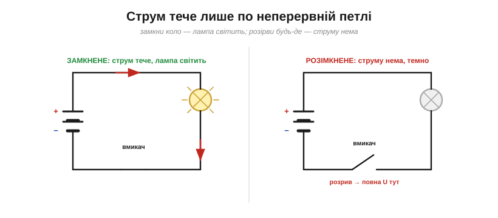
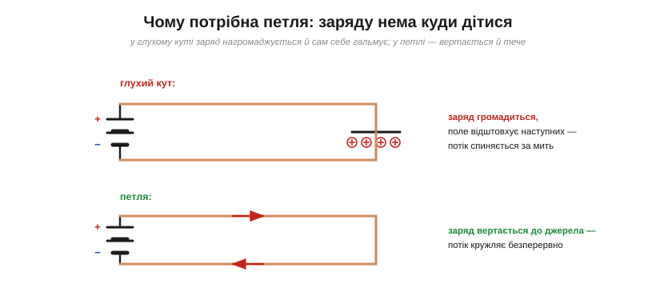
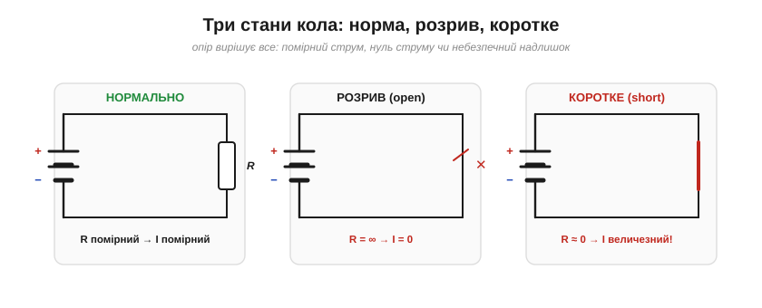
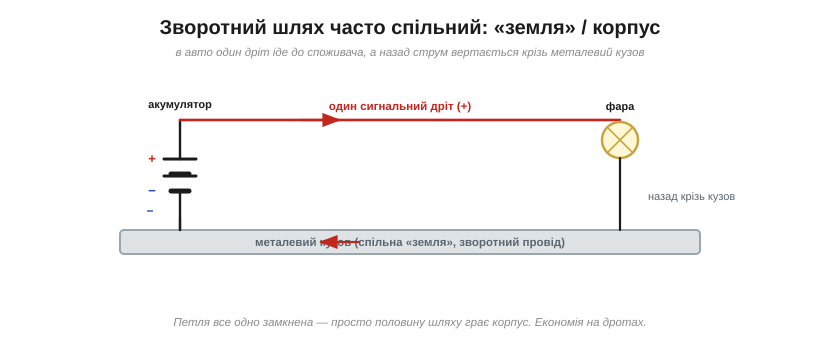

# Замкнене коло: чому струму потрібна петля

<preknowlist>
- [Напруга](topic:ph-electromagnetism/voltage) — «причина», що штовхає заряд по колу; різниця потенціалів між двома точками.
- [Електричний струм](topic:ph-electromagnetism/electric-current) — впорядкований потік заряду, той самий, що й біжить петлею.
- [Неперервність струму](topic:ph-electromagnetism/current-continuity) — заряд зберігається й не нагромаджується: скільки його вийшло з джерела, стільки й мусить вернутися.
- [Опір](topic:ph-condensed/resistance) — наскільки коло стримує струм; від нього залежать три стани петлі.
</preknowlist>

Перша умова струму — **причина**, тобто [напруга](topic:ph-electromagnetism/voltage). Та сама напруга ще нічого не гарантує: потрібна й друга умова — **шлях**. І не просто шлях, а **замкнена петля**, неперервна дорога від «плюса» джерела через усе коло й назад до «мінуса». Недарма саме слово **коло** (англ. *circuit*, від лат. *circuitus* — «обхід по колу») означає **замкнений контур**. Що напруга сама по собі безсила, видно з простого: у батарейки, яка лежить на столі, на клемах є повні півтора вольта, та доки до неї нічого не під'єднано, струм нульовий — причина є, а дороги для неї нема. Розберімо, чому без петлі струму не буває, навіть коли напруга є.

### Замкнене проти розімкненого

Найпростіший дослід усе показує.

*Ліворуч коло **замкнене** — петля неперервна, струм тече, лампа світить. Праворуч його **розірвано** (вмикач розімкнено) — і струму нема по **всьому** колу, лампа темна. Один-єдиний розрив де завгодно зупиняє струм усюди.*

Зверніть увагу: розрив **в одному** місці гасить струм у **всьому** колі — бо петля єдина, як на послідовній [гірлянді](topic:ph-electromagnetism/current-continuity). Саме так працює **вмикач**: він не «вмикає електрику», а просто **замикає або розриває** петлю. Замкнув — дав струмові дорогу; розімкнув — обірвав її.

І це робить вмикач куди важливішою деталлю, ніж здається. Будь-який **ключ** — від побутового тумблера й кнопки до реле та транзистора — це просто **керований розрив** петлі. Уся цифрова техніка, по суті, — мільярди мікроскопічних ключів, що блискавично замикають і рвуть крихітні кола (саме так працює [транзистор](topic:hw-components/field-control)). Тож «замкнути чи розімкнути петлю» — не дрібниця, а основа всього: від вимикача світла до процесора.

> 🔌 Самі вимикачі й кнопки бувають дуже різні — їх класифікують за **полюсами й напрямками** (SPST, SPDT…), а кнопки ще й за тим, замкнені вони в спокої чи ні (**NO/NC**): [Вимикачі й кнопки](topic:ph-electromagnetism/closed-circuit/comp-switches.md).

### Чому саме петля: заряду нема куди дітися

Чому ж дорога мусить **вертатися** до джерела? Бо заряд не може просто витекти в нікуди й там лишитися: [електричний заряд](topic:ph-electromagnetism/electric-current) зберігається й [не може нагромаджуватися](topic:ph-electromagnetism/current-continuity).

*У **глухому куті** заряд, дотікши до кінця, нагромаджується там; його власне поле дедалі дужче відштовхує наступні порції — і потік захлинається майже миттєво. У **петлі** ж заряд вертається до джерела, нічого не накопичується — і струм тече безперервно.*

Якби дріт обривався глухим кутом, перші ж електрони, дотікши до кінця, скупчилися б там — і їхнє зростальне поле відштовхнуло б тих, хто йде слідом, аж доки потік не спинився б (фактично кінець дроту повівся б як крихітний конденсатор, що миттю зарядився). Лише **замкнена петля** дає заряду повернутися, звідки він вийшов: [джерело-насос](topic:ph-electromagnetism/voltage) піднімає заряд, коло проводить його по колу й повертає на вхід насоса — і так без кінця. Заряд при цьому нікуди не дівається й не зникає: ті самі носії ходять по петлі знов і знов, а джерело лиш щоразу підштовхує їх, віддаючи енергію. Тобто в колі витрачається енергія, а не заряд, — тому струм і може текти як завгодно довго, поки живе джерело. **Немає зворотного шляху — немає сталого струму.**

Зауважмо й розгалуження. Петля не конче одна: якщо доріг кілька, на вузлах струм **розділяється** на гілки, та кожна гілка все одно є замкненою петлею до джерела й назад. Те, як саме струм розподіляється між [паралельними шляхами](topic:hw-analog/parallel-connection), — окреме питання; тут важливо лиш, що **кожна** ділянка, де тече струм, неодмінно входить у якусь замкнену петлю.

### Три стани кола: норма, розрив, коротке

Доля кола залежить від того, який **опір** трапиться струмові на петлі. Три характерні випадки варто розрізняти від самого початку — по суті це три точки на одній шкалі опору: нескінченний (розрив) → помірний (норма) → майже нульовий (коротке). І саме опір навантаження в «нормі» задає, скільки потече струму: більший опір — менший струм при тій самій напрузі, менший опір — більший.

***Норма**: у колі є помірне навантаження (опір) — тече помірний струм. **Розрив** (*open*): петля обірвана, опір нескінченний, струм нульовий — але вся напруга джерела «висить» на розриві. **Коротке** (*short*): петля майже без опору — струм велетенський і небезпечний.*

Ці три стани — абетка діагностики. **Розрив** (розімкнене коло, *open circuit*): десь обрив, опір нескінченний, струму нема — зате на місці розриву прикладена **вся** напруга джерела (бо коло більше ніде її не «спадає»). **Коротке замикання** (*short circuit*): навпаки, петля замкнулася майже без опору, і [напруга](topic:ph-electromagnetism/voltage) жене крізь неї величезний струм — звідси перегрів і небезпека.

Саме з цих трьох станів і виростають два щоденні прийоми пошуку несправностей. Щоб намацати **обрив**, мультиметром міряють напругу впоперек підозрілого місця: на справному, замкненому елементі падіння майже нема, а на розриві негайно з'явиться повна напруга джерела — там, де коло розірване, і «висить» увесь вольтаж, наче стрілка вказує на винного. А щоб просто дізнатися, чи петля взагалі неперервна, є режим **продзвонювання** (continuity): прилад пускає крізь коло крихітний струм і пищить, коли той проходить, — коло «дзвониться» від кінця до кінця. Обидва прийоми про одне: ціла петля чи розірвана.

Коротке замикання підстерігає з іншого боку — це головна причина пожеж і спалених джерел. Петля, що зімкнулася без навантаження, пропускає струм, обмежений хіба крихітним опором самих дротів, — а від такого струму в них виділяється лавина тепла. Саме проти цього й ставлять на вході **запобіжники** та автомати: щойно струм перевищить безпечну межу, вони навмисне рвуть петлю, обертаючи небезпечне коротке на нешкідливий розрив.

### Зворотний шлях буває спільним: «земля»

Петля мусить замкнутися — але обидва її проводи **не обов'язково** окремі. Дуже часто зворотну половину шляху виконує спільний провідник — корпус, шасі, шар міді на платі, який звуть **«землею»** (*ground*, GND).

*В автомобілі до кожного споживача йде лише **один** сигнальний дріт (+), а назад струм вертається крізь металевий **кузов**, що служить спільним зворотним проводом («землею»). Петля все одно замкнена — просто половину дороги грає корпус. Це заощаджує кілометри дроту.*

Це та сама «земля», що править за [опорний нуль потенціалу](topic:ph-electromagnetism/electric-potential): вона водночас і **точка відліку** напруг, і **спільний зворотний шлях** для струмів. На платі роль такого спільного проводу грає мідний полігон GND, в авто — кузов, у домашній проводці — **нейтраль** (робочий «нульовий» провід; а захисний провід заземлення PE — то інше: у нормі він струму не несе, лише в аварії). Головне пам'ятати: навіть коли «видно» лише один дріт, петля десь усе одно замикається — інакше струму б не було.

> 🔧 **Навіщо це.** Тому на схемах стільки символів «землі»: усі вони — одна спільна точка, до якої вертається струм і від якої міряють напруги. Якщо два пристрої «не бачать» спільної землі, струм між ними не замкнеться — класична причина, чому щось «не працює», хоч живлення є. Перше правило монтажу: подбай про спільний зворотний провід.

Тут варто застерегти від поширеної плутанини. «Земля» в колі (*signal/circuit ground*) — це **спільний нуль і зворотний провід** схеми; вона **не обов'язково** з'єднана з фізичною землею під ногами. А «земля» в розетці (*earth*, захисне заземлення) — окремий, справді закопаний у ґрунт провід для **безпеки**. Часто їх позначають схоже й навіть з'єднують, та плутати поняття не варто: одне — опорний нуль електроніки, інше — захист від ураження струмом.

І зворотний бік медалі: іноді петля замикається там, де ми **не хотіли**. Волога, бруд чи пил утворюють небажаний провідний місток, і струм тече «в обхід» — це **витік** (*leakage*). Через нього схема поводиться дивно, тихо розряджається батарея чи навіть б'є струмом корпус. Тож про петлі думають у два боки: щоб **потрібна** замкнулася, а **непотрібна** — ні.

Насамкінець — чесна заувага. Усе сказане стосується **сталого** (постійного) струму: йому конче потрібна суцільна провідна петля. У колах зі **змінним** струмом петлю може «замкнути» навіть [конденсатор](topic:hw-components/capacitor) чи простір між провідниками — через поле, без прямого дроту. Для постійного ж струму правило незрушне: **немає петлі — немає струму**.
